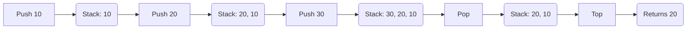
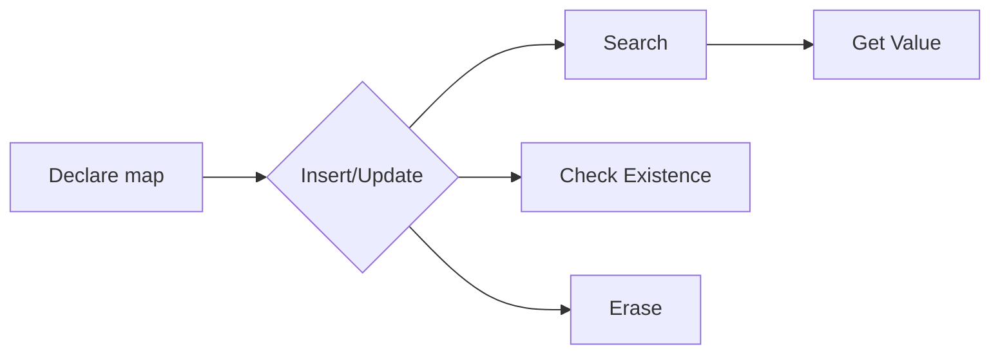

# <span style="color:#e67e22;">What we will learn in this post?</span>
<ul style='list-style-type: none; padding-left: 0;'>
<li><span style='color: #2980b9; font-size: 20px; font-weight: bold;'>👉</span> <span style='color: #2ecc71; font-size: 18px; font-weight: bold;'>The C++ Standard Template Library (STL)</span></li>
<li><span style='color: #2980b9; font-size: 20px; font-weight: bold;'>👉</span> <span style='color: #2ecc71; font-size: 18px; font-weight: bold;'>STL Algorithms</span></li>
<li><span style='color: #2980b9; font-size: 20px; font-weight: bold;'>👉</span> <span style='color: #2ecc71; font-size: 18px; font-weight: bold;'>STL Containers</span></li>
<li><span style='color: #2980b9; font-size: 20px; font-weight: bold;'>👉</span> <span style='color: #2ecc71; font-size: 18px; font-weight: bold;'>STL Vector</span></li>
<li><span style='color: #2980b9; font-size: 20px; font-weight: bold;'>👉</span> <span style='color: #2ecc71; font-size: 18px; font-weight: bold;'>STL Pair</span></li>
<li><span style='color: #2980b9; font-size: 20px; font-weight: bold;'>👉</span> <span style='color: #2ecc71; font-size: 18px; font-weight: bold;'>STL Set</span></li>
<li><span style='color: #2980b9; font-size: 20px; font-weight: bold;'>👉</span> <span style='color: #2ecc71; font-size: 18px; font-weight: bold;'>STL Multiset</span></li>
<li><span style='color: #2980b9; font-size: 20px; font-weight: bold;'>👉</span> <span style='color: #2ecc71; font-size: 18px; font-weight: bold;'>STL Stack</span></li>
<li><span style='color: #2980b9; font-size: 20px; font-weight: bold;'>👉</span> <span style='color: #2ecc71; font-size: 18px; font-weight: bold;'>STL Queue</span></li>
<li><span style='color: #2980b9; font-size: 20px; font-weight: bold;'>👉</span> <span style='color: #2ecc71; font-size: 18px; font-weight: bold;'>STL Priority Queue</span></li>
<li><span style='color: #2980b9; font-size: 20px; font-weight: bold;'>👉</span> <span style='color: #2ecc71; font-size: 18px; font-weight: bold;'>STL Deque</span></li>
<li><span style='color: #2980b9; font-size: 20px; font-weight: bold;'>👉</span> <span style='color: #2ecc71; font-size: 18px; font-weight: bold;'>STL List</span></li>
<li><span style='color: #2980b9; font-size: 20px; font-weight: bold;'>👉</span> <span style='color: #2ecc71; font-size: 18px; font-weight: bold;'>STL Forward List</span></li>
<li><span style='color: #2980b9; font-size: 20px; font-weight: bold;'>👉</span> <span style='color: #2ecc71; font-size: 18px; font-weight: bold;'>STL Map</span></li>
<li><span style='color: #2980b9; font-size: 20px; font-weight: bold;'>👉</span> <span style='color: #2ecc71; font-size: 18px; font-weight: bold;'>STL Multimap</span></li>
<li><span style='color: #2980b9; font-size: 20px; font-weight: bold;'>👉</span> <span style='color: #2ecc71; font-size: 18px; font-weight: bold;'>STL Bitset</span></li>
<li><span style='color: #2980b9; font-size: 20px; font-weight: bold;'>👉</span> <span style='color: #2ecc71; font-size: 18px; font-weight: bold;'>STL Unordered Sets</span></li>
<li><span style='color: #2980b9; font-size: 20px; font-weight: bold;'>👉</span> <span style='color: #2ecc71; font-size: 18px; font-weight: bold;'>STL Unordered Multiset</span></li>
<li><span style='color: #2980b9; font-size: 20px; font-weight: bold;'>👉</span> <span style='color: #2ecc71; font-size: 18px; font-weight: bold;'>STL Unordered Map</span></li>
<li><span style='color: #2980b9; font-size: 20px; font-weight: bold;'>👉</span> <span style='color: #2ecc71; font-size: 18px; font-weight: bold;'>STL Unordered Multimap</span></li>
<li><span style='color: #2980b9; font-size: 20px; font-weight: bold;'>👉</span> <span style='color: #2ecc71; font-size: 18px; font-weight: bold;'>Conclusion!</span></li>
</ul>

# <span style="color:#e67e22">Meet the C++ STL: Your Coding Best Friend! 🤗</span>

The C++ Standard Template Library (STL) is a powerful set of ready-to-use components that makes C++ programming much easier and more efficient. Think of it as a toolbox filled with pre-built tools for common tasks.  It's all about *generic programming*, meaning you can use the same code with different data types without rewriting everything.

## <span style="color:#2980b9">Key Components ✨</span>

The STL consists of three main parts:

### <span style="color:#8e44ad">Containers 📦</span>

These hold your data:  `std::vector` (like a dynamic array), `std::list` (a linked list), `std::map` (key-value pairs), `std::set` (unique elements).  For example:

```c++
std::vector<int> numbers = {1, 2, 3}; 
```

### <span style="color:#8e44ad">Algorithms ⚙️</span>

These perform operations on your data: `std::sort`, `std::find`, `std::copy`.  For example:

```c++
std::sort(numbers.begin(), numbers.end());
```

### <span style="color:#8e44ad">Iterators ➡️</span>

These act like pointers, allowing algorithms to traverse containers.


## <span style="color:#2980b9">Advantages of Using STL 💪</span>

*   **Code Reusability:** Write once, use many times with different data types.
*   **Efficiency:**  Highly optimized algorithms and data structures.
*   **Readability:**  Makes your code cleaner and easier to understand.


## <span style="color:#2980b9">Example: Sorting a Vector</span>

```c++
#include <iostream>
#include <vector>
#include <algorithm>

int main() {
  std::vector<int> myVector = {5, 2, 8, 1, 9};
  std::sort(myVector.begin(), myVector.end()); //Uses STL's sort algorithm
  for (int x : myVector) std::cout << x << " "; //Output: 1 2 5 8 9
  return 0;
}
```

Want to learn more? Check out these resources:

* [cppreference.com](https://en.cppreference.com/w/cpp/header) (Comprehensive STL documentation)
* [LearnCpp.com](https://www.learncpp.com/) (Great C++ tutorials)


This simple example showcases the power and ease of using the STL. It's a game-changer for C++ developers! 🎉


# <span style="color:#e67e22">STL Algorithms: Your Coding Toolkit ✨</span>

The C++ Standard Template Library (STL) provides a rich set of algorithms that simplify common programming tasks.  These algorithms work on various data structures like vectors and arrays, boosting efficiency and readability.

## <span style="color:#2980b9">Common Algorithms & Use Cases</span>

Let's explore some popular ones:

### <span style="color:#8e44ad">Searching & Sorting 🔎</span>

* **`std::find`**: Locates the first occurrence of a value.  `std::find(vec.begin(), vec.end(), 5);` finds the first `5` in `vec`.
* **`std::sort`**: Sorts a range of elements.  `std::sort(vec.begin(), vec.end());` sorts `vec` in ascending order.
* **`std::binary_search`**: Efficiently searches a *sorted* range. Requires a sorted container.


### <span style="color:#8e44ad">Modifying Ranges 🛠️</span>

* **`std::transform`**: Applies a function to each element. `std::transform(vec.begin(), vec.end(), vec.begin(), [](int x){ return x*2; });` doubles each element in `vec`.
* **`std::copy`**: Copies elements from one range to another.
* **`std::remove`**: Removes elements matching a specific value (Note: doesn't actually resize the container, just moves elements).


## <span style="color:#2980b9">Example: Finding the Maximum Element 🥇</span>

```c++
#include <algorithm>
#include <vector>
#include <iostream>

int main() {
  std::vector<int> numbers = {1, 5, 2, 8, 3};
  int max_element = *std::max_element(numbers.begin(), numbers.end()); //Find the max element in the vector.
  std::cout << "Maximum element: " << max_element << std::endl; //Prints the maximum element to the console.
  return 0;
}
```

This simple example demonstrates how easily you can find the maximum element in a vector using `std::max_element`.


For more in-depth information, explore these resources:

* [cppreference](https://en.cppreference.com/w/cpp/algorithm)


Remember to include `<algorithm>` in your code to use these powerful tools!  Happy coding! 🎉


# <span style="color:#e67e22">STL Containers: Your Data's New Home 🏠</span>

The Standard Template Library (STL) in C++ offers various containers to store and manage data efficiently.  Let's explore some key players!


## <span style="color:#2980b9">Sequence Containers ➡️</span>

These containers store elements in a specific order.

### <span style="color:#8e44ad">`std::vector` 💪</span>

*   **Type:** Dynamic array.  Resizes automatically.
*   **Use Case:** When you need a dynamic array that can grow or shrink as needed.
*   **Example:** `std::vector<int> numbers = {1, 2, 3};`


### <span style="color:#8e44ad">`std::list` 🔗</span>

*   **Type:** Doubly linked list.  Efficient insertions and deletions anywhere.
*   **Use Case:** Frequent insertions/deletions in the middle. Slower random access than `vector`.
*   **Example:** `std::list<std::string> names;`


### <span style="color:#8e44ad">`std::deque` 🔄</span>

*   **Type:** Double-ended queue.  Efficient insertions/deletions at both ends.
*   **Use Case:**  When you need fast access to both beginning and end.
*   **Example:** `std::deque<int> queue;`


## <span style="color:#2980b9">Associative Containers 🗝️</span>

These containers store elements in a key-value pair, allowing fast lookups.


### <span style="color:#8e44ad">`std::map` 🗺️</span>

*   **Type:**  Ordered map (keys are sorted).
*   **Use Case:** When you need to store data and quickly access it using a unique key.
*   **Example:** `std::map<std::string, int> ages;`


### <span style="color:#8e44ad">`std::unordered_map` 🎲</span>

*   **Type:** Unordered map (faster lookups on average than `map`).
*   **Use Case:**  When order doesn't matter, and you prioritize fast lookups.
*   **Example:** `std::unordered_map<std::string, int> ages;`


## <span style="color:#2980b9">Other Containers 📦</span>

### <span style="color:#8e44ad">`std::set` 🗄️</span>

Stores unique elements in sorted order.

### <span style="color:#8e44ad">`std::unordered_set` 🎲</span>

Stores unique elements, unordered (faster lookups than `set`).


For more detailed information and examples, check out the following resource: [cppreference.com](https://en.cppreference.com/w/cpp/container)


Remember to choose the container that best suits your needs based on the type of data and the operations you'll be performing!  Happy coding! 😊


Error: An error occurred while processing your request. Please try again later.

# <span style="color:#e67e22">STL Pair: A Handy Duo 👯‍♀️</span>

The Standard Template Library (STL) `pair` is a simple yet powerful tool.  It's like a tiny container that holds *two* elements of potentially different data types. Think of it as a convenient way to group related data together.


## <span style="color:#2980b9">Purpose of `pair`</span>

Its main purpose is to return or store two values as a single unit. This is incredibly useful in various scenarios, such as:

* Returning multiple values from a function.
* Storing key-value pairs (although `map` is often preferred for larger collections).
* Representing coordinates (x, y).


## <span style="color:#2980b9">Using `pair`</span>

### <span style="color:#8e44ad">Declaration and Initialization</span>

```c++
#include <iostream>
#include <utility> //for pair

int main() {
  std::pair<int, std::string> person; // Declares a pair of (int, string)
  person.first = 25;  // Access the first element
  person.second = "Alice"; //Access the second element

  std::pair<double, double> point = {3.14, 2.71}; //Initialize directly

  std::cout << "Age: " << person.first << ", Name: " << person.second << std::endl;
  std::cout << "Point: (" << point.first << ", " << point.second << ")" << std::endl;
  return 0;
}
```

### <span style="color:#8e44ad">Make_pair Function</span>

You can also use `std::make_pair` for simpler initialization:

```c++
#include <utility>
#include <iostream>

int main() {
    auto p = std::make_pair(10, "ten"); //auto deduces the type
    std::cout << p.first << " " << p.second << std::endl;
    return 0;
}
```

For more information, check out these resources:

* [cppreference](https://en.cppreference.com/w/cpp/utility/pair)


This makes managing related data much cleaner and easier!  Remember that the `pair` elements are accessed using `.first` and `.second`.  Enjoy using this handy tool! 🎉


# <span style="color:#e67e22">STL Set: Your Ordered Collection Friend 🤝</span>

The C++ Standard Template Library (STL) provides the `set` container, a powerful tool for storing *unique* elements in a sorted order.  Think of it like a well-organized toolbox where you can only keep one of each tool, and they're always neatly arranged!


## <span style="color:#2980b9">Key Properties ✨</span>

*   **Uniqueness:**  Only one instance of each element is allowed.  Duplicates are automatically ignored.
*   **Sorted Order:** Elements are always kept in ascending order based on their natural ordering (or a custom comparator).
*   **Efficient Search:** Finding elements is very fast thanks to its underlying tree-based implementation (usually a red-black tree).


### <span style="color:#8e44ad">Example Usage</span>

```c++
#include <iostream>
#include <set>

int main() {
  std::set<int> mySet = {5, 2, 8, 2, 1, 8}; // Duplicates are ignored

  for (int x : mySet) {
    std::cout << x << " "; // Output: 1 2 5 8
  }
  std::cout << std::endl;

  mySet.insert(7); // Adding a new element

  if (mySet.count(5)) { //Check if element exists
    std::cout << "5 is present!" << std::endl;
  }

  return 0;
}
```

## <span style="color:#2980b9">Common Operations ⚙️</span>

*   `insert()`: Adds an element.
*   `find()`: Searches for an element.
*   `count()`: Checks if an element exists.
*   `erase()`: Removes an element.
*   `size()`: Returns the number of elements.


[More information on STL Sets](https://en.cppreference.com/w/cpp/container/set)


This simple structure makes `set` incredibly useful when you need to maintain a collection of unique, sorted items efficiently. Remember to include `<set>` in your code!


# <span style="color:#e67e22">Understanding STL multiset in C++ 🧡</span>

## <span style="color:#2980b9">Multiset vs. Set 🤔</span>

The C++ Standard Template Library (STL) provides `set` and `multiset` containers, both storing unique elements, but with a key difference:

*   **`set`**:  Stores *only unique* elements.  If you try to insert a duplicate, it's ignored. Think of it like a phone book – only one entry per person.
*   **`multiset`**: Allows *duplicate* elements. You can add the same element multiple times. Imagine a list of student scores – multiple students might have the same score.

### <span style="color:#8e44ad">Example illustrating the difference</span>

```c++
#include <iostream>
#include <set>
#include <multiset>

int main() {
    std::set<int> mySet = {1, 2, 2, 3}; // Only {1, 2, 3} will be stored
    std::multiset<int> myMultiset = {1, 2, 2, 3}; // {1, 2, 2, 3} will be stored

    std::cout << "Set size: " << mySet.size() << std::endl; // Output: 3
    std::cout << "Multiset size: " << myMultiset.size() << std::endl; // Output: 4
    return 0;
}
```


## <span style="color:#2980b9">Using `multiset` 🤩</span>

`multiset` offers similar functionalities to `set` –  `insert()`, `erase()`, `find()`, `count()` etc.  `count()` is particularly useful for checking the number of occurrences of an element.

```c++
#include <iostream>
#include <multiset>

int main() {
    std::multiset<std::string> names = {"Alice", "Bob", "Alice", "Charlie", "Bob"};
    names.insert("David");
    std::cout << "Number of 'Alice': " << names.count("Alice") << std::endl; // Output: 2
    return 0;
}

```

For more detailed information and advanced functionalities, refer to: [cplusplus.com](https://www.cplusplus.com/reference/set/multiset/)


**In short**: Use `set` when uniqueness is crucial; use `multiset` when duplicates are allowed and need to be tracked.  Choose wisely based on your application's needs!


# <span style="color:#e67e22">STL Stack: A Friendly Introduction 🤝</span>

The Standard Template Library (STL) provides a `stack` container, which is a *Last-In, First-Out (LIFO)* data structure.  Think of a stack of plates – you can only add (push) to the top and remove (pop) from the top.

## <span style="color:#2980b9">Key Operations ⚙️</span>

*   **`push(element)`:** Adds an element to the top of the stack.
*   **`pop()`:** Removes the top element.  *(Note:  It doesn't return the removed element.)*
*   **`top()`:** Returns a reference to the top element (without removing it).
*   **`empty()`:** Checks if the stack is empty.
*   **`size()`:** Returns the number of elements.


### <span style="color:#8e44ad">Example Implementation ✨</span>

```c++
#include <iostream>
#include <stack>

int main() {
  std::stack<int> myStack;
  myStack.push(10);
  myStack.push(20);
  myStack.push(30);

  std::cout << "Top element: " << myStack.top() << std::endl; // Output: 30
  myStack.pop();
  std::cout << "Size: " << myStack.size() << std::endl;     // Output: 2
  return 0;
}
```

## <span style="color:#2980b9">Visual Representation 📊</span>



For more details on the STL stack and other containers, check out:  [cppreference.com](https://en.cppreference.com/w/cpp/container/stack)


Remember that `pop()` doesn't return the value it removes. You need `top()` to access that value *before* popping.  Always check if a stack is empty using `empty()` before performing operations like `pop()` or `top()` to prevent errors!


# <span style="color:#e67e22">STL Queue: A First Look 队列</span> 🧡

The Standard Template Library (STL) provides a `queue` container, a *First-In, First-Out (FIFO)* data structure.  Think of it like a real-world queue at a store – the first person in line is the first person served.

## <span style="color:#2980b9">Key Features ✨</span>

*   **FIFO Ordering:** Elements are added to the rear ( `push()` ) and removed from the front ( `pop()` ).
*   **Template-based:** Works with various data types ( `int`, `string`, custom classes).
*   **Easy to Use:** Simple and intuitive member functions for managing the queue.


### <span style="color:#8e44ad">Basic Usage</span>

```cpp
#include <iostream>
#include <queue>

int main() {
  std::queue<int> q;
  q.push(10);
  q.push(20);
  q.push(30);

  std::cout << "Front: " << q.front() << std::endl; // Output: 10
  q.pop();
  std::cout << "Front after pop: " << q.front() << std::endl; // Output: 20
  return 0;
}
```

## <span style="color:#2980b9">Diagrammatic Representation 📊</span>

```mermaid
graph LR
A[Enqueue (push)] --> B{Queue};
B --> C[Dequeue (pop)];
```

This diagram shows how elements are added and removed from the queue.

* **Enqueue:** Adding elements to the rear.
* **Dequeue:** Removing elements from the front.


## <span style="color:#2980b9">More Information 📚</span>

For a deeper dive into STL queues and other containers, check out these resources:

* [cppreference.com](https://en.cppreference.com/w/cpp/container/queue)  (Highly recommended!)


Remember to `#include <queue>` in your code to use the `std::queue` container.  Enjoy using this powerful tool! 🎉


# <span style="color:#e67e22">STL Priority Queue: A Friendly Guide 🤗</span>

The C++ Standard Template Library (STL) offers a `priority_queue`, a container that keeps elements sorted based on their priority.  Think of it like a queue at a hospital – the most urgent cases go first!

## <span style="color:#2980b9">Key Properties ✨</span>

*   **Automatic Sorting:**  Elements are automatically arranged, highest priority at the front.
*   **Access Only the Highest Priority:** You can only access (and remove) the top element, not arbitrary elements.
*   **Default Behavior:**  By default, it uses `std::less` (max-heap), meaning the largest element is at the top. You can change this.

### <span style="color:#8e44ad">Example: A Max-Heap</span>

```cpp
#include <iostream>
#include <queue>

int main() {
  std::priority_queue<int> pq;
  pq.push(10);
  pq.push(5);
  pq.push(15);

  std::cout << "Top element: " << pq.top() << std::endl; // Output: 15
  pq.pop();
  std::cout << "New top element: " << pq.top() << std::endl; // Output: 10
  return 0;
}
```

## <span style="color:#2980b9">Customizing Priority ⚙️</span>

You can change the comparison function to create a min-heap (smallest element first) using a custom comparator:

```cpp
#include <functional>
std::priority_queue<int, std::vector<int>, std::greater<int>> min_pq;
```

This uses `std::greater` to define the comparison function, making it a min-heap.


## <span style="color:#2980b9">Effective Usage 🚀</span>

*   Use `priority_queue` for tasks needing efficient access to the highest (or lowest) priority element.
*   Consider custom comparators for specific sorting needs.
*   Remember that `pop()` removes the top element, and `top()` accesses it without removal.

For more in-depth information, check out these resources:

* [cppreference](https://en.cppreference.com/w/cpp/container/priority_queue)


Remember to include `<queue>` and potentially `<functional>` for custom comparators!  Happy coding! 😊


# <span style="color:#e67e22">Meet the STL `deque`!</span> 🤝

The C++ Standard Template Library (STL) offers a powerful container called `deque` (pronounced "deck"), short for *double-ended queue*.  Think of it as a supercharged array that allows efficient additions and removals from *both* ends.  Unlike a standard array,  `deque` doesn't need to reallocate memory as frequently when you add elements.

## <span style="color:#2980b9">Key Characteristics ✨</span>

* **Random Access:** You can access any element directly using its index, just like with arrays (`myDeque[3]`).
* **Fast Insertion/Deletion at Ends:** Adding or removing elements from the beginning or end is very quick.  This is where `deque` shines!
* **Dynamic Size:**  The `deque` automatically grows or shrinks as needed.
* **Memory Management:**  `deque` handles memory allocation more efficiently than vectors for insertions at the beginning.

### <span style="color:#8e44ad">When to Use `deque` 🤔</span>

* Implementing queues or stacks.
* Storing data where you frequently add or remove elements from both ends.
* Situations requiring random access but also efficient insertion/deletion at the ends.


## <span style="color:#2980b9">Usage Example 💻</span>

```c++
#include <iostream>
#include <deque>

int main() {
  std::deque<int> myDeque;
  myDeque.push_back(10); // Add to the back
  myDeque.push_front(5); // Add to the front
  myDeque.pop_back();   // Remove from the back

  for (int x : myDeque) std::cout << x << " "; // Output: 5
  return 0;
}
```

## <span style="color:#2980b9">Visual Representation 📊</span>

```mermaid
graph LR
    A[deque] --> B(push_front());
    A --> C(push_back());
    A --> D(pop_front());
    A --> E(pop_back());
```

For more detailed information and advanced usage, check out these resources:

* [cplusplus.com deque](https://www.cplusplus.com/reference/deque/deque/)


Remember, the best container choice depends on your specific needs.  `deque` is a fantastic option when you need the speed of both ends access combined with random access capabilities.


Error: An error occurred while processing your request. Please try again later.

# <span style="color:#e67e22">STL Forward List: A Simple Linked List</span> ➡️

The STL `forward_list` is a singly linked list, meaning each element points only to the *next* one.  This makes it memory-efficient and fast for insertions and deletions *at the beginning* or *before* an element.  However, it lacks random access (you can't directly jump to the 5th element).

## <span style="color:#2980b9">Key Features ✨</span>

* **Singly Linked:**  Elements are chained together in a single direction.
* **Efficient Insertions/Deletions:**  Fast at the front or before an element.
* **No Random Access:** You can only traverse sequentially.
* **Memory Efficient:** Uses less memory than other containers like `vector` for frequent insertions/deletions.


### <span style="color:#8e44ad">Usage Example 💻</span>

```c++
#include <iostream>
#include <forward_list>

int main() {
  std::forward_list<int> myList = {1, 2, 3};
  myList.push_front(0); // Add 0 to the beginning
  myList.insert_after(myList.begin(), 4); //Add 4 after the first element

  for (int x : myList) {
    std::cout << x << " ";  // Output: 0 4 1 2 3
  }
  std::cout << std::endl;
  return 0;
}
```

## <span style="color:#2980b9">When to Use 🤔</span>

Use `forward_list` when:

* You need frequent insertions or deletions at the beginning or before an element.
* Memory efficiency is crucial.
* Random access is not required.

## <span style="color:#2980b9">Limitations ⚠️</span>

* No random access.  Traversing is sequential only.
* Less efficient for operations requiring searching or accessing elements by index.


[More on `forward_list`](https://en.cppreference.com/w/cpp/container/forward_list)  (Learn more!)


---

**In short:**  `forward_list` is a great choice for scenarios prioritizing speed of insertion/deletion at the beginning and memory efficiency, even if you give up direct access to elements by index. Remember to choose the right tool for the job!


# <span style="color:#e67e22">STL Map: Your Key-Value Store 🔑</span>

The STL (Standard Template Library) `map` is like a dictionary.  It stores data in *key-value pairs*, where each key is unique and associated with a specific value.  Think of it as a phone book: names (keys) are linked to phone numbers (values).

## <span style="color:#2980b9">Key Characteristics ✨</span>

*   **Unique Keys:**  Each key must be unique; trying to insert a duplicate key will overwrite the existing entry.
*   **Ordered Keys:** Keys are automatically sorted based on their comparison (usually lexicographically for strings, numerically for numbers).
*   **Efficient Lookups:** Finding a value associated with a specific key is very fast (logarithmic time complexity).


### <span style="color:#8e44ad">Example: Storing Student Grades 📝</span>

```cpp
#include <iostream>
#include <map>

int main() {
  std::map<std::string, int> grades; // map: key (string) -> value (int)

  grades["Alice"] = 90;
  grades["Bob"] = 85;
  grades["Charlie"] = 95;

  std::cout << "Alice's grade: " << grades["Alice"] << std::endl; // Output: 90

  return 0;
}
```

## <span style="color:#2980b9">Using a Map 🗺️</span>

*   **`map<KeyType, ValueType> myMap;`**: Declares a map.
*   **`myMap[key] = value;`**: Inserts or updates a key-value pair.
*   **`myMap.find(key);`**: Searches for a key and returns an iterator.
*   **`myMap.count(key);`**: Checks if a key exists.
*   **`myMap.erase(key);`**: Removes a key-value pair.

**Note:**  For more advanced usage (iterators, etc.), refer to the [cppreference documentation](https://en.cppreference.com/w/cpp/container/map).





This simple guide provides a basic understanding of STL maps.  Remember to include `<map>` in your code!


# <span style="color:#e67e22">STL Multimap Explained 😊</span>

## <span style="color:#2980b9">Multimap vs. Map 🗺️</span>

Both `std::map` and `std::multimap` are associative containers in the C++ Standard Template Library (STL), storing key-value pairs.  The crucial difference lies in how they handle duplicate keys:

* **`std::map`**:  Allows only *one* value for each unique key.  Think of it like a dictionary – each word (key) has only one definition (value).
* **`std::multimap`**:  Allows *multiple* values for the same key.  Imagine a phone book; multiple people might have the same last name (key).

### <span style="color:#8e44ad">Illustrative Example</span>

Let's see them in action:

```c++
#include <iostream>
#include <map>
#include <multimap>

int main() {
  std::map<std::string, int> myMap;
  myMap["apple"] = 1;
  myMap["banana"] = 2;
  myMap["apple"] = 3; // Overwrites the previous value for "apple"

  std::multimap<std::string, int> myMultimap;
  myMultimap.insert({"apple", 1});
  myMultimap.insert({"banana", 2});
  myMultimap.insert({"apple", 3}); // Adds another "apple" entry

  std::cout << "Map size: " << myMap.size() << std::endl; // Output: 2
  std::cout << "Multimap size: " << myMultimap.size() << std::endl; // Output: 3

  return 0;
}
```

## <span style="color:#2980b9">Key Differences Summarized 📝</span>

* **Duplicate Keys:**  `map` - No; `multimap` - Yes.
* **Size:** `map`'s size reflects unique keys; `multimap`'s size reflects *all* entries.
* **Use Cases:** Use `map` when one value per key is needed; use `multimap` when multiple values per key are possible.


For further reading and more in-depth explanations, consider exploring these resources:

* [cppreference.com](https://en.cppreference.com/w/cpp/container) (Search for `map` and `multimap`)

Remember to include `<map>` and `<multimap>` headers in your code!  Happy coding! 🎉


Error: An error occurred while processing your request. Please try again later.

Error: An error occurred while processing your request. Please try again later.

# <span style="color:#e67e22">STL Unordered Multiset: A Friendly Introduction 🤗</span>

The C++ Standard Template Library (STL) provides `unordered_multiset`, a powerful container for storing *unordered* collections of elements, allowing *duplicates*.  Think of it like a bag of marbles – you can have multiple marbles of the same color!

## <span style="color:#2980b9">Key Features ✨</span>

*   **Unordered:** Elements aren't stored in any particular order.  This makes insertion and retrieval very fast (average O(1) time complexity!).
*   **Allows Duplicates:**  Unlike `unordered_set`,  `unordered_multiset` happily accepts multiple instances of the same element.
*   **Hash Table Based:**  It uses a hash table for efficient storage and access.


### <span style="color:#8e44ad">Example Usage 💡</span>

```c++
#include <iostream>
#include <unordered_set>

int main() {
  std::unordered_multiset<int> myMultiset = {1, 2, 2, 3, 3, 3};
  myMultiset.insert(2); // Add another 2

  std::cout << "Size: " << myMultiset.size() << std::endl; // Output: 7
  std::cout << "Count of 2s: " << myMultiset.count(2) << std::endl; // Output: 3

  return 0;
}
```

## <span style="color:#2980b9">When to Use it 🤔</span>

Use `unordered_multiset` when:

*   You need fast insertion and deletion of elements.
*   You need to allow duplicate elements.
*   The order of elements doesn't matter.


[More information on `unordered_multiset`](https://en.cppreference.com/w/cpp/container/unordered_multiset)


This simple guide gives you a basic understanding.  Explore the link above for a deeper dive!


# <span style="color:#e67e22">STL Unordered Map: A Friendly Guide 🤗</span>

## <span style="color:#2980b9">What is it?</span>

An `unordered_map` is like a super-powered dictionary!  It lets you store key-value pairs, just like a regular dictionary, but it's much faster for looking things up.  Think of it as a super-organized filing cabinet where you can quickly find a file using its name (the *key*) to access its contents (the *value*).  It uses a *hash table* under the hood for efficient access.

### <span style="color:#8e44ad">Key Properties:</span>

*   **Fast lookups:** Finding a value using its key is incredibly fast (on average O(1) time complexity).
*   **Unordered:**  Elements aren't stored in any specific order.
*   **Unique keys:** Each key must be unique; you can't have two entries with the same key.
*   **Dynamic size:** It automatically grows as you add more elements.


## <span style="color:#2980b9">Usage Examples ✨</span>

```cpp
#include <iostream>
#include <unordered_map>

int main() {
  std::unordered_map<std::string, int> ages; // Map strings (names) to ints (ages)

  ages["Alice"] = 30;
  ages["Bob"] = 25;

  std::cout << "Alice's age: " << ages["Alice"] << std::endl; // Output: 30

  if (ages.count("Charlie")) { // Check if a key exists
    std::cout << "Charlie's age is found!" << std::endl;
  } else {
    std::cout << "Charlie's age is not found!" << std::endl; //This will be printed
  }
  return 0;
}
```

## <span style="color:#2980b9">More Resources 📚</span>

For a deeper dive into `unordered_map` and other STL containers, check out these resources:

*   [cppreference.com](https://en.cppreference.com/w/cpp/container/unordered_map)  (Comprehensive documentation)
*   [LearnCpp.com](https://www.learncpp.com/) (Excellent C++ tutorials)


Remember that while `unordered_map` excels at fast lookups, it might not be the best choice if you need elements to be sorted or if you need to iterate through them in a specific order.  In those cases, consider using `std::map` instead.


Error: An error occurred while processing your request. Please try again later.

<h1><span style='color:#e67e22'>Conclusion</span></h1>

And there you have it!  We've covered a lot of ground today, and hopefully, you found it helpful and interesting. 😊  But the conversation doesn't have to end here! We'd love to hear your thoughts, feedback, and any brilliant suggestions you might have.  What did you think of this post?  What other topics would you like us to explore? Let us know in the comments below! 👇 We're always looking to improve and learn from your awesome insights! ✨


