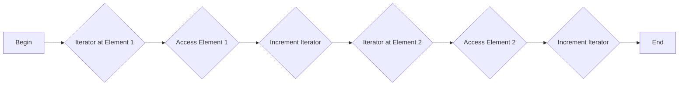
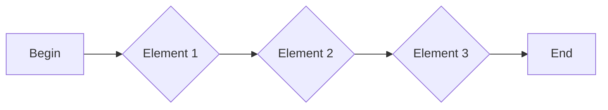
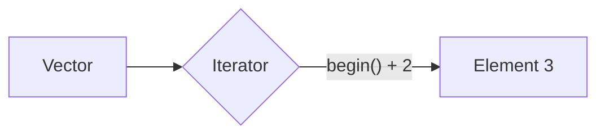

# <span style="color:#e67e22;">What we will learn in this post?</span>
<ul style='list-style-type: none; padding-left: 0;'>
<li><span style='color: #2980b9; font-size: 20px; font-weight: bold;'>👉</span> <span style='color: #2ecc71; font-size: 18px; font-weight: bold;'>Introduction to C++ Iterators</span></li>
<li><span style='color: #2980b9; font-size: 20px; font-weight: bold;'>👉</span> <span style='color: #2ecc71; font-size: 18px; font-weight: bold;'>C++ Input Iterators</span></li>
<li><span style='color: #2980b9; font-size: 20px; font-weight: bold;'>👉</span> <span style='color: #2ecc71; font-size: 18px; font-weight: bold;'>C++ Output Iterators</span></li>
<li><span style='color: #2980b9; font-size: 20px; font-weight: bold;'>👉</span> <span style='color: #2ecc71; font-size: 18px; font-weight: bold;'>C++ Forward Iterators</span></li>
<li><span style='color: #2980b9; font-size: 20px; font-weight: bold;'>👉</span> <span style='color: #2ecc71; font-size: 18px; font-weight: bold;'>C++ Bidirectional Iterators</span></li>
<li><span style='color: #2980b9; font-size: 20px; font-weight: bold;'>👉</span> <span style='color: #2ecc71; font-size: 18px; font-weight: bold;'>C++ Random Access Iterators</span></li>
<li><span style='color: #2980b9; font-size: 20px; font-weight: bold;'>👉</span> <span style='color: #2ecc71; font-size: 18px; font-weight: bold;'>C++ istream_iterator and ostream_iterator</span></li>
<li><span style='color: #2980b9; font-size: 20px; font-weight: bold;'>👉</span> <span style='color: #2ecc71; font-size: 18px; font-weight: bold;'>Difference between C++ Iterators and Pointers</span></li>
<li><span style='color: #2980b9; font-size: 20px; font-weight: bold;'>👉</span> <span style='color: #2ecc71; font-size: 18px; font-weight: bold;'>Conclusion!</span></li>
</ul>

# <span style="color:#e67e22">C++ Iterators: Your Container Keys 🔑</span>

Imagine you have a treasure chest (a C++ container like `std::vector` or `std::list`).  To access the gold coins (elements) inside, you need a key – that's where iterators come in!

## <span style="color:#2980b9">What are Iterators?</span>

Iterators are like smart pointers. They let you traverse (move through) elements in a container *without* needing to know the container's internal structure.  They provide a *uniform* way to access elements, regardless of whether your container is an array, a list, or something else.

### <span style="color:#8e44ad">Types of Iterators</span>

There are different types of iterators, each with varying capabilities:

* **Input iterators:**  Read-only, single-pass (like a one-way street ➡️).
* **Output iterators:** Write-only.
* **Forward iterators:** Read and write, single-pass.
* **Bidirectional iterators:** Read and write, can move forward and backward 🔄.
* **Random access iterators:**  Read and write, can jump to any position directly (like a random-access memory address 📍).


## <span style="color:#2980b9">Example: Using Iterators with `std::vector`</span>

```c++
#include <iostream>
#include <vector>

int main() {
  std::vector<int> numbers = {1, 2, 3, 4, 5};

  //Begin iterator points to the first element.
  for (auto it = numbers.begin(); it != numbers.end(); ++it) {
    std::cout << *it << " "; // *it dereferences the iterator to get the value.
  }
  std::cout << std::endl; // Output: 1 2 3 4 5

  return 0;
}
```

This code uses `numbers.begin()` to get an iterator pointing to the first element and `numbers.end()` to mark the end. The loop iterates, incrementing the iterator (`++it`) and accessing each element using the dereference operator (`*it`).


## <span style="color:#2980b9">Why Use Iterators?</span>

* **Generic algorithms:**  Algorithms like `std::sort` and `std::find` work on *any* container with iterators.
* **Abstraction:**  You don't need to worry about the container's implementation details.
* **Efficiency:**  Iterators can be optimized for specific container types.

For more information, check out these resources:

* [cppreference.com](https://en.cppreference.com/w/cpp/iterator) (Extensive C++ iterator documentation)


Remember: Iterators are powerful tools for working with C++ containers efficiently and generically! ✨


# <span style="color:#e67e22">Input Iterators in C++: A Friendly Guide 😄</span>

Imagine a conveyor belt delivering items one by one.  That's similar to how input iterators work in C++. They're like one-way streets for data; you can only move forward, reading elements sequentially.  You can't go backward or modify what you read.

## <span style="color:#2980b9">How They Work ⚙️</span>

Input iterators provide a way to access elements from a sequence, such as a vector, without knowing its underlying implementation. They use `operator*` to get the current element and `operator++` to move to the next.

### <span style="color:#8e44ad">Example: Reading from a `std::vector`</span>

```c++
#include <iostream>
#include <vector>

int main() {
  std::vector<int> numbers = {1, 2, 3, 4, 5};
  std::vector<int>::iterator it = numbers.begin(); //Get the iterator at the beginning.

  while (it != numbers.end()) { // Iterate until end.
    std::cout << *it << " ";  // Access the element using *it
    ++it;                    // Move to the next element.
  }
  std::cout << std::endl;
  return 0;
}
```

This code iterates through the `numbers` vector, printing each element.  The iterator `it` acts as our "conveyor belt pointer."

## <span style="color:#2980b9">Key Characteristics 🔑</span>

*   **Read-only:** You can only read elements, not modify them.
*   **Sequential access:** You must traverse the sequence from beginning to end.
*   **Single pass:**  Generally, you can only iterate through once. After the iteration, the iterator is invalidated

[More information on iterators](https://en.cppreference.com/w/cpp/iterator)


---

**Visual Representation:**



This diagram shows the simple sequential movement of the input iterator through the data.  Each step involves accessing and then moving to the next element.


# <span style="color:#e67e22">Output Iterators Explained ✨</span>

Output iterators are like one-way streets for your data in C++.  They let you *send* data to a destination, but you can't *receive* data back from them. Think of it like a printer: you send data to be printed, but you can't get the printed document back through the printer itself.


## <span style="color:#2980b9">How They Work 🤔</span>

Output iterators are used with algorithms that only need to write data, such as `std::copy` or `std::transform`. They don't support operations like dereferencing (`*`) for reading or random access using indexing (`[]`).  This restriction makes them efficient for writing data to files, streams, or other destinations.

### <span style="color:#8e44ad">Example: Writing to a Vector</span>

```c++
#include <iostream>
#include <vector>
#include <algorithm>

int main() {
  std::vector<int> vec;
  std::vector<int> source = {1, 2, 3, 4, 5};

  // vec.begin() is an output iterator
  std::copy(source.begin(), source.end(), std::back_inserter(vec)); //back_inserter is crucial here

  for (int x : vec) std::cout << x << " "; // Output: 1 2 3 4 5
  std::cout << std::endl;
  return 0;
}
```

*   `std::back_inserter(vec)` creates an output iterator that adds elements to the back of the `vec` vector.

## <span style="color:#2980b9">Usage Scenarios 🎯</span>

*   Writing data to files.
*   Sending data to a network stream.
*   Populating a container.

Remember that `std::back_inserter` is key when using output iterators with containers like `std::vector`.  For more details, check out [cppreference](https://en.cppreference.com/w/cpp/iterator).


---

**In short:** Output iterators are efficient, unidirectional tools for sending data to a destination.  They're ideal for writing operations where reading is not needed.


# <span style="color:#e67e22">Forward Iterators in C++: A Friendly Guide 😀</span>

Forward iterators are a type of iterator in C++ that allow you to traverse a collection of elements **one way**, from beginning to end.  Think of it like walking down a one-way street – you can only go forward!  Unlike other iterators (like bidirectional or random access), you can't go backward or jump around.

## <span style="color:#2980b9">Key Characteristics ✨</span>

*   **One-way traversal:** You can only move forward using the `++` operator.
*   **Single pass:**  You generally can't revisit elements once you've passed them.
*   **Dereferencing:** You can access the value of the element the iterator points to using the `*` operator (e.g., `*it`).
*   **Comparison:** You can compare two forward iterators using `==` and `!=` to check if they point to the same element or not.

### <span style="color:#8e44ad">Example: Using a `std::vector`</span>

```cpp
#include <iostream>
#include <vector>

int main() {
  std::vector<int> numbers = {1, 2, 3, 4, 5};
  for (auto it = numbers.begin(); it != numbers.end(); ++it) {
    std::cout << *it << " "; // Accessing element using dereference operator
  }
  std::cout << std::endl; // Output: 1 2 3 4 5
  return 0;
}
```

In this example, `numbers.begin()` gives a forward iterator pointing to the first element, and `numbers.end()` points one position *past* the last element (acting as a sentinel value).


## <span style="color:#2980b9">Visual Representation 🗺️</span>



This shows the linear, forward-only progression of a forward iterator.

For more information, you can check out these resources:

* [cppreference on iterators](https://en.cppreference.com/w/cpp/iterator)


Remember, forward iterators are fundamental for efficiently processing data in C++.  They offer a balance between simplicity and functionality for many common tasks.


# <span style="color:#e67e22">Bidirectional Iterators in C++ ➡️🔄</span>

## <span style="color:#2980b9">What are Bidirectional Iterators?</span>

Bidirectional iterators are a type of iterator in C++ that allows you to traverse a sequence of elements in *both* directions – forward and backward.  Think of it like a two-way street!  Unlike forward iterators (which only go forward), bidirectional iterators provide the `--` (decrement) operator in addition to `++` (increment).


### <span style="color:#8e44ad">Key Features</span>

*   **Traversal:** Move forward (`++`) and backward (`--`).
*   **Dereference:** Access the value at the current position (`*it`).
*   **Comparison:** Compare iterators using `==` and `!=`.


## <span style="color:#2980b9">Example: Using `std::list`</span>

`std::list` is a container that provides bidirectional iterators.

```c++
#include <iostream>
#include <list>

int main() {
  std::list<int> myList = {1, 2, 3, 4, 5};
  auto it = myList.begin(); // Iterator pointing to the first element

  std::cout << "Forward traversal: ";
  for (; it != myList.end(); ++it) {
    std::cout << *it << " ";
  }
  std::cout << std::endl;

  it = myList.end(); --it; // Move to the last element
  std::cout << "Backward traversal: ";
  for (; it != myList.begin(); --it) {
    std::cout << *it << " ";
  }
  std::cout << *it << std::endl; // Print the first element

  return 0;
}
```

This code demonstrates both forward and backward traversal using a bidirectional iterator.


## <span style="color:#2980b9">Further Reading 📚</span>

For a deeper dive into iterators in C++, refer to:

*   [cppreference.com](https://en.cppreference.com/w/cpp/iterator) (Comprehensive iterator documentation)


This simple example showcases the power and flexibility of bidirectional iterators. They're essential for working with various C++ containers and algorithms efficiently. Remember to always check the documentation of your chosen container to determine the type of iterator it provides!


# <span style="color:#e67e22">Random Access Iterators 💫</span>

Imagine a library with books neatly numbered on shelves.  You can jump directly to any book without reading every book before it – that's the magic of random access!  Random access iterators in C++ work similarly. They allow direct access to any element in a container, like an array or `std::vector`.

## <span style="color:#2980b9">Advantages 🚀</span>

* **Speed:**  Accessing elements is incredibly fast, unlike sequential iterators (like those in linked lists) which must traverse the container step by step. This is great for algorithms needing quick access to specific locations.
* **Efficiency:**  Operations like `+=` (adding an offset to an iterator) are efficient.
* **Flexibility:**  Useful in algorithms requiring random access, like binary search.


## <span style="color:#2980b9">C++ Examples 💻</span>

### <span style="color:#8e44ad">Simple Example</span>

```c++
#include <iostream>
#include <vector>

int main() {
  std::vector<int> numbers = {10, 20, 30, 40, 50};
  std::vector<int>::iterator it = numbers.begin() + 2; //Direct access to the 3rd element!
  std::cout << *it << std::endl; // Output: 30
  return 0;
}
```

*This code directly accesses the third element using `numbers.begin() + 2`.*  This wouldn't be as efficient with other iterator types.


## <span style="color:#2980b9">Visual Representation 📊</span>



This simple diagram shows how a random access iterator (`B`) directly accesses the desired element (`C`) within a vector (`A`).


For more in-depth information on iterators, you can check out: [cppreference.com Iterators](https://en.cppreference.com/w/cpp/iterator)


Remember, random access iterators offer significant performance gains when direct element access is needed.  They are a powerful tool in your C++ programming arsenal!


# <span style="color:#e67e22">Introducing `istream_iterator` and `ostream_iterator` ✨</span>

These iterators are your best friends when dealing with input and output streams in C++!  They act like bridges, connecting streams (like files or `cin`/`cout`) to standard algorithms. Think of them as supercharged versions of `cin` and `cout`.

## <span style="color:#2980b9">What they do 🤔</span>

*   **`istream_iterator`**: Reads data *from* an input stream (like a file).  It's perfect for easily loading data into containers like vectors.
*   **`ostream_iterator`**: Writes data *to* an output stream (like a file or the console). Ideal for displaying or saving data in a formatted manner.

### <span style="color:#8e44ad">Use Cases 💡</span>

*   **Processing files:** Reading numbers from a file, processing them, and writing results to another.
*   **Copying streams:**  Quickly copying data between streams.
*   **Algorithm integration:** Seamlessly integrating stream operations into standard algorithms like `std::copy`.


## <span style="color:#2980b9">Example: Copying from `cin` to `cout` 💻</span>

```c++
#include <iostream>
#include <iterator>
#include <string>

int main() {
  std::istream_iterator<std::string> input_it(std::cin); // Read strings from cin
  std::istream_iterator<std::string> end_it;            // End iterator
  std::ostream_iterator<std::string> output_it(std::cout, "\n"); // Write to cout, adding newline

  std::copy(input_it, end_it, output_it); // Copy from cin to cout

  return 0;
}
```

This code snippet copies each line entered into the console to the console again, demonstrating the basic copy function with `istream_iterator` and `ostream_iterator`.


## <span style="color:#2980b9">Further Reading 🚀</span>

*   [cppreference on `istream_iterator`](https://en.cppreference.com/w/cpp/iterator/istream_iterator)
*   [cppreference on `ostream_iterator`](https://en.cppreference.com/w/cpp/iterator/ostream_iterator)


Remember to `#include <iterator>` for both iterators!  Happy coding! 😄


# <span style="color:#e67e22">C++ Iterators vs. Pointers: A Friendly Comparison 🤝</span>

Both iterators and pointers in C++ help you traverse data structures, but they have key differences.  Think of pointers as raw addresses in memory, while iterators are more *abstract* and *safe*.

## <span style="color:#2980b9">Pointers: Direct Memory Access 📌</span>

Pointers directly point to memory locations.  They offer *fast* access but require careful handling to avoid errors.

### <span style="color:#8e44ad">Example</span>
```c++
int x = 10;
int* ptr = &x; // ptr holds the memory address of x
*ptr = 20;     // Modifies the value at the address
```

* **Advantages:** Speed and direct memory manipulation.
* **Disadvantages:**  Prone to errors (e.g., dangling pointers, memory leaks).  Requires understanding of low-level memory management.


## <span style="color:#2980b9">Iterators: Abstract and Safe ✨</span>

Iterators provide a *generic* way to access elements in various data structures (arrays, lists, etc.) without worrying about the underlying memory representation.

### <span style="color:#8e44ad">Example</span>
```c++
std::vector<int> vec = {1, 2, 3};
std::vector<int>::iterator it = vec.begin(); // it points to the first element
*it = 10; // Modifies the value
```

* **Advantages:** Safer, more abstract, works with various containers.
* **Disadvantages:** Can be slightly slower than direct pointer access in some cases.

## <span style="color:#2980b9">Key Differences Summarized 📝</span>

| Feature        | Pointer                               | Iterator                                  |
|----------------|---------------------------------------|------------------------------------------|
| **Abstraction** | Low-level, direct memory access       | High-level, container-specific           |
| **Safety**      | Prone to errors                       | Safer, bounds-checking often provided    |
| **Generality**  | Limited to memory addresses           | Works with various container types       |
| **Performance** | Generally faster                      | Potentially slower due to indirection     |


For more information:

* [cplusplus.com Iterators](https://www.cplusplus.com/reference/iterator/)
* [cplusplus.com Pointers](https://www.cplusplus.com/doc/tutorial/pointers/)


Remember, choosing between pointers and iterators depends on your specific needs.  For simple array manipulation, pointers might suffice. For complex data structures or when safety is paramount, iterators are the preferred choice.


<h1><span style='color:#e67e22'>Conclusion</span></h1>

So there you have it!  We hope you enjoyed this post and found it helpful 😊. We’re always looking to improve, so we'd love to hear your thoughts!  What did you think?  What other topics would you like us to cover?  Let us know in the comments below 👇.  Your feedback is super valuable to us and helps us create even better content!  Thanks for reading! 🤗


