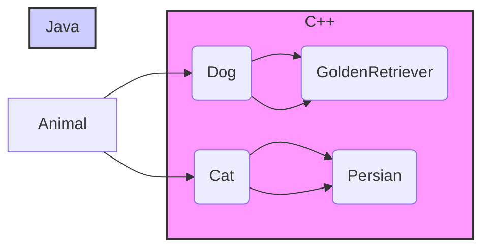

# <span style="color:#e67e22;">What we will learn in this post?</span>

<ul style='list-style-type: none; padding-left: 0;'>
<li><span style='color: #2980b9; font-size: 20px; font-weight: bold;'>👉</span> <span style='color: #2ecc71; font-size: 18px; font-weight: bold;'>Differences and Similarities between C++ and Java</span></li>
<li><span style='color: #2980b9; font-size: 20px; font-weight: bold;'>👉</span> <span style='color: #2ecc71; font-size: 18px; font-weight: bold;'>Inheritance in C++ vs Java</span></li>
<li><span style='color: #2980b9; font-size: 20px; font-weight: bold;'>👉</span> <span style='color: #2ecc71; font-size: 18px; font-weight: bold;'>Static keyword in C++ vs Java</span></li>
<li><span style='color: #2980b9; font-size: 20px; font-weight: bold;'>👉</span> <span style='color: #2ecc71; font-size: 18px; font-weight: bold;'>Default Virtual Behavior in C++ vs Java</span></li>
<li><span style='color: #2980b9; font-size: 20px; font-weight: bold;'>👉</span> <span style='color: #2ecc71; font-size: 18px; font-weight: bold;'>Exception Handling in C++ vs Java</span></li>
<li><span style='color: #2980b9; font-size: 20px; font-weight: bold;'>👉</span> <span style='color: #2ecc71; font-size: 18px; font-weight: bold;'>Foreach loop in C++ vs Java</span></li>
<li><span style='color: #2980b9; font-size: 20px; font-weight: bold;'>👉</span> <span style='color: #2ecc71; font-size: 18px; font-weight: bold;'>Templates in C++ vs Generics in Java</span></li>
<li><span style='color: #2980b9; font-size: 20px; font-weight: bold;'>👉</span> <span style='color: #2ecc71; font-size: 18px; font-weight: bold;'>Floating Point Operations & Associativity in C, C++, and Java</span></li>
<li><span style='color: #2980b9; font-size: 20px; font-weight: bold;'>👉</span> <span style='color: #2ecc71; font-size: 18px; font-weight: bold;'>Conclusion!</span></li>
</ul>

# <span style="color:#e67e22">C++ vs. Java: A Friendly Comparison 🤝</span>

C++ and Java are both powerful programming languages, but they have key differences. Let's explore!

## <span style="color:#2980b9">Syntax & Style ✨</span>

- **Similarities:** Both use a similar structure with classes, objects, and methods. They both have keywords like `if`, `else`, `for`, and `while`.
- **Differences:** C++ is more flexible, allowing low-level memory manipulation. Java, being more structured, has stricter syntax. C++ uses pointers (`*`), while Java uses references implicitly.

## <span style="color:#2980b9">Memory Management 🧠</span>

- **C++:** Uses _manual_ memory management. You allocate and deallocate memory explicitly using `new` and `delete`. This gives you fine-grained control but increases the risk of memory leaks.
- **Java:** Employs _automatic_ garbage collection. The Java Virtual Machine (JVM) automatically reclaims unused memory, simplifying development but potentially impacting performance slightly.

## <span style="color:#2980b9">Performance 🚀</span>

- **C++:** Generally offers _faster_ execution speed due to its low-level control and direct memory access. It's favored for performance-critical applications.
- **Java:** Slightly _slower_ due to the overhead of the JVM and garbage collection. However, its platform independence makes it very versatile.

### <span style="color:#8e44ad">Summary Table</span>

| Feature     | C++                     | Java                           |
| ----------- | ----------------------- | ------------------------------ |
| Syntax      | Flexible, uses pointers | Stricter, uses references      |
| Memory Mgmt | Manual                  | Automatic (Garbage Collection) |
| Performance | Generally Faster        | Slightly Slower                |

For more in-depth information:

- [C++ Documentation](https://www.cplusplus.com/)
- [Java Documentation](https://docs.oracle.com/javase/tutorial/)

Remember, the "best" language depends on your project's needs! 😄

# <span style="color:#e67e22">Inheritance: C++ vs. Java 👨‍💻👩‍💻</span>

Both C++ and Java use inheritance to create new classes (child classes) based on existing ones (parent classes), promoting code reusability. However, their syntax and implementation differ.

## <span style="color:#2980b9">Syntax and Keywords</span>

### <span style="color:#8e44ad">C++</span>

In C++, you use a colon `:` after the child class name to specify the parent class:

```c++
class Dog : public Animal { // public inheritance
    // ...
};
```

C++ supports multiple inheritance (inheriting from multiple parent classes), but this can lead to complexities. You can also specify the inheritance type (e.g., `public`, `private`, `protected`) which controls access to members of the parent class.

### <span style="color:#8e44ad">Java</span>

Java uses the `extends` keyword:

```java
class Dog extends Animal {
    // ...
}
```

Java only allows single inheritance—a class can extend only one other class. However, it supports interfaces, which provide a similar mechanism for multiple inheritance of functionality.

## <span style="color:#2980b9">Implementation Differences</span>

- **Multiple Inheritance:** C++ allows it, leading to potential ambiguity issues (diamond problem). Java avoids this complexity.
- **Constructors:** In C++, you explicitly call the parent class's constructor. In Java, the parent class's constructor is automatically called (unless explicitly overridden).

## <span style="color:#2980b9">Visual Summary</span>



**Note:** The Java subgraph shows only single inheritance per class.

For more detailed information:

- **C++ Inheritance:** [https://www.cplusplus.com/doc/tutorial/inheritance/](https://www.cplusplus.com/doc/tutorial/inheritance/)
- **Java Inheritance:** [https://docs.oracle.com/javase/tutorial/java/IandI/inheritance.html](https://docs.oracle.com/javase/tutorial/java/IandI/inheritance.html)

This illustrates the core differences between inheritance in C++ and Java in a simple and accessible manner. Remember that both mechanisms are powerful tools for building robust and maintainable software! 👍

# <span style="color:#e67e22">Static Keyword: C++ vs. Java 🤝</span>

The `static` keyword in C++ and Java, while sharing some similarities, has key differences. Let's explore!

## <span style="color:#2980b9">C++: Static Members 🤔</span>

In C++, `static` can modify both _variables_ and _member functions_ within a class.

### <span style="color:#8e44ad">Static Variables 💾</span>

- A static variable belongs to the class itself, not to any specific object. There's only _one_ copy shared across all objects.

```c++
class Counter {
public:
  static int count; // Static variable
  Counter() { count++; }
};
int Counter::count = 0; // Initialization outside the class
```

### <span style="color:#8e44ad">Static Member Functions ⚙️</span>

- These functions can only access _static_ members (variables or functions). They don't have access to `this` pointer (no object-specific data).

```c++
class Counter {
public:
  static int getCount() { return count; } //Static member function
  // ... other members
};
```

## <span style="color:#2980b9">Java: Static Members ☕</span>

In Java, `static` also applies to _variables_ and _member functions_, but with a slightly different emphasis.

### <span style="color:#8e44ad">Static Variables 📦</span>

Similar to C++, a static variable in Java is associated with the class, not a specific object. Only one copy exists.

```java
class Counter {
  static int count = 0; // Static variable
  Counter() { count++; }
}
```

### <span style="color:#8e44ad">Static Member Functions 🛠️</span>

In Java, these functions behave similarly to C++. They access only static members and lack access to instance-specific data (via `this`).

```java
class Counter {
  static int getCount() { return count; } // Static member function
  // ... other members
}
```

**Key Difference:** While both languages use `static` for similar purposes, C++ allows for more nuanced uses (like static variables within functions for local scope). Java's static members are primarily for class-level attributes and utility functions.

[Learn More About Static Members in C++](https://www.cplusplus.com/doc/tutorial/classes/)  
[Learn More About Static Members in Java](https://docs.oracle.com/javase/tutorial/java/javaOO/classvars.html)

# <span style="color:#e67e22">C++ vs. Java: Default Virtual Behavior 🤝</span>

Let's explore the differences in how C++ and Java handle virtual methods and polymorphism, focusing on default behavior. Think of it like comparing two different types of cars – both get you where you're going, but they take different routes!

## <span style="color:#2980b9">Method Overriding & Polymorphism ✨</span>

Both languages support polymorphism (using a single interface to represent different types), but their defaults differ significantly regarding virtual functions (methods that can be overridden in subclasses).

### <span style="color:#8e44ad">C++: Explicitly Virtual</span>

- In C++, you must explicitly declare a method as `virtual` in the base class to enable polymorphism. If you don't, overriding it in a derived class won't create the dynamic dispatch behavior you might expect. This means C++ is _explicit_ about virtual functions.

```cpp
class Base {
public:
  virtual void myMethod() { /*...*/ } // Explicitly virtual
};
```

### <span style="color:#8e44ad">Java: Implicitly Virtual</span>

- In Java, _all_ methods (except `static` and `final` methods) are implicitly virtual. This means overriding is the default. This makes Java's approach _implicit_.

```java
class Base {
  void myMethod() { // Implicitly virtual
    // ...
  }
}
```

## <span style="color:#2980b9">Visual Comparison 📊</span>

```mermaid
graph LR
A[C++] --> B(Explicitly declare virtual using "virtual" keyword);
C[Java] --> D(All methods are implicitly virtual by default);
```

**Key Differences Summarized:**

- **C++:** Requires `virtual` keyword for polymorphism. More control, but requires more explicit coding.
- **Java:** Polymorphism is the default behavior. Simpler syntax, less explicit coding.

This difference impacts code design and readability. Choosing between them depends on project needs and coding style preference. For more details, explore resources on object-oriented programming in C++ and Java. Remember that understanding virtual methods is crucial for mastering polymorphism in both languages!

# <span style="color:#e67e22">Exception Handling: C++ vs. Java 💥</span>

Both C++ and Java offer robust exception handling, but their approaches differ.

## <span style="color:#2980b9">C++ Exceptions ⚙️</span>

C++ uses `try`, `catch`, and `throw` keywords.

### <span style="color:#8e44ad">Syntax & Example</span>

```cpp
try {
  // Code that might throw an exception
  throw std::runtime_error("Something went wrong!");
} catch (const std::runtime_error& error) {
  // Handle the exception
  std::cerr << "Error: " << error.what() << '\n';
}
```

- **`try`**: Encloses code that might throw.
- **`catch`**: Handles specific exception types.
- **`throw`**: Throws an exception object.

## <span style="color:#2980b9">Java Exceptions ☕</span>

Java's exception handling is similar, using `try`, `catch`, and `finally`. All exceptions are objects extending `Throwable`.

### <span style="color:#8e44ad">Syntax & Example</span>

```java
try {
  // Code that might throw an exception
  int result = 10 / 0; // ArithmeticException
} catch (ArithmeticException e) {
  // Handle the exception
  System.err.println("Error: " + e.getMessage());
} finally {
    //This block always executes
}
```

- **`finally`**: Contains cleanup code (always executed).

## <span style="color:#2980b9">Key Differences & Best Practices 🤔</span>

- **Checked vs. Unchecked:** Java has _checked_ exceptions (must be handled or declared), while C++ exceptions are mostly _unchecked_.
- **Resource Management:** Java's `finally` block ensures resource cleanup, often handled with RAII (Resource Acquisition Is Initialization) in C++.
- **Exception Specification (C++):** _Avoid_ exception specifications (e.g., `throw()`) in C++ as they can be overly restrictive and complicate code.

**Best Practices (Both):**

- Handle exceptions at the appropriate level.
- Provide informative error messages.
- Avoid catching exceptions you don't know how to handle.
- Use specific `catch` blocks to handle different exception types effectively.

For more in-depth information:

- [C++ Exception Handling](https://en.cppreference.com/w/cpp/language/exceptions)
- [Java Exception Handling](https://docs.oracle.com/javase/tutorial/essential/exceptions/)

This comparison highlights the similarities and differences, enabling you to effectively use exception handling in either language. Remember to choose the approach that best suits your project's needs and coding style.

# <span style="color:#e67e22">Looping Through Collections: `foreach` in C++ and Java ✨</span>

Both C++ and Java offer convenient ways to iterate over collections (like arrays and lists) using a `foreach` loop (also known as an enhanced `for` loop). This simplifies the code compared to traditional `for` loops, making it more readable and less prone to errors.

## <span style="color:#2980b9">C++ `foreach` (Range-based for loop) 💻</span>

### <span style="color:#8e44ad">Syntax and Usage</span>

C++'s range-based `for` loop simplifies iterating through elements. Its syntax is straightforward:

```c++
for (data_type element : collection) {
  // Do something with 'element'
}
```

_Example:_

```c++
int numbers[] = {1, 2, 3, 4, 5};
for (int num : numbers) {
  std::cout << num << " "; // Output: 1 2 3 4 5
}
```

## <span style="color:#2980b9">Java `foreach` (Enhanced `for` loop) ☕</span>

### <span style="color:#8e44ad">Syntax and Usage</span>

Java's enhanced `for` loop offers similar functionality.

```java
for (data_type element : collection) {
  // Do something with 'element'
}
```

_Example:_

```java
int[] numbers = {1, 2, 3, 4, 5};
for (int num : numbers) {
  System.out.print(num + " "); // Output: 1 2 3 4 5
}
```

**Key Differences:** While both achieve similar results, C++'s range-based `for` loop works directly with ranges (arrays, vectors, etc.), whereas Java's iterates over elements that implement the `Iterable` interface (including arrays and collections). Also, in C++, you _cannot_ modify the original collection's elements directly inside the loop (creating a copy is necessary for modification). Java allows this depending on the collection's nature.

**Resources:**

- [C++ Range-based for loop](https://www.cplusplus.com/doc/tutorial/control/)
- [Java Enhanced for loop](https://docs.oracle.com/javase/tutorial/java/nutsandbolts/for.html)

Remember that these loops are best for simple traversals. For more complex scenarios involving index manipulation or conditional skipping, a traditional `for` loop might be more appropriate.

# <span style="color:#e67e22">C++ Templates vs. Java Generics 🤝</span>

Both C++ templates and Java generics achieve code reusability by allowing you to write code that works with different data types without rewriting it repeatedly. However, they differ significantly in _how_ they achieve this.

## <span style="color:#2980b9">Key Differences ✨</span>

### <span style="color:#8e44ad">Compile-Time vs. Runtime</span>

- **C++ Templates:** Templates are processed at _compile time_. The compiler generates separate code for each data type used with the template. This leads to code bloat but potentially better performance. Think of it as creating multiple specialized versions of your function.

- **Java Generics:** Generics are handled at _runtime_. The compiler uses type erasure, meaning the generic type information is mostly removed during compilation. This avoids code bloat, but might lead to slightly less efficient code in some cases. It's like having one function that adapts to different types at runtime.

### <span style="color:#8e44ad">Type Safety</span>

- **C++ Templates:** Offer strong _compile-time_ type safety. Type errors are caught during compilation.

- **Java Generics:** Provide _runtime_ type safety for some situations, using type checking to catch errors. However, type erasure limits its ability to fully catch all errors during compilation.

## <span style="color:#2980b9">Usage Examples 💻</span>

**C++:**

```c++
template <typename T>
T max(T a, T b) {
  return (a > b) ? a : b;
}
```

**Java:**

```java
public class MaxFinder<T extends Comparable<T>> {
    public T max(T a, T b) {
        return a.compareTo(b) > 0 ? a : b;
    }
}
```

## <span style="color:#2980b9">Summary 📝</span>

- C++ templates offer superior compile-time type safety and performance but can lead to larger executables.
- Java generics are more flexible, preventing code bloat, but have slightly less robust compile-time type checking.

[More on C++ Templates](https://www.geeksforgeeks.org/templates-cpp/)
[More on Java Generics](https://docs.oracle.com/javase/tutorial/java/generics/index.html)

# <span style="color:#e67e22">Floating-Point Operations: C, C++, and Java 🧮</span>

Floating-point numbers represent real numbers in computers, but they have limitations. One key aspect is _associativity_, meaning the order of operations can affect the result due to rounding errors. This differs from integer arithmetic where associativity generally holds.

## <span style="color:#2980b9">Associativity Issues ⚠️</span>

Let's consider addition: `(a + b) + c` might not equal `a + (b + c)` with floats. This is because each intermediate result is rounded to the floating-point representation's precision.

### <span style="color:#8e44ad">Example in C++:</span>

```c++
#include <iostream>
float a = 0.1f;
float b = 0.2f;
float c = 0.3f;
std::cout << (a + b) + c << std::endl; // Might not be exactly 0.6
std::cout << a + (b + c) << std::endl; // Might differ slightly
```

The same behavior applies in C and Java. While the differences might be small, they can accumulate and lead to significant errors in complex calculations.

## <span style="color:#2980b9">Best Practices 👍</span>

- **Be Aware:** Always remember that floating-point arithmetic is not associative.
- **Careful Ordering:** Structure your calculations to minimize the impact of rounding errors where possible (e.g., summing from smallest to largest).
- **Consider Libraries:** Use libraries designed for high-precision calculations when accuracy is critical.

## <span style="color:#2980b9">Further Reading 📚</span>

- [IEEE 754 Standard](https://en.wikipedia.org/wiki/IEEE_754): The standard defining floating-point representation.
- [What Every Computer Scientist Should Know About Floating-Point Arithmetic](https://docs.oracle.com/cd/E19957-01/806-3568/6j4ma/index.html): A detailed explanation of floating-point intricacies.

Remember, understanding these limitations is crucial for writing robust and reliable numerical programs. Always test and validate your results, especially in applications where accuracy is paramount!

<h1><span style='color:#e67e22'>Conclusion</span></h1>

So there you have it! We've covered a lot of ground today, and hopefully, you found it helpful and insightful 😊. But the conversation doesn't end here! We'd love to hear your thoughts, feedback, and any suggestions you might have. What did you think of this post? What else would you like to see us cover? Let us know in the comments below 👇. We can't wait to hear from you! 🎉
