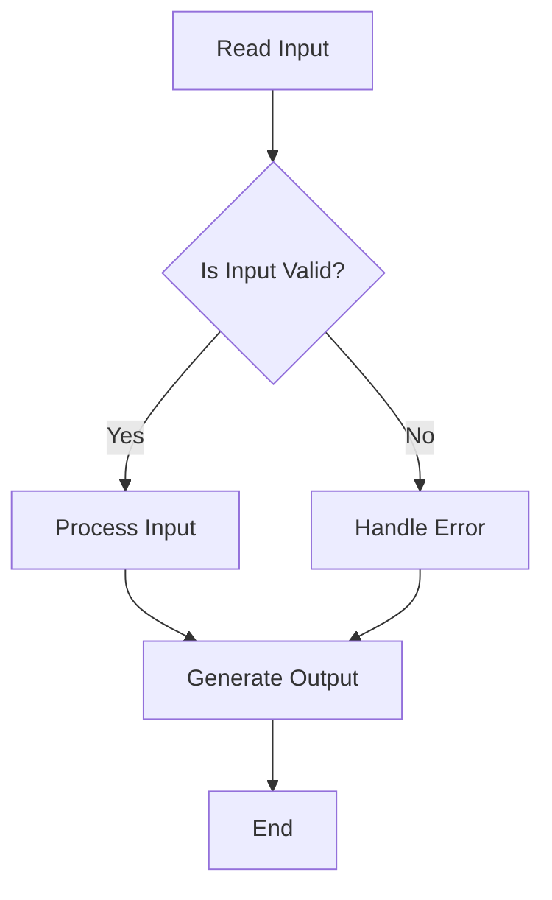
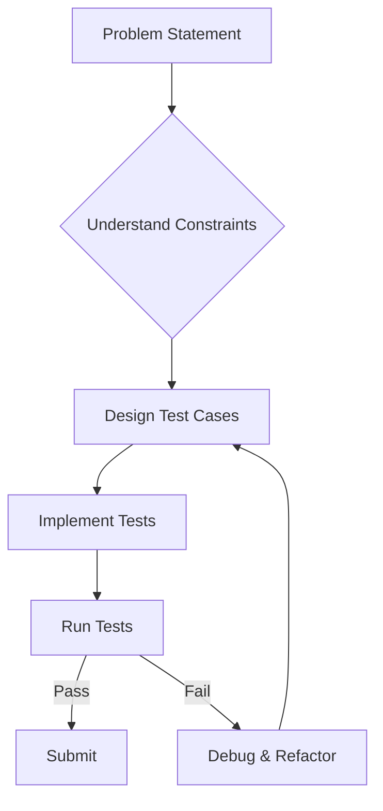

# <span style="color:#e67e22;">What we will learn in this post?</span>

<ul style='list-style-type: none; padding-left: 0;'>
<li><span style='color: #2980b9; font-size: 20px; font-weight: bold;'>👉</span> <span style='color: #2ecc71; font-size: 18px; font-weight: bold;'>Competitive Programming – A Complete Guide</span></li>
<li><span style='color: #2980b9; font-size: 20px; font-weight: bold;'>👉</span> <span style='color: #2ecc71; font-size: 18px; font-weight: bold;'>C++ Tricks for Competitive Programming</span></li>
<li><span style='color: #2980b9; font-size: 20px; font-weight: bold;'>👉</span> <span style='color: #2ecc71; font-size: 18px; font-weight: bold;'>Writing C/C++ code efficiently in Competitive Programming</span></li>
<li><span style='color: #2980b9; font-size: 20px; font-weight: bold;'>👉</span> <span style='color: #2ecc71; font-size: 18px; font-weight: bold;'>Why C++ is Best for Competitive Programming?</span></li>
<li><span style='color: #2980b9; font-size: 20px; font-weight: bold;'>👉</span> <span style='color: #2ecc71; font-size: 18px; font-weight: bold;'>Generating Test Cases in C++</span></li>
<li><span style='color: #2980b9; font-size: 20px; font-weight: bold;'>👉</span> <span style='color: #2ecc71; font-size: 18px; font-weight: bold;'>Fast I/O for Competitive Programming in C++</span></li>
<li><span style='color: #2980b9; font-size: 20px; font-weight: bold;'>👉</span> <span style='color: #2ecc71; font-size: 18px; font-weight: bold;'>Setting up Sublime Text for C++ Competitive Programming Environment</span></li>
<li><span style='color: #2980b9; font-size: 20px; font-weight: bold;'>👉</span> <span style='color: #2ecc71; font-size: 18px; font-weight: bold;'>Setting up VS Code for C++ Competitive Programming Environment</span></li>
<li><span style='color: #2980b9; font-size: 20px; font-weight: bold;'>👉</span> <span style='color: #2ecc71; font-size: 18px; font-weight: bold;'>Which C++ libraries are useful for competitive programming?</span></li>
<li><span style='color: #2980b9; font-size: 20px; font-weight: bold;'>👉</span> <span style='color: #2ecc71; font-size: 18px; font-weight: bold;'>Common mistakes to be avoided in Competitive Programming in C++</span></li>
<li><span style='color: #2980b9; font-size: 20px; font-weight: bold;'>👉</span> <span style='color: #2ecc71; font-size: 18px; font-weight: bold;'>Conclusion!</span></li>
</ul>

# <span style="color:#e67e22">Competitive Programming in C++: A Beginner's Guide 🚀</span>

## <span style="color:#2980b9">Getting Started 🏁</span>

Competitive programming is about solving problems efficiently! C++ is a popular choice due to its speed and extensive standard library. Start with the basics:

- **Data Structures:** Arrays, vectors, linked lists, stacks, queues, maps, sets. [Learn more about Data Structures](https://www.geeksforgeeks.org/data-structures/)
- **Algorithms:** Sorting (e.g., `std::sort`), searching, graph traversal (BFS, DFS), dynamic programming. [Learn more about Algorithms](https://www.hackerearth.com/practice/algorithms/)

### <span style="color:#8e44ad">Practice, Practice, Practice!</span>

Solve problems on platforms like Codeforces, LeetCode, and HackerRank. Focus on understanding the problem statement and developing a robust solution.

## <span style="color:#2980b9">Essential C++ Techniques ✨</span>

- **Standard Template Library (STL):** Master the STL containers and algorithms for efficient code.
- **Input/Output:** Learn optimized I/O techniques for faster execution. `cin.tie(0);` `ios_base::sync_with_stdio(0);`
- **Debugging:** Use a debugger (like GDB) to identify and fix errors effectively.

### <span style="color:#8e44ad">Example: Simple Code</span>

```c++
#include <iostream>
#include <vector>
int main() {
  std::vector<int> v = {1, 2, 3};
  std::cout << v[0] << std::endl; // Output: 1
  return 0;
}
```

## <span style="color:#2980b9">Problem-Solving Strategies 💡</span>

- **Understand the problem:** Carefully read the problem statement multiple times.
- **Develop an algorithm:** Design an efficient algorithm to solve the problem.
- **Implement and test:** Write clean, well-documented code and test thoroughly.
- **Optimize:** Improve your code's performance by using efficient data structures and algorithms.

### <span style="color:#8e44ad">Flowchart Example</span>



Remember, consistent practice and a focus on learning are key to success! Good luck! 👍

# <span style="color:#e67e22">C++ Tricks for Competitive Programming 🚀</span>

## <span style="color:#2980b9">Faster Input/Output</span>

Competitive programming often demands speed. Avoid using `cin` and `cout` for large I/O. Instead, use `scanf` and `printf` for significantly faster execution.

```c++
scanf("%d", &n); //Faster input
printf("%d\n", result); //Faster output
```

### <span style="color:#8e44ad">Why it's faster?</span>

`cin`/`cout` are stream-based and involve buffering overhead. `scanf`/`printf` directly interact with the operating system, resulting in better performance.

## <span style="color:#2980b9">Using `std::vector` Efficiently</span>

`std::vector` is your friend! Pre-allocate memory for better performance:

```c++
std::vector<int> v(n); //Pre-allocate n integers
```

This prevents repeated memory allocations during the program.

## <span style="color:#2980b9">Bit Manipulation 💡</span>

Master bitwise operations for clever optimizations. For example, checking if a number is even:

```c++
if(n & 1 == 0) { /* Even number */ }
```

This is significantly faster than `n % 2 == 0`.

## <span style="color:#2980b9">Helpful Resources 📚</span>

- [CP-Algorithms](https://cp-algorithms.com/): A treasure trove of algorithms and techniques.
- [LeetCode](https://leetcode.com/): Practice problems to hone your skills.

Remember, practice is key! These tricks are most effective when combined with a solid understanding of algorithms and data structures. Good luck and happy coding! 🎉

# <span style="color:#e67e22">Efficient C/C++ for Competitive Programming 🚀</span>

Competitive programming demands speed! Here's how to write efficient C/C++ code:

## <span style="color:#2980b9">Data Structures & Algorithms 💡</span>

Choose the right tools! Using appropriate data structures (like `std::vector`, `std::map`, `std::set`) drastically improves performance. Avoid unnecessary loops.

### <span style="color:#8e44ad">Example: Vector vs. Array</span>

Instead of:

```c++
int arr[100000];
```

Use:

```c++
std::vector<int> vec(100000);
```

Vectors dynamically resize, making them more flexible.

## <span style="color:#2980b9">Input/Output Optimization 💨</span>

Reading input line by line can be slow. Use `scanf` and `printf` for faster I/O.

```c++
scanf("%d", &n); //Faster than cin >> n;
printf("%d\n", ans); //Faster than cout << ans << endl;
```

## <span style="color:#2980b9">Memory Management 🧠</span>

Avoid memory leaks! Use smart pointers (`std::unique_ptr`, `std::shared_ptr`) to manage dynamically allocated memory automatically.

## <span style="color:#2980b9">Code Style & Optimization 🧹</span>

- **Use meaningful variable names:** Makes your code easier to understand and debug.
- **Comment your code:** Explain complex logic for future reference.
- **Profile your code:** Identify bottlenecks using profiling tools.

For more advanced tips, check out these resources:

- [CP-Algorithms](https://cp-algorithms.com/)
- [TopCoder](https://www.topcoder.com/)

Remember, practice makes perfect! Happy coding! 🎉

# <span style="color:#e67e22">Why C++ Reigns in Competitive Programming 🏆</span>

C++ is a top choice for competitive programming due to its blend of performance and features. Let's explore why!

## <span style="color:#2980b9">Blazing Fast Speed 🚀</span>

- **Low-level control:** C++ offers direct memory manipulation, allowing for fine-grained optimization crucial for speed-sensitive problems. You can squeeze every bit of performance from your hardware!
- **Standard Template Library (STL):** The STL provides highly optimized data structures (like `vector`, `map`, `set`) and algorithms, saving you coding time and boosting efficiency. No need to reinvent the wheel!

### <span style="color:#8e44ad">Example: Vector vs. Array</span>

Vectors offer dynamic resizing, making them more convenient than fixed-size arrays in many competitive programming scenarios.

## <span style="color:#2980b9">Powerful Features 💪</span>

- **Pointers:** Allow for direct memory access, essential for advanced algorithms and data structure implementations.
- **Templates:** Enable writing generic code that works with various data types, promoting reusability and reducing boilerplate.

## <span style="color:#2980b9">Community & Resources 📚</span>

A massive community actively participates in competitive programming, providing abundant resources, tutorials, and code snippets readily available online. This collective knowledge is invaluable for learning and improving.

[Learn more about STL](https://www.geeksforgeeks.org/the-c-standard-template-library-stl/)

[More on Competitive Programming](https://www.topcoder.com/)

---

In short, C++'s speed, control, and extensive library support make it a powerful weapon in the competitive programmer's arsenal. While a steeper learning curve exists compared to some other languages, the rewards in performance are substantial. _Happy coding!_ 😊

# <span style="color:#e67e22">Generating C++ Test Cases for Competitive Programming 🎉</span>

Creating good test cases is crucial for successful competitive programming. Here are some techniques:

## <span style="color:#2980b9">Basic Test Case Generation 💡</span>

- **Edge Cases:** Always test the _boundaries_ of input. For example, if the input is an integer `n`, test `n = 0`, `n = 1`, `n = INT_MAX`, `n = INT_MIN`.
- **Small Cases:** Start with small inputs (e.g., `n = 1, 2, 3`) to easily verify your code's logic.
- **Large Cases:** Test with large inputs to check for efficiency issues. Use randomly generated numbers within the constraints.
- **Specific Cases:** Generate inputs that might expose specific bugs in your code. For example if there's a sorting step, test cases with duplicates or already sorted data.

### <span style="color:#8e44ad">Example: Finding the Maximum</span>

Let's say you're writing a function to find the maximum of two numbers:

```c++
int max_of_two(int a, int b) {
  return (a > b) ? a : b;
}
```

Test cases could include:

- `max_of_two(5, 10)` // Expected: 10
- `max_of_two(10, 5)` // Expected: 10
- `max_of_two(0, 0)` // Expected: 0
- `max_of_two(INT_MAX, INT_MIN)` // Expected: INT_MAX

## <span style="color:#2980b9">Advanced Techniques 🚀</span>

- **Random Test Case Generation:** Use libraries like `<random>` to generate random inputs within specified ranges. This helps catch unexpected behaviors.
- **Stress Testing:** Run your solution against a slower, but correct, solution (e.g., brute force) for many inputs. This helps identify performance problems or incorrect results.

### <span style="color:#8e44ad">Example Random Test Generation Snippet</span>

```c++
#include <random>
std::random_device rd;
std::mt19937 gen(rd());
std::uniform_int_distribution<> distrib(1, 1000); // Generates random numbers between 1 and 1000
int random_number = distrib(gen);
```

Remember to carefully consider the problem constraints when generating test cases! Thorough testing is key to achieving high scores in competitive programming!

[More on Test Driven Development](https://en.wikipedia.org/wiki/Test-driven_development)



# <span style="color:#e67e22">Speeding Up I/O in C++ for Competitive Programming 🚀</span>

Competitive programming often demands blazing-fast I/O. Standard input/output (`cin`/`cout`) can be slow. Here's how to boost your speed:

## <span style="color:#2980b9">Faster Input/Output Techniques ⚡</span>

### <span style="color:#8e44ad">Using `scanf` and `printf`</span>

These C-style functions are generally faster than their C++ counterparts.

- **Example:** `scanf("%d", &x);` `printf("%d\n", x);`

### <span style="color:#8e44ad">Custom Input/Output Buffering</span>

Manually buffering input/output can significantly improve performance.

- **Example:** Using `fread` and `fwrite` for large datasets (Resource: [link to fread/fwrite documentation](https://www.cplusplus.com/reference/cstdio/fread/))

## <span style="color:#2980b9">Performance Comparison 📊</span>

| Method           | Speed (Relative) |
| ---------------- | ---------------- | ---------------------------- |
| `cin`/`cout`     | 1                |
| `scanf`/`printf` | 2-3              |
| Custom Buffering | 4-5              | _(Highly dataset dependent)_ |

**(Note: Speed comparison is approximate and depends on factors like hardware and data size.)**

## <span style="color:#2980b9">Choosing the Right Method 🤔</span>

- For small inputs: `scanf`/`printf` offers a good balance of speed and simplicity.
- For large inputs: Custom buffering provides the most significant speed-up. However, implementing this correctly requires care.

Remember to always test your code with realistic input sizes to determine the optimal I/O strategy for your specific problem! Happy coding! 😊

# <span style="color:#e67e22">Setting up Sublime Text for C++ Competitive Programming 🚀</span>

Let's get your Sublime Text ready for coding competitions! This guide will walk you through the essential steps.

## <span style="color:#2980b9">Installing the Compiler ⚙️</span>

First, you need a C++ compiler like g++. On Linux/macOS, use your system's package manager (e.g., `sudo apt-get install g++` on Ubuntu). On Windows, download MinGW from [https://www.mingw-w64.org/](https://www.mingw-w64.org/). Make sure `g++` is added to your system's PATH environment variable.

## <span style="color:#2980b9">Sublime Text Configuration ✨</span>

- **Install Package Control:** Follow the instructions on [https://packagecontrol.io/installation](https://packagecontrol.io/installation) to install Package Control in Sublime Text. This is crucial for managing plugins.
- **Install `Build System`:** Once Package Control is installed, open the Command Palette (Ctrl+Shift+P or Cmd+Shift+P) and type `Install Package`. Search and install a C++ build system (e.g., "C++ Build").
- **Configure Build System:** Open your build system file (usually `Tools` -> `Build System` -> `New Build System`) and tailor it to your compiler path if needed. A simple example:

```json
{
  "cmd": ["g++", "${file}", "-o", "${file_base_name}"],
  "shell": true,
  "working_dir": "${file_path}",
  "selector": "source.c++"
}
```

### <span style="color:#8e44ad">Testing Your Setup 🧪</span>

Create a simple `hello.cpp` file, write a `Hello World` program, and try building it (Ctrl+B or Cmd+B).

## <span style="color:#2980b9">Optional Enhancements ➕</span>

Consider installing plugins like:

- **Theme:** For a visually appealing coding experience.
- **Linter:** For real-time error checking (e.g., `SublimeLinter`).

Remember to adjust paths in the build system to match your compiler's location. Happy coding! 🎉

# <span style="color:#e67e22">VS Code Setup for C++ Competitive Programming 🚀</span>

Let's get your VS Code ready for coding competitions! This guide will help you set it up quickly and efficiently.

## <span style="color:#2980b9">Install the Essentials 🛠️</span>

- **Download and Install VS Code:** [Download Link](https://code.visualstudio.com/) (It's free!)
- **Install the C++ Extension:** Search for and install the "C/C++" extension by Microsoft in the VS Code extensions marketplace.

## <span style="color:#2980b9">Configure Your Compiler ⚙️</span>

- **Choose a Compiler:** You'll need a C++ compiler like _g++_. Most Linux distributions have it pre-installed. For Windows, consider using MinGW or MSVC.
- **Set the Path (Important!):** Ensure your compiler's `bin` directory is added to your system's `PATH` environment variable. This allows VS Code to find it. (Search online for instructions based on your OS).

## <span style="color:#2980b9">Create a Simple Program and Test 🧪</span>

1. Create a new file (e.g., `hello.cpp`).
2. Write a simple "Hello, World!" program:

```cpp
#include <iostream>
int main() {
  std::cout << "Hello, World!" << std::endl;
  return 0;
}
```

3. Save the file.
4. Open the integrated terminal (View > Terminal).
5. Compile and run using `g++ hello.cpp -o hello && ./hello`.

### <span style="color:#8e44ad">Troubleshooting Tips 🤔</span>

- If you encounter errors, double-check your compiler path and the code for typos.
- Consider using a debugger (built into VS Code) for more complex programs.

## <span style="color:#2980b9">Further Enhancements ✨</span>

- Install extensions like:
  - **Code Runner:** To run your code directly from VS Code.
  - **Prettier:** for code formatting
- Consider using a template for your submissions.

This setup provides a solid foundation. Happy coding! 🎉

# <span style="color:#e67e22">Essential C++ Libraries for Competitive Programming 🚀</span>

Competitive programming often requires efficient data structures and algorithms. Here are some helpful C++ libraries:

## <span style="color:#2980b9">Standard Template Library (STL) 📚</span>

The STL is your _best friend_. It's included in every C++ compiler and provides:

- **Containers:** `vector` (dynamic array), `list` (doubly linked list), `map` (key-value store), `set` (unique elements), etc. These make coding much faster!
- **Algorithms:** `sort`, `find`, `binary_search`, etc. Pre-built algorithms save you time and effort.

### <span style="color:#8e44ad">Example: Sorting a vector</span>

```c++
#include <vector>
#include <algorithm>

int main() {
  std::vector<int> v = {5, 2, 8, 1, 9};
  std::sort(v.begin(), v.end()); //Sorts v in ascending order
  return 0;
}
```

## <span style="color:#2980b9">Boost ⚡️</span>

Boost offers more advanced features, but might require extra installation. Useful components include:

- **Graph Library:** For graph algorithms like Dijkstra's or DFS.
- **Multiprecision Arithmetic:** For handling very large numbers.

## <span style="color:#2980b9">Other Libraries 🤔</span>

Depending on the problem, you might also consider libraries specialized in specific areas like:

- **Computational Geometry Libraries:** For problems involving shapes and spaces.
- **String Manipulation Libraries:** Libraries providing enhanced string processing functionalities beyond the standard library.

**Remember**: While libraries are helpful, understanding the underlying algorithms is crucial for effective problem-solving. Don't just copy-paste; learn how these tools work!

[Learn more about STL](https://en.cppreference.com/w/cpp/header)

[Learn more about Boost](https://www.boost.org/)

---

**Flowchart illustrating using STL for sorting:**

```mermaid
graph TD
    A[Problem: Unsorted Vector] --> B{"Use STL's std::sort"};
    B --> C[Sorted Vector];
    C --> D["Solution! 🎉"];
```



# <span style="color:#e67e22">Common C++ Mistakes in Competitive Programming 😫</span>

Many common mistakes trip up competitive programmers using C++. Let's address some of them!

## <span style="color:#2980b9">Off-by-One Errors 🐞</span>

### <span style="color:#8e44ad">The Problem</span>

Incorrectly handling loop boundaries (e.g., `for (int i = 0; i <= n; ++i)` instead of `for (int i = 0; i < n; ++i)` when iterating through an array of size `n`).

### <span style="color:#8e44ad">The Solution</span>

- **Double-check your loop conditions:** Carefully examine your start and end conditions.
- **Use `size()` method for containers:** This avoids manual index calculations.
- **Visualize your code execution:** Step through the code to simulate loops and array access.

## <span style="color:#2980b9">Memory Management 🧠</span>

### <span style="color:#8e44ad">The Problem</span>

Memory leaks (forgetting to `delete[]` dynamically allocated memory) or using dangling pointers (pointing to memory that has been freed).

### <span style="color:#8e44ad">The Solution</span>

- **Use smart pointers (`unique_ptr`, `shared_ptr`):** These automatically manage memory. Learn more: [Smart Pointers](https://en.cppreference.com/w/cpp/memory)
- **Avoid raw pointers whenever possible:** Opt for safer alternatives.

## <span style="color:#2980b9">Integer Overflow 💥</span>

### <span style="color:#8e44ad">The Problem</span>

Calculations exceeding the maximum value of an `int` or other integer types, leading to unexpected results.

### <span style="color:#8e44ad">The Solution</span>

- **Use `long long`:** For larger numbers, this provides a wider range.
- **Check for potential overflows:** Consider the size of the inputs and intermediate results.

## <span style="color:#2980b9">Time Complexity Analysis ⏱️</span>

### <span style="color:#8e44ad">The Problem</span>

Failing to analyze algorithm complexity, leading to timeouts (TLE) on larger inputs.

### <span style="color:#8e44ad">The Solution</span>

- **Learn Big O notation:** Understand how your algorithms scale with input size.
- **Choose appropriate data structures:** Consider the time complexity of operations on the chosen structures. (e.g., using a hash table for fast lookups)

Remember to always test your code thoroughly with various inputs, including edge cases! Good luck! 👍

<h1><span style='color:#e67e22'>Conclusion</span></h1>

So there you have it! We hope you found this helpful and informative. 😊 We're always striving to improve, so we'd love to hear your thoughts! What did you think of this post? Any questions? Or maybe you have some awesome suggestions for future topics? Let us know in the comments section below! 👇 We can't wait to chat with you! 🤗
