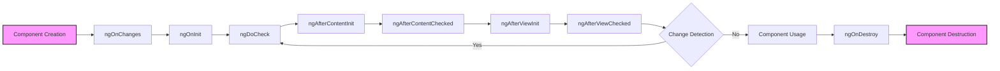
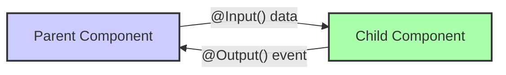
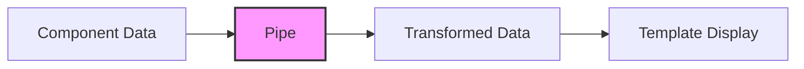

# <span style="color:#e67e22;">What we will learn in this post?</span>

<ul style='list-style-type: none; padding-left: 0;'>
<li><span style='color: #2980b9; font-size: 20px; font-weight: bold;'>👉</span> <span style='color: #2ecc71; font-size: 18px; font-weight: bold;'>Component Lifecycle</span></li>
<li><span style='color: #2980b9; font-size: 20px; font-weight: bold;'>👉</span> <span style='color: #2ecc71; font-size: 18px; font-weight: bold;'>Component Communication</span></li>
<li><span style='color: #2980b9; font-size: 20px; font-weight: bold;'>👉</span> <span style='color: #2ecc71; font-size: 18px; font-weight: bold;'>Data Binding</span></li>
<li><span style='color: #2980b9; font-size: 20px; font-weight: bold;'>👉</span> <span style='color: #2ecc71; font-size: 18px; font-weight: bold;'>Template Syntax</span></li>
<li><span style='color: #2980b9; font-size: 20px; font-weight: bold;'>👉</span> <span style='color: #2ecc71; font-size: 18px; font-weight: bold;'>Pipes in Templates</span></li>
<li><span style='color: #2980b9; font-size: 20px; font-weight: bold;'>👉</span> <span style='color: #2ecc71; font-size: 18px; font-weight: bold;'>Conclusion!</span></li>
</ul>

# <span style="color:#e67e22">Angular Component Lifecycle 🔄</span>

Hey there! Let's dive into the fascinating world of Angular component lifecycles. Think of it like a component's journey, from birth to retirement, with different stages where you can step in and do your magic! 🪄

## <span style="color:#2980b9">What's the Lifecycle About?</span>

Essentially, an Angular component has a lifespan – it's created, it does its thing, and then it's removed. During this time, Angular provides you with "hooks" – special methods you can use to run code at particular points in the cycle. These hooks are your friends, allowing you to control your component's behavior.

### <span style="color:#8e44ad">The Lifecycle Hooks</span>

Here's a friendly rundown of the main hooks you'll encounter:

- **`ngOnChanges()`**:
  - Called whenever one of the _input_ properties of the component changes.
  - Great for reacting to data changes coming from the parent component.
  - Think of it as "Hey, something I'm receiving has updated!".
  - **Example:** If a user's name is passed as input to your user card component, `ngOnChanges` will run when the name changes.

- **`ngOnInit()`** 🚀:
  - Called _once_ after Angular has initialized all data-bound properties of your component.
  - Your go-to spot for initial setup, fetching data, or anything you need to do when the component is first created.
  - Think of it as "Okay, I'm ready to roll!"
  - **Example:** Loading user data from an API.

- **`ngDoCheck()`**:
  - Called during every change detection cycle.
  - Lets you implement custom change detection logic.
  - _Use with caution_ as it can affect performance if overused!
  - **Example:** Implementing a complex check when no other hooks suffice.

- **`ngAfterContentInit()`**:
  - Called _once_ after Angular projects external content into the component (using `<ng-content>`).
  - Useful when you need to work with projected content.
  - **Example:** Initializing the projected content inside a modal.

- **`ngAfterContentChecked()`**:
  - Called after Angular checks the content projected into the component.
  - Runs every time the projected content is checked, after the `ngAfterContentInit` and `ngDoCheck` methods are called.
  - **Example:** Updating something based on changes in the projected content.

- **`ngAfterViewInit()`**:
  - Called _once_ after a component's view (and its children’s view) has been fully initialized.
- Great for working with template elements.
- **Example:** Accessing elements using `@ViewChild`.

- **`ngAfterViewChecked()`**:
- Called after Angular checks the component's view and child views.
- Runs after the `ngAfterViewInit` and every subsequent `ngDoCheck`.
- **Example:** Updating a component’s UI based on changes to view.

- **`ngOnDestroy()`** 🪦:
  - Called _once_ right before Angular destroys the component.
  - Ideal for cleanup tasks like unsubscribing from observables or removing event listeners.
  - Think of it as "Time to clean up my mess!".
  - **Example:** Unsubscribing from a subscription to avoid memory leaks.

**Here is a visual representation of the lifecycle:**



## <span style="color:#2980b9">Examples in Action</span>

Let's make these hooks more tangible with some practical scenarios:

### <span style="color:#8e44ad">Example 1: Initializing with `ngOnInit`</span>



```typescript
import { Component, OnInit } from "@angular/core";
import { UserService } from "./user.service"; // Assume a service

@Component({
  selector: "app-user-profile",
  template: ` <p>User Name: {{ userName }}</p> `,
})
export class UserProfileComponent implements OnInit {
  userName: string = "";

  constructor(private userService: UserService) {}

  ngOnInit(): void {
    this.userService.getUserName().subscribe((name) => {
      this.userName = name;
    });
  }
}
```



- In this example, the `ngOnInit` hook is used to fetch user data when the component is first created. We use an `UserService` (assuming you have one) and subscribe to it to update our component's property `userName`.

### <span style="color:#8e44ad">Example 2: Cleaning Up with `ngOnDestroy`</span>



```typescript
import { Component, OnDestroy, OnInit } from "@angular/core";
import { Observable, Subscription, interval } from "rxjs";

@Component({
  selector: "app-timer",
  template: `<p>Time: {{ time }}</p>`,
})
export class TimerComponent implements OnInit, OnDestroy {
  time = 0;
  private intervalSubscription: Subscription;

  ngOnInit(): void {
    this.intervalSubscription = interval(1000).subscribe(() => {
      this.time++;
    });
  }

  ngOnDestroy(): void {
    this.intervalSubscription.unsubscribe(); // Very important!
  }
}
```



- Here, `ngOnDestroy` is used to unsubscribe from our `interval` observable which is set up in the ngOnInit() method. Failing to unsubscribe would cause a memory leak and problems later.
- This ensures resources are released when the component is no longer used.

### <span style="color:#8e44ad">Example 3: Reacting to Input Changes with `ngOnChanges`</span>



```typescript
import { Component, Input, OnChanges, SimpleChanges } from "@angular/core";

@Component({
  selector: "app-greeting",
  template: `<p>Hello, {{ name }}!</p>`,
})
export class GreetingComponent implements OnChanges {
  @Input() name: string = "Guest";

  ngOnChanges(changes: SimpleChanges): void {
    if (changes["name"]) {
      console.log(
        "The name changed from ",
        changes["name"].previousValue,
        " to ",
        changes["name"].currentValue,
      );
    }
  }
}
```



- Here we have a component that reacts to an input property called `name`. Whenever the `name` prop of the component changes, the `ngOnChanges` method gets invoked, which logs the changes to the console.

## <span style="color:#2980b9">Why Are These Hooks Important?</span>

- **Orderly Setup and Cleanup:** Ensures that your component gets everything it needs, and releases the resources it uses at the correct time.
- **Data Management:** Handles input data and keeps your component in sync with changes.
- **Performance:** Helps avoid memory leaks and unnecessary processing.
- **Maintainability:** Makes your component easier to understand and debug.

## <span style="color:#2980b9">Resources for More Info</span>

If you want to learn even more about component lifecycles, here are a few great places to explore:

- [Angular Documentation on Lifecycle Hooks](https://angular.io/guide/lifecycle-hooks): The official guide is your best friend!
- [Understanding Angular Component Lifecycle Hooks](https://blog.bitsrc.io/understanding-angular-component-lifecycle-hooks-8104e435f20c): A great in-depth blog post.

By mastering the Angular component lifecycle, you'll be able to build cleaner, more efficient, and robust Angular applications. Happy coding! 🎉

Okay, let's dive into how Angular components chat with each other! It's all about making your application dynamic and responsive, and we'll use `@Input()`, `@Output()`, and `EventEmitter` to make it happen. ✨

# <span style="color:#e67e22">Component Communication in Angular: A Friendly Guide</span> 🤝

We often build Angular applications using components. These components are like LEGO bricks – they each have a specific job and are designed to fit together. To make them work well as a whole, they need to be able to talk to each other. This is where `@Input()`, `@Output()`, and `EventEmitter` come into play! Let's see how they work in a simple and easy way.

## <span style="color:#2980b9">Passing Data Down with `@Input()` ⬇️</span>

Imagine you have a parent component, like a 'container', and a child component, like a 'display'. The parent component might have some data, such as a `userName`, that the child component needs to display. This is when we use the `@Input()` decorator in the child component.

- **What is `@Input()`?** It's like giving the child component a special "listening" ear. The parent can then send data to the child.
- **How does it work?**
  - In the child component, you decorate a property with `@Input()`.
  - In the parent component's template, you bind a value to that `@Input()`.

Here's a simple code snippet for better understanding:

**Child Component (`child.component.ts`)**



```typescript
import { Component, Input } from "@angular/core";

@Component({
  selector: "app-child",
  template: `<p>
    Hello, <b>{{ userName }}</b> !
  </p>`,
})
export class ChildComponent {
  @Input() userName: string = ""; // Child component now listens for username from parent
}
```



**Parent Component (`parent.component.ts`)**



```typescript
import { Component } from "@angular/core";

@Component({
  selector: "app-parent",
  template: `<app-child [userName]="parentName"></app-child>`, // Passing parentName as userName to child
})
export class ParentComponent {
  parentName: string = "John Doe";
}
```



In this example:

- The `ChildComponent` declares `userName` as an `@Input()`.
- The `ParentComponent` binds its `parentName` to the `userName` input property of the `ChildComponent` in the template: `[userName]="parentName"`
- _Result_: The child component will render "Hello, **John Doe**!"

- **Key Takeaways:**
  - Data flows _one way_ from parent to child.
  - `@Input()` lets child components receive data from parent components.
  - We use `[property]="value"` in the parent's template to pass the data.

## <span style="color:#2980b9">Sending Events Up with `@Output()` and `EventEmitter` ⬆️</span>

Now, let's consider when a child component needs to tell the parent about something, like a button click or a form submission. For this, we use `@Output()` and `EventEmitter`.

- **What is `@Output()`?** It's like giving the child component a special "speaking" voice. The parent can listen for these 'voices' to get notifications from the child.
- **What is `EventEmitter`?** It's the mechanism to create and manage events.
- **How does it work?**
  - In the child component, you decorate a property with `@Output()`, and you make it an `EventEmitter`.
  - The child component uses the `emit()` method of the `EventEmitter` to send the data/event.
  - In the parent component's template, you bind to the event using `(event)="handler"`.

Let's explore this with another example:

**Child Component (`button.component.ts`)**



```typescript
import { Component, Output, EventEmitter } from "@angular/core";

@Component({
  selector: "app-button",
  template: `<button (click)="handleClick()">Click Me!</button>`,
})
export class ButtonComponent {
  @Output() buttonClicked = new EventEmitter<string>(); // Sending string with event
  handleClick() {
    this.buttonClicked.emit("Button was clicked!"); // Emit event when button clicked
  }
}
```



**Parent Component (`parent.component.ts`)**



```typescript
import { Component } from "@angular/core";

@Component({
  selector: "app-parent",
  template: `
    <app-button (buttonClicked)="handleEvent($event)"></app-button>
    <p>{{ message }}</p>
  `,
})
export class ParentComponent {
  message: string = "";
  handleEvent(event: string) {
    this.message = event;
  }
}
```



In this example:

- The `ButtonComponent` creates `buttonClicked` as an `@Output()` `EventEmitter`.
- The `handleClick()` method emits an event when a button is clicked.
- The `ParentComponent` binds to the `buttonClicked` event using `(buttonClicked)="handleEvent($event)"`
- _Result_: The Parent component receives data from the event, and renders the message.

- **Key Takeaways:**
  - Data/events flow from child to parent.
  - `@Output()` + `EventEmitter` allow child components to send events to parent components.
  - We use `(event)="handler"` in the parent's template to listen for events.
  - The event is passed as `$event` to the handler.

### <span style="color:#8e44ad">Visual Representation </span>

Here's a simplified diagram of how these components communicate:



## <span style="color:#2980b9">Putting it All Together</span> 🧩

We can combine `@Input()` and `@Output()` to create interactive components. Imagine a counter component that displays a count and allows the parent to control initial value and listens for value change.

**Child Component (`counter.component.ts`)**



```typescript
import { Component, Input, Output, EventEmitter } from "@angular/core";

@Component({
  selector: "app-counter",
  template: `
    <p>Count: {{ counter }}</p>
    <button (click)="increment()">Increment</button>
  `,
})
export class CounterComponent {
  @Input() counter: number = 0; // Initial value from parent
  @Output() counterChange = new EventEmitter<number>(); // Send updated count to parent

  increment() {
    this.counter++;
    this.counterChange.emit(this.counter); // Emit value change
  }
}
```



**Parent Component (`parent.component.ts`)**



```typescript
import { Component } from "@angular/core";

@Component({
  selector: "app-parent",
  template: `
    <app-counter
      [counter]="initialCount"
      (counterChange)="updateCount($event)"
    ></app-counter>
    <p>Updated Count in Parent: {{ currentCount }}</p>
  `,
})
export class ParentComponent {
  initialCount: number = 10;
  currentCount: number = 10;

  updateCount(newCount: number) {
    this.currentCount = newCount;
  }
}
```



In this complex example:

- Child `CounterComponent` receives the initial count using `@Input()` and sends new value using `@Output()`.
- Parent `ParentComponent` sends initial value as Input to child and listens for value changes and updates the data in parent.

## <span style="color:#2980b9">Important things to Remember</span> 💡

- **Data Direction:** Remember that `@Input()` is for data flowing down from parent to child, and `@Output()` with `EventEmitter` is for events flowing up from child to parent.
- **Immutability:** It's good practice to avoid direct manipulation of `@Input()` properties in child components. Instead, use events to communicate changes to the parent.
- **Error Handling:** When dealing with events, always consider error handling and use try-catch when you have to in the event handler function in parent.

## <span style="color:#2980b9">Resources 📚</span>

For more in-depth information, you can check out these resources:

- [Angular Documentation on Component Interaction](https://angular.io/guide/component-interaction): The official documentation on component communication.
- [Angular University - Component Communication](https://blog.angular-university.io/angular-component-communication/): A great tutorial with more advanced patterns.

I hope this explanation was helpful and makes component communication in Angular feel a little less mysterious! Don't hesitate to ask if you have more questions. Happy coding! 🎉

Error: An error occurred while processing your request. Please try again later.

Error: An error occurred while processing your request. Please try again later.

# <span style="color:#e67e22">Pipes in Angular: Transforming Your Data with Ease ✨</span>

Hey there, Angular enthusiasts! Ever felt like your data needs a little _sparkle_ before it shows up on the screen? That's where pipes come in! They're like magical filters that help you transform data in your templates without messing with your component logic. Let's dive in and see how they work.

## <span style="color:#2980b9">What are Pipes? 🤔</span>

Think of pipes as tiny helpers that sit between your component data and how it's displayed in your HTML template. They take an input, do something cool to it, and then output the transformed value. The magic happens within your template, so your component stays clean and focused.

- **Purpose:** To format and transform data directly in your templates.
- **Benefits:**
  - Keeps your component code cleaner and easier to read.
  - Reusable transformation logic across your app.
  - Makes data presentation more user-friendly.

<br>



<br>

## <span style="color:#2980b9">Built-in Pipes: Your Ready-to-Use Toolkit 🛠️</span>

Angular comes packed with several built-in pipes ready to handle common transformations. Here are a few popular ones:

- **`uppercase`**: Converts text to uppercase.
  - Example: `{{ 'hello' | uppercase }}` displays `HELLO`.

- **`lowercase`**: Converts text to lowercase.
  - Example: `{{ 'WORLD' | lowercase }}` displays `world`.

- **`titlecase`**: Capitalizes the first letter of each word.
  - Example: `{{ 'my awesome title' | titlecase }}` displays `My Awesome Title`.

- **`date`**: Formats a date according to specified patterns.
  - Example: `{{ myDate | date: 'MM/dd/yyyy' }}` might display `12/25/2023`.

- **`currency`**: Formats a number as a currency value.
  - Example: `{{ 1234.56 | currency: 'USD' }}` displays `$1,234.56`.

- **`number`**: Formats a number using locale settings.
  - Example: `{{ 1234567.89 | number:'1.2-2' }}` displays `1,234,567.89` (depending on your locale).

- **`percent`**: Formats a number as a percentage.
  - Example: `{{ 0.75 | percent }}` displays `75%`.

- **`json`**: Converts a JavaScript object to JSON string. Useful for debugging.
  - Example: `{{ myObject | json }}` will show a JSON version of `myObject`

  **How to use them?**

You simply use the `|` (pipe) symbol in your template, followed by the pipe name and any arguments required by the pipe.



```html
<p>Today's date: {{ myDate | date: 'longDate' }}</p>
<p>Your balance: {{ balance | currency: 'EUR' }}</p>
<p>The string in upper case: {{myString | uppercase}}</p>
```



**Key Takeaway:** These built-in pipes are your go-to for quick and common data transformations!
<br>

- 🔗 **Resource**: [Official Angular Docs on Built-in Pipes](https://angular.io/api/common/pipes)

## <span style="color:#2980b9">Creating Your Own Custom Pipes 🎨</span>

Sometimes the built-in pipes aren't enough, that's where creating a custom pipe comes in handy. Here's a simplified overview:

### <span style="color:#8e44ad">Step 1: Generate a Pipe</span>

Use the Angular CLI to generate a new pipe.

```bash
ng generate pipe my-custom-pipe
```

This creates a new file `my-custom-pipe.pipe.ts` (or similar name).

### <span style="color:#8e44ad">Step 2: Implement the `transform` method</span>

Open the generated file and you'll see a basic class that implements the `PipeTransform` interface with a `transform` method, and modify the `transform` method to contain your transformation logic.

```typescript
import { Pipe, PipeTransform } from "@angular/core";

@Pipe({
  name: "myCustomPipe", // This is the name you'll use in your templates
})
export class MyCustomPipePipe implements PipeTransform {
  transform(value: any, ...args: any[]): any {
    if (!value) return null; // Handle null or undefined values
    // Custom logic here
    if (typeof value === "string") {
      return value.split("").reverse().join("");
    }

    return value; // If no transformation is needed, return original value
  }
}
```

In this example, the code splits the value into an array of characters, reverses the array, and joins it back into a string.

### <span style="color:#8e44ad">Step 3: Use it in your template</span>

Now you can use your custom pipe in templates!



```html
<p>Original Text: {{myString}}</p>
<p>Reversed Text: {{myString | myCustomPipe}}</p>
```



**Important points about custom pipes:**

- **`@Pipe` Decorator:** This decorator defines the metadata of your pipe, particularly its name, which you use in templates.
- **`PipeTransform` Interface:** You implement the `transform` method to process data.
- **Arguments:** Your `transform` method can accept additional arguments beyond the initial value.

- 🔗 **Resource**: [Official Angular Docs on Custom Pipes](https://angular.io/guide/pipes#custom-pipes)

## <span style="color:#2980b9">Chaining Pipes 🔗</span>

You can chain multiple pipes together for more complex transformations.



```html
<p>
  Formatted and Uppercased Date: {{ myDate | date: 'shortDate' | uppercase }}
</p>
```



The output of the first pipe becomes the input of the second pipe and so on.

## <span style="color:#2980b9">Conclusion 🎉</span>

Pipes are an essential part of creating dynamic and user-friendly interfaces in Angular. They're simple to use but powerful enough to handle complex data transformations. Whether you use the built-in ones or create your own, you'll find that pipes greatly improve the clarity and maintainability of your applications. So, go ahead, and get piping!

Error: An error occurred while processing your request. Please try again later.
