# <span style="color:#e67e22;">What we will learn in this post?</span>

<ul style='list-style-type: none; padding-left: 0;'>
<li><span style='color: #2980b9; font-size: 20px; font-weight: bold;'>👉</span> <span style='color: #2ecc71; font-size: 18px; font-weight: bold;'>Configuring Routes</span></li>
<li><span style='color: #2980b9; font-size: 20px; font-weight: bold;'>👉</span> <span style='color: #2ecc71; font-size: 18px; font-weight: bold;'>Lazy Loading</span></li>
<li><span style='color: #2980b9; font-size: 20px; font-weight: bold;'>👉</span> <span style='color: #2ecc71; font-size: 18px; font-weight: bold;'>Route Guards</span></li>
<li><span style='color: #2980b9; font-size: 20px; font-weight: bold;'>👉</span> <span style='color: #2ecc71; font-size: 18px; font-weight: bold;'>RouterLink and Router Events</span></li>
<li><span style='color: #2980b9; font-size: 20px; font-weight: bold;'>👉</span> <span style='color: #2ecc71; font-size: 18px; font-weight: bold;'>Conclusion!</span></li>
</ul>

# <span style="color:#e67e22">Angular Routing with RouterModule 🗺️</span>

Angular's `RouterModule` lets you define how users navigate through your app. Think of it as a map for your application!

## <span style="color:#2980b9">Basic Route Configuration</span>

Let's say you have a `HomeComponent` and a `ContactComponent`. To define routes for them, you'd create an array of route definitions in your app's module:

```typescript
const routes: Routes = [
  { path: "", component: HomeComponent }, // Matches the base URL
  { path: "contact", component: ContactComponent }, // Matches /contact
];

@NgModule({
  imports: [RouterModule.forRoot(routes)],
  exports: [RouterModule],
})
export class AppRoutingModule {}
```

This tells Angular: "When the URL is `/`, show `HomeComponent`; when it's `/contact`, show `ContactComponent`." _Simple, right?_

## <span style="color:#2980b9">Nested Route Configuration 🗂️</span>

For more complex apps, you can nest routes. Imagine having a `ProductsComponent` with sub-routes for individual product details:

```typescript
const routes: Routes = [
  {
    path: "products",
    component: ProductsComponent,
    children: [
      { path: ":productId", component: ProductDetailComponent }, // :productId is a parameter
    ],
  },
];
```

This creates routes like `/products/123` where `123` is the `productId`.

### <span style="color:#8e44ad">Understanding Route Parameters</span>

The `:productId` is a _route parameter_. It dynamically changes the content displayed by extracting information from the URL.

```mermaid
graph TD
    A["🏠 Home"] --> B["🛒 Products"];
    B --> C["📄 Product Detail"];
    A --> D["✉️ Contact"];

    classDef homeStyle fill:#4CAF50,stroke:#388E3C,color:#FFFFFF,font-size:16px,stroke-width:2px,rx:10px,shadow:5px;
    classDef productsStyle fill:#FFC107,stroke:#FFA000,color:#000000,font-size:14px,stroke-width:2px,rx:10px,shadow:3px;
    classDef detailStyle fill:#03A9F4,stroke:#0288D1,color:#FFFFFF,font-size:14px,stroke-width:2px,rx:10px,shadow:3px;
    classDef contactStyle fill:#E91E63,stroke:#C2185B,color:#FFFFFF,font-size:14px,stroke-width:2px,rx:10px,shadow:3px;

    class A homeStyle;
    class B productsStyle;
    class C detailStyle;
    class D contactStyle;

```

## <span style="color:#2980b9">Visual Representation</span>



**Key Points:**

- `RouterModule.forRoot()` registers the routes for the entire application.
- Route parameters allow dynamic content.
- Nested routes organize larger apps.

For more detailed information and advanced techniques, check out the official Angular documentation: [https://angular.io/guide/router](https://angular.io/guide/router)

Remember, proper routing is crucial for a user-friendly and well-structured application! 🚀

# <span style="color:#e67e22">Lazy Loading in Angular: Boosting Your App's Speed 🚀</span>

Imagine a buffet 🍽️. You wouldn't load _every_ dish onto your plate at once, right? You'd grab what you need as you go. Lazy loading in Angular works similarly! It's a technique to load modules only when they're needed, instead of loading everything upfront. This significantly improves your app's initial load time and overall performance.

## <span style="color:#2980b9">Why Lazy Load? 🤔</span>

- **Faster Initial Load:** The initial load time is crucial for user experience. Lazy loading reduces the initial bundle size, resulting in a quicker startup.
- **Improved Performance:** Only necessary modules are loaded, conserving memory and resources. This keeps your app snappy, even with many features.
- **Better Code Organization:** Lazy loading encourages a more modular and maintainable codebase. It helps to organize your application into smaller, more manageable chunks.

## <span style="color:#2980b9">Implementing Lazy Loading ✨</span>

### <span style="color:#8e44ad">Step 1: Create a Feature Module</span>

First, create a new module for the feature you want to lazy load. Let's say we have a `products` feature. Use the Angular CLI:

```bash
ng generate module products --route products --module app.module
```

This creates a `products` module and automatically adds a route for it in your `app-routing.module.ts`.

### <span style="color:#8e44ad">Step 2: Update Routing</span>

Modify your `app-routing.module.ts` to load the `products` module lazily. Instead of importing the module directly, you use the `loadChildren` function:

```typescript
const routes: Routes = [
  {
    path: "products",
    loadChildren: () =>
      import("./products/products.module").then((m) => m.ProductsModule),
  },
];
```

This tells Angular to load the `products.module` only when the `/products` route is accessed.

### <span style="color:#8e44ad">Step 3: Enjoy the Speed!</span>

Now, when your user navigates to the `/products` route, only the `products` module will be loaded, leading to a faster experience!

```mermaid
graph TD
    A["👤 User Interaction"] --> B{"🔀 Route Accessed?"};
    B -- "✅ Yes" --> C["📦 Lazy Load Module"];
    B -- "❌ No" --> D["🚫 No Module Loaded"];
    C --> E["✔️ Module Loaded & Rendered"];
    D --> F["↪️ Continue with Base App"];
    E --> G["➡️ User Interaction Continues"];
    F --> G;

    classDef userInteractionStyle fill:#4CAF50,stroke:#388E3C,color:#FFFFFF,font-size:16px,stroke-width:2px,rx:10px,shadow:5px;
    classDef decisionStyle fill:#FF9800,stroke:#F57C00,color:#FFFFFF,font-size:14px,stroke-width:2px,rx:10px,shadow:3px;
    classDef moduleStyle fill:#03A9F4,stroke:#0288D1,color:#FFFFFF,font-size:14px,stroke-width:2px,rx:10px,shadow:3px;
    classDef noModuleStyle fill:#E91E63,stroke:#C2185B,color:#FFFFFF,font-size:14px,stroke-width:2px,rx:10px,shadow:3px;
    classDef baseAppStyle fill:#9C27B0,stroke:#7B1FA2,color:#FFFFFF,font-size:14px,stroke-width:2px,rx:10px,shadow:3px;

    class A userInteractionStyle;
    class B decisionStyle;
    class C moduleStyle;
    class D noModuleStyle;
    class E moduleStyle;
    class F baseAppStyle;
    class G userInteractionStyle;

```

## <span style="color:#2980b9">Visual Representation 📊</span>



This diagram shows how lazy loading only triggers module loading when a specific route is accessed.

For more in-depth information and advanced techniques, consider these resources:

- [Angular Official Documentation on Routing](https://angular.io/guide/router)
- [Lazy Loading in Angular](https://blog.angular-university.io/angular-route-lazy-loading-tutorial/)

By implementing lazy loading, you'll make your Angular application significantly faster and more efficient! Happy coding! 😊

# <span style="color:#e67e22">Protecting Angular Routes with Guards 🛡️</span>

Angular's route guards are like bouncers for your application's routes, ensuring only authorized users can access specific parts. Let's explore `CanActivate` and `CanDeactivate`.

## <span style="color:#2980b9">CanActivate: Checking Access Before Entry 🔑</span>

`CanActivate` guards prevent access to a route _before_ a user navigates there. It returns a boolean (`true` for access, `false` for denial).

### <span style="color:#8e44ad">Example:</span>

```typescript
import { Injectable } from "@angular/core";
import {
  CanActivate,
  ActivatedRouteSnapshot,
  RouterStateSnapshot,
  Router,
} from "@angular/router";
import { AuthService } from "./auth.service"; // Your authentication service

@Injectable({ providedIn: "root" })
export class AuthGuard implements CanActivate {
  constructor(
    private authService: AuthService,
    private router: Router,
  ) {}

  canActivate(route: ActivatedRouteSnapshot, state: RouterStateSnapshot) {
    if (this.authService.isLoggedIn()) {
      return true; // Allow access
    } else {
      this.router.navigate(["/login"]); // Redirect to login
      return false; // Deny access
    }
  }
}
```

- **`canActivate` function:** Checks if the user is logged in via `authService`.
- **`isLoggedIn()`:** A method in your `AuthService`.
- **Routing:** Redirects to the login route if not logged in.

## <span style="color:#2980b9">CanDeactivate: Preventing Navigation Away 🤔</span>

`CanDeactivate` guards are used to prevent users from leaving a route, perhaps if they have unsaved changes.

### <span style="color:#8e44ad">Example (simplified):</span>

```typescript
import { CanDeactivate } from "@angular/router";

export interface CanComponentDeactivate {
  canDeactivate: () => boolean | Observable<boolean> | Promise<boolean>;
}

export class UnsavedChangesGuard
  implements CanDeactivate<CanComponentDeactivate>
{
  canDeactivate(component: CanComponentDeactivate) {
    return component.canDeactivate ? component.canDeactivate() : true;
  }
}
```

- **`CanComponentDeactivate` interface:** Defines a `canDeactivate` method in the component.
- **`UnsavedChangesGuard`:** Checks if the component allows deactivation. The component will implement the `canDeactivate` method to confirm if it's okay to leave.

[More info on Angular routing](https://angular.io/guide/router)

```mermaid
graph TD
    A["👤 User Requests Route"] --> B{"🛡️ AuthGuard (CanActivate)"};
    B -- "✅ True" --> C["✔️ Route Access Granted"];
    B -- "❌ False" --> D["➡️ Redirect to Login"];
    C --> E["📄 Route Content"];
    D --> F["🔒 Login Page"];

    classDef userRequestStyle fill:#4CAF50,stroke:#388E3C,color:#FFFFFF,font-size:16px,stroke-width:2px,rx:10px,shadow:5px;
    classDef authGuardStyle fill:#FF9800,stroke:#F57C00,color:#FFFFFF,font-size:14px,stroke-width:2px,rx:10px,shadow:3px;
    classDef grantedStyle fill:#03A9F4,stroke:#0288D1,color:#FFFFFF,font-size:14px,stroke-width:2px,rx:10px,shadow:3px;
    classDef redirectStyle fill:#E91E63,stroke:#C2185B,color:#FFFFFF,font-size:14px,stroke-width:2px,rx:10px,shadow:3px;
    classDef contentStyle fill:#9C27B0,stroke:#7B1FA2,color:#FFFFFF,font-size:14px,stroke-width:2px,rx:10px,shadow:3px;
    classDef loginPageStyle fill:#673AB7,stroke:#512DA8,color:#FFFFFF,font-size:14px,stroke-width:2px,rx:10px,shadow:3px;

    class A userRequestStyle;
    class B authGuardStyle;
    class C grantedStyle;
    class D redirectStyle;
    class E contentStyle;
    class F loginPageStyle;

```



# <span style="color:#e67e22">Navigating with Angular's RouterLink 🚀</span>

Angular's `RouterLink` is your friendly guide for navigating between different parts of your application. It's a simple directive that creates clickable links which update the URL and display the corresponding component.

## <span style="color:#2980b9">Using RouterLink 🔗</span>

Think of `RouterLink` as a supercharged `<a>` tag. Instead of regular URLs, you use route paths.

```html
<a routerLink="/home">Go Home</a>
<a routerLink="/about">Learn About Us</a>
<a routerLink="/products/123">View Product 123</a>
<!--parameterized route-->
```

These links will navigate to components associated with the `/home`, `/about`, and `/products/:id` routes defined in your `AppRoutingModule`. The `/:id` part allows dynamic route parameters.

### <span style="color:#8e44ad">Example: Navigation between components</span>

Imagine a simple app with a home page and an about page. In your home component's template:

```html
<a routerLink="/about">Learn More ➡️</a>
```

## <span style="color:#2980b9">Handling Router Events 🚦</span>

To react to navigation changes (like route changes), use the `Router` service's `events` observable:

```typescript
import { Router, NavigationEnd } from '@angular/router';

constructor(private router: Router) {
  this.router.events.subscribe((event) => {
    if (event instanceof NavigationEnd) {
      // Do something after navigation completes, e.g., analytics tracking
      console.log('Navigation finished!');
    }
  });
}
```

This code snippet listens for `NavigationEnd` events. You can react to other events like `NavigationStart`, `RoutesRecognized`, etc.

- **Pro Tip:** Always handle potential errors gracefully using `catchError` to make your application more robust.

For more in-depth information:

- [Angular Router Documentation](https://angular.io/guide/router)

<h1><span style='color:#e67e22'>Conclusion</span></h1>

So there you have it! We've covered a lot of ground today, and hopefully, you found it helpful and interesting. 😊 But the conversation doesn't have to end here! We'd love to hear your thoughts, comments, and suggestions. Did we miss anything? Do you have a different perspective? Let us know in the comments section below! 👇 We're always looking for ways to improve and learn from our amazing readers like you! 🎉
