# <span style="color:#e67e22;">What we will learn in this post?</span>

<ul style='list-style-type: none; padding-left: 0;'>
<li><span style='color: #2980b9; font-size: 20px; font-weight: bold;'>👉</span> <span style='color: #2ecc71; font-size: 18px; font-weight: bold;'>Introduction to State Management</span></li>
<li><span style='color: #2980b9; font-size: 20px; font-weight: bold;'>👉</span> <span style='color: #2ecc71; font-size: 18px; font-weight: bold;'>NgRx Basics</span></li>
<li><span style='color: #2980b9; font-size: 20px; font-weight: bold;'>👉</span> <span style='color: #2ecc71; font-size: 18px; font-weight: bold;'>Managing Side Effects</span></li>
<li><span style='color: #2980b9; font-size: 20px; font-weight: bold;'>👉</span> <span style='color: #2ecc71; font-size: 18px; font-weight: bold;'>Alternative State Management Tools</span></li>
<li><span style='color: #2980b9; font-size: 20px; font-weight: bold;'>👉</span> <span style='color: #2ecc71; font-size: 18px; font-weight: bold;'>Conclusion!</span></li>
</ul>

# <span style="color:#e67e22">State Management in Angular: Keeping Your App Organized 📦</span>

Imagine building a house—you wouldn't just throw bricks together randomly, right? Similarly, in complex Angular apps, managing application data (the "state") effectively is crucial for maintainability and scalability. Poor state management leads to messy, unpredictable, and hard-to-debug code.

## <span style="color:#2980b9">Why Use State Management? 🤔</span>

- **Centralized Data:** Keeps all your app's data in one place, making it easier to access and update.
- **Improved Performance:** Avoids unnecessary re-renders and improves the user experience.
- **Testability:** Easier to write unit and integration tests for your application logic.
- **Code Reusability:** Facilitates code reusability across different components.

## <span style="color:#2980b9">Popular State Management Tools 💪</span>

### <span style="color:#8e44ad">NgRx ngrx</span>

NgRx uses a predictable state container powered by RxJS Observables. It follows the principles of _Redux_, offering a structured approach. Think of it as a central store for your data that components can subscribe to for updates.

### <span style="color:#8e44ad">Akita 🐿️</span>

Akita is a state management library that provides a more streamlined and developer-friendly experience compared to NgRx. It uses a simpler API and is easier to learn.

## <span style="color:#2980b9">Real-World Examples ✨</span>

**User Authentication:** Imagine a login form. NgRx or Akita would store the user's authentication status (logged in/out, user details) in the central store. Components can then subscribe to changes in this state to display appropriate UI elements.

**Shopping Cart:** In an e-commerce app, the shopping cart's contents (items, quantities, total price) are managed in the state. Adding or removing items updates the central store, automatically reflecting changes in all related components (cart display, checkout page).

[More on NgRx](https://ngrx.io/) [More on Akita](https://akita.js.org/)

```mermaid
graph LR
    A["📦 Component 1"] --> B["🗂️ NgRx Store"];
    C["📦 Component 2"] --> B;
    B --> D{"🔄 Data Changes"};
    D --> A;
    D --> C;

    class A componentStyle;
    class B storeStyle;
    class C componentStyle;
    class D dataChangesStyle;

    classDef componentStyle fill:#90CAF9,stroke:#1E88E5,color:#000000,font-size:14px,stroke-width:2px,rx:10,shadow:3px;
    classDef storeStyle fill:#FFD54F,stroke:#FBC02D,color:#000000,font-size:14px,stroke-width:2px,rx:10,shadow:3px;
    classDef dataChangesStyle fill:#A5D6A7,stroke:#388E3C,color:#000000,font-size:14px,stroke-width:2px,rx:10,shadow:3px;

```



This diagram shows how components interact with the central NgRx store. Similar interactions would happen with Akita.

# <span style="color:#e67e22">Understanding NgRx: A Simple Guide</span> 🛍️

NgRx is a state management library for Angular applications. Think of it as a central hub that keeps track of all your app's data, making it easier to manage and update. It uses a predictable, unidirectional data flow, making debugging and understanding your app's behavior much simpler.

## <span style="color:#2980b9">Core Concepts</span> 🧠

### <span style="color:#8e44ad">Actions</span> ➡️

Actions are simply messages that describe _what_ happened in your application. For example, `ADD_PRODUCT`, `REMOVE_PRODUCT`, or `UPDATE_PREFERENCES`. They're plain JavaScript objects with a `type` property and any payload data.

### <span style="color:#8e44ad">Reducers</span> ⚙️

Reducers are pure functions that take the current application state and an action as input, and return a _new_ state. They're responsible for _how_ the state changes in response to actions. Crucially, they _never_ modify the existing state directly; they create a copy.

### <span style="color:#8e44ad">Selectors</span> 🔎

Selectors are functions that retrieve specific parts of the application state. They act as a clean way to access data from the store, making your components independent of the store's internal structure.

## <span style="color:#2980b9">Example: Managing Product List</span> 🛒

Let's say we're building an e-commerce app and want to manage a product list using NgRx.

- **Action:** `ADD_PRODUCT` with a payload containing product details.
- **Reducer:** Takes the current `productList` array and the `ADD_PRODUCT` action. It creates a _new_ array by adding the product from the action's payload.
- **Selector:** A function that retrieves the entire `productList` or specific products based on criteria (e.g., category).

```javascript
// Action
export const addProduct = (product) => ({
  type: "ADD_PRODUCT",
  payload: product,
});

// Reducer
export function productReducer(state = [], action) {
  switch (action.type) {
    case "ADD_PRODUCT":
      return [...state, action.payload];
    default:
      return state;
  }
}

// Selector
export const selectProductList = (state) => state.productList;
```

[Learn more about NgRx](https://ngrx.io/)

```mermaid
graph LR
A["📦 Component"] --> B["⚡ Dispatch Action"];
B --> C{"🔧 Reducer"};
C --> D["🗂️ Store"];
D --> E["🔍 Selector"];
E --> A;

class A componentStyle;
class B actionStyle;
class C reducerStyle;
class D storeStyle;
class E selectorStyle;

classDef componentStyle fill:#90CAF9,stroke:#1E88E5,color:#000000,font-size:14px,stroke-width:2px,rx:10,shadow:3px;
classDef actionStyle fill:#FFD54F,stroke:#FBC02D,color:#000000,font-size:14px,stroke-width:2px,rx:10,shadow:3px;
classDef reducerStyle fill:#A5D6A7,stroke:#388E3C,color:#000000,font-size:14px,stroke-width:2px,rx:10,shadow:3px;
classDef storeStyle fill:#FFCDD2,stroke:#E53935,color:#000000,font-size:14px,stroke-width:2px,rx:10,shadow:3px;
classDef selectorStyle fill:#FFE082,stroke:#F9A825,color:#000000,font-size:14px,stroke-width:2px,rx:10,shadow:3px;

```



This diagram shows the flow of data: A component dispatches an action, the reducer updates the store, and selectors access the updated data.

Remember, NgRx promotes a _predictable and manageable_ way to handle data in your Angular application. By following this structure, you can build more robust and scalable applications.

# <span style="color:#e67e22">Handling Side Effects in NgRx with Effects 💡</span>

NgRx Effects are a powerful way to manage side effects in your Angular applications. Side effects are anything that interacts with the outside world, like making API calls or interacting with the browser. Instead of cluttering your components, Effects handle these operations, keeping your application clean and predictable.

## <span style="color:#2980b9">HTTP Requests with Effects 🚀</span>

Let's say you need to fetch data from an API. Here's how you'd do it with an Effect:

```typescript
import { Injectable } from "@angular/core";
import { Actions, createEffect, ofType } from "@ngrx/effects";
import { of } from "rxjs";
import { map, mergeMap, catchError } from "rxjs/operators";
import * as UsersActions from "./users.actions"; // Your actions
import { UsersService } from "./users.service"; // Your service

@Injectable()
export class UserEffects {
  loadUsers$ = createEffect(() =>
    this.actions$.pipe(
      ofType(UsersActions.loadUsers),
      mergeMap(() =>
        this.usersService.getUsers().pipe(
          map((users) => UsersActions.loadUsersSuccess({ users })),
          catchError((error) => of(UsersActions.loadUsersFailure({ error }))),
        ),
      ),
    ),
  );

  constructor(
    private actions$: Actions,
    private usersService: UsersService,
  ) {}
}
```

### <span style="color:#8e44ad">Explanation ✍️</span>

- We use `createEffect` to define an effect that listens for `UsersActions.loadUsers`.
- `mergeMap` makes the API call (`this.usersService.getUsers()`).
- `map` transforms the successful response into a success action (`UsersActions.loadUsersSuccess`).
- `catchError` handles errors and dispatches a failure action.

---

## <span style="color:#2980b9">Other Asynchronous Operations ⏳</span>

Effects aren't limited to HTTP requests. You can use them for:

- **Timers:** Dispatch an action after a certain delay.
- **WebSockets:** Handle incoming messages from a WebSocket connection.
- **User Input:** Process user input asynchronously (e.g., debouncing a search input).

### <span style="color:#8e44ad">Example: Debouncing User Input ⌨️</span>

You could use a `debounceTime` operator to delay the processing of user input until a certain time has elapsed since the last keystroke.

```mermaid
graph LR
    A["🖊️ User Input"] --> B{"⏳ debounceTime(300ms)"};
    B -- "🕒 After 300ms without input" --> C["⚡ Dispatch Action"];
    B -- "🔄 Input within 300ms" --> A;

    class A userInputStyle;
    class B debounceStyle;
    class C actionDispatchStyle;

    classDef userInputStyle fill:#90CAF9,stroke:#1E88E5,color:#000000,font-size:14px,stroke-width:2px,rx:10,shadow:3px;
    classDef debounceStyle fill:#FFE082,stroke:#F9A825,color:#000000,font-size:14px,stroke-width:2px,rx:10,shadow:3px;
    classDef actionDispatchStyle fill:#A5D6A7,stroke:#388E3C,color:#000000,font-size:14px,stroke-width:2px,rx:10,shadow:3px;

```



---

## <span style="color:#2980b9">Key Takeaways 👍</span>

- **Keep Components Clean:** Effects handle side effects, keeping components focused on presentation.
- **Improved Testability:** Effects are easily testable due to their isolated nature.
- **Predictable State Changes:** Actions drive state changes, making debugging easier.

For more in-depth information and advanced techniques, refer to the official NgRx documentation: [https://ngrx.io/guide/effects](https://ngrx.io/guide/effects)

Remember to install the necessary NgRx packages: `@ngrx/store` and `@ngrx/effects`. Happy coding! 🎉

# <span style="color:#e67e22">NgRx Alternatives: State Management Made Easy 🤔</span>

NgRx is a powerful state management library for Angular, but it's not the only game in town! Let's explore some alternatives.

## <span style="color:#2980b9">Akita 🥋</span>

Akita is a state management library inspired by NgRx but with a simpler, more intuitive API. It uses RxJS under the hood, but simplifies the boilerplate.

### <span style="color:#8e44ad">Pros 👍</span>

- Easier learning curve than NgRx.
- Cleaner code and less boilerplate.
- Good performance.

### <span style="color:#8e44ad">Cons 👎</span>

- Smaller community than NgRx.
- Fewer readily available resources.

**When to use Akita:** Mid-sized to large applications where you need a structured approach to state management but don't want the complexity of NgRx. Great for teams preferring a simpler workflow.

## <span style="color:#2980b9">Plain RxJS 🌊</span>

For smaller applications, you might find that RxJS itself is sufficient for state management. You can leverage its power of observables and operators to manage application state directly within your components.

### <span style="color:#8e44ad">Pros 👍</span>

- Lightweight and minimal overhead.
- No external dependencies beyond RxJS.
- Already familiar if you're using Angular.

### <span style="color:#8e44ad">Cons 👎</span>

- Can become cumbersome and difficult to maintain in larger applications.
- State management logic can be scattered throughout your components.

**When to use plain RxJS:** Small to medium-sized applications, or for managing very simple application state. This is often preferable for handling local component state.

## <span style="color:#2980b9">Choosing the Right Tool 🎯</span>

- **Small apps (local state):** Plain RxJS or even simple component-level state management might suffice.
- **Medium-sized apps (shared state):** Akita offers a good balance of structure and simplicity.
- **Large enterprise apps (complex state):** NgRx provides the scalability and features needed for complex applications.

Remember to consider your team's expertise and project requirements when making your decision.

[More on Akita](https://akita.js.org/)
[More on RxJS](https://rxjs.dev/)
[More on NgRx](https://ngrx.io/)

---

**Flowchart (Conceptual):**

```mermaid
graph TD
    A["📊 Project Size"] --> B{"🧐 Small?"};
    B -- "✔️ Yes" --> C["✨ Plain RxJS"];
    B -- "❌ No" --> D{"🤔 Complex State?"};
    D -- "✔️ Yes" --> E["⚙️ NgRx"];
    D -- "❌ No" --> F["🌟 Akita"];

    class A projectSizeStyle;
    class B smallStyle;
    class C plainRxJSStyle;
    class D complexStateStyle;
    class E ngrxStyle;
    class F akitaStyle;

    classDef projectSizeStyle fill:#90CAF9,stroke:#1E88E5,color:#000000,font-size:14px,stroke-width:2px,rx:10,shadow:3px;
    classDef smallStyle fill:#FFE082,stroke:#F9A825,color:#000000,font-size:14px,stroke-width:2px,rx:10,shadow:3px;
    classDef plainRxJSStyle fill:#A5D6A7,stroke:#388E3C,color:#000000,font-size:14px,stroke-width:2px,rx:10,shadow:3px;
    classDef complexStateStyle fill:#FFD54F,stroke:#F57F17,color:#000000,font-size:14px,stroke-width:2px,rx:10,shadow:3px;
    classDef ngrxStyle fill:#FFCDD2,stroke:#E53935,color:#000000,font-size:14px,stroke-width:2px,rx:10,shadow:3px;
    classDef akitaStyle fill:#CE93D8,stroke:#8E24AA,color:#000000,font-size:14px,stroke-width:2px,rx:10,shadow:3px;

```



<h1><span style='color:#e67e22'>Conclusion</span></h1>

So there you have it! We've covered a lot of ground today, and hopefully, you found this information helpful and interesting. 😊 But the conversation doesn't end here! We'd love to hear your thoughts, feedback, and any suggestions you might have. What are your experiences with [topic of blog]? What did you find most insightful? Let us know in the comments below! 👇 We're eager to continue the discussion and learn from your perspectives. Happy commenting! 🎉
