---

title: "11. Server-Side Rendering (SSR)"
description: "🚀 Master Server-Side Rendering (SSR) with Angular Universal! Learn to set it up, handle dynamic data, boost your SEO, and deploy your application. Get ready to build lightning-fast and SEO-friendly Angular apps! ✨"
author: infoyouth
date: 2025-02-06 02:00:00 +0000
categories:

- Programming
- Angular
- Server-Side Rendering
  tags:
- Angular Universal
- SSR
- SEO
- Node.js
- Deployment
  pin: true
  math: false
  mermaid: true

# <span style="color:#e67e22;">What we will learn in this post?</span>

<ul style='list-style-type: none; padding-left: 0;'>
<li><span style='color: #2980b9; font-size: 20px; font-weight: bold;'>👉</span> <span style='color: #2ecc71; font-size: 18px; font-weight: bold;'>Introduction to Angular Universal</span></li>
<li><span style='color: #2980b9; font-size: 20px; font-weight: bold;'>👉</span> <span style='color: #2ecc71; font-size: 18px; font-weight: bold;'>Setting Up Angular Universal</span></li>
<li><span style='color: #2980b9; font-size: 20px; font-weight: bold;'>👉</span> <span style='color: #2ecc71; font-size: 18px; font-weight: bold;'>Dynamic Data Handling in SSR</span></li>
<li><span style='color: #2980b9; font-size: 20px; font-weight: bold;'>👉</span> <span style='color: #2ecc71; font-size: 18px; font-weight: bold;'>SEO Benefits of SSR in Angular</span></li>
<li><span style='color: #2980b9; font-size: 20px; font-weight: bold;'>👉</span> <span style='color: #2ecc71; font-size: 18px; font-weight: bold;'>Deploying Angular Universal Applications</span></li>
<li><span style='color: #2980b9; font-size: 20px; font-weight: bold;'>👉</span> <span style='color: #2ecc71; font-size: 18px; font-weight: bold;'>Conclusion!</span></li>
</ul>
# <span style="color:#e67e22">Angular Universal: Supercharging Your Angular App 🚀</span>
Angular Universal is like a turbocharger for your Angular applications. It allows you to render your application _on the server_ before sending it to the user's browser. This process is called **Server-Side Rendering (SSR)**. Instead of the browser doing all the heavy lifting to build the page, the server does much of the work first, leading to a much faster user experience. Think of it like pre-building a Lego castle – the user gets a complete castle instantly instead of watching it being built brick by brick.
## <span style="color:#2980b9">How SSR Works with Angular Universal ⚙️</span>
Imagine this:

```mermaid
graph LR
    A["🌐 User Request"] --> B["🖥️ Angular Universal Server"];
    B --> C{"🛠️ Server-Side Rendering"};
    C --> D["📄 Fully Rendered HTML"];
    D --> E["🌍 User Browser"];
    E --> F["⚡ Hydration (Angular takes over)"];
    class A requestStyle;
    class B serverStyle;
    class C ssrStyle;
    class D htmlStyle;
    class E browserStyle;
    class F hydrationStyle;
    classDef requestStyle fill:#ff6f61,stroke:#c43e3e,color:#ffffff,font-size:14px,stroke-width:2px,rx:10,shadow:4px;
    classDef serverStyle fill:#6b5b95,stroke:#4a3f6b,color:#ffffff,font-size:14px,stroke-width:2px,rx:10,shadow:4px;
    classDef ssrStyle fill:#feb236,stroke:#d99120,color:#ffffff,font-size:14px,stroke-width:2px,rx:10,shadow:4px;
    classDef htmlStyle fill:#007acc,stroke:#005f99,color:#ffffff,font-size:14px,stroke-width:2px,rx:10,shadow:4px;
    classDef browserStyle fill:#77dd77,stroke:#55aa55,color:#ffffff,font-size:14px,stroke-width:2px,rx:10,shadow:4px;
    classDef hydrationStyle fill:#ffcc5c,stroke:#d9a33c,color:#ffffff,font-size:14px,stroke-width:2px,rx:10,shadow:4px;
```

1. A user requests your website.
2. The Angular Universal server renders the initial HTML, including all the data, on the server.
3. This _fully rendered HTML_ is sent to the user's browser.
4. The browser then performs _hydration_, where Angular takes over and makes the app interactive.
This is much faster than the traditional approach where the browser renders everything from scratch.
### <span style="color:#8e44ad">Benefits of using Angular Universal ✨</span>
- **Blazing-Fast Initial Load Time:** Users see content almost instantly, improving user experience.
- **Improved SEO:** Search engines can easily crawl and index your content, boosting your search rankings. Traditional Angular apps are often rendered after the browser loads, making content inaccessible to crawlers. SSR solves this!
- **Better Performance on Low-Powered Devices:** Less work is done on the user's device, resulting in better performance on mobile devices or older browsers.
## <span style="color:#2980b9">When to Use Angular Universal 🤔</span>
SSR is particularly beneficial for:
- **Websites with a lot of content:** News sites, blogs, e-commerce sites.
- **Applications where SEO is critical:** Sites relying heavily on organic search traffic.
- **Applications targeting users with slow internet connections:** Provides a smoother experience for users with limited bandwidth.
For more information on Angular Universal, check out the official documentation: [https://angular.io/guide/universal](https://angular.io/guide/universal)
Remember, while SSR offers many advantages, it also adds complexity. Consider the trade-offs before implementing it in your project.
# <span style="color:#e67e22">Setting up Angular Universal 🚀</span>
This guide helps you add Angular Universal to your existing Angular project using the CLI. Universal lets your Angular app run on the server, improving SEO and initial load times.
## <span style="color:#2980b9">Step 1: Installation 🛠️</span>
First, install the necessary packages:
```bash
ng add @nguniversal/express-engine --clientProject <your-project-name>
Replace `<your-project-name>` with the name of your Angular project (e.g., `my-app`). This command adds the Universal modules and sets up a basic server.
## <span style="color:#2980b9">Step 2: Understanding the Project Structure 📁</span>
After installation, you'll find new folders:
- `server`: Contains the server-side code.
- `browser`: Contains the client-side code (existing).
- `main.server.ts`: The server-side entry point.
### <span style="color:#8e44ad"> Key Files Explained</span>
- `main.server.ts`: Starts the server-side rendering process.
- `app.server.module.ts`: The NgModule for server-side rendering – it's a slimmed-down version of your `app.module.ts`
- `server.ts`: The main server file using Express.js.
## <span style="color:#2980b9">Step 3: Configuration ⚙️</span>
- **`tsconfig.server.json`**: Configures TypeScript for the server. Adjust paths as needed.
- **`angular.json`**: Your project's configuration file. Check for `server` build targets.
## <span style="color:#2980b9">Step 4: Building and Running ✨</span>
Build your application for both server and client:
ng build --prod && ng run <your-project-name>:server
This compiles your code and starts the server. You can now access your application at `http://localhost:4000`.
## <span style="color:#2980b9">Step 5: Testing and Deployment ✈️</span>
Test your site thoroughly! Remember that server-side rendering might require adjustments to your application logic to handle differences between client and server environments. For example, window object isn't available on the server. Deployment depends on your chosen platform; usually, you’ll need to deploy both the client and server parts.
**Helpful Resources:**
- [Angular Universal Official Documentation](https://angular.io/guide/universal)
**Flowchart:**
graph TD
    A["📦 Install Universal"] --> B{"⚙️ Configure tsconfig.server.json & angular.json"};
    B --> C["🔨 Build: ng build --prod && ng run <project>:server"];
    C --> D["🚀 Run Server"];
    D --> E["🛠️ Test & Deploy"];
    class A installStyle;
    class B configStyle;
    class C buildStyle;
    class D runStyle;
    class E deployStyle;
    classDef installStyle fill:#ff6f61,stroke:#c43e3e,color:#ffffff,font-size:14px,stroke-width:2px,rx:10,shadow:4px;
    classDef configStyle fill:#6b5b95,stroke:#4a3f6b,color:#ffffff,font-size:14px,stroke-width:2px,rx:10,shadow:4px;
    classDef buildStyle fill:#feb236,stroke:#d99120,color:#ffffff,font-size:14px,stroke-width:2px,rx:10,shadow:4px;
    classDef runStyle fill:#007acc,stroke:#005f99,color:#ffffff,font-size:14px,stroke-width:2px,rx:10,shadow:4px;
    classDef deployStyle fill:#77dd77,stroke:#55aa55,color:#ffffff,font-size:14px,stroke-width:2px,rx:10,shadow:4px;
Remember to replace placeholders like `<your-project-name>` with your actual project details. Happy coding! 🎉
# <span style="color:#e67e22">Managing Dynamic Data in Server-Side Rendering (SSR) 🌎</span>
Server-side rendering (SSR) presents unique challenges when dealing with dynamic data, especially when fetching from APIs or handling asynchronous operations. Let's explore how to gracefully manage this.
## <span style="color:#2980b9">Fetching Data & Asynchronous Operations 🚀</span>
The key is to fetch and process data _before_ sending the HTML to the client. This minimizes initial load times and improves user experience. We achieve this using techniques like:
- **Data fetching during rendering:** In Node.js (a common SSR backend), you fetch data within your SSR function. This data is then injected into the rendered HTML as JavaScript variables or within HTML elements.
- **Asynchronous handling:** Use `Promise`s or `async/await` to manage asynchronous API calls cleanly. This prevents blocking and ensures data is ready when the HTML is generated.
### <span style="color:#8e44ad">Example Workflow</span>
    A["🌐 Server Request"] --> B{"🔄 Fetch Data from API"};
    B --> C["⚙️ Process Data"];
    C --> D["🖼️ Render HTML with Data"];
    D --> E["📤 Send HTML to Client"];
    class B fetchStyle;
    class C processStyle;
    class D renderStyle;
    class E sendStyle;
    classDef fetchStyle fill:#6b5b95,stroke:#4a3f6b,color:#ffffff,font-size:14px,stroke-width:2px,rx:10,shadow:4px;
    classDef processStyle fill:#feb236,stroke:#d99120,color:#ffffff,font-size:14px,stroke-width:2px,rx:10,shadow:4px;
    classDef renderStyle fill:#007acc,stroke:#005f99,color:#ffffff,font-size:14px,stroke-width:2px,rx:10,shadow:4px;
    classDef sendStyle fill:#77dd77,stroke:#55aa55,color:#ffffff,font-size:14px,stroke-width:2px,rx:10,shadow:4px;
## <span style="color:#2980b9">Angular's TransferState API 🚄</span>
Angular's `TransferState` API offers a clever way to share data between the server and client. It avoids redundant data fetching on the client side.
### <span style="color:#8e44ad">How it Works</span>
1. On the server, you fetch data, store it in `TransferState`, and render the HTML.
2. On the client, Angular checks `TransferState` for the data. If present, it uses that data; otherwise, it fetches it.
### <span style="color:#8e44ad">Example (Simplified)</span>
```typescript
// Server-side
import { TransferState } from '@angular/platform-browser';
// ... other imports
constructor(private transferState: TransferState) {}
fetchData(){
    //Fetch your data here
    const data = await this.myApiService.getData();
    this.transferState.set('myData', data);  // Store data in TransferState
    return data;
}
// Client-side
getData() {
  const data = this.transferState.get<any>('myData', null); // Try to get data
  if (data) {
    return of(data);  // Use data from TransferState
  } else {
    return this.myApiService.getData(); // Fetch data if not available
  }
**Note:** Remember to remove data from `TransferState` after use on the client side to prevent memory leaks using `this.transferState.remove('myData');`
This efficient approach ensures a smooth and speedy user experience in SSR applications by minimizing data fetching. For further information explore Angular's official documentation on [TransferState](https://angular.io/api/platform-browser/TransferState). Remember to always consider security best practices when transferring data between client and server.
# <span style="color:#e67e22">SEO Boost with Server-Side Rendering (SSR) 🚀</span>
Search engine optimization (SEO) is crucial for website visibility. Server-Side Rendering (SSR) significantly helps boost your SEO game by making your website easier for search engine bots to understand. Think of it like this: bots are like guests visiting your house; they need a clear view of everything to appreciate it. SSR helps provide that clear view!
## <span style="color:#2980b9">How SSR Helps Search Engines 🔎</span>
- **Crawlable Content:** Search engine bots prefer fully rendered HTML. SSR delivers this pre-rendered content, making it easier for them to index your website's content and understand its structure. This leads to better crawling and indexing. Imagine a fully furnished room versus an empty one – which is easier to describe?
- **Improved Page Speed:** Faster loading times are a major ranking factor. SSR often leads to faster initial page loads, improving user experience and boosting SEO scores. Happy users = happy search engines!
### <span style="color:#8e44ad">Dynamic Meta Tag Management ✨</span>
SSR allows for dynamic meta tag updates. This means you can tailor page titles and descriptions based on the content.
- **Example:** A blog post about "Best Hiking Boots" could dynamically generate a title like `<title>Best Hiking Boots for 2024 - [Your Website Name]</title>` and a description like `<meta name="description" content="Find the perfect hiking boots for your next adventure! We review top brands and models.">`. This precise targeting improves click-through rates (CTR) from search results.
## <span style="color:#2980b9">SSR and Search Engine Rankings 📈</span>
By improving:
- **Crawlability:** Bots can easily understand your page's content.
- **Indexability:** Your pages are indexed effectively.
- **Page Speed:** Your website loads faster.
- **User Experience:** Visitors have a smoother browsing experience.
SSR indirectly contributes to higher rankings in search engine results pages (SERPs).
## <span style="color:#2980b9">Visual Representation 📊</span>
    A["🖱️ User Request"] --> B["🖥️ Server"];
    B --> C{"⚡ Server-Side Rendering (SSR)"};
    C --> D["🖼️ Rendered HTML"];
    D --> E["🤖 Search Engine Bot"];
    E --> F["📑 Indexing"];
    F --> G["📈 Higher Ranking"];
    class E botStyle;
    class F indexStyle;
    class G rankStyle;
    classDef botStyle fill:#77dd77,stroke:#55aa55,color:#ffffff,font-size:14px,stroke-width:2px,rx:10,shadow:4px;
    classDef indexStyle fill:#f4a261,stroke:#c76f30,color:#ffffff,font-size:14px,stroke-width:2px,rx:10,shadow:4px;
    classDef rankStyle fill:#8a89a6,stroke:#615f75,color:#ffffff,font-size:14px,stroke-width:2px,rx:10,shadow:4px;
For more in-depth information on SSR and SEO, check out these resources:
- [Google's Search Central](https://developers.google.com/search/docs/beginner/seo-starter-guide)
- [Ahrefs Blog](https://ahrefs.com/blog/) (Search for "Server-Side Rendering")
Remember, while SSR is a powerful tool, it's just one piece of the SEO puzzle. A holistic approach is key to success!
# <span style="color:#e67e22">Deploying Your Angular Universal App 🚀</span>
Deploying an Angular Universal app involves getting your server-side rendered (SSR) application onto a web server. This differs slightly depending on your chosen platform. Let's explore some common options:
## <span style="color:#2980b9">Deployment to Firebase 🔥</span>
Firebase Hosting is a simple option for deploying both the client-side and server-side code.
### <span style="color:#8e44ad">Firebase Functions for Serverless SSR</span>
For serverless deployments, you'll use Firebase Cloud Functions. These functions handle individual requests. Your Angular Universal application's server-side code runs within these functions. Each request triggers a function execution, rendering the page and returning the HTML to the client.
- **Process:** Build your Angular app (including the server code). Deploy the client-side files to Firebase Hosting and the server-side code as Cloud Functions.
- **Challenge:** Cold starts (first request to a function takes longer) can impact performance. Careful function optimization is key.
[Learn More about Firebase Hosting](https://firebase.google.com/docs/hosting)
[Learn More about Firebase Cloud Functions](https://firebase.google.com/docs/functions)
## <span style="color:#2980b9">Deployment to AWS ☁️</span>
AWS offers more flexibility. You can use services like:
- **Amazon EC2:** A virtual server where you manually install and configure your application server (e.g., Node.js). This gives you complete control.
- **AWS Lambda:** Similar to Firebase Functions, this is a serverless option. You can deploy your Angular Universal server-side code as Lambda functions.
- **Amazon S3:** For static assets (images, CSS, JS). You can serve static assets from S3 and handle SSR requests with Lambda or EC2.
### <span style="color:#8e44ad">Example: AWS Lambda + API Gateway</span>
    A["🖥️ Client Request"] --> B["🚪 API Gateway"];
    B --> C{"⚡ Lambda Function (SSR)"};
    D --> A;
    class A clientStyle;
    class B gatewayStyle;
    class C lambdaStyle;
    classDef clientStyle fill:#ff6f61,stroke:#c43e3e,color:#ffffff,font-size:14px,stroke-width:2px,rx:10,shadow:4px;
    classDef gatewayStyle fill:#6b5b95,stroke:#4a3f6b,color:#ffffff,font-size:14px,stroke-width:2px,rx:10,shadow:4px;
    classDef lambdaStyle fill:#feb236,stroke:#d99120,color:#ffffff,font-size:14px,stroke-width:2px,rx:10,shadow:4px;
[Learn More about AWS Lambda](https://aws.amazon.com/lambda/)
[Learn More about Amazon S3](https://aws.amazon.com/s3/)
## <span style="color:#2980b9">Custom Servers 💻</span>
Deploying to your own servers (e.g., using a VPS) gives you maximum control. You manage the entire infrastructure.
- **Process:** Set up your server (Linux, etc.), install Node.js and other dependencies, and deploy your built Angular Universal application. You'll need to configure a web server (like Nginx or Apache) to handle requests.
**Key Differences:** Serverless solutions like Firebase Functions and AWS Lambda abstract away server management. However, they might incur costs based on usage and can have cold start latency. Custom servers offer more control but require more infrastructure management. Choosing the right platform depends on your project's needs and your comfort level with server administration.
<h1><span style='color:#e67e22'>Conclusion</span></h1>
So there you have it! We hope you enjoyed this post and found it helpful 😊. We're always striving to improve, so we'd love to hear your thoughts! What did you think? What other topics would you like us to cover? Let us know in the comments below 👇 – your feedback is invaluable to us! We can't wait to read what you have to say! 🎉
