---
title: "12. Real-Time Features in Angular"
description: "🚀 Master real-time capabilities in Angular! Learn to build dynamic apps using WebSockets, RxJS data streams, and best practices.  Become an expert in creating responsive, engaging user experiences. ✨"
author: infoyouth
date: 2025-02-09 02:00:00 +0000
categories:
  - Programming
  - Angular
  - Real-time Applications
tags:
  - WebSockets
  - RxJS
  - Real-time
pin: true
math: false
mermaid: true

# <span style="color:#e67e22;">What we will learn in this post?</span>
<ul style='list-style-type: none; padding-left: 0;'>
<li><span style='color: #2980b9; font-size: 20px; font-weight: bold;'>👉</span> <span style='color: #2ecc71; font-size: 18px; font-weight: bold;'>Introduction to Real-Time Applications</span></li>
<li><span style='color: #2980b9; font-size: 20px; font-weight: bold;'>👉</span> <span style='color: #2ecc71; font-size: 18px; font-weight: bold;'>Using WebSockets with Angular</span></li>
<li><span style='color: #2980b9; font-size: 20px; font-weight: bold;'>👉</span> <span style='color: #2ecc71; font-size: 18px; font-weight: bold;'>Real-Time Data Streams with RxJS</span></li>
<li><span style='color: #2980b9; font-size: 20px; font-weight: bold;'>👉</span> <span style='color: #2ecc71; font-size: 18px; font-weight: bold;'>Best Practices for Real-Time Applications</span></li>
<li><span style='color: #2980b9; font-size: 20px; font-weight: bold;'>👉</span> <span style='color: #2ecc71; font-size: 18px; font-weight: bold;'>Conclusion!</span></li>
</ul>
# <span style="color:#e67e22">Real-Time Applications with Angular ⚡️</span>
Real-time applications are apps that react _immediately_ to changes in data. Think of it like a live conversation – your message appears instantly for the other person. Unlike regular apps that update periodically, real-time apps provide a dynamic, always-up-to-date experience.
## <span style="color:#2980b9">How Angular Makes it Happen 🚀</span>
Angular, a powerful JavaScript framework, provides several tools to build these amazing applications. Its component-based architecture and efficient data binding make it well-suited for handling the rapid data updates needed in real-time scenarios. Specifically, using libraries like `Socket.IO` alongside Angular allows for seamless, low-latency communication between the client (your app) and the server.
### <span style="color:#8e44ad">Key Features for Real-Time Success</span>
- **Two-way data binding:** Changes on the server instantly update the UI, and vice-versa.
- **Reactive programming with RxJS:** Handles asynchronous data streams effortlessly, perfect for real-time data updates.
- **Efficient change detection:** Angular minimizes unnecessary UI updates, ensuring smooth performance.
- **Integration with libraries like Socket.IO:** Provides real-time, bidirectional communication channels.
## <span style="color:#2980b9">Examples of Real-Time Apps Built with Angular 💬</span>
- **Chat Applications:** Messages appear as soon as they are sent, offering instant communication. (Think of WhatsApp or Slack).
- **Live Dashboards:** Data visualizations update in real-time, reflecting current information (stock prices, website analytics).
- **Collaborative Editing Tools:** Multiple users can edit a document simultaneously, seeing each other's changes immediately. (Like Google Docs).
## <span style="color:#2980b9">Why Responsiveness and Low Latency Matter ⏱️</span>
Responsiveness and low latency are crucial for a positive user experience. Imagine a chat app with a 10-second delay – that's frustrating! Real-time apps need to react swiftly to maintain engagement and avoid a laggy, unresponsive feel.
Low latency (minimal delay in communication) directly impacts the app's interactivity and overall efficiency.

```mermaid
graph LR
    A["🧑‍💻 User"] -->|🔗 Request| B{"🖥️ Server"};
    B -->|📡 Sends Data| C["⚡ Angular App"];
    C -->|📨 Response| A;
    subgraph "🔄 Real-time Communication"
        B -.->|🔌 WebSocket| D["📡 Socket.IO"];
        D -.->|🔄 Updates| C;
    end
    style A fill:#1e40af,stroke:#1e3a8a,color:#ffffff
    style B fill:#16a34a,stroke:#166534,color:#ffffff
    style C fill:#f59e0b,stroke:#b45309,color:#ffffff
    style D fill:#d946ef,stroke:#a21caf,color:#ffffff
```

This diagram illustrates how Socket.IO facilitates real-time communication between the user, the server, and the Angular application.
For more information on Angular and real-time applications, check out the official Angular documentation and resources on Socket.IO. [Angular Docs](https://angular.io/) [Socket.IO Docs](https://socket.io/)
# <span style="color:#e67e22">Real-time Magic with WebSockets in Angular ✨</span>
WebSockets let your Angular app chat with a server in real-time, like a super-fast messenger! This means instant updates without constantly asking the server for new info. Let's explore how!
## <span style="color:#2980b9">Setting up the WebSocket Connection 🔌</span>
First, you need a WebSocket server. Many options exist; for this example, we'll assume you have one running. In your Angular service (e.g., `websocket.service.ts`):
```typescript
import { Injectable } from "@angular/core";
import { Subject } from "rxjs";
@Injectable({ providedIn: "root" })
export class WebSocketService {
  private socket: WebSocket;
  public messages: Subject<any> = new Subject();
  constructor() {}
  connect(url: string) {
    this.socket = new WebSocket(url);
    this.socket.onmessage = (event) => {
      this.messages.next(JSON.parse(event.data)); //Parse JSON data
    };
    this.socket.onclose = (event) => {
      console.log("WebSocket connection closed:", event);
    this.socket.onerror = (error) => {
      console.error("WebSocket error:", error);
  }
  sendMessage(message: any) {
    this.socket.send(JSON.stringify(message));
  disconnect() {
    this.socket.close();
}
### <span style="color:#8e44ad">Explanation:</span>
- We use `rxjs` for reactive programming which is great for handling asynchronous events.
- `connect` establishes the connection, handles incoming messages, and manages errors.
- `sendMessage` sends data to the server.
- `disconnect` closes the connection cleanly.
## <span style="color:#2980b9">Using the WebSocket Service in a Component 🧑‍💻</span>
In your Angular component (e.g., `my-component.component.ts`):
import { Component, OnInit, OnDestroy } from '@angular/core';
import { WebSocketService } from './websocket.service';
import { Subscription } from 'rxjs';
@Component({...})
export class MyComponent implements OnInit, OnDestroy {
  message: string = '';
  messages: any[] = [];
  private subscription: Subscription;
  constructor(private wsService: WebSocketService) {}
  ngOnInit() {
    this.wsService.connect('ws://your-websocket-server-url'); //replace with your URL
    this.subscription = this.wsService.messages.subscribe((data) => {
      this.messages.push(data);
    });
  sendMessage() {
    this.wsService.sendMessage({ message: this.message });
    this.message = '';
  ngOnDestroy() {
    this.subscription.unsubscribe(); //Prevent memory leaks
    this.wsService.disconnect();
Remember to replace `'ws://your-websocket-server-url'` with your actual WebSocket server URL.
## <span style="color:#2980b9">Error Handling and Disconnections ⚠️</span>
- **Error Handling:** The `onerror` event in the service catches connection issues. Implement robust error handling (e.g., retry logic) for a production-ready app.
- **Disconnections:** The `onclose` event informs you when the connection is closed. You might want to display a message to the user or attempt reconnection.
This provides a basic framework. For advanced scenarios like authentication or more sophisticated error handling, consider exploring libraries like `socket.io-client`.
**Further Resources:**
- [Angular Documentation](https://angular.io/)
- [WebSocket API](https://developer.mozilla.org/en-US/docs/Web/API/WebSocket)
- [RxJS](https://rxjs.dev/)
Remember to always handle potential errors gracefully and implement robust retry mechanisms for a user-friendly experience. Happy coding! 😊
# <span style="color:#e67e22">Handling Real-time Data Streams in Angular with RxJS</span> 🎉
Angular, combined with RxJS, makes handling real-time data streams a breeze. Let's explore how to manage this effectively.
## <span style="color:#2980b9">RxJS Services for Data Fetching</span> 🚄
We'll use RxJS Observables within a service to fetch and manage our real-time data. This keeps our components clean and reusable.
import { Observable, of, fromEvent } from "rxjs";
import { map, catchError, switchMap } from "rxjs/operators";
export class RealtimeDataService {
  getData(): Observable<any> {
    return fromEvent(window, "message").pipe(
      map((event: MessageEvent) => event.data),
      catchError((error) => {
        console.error("Error fetching data:", error);
        return of(null); // Return a default value on error.
      }),
    );
### <span style="color:#8e44ad">Example: Using `fromEvent`</span>
This example uses `fromEvent` to listen for browser messages. You can adapt this to use WebSockets or other real-time sources.
## <span style="color:#2980b9">Managing Subscriptions and Preventing Leaks 🧹</span>
Unsubscribed Observables can cause memory leaks. Always unsubscribe in `ngOnDestroy` of your component:
import { Component, OnDestroy } from "@angular/core";
import { Subscription } from "rxjs";
import { RealtimeDataService } from "./realtime-data.service";
@Component({
  /*...*/
})
export class MyComponent implements OnDestroy {
  subscription: Subscription;
  constructor(private dataService: RealtimeDataService) {}
    this.subscription = this.dataService.getData().subscribe((data) => {
      // Process your real-time data here
      console.log("Received data:", data);
    this.subscription.unsubscribe();
## <span style="color:#2980b9">RxJS Operators: `switchMap` and `mergeMap` ✨</span>
- **`switchMap`**: Cancels previous inner observables when a new outer observable emits. Ideal for search scenarios where you only care about the latest search result.
- **`mergeMap`**: Processes all inner observables concurrently. Use when you need to handle multiple simultaneous events.
    A["📦 Component"] -->|🔀 switchMap / mergeMap| B{"🔄 Inner Observable"};
    B -->|📊 Data Processing| C["⚡ Process Data"];
    C -->|↩️ Return to Component| A;
## <span style="color:#2980b9">Error Handling 🚨</span>
Use the `catchError` operator to gracefully handle errors:
this.dataService
  .getData()
  .pipe(
    catchError((error) => {
      console.error("Error:", error);
      return of(null); //or throw error;
    }),
  )
  .subscribe((data) => {
    /*...*/
  });
Remember to always handle errors to prevent your application from crashing! For more in-depth information, explore the official [RxJS documentation](https://rxjs.dev/). Using these techniques ensures efficient and robust real-time data handling in your Angular applications.
# <span style="color:#e67e22">Building Real-time Apps with Angular & WebSockets 🚀</span>
Building real-time applications with Angular and WebSockets can be exciting! Here's how to make them scalable and efficient:
## <span style="color:#2980b9">Optimizing Performance ⚡️</span>
- **Efficient Data Handling:** Only send necessary data over WebSockets. Avoid large payloads. Use JSON efficiently.
- **Chunking Large Messages:** Break down massive data streams into smaller, manageable chunks for smoother transmission.
- **Smart State Management:** Use a state management library like NgRx or Akita to handle WebSocket data efficiently, preventing re-renders and improving performance. [Learn more about NgRx](https://ngrx.io/).
### <span style="color:#8e44ad">Example: Using NgRx to Manage WebSocket Data</span>
// NgRx action to handle incoming WebSocket message
export const websocketMessageReceived = createAction(
  '[WebSocket] Message Received',
  props<{ payload: any }>()
);
## <span style="color:#2980b9">Error Handling & Robustness 🛡️</span>
- **Reconnection Logic:** Implement automatic reconnection with exponential backoff to handle temporary network issues.
- **Error Handling:** Catch and gracefully handle WebSocket errors (e.g., connection lost, invalid messages) to prevent application crashes. Display user-friendly messages.
- **Heartbeat Messages:** Use periodic heartbeat messages to detect connection problems early.
## <span style="color:#2980b9">Seamless User Experience ✨</span>
- **Loading Indicators:** Show loading indicators while waiting for data from the WebSocket.
- **Offline Mode:** Consider providing offline functionality or caching mechanisms for a better user experience during network disruptions.
- **Clear Feedback:** Provide real-time feedback to users about WebSocket connection status.
## <span style="color:#2980b9">State Management 🧠</span>
A simple state management flow using NgRx:
    A["🌐 WebSocket Event"] -->|📢 Dispatch| B{"⚡ NgRx Action"};
    B -->|🔄 State Change| C["🛠️ NgRx Reducer"];
    C -->|📡 Emit Data| D["🅰️ Angular Component"];
    D -->|🎨 Render UI| E["🖥️ UI Update"];
    style D fill:#dc2626,stroke:#991b1b,color:#ffffff
    style E fill:#9333ea,stroke:#6b21a8,color:#ffffff
v
**Remember**: _Thorough testing is crucial!_ Simulate various network conditions and error scenarios to ensure your app behaves predictably.
By following these best practices, you can build scalable, efficient, and user-friendly real-time Angular applications leveraging the power of WebSockets. Good luck! 👍
<h1><span style='color:#e67e22'>Conclusion</span></h1>
And there you have it! We've covered a lot of ground today, and hopefully, you found this information helpful and insightful. 😊 But the conversation doesn't end here! We'd love to hear your thoughts, feedback, and any suggestions you might have. What did you think of [mention a specific aspect of the blog post]? What else would you like to know? Let's keep the discussion going in the comments below! 👇 We can't wait to read what you have to say! 🎉
