# <span style="color:#e67e22;">What we will learn in this post?</span>

<ul style='list-style-type: none; padding-left: 0;'>
<li><span style='color: #2980b9; font-size: 20px; font-weight: bold;'>👉</span> <span style='color: #2ecc71; font-size: 18px; font-weight: bold;'>Introduction to Security in Angular</span></li>
<li><span style='color: #2980b9; font-size: 20px; font-weight: bold;'>👉</span> <span style='color: #2ecc71; font-size: 18px; font-weight: bold;'>Cross-Site Scripting (XSS) Prevention</span></li>
<li><span style='color: #2980b9; font-size: 20px; font-weight: bold;'>👉</span> <span style='color: #2ecc71; font-size: 18px; font-weight: bold;'>HTTP Interceptors for Secure Requests</span></li>
<li><span style='color: #2980b9; font-size: 20px; font-weight: bold;'>👉</span> <span style='color: #2ecc71; font-size: 18px; font-weight: bold;'>Best Practices for Secure Angular Applications</span></li>
<li><span style='color: #2980b9; font-size: 20px; font-weight: bold;'>👉</span> <span style='color: #2ecc71; font-size: 18px; font-weight: bold;'>Conclusion!</span></li>
</ul>

# <span style="color:#e67e22">Angular's Security Shield🛡️</span>

Angular, a popular JavaScript framework, offers robust built-in security features to protect web applications from common vulnerabilities. Let's explore some key aspects:

## <span style="color:#2980b9">Common Web Vulnerabilities</span>

- **Cross-Site Scripting (XSS) 👾:** Malicious scripts injected into your website, potentially stealing user data or hijacking sessions.
- **Cross-Site Request Forgery (CSRF) 🎣:** Tricking users into performing unwanted actions on a website they're already authenticated to.

## <span style="color:#2980b9">Angular's Defense Mechanisms</span>

### <span style="color:#8e44ad">XSS Protection</span>

Angular's built-in data binding and template rendering mechanisms automatically _sanitize_ user inputs and outputs, minimizing the risk of XSS attacks. Angular's use of _DOM manipulation_ means that it prevents arbitrary code from being directly inserted into the DOM.

**Example:** Instead of directly displaying user input like this: `<p>{{userInput}}</p>`, Angular encourages using pipes or sanitizers to handle potentially dangerous content.

```typescript
// Safe display of HTML content with sanitizer.
import { DomSanitizer } from '@angular/platform-browser';

constructor(private sanitizer: DomSanitizer) {}

safeHtml = this.sanitizer.bypassSecurityTrustHtml(userInput);
```

[Angular Sanitizer Documentation](https://angular.io/api/platform-browser/DomSanitizer)

### <span style="color:#8e44ad">CSRF Protection</span>

Angular doesn't have built-in CSRF protection in the same way it does for XSS. Instead, you need to implement it using server-side techniques, such as using _anti-forgery tokens_. These tokens are unique identifiers that the server verifies with each request. Angular helps you manage these tokens by easily including them in HTTP requests via the `HttpClient` service.

**Example (Conceptual):** Your backend generates a token, stores it in a cookie/session, and checks it against the token submitted with every HTTP request.

```mermaid
graph LR
    A["🧑‍💻 Client"] -->|🔑 Requests Token| B{"🖥️ Server: Generates Token"};
    B -->|🍪 Stores in Cookie| A;
    A -->|📡 Sends Token| C{"🖥️ Server: Validates Token"};
    C -- ✅ Valid --> D["✔️ Request Processed"];
    C -- ❌ Invalid --> E["⛔ Request Rejected"];

    %% Custom Styling
    classDef clientStyle fill:#FF9800,stroke:#E65100,color:#FFFFFF,font-size:14px,stroke-width:2px,rx:12px,shadow:4px;
    classDef serverStyle fill:#03A9F4,stroke:#0277BD,color:#FFFFFF,font-size:14px,stroke-width:2px,rx:12px,shadow:4px;
    classDef successStyle fill:#4CAF50,stroke:#1B5E20,color:#FFFFFF,font-size:14px,stroke-width:2px,rx:12px,shadow:4px;
    classDef errorStyle fill:#D32F2F,stroke:#B71C1C,color:#FFFFFF,font-size:14px,stroke-width:2px,rx:12px,shadow:4px;

    %% Apply Classes
    class A clientStyle;
    class B,C serverStyle;
    class D successStyle;
    class E errorStyle;

```



## <span style="color:#2980b9">Best Practices</span>

- **Always sanitize user inputs:** Don't trust any data coming from the client side.
- **Use HTTPS:** Encrypt communication between the client and server.
- **Keep your dependencies updated:** Regularly update Angular and its packages to benefit from the latest security patches.
- **Implement proper authentication and authorization:** Carefully manage user access and permissions.

By following these guidelines and leveraging Angular's built-in features, you can significantly improve your application's security posture. Remember, security is an ongoing process requiring continuous vigilance and updates.

# <span style="color:#e67e22">🛡️ Angular's Defense Against XSS Attacks</span>

Cross-site scripting (XSS) attacks are a serious threat, but Angular provides built-in mechanisms to protect your applications. Let's explore how!

## <span style="color:#2980b9">Understanding the Threat 😈</span>

XSS attacks occur when malicious scripts are injected into your web application and executed in the user's browser. Imagine a user submitting data containing JavaScript code; if that data is displayed directly on the page without proper sanitization, it could execute that harmful code. Angular helps prevent this.

## <span style="color:#2980b9">Angular's Security Shield 💪</span>

Angular employs several techniques to prevent XSS:

### <span style="color:#8e44ad">DomSanitizer Service</span>

The `DomSanitizer` service is your primary weapon against XSS. It allows you to safely transform untrusted data into a format suitable for display. You should _always_ use it when displaying user-supplied content.

```typescript
import { DomSanitizer } from '@angular/platform-browser';

constructor(private sanitizer: DomSanitizer) {}

safeHtml = this.sanitizer.bypassSecurityTrustHtml(userInput);
```

This example uses `bypassSecurityTrustHtml` to mark the `userInput` as safe HTML _only if you are absolutely sure it is safe_. Misuse can be dangerous! For most cases, use `sanitize` methods.

### <span style="color:#8e44ad">Context-Sensitive Escaping</span>

Angular automatically escapes data based on the type of binding used:

- `{{ myVariable }}`: This performs basic HTML escaping, preventing script execution.
- `[innerHTML]`: **Avoid this unless absolutely necessary!** Use `DomSanitizer` instead.

### <span style="color:#8e44ad">Safe Binding Practices</span>

- **Always sanitize user inputs:** Before displaying any user-provided data, sanitize it using `DomSanitizer`.
- **Prefer attribute binding over innerHTML:** Use `[attr.href]` instead of `innerHTML` for links, for instance.
- **Use data binding wisely:** Understand the implications of each binding type (`{{ }}`, `[]`, `()`) and choose the appropriate one.

## <span style="color:#2980b9">Illustrative Example</span>

```typescript
//Component.ts
import { Component } from "@angular/core";
import { DomSanitizer } from "@angular/platform-browser";

@Component({
  selector: "app-my-component",
  template: ` <div [innerHTML]="safeMessage"></div> `,
})
export class MyComponent {
  userInput: string = "<script>alert('XSS!');</script>";
  safeMessage: any;

  constructor(private sanitizer: DomSanitizer) {
    this.safeMessage = this.sanitizer.bypassSecurityTrustHtml(this.userInput); //This is only if you are 100% sure its safe!
  }
}
```

## <span style="color:#2980b9">Further Reading 📚</span>

- [Angular Security Guide](https://angular.io/guide/security)

Remember: Security is paramount! Always follow best practices and use the `DomSanitizer` to protect your application from XSS attacks. This guide is a basic overview; delve deeper into Angular's security documentation for more advanced techniques.

# <span style="color:#e67e22">Securing Angular HTTP Requests with Interceptors 🚀</span>

Angular HTTP interceptors are powerful tools for adding cross-cutting concerns to your HTTP requests and responses. Let's explore how to leverage them for enhanced security.

## <span style="color:#2980b9">Adding Security Headers 🛡️</span>

Interceptors allow you to modify HTTP requests _before_ they're sent and responses _after_ they're received. This is ideal for adding security headers like `X-Frame-Options` or `Content-Security-Policy`.

```typescript
import { Injectable } from "@angular/core";
import {
  HttpInterceptor,
  HttpRequest,
  HttpHandler,
  HttpEvent,
} from "@angular/common/http";
import { Observable } from "rxjs";

@Injectable()
export class SecurityInterceptor implements HttpInterceptor {
  intercept(
    req: HttpRequest<any>,
    next: HttpHandler,
  ): Observable<HttpEvent<any>> {
    const secureReq = req.clone({
      setHeaders: {
        "X-Frame-Options": "SAMEORIGIN",
        "Content-Security-Policy": "default-src 'self'; img-src 'self' data:",
      },
    });
    return next.handle(secureReq);
  }
}
```

### <span style="color:#8e44ad">Registering the Interceptor</span>

Remember to register your interceptor in your `AppModule`'s `providers` array.

## <span style="color:#2980b9">Handling JWT Authentication 🔑</span>

For JWT authentication, add the token to the `Authorization` header of each request.

```typescript
intercept(req: HttpRequest<any>, next: HttpHandler): Observable<HttpEvent<any>> {
  const token = localStorage.getItem('token'); // Get token from local storage
  if (token) {
    const authReq = req.clone({
      setHeaders: {
        Authorization: `Bearer ${token}`
      }
    });
    return next.handle(authReq);
  }
  return next.handle(req);
}
```

## <span style="color:#2980b9">Secure Error Handling ⚠️</span>

Interceptors are also perfect for centralized error handling. Check for HTTP error codes (e.g., 401 Unauthorized) and take appropriate action, such as redirecting to the login page.

```typescript
intercept(req: HttpRequest<any>, next: HttpHandler): Observable<HttpEvent<any>> {
  return next.handle(req).pipe(
    catchError((error) => {
      if (error.status === 401) {
        // Handle unauthorized error, e.g., redirect to login
        console.error("Unauthorized!");
        // ... your logic to handle 401 ...
      }
      return throwError(() => error); // Re-throw the error
    })
  );
}

```

### <span style="color:#8e44ad">Example Flowchart:</span>



```mermaid
graph TD
    A["📨 Request Sent"] --> B{"🛑 Interceptor Checks for Token"};
    B -- 🔑 Token Found --> C["📌 Add Token to Header"];
    C --> D["📡 Request Sent to Server"];
    B -- ❌ No Token --> E["📡 Request Sent to Server Without Token"];
    D --> F["📩 Response Received"];
    F --> G{"⚠️ Interceptor Handles Errors"};
    G -- ❌ Error --> H["🚨 Handle Error (e.g., Redirect)"];
    G -- ✅ Success --> I["✅ Response Passed to Component"];
    E --> F;

    %% Custom Styling
    classDef requestStyle fill:#03A9F4,stroke:#01579B,color:#FFFFFF,font-size:14px,stroke-width:2px,rx:12px,shadow:4px;
    classDef decisionStyle fill:#FF9800,stroke:#E65100,color:#FFFFFF,font-size:14px,stroke-width:2px,rx:12px,shadow:4px;
    classDef successStyle fill:#4CAF50,stroke:#1B5E20,color:#FFFFFF,font-size:14px,stroke-width:2px,rx:12px,shadow:4px;
    classDef errorStyle fill:#D32F2F,stroke:#B71C1C,color:#FFFFFF,font-size:14px,stroke-width:2px,rx:12px,shadow:4px;

    %% Apply Classes
    class A,D,F,I requestStyle;
    class B,G decisionStyle;
    class H errorStyle;
    class C,E successStyle;

```

**Remember to:** _Always_ sanitize user inputs and validate data on both the client and server sides. Never trust client-side data alone.

For further reading on Angular interceptors and security best practices, check out the official Angular documentation and resources on secure coding practices. [Angular documentation](https://angular.io/guide/http) [OWASP](https://owasp.org/)

# <span style="color:#e67e22">Securing Your Angular App: A Checklist 🛡️</span>

Building a secure Angular application requires attention to detail across various aspects. Let's review some key areas:

## <span style="color:#2980b9">API Security 🔒</span>

- **Use HTTPS:** Always communicate with your backend APIs over HTTPS. This encrypts data in transit, preventing eavesdropping.
- **Input Validation:** _Never_ trust data from the client-side. Validate all inputs on the server-side to prevent injection attacks (like SQL injection).
- **Authentication & Authorization:** Implement robust authentication (verifying user identity) and authorization (controlling access to resources). Consider using JWTs (JSON Web Tokens) for authentication. [Learn more about JWTs](https://jwt.io/)
- **Rate Limiting:** Protect your API from brute-force attacks by implementing rate limiting.

### <span style="color:#8e44ad">Example: API Call with HTTPS</span>

```typescript
this.http
  .get("https://your-api.com/data", {
    headers: { Authorization: `Bearer ${this.token}` },
  })
  .subscribe((data) => {
    /* handle data */
  });
```

## <span style="color:#2980b9">Safe Data Binding 💉</span>

- **Sanitize Inputs:** Use Angular's built-in sanitization pipes (`DomSanitizer`) to prevent Cross-Site Scripting (XSS) attacks. Never directly inject user-provided data into the DOM without sanitization.
- **One-way Data Binding:** Prefer one-way data binding (`[property]`) whenever possible to limit the potential for unintended data modifications.

## <span style="color:#2980b9">Secure Routing ✈️</span>

- **Route Guards:** Use Angular's route guards to protect sensitive routes, ensuring only authorized users can access them.
- **URL Obfuscation:** Avoid exposing sensitive information directly in the URL.

## <span style="color:#2980b9">Preventing CSRF Attacks 🚫</span>

- **Use CSRF Tokens:** Implement CSRF (Cross-Site Request Forgery) protection on your backend. This usually involves generating a unique token for each user session and including it in all requests. The backend verifies the token to prevent unauthorized requests.

## <span style="color:#2980b9">Checklist Summary ✅</span>

- [ ] Use HTTPS for all API calls.
- [ ] Validate all user inputs on the server-side.
- [ ] Implement robust authentication and authorization.
- [ ] Sanitize all user-provided data before displaying it.
- [ ] Use route guards to protect sensitive routes.
- [ ] Implement CSRF protection.

Remember, security is an ongoing process. Stay updated on the latest vulnerabilities and best practices. Regular security audits and penetration testing are highly recommended for production applications.

<h1><span style='color:#e67e22'>Conclusion</span></h1>

So there you have it! We hope you found this insightful and helpful. 😊 We're always striving to improve, and your feedback is incredibly valuable to us. What did you think? Did we miss anything? Let us know your thoughts, comments, and suggestions in the comments section below! 👇 We'd love to hear from you! 🎉
