---
title: "15. Migrating to Angular"
description: "🚀Smoothly transition your application to Angular!  Learn the steps, overcome challenges, and unlock the power of this modern framework.  Master migration strategies from various frameworks and build a robust, efficient app. ✨"
author: infoyouth
date: 2025-02-18 02:00:00 +0000
categories:
  - Programming
  - Angular
  - Application Migration
  - Framework Migration
tags:
  - Migration
  - JavaScript
  - Web Development
  - Legacy Systems
pin: true
math: false
mermaid: true

# <span style="color:#e67e22;">What we will learn in this post?</span>
<ul style='list-style-type: none; padding-left: 0;'>
<li><span style='color: #2980b9; font-size: 20px; font-weight: bold;'>👉</span> <span style='color: #2ecc71; font-size: 18px; font-weight: bold;'>Why Migrate to Angular?</span></li>
<li><span style='color: #2980b9; font-size: 20px; font-weight: bold;'>👉</span> <span style='color: #2ecc71; font-size: 18px; font-weight: bold;'>Steps for Migrating Legacy Applications</span></li>
<li><span style='color: #2980b9; font-size: 20px; font-weight: bold;'>👉</span> <span style='color: #2ecc71; font-size: 18px; font-weight: bold;'>Common Challenges and How to Address Them</span></li>
<li><span style='color: #2980b9; font-size: 20px; font-weight: bold;'>👉</span> <span style='color: #2ecc71; font-size: 18px; font-weight: bold;'>Migrating from Other Frameworks</span></li>
<li><span style='color: #2980b9; font-size: 20px; font-weight: bold;'>👉</span> <span style='color: #2ecc71; font-size: 18px; font-weight: bold;'>Conclusion!</span></li>
</ul>
# <span style="color:#e67e22">🚀 Level Up Your App: Migrating to Angular</span>
Switching to Angular from older frameworks or outdated Angular versions can dramatically improve your application. Let's explore the key benefits!
## <span style="color:#2980b9">✨ Productivity Boost with Modern Tools</span>
Angular's vibrant ecosystem provides powerful tools that streamline development:
- **Improved Developer Experience:** The Angular CLI simplifies tasks like creating components, testing, and deploying. Say goodbye to tedious manual processes!
- **Rich Ecosystem:** A vast library of pre-built components and modules speeds up development significantly. Think less coding, more features!
- **Component-based Architecture:** Promotes code reusability and easier maintenance. Build once, use everywhere!
## <span style="color:#2980b9">🧱 Enhanced Maintainability with Modularity</span>
Angular's modular design makes your code cleaner and easier to manage:
- **Organized Codebase:** Components and modules are well-separated, improving code readability and understanding.
- **Simplified Testing:** Modular design allows for easier unit and integration testing, leading to more robust applications.
- **Easier Collaboration:** Teams can work on different parts of the application simultaneously with less risk of conflicts.
## <span style="color:#2980b9">⚡️ Performance Optimization with AOT Compilation</span>
Ahead-of-Time (AOT) compilation significantly improves application performance:
- **Faster Loading Times:** The browser receives pre-compiled code, resulting in quicker initial load times.
- **Improved Rendering Speed:** AOT compilation leads to faster rendering of components, offering a smoother user experience.
- **Reduced Bundle Size:** Smaller application bundles lead to faster downloads and improved overall performance. [Learn More about AOT](https://angular.io/guide/aot-compiler)
## <span style="color:#2980b9">💡 Case Study: Revamping a Legacy App</span>
A company migrated their legacy e-commerce application from an older framework to Angular. After migration, they experienced:
- **60% faster load times** 🎉
- **A 40% reduction in bugs** 🐞
- **30% increase in developer productivity** 💪
This significantly enhanced user experience and developer satisfaction.

```mermaid
  graph TD
    A["🏛️ Legacy App"] --> B{"📊 Assess & Plan"};
    B --> C["🔄 Code Migration"];
    C --> D["🧪 Testing & Debugging"];
    D --> E["🚀 Deployment"];
    E --> F["📈 Monitoring & Optimization"];
    %% Custom Styles
    classDef legacyStyle fill:#D3D3D3,stroke:#696969,color:#000000,font-size:14px,stroke-width:3px,rx:15px,shadow:5px;
    classDef planStyle fill:#FFD700,stroke:#B8860B,color:#000000,font-size:14px,stroke-width:3px,rx:15px,shadow:5px;
    classDef migrationStyle fill:#40E0D0,stroke:#008080,color:#000000,font-size:14px,stroke-width:3px,rx:15px,shadow:5px;
    classDef testStyle fill:#FF69B4,stroke:#C71585,color:#FFFFFF,font-size:14px,stroke-width:3px,rx:15px,shadow:5px;
    classDef deployStyle fill:#32CD32,stroke:#006400,color:#000000,font-size:14px,stroke-width:3px,rx:15px,shadow:5px;
    classDef monitorStyle fill:#87CEFA,stroke:#00008B,color:#000000,font-size:14px,stroke-width:3px,rx:15px,shadow:5px;
    %% Apply Classes
    class A legacyStyle;
    class B planStyle;
    class C migrationStyle;
    class D testStyle;
    class E deployStyle;
    class F monitorStyle;
```

## <span style="color:#2980b9">📈 Migration Flowchart</span>

Migrating to Angular can be challenging, but the long-term benefits in terms of _performance_, _maintainability_, and _developer productivity_ are substantial. Consider the benefits carefully!
# <span style="color:#e67e22">Migrating Legacy Apps to Angular: A Friendly Guide 🚀</span>
Migrating a legacy application to Angular can seem daunting, but a phased approach makes it manageable. Let's explore a strategy that minimizes disruption and maximizes efficiency.
## <span style="color:#2980b9">Gradual Migration Strategy 🌱</span>
Instead of a big-bang rewrite, adopt a gradual approach:
### <span style="color:#8e44ad">Step 1: Identify Modules for Migration</span>
Start with smaller, less critical modules. This allows for contained testing and minimizes risk.
### <span style="color:#8e44ad">Step 2: Angular Elements for Component Reuse ✨</span>
Use Angular Elements to encapsulate existing components and gradually integrate them into your Angular application. This allows you to reuse existing code and migrate it incrementally. [Learn more about Angular Elements](https://angular.io/guide/elements)
### <span style="color:#8e44ad">Step 3: ngUpgrade for Hybrid Apps 🤝</span>
`ngUpgrade` lets you run Angular and your legacy code side-by-side. Gradually rewrite components, migrating them to Angular one at a time. [Angular Upgrade guide](https://angular.io/guide/upgrade)
### <span style="color:#8e44ad">Step 4: Backend API Integration 🔗</span>
Angular's `HttpClient` simplifies interaction with existing APIs. You likely won't need major backend changes.
## <span style="color:#2980b9">Leveraging Angular CLI and Tools 🛠️</span>
The Angular CLI (`ng new`, `ng generate`, etc.) is your best friend. It streamlines the process of creating components, services, and other Angular artifacts.
**Example:** Creating a new component: `ng generate component my-new-component`
graph TD
    A["🏛️ Legacy Application"] --> B{"📊 Identify Target Modules"};
    B --> C["🔄 Migrate Modules to Angular"];
    C --> D["🧩 Use Angular Elements for Reuse"];
    D --> E["⚡ ngUpgrade for Hybrid App"];
    E --> F["✅ Complete Migration"];
    classDef elementsStyle fill:#FF69B4,stroke:#C71585,color:#FFFFFF,font-size:14px,stroke-width:3px,rx:15px,shadow:5px;
    classDef upgradeStyle fill:#32CD32,stroke:#006400,color:#000000,font-size:14px,stroke-width:3px,rx:15px,shadow:5px;
    classDef completeStyle fill:#87CEFA,stroke:#00008B,color:#000000,font-size:14px,stroke-width:3px,rx:15px,shadow:5px;
    class D elementsStyle;
    class E upgradeStyle;
    class F completeStyle;
## <span style="color:#2980b9">Real-World Example 🏢</span>
Imagine a legacy e-commerce app. You might start by migrating the "product details" page to Angular using Angular Elements. Then, gradually integrate other sections, like the shopping cart, using `ngUpgrade` for a seamless transition.
- **Key takeaway:** _Prioritize small, manageable chunks for a smoother migration process._
By following this phased approach, you can successfully migrate your legacy application to Angular while minimizing disruptions to your business and team. Remember, patience and planning are key!
# <span style="color:#e67e22">Migrating Your Codebase: Smooth Sailing Ahead! 🚢</span>
Moving your application to a new system can be tricky, but with careful planning, it can be smooth. Let's look at some common bumps in the road and how to avoid them.
## <span style="color:#2980b9">Common Migration Headaches 🤕</span>
- **Dependency Conflicts:** Old libraries might clash with new ones.
  - _Solution:_ Carefully review dependencies and use a dependency management tool like `npm` or `yarn` to manage versions effectively. Update gradually, testing at each step.
- **Architectural Differences:** Your old and new systems might be built differently.
  - _Solution:_ Plan a phased migration, moving sections of your application one by one.
- **Integration Issues:** Making the new system work with existing systems.
  - _Solution:_ Use APIs or message queues to connect different parts smoothly.
## <span style="color:#2980b9">Angular's Helping Hand 🙌</span>
Angular's design helps reduce these headaches.
### <span style="color:#8e44ad">Dependency Injection 💪</span>
Angular's dependency injection system helps avoid _code duplication_ by providing modules that can be easily reused. It also promotes _loose coupling_, which makes it easier to replace or update components without affecting the rest of the app.
### <span style="color:#8e44ad">Modular Architecture 🧱</span>
Angular's modularity makes migrating easier. You can break down the application into smaller, manageable parts and migrate them independently. This reduces risk and allows for incremental testing.
## <span style="color:#2980b9">Minimizing Migration Risks 🛡️</span>
- **Feature Toggles:** Switch features on/off without deploying new code. This lets you test new components in parallel with old ones, reducing disruption.
- **Parallel Development Tracks:** Build the new system alongside the old one, then switch over entirely when ready. This minimizes downtime and lets you compare performance easily.
## <span style="color:#2980b9">Visualizing the Process 📊</span>
graph LR
    A["🏛️ Old System"] --> B{"📊 Migration Phase 1"};
    B --> C{"🔄 Migration Phase 2"};
    C --> D["🚀 New System"];
    subgraph "🛠️ Techniques"
        F["🎚️ Feature Toggles"];
        G["⚖️ Parallel Development"];
    end
    B --> F;
    C --> G;
    classDef oldSystemStyle fill:#D3D3D3,stroke:#696969,color:#000000,font-size:14px,stroke-width:3px,rx:15px,shadow:5px;
    classDef migrationPhaseStyle fill:#FFD700,stroke:#B8860B,color:#000000,font-size:14px,stroke-width:3px,rx:15px,shadow:5px;
    classDef newSystemStyle fill:#40E0D0,stroke:#008080,color:#000000,font-size:14px,stroke-width:3px,rx:15px,shadow:5px;
    classDef techniqueStyle fill:#FF69B4,stroke:#C71585,color:#FFFFFF,font-size:14px,stroke-width:3px,rx:15px,shadow:5px;
    class A oldSystemStyle;
    class B migrationPhaseStyle;
    class C migrationPhaseStyle;
    class D newSystemStyle;
    class F techniqueStyle;
    class G techniqueStyle;
Remember, planning is key! A well-structured approach, leveraging Angular's features, and employing risk mitigation strategies, makes migration smoother and less stressful.
**Resources:**
- [Angular Documentation](https://angular.io/guide/architecture): Learn more about Angular's architecture.
- [NPM](https://www.npmjs.com/): Node Package Manager.
- [Yarn](https://yarnpkg.com/): Another great package manager.
By following these steps, your migration will be a success! 🎉
# <span style="color:#e67e22">From React/Vue to Angular: A Smooth Transition 🧑‍💻</span>
Switching from React or Vue to Angular involves understanding key differences. Let's explore them!
## <span style="color:#2980b9">Component Structure 🧱</span>
- **React/Vue:** Typically use functional components or class components with JSX/templates.
- **Angular:** Uses TypeScript classes decorated with metadata (`@Component`). Templates are separate HTML files.
### <span style="color:#8e44ad">Example: Simple Counter</span>
**React:**
```jsx
function Counter() {
  const [count, setCount] = useState(0);
  return <button onClick={() => setCount(count + 1)}>{count}</button>;
}
**Angular:**
```typescript
@Component({
  selector: "app-counter",
  templateUrl: "./counter.component.html",
})
export class CounterComponent {
  count = 0;
  increment() {
    this.count++;
  }
## <span style="color:#2980b9">State Management 🧠</span>
- **React/Vue:** Often use Context API, Vuex, Redux, or similar libraries.
- **Angular:** Provides built-in mechanisms like `@Input()`, `@Output()`, and services. For complex apps, NgRx (a reactive state management library inspired by Redux) is popular.
## <span style="color:#2980b9">Routing 🗺️</span>
- **React/Vue:** Use libraries like React Router or Vue Router.
- **Angular:** Uses its own powerful router (`Angular Router`). Declarative routing is done in `AppRoutingModule`.
## <span style="color:#2980b9">Ecosystem Comparison 🌐</span>
| Feature          | React/Vue                         | Angular                             |
| ---------------- | --------------------------------- | ----------------------------------- |
| State Management | Redux, Vuex, Context API, Zustand | NgRx, Services, built-in mechanisms |
| Routing          | React Router, Vue Router          | Angular Router                      |
| Templating       | JSX, Templates                    | Templates (HTML)                    |
| Observables      | RxJS (often used)                 | RxJS (integrated)                   |
## <span style="color:#2980b9">Integrating React/Vue Components 🤔</span>
This is possible but requires careful planning and might involve using tools like `ng-packagr` to create an Angular library from your existing React/Vue component. It's often simpler to rewrite components using Angular's approach.
## <span style="color:#2980b9">Rethinking Architecture 🏗️</span>
Angular emphasizes a modular, component-based architecture with clear separation of concerns. Familiarize yourself with Angular's best practices (e.g., dependency injection) to build a maintainable application.
- [Angular Official Documentation](https://angular.io/docs)
- [NgRx Documentation](https://ngrx.io/guide/overview)
Remember to break down the transition into smaller, manageable steps. Good luck! 🎉
<h1><span style='color:#e67e22'>Conclusion</span></h1>
So there you have it! We hope you enjoyed this post and found it helpful 😊. We're always looking to improve, so we'd love to hear your thoughts! What did you think? What other topics would you like us to cover? Let us know in the comments below 👇. Your feedback is super valuable to us! Thanks for reading! 🤗
