# <span style="color:#e67e22;">What we will learn in this post?</span>

<ul style='list-style-type: none; padding-left: 0;'>
<li><span style='color: #2980b9; font-size: 20px; font-weight: bold;'>üëâ</span> <span style='color: #2ecc71; font-size: 18px; font-weight: bold;'>Decision-Making in C</span></li>
<li><span style='color: #2980b9; font-size: 20px; font-weight: bold;'>üëâ</span> <span style='color: #2ecc71; font-size: 18px; font-weight: bold;'>C if Statement</span></li>
<li><span style='color: #2980b9; font-size: 20px; font-weight: bold;'>üëâ</span> <span style='color: #2ecc71; font-size: 18px; font-weight: bold;'>C if else Statement</span></li>
<li><span style='color: #2980b9; font-size: 20px; font-weight: bold;'>üëâ</span> <span style='color: #2ecc71; font-size: 18px; font-weight: bold;'>C if-else-if Ladder</span></li>
<li><span style='color: #2980b9; font-size: 20px; font-weight: bold;'>üëâ</span> <span style='color: #2ecc71; font-size: 18px; font-weight: bold;'>Switch Statement in C</span></li>
<li><span style='color: #2980b9; font-size: 20px; font-weight: bold;'>üëâ</span> <span style='color: #2ecc71; font-size: 18px; font-weight: bold;'>Using Range in switch case in C</span></li>
<li><span style='color: #2980b9; font-size: 20px; font-weight: bold;'>üëâ</span> <span style='color: #2ecc71; font-size: 18px; font-weight: bold;'>Loops in C</span></li>
<li><span style='color: #2980b9; font-size: 20px; font-weight: bold;'>üëâ</span> <span style='color: #2ecc71; font-size: 18px; font-weight: bold;'>C for Loop</span></li>
<li><span style='color: #2980b9; font-size: 20px; font-weight: bold;'>üëâ</span> <span style='color: #2ecc71; font-size: 18px; font-weight: bold;'>While Looping in C</span></li>
<li><span style='color: #2980b9; font-size: 20px; font-weight: bold;'>üëâ</span> <span style='color: #2ecc71; font-size: 18px; font-weight: bold;'>do while Loop in C</span></li>
<li><span style='color: #2980b9; font-size: 20px; font-weight: bold;'>üëâ</span> <span style='color: #2ecc71; font-size: 18px; font-weight: bold;'>for versus while Loop in C</span></li>
<li><span style='color: #2980b9; font-size: 20px; font-weight: bold;'>üëâ</span> <span style='color: #2ecc71; font-size: 18px; font-weight: bold;'>continue Statement in C</span></li>
<li><span style='color: #2980b9; font-size: 20px; font-weight: bold;'>üëâ</span> <span style='color: #2ecc71; font-size: 18px; font-weight: bold;'>break Statement in C</span></li>
<li><span style='color: #2980b9; font-size: 20px; font-weight: bold;'>üëâ</span> <span style='color: #2ecc71; font-size: 18px; font-weight: bold;'>goto Statement in C</span></li>
<li><span style='color: #2980b9; font-size: 20px; font-weight: bold;'>üëâ</span> <span style='color: #2ecc71; font-size: 18px; font-weight: bold;'>Conclusion!</span></li>
</ul>

# <span style="color:#e67e22">Decision-Making in C Programming 🧠</span>

C programming, like many other languages, wouldn't be very useful without the
ability to make decisions. This allows your program to respond dynamically to
different situations and input, creating more complex and useful applications.
We achieve this through _conditional statements_.

## <span style="color:#2980b9">The Importance of Conditional Statements üö¶</span>

Conditional statements control the flow of execution in your program. Instead of
simply running code line by line, they allow you to choose which block of code
to run based on whether a certain condition is true or false. This is
fundamental to building programs that can adapt and respond to user input or
changing data.

### <span style="color:#8e44ad">Why is this important?</span>

- **Flexibility:** Create programs that behave differently based on various
  inputs or circumstances.
- **Error Handling:** Prevent crashes by checking for invalid inputs or
  situations.
- **Interactive Programs:** Build programs that react to user actions and
  choices.
- **Complex Logic:** Implement algorithms that involve multiple conditions and
  decisions.

## <span style="color:#2980b9">Types of Conditional Statements 🔀</span>

C offers several ways to implement conditional logic:

### <span style="color:#8e44ad">`if` Statement</span>

The most basic conditional statement. It executes a block of code only if a
specified condition is true.

```c
#include <stdio.h>

int main() {
  int age = 20;
  if (age >= 18) {
    printf("You are an adult!\n"); // This line will be executed
  }
  return 0;
}
```

**Output:** `You are an adult!`

### <span style="color:#8e44ad">`if-else` Statement</span>

Allows you to specify alternative actions based on whether the condition is true
or false.

```c
#include <stdio.h>

int main() {
  int age = 15;
  if (age >= 18) {
    printf("You are an adult!\n");
  } else {
    printf("You are a minor!\n"); // This line will be executed
  }
  return 0;
}
```

**Output:** `You are a minor!`

### <span style="color:#8e44ad">`if-else if-else` Statement</span>

Handles multiple conditions sequentially. The first condition that evaluates to
true will have its associated block executed; the rest are skipped.

```c
#include <stdio.h>

int main() {
  int grade = 85;
  if (grade >= 90) {
    printf("A\n");
  } else if (grade >= 80) {
    printf("B\n"); // This line will be executed
  } else if (grade >= 70) {
    printf("C\n");
  } else {
    printf("F\n");
  }
  return 0;
}
```

**Output:** `B`

### <span style="color:#8e44ad">`switch` Statement</span>

A more efficient way to handle multiple conditions based on the value of a
single _integer_ or _character_ expression.

```c
#include <stdio.h>

int main() {
  char choice = 'B';
  switch (choice) {
    case 'A':
      printf("Option A selected\n");
      break;
    case 'B':
      printf("Option B selected\n"); // This line will be executed
      break;
    case 'C':
      printf("Option C selected\n");
      break;
    default:
      printf("Invalid choice\n");
  }
  return 0;
}
```

**Output:** `Option B selected`

## <span style="color:#2980b9">Flowchart Example: `if-else` Statement üìä</span>

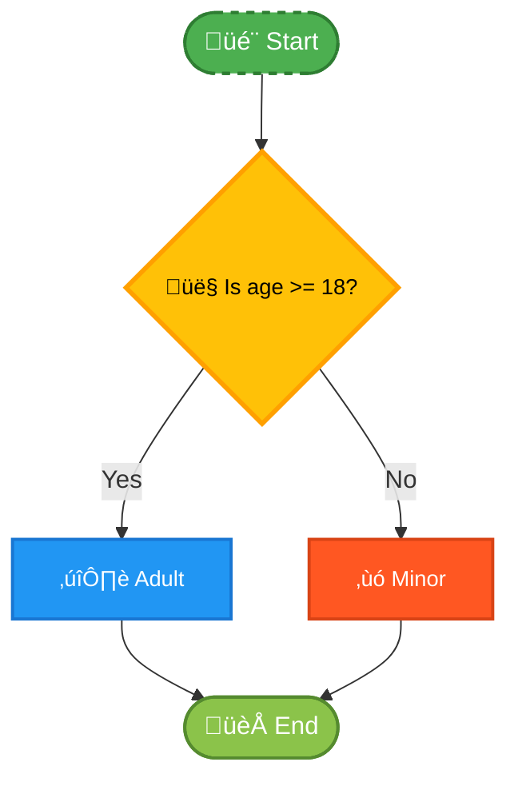
```mermaid
graph TD
    A([🎬 Start]) --> B{👤 Is age >= 18?};
    B -- Yes --> C[✔️ Adult];
    B -- No --> D[‚ùó Minor];
    C --> E([🏁 End]);
    D --> E;

    style A fill:#4CAF50,stroke:#2E7D32,stroke-width:2px,color:#FFFFFF,font-size:16px,stroke-dasharray: 5
    style B fill:#FFC107,stroke:#FFA000,stroke-width:3px,color:#000000,font-size:14px
    style C fill:#2196F3,stroke:#1976D2,stroke-width:2px,color:#FFFFFF,font-size:14px
    style D fill:#FF5722,stroke:#D84315,stroke-width:2px,color:#FFFFFF,font-size:14px
    style E fill:#8BC34A,stroke:#558B2F,stroke-width:2px,color:#FFFFFF,font-size:16px

```

## <span style="color:#2980b9">Conclusion üéâ</span>

Mastering conditional statements is crucial for writing effective and versatile
C programs. They allow you to create dynamic, responsive, and robust
applications by controlling the flow of execution based on various conditions.
Remember to choose the right type of conditional statement for the specific
logic you need to implement. Experiment with these examples and build upon them
to create your own programs!

# <span style="color:#e67e22">The Mighty `if` Statement in C üëë</span>

The `if` statement is a fundamental control flow statement in C. It allows your
program to make decisions and execute different blocks of code based on whether
a condition is true or false. Think of it as a branching path in your program's
execution.

## <span style="color:#2980b9">Syntax and Structure üß±</span>

The basic syntax of an `if` statement is straightforward:

```c
if (condition) {
  // Code to be executed if the condition is true
}
```

- **`condition`**: This is an expression that evaluates to either true
  (non-zero) or false (zero). This can involve comparisons (e.g., `x > 5`,
  `y == 10`), logical operators (`&&` for AND, `||` for OR, `!` for NOT), or any
  other expression that results in a numerical value.
- **`{ ... }`**: The curly braces enclose the block of code that will be
  executed _only_ if the `condition` is true. If the condition is false, this
  code is skipped.

### <span style="color:#8e44ad">Example: Checking a Number</span>

Let's see a simple example:

```c
#include <stdio.h>

int main() {
  int number = 10;

  if (number > 5) {
    printf("The number is greater than 5! üéâ\n"); // This line will be executed
  }

  return 0;
}
```

**Output:**

```
The number is greater than 5! üéâ
```

## <span style="color:#2980b9">Adding an `else` Clause 🔀</span>

You can extend the `if` statement with an `else` clause to specify what should
happen if the condition is _false_:

```c
if (condition) {
  // Code to execute if the condition is true
} else {
  // Code to execute if the condition is false
}
```

### <span style="color:#8e44ad">Example: Even or Odd 🤔</span>

```c
#include <stdio.h>

int main() {
  int number = 7;

  if (number % 2 == 0) {
    printf("The number is even.\n");
  } else {
    printf("The number is odd.\n"); // This line will be executed
  }

  return 0;
}
```

**Output:**

```
The number is odd.
```

## <span style="color:#2980b9">Nested `if` Statements 嵌套</span>

You can nest `if` statements inside each other to create more complex
decision-making logic.

### <span style="color:#8e44ad">Example: Nested `if` for Grades üìö</span>

```c
#include <stdio.h>

int main() {
  int score = 85;

  if (score >= 90) {
    printf("A Grade! ü•á\n");
  } else if (score >= 80) {
    printf("B Grade! ü•à\n"); //This line will be executed
  } else if (score >= 70) {
    printf("C Grade! ü•â\n");
  } else {
    printf("Needs Improvement! üòî\n");
  }

  return 0;
}
```

**Output:**

```
B Grade! ü•à
```

## <span style="color:#2980b9">Flowchart Representation üìä</span>

Here's a flowchart illustrating a simple `if-else` statement:

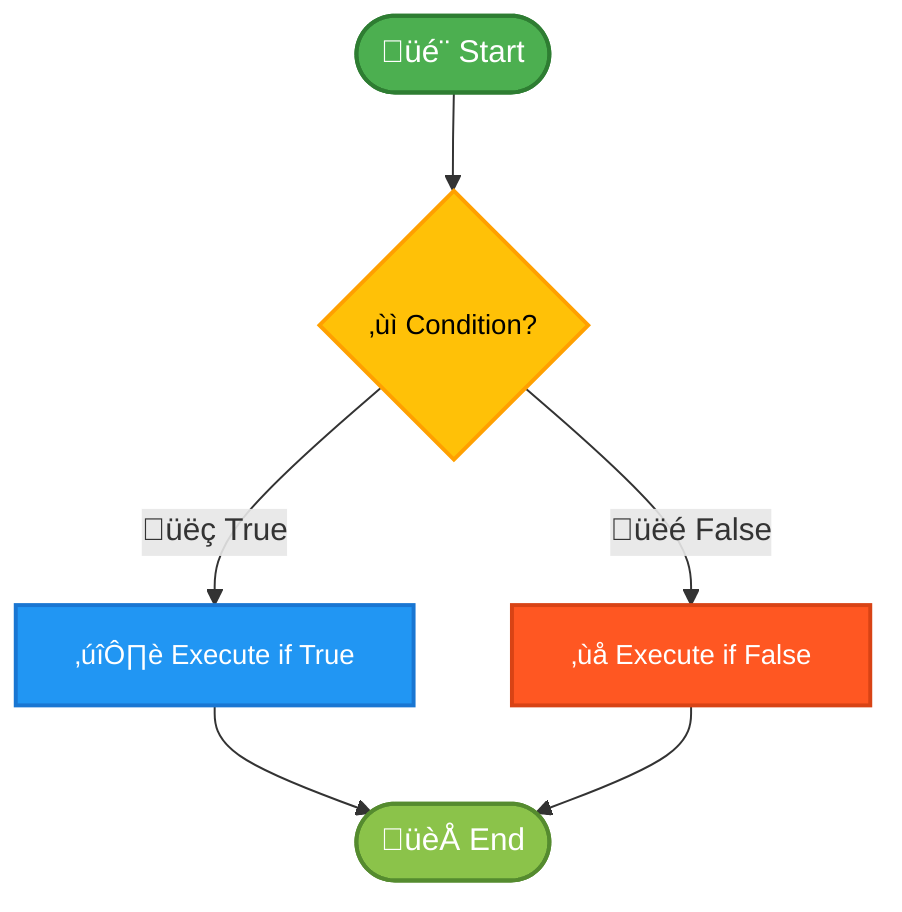
```mermaid
graph TD
    A([🎬 Start]) --> B{❓ Condition?};
    B -- 👍 True --> C[✔️ Execute if True];
    B -- üëé False --> D[‚ùå Execute if False];
    C --> E([🏁 End]);
    D --> E;

    style A fill:#4CAF50,stroke:#2E7D32,stroke-width:2px,color:#FFFFFF,font-size:16px
    style B fill:#FFC107,stroke:#FFA000,stroke-width:2px,color:#000000,font-size:14px
    style C fill:#2196F3,stroke:#1976D2,stroke-width:2px,color:#FFFFFF,font-size:14px
    style D fill:#FF5722,stroke:#D84315,stroke-width:2px,color:#FFFFFF,font-size:14px
    style E fill:#8BC34A,stroke:#558B2F,stroke-width:2px,color:#FFFFFF,font-size:16px

```

This visual representation clearly shows the branching paths based on the
condition's truth value. Remember, the power of `if` statements lies in their
ability to control the flow of your program, making it dynamic and responsive to
different inputs and situations.

# <span style="color:#e67e22">The Mighty `if else` Statement in C üëë</span>

The `if else` statement is a fundamental control flow structure in C. It allows
your program to make decisions and execute different blocks of code based on
whether a condition is true or false. Think of it as a branching path in your
program's journey! 🛣️

## <span style="color:#2980b9">Syntax and Structure üß±</span>

The basic syntax looks like this:

```c
if (condition) {
  // Code to execute if the condition is TRUE
} else {
  // Code to execute if the condition is FALSE
}
```

- **`if (condition)`:** This part evaluates a _boolean_ expression (an
  expression that results in either `true` or `false`). If the condition is
  true, the code inside the first curly braces `{}` is executed.
- **`else`:** This keyword introduces the alternative block of code to be
  executed _only_ if the condition in the `if` statement is false.
- **Curly braces `{}`:** These are crucial! They define the scope of the code
  blocks associated with `if` and `else`. This is especially important when you
  have multiple statements within each block.

### <span style="color:#8e44ad">Example: Checking for Even Numbers 🧮</span>

Let's say we want to check if a number is even or odd:

```c
#include <stdio.h>

int main() {
  int number = 10;

  if (number % 2 == 0) {
    printf("The number %d is even.\n", number); // Output if the number is even
  } else {
    printf("The number %d is odd.\n", number);  // Output if the number is odd
  }
  return 0;
}
```

**Output:**

```
The number 10 is even.
```

If we change `number` to 7, the output would be:

```
The number 7 is odd.
```

## <span style="color:#2980b9">Visualizing the Flow üåä</span>

Here's a flowchart illustrating the `if else` execution flow:

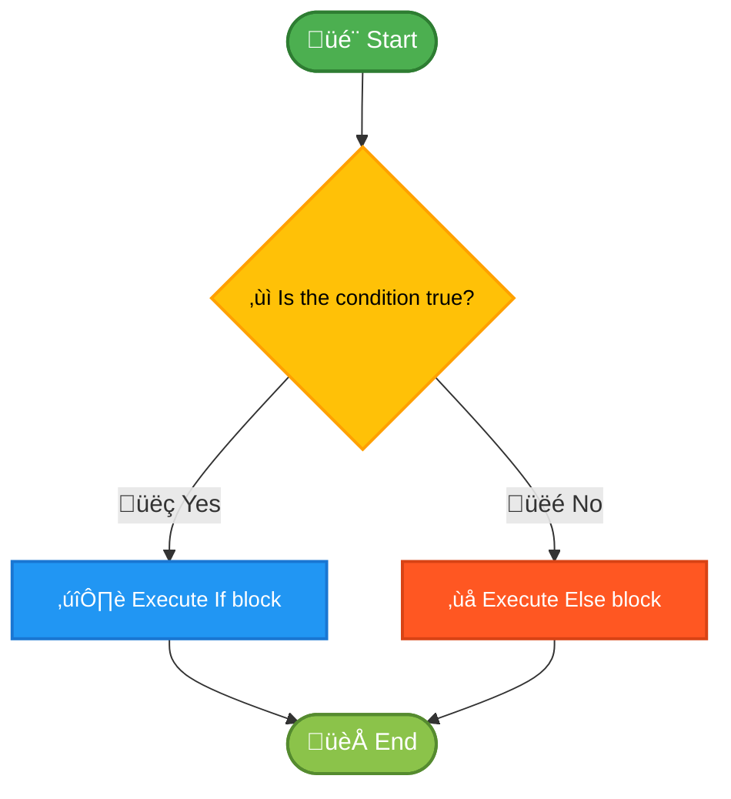
```mermaid
graph TD
    A([🎬 Start]) --> B{❓ Is the condition true?};
    B -- 👍 Yes --> C[✔️ Execute If block];
    B -- üëé No --> D[‚ùå Execute Else block];
    C --> E([🏁 End]);
    D --> E;

    style A fill:#4CAF50,stroke:#2E7D32,stroke-width:2px,color:#FFFFFF,font-size:16px
    style B fill:#FFC107,stroke:#FFA000,stroke-width:2px,color:#000000,font-size:14px
    style C fill:#2196F3,stroke:#1976D2,stroke-width:2px,color:#FFFFFF,font-size:14px
    style D fill:#FF5722,stroke:#D84315,stroke-width:2px,color:#FFFFFF,font-size:14px
    style E fill:#8BC34A,stroke:#558B2F,stroke-width:2px,color:#FFFFFF,font-size:16px

```

## <span style="color:#2980b9">Nested `if else` Statements 嵌套</span>

You can nest `if else` statements within each other to create more complex
decision-making structures. This allows for multiple levels of conditions.

### <span style="color:#8e44ad">Example: Grading System üéì</span>

```c
#include <stdio.h>

int main() {
  int score = 85;

  if (score >= 90) {
    printf("Grade: A\n");
  } else if (score >= 80) {
    printf("Grade: B\n");
  } else if (score >= 70) {
    printf("Grade: C\n");
  } else {
    printf("Grade: F\n");
  }
  return 0;
}
```

**Output:**

```
Grade: B
```

## <span style="color:#2980b9">`if else if else` Chain ⛓️</span>

The `else if` construct is a convenient way to chain multiple conditions
together. It only checks the next condition if the previous one is false. This
is more efficient than deeply nested `if else` statements in many cases.

## <span style="color:#2980b9">Important Considerations 🤔</span>

- **Indentation:** While not strictly required by the compiler, proper
  indentation makes your code significantly more readable and understandable.
  Always indent your code blocks consistently!
- **Boolean Expressions:** Ensure your conditions are correctly formulated to
  evaluate to `true` or `false`.
- **Operator Precedence:** Be mindful of operator precedence when writing
  complex boolean expressions. Use parentheses `()` to enforce the desired order
  of operations.

By mastering the `if else` statement, you gain crucial control over the flow of
your C programs, enabling you to create dynamic and responsive applications.
Remember to practice and experiment to solidify your understanding! üéâ

# <span style="color:#e67e22">The `if-else-if` Ladder in C 🪜</span>

This document explains the `if-else-if` ladder in C, a fundamental programming
construct used for making decisions based on multiple conditions. We'll explore
its functionality, illustrate it with examples, and highlight its importance in
creating flexible and robust programs.

## <span style="color:#2980b9">Understanding the `if-else-if` Ladder</span>

The `if-else-if` ladder allows you to check a series of conditions sequentially.
Once a condition evaluates to _true_, the corresponding block of code is
executed, and the rest of the ladder is skipped. If _none_ of the conditions are
true, the optional `else` block at the end is executed. Think of it like a
staircase – you climb step-by-step until you find the right step (condition) and
then you stop.

### <span style="color:#8e44ad">Syntax</span>

The general syntax is as follows:

```c
if (condition1) {
  // Code to execute if condition1 is true
} else if (condition2) {
  // Code to execute if condition1 is false and condition2 is true
} else if (condition3) {
  // Code to execute if condition1 and condition2 are false, and condition3 is true
} else {
  // Code to execute if none of the above conditions are true
}
```

### <span style="color:#8e44ad">Flowchart</span>

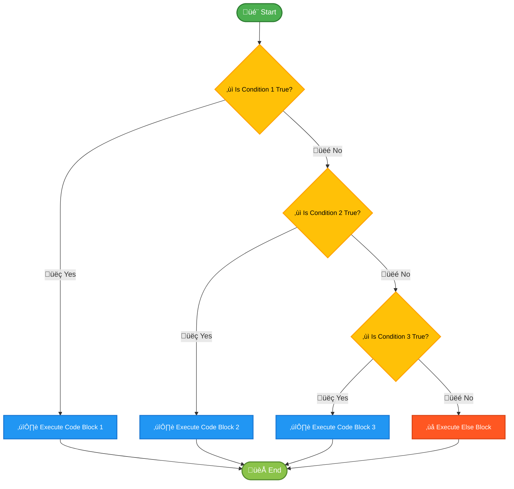
```mermaid
graph TD
    A([🎬 Start]) --> B{❓ Is Condition 1 True?};
    B -- 👍 Yes --> C[✔️ Execute Code Block 1];
    B -- üëé No --> D{‚ùì Is Condition 2 True?};
    D -- 👍 Yes --> E[✔️ Execute Code Block 2];
    D -- üëé No --> F{‚ùì Is Condition 3 True?};
    F -- 👍 Yes --> G[✔️ Execute Code Block 3];
    F -- üëé No --> H[‚ùå Execute Else Block];
    C --> I([🏁 End]);
    E --> I;
    G --> I;
    H --> I;

    style A fill:#4CAF50,stroke:#2E7D32,stroke-width:2px,color:#FFFFFF,font-size:16px
    style B fill:#FFC107,stroke:#FFA000,stroke-width:2px,color:#000000,font-size:14px
    style C fill:#2196F3,stroke:#1976D2,stroke-width:2px,color:#FFFFFF,font-size:14px
    style D fill:#FFC107,stroke:#FFA000,stroke-width:2px,color:#000000,font-size:14px
    style E fill:#2196F3,stroke:#1976D2,stroke-width:2px,color:#FFFFFF,font-size:14px
    style F fill:#FFC107,stroke:#FFA000,stroke-width:2px,color:#000000,font-size:14px
    style G fill:#2196F3,stroke:#1976D2,stroke-width:2px,color:#FFFFFF,font-size:14px
    style H fill:#FF5722,stroke:#D84315,stroke-width:2px,color:#FFFFFF,font-size:14px
    style I fill:#8BC34A,stroke:#558B2F,stroke-width:2px,color:#FFFFFF,font-size:16px

```

## <span style="color:#2980b9">Illustrative Examples ‚ú®</span>

Let's look at some examples to solidify our understanding.

### <span style="color:#8e44ad">Example 1: Grading System</span>

This example demonstrates assigning letter grades based on numerical scores:

```c
#include <stdio.h>

int main() {
  int score;

  printf("Enter your score: ");
  scanf("%d", &score);

  if (score >= 90) {
    printf("Grade: A\n"); //Output: Grade: A if score >=90
  } else if (score >= 80) {
    printf("Grade: B\n"); //Output: Grade: B if score >=80 and <90
  } else if (score >= 70) {
    printf("Grade: C\n"); //Output: Grade: C if score >=70 and <80
  } else if (score >= 60) {
    printf("Grade: D\n"); //Output: Grade: D if score >=60 and <70
  } else {
    printf("Grade: F\n"); //Output: Grade: F if score <60
  }

  return 0;
}
```

### <span style="color:#8e44ad">Example 2: Day of the Week</span>

This example determines the day of the week based on a numerical input (1-7):

```c
#include <stdio.h>

int main() {
  int day;

  printf("Enter a number (1-7): ");
  scanf("%d", &day);

  if (day == 1) {
    printf("Monday\n"); //Output: Monday if day is 1
  } else if (day == 2) {
    printf("Tuesday\n"); //Output: Tuesday if day is 2
  } else if (day == 3) {
    printf("Wednesday\n"); //Output: Wednesday if day is 3
  } else if (day == 4) {
    printf("Thursday\n"); //Output: Thursday if day is 4
  } else if (day == 5) {
    printf("Friday\n"); //Output: Friday if day is 5
  } else if (day == 6) {
    printf("Saturday\n"); //Output: Saturday if day is 6
  } else if (day == 7) {
    printf("Sunday\n"); //Output: Sunday if day is 7
  } else {
    printf("Invalid day number.\n"); //Output: Invalid day number if input is not between 1-7.
  }

  return 0;
}
```

## <span style="color:#2980b9">Key Considerations 🤔</span>

- **Order Matters:** The order of conditions is crucial. The first condition
  that evaluates to `true` will be executed, and the rest will be ignored.
- **`else` is Optional:** You can have an `if-else-if` ladder without an `else`
  block. In this case, if none of the conditions are met, no code within the
  ladder will be executed.
- **Readability:** For very long ladders, consider refactoring your code into
  functions to improve readability and maintainability. Using `switch`
  statements might also be a better alternative in some cases.

By understanding and using the `if-else-if` ladder effectively, you can create
more sophisticated and adaptable C programs. Remember to choose the most
readable and maintainable approach based on the complexity of your conditions.

# <span style="color:#e67e22">The `switch` Statement in C: A Comprehensive Guide üéâ</span>

The `switch` statement in C is a powerful control flow statement that offers a
more concise way to handle multiple conditions compared to nested `if-else`
statements. It's particularly useful when you need to check the value of a
single variable against several different possibilities. Think of it as a
supercharged, efficient version of a long series of `if-else if-else`
statements!

## <span style="color:#2980b9">Syntax and Structure ⚙️</span>

The basic syntax of a `switch` statement is as follows:

```c
switch (expression) {
  case constant1:
    // Code to execute if expression == constant1
    break;
  case constant2:
    // Code to execute if expression == constant2
    break;
  ...
  case constantN:
    // Code to execute if expression == constantN
    break;
  default:
    // Code to execute if expression doesn't match any case
    break;
}
```

- **`expression`**: This is an integer expression (or an expression that can be
  implicitly converted to an integer) that is evaluated once at the beginning of
  the `switch` statement.
- **`case constant1`, `case constant2`, ..., `case constantN`**: These are
  _constant_ integer expressions that the `expression` is compared against. If a
  match is found, the code following that `case` label is executed.
- **`break`**: The `break` statement is crucial. It prevents the code from
  "falling through" to the next `case` after a match. If you omit `break`, the
  code will execute sequentially until a `break` or the end of the `switch` is
  reached.
- **`default`**: This is an optional clause. The code within the `default` block
  executes if the `expression` doesn't match any of the `case` constants.

### <span style="color:#8e44ad">Important Considerations üí°</span>

- The `expression` must result in an integer type (like `int`, `char`, `enum`).
- `case` labels must be unique constants within the same `switch` statement.
- The `default` case is optional but recommended for handling unexpected values.

## <span style="color:#2980b9">Switch vs. If-Else: A Comparison üìä</span>

Let's illustrate the difference with examples:

**Example 1: Checking the day of the week using `if-else`**

```c
#include <stdio.h>

int main() {
  int day = 3; // Wednesday

  if (day == 1) {
    printf("It's Monday!\n"); // Output: This won't be printed.
  } else if (day == 2) {
    printf("It's Tuesday!\n"); // Output: This won't be printed.
  } else if (day == 3) {
    printf("It's Wednesday!\n"); // Output: It's Wednesday!
  } else if (day == 4) {
    printf("It's Thursday!\n"); // Output: This won't be printed.
  } else if (day == 5) {
    printf("It's Friday!\n"); // Output: This won't be printed.
  } else if (day == 6) {
    printf("It's Saturday!\n"); // Output: This won't be printed.
  } else if (day == 7) {
    printf("It's Sunday!\n"); // Output: This won't be printed.
  } else {
    printf("Invalid day!\n"); // Output: This won't be printed.
  }
  return 0;
}
```

**Example 2: Checking the day of the week using `switch`**

```c
#include <stdio.h>

int main() {
  int day = 3; // Wednesday

  switch (day) {
    case 1:
      printf("It's Monday!\n");
      break;
    case 2:
      printf("It's Tuesday!\n");
      break;
    case 3:
      printf("It's Wednesday!\n"); // Output: It's Wednesday!
      break;
    case 4:
      printf("It's Thursday!\n");
      break;
    case 5:
      printf("It's Friday!\n");
      break;
    case 6:
      printf("It's Saturday!\n");
      break;
    case 7:
      printf("It's Sunday!\n");
      break;
    default:
      printf("Invalid day!\n");
      break;
  }
  return 0;
}
```

As you can see, the `switch` statement provides a cleaner and more readable
solution for this type of multiple-condition check.

## <span style="color:#2980b9">Flowchart illustrating the `switch` statement 🗺️</span>

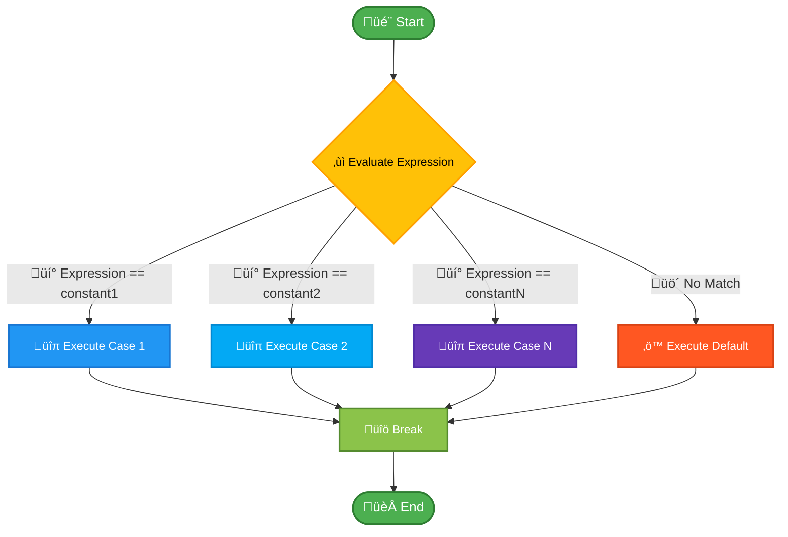
```mermaid
graph TD
    A([🎬 Start]) --> B{❓ Evaluate Expression};
    B -- üí° Expression == constant1 --> C[üîπ Execute Case 1];
    B -- üí° Expression == constant2 --> D[üîπ Execute Case 2];
    B -- üí° Expression == constantN --> E[üîπ Execute Case N];
    B -- üö´ No Match --> F[‚ö™ Execute Default];
    C --> G[üîö Break];
    D --> G;
    E --> G;
    F --> G;
    G --> H([🏁 End]);

    style A fill:#4CAF50,stroke:#2E7D32,stroke-width:2px,color:#FFFFFF,font-size:16px
    style B fill:#FFC107,stroke:#FFA000,stroke-width:2px,color:#000000,font-size:14px
    style C fill:#2196F3,stroke:#1976D2,stroke-width:2px,color:#FFFFFF,font-size:14px
    style D fill:#03A9F4,stroke:#0288D1,stroke-width:2px,color:#FFFFFF,font-size:14px
    style E fill:#673AB7,stroke:#512DA8,stroke-width:2px,color:#FFFFFF,font-size:14px
    style F fill:#FF5722,stroke:#D84315,stroke-width:2px,color:#FFFFFF,font-size:14px
    style G fill:#8BC34A,stroke:#558B2F,stroke-width:2px,color:#FFFFFF,font-size:14px
    style H fill:#4CAF50,stroke:#2E7D32,stroke-width:2px,color:#FFFFFF,font-size:16px

```

## <span style="color:#2980b9">Falling Through Cases ⚠️</span>

If you _intentionally_ omit the `break` statement, the code will "fall through"
to the next case:

```c
#include <stdio.h>

int main() {
  int day = 2; // Tuesday

  switch (day) {
    case 1:
      printf("It's Monday!\n");
    case 2:
      printf("It's Tuesday!\n"); //Output: It's Tuesday!
    case 3:
      printf("It's Wednesday!\n"); //Output: It's Wednesday!
      break;
    default:
      printf("Invalid day!\n");
      break;
  }
  return 0;
}
```

Use this feature cautiously, as it can make your code harder to understand and
debug if not carefully planned.

This guide provides a comprehensive overview of the `switch` statement in C.
Remember to choose the most appropriate control flow statement based on your
specific needs for readability and maintainability. Happy coding! üéâ

# <span style="color:#e67e22">Limitations of `switch` Statements for Range Checks in C</span> ⚠️

C's `switch` statement is a powerful tool for conditional branching, but it has
inherent limitations when dealing with range checks. Let's explore these
limitations and find better alternatives.

## <span style="color:#2980b9">The Problem: `switch` and Ranges</span> 🧮

The `switch` statement excels at comparing a single variable against a list of
_discrete_ values. However, checking if a variable falls within a _range_ of
values requires cumbersome workarounds. Consider this scenario: you want to
categorize a test score into letter grades (A, B, C, D, F).

**Example:**

```c
int score = 78;
char grade;

switch (score) {
  case 90 ... 100:  //This is NOT valid C syntax!
    grade = 'A';
    break;
  case 80 ... 89:  //This is NOT valid C syntax!
    grade = 'B';
    break;
  // ... and so on
  default:
    grade = 'F';
}

printf("Your grade is: %c\n", grade); //This will not compile correctly.
```

The above code attempts to use ranges (e.g., `90 ... 100`), which is _not_
supported by standard C `switch` statements. Each case must specify a single,
distinct value.

### <span style="color:#8e44ad">Why This Doesn't Work</span> 🤔

The `switch` statement fundamentally relies on a jump table or similar
optimization technique to quickly locate the matching case. Ranges introduce
complexity that breaks this optimization.

## <span style="color:#2980b9">Alternatives and Workarounds</span> üí°

Several elegant methods can handle range checks effectively:

### <span style="color:#8e44ad">1. `if-else if-else` Ladder</span> 🪜

This is the most straightforward alternative. It's readable and easily
understandable, especially for simpler ranges.

```c
int score = 78;
char grade;

if (score >= 90) {
  grade = 'A';
} else if (score >= 80) {
  grade = 'B';
} else if (score >= 70) {
  grade = 'C';
} else if (score >= 60) {
  grade = 'D';
} else {
  grade = 'F';
}

printf("Your grade is: %c\n", grade); // Output: Your grade is: C
```

### <span style="color:#8e44ad">2. Array Lookup (For Equally Spaced Ranges)</span> üìö

If the ranges are equally spaced, an array lookup offers a compact and efficient
solution:

```c
int score = 78;
int gradeIndex = (score >= 0 && score <= 100) ? (score / 10) : 0; //Handle out-of-range scores
char grades[] = {'F', 'F', 'D', 'C', 'B', 'A'}; //Note: we skip A+ and other grades


printf("Your grade is: %c\n", grades[gradeIndex]); // Output: Your grade is: C
```

_Note: This assumes 10-point grade intervals. Adjust accordingly for other
intervals._

### <span style="color:#8e44ad">3. Using a function to improve code readability</span> üß±

We can improve the readability and maintainability of our code using a separate
function. This is particularly useful when dealing with complex logic.

```c
char getGrade(int score){
    char grade;
    if (score >= 90) {
        grade = 'A';
    } else if (score >= 80) {
        grade = 'B';
    } else if (score >= 70) {
        grade = 'C';
    } else if (score >= 60) {
        grade = 'D';
    } else {
        grade = 'F';
    }
    return grade;
}

int main(){
    int score = 78;
    char grade = getGrade(score);
    printf("Your grade is: %c\n", grade); // Output: Your grade is: C
    return 0;
}
```

## <span style="color:#2980b9">Flowchart Illustrating `if-else if-else`</span> flowchart

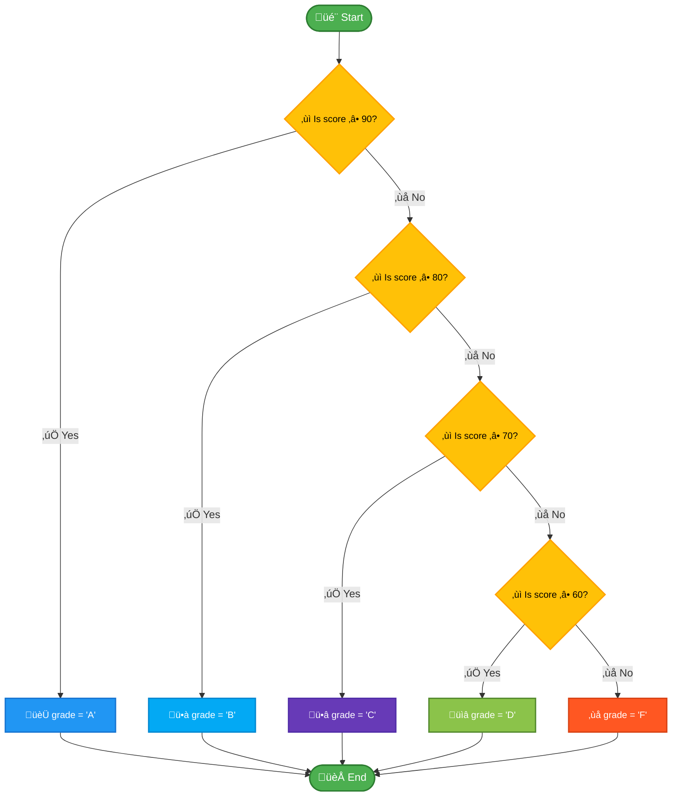
```mermaid
graph TD
    A([🎬 Start]) --> B{❓ Is score ≥ 90?};
    B -- ✅ Yes --> C[🏆 grade = 'A'];
    B -- ‚ùå No --> D{‚ùì Is score ‚â• 80?};
    D -- ‚úÖ Yes --> E[ü•à grade = 'B'];
    D -- ‚ùå No --> F{‚ùì Is score ‚â• 70?};
    F -- ‚úÖ Yes --> G[ü•â grade = 'C'];
    F -- ‚ùå No --> H{‚ùì Is score ‚â• 60?};
    H -- ‚úÖ Yes --> I[üìâ grade = 'D'];
    H -- ‚ùå No --> J[‚ùå grade = 'F'];
    C --> K([🏁 End]);
    E --> K;
    G --> K;
    I --> K;
    J --> K;

    style A fill:#4CAF50,stroke:#2E7D32,stroke-width:2px,color:#FFFFFF,font-size:16px
    style B fill:#FFC107,stroke:#FFA000,stroke-width:2px,color:#000000,font-size:14px
    style D fill:#FFC107,stroke:#FFA000,stroke-width:2px,color:#000000,font-size:14px
    style F fill:#FFC107,stroke:#FFA000,stroke-width:2px,color:#000000,font-size:14px
    style H fill:#FFC107,stroke:#FFA000,stroke-width:2px,color:#000000,font-size:14px
    style C fill:#2196F3,stroke:#1976D2,stroke-width:2px,color:#FFFFFF,font-size:14px
    style E fill:#03A9F4,stroke:#0288D1,stroke-width:2px,color:#FFFFFF,font-size:14px
    style G fill:#673AB7,stroke:#512DA8,stroke-width:2px,color:#FFFFFF,font-size:14px
    style I fill:#8BC34A,stroke:#558B2F,stroke-width:2px,color:#FFFFFF,font-size:14px
    style J fill:#FF5722,stroke:#D84315,stroke-width:2px,color:#FFFFFF,font-size:14px
    style K fill:#4CAF50,stroke:#2E7D32,stroke-width:2px,color:#FFFFFF,font-size:16px

```

This flowchart visually represents the branching logic of the `if-else if-else`
approach, making it easier to understand the code's flow.

In conclusion, while `switch` statements are excellent for discrete value
comparisons, `if-else if-else` chains or array lookups (for equally-spaced
ranges) provide more flexible and efficient ways to handle range checks in C.
Choose the method that best suits your specific needs and coding style,
prioritizing readability and maintainability. Remember to always handle edge
cases and potential errors, such as out-of-range inputs.

# <span style="color:#e67e22">Loops in C Programming 🔄</span>

Loops are fundamental in programming. They let your code repeat a block of
instructions multiple times, saving you from writing the same code over and
over. Think of it like a washing machine – it repeats the wash, rinse, and spin
cycle until the clothes are clean! This significantly reduces code length and
improves efficiency.

## <span style="color:#2980b9">Why Use Loops? 🤔</span>

Imagine you need to print numbers from 1 to 10. Without loops, you'd have to
write `printf()` ten times! Loops automate this repetition. They are essential
for tasks like:

- Processing arrays and lists.
- Iterating through files.
- Repeating calculations until a condition is met.
- Creating patterns and structures in your output.

## <span style="color:#2980b9">Types of Loops in C 🌀</span>

C offers three main types of loops:

### <span style="color:#8e44ad">1. `for` Loop 🔁</span>

The `for` loop is perfect when you know _exactly_ how many times you want to
repeat a block of code.

```c
#include <stdio.h>

int main() {
  // Prints numbers from 1 to 5
  for (int i = 1; i <= 5; i++) {
    printf("%d ", i);
  }
  printf("\n"); // Output: 1 2 3 4 5

  return 0;
}
```

**Explanation:**

- `int i = 1;`: Initializes a counter variable `i` to 1. This happens only once
  at the start.
- `i <= 5;`: This is the _condition_. The loop continues as long as `i` is less
  than or equal to 5.
- `i++`: This _increments_ `i` by 1 after each iteration.

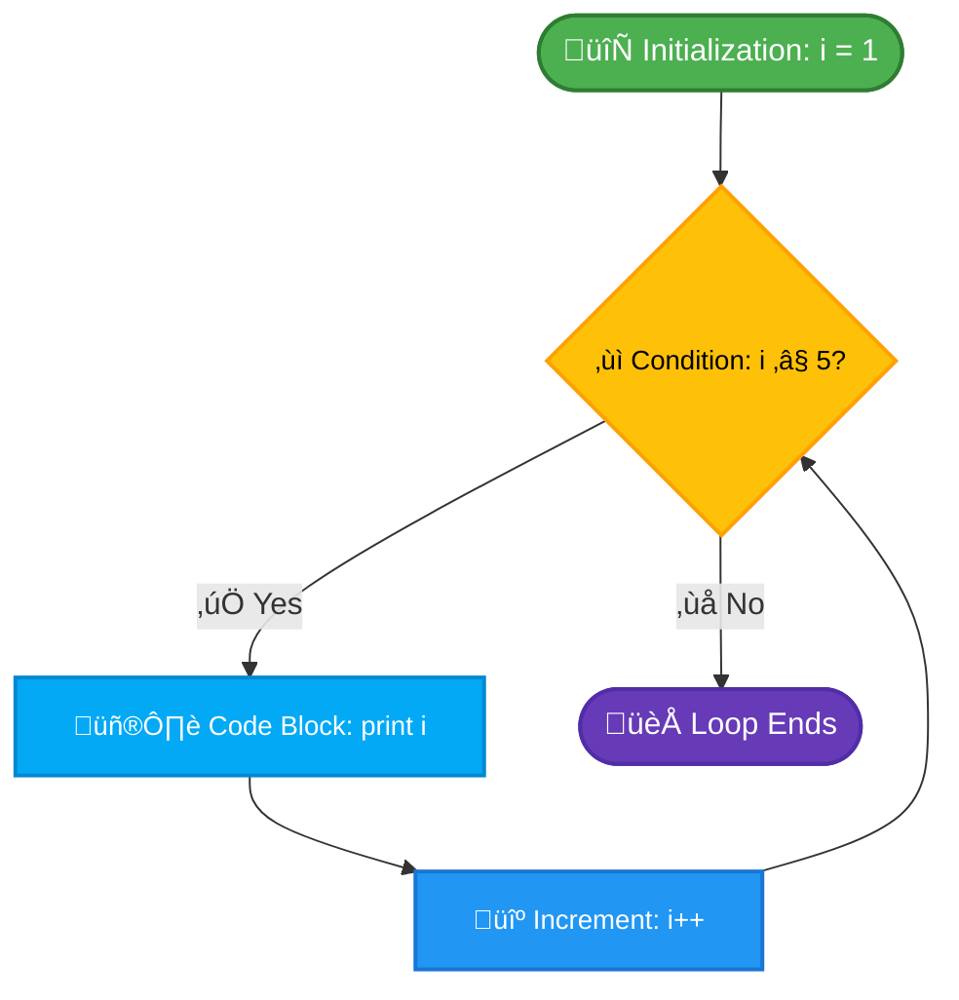
```mermaid
graph TD
    A([🔄 Initialization: i = 1]) --> B{❓ Condition: i ≤ 5?};
    B -- ✅ Yes --> C[🖨️ Code Block: print i];
    C --> D[🔼 Increment: i++];
    D --> B;
    B -- ❌ No --> E([🏁 Loop Ends]);

    style A fill:#4CAF50,stroke:#2E7D32,stroke-width:2px,color:#FFFFFF,font-size:16px
    style B fill:#FFC107,stroke:#FFA000,stroke-width:2px,color:#000000,font-size:14px
    style C fill:#03A9F4,stroke:#0288D1,stroke-width:2px,color:#FFFFFF,font-size:14px
    style D fill:#2196F3,stroke:#1976D2,stroke-width:2px,color:#FFFFFF,font-size:14px
    style E fill:#673AB7,stroke:#512DA8,stroke-width:2px,color:#FFFFFF,font-size:16px

```

### <span style="color:#8e44ad">2. `while` Loop 🔄</span>

Use a `while` loop when you want to repeat a block of code as long as a certain
_condition_ is true. You don't know beforehand how many times it will run.

```c
#include <stdio.h>

int main() {
  int count = 0;
  // Prints numbers until count reaches 5
  while (count < 5) {
    printf("%d ", count);
    count++;
  }
  printf("\n"); // Output: 0 1 2 3 4

  return 0;
}
```

**Explanation:**

The loop continues as long as `count` is less than 5. The `count++` is crucial;
without it, the loop would run forever (an _infinite loop_ – avoid this!).

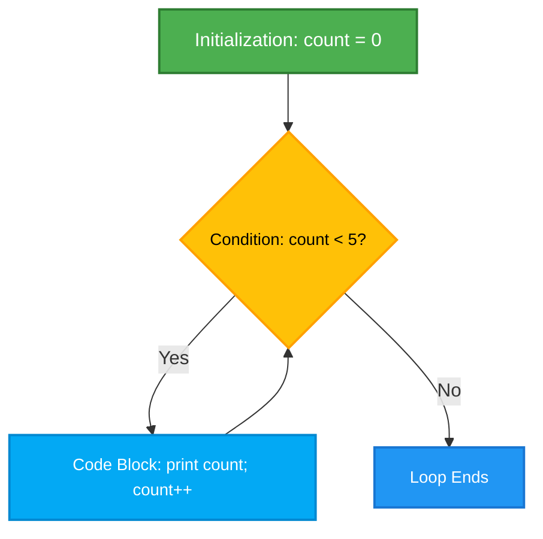
```mermaid
graph TD
    A[Initialization: count = 0] --> B{Condition: count < 5?};
    B -- Yes --> C[Code Block: print count; count++];
    C --> B;
    B -- No --> D[Loop Ends];

    style A fill:#4CAF50,stroke:#2E7D32,stroke-width:2px,color:#FFFFFF,font-size:16px
    style B fill:#FFC107,stroke:#FFA000,stroke-width:2px,color:#000000,font-size:14px
    style C fill:#03A9F4,stroke:#0288D1,stroke-width:2px,color:#FFFFFF,font-size:14px
    style D fill:#2196F3,stroke:#1976D2,stroke-width:2px,color:#FFFFFF,font-size:14px
```

### <span style="color:#8e44ad">3. `do-while` Loop 🔁</span>

Similar to `while`, but the condition is checked _after_ the code block
executes. This guarantees the code block runs _at least once_.

```c
#include <stdio.h>

int main() {
  int i = 0;
  // Prints 0 then numbers until i reaches 5.
  do {
    printf("%d ", i);
    i++;
  } while (i < 5);
  printf("\n"); // Output: 0 1 2 3 4

  return 0;
}
```

**Explanation:**

The code inside the `do` block runs first. Then, the condition `i < 5` is
checked. If true, the loop continues; otherwise, it ends.

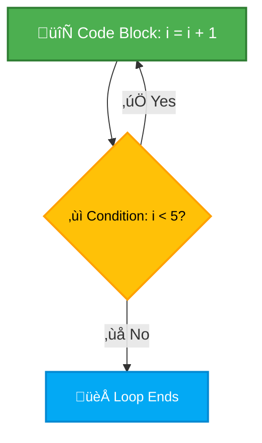
```mermaid
graph TD
    A[🔄 Code Block: i = i + 1] --> B{❓ Condition: i < 5?};
    B -- ‚úÖ Yes --> A;
    B -- ❌ No --> C[🏁 Loop Ends];

    style A fill:#4CAF50,stroke:#2E7D32,stroke-width:2px,color:#FFFFFF,font-size:16px
    style B fill:#FFC107,stroke:#FFA000,stroke-width:2px,color:#000000,font-size:14px
    style C fill:#03A9F4,stroke:#0288D1,stroke-width:2px,color:#FFFFFF,font-size:14px


```

## <span style="color:#2980b9">Choosing the Right Loop 🤔</span>

The best loop type depends on your specific needs:

- Use `for` when you know the number of iterations.
- Use `while` when the number of iterations is determined by a condition.
- Use `do-while` when the code block _must_ execute at least once.

Remember to always be mindful of infinite loops – they can crash your program!
Properly incrementing or decrementing your counter variables is key to avoiding
them. Happy looping! üéâ

Error: Invalid response structure for 'C for Loop'.

# <span style="color:#e67e22">The Wonderful World of `while` Loops in C üåé</span>

The `while` loop in C is a fundamental control flow statement that allows you to
repeatedly execute a block of code as long as a specified condition remains
true. Think of it as a tireless worker, continuing its task until told to stop!

## <span style="color:#2980b9">Syntax and Execution ⚙️</span>

The basic syntax of a `while` loop is straightforward:

```c
while (condition) {
  // Code to be executed repeatedly
}
```

- **`condition`**: This is a Boolean expression (an expression that evaluates to
  either `true` or `false`). The code within the curly braces `{}` will only
  execute if the `condition` is `true`.
- **Code Block**: The statements enclosed within the curly braces are executed
  repeatedly as long as the `condition` evaluates to `true`.

The loop continues to iterate until the `condition` becomes `false`. If the
`condition` is initially `false`, the code block is never executed.

### <span style="color:#8e44ad">Flowchart Representation</span>

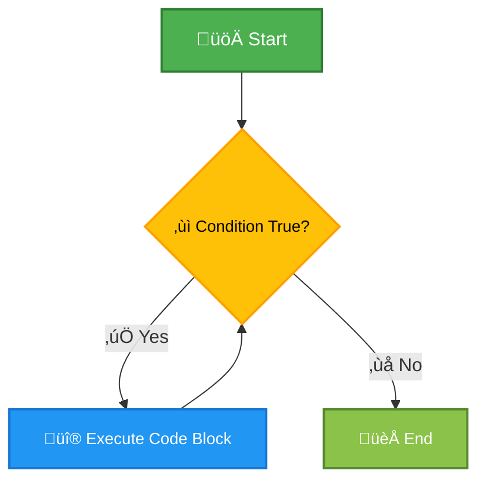
```mermaid
graph TD
    A[üöÄ Start] --> B{‚ùì Condition True?};
    B -- ‚úÖ Yes --> C[üî® Execute Code Block];
    C --> B;
    B -- ❌ No --> D[🏁 End];

    style A fill:#4CAF50,stroke:#2E7D32,stroke-width:2px,color:#FFFFFF,font-size:16px
    style B fill:#FFC107,stroke:#FFA000,stroke-width:2px,color:#000000,font-size:14px
    style C fill:#2196F3,stroke:#1976D2,stroke-width:2px,color:#FFFFFF,font-size:14px
    style D fill:#8BC34A,stroke:#558B2F,stroke-width:2px,color:#FFFFFF,font-size:14px

```

## <span style="color:#2980b9">Indefinite Iteration Examples üåü</span>

`while` loops are particularly useful when you don't know in advance how many
times you need to repeat a block of code. The loop continues until a specific
event or condition is met.

### <span style="color:#8e44ad">Example 1: Guess the Number 🎯</span>

```c
#include <stdio.h>
#include <stdlib.h>
#include <time.h>

int main() {
  int secretNumber, guess;

  // Seed the random number generator
  srand(time(NULL));
  secretNumber = rand() % 100 + 1; // Generate a random number between 1 and 100

  printf("Welcome to the Number Guessing Game!\n");
  printf("I'm thinking of a number between 1 and 100.\n");

  do {
    printf("Enter your guess: ");
    scanf("%d", &guess);

    if (guess < secretNumber) {
      printf("Too low! Try again.\n");
    } else if (guess > secretNumber) {
      printf("Too high! Try again.\n");
    }
  } while (guess != secretNumber);

  printf("Congratulations! You guessed the number: %d\n", secretNumber);
  return 0;
}
```

_Example Output (will vary due to random number generation):_

```
Welcome to the Number Guessing Game!
I'm thinking of a number between 1 and 100.
Enter your guess: 50
Too low! Try again.
Enter your guess: 75
Too high! Try again.
Enter your guess: 62
Too low! Try again.
Enter your guess: 68
Congratulations! You guessed the number: 68
```

### <span style="color:#8e44ad">Example 2: Summing Numbers Until Zero ‚ûï</span>

```c
#include <stdio.h>

int main() {
  int number, sum = 0;

  printf("Enter numbers to sum (enter 0 to stop):\n");

  while (1) { //Infinite loop, but controlled by a break condition
    scanf("%d", &number);
    if (number == 0) {
      break; // Exit the loop when the input is 0
    }
    sum += number;
  }

  printf("The sum of the entered numbers is: %d\n", sum);
  return 0;
}
```

_Example Output:_

```
Enter numbers to sum (enter 0 to stop):
10
20
30
0
The sum of the entered numbers is: 60
```

## <span style="color:#2980b9">Important Considerations 🤔</span>

- **Infinite Loops**: Be cautious! If your `condition` never becomes `false`,
  you'll create an _infinite loop_, causing your program to run indefinitely.
  Use `break` statements or carefully design your conditions to avoid this.
- **Loop Counters**: While `while` loops are great for indefinite iteration, you
  can still use a counter variable _inside_ the loop to track iterations if
  needed.

By mastering the `while` loop, you unlock a powerful tool for creating flexible
and dynamic C programs! Remember to always carefully consider your loop
conditions to ensure correct and efficient program execution.

# <span style="color:#e67e22">Understanding the `do while` Loop in C 🔄</span>

The `do while` loop is a fundamental control flow statement in C that allows you
to execute a block of code repeatedly, _at least once_, based on a condition. It
differs slightly from the `while` loop, offering a crucial advantage in certain
scenarios. Let's explore its syntax, functionality, and differences compared to
its `while` loop counterpart.

## <span style="color:#2980b9">Syntax of the `do while` Loop üìú</span>

The general structure of a `do while` loop is as follows:

```c
do {
  // Code to be executed repeatedly
} while (condition);
```

- **`do`**: This keyword marks the beginning of the loop block. The code within
  the curly braces `{}` will be executed _at least once_.
- **`{` and `}`**: These curly braces enclose the code block to be repeated.
- **`while (condition)`**: This part checks the condition. If the `condition`
  evaluates to `true` (non-zero), the loop continues to execute the code block.
  If it's `false` (zero), the loop terminates. The crucial difference is that
  the condition is checked _after_ the code block is executed.

### <span style="color:#8e44ad">Flowchart Representation</span>

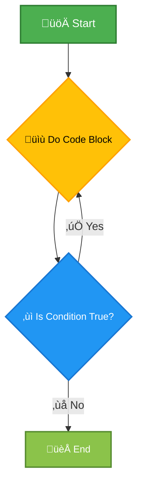
```mermaid
graph TD
    A[üöÄ Start] --> B{üìù Do Code Block};
    B --> C{‚ùì Is Condition True?};
    C -- ‚úÖ Yes --> B;
    C -- ❌ No --> D[🏁 End];

    style A fill:#4CAF50,stroke:#2E7D32,stroke-width:2px,color:#FFFFFF,font-size:16px
    style B fill:#FFC107,stroke:#FFA000,stroke-width:2px,color:#000000,font-size:14px
    style C fill:#2196F3,stroke:#1976D2,stroke-width:2px,color:#FFFFFF,font-size:14px
    style D fill:#8BC34A,stroke:#558B2F,stroke-width:2px,color:#FFFFFF,font-size:14px

```

## <span style="color:#2980b9">Key Differences from the `while` Loop üßê</span>

Here's a comparison table highlighting the core differences:

| Feature            | `while` Loop                           | `do while` Loop        |
| ------------------ | -------------------------------------- | ---------------------- |
| Condition Check    | _Before_ code execution                | _After_ code execution |
| Minimum Executions | Zero (if condition is initially false) | At least one           |

## <span style="color:#2980b9">Examples illustrating `do while` functionality ‚ú®</span>

### <span style="color:#8e44ad">Example 1: Simple Number Guessing Game</span>

This example demonstrates a simple number guessing game where the user is
prompted to guess a number until they guess correctly. The `do while` loop
ensures that the user gets at least one chance to guess.

```c
#include <stdio.h>
#include <stdlib.h>
#include <time.h>

int main() {
  int secretNumber, guess;

  // Seed the random number generator
  srand(time(NULL));
  secretNumber = rand() % 100 + 1; // Generate a random number between 1 and 100

  printf("Welcome to the Number Guessing Game!\n");

  do {
    printf("Guess a number between 1 and 100: ");
    scanf("%d", &guess);

    if (guess < secretNumber) {
      printf("Too low! Try again.\n");
    } else if (guess > secretNumber) {
      printf("Too high! Try again.\n");
    }
  } while (guess != secretNumber);

  printf("Congratulations! You guessed the number %d.\n", secretNumber);
  return 0;
}
```

**Output (example):**

```
Welcome to the Number Guessing Game!
Guess a number between 1 and 100: 50
Too low! Try again.
Guess a number between 1 and 100: 75
Too high! Try again.
Guess a number between 1 and 100: 60
Too low! Try again.
Guess a number between 1 and 100: 65
Congratulations! You guessed the number 65.
```

### <span style="color:#8e44ad">Example 2: Menu-Driven Program</span>

A menu-driven program often benefits from a `do while` loop to ensure the menu
is displayed at least once and the program doesn't exit prematurely.

```c
#include <stdio.h>

int main() {
    int choice;

    do {
        printf("\nMenu:\n");
        printf("1. Option 1\n");
        printf("2. Option 2\n");
        printf("3. Exit\n");
        printf("Enter your choice: ");
        scanf("%d", &choice);

        switch (choice) {
            case 1:
                printf("You chose Option 1\n");
                break;
            case 2:
                printf("You chose Option 2\n");
                break;
            case 3:
                printf("Exiting...\n");
                break;
            default:
                printf("Invalid choice. Please try again.\n");
        }
    } while (choice != 3);

    return 0;
}
```

**Output (example):**

```
Menu:
1. Option 1
2. Option 2
3. Exit
Enter your choice: 1
You chose Option 1

Menu:
1. Option 1
2. Option 2
3. Exit
Enter your choice: 2
You chose Option 2

Menu:
1. Option 1
2. Option 2
3. Exit
Enter your choice: 3
Exiting...
```

## <span style="color:#2980b9">Conclusion 🎯</span>

The `do while` loop provides a concise way to execute a block of code at least
once, making it suitable for scenarios where you need to guarantee initial
execution regardless of the condition. Understanding its nuances compared to the
`while` loop is crucial for writing efficient and robust C programs. Remember to
choose the loop type that best suits your specific needs!

# <span style="color:#e67e22">C Loops: 🌀 `for` vs. `while`</span>

This document compares the `for` and `while` loops in C, highlighting their
differences and providing examples to illustrate their best use cases.

## <span style="color:#2980b9">The `for` Loop 🔁</span>

The `for` loop is ideal when you know _in advance_ how many times you need to
iterate. It's perfect for processing arrays, iterating a specific number of
times, or working with sequences.

### <span style="color:#8e44ad">Syntax and Structure</span>

The general syntax of a `for` loop is:

```c
for (initialization; condition; increment/decrement) {
  // Code to be executed repeatedly
}
```

- **Initialization:** Executed once at the beginning of the loop. Typically used
  to declare and initialize a counter variable.
- **Condition:** Checked before each iteration. If true, the loop body executes;
  otherwise, the loop terminates.
- **Increment/Decrement:** Executed after each iteration. Usually used to update
  the counter variable.

### <span style="color:#8e44ad">Example: Printing Numbers 1-10</span>

```c
#include <stdio.h>

int main() {
  for (int i = 1; i <= 10; i++) {
    printf("%d ", i); // Prints each number
  }
  printf("\n"); //Newline for better formatting
  return 0;
}
```

**Output:**

```
1 2 3 4 5 6 7 8 9 10
```

### <span style="color:#8e44ad">Diagram</span>

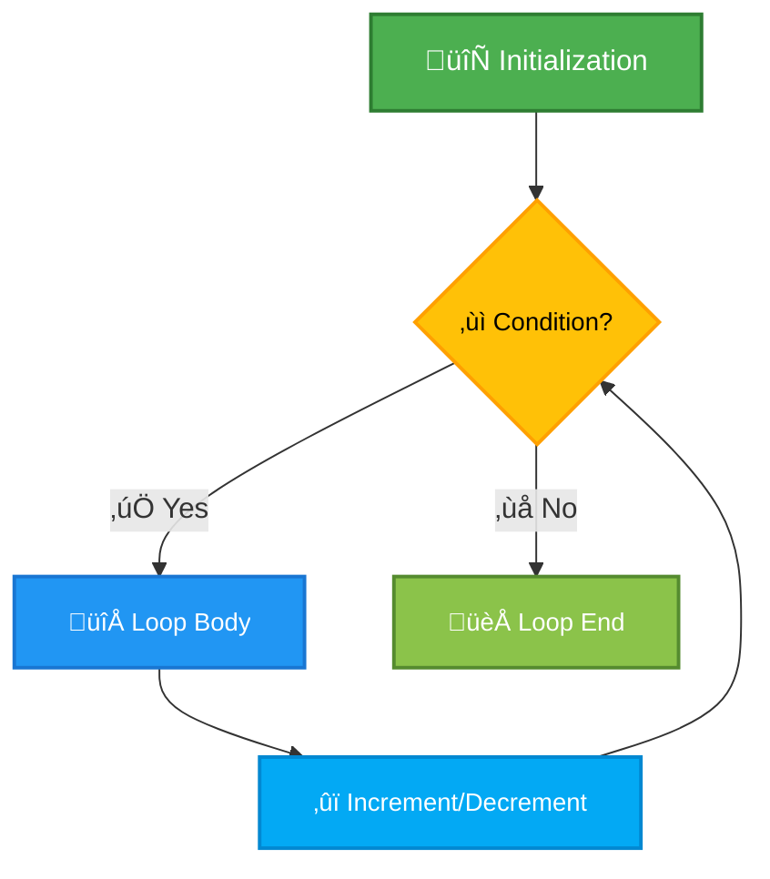
```mermaid
graph TD
    A[🔄 Initialization] --> B{❓ Condition?};
    B -- ✅ Yes --> C[🔁 Loop Body];
    C --> D[‚ûï Increment/Decrement];
    D --> B;
    B -- ❌ No --> E[🏁 Loop End];

    style A fill:#4CAF50,stroke:#2E7D32,stroke-width:2px,color:#FFFFFF,font-size:16px
    style B fill:#FFC107,stroke:#FFA000,stroke-width:2px,color:#000000,font-size:14px
    style C fill:#2196F3,stroke:#1976D2,stroke-width:2px,color:#FFFFFF,font-size:14px
    style D fill:#03A9F4,stroke:#0288D1,stroke-width:2px,color:#FFFFFF,font-size:14px
    style E fill:#8BC34A,stroke:#558B2F,stroke-width:2px,color:#FFFFFF,font-size:14px

```

## <span style="color:#2980b9">The `while` Loop 🔄</span>

The `while` loop is perfect when you don't know _in advance_ how many times you
need to iterate. It continues to execute as long as a specified condition is
true. It's often used for input processing, reading files until the end, or
waiting for a specific event.

### <span style="color:#8e44ad">Syntax and Structure</span>

The general syntax of a `while` loop is:

```c
while (condition) {
  // Code to be executed repeatedly
}
```

- **Condition:** Checked before each iteration. If true, the loop body executes;
  otherwise, the loop terminates. It's crucial to ensure the condition
  eventually becomes false to prevent an infinite loop.

### <span style="color:#8e44ad">Example: Reading Input Until a Specific Character</span>

```c
#include <stdio.h>

int main() {
  char input;
  printf("Enter characters (type 'q' to quit):\n");
  while ((input = getchar()) != 'q') {
    printf("You entered: %c\n", input);
  }
  printf("Loop terminated.\n");
  return 0;
}
```

**Output (Example):**

```
Enter characters (type 'q' to quit):
a
You entered: a
b
You entered: b
q
Loop terminated.
```

### <span style="color:#8e44ad">Diagram</span>

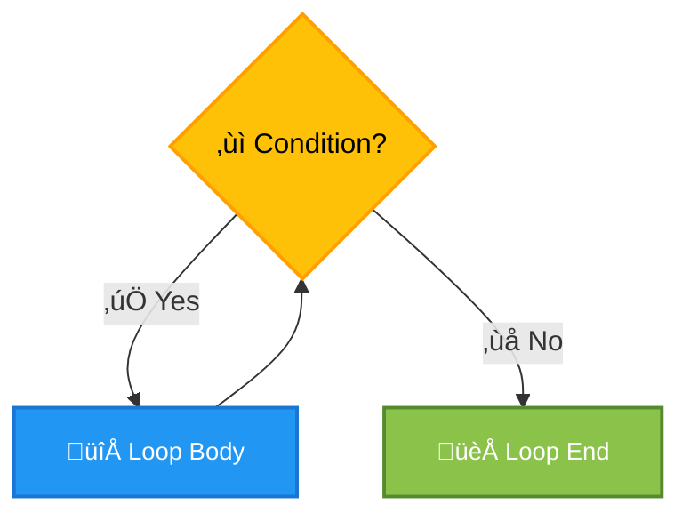
```mermaid
graph TD
    A{❓ Condition?} -- ✅ Yes --> B[🔁 Loop Body];
    B --> A;
    A -- ❌ No --> C[🏁 Loop End];

    style A fill:#FFC107,stroke:#FFA000,stroke-width:2px,color:#000000,font-size:16px
    style B fill:#2196F3,stroke:#1976D2,stroke-width:2px,color:#FFFFFF,font-size:14px
    style C fill:#8BC34A,stroke:#558B2F,stroke-width:2px,color:#FFFFFF,font-size:14px

```

## <span style="color:#2980b9">Choosing Between `for` and `while` 🤔</span>

- **Use `for` when:** You know the number of iterations beforehand (e.g.,
  iterating through an array).
- **Use `while` when:** The number of iterations is unknown and depends on a
  condition (e.g., reading data from a file until the end-of-file is reached).

Remember to always carefully design your loop conditions to avoid infinite
loops! Use `break` and `continue` statements judiciously for more complex
control flow within loops.

This guide provides a clear understanding of `for` and `while` loops in C.
Choose the loop that best suits your specific needs for efficient and readable
code. Remember to always test your code thoroughly! üß™

# <span style="color:#e67e22">The `continue` Statement in C: Skipping Iterations ‚ú®</span>

The `continue` statement in C is a control flow statement that allows you to
skip the rest of the current iteration of a loop (either `for` or `while`) and
proceed directly to the next iteration. Think of it as saying, "Okay, I'm done
with this one; let's move on to the next!"

## <span style="color:#2980b9">How `continue` Works 🏃‍♂️</span>

When the `continue` statement is encountered within a loop, the following
happens:

- The remaining statements within the current loop iteration are ignored.
- The loop's control goes directly to the loop's condition check (or
  increment/decrement in the case of a `for` loop).
- If the loop condition is still true, the next iteration begins; otherwise, the
  loop terminates.

### <span style="color:#8e44ad">Flowchart</span>

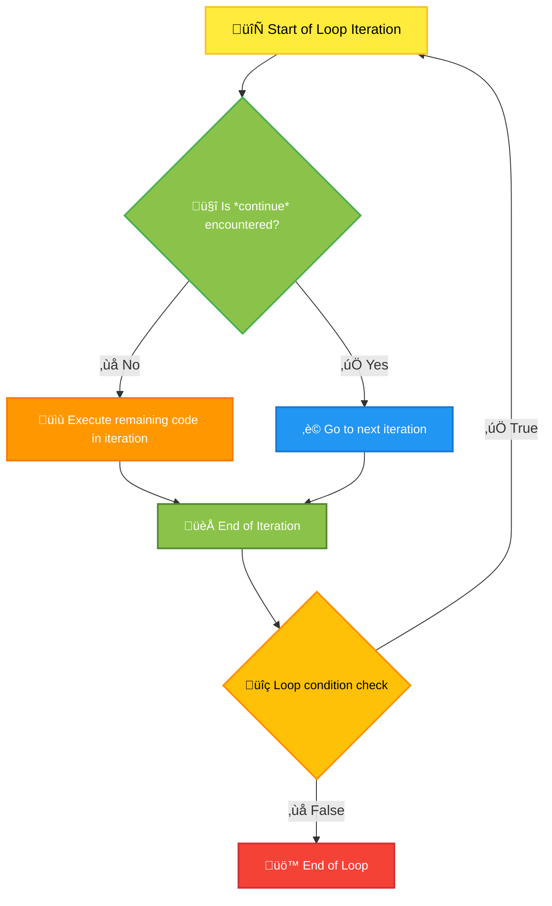
```mermaid
graph TD
    A[🔄 Start of Loop Iteration] --> B{🤔 Is *continue* encountered?};
    B -- ‚úÖ Yes --> C[‚è© Go to next iteration];
    B -- ‚ùå No --> D[üìù Execute remaining code in iteration];
    D --> E[🏁 End of Iteration];
    C --> E;
    E --> F{üîç Loop condition check};
    F -- ‚úÖ True --> A;
    F -- ‚ùå False --> G[üö™ End of Loop];

    style A fill:#FFEB3B,stroke:#FBC02D,stroke-width:2px,color:#000000,font-size:16px
    style B fill:#8BC34A,stroke:#4CAF50,stroke-width:2px,color:#FFFFFF,font-size:14px
    style C fill:#2196F3,stroke:#1976D2,stroke-width:2px,color:#FFFFFF,font-size:14px
    style D fill:#FF9800,stroke:#F57C00,stroke-width:2px,color:#FFFFFF,font-size:14px
    style E fill:#8BC34A,stroke:#558B2F,stroke-width:2px,color:#FFFFFF,font-size:14px
    style F fill:#FFC107,stroke:#FF8F00,stroke-width:2px,color:#000000,font-size:14px
    style G fill:#F44336,stroke:#D32F2F,stroke-width:2px,color:#FFFFFF,font-size:14px

```

## <span style="color:#2980b9">Examples Illustrating `continue` üí°</span>

Let's explore some examples to solidify your understanding.

### <span style="color:#8e44ad">Example 1: Skipping Even Numbers</span>

This example demonstrates printing only odd numbers from 1 to 10 using a `for`
loop and the `continue` statement.

```c
#include <stdio.h>

int main() {
  for (int i = 1; i <= 10; i++) {
    if (i % 2 == 0) { // Check if the number is even
      continue;       // Skip the rest of the iteration if even
    }
    printf("%d ", i); // Print only odd numbers
  }
  printf("\n"); //Output: 1 3 5 7 9
  return 0;
}
```

_Output_: `1 3 5 7 9`

### <span style="color:#8e44ad">Example 2: Processing User Input with `continue`</span>

This example demonstrates a `while` loop that continues to prompt the user for
input until a positive number is entered.

```c
#include <stdio.h>

int main() {
  int num;
  while (1) {
    printf("Enter a positive integer: ");
    if (scanf("%d", &num) != 1) { //Error handling for non-integer inputs.
        printf("Invalid input. Please enter an integer.\n");
        while (getchar() != '\n'); //Clear the input buffer
        continue;
    }
    if (num <= 0) {
      printf("Number must be positive. Try again.\n");
      continue; // Skip to the next iteration if the number is not positive
    }
    printf("You entered: %d\n", num);
    break; // Exit the loop if a positive number is entered
  }
  return 0;
}
```

_Output (Example):_

```
Enter a positive integer: -5
Number must be positive. Try again.
Enter a positive integer: 0
Number must be positive. Try again.
Enter a positive integer: abc
Invalid input. Please enter an integer.
Enter a positive integer: 7
You entered: 7
```

## <span style="color:#2980b9">Key Differences between `continue` and `break` 🔄</span>

It's important to distinguish `continue` from `break`:

- **`continue`**: Skips the _rest_ of the current iteration and proceeds to the
  next iteration of the loop.
- **`break`**: Exits the loop entirely.

## <span style="color:#2980b9">When to Use `continue` 🤔</span>

Use `continue` when you want to selectively skip parts of a loop's iterations
based on a condition, but you _don't_ want to terminate the loop prematurely.
It's particularly useful for handling exceptions or filtering data within loops.
Remember, overuse can lead to less readable code, so use it judiciously.

# <span style="color:#e67e22">The Mighty `break` Statement in C üí•</span>

The `break` statement in C is a powerful tool used to abruptly end the execution
of a loop or a `switch` statement. It's like hitting the "escape" button in a
program, forcing an immediate exit from the current control structure. Let's
explore its functionality in detail.

## <span style="color:#2980b9">Breaking Free from Loops 🔄</span>

The `break` statement offers a way to exit a `for`, `while`, or `do-while` loop
prematurely. This is particularly useful when a specific condition is met and
further iterations are unnecessary or undesirable.

### <span style="color:#8e44ad">Example: Exiting a `for` loop</span>

```c
#include <stdio.h>

int main() {
  for (int i = 1; i <= 10; i++) {
    if (i == 5) {
      break; // Exit the loop when i is 5
    }
    printf("%d ", i);
  }
  printf("\nLoop terminated.\n");
  return 0;
}
```

**Output:**

```
1 2 3 4 Loop terminated.
```

The loop iterates until `i` becomes 5. At that point, `break` is executed, and
the loop terminates immediately, preventing the printing of numbers 6
through 10.

### <span style="color:#8e44ad">Flowchart for `break` in a `for` loop</span>

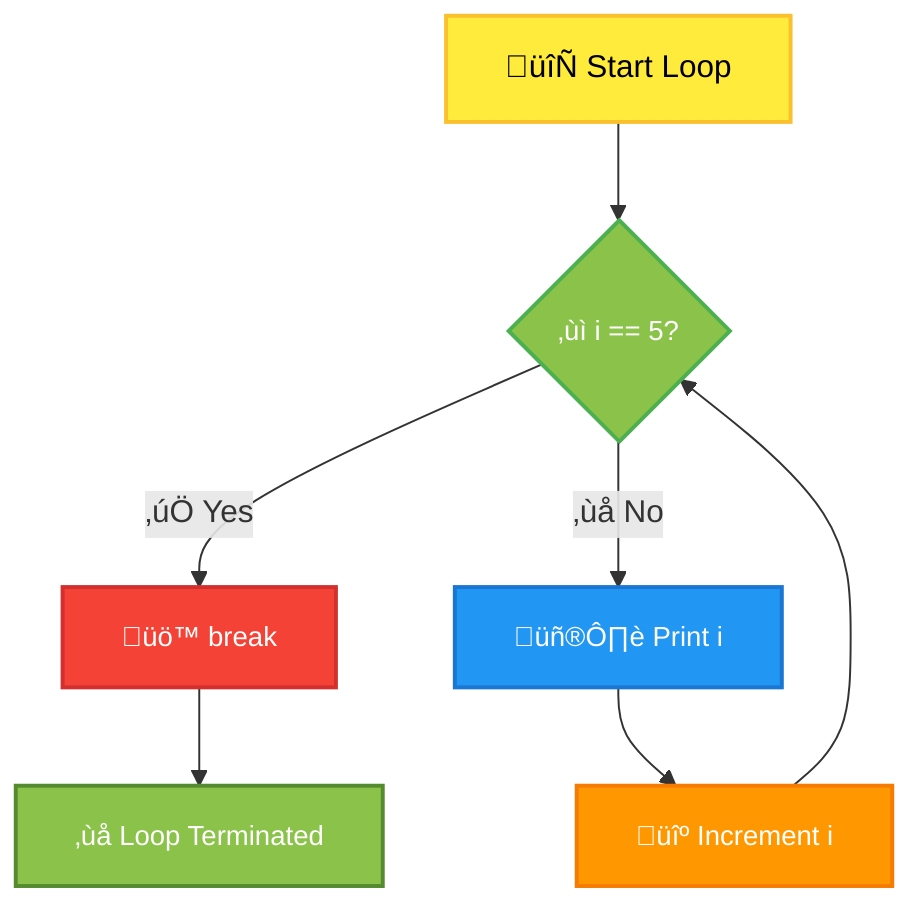
```mermaid
graph TD
    A[🔄 Start Loop] --> B{❓ i == 5?};
    B -- ‚úÖ Yes --> C[üö™ break];
    B -- ❌ No --> D[🖨️ Print i];
    D --> E[🔼 Increment i];
    E --> B;
    C --> F[‚ùå Loop Terminated];

    style A fill:#FFEB3B,stroke:#FBC02D,stroke-width:2px,color:#000000,font-size:16px
    style B fill:#8BC34A,stroke:#4CAF50,stroke-width:2px,color:#FFFFFF,font-size:14px
    style C fill:#F44336,stroke:#D32F2F,stroke-width:2px,color:#FFFFFF,font-size:14px
    style D fill:#2196F3,stroke:#1976D2,stroke-width:2px,color:#FFFFFF,font-size:14px
    style E fill:#FF9800,stroke:#F57C00,stroke-width:2px,color:#FFFFFF,font-size:14px
    style F fill:#8BC34A,stroke:#558B2F,stroke-width:2px,color:#FFFFFF,font-size:14px

```

## <span style="color:#2980b9">Escaping from `switch` Statements üö™</span>

In a `switch` statement, `break` prevents the "fall-through" behavior. Without
`break`, execution would continue into the next `case` even if the current
`case`'s condition is met. This is often unintended and leads to errors.

### <span style="color:#8e44ad">Example: `switch` with and without `break`</span>

```c
#include <stdio.h>

int main() {
  int day = 3;
  switch (day) {
    case 1:
      printf("Monday\n");
      //break;  //Without break, this will "fall through"
    case 2:
      printf("Tuesday\n");
      break;
    case 3:
      printf("Wednesday\n");
      break;
    default:
      printf("Other day\n");
  }
  return 0;
}
```

**Output (Without break in case 1):**

```
Monday
Tuesday
```

**Output (With break in case 1):**

```
Wednesday
```

The first output shows the fall-through; the second demonstrates how `break`
prevents it.

### <span style="color:#8e44ad">Flowchart for `break` in a `switch` statement</span>

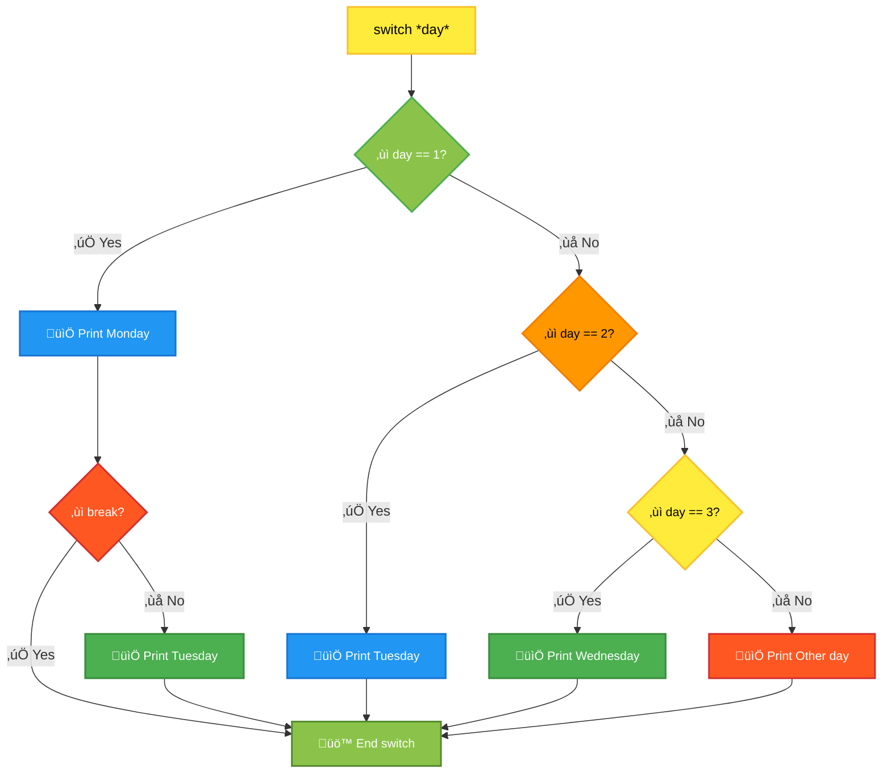
```mermaid
graph TD
    A[switch *day*] --> B{‚ùì day == 1?};
    B -- ‚úÖ Yes --> C[üìÖ Print Monday];
    C --> D{‚ùì break?};
    D -- ‚úÖ Yes --> E[üö™ End switch];
    D -- ‚ùå No --> F[üìÖ Print Tuesday];
    F --> E;
    B -- ‚ùå No --> G{‚ùì day == 2?};
    G -- ‚úÖ Yes --> H[üìÖ Print Tuesday];
    H --> E;
    G -- ‚ùå No --> I{‚ùì day == 3?};
    I -- ‚úÖ Yes --> J[üìÖ Print Wednesday];
    J --> E;
    I -- ‚ùå No --> K[üìÖ Print Other day];
    K --> E;

    style A fill:#FFEB3B,stroke:#FBC02D,stroke-width:2px,color:#000000,font-size:16px
    style B fill:#8BC34A,stroke:#4CAF50,stroke-width:2px,color:#FFFFFF,font-size:14px
    style C fill:#2196F3,stroke:#1976D2,stroke-width:2px,color:#FFFFFF,font-size:14px
    style D fill:#FF5722,stroke:#D32F2F,stroke-width:2px,color:#FFFFFF,font-size:14px
    style F fill:#4CAF50,stroke:#388E3C,stroke-width:2px,color:#FFFFFF,font-size:14px
    style G fill:#FF9800,stroke:#F57C00,stroke-width:2px,color:#000000,font-size:14px
    style H fill:#2196F3,stroke:#1976D2,stroke-width:2px,color:#FFFFFF,font-size:14px
    style I fill:#FFEB3B,stroke:#FBC02D,stroke-width:2px,color:#000000,font-size:14px
    style J fill:#4CAF50,stroke:#388E3C,stroke-width:2px,color:#FFFFFF,font-size:14px
    style K fill:#FF5722,stroke:#D32F2F,stroke-width:2px,color:#FFFFFF,font-size:14px
    style E fill:#8BC34A,stroke:#558B2F,stroke-width:2px,color:#FFFFFF,font-size:14px

```

## <span style="color:#2980b9">Key Takeaways üí°</span>

- `break` provides a mechanism to exit loops and `switch` statements
  prematurely.
- In loops, it prevents unnecessary iterations when a specific condition is met.
- In `switch` statements, it avoids unintended fall-through between cases,
  leading to cleaner and more predictable code.
- Always consider using `break` strategically to improve the efficiency and
  readability of your C programs.

Remember to use `break` carefully and thoughtfully; its misuse can lead to
unexpected program behavior. Understanding its function is crucial for writing
effective and reliable C code.

# <span style="color:#e67e22">The `goto` Statement in C: A Controversial Jump</span> ✈️

## <span style="color:#2980b9">Understanding the `goto` Statement</span>

The `goto` statement in C is a **jump statement** that allows you to transfer
control unconditionally to another point in your program. Think of it as a
forceful redirection – you tell the program to immediately jump to a specific
labeled location, ignoring the normal sequential flow of execution.

### <span style="color:#8e44ad">Syntax</span>

The syntax is straightforward:

```c
goto label;

// ... some code ...

label:
  // Code to execute after the jump
```

- `goto label;` : This line initiates the jump. `label` is an identifier (a
  name) that you define to mark the target location.
- `label:`: This is a label declaration. It's simply a name followed by a colon
  (`:`) that marks a specific point in your code. Labels must be unique within a
  function.

## <span style="color:#2980b9">Potential Uses (and Why They're Often Discouraged)</span>

While `goto` might seem like a powerful tool, its use is generally discouraged
in modern C programming. Here's why:

- **Unstructured Code:** Excessive use of `goto` leads to _spaghetti code_ –
  programs that are difficult to read, understand, debug, and maintain. The flow
  of control becomes tangled and unpredictable.

- **Error-Prone:** Jumping around with `goto` can easily lead to errors,
  especially in larger programs. It's easy to accidentally jump into or out of
  loops or blocks of code incorrectly.

- **Alternatives:** Structured programming constructs like `for`, `while`,
  `do-while`, `if-else`, `switch`, and functions offer more readable and
  maintainable ways to control program flow.

### <span style="color:#8e44ad">Example: A Simple (and questionable) `goto` usage</span>

This example demonstrates a simple `goto` usage for exiting a nested loop.
_While functional, it's considered bad practice._

```c
#include <stdio.h>

int main() {
  int i, j;
  for (i = 0; i < 5; i++) {
    for (j = 0; j < 5; j++) {
      if (i == 2 && j == 3) {
        goto end_loops; // Jumping out of both loops
      }
      printf("i = %d, j = %d\n", i, j);
    }
  }
end_loops:
  printf("Exiting loops using goto...\n");
  return 0;
}
```

**Output:**

```
i = 0, j = 0
i = 0, j = 1
i = 0, j = 2
i = 0, j = 3
i = 0, j = 4
i = 1, j = 0
i = 1, j = 1
i = 1, j = 2
i = 1, j = 3
i = 1, j = 4
i = 2, j = 0
i = 2, j = 1
i = 2, j = 2
Exiting loops using goto...
```

### <span style="color:#8e44ad">A Better Approach (Without `goto`) </span>

The previous example can be rewritten in a much clearer way using a `break`
statement:

```c
#include <stdio.h>

int main() {
  int i, j;
  for (i = 0; i < 5; i++) {
    for (j = 0; j < 5; j++) {
      if (i == 2 && j == 3) {
        break; // Exits the inner loop
      }
      printf("i = %d, j = %d\n", i, j);
    }
    if (i == 2 && j ==3) break; // Exits outer loop
  }
  printf("Exiting loops using break...\n");
  return 0;
}
```

The output is the same, but the code is significantly more readable and easier
to understand.

## <span style="color:#2980b9">Flowchart Comparison</span>

**Using `goto`:**

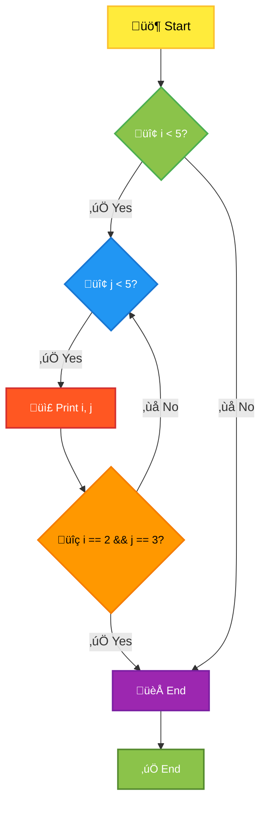
```mermaid
graph TD
    A[🚦 Start] --> B{🔢 i < 5?};
    B -- ✅ Yes --> C{🔢 j < 5?};
    C -- ✅ Yes --> D[📣 Print i, j];
    D --> E{üîç i == 2 && j == 3?};
    E -- ‚úÖ Yes --> F[‚õî Goto End];
    E -- ‚ùå No --> C;
    B -- ‚ùå No --> F;
    F[🏁 End] --> G[✅ End];

    style A fill:#FFEB3B,stroke:#FBC02D,stroke-width:2px,color:#000000,font-size:16px
    style B fill:#8BC34A,stroke:#4CAF50,stroke-width:2px,color:#FFFFFF,font-size:14px
    style C fill:#2196F3,stroke:#1976D2,stroke-width:2px,color:#FFFFFF,font-size:14px
    style D fill:#FF5722,stroke:#D32F2F,stroke-width:2px,color:#FFFFFF,font-size:14px
    style E fill:#FF9800,stroke:#F57C00,stroke-width:2px,color:#000000,font-size:14px
    style F fill:#9C27B0,stroke:#7B1FA2,stroke-width:2px,color:#FFFFFF,font-size:14px
    style G fill:#8BC34A,stroke:#558B2F,stroke-width:2px,color:#FFFFFF,font-size:14px

```

**Using `break`:**

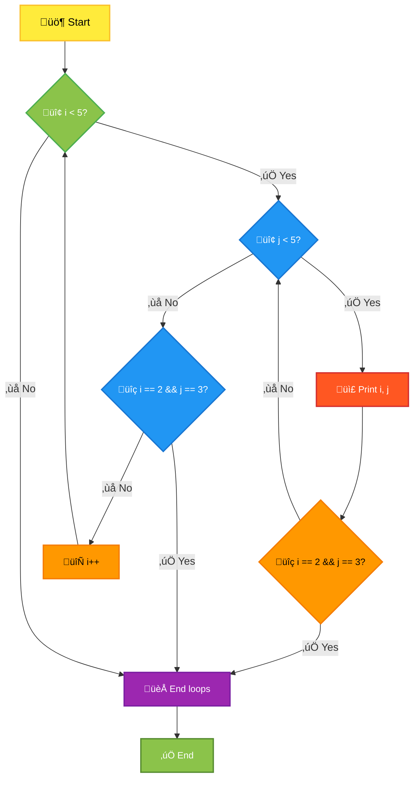
```mermaid
graph TD
    A[🚦 Start] --> B{🔢 i < 5?};
    B -- ✅ Yes --> C{🔢 j < 5?};
    C -- ✅ Yes --> D[📣 Print i, j];
    D --> E{üîç i == 2 && j == 3?};
    E -- ‚úÖ Yes --> F[‚õî Break];
    E -- ‚ùå No --> C;
    C -- ‚ùå No --> H{üîç i == 2 && j == 3?};
    H -- ‚úÖ Yes --> F;
    H -- ❌ No --> I[🔄 i++];
    I --> B;
    B -- ‚ùå No --> F;
    F[🏁 End loops] --> G[✅ End];

    style A fill:#FFEB3B,stroke:#FBC02D,stroke-width:2px,color:#000000,font-size:16px
    style B fill:#8BC34A,stroke:#4CAF50,stroke-width:2px,color:#FFFFFF,font-size:14px
    style C fill:#2196F3,stroke:#1976D2,stroke-width:2px,color:#FFFFFF,font-size:14px
    style D fill:#FF5722,stroke:#D32F2F,stroke-width:2px,color:#FFFFFF,font-size:14px
    style E fill:#FF9800,stroke:#F57C00,stroke-width:2px,color:#000000,font-size:14px
    style F fill:#9C27B0,stroke:#7B1FA2,stroke-width:2px,color:#FFFFFF,font-size:14px
    style H fill:#2196F3,stroke:#1976D2,stroke-width:2px,color:#FFFFFF,font-size:14px
    style I fill:#FF9800,stroke:#F57C00,stroke-width:2px,color:#000000,font-size:14px
    style G fill:#8BC34A,stroke:#558B2F,stroke-width:2px,color:#FFFFFF,font-size:14px


```

As you can see, the `break`-based flowchart is much cleaner and easier to
follow.

## <span style="color:#2980b9">Conclusion</span> üîö

While `goto` _can_ be used, it's generally best avoided in favor of structured
programming techniques. Using `goto` makes your code harder to read, understand,
and maintain, increasing the likelihood of errors. Stick to the structured
programming constructs provided by C for cleaner, more robust code!

<h1><span style='color:#e67e22'>Conclusion</span></h1>

And there you have it! We've covered a lot of ground today, and hopefully, you
found this information helpful and insightful. üòä But the conversation doesn't
end here! We'd love to hear your thoughts, comments, and any suggestions you
might have. What did you think of this post? What other topics would you like to
see us cover? Let us know in the comments below! üëá We're excited to hear from
you! üéâ
