# <span style="color:#e67e22;">What we will learn in this post?</span>

<ul style='list-style-type: none; padding-left: 0;'>
<li><span style='color: #2980b9; font-size: 20px; font-weight: bold;'>👉</span> <span style='color: #2ecc71; font-size: 18px; font-weight: bold;'>C Functions</span></li>
<li><span style='color: #2980b9; font-size: 20px; font-weight: bold;'>👉</span> <span style='color: #2ecc71; font-size: 18px; font-weight: bold;'>User-Defined Function in C</span></li>
<li><span style='color: #2980b9; font-size: 20px; font-weight: bold;'>👉</span> <span style='color: #2ecc71; font-size: 18px; font-weight: bold;'>Parameter Passing Techniques in C</span></li>
<li><span style='color: #2980b9; font-size: 20px; font-weight: bold;'>👉</span> <span style='color: #2ecc71; font-size: 18px; font-weight: bold;'>Importance of Function Prototype in C</span></li>
<li><span style='color: #2980b9; font-size: 20px; font-weight: bold;'>👉</span> <span style='color: #2ecc71; font-size: 18px; font-weight: bold;'>Return Multiple Values From a C Function</span></li>
<li><span style='color: #2980b9; font-size: 20px; font-weight: bold;'>👉</span> <span style='color: #2ecc71; font-size: 18px; font-weight: bold;'>main Function in C</span></li>
<li><span style='color: #2980b9; font-size: 20px; font-weight: bold;'>👉</span> <span style='color: #2ecc71; font-size: 18px; font-weight: bold;'>Implicit Return Type int in C</span></li>
<li><span style='color: #2980b9; font-size: 20px; font-weight: bold;'>👉</span> <span style='color: #2ecc71; font-size: 18px; font-weight: bold;'>Callbacks in C</span></li>
<li><span style='color: #2980b9; font-size: 20px; font-weight: bold;'>👉</span> <span style='color: #2ecc71; font-size: 18px; font-weight: bold;'>Nested Functions in C</span></li>
<li><span style='color: #2980b9; font-size: 20px; font-weight: bold;'>👉</span> <span style='color: #2ecc71; font-size: 18px; font-weight: bold;'>Variadic Functions in C</span></li>
<li><span style='color: #2980b9; font-size: 20px; font-weight: bold;'>👉</span> <span style='color: #2ecc71; font-size: 18px; font-weight: bold;'>_Noreturn Function Specifier in C</span></li>
<li><span style='color: #2980b9; font-size: 20px; font-weight: bold;'>👉</span> <span style='color: #2ecc71; font-size: 18px; font-weight: bold;'>Predefined Identifier __func__ in C</span></li>
<li><span style='color: #2980b9; font-size: 20px; font-weight: bold;'>👉</span> <span style='color: #2ecc71; font-size: 18px; font-weight: bold;'>Maths Functions in C</span></li>
<li><span style='color: #2980b9; font-size: 20px; font-weight: bold;'>👉</span> <span style='color: #2ecc71; font-size: 18px; font-weight: bold;'>Conclusion!</span></li>
</ul>

# <span style="color:#e67e22">Functions in C: Your Code's Best Friend 🤝</span>

Imagine building with LEGOs. Wouldn't it be easier if you had pre-built sections like a car, a house, or a tree, instead of building every single brick individually? Functions in C programming are like those pre-built LEGO sections! They are blocks of code that perform specific tasks, making your programs more organized, reusable, and easier to understand.

## <span style="color:#2980b9">What is a Function? 🤔</span>

A function is a self-contained block of code that performs a particular operation. It takes inputs (arguments), processes them, and may return an output (result). Think of it as a mini-program within your main program.

### <span style="color:#8e44ad">Why Use Functions?</span>

- **Organization:** Functions break down complex programs into smaller, manageable parts, making the code easier to read and understand.
- **Reusability:** Once you've written a function, you can use it multiple times in your program, avoiding redundant code. This saves time and effort.
- **Modularity:** Functions promote modularity, meaning you can easily modify or update a specific part of your program without affecting other parts.
- **Debugging:** It's much easier to debug a small function than a large, monolithic code block.

## <span style="color:#2980b9">Types of Functions 🗂️</span>

C functions broadly fall into two categories:

### <span style="color:#8e44ad">1. Functions with No Return Value (void)</span>

These functions perform a task but don't send any value back to the part of the program that called them.

```c
void printGreeting() {
  printf("Hello, world!\n");
}

int main() {
  printGreeting(); // Calls the function
  return 0;
}
```

### <span style="color:#8e44ad">2. Functions with a Return Value</span>

These functions perform a task and send a value back to the caller. The `return` statement specifies the value.

```c
int addNumbers(int a, int b) {
  int sum = a + b;
  return sum;
}

int main() {
  int result = addNumbers(5, 3); // Calls the function and stores the returned value
  printf("The sum is: %d\n", result);
  return 0;
}
```

## <span style="color:#2980b9">Function Structure 🧱</span>

A typical C function has the following structure:

```c
return_type function_name(parameter_list) {
  // Function body (statements)
  return value; // If return_type is not void
}
```

- **_return_type:_** The data type of the value returned by the function (e.g., `int`, `float`, `void`).
- **_function_name:_** A descriptive name for the function (e.g., `addNumbers`, `calculateArea`).
- **_parameter_list:_** A comma-separated list of input parameters (arguments) enclosed in parentheses. Each parameter has a data type and a name.
- **_Function body:_** The code that performs the function's task.

## <span style="color:#2980b9">Flowchart Example: Function Call ➡️</span>

```mermaid
graph TD
    A[Main Function 🎯] --> B{Call FunctionX a_b 📞};
    B --> C[FunctionX a_b 🔧];
    C --> D[Process a and b ⚙️];
    D --> E{Return result 🔙};
    E --> F[Main Function receives result 📥];
    F --> G[Continue execution 🚀];

    style A fill:#4CAF50,stroke:#2E7D32,stroke-width:2px,color:#FFFFFF,font-size:16px,stroke-dasharray:5 5
    style B fill:#FFC107,stroke:#FFA000,stroke-width:2px,color:#000000,font-size:14px,shadow:true
    style C fill:#2196F3,stroke:#1976D2,stroke-width:2px,color:#FFFFFF,font-size:14px,border-radius:5px
    style D fill:#03A9F4,stroke:#0288D1,stroke-width:2px,color:#FFFFFF,font-size:14px,shadow:true
    style E fill:#8BC34A,stroke:#558B2F,stroke-width:2px,color:#FFFFFF,font-size:14px,border-radius:10px
    style F fill:#9C27B0,stroke:#7B1FA2,stroke-width:2px,color:#FFFFFF,font-size:16px,shadow:true
    style G fill:#FF5722,stroke:#D84315,stroke-width:2px,color:#FFFFFF,font-size:14px,border-radius:5px


```

This flowchart illustrates how a function is called, processes its input, and returns a result.

## <span style="color:#2980b9">Example: Calculating the Area of a Rectangle 📏</span>

```c
#include <stdio.h>

float calculateArea(float length, float width) {
  return length * width;
}

int main() {
  float l = 10.5;
  float w = 5.2;
  float area = calculateArea(l, w);
  printf("The area of the rectangle is: %.2f\n", area);
  return 0;
}
```

This example showcases a function that takes two _float_ arguments (length and width) and returns the calculated area as a _float_.

Functions are fundamental to writing well-structured, efficient, and maintainable C programs. By mastering functions, you'll significantly improve your programming skills! 🎉

# <span style="color:#e67e22">User-Defined Functions in C 👨‍💻</span>

C allows you to create your own functions, called _user-defined functions_, to break down complex tasks into smaller, manageable pieces. This improves code readability, reusability, and maintainability. Think of functions as mini-programs within your larger program.

## <span style="color:#2980b9">Creating User-Defined Functions 🛠️</span>

A user-defined function in C generally follows this structure:

```c
return_type function_name(parameter_list) {
  // Function body: statements to be executed
  return value; // Return statement (optional, depends on return type)
}
```

Let's break down each part:

- **`return_type`:** Specifies the data type of the value the function will return. This can be `int`, `float`, `char`, `void` (if it doesn't return anything), etc.
- **`function_name`:** A descriptive name you give your function (follow naming conventions!).
- **`parameter_list`:** A comma-separated list of input parameters (optional). Each parameter has a data type and a name. If there are no parameters, use `void`.
- **`Function body`:** The code block containing the instructions the function will execute.
- **`return value`:** The value returned by the function (if `return_type` is not `void`).

### <span style="color:#8e44ad">Example: A Simple Function</span>

This function adds two integers:

```c
int add(int a, int b) {
  int sum = a + b;
  return sum;
}
```

- This function, named `add`, takes two integer parameters (`a` and `b`), calculates their sum, and returns the result (an integer).

## <span style="color:#2980b9">Utilizing User-Defined Functions 🚀</span>

Once you've defined a function, you can _call_ it from other parts of your program. Calling a function means executing the code within its body.

### <span style="color:#8e44ad">Example: Calling the `add` function</span>

```c
#include <stdio.h>

int add(int a, int b) {
  int sum = a + b;
  return sum;
}

int main() {
  int x = 5;
  int y = 10;
  int result = add(x, y); // Calling the add function
  printf("The sum of %d and %d is: %d\n", x, y, result);
  return 0;
}
```

This code first _defines_ the `add` function. Then, in the `main` function, it _calls_ `add` with `x` and `y` as arguments. The returned value is stored in `result`, and then printed.

## <span style="color:#2980b9">Function with `void` Return Type 👻</span>

Functions that don't return a value use `void` as their return type. They often perform actions like printing output or modifying data directly.

### <span style="color:#8e44ad">Example: A `void` Function</span>

```c
void greet(char *name) {
  printf("Hello, %s!\n", name);
}

int main() {
  greet("Alice"); // Calling the greet function
  return 0;
}
```

The `greet` function takes a name (string) as input and prints a greeting message. It doesn't return any value.

## <span style="color:#2980b9">Flowchart of Function Call 🔄</span>

```mermaid
graph TD
    A[🎯 Main Function] --> B{📞 Call function};
    B --> C[📚 Function Definition];
    C --> D[⚙️ Execute Function Body];
    D --> E{🔙 Return Value?};
    E -- Yes --> F[📥 Return to Main];
    E -- No --> F;
    F --> G[🚀 Continue Main];

    style A fill:#4CAF50,stroke:#2E7D32,stroke-width:2px,color:#FFFFFF,font-size:16px,stroke-dasharray:5 5
    style B fill:#FFC107,stroke:#FFA000,stroke-width:2px,color:#000000,font-size:14px,shadow:true
    style C fill:#2196F3,stroke:#1976D2,stroke-width:2px,color:#FFFFFF,font-size:14px,border-radius:5px
    style D fill:#03A9F4,stroke:#0288D1,stroke-width:2px,color:#FFFFFF,font-size:14px,shadow:true
    style E fill:#8BC34A,stroke:#558B2F,stroke-width:2px,color:#FFFFFF,font-size:14px,border-radius:10px
    style F fill:#9C27B0,stroke:#7B1FA2,stroke-width:2px,color:#FFFFFF,font-size:16px,shadow:true
    style G fill:#FF5722,stroke:#D84315,stroke-width:2px,color:#FFFFFF,font-size:14px,border-radius:5px

```

This flowchart illustrates the sequence of events when a function is called: the program jumps to the function's definition, executes it, and then returns to the point of the call.

This comprehensive explanation, coupled with clear examples and visual aids, should give you a solid understanding of user-defined functions in C. Remember to practice! The more you use functions, the better you'll understand their power and flexibility.

# <span style="color:#e67e22">Parameter Passing in C: A Visual Guide 🤝</span>

C, a powerful programming language, offers different ways to pass data to functions. Understanding these techniques is crucial for writing efficient and correct code. Let's explore the key methods:

## <span style="color:#2980b9">Pass by Value 📦</span>

In pass-by-value, a _copy_ of the argument's value is passed to the function. Any changes made to the parameter _inside_ the function do _not_ affect the original variable. Think of it like giving someone a photocopy of a document – they can write on the copy, but the original remains unchanged.

### <span style="color:#8e44ad">Example:</span>

```c
#include <stdio.h>

void changeValue(int x) {
  x = 100;
  printf("Inside function: x = %d\n", x);
}

int main() {
  int num = 50;
  printf("Before function: num = %d\n", num);
  changeValue(num);
  printf("After function: num = %d\n", num);
  return 0;
}
```

This will output:

```
Before function: num = 50
Inside function: x = 100
After function: num = 50
```

Notice how `num` remains 50 even after the function `changeValue` modifies its copy (`x`).

## <span style="color:#2980b9">Pass by Reference (using Pointers) 📌</span>

Pass-by-reference, in C, is achieved using pointers. Instead of copying the value, the function receives the _memory address_ of the variable. This allows the function to directly modify the original variable. It's like giving someone the original document – any changes they make affect the original.

### <span style="color:#8e44ad">Example:</span>

```c
#include <stdio.h>

void changeValue(int *x) { // Note the pointer!
  *x = 100; // Dereferencing the pointer to modify the original value
  printf("Inside function: *x = %d\n", *x);
}

int main() {
  int num = 50;
  printf("Before function: num = %d\n", num);
  changeValue(&num); // Passing the address of num
  printf("After function: num = %d\n", num);
  return 0;
}
```

This will output:

```
Before function: num = 50
Inside function: *x = 100
After function: num = 100
```

Now `num` is changed because the function modified it directly through its address.

## <span style="color:#2980b9">Visual Comparison 📊</span>

```mermaid
graph LR
    A[🎯 Main Function num_50] --> B[📥 Pass by Value];
    B --> C{🔄 Copy of num x_50};
    C --> D[⚙️ x_100 Inside Function];
    D --> E[📤 Main Function num_50];

    A --> F[📥 Pass by Reference];
    F --> G{📍 Address of num};
    G --> H[✏️ Modify value at address];
    H --> I[📤 Main Function num_100];

    style A fill:#4CAF50,stroke:#2E7D32,stroke-width:2px,color:#FFFFFF,font-size:16px
    style B fill:#FFC107,stroke:#FFA000,stroke-width:2px,color:#000000,font-size:14px,shadow:true
    style C fill:#2196F3,stroke:#1976D2,stroke-width:2px,color:#FFFFFF,font-size:14px
    style D fill:#03A9F4,stroke:#0288D1,stroke-width:2px,color:#FFFFFF,font-size:14px,shadow:true
    style E fill:#8BC34A,stroke:#558B2F,stroke-width:2px,color:#FFFFFF,font-size:14px
    style F fill:#9C27B0,stroke:#7B1FA2,stroke-width:2px,color:#FFFFFF,font-size:16px
    style G fill:#FF5722,stroke:#D84315,stroke-width:2px,color:#FFFFFF,font-size:14px
    style H fill:#00BCD4,stroke:#0097A7,stroke-width:2px,color:#FFFFFF,font-size:14px
    style I fill:#E91E63,stroke:#C2185B,stroke-width:2px,color:#FFFFFF,font-size:14px

```

## <span style="color:#2980b9">Key Differences Summarized 📝</span>

| Feature        | Pass by Value                               | Pass by Reference (Pointers)                     |
| -------------- | ------------------------------------------- | ------------------------------------------------ |
| **Mechanism**  | Copies the value.                           | Passes the memory address.                       |
| **Changes**    | Changes inside the function are local only. | Changes inside the function affect the original. |
| **Efficiency** | More memory overhead (copying).             | Less memory overhead, but potential for errors.  |
| **Use Cases**  | When you don't need to modify the original. | When you need to modify the original variable.   |

Choosing the right method depends on your specific needs. Pass-by-value is simpler and safer when you only need to use the data within the function, while pass-by-reference is more efficient when modifications to the original variable are required. Remember to handle pointers carefully to avoid potential errors! Always consider memory management and potential side effects when working with pointers.

# <span style="color:#e67e22">Understanding Function Prototypes in C 💡</span>

Function prototypes are like a _sneak peek_ for your C compiler. They tell the compiler _everything_ it needs to know about a function _before_ the function's actual definition appears in your code. This prevents a lot of headaches and ensures your program compiles correctly. Think of it as introducing your function to the compiler beforehand!

## <span style="color:#2980b9">Why are Function Prototypes Important? 🤔</span>

- **Error Detection:** The compiler can check if you're calling a function correctly (using the right number and types of arguments) _before_ it runs your code. This helps catch errors early, saving you debugging time.

- **Code Readability:** Prototypes clearly show what functions are available and how to use them, improving the overall readability and organization of your code.

- **Separate Compilation:** Prototypes allow you to compile different parts of your program separately (in different files), making larger projects easier to manage.

- **Type Checking:** The compiler enforces type checking, meaning it ensures the data types you're passing to the function match the types the function expects. This prevents unexpected behavior and crashes.

### <span style="color:#8e44ad">Example Scenario Without Prototypes ⚠️</span>

Imagine you write this code _without_ a prototype:

```c
int add(int a, int b); //This is where the prototype should be

int main() {
    int sum = add(5, 10); //Function call before definition.
    printf("Sum: %d\n", sum);
    return 0;
}

int add(int x, int y) {  //Function definition.
    return x + y;
}
```

The compiler might _not_ catch the error immediately because it encounters the function call _before_ the function definition. This can lead to unpredictable results or compilation errors depending on the compiler.

### <span style="color:#8e44ad">Example with Prototypes ✅</span>

Now, let's add a prototype:

```c
#include <stdio.h>

//Function prototype
int add(int a, int b);

int main() {
    int sum = add(5, 10);
    printf("Sum: %d\n", sum);
    return 0;
}

int add(int x, int y) {
    return x + y;
}
```

This time, the compiler sees the prototype _before_ the `main` function, so it knows exactly what `add` expects. If you made a mistake in the function call (e.g., providing a string instead of an integer), the compiler would immediately flag an error.

## <span style="color:#2980b9">How to Write Function Prototypes ✍️</span>

A function prototype has the following structure:

`return_type function_name(parameter_type parameter1, parameter_type parameter2, ...);`

- **`return_type`:** The data type the function returns (e.g., `int`, `float`, `void` if it doesn't return anything).
- **`function_name`:** The name of the function.
- **`parameter_type`:** The data type of each parameter.
- **`parameter1`, `parameter2`, ...:** The names of the parameters (optional in the prototype).

## <span style="color:#2980b9">Visual Representation 📊</span>

```mermaid
graph TD
    A[🔍 Compiler encounters main] --> B{📞 Function call to add};
    B -- ✅ Prototype Exists --> C[📘 Compiler knows function signature];
    C --> D[✔️ Compilation Successful];
    B -- ❌ Prototype Missing --> E[⚠️ Potential errors or warnings];
    E --> F[❌ Compilation Failure or Unexpected behavior];

    style A fill:#4CAF50,stroke:#2E7D32,stroke-width:2px,color:#FFFFFF,font-size:16px
    style B fill:#FFC107,stroke:#FFA000,stroke-width:2px,color:#000000,font-size:14px,shadow:true
    style C fill:#2196F3,stroke:#1976D2,stroke-width:2px,color:#FFFFFF,font-size:14px
    style D fill:#03A9F4,stroke:#0288D1,stroke-width:2px,color:#FFFFFF,font-size:14px,shadow:true
    style E fill:#FF5722,stroke:#D84315,stroke-width:2px,color:#FFFFFF,font-size:14px
    style F fill:#9C27B0,stroke:#7B1FA2,stroke-width:2px,color:#FFFFFF,font-size:16px


```

This flowchart illustrates how the compiler handles function calls, highlighting the importance of a prototype for successful compilation and avoiding potential runtime errors.

In essence, using function prototypes is a best practice that enhances the reliability, maintainability, and readability of your C code. It's a small addition that makes a big difference! 🎉

# <span style="color:#e67e22">Returning Multiple Values in C 🤝</span>

C, unlike some other languages, doesn't directly support returning multiple values from a function. However, we can cleverly achieve this using two primary methods: pointers and structures. Let's explore both with examples and visualizations.

## <span style="color:#2980b9">Method 1: Using Pointers ⭐</span>

Pointers allow us to modify variables outside the function's scope. By passing pointers as arguments, the function can indirectly return multiple values by changing the values at the memory locations pointed to by these pointers.

### <span style="color:#8e44ad">Example: Swapping Two Numbers</span>

Let's create a function that swaps two numbers:

```c
#include <stdio.h>

void swap(int *x, int *y) {
  int temp = *x;
  *x = *y;
  *y = temp;
}

int main() {
  int a = 10, b = 20;
  printf("Before swap: a = %d, b = %d\n", a, b);  // Output: Before swap: a = 10, b = 20
  swap(&a, &b); //Passing memory addresses
  printf("After swap: a = %d, b = %d\n", a, b);   // Output: After swap: a = 20, b = 10
  return 0;
}
```

**Explanation:**

- `swap(int *x, int *y)`: The function takes pointers to integers as arguments.
- `*x` and `*y`: These dereference the pointers, accessing the values at the memory locations.
- `&a` and `&b`: In `main()`, we pass the _memory addresses_ of `a` and `b` to the `swap` function.

### <span style="color:#8e44ad">Flowchart</span>

```mermaid
graph LR
    A[🎯 *main*] --> B{🔄 *swap* &a, &b};
    B --> C[📦 temp = *x];
    C --> D[*x = *y];
    D --> E[*y = temp];
    E --> F[📤 return to *main*];
    F --> G[🖨️ Print updated a and b];

    subgraph "Scope of swap()"
        B
        C
        D
        E
    end

    subgraph "Scope of main()"
        A
        F
        G
    end

    style A fill:#4CAF50,stroke:#2E7D32,stroke-width:2px,color:#FFFFFF,font-size:16px
    style B fill:#FFC107,stroke:#FFA000,stroke-width:2px,color:#000000,font-size:14px,shadow:true
    style C fill:#2196F3,stroke:#1976D2,stroke-width:2px,color:#FFFFFF,font-size:14px
    style D fill:#03A9F4,stroke:#0288D1,stroke-width:2px,color:#FFFFFF,font-size:14px,shadow:true
    style E fill:#8BC34A,stroke:#558B2F,stroke-width:2px,color:#FFFFFF,font-size:14px
    style F fill:#9C27B0,stroke:#7B1FA2,stroke-width:2px,color:#FFFFFF,font-size:16px
    style G fill:#FF5722,stroke:#D84315,stroke-width:2px,color:#FFFFFF,font-size:14px


```

## <span style="color:#2980b9">Method 2: Using Structures 📦</span>

Structures group multiple variables of different data types under a single name. A function can return a structure containing multiple values.

### <span style="color:#8e44ad">Example: Returning a Point</span>

Let's create a function that calculates the sum and difference of two numbers and returns them as a structure:

```c
#include <stdio.h>

// Define a structure to hold the sum and difference
typedef struct {
  int sum;
  int diff;
} Result;

Result calculate(int a, int b) {
  Result r;
  r.sum = a + b;
  r.diff = a - b;
  return r;
}

int main() {
  int num1 = 15, num2 = 5;
  Result result = calculate(num1, num2);
  printf("Sum: %d, Difference: %d\n", result.sum, result.diff); //Output: Sum: 20, Difference: 10
  return 0;
}
```

**Explanation:**

- `typedef struct {...} Result;`: This defines a structure named `Result` with members `sum` and `diff`.
- `Result calculate(...)`: The function returns a `Result` structure.

### <span style="color:#8e44ad">Advantages and Disadvantages</span>

| Method     | Advantages                           | Disadvantages                                                                  |
| ---------- | ------------------------------------ | ------------------------------------------------------------------------------ |
| Pointers   | Efficient in terms of memory usage   | Can be harder to understand and debug; risk of errors if not handled carefully |
| Structures | Easier to read and understand; safer | Might be less efficient if the structure is large                              |

**Choosing the right method:**

- For simple cases where you need to modify existing variables, pointers might be more efficient.
- For more complex scenarios or when readability is prioritized, structures offer a cleaner and safer approach. Remember to choose the method that best suits your specific needs and coding style. 😉

# <span style="color:#e67e22">🚀 The `main` Function: Your Program's Launchpad</span>

In the world of C programming, the `main` function is the heart of your program. Think of it as the main entrance to your house – execution begins here! It's the very first function that gets called when you run your C code. Without a `main` function, your program won't even start.

## <span style="color:#2980b9">Understanding the Structure 🧱</span>

The basic structure of a `main` function is pretty straightforward:

```c
int main() {
  // Your code goes here!
  return 0;
}
```

Let's break this down:

- **`int`**: This specifies the return type of the `main` function. It means the function will return an integer value. This value typically indicates whether the program ran successfully or encountered errors.
- **`main`**: This is the name of the function. It's a special keyword in C that the compiler recognizes as the entry point.
- **`()`**: These parentheses enclose the parameters (arguments) passed to the function. We'll explore this further below.
- **`{}`**: These curly braces define the block of code that will be executed within the `main` function.
- **`return 0;`**: This statement returns the integer value 0 to the operating system. A return value of 0 usually signals successful execution. Non-zero values often indicate errors (we'll see examples later).

### <span style="color:#8e44ad"> A Simple Example ✨</span>

Here's a simple program that prints "Hello, world!" to the console:

```c
#include <stdio.h>

int main() {
  printf("Hello, world!\n");
  return 0;
}
```

This code includes the standard input/output library (`stdio.h`), uses `printf` to display text, and then returns 0 to indicate successful completion.

## <span style="color:#2980b9">Arguments to `main` ⚙️</span>

The `main` function can optionally accept _arguments_ from the command line. This allows you to pass information to your program when you run it. The standard way to do this involves two parameters:

```c
int main(int argc, char *argv[]) {
  // ... your code ...
  return 0;
}
```

- **`argc`**: An integer representing the _number_ of command-line arguments. This always includes the program's name itself.
- **`argv`**: An array of character pointers (strings). Each element of this array holds one command-line argument. `argv[0]` is always the program's name.

### <span style="color:#8e44ad">Command-Line Argument Example 💻</span>

Let's say you compile the code below as `myprogram`. When you run it from your terminal like this: `./myprogram Hello World`, this is what happens:

```c
#include <stdio.h>

int main(int argc, char *argv[]) {
  printf("Number of arguments: %d\n", argc);
  for (int i = 0; i < argc; i++) {
    printf("Argument %d: %s\n", i, argv[i]);
  }
  return 0;
}
```

The output would be:

```
Number of arguments: 3
Argument 0: ./myprogram
Argument 1: Hello
Argument 2: World
```

## <span style="color:#2980b9">Return Values and Error Handling ⚠️</span>

The return value of `main` is crucial for indicating success or failure.

- **`return 0;`**: Indicates successful execution.
- **`return 1;` (or any non-zero value)**: Signals an error. The specific non-zero value can be used to represent different types of errors.

This allows the operating system or other programs to check the exit status of your program and react accordingly.

### <span style="color:#8e44ad">Error Handling Example 🚨</span>

```c
#include <stdio.h>
#include <stdlib.h> //For exit()

int main() {
  FILE *fp = fopen("myfile.txt", "r");
  if (fp == NULL) {
    fprintf(stderr, "Error opening file!\n");
    return 1; // Indicate an error
  }
  // ... process the file ...
  fclose(fp);
  return 0; // Indicate success
}
```

This code attempts to open a file. If it fails (returns `NULL`), it prints an error message to `stderr` (standard error) and exits with a return value of 1.

## <span style="color:#2980b9">Program Flowchart 📊</span>

```mermaid
graph TD
    A[🚀 Start] --> B{🔑 main function};
    B --> C[💻 Code Execution];
    C --> D[✅ return 0];
    D --> E[🏁 End *Success*];
    C --> F{❌ Error};
    F --> G[⚠️ return non-zero];
    G --> H[💥 End *Failure*];

    style A fill:#4CAF50,stroke:#2E7D32,stroke-width:2px,color:#FFFFFF,font-size:16px
    style B fill:#FFC107,stroke:#FFA000,stroke-width:2px,color:#000000,font-size:14px,shadow:true
    style C fill:#2196F3,stroke:#1976D2,stroke-width:2px,color:#FFFFFF,font-size:14px
    style D fill:#03A9F4,stroke:#0288D1,stroke-width:2px,color:#FFFFFF,font-size:14px,shadow:true
    style E fill:#8BC34A,stroke:#558B2F,stroke-width:2px,color:#FFFFFF,font-size:14px
    style F fill:#FF5722,stroke:#D84315,stroke-width:2px,color:#FFFFFF,font-size:14px
    style G fill:#FF9800,stroke:#F57C00,stroke-width:2px,color:#000000,font-size:14px
    style H fill:#9C27B0,stroke:#7B1FA2,stroke-width:2px,color:#FFFFFF,font-size:16px


```

This flowchart illustrates the basic flow of execution within a C program starting from the `main` function.

This comprehensive explanation, along with visual aids, should provide a solid understanding of the `main` function in C and its importance. Remember that the `main` function is the starting point of every C program, and its return value provides important information about its execution status.

# <span style="color:#e67e22">Implicit `int` Return Type in C Functions 🧮</span>

C, being an older language, has a quirky feature: if you don't explicitly specify a return type for a function, the compiler _implicitly_ assumes it returns an integer (`int`). This is a legacy feature and is generally considered bad practice in modern C programming. Let's explore this behavior.

## <span style="color:#2980b9">Understanding Implicit `int`</span>

In essence, if you write a function like this:

```c
myFunction() {
  // ... some code ...
  return 10; // Implicitly returns an int
}
```

The compiler treats it as if you had written:

```c
int myFunction() {
  // ... some code ...
  return 10;
}
```

This _implicit_ `int` return type can lead to unexpected behavior and portability issues. It's crucial to declare the return type explicitly for clarity, maintainability, and to avoid potential bugs.

### <span style="color:#8e44ad">Why is Explicit Return Type Better?</span>

- **Readability:** Explicitly stating the return type makes your code much clearer and easier to understand. Anyone reading your code instantly knows what type of value to expect from the function.
- **Maintainability:** Changing the function's return type later becomes significantly easier if it's already explicitly defined.
- **Debugging:** Compiler warnings and error messages become more precise and helpful when the return type is explicitly declared.
- **Portability:** Implicit `int` can lead to problems when compiling your code on different systems or with different compilers. Explicit typing ensures consistent behavior.

## <span style="color:#2980b9">Scenarios and Examples ⚠️</span>

Let's look at some examples demonstrating the potential pitfalls of relying on the implicit `int` return type:

### <span style="color:#8e44ad">Example 1: Unexpected Behavior</span>

```c
#include <stdio.h>

myFunction() {  // Implicit int return
  return 3.14; // Compiler might truncate this to 3!
}

int main() {
  float result = myFunction();
  printf("Result: %f\n", result); // Output might be unexpected.
  return 0;
}
```

In this case, the function attempts to return a floating-point number, but the implicit `int` return type causes the floating-point value to be truncated. The output might not be what you expect.

### <span style="color:#8e44ad">Example 2: Compiler Warnings (or lack thereof)</span>

A modern compiler might warn you about the implicit `int` and potential type mismatch in Example 1. However, older compilers might not provide such warnings, making debugging more difficult.

### <span style="color:#8e44ad">Example 3: Correct Usage with Explicit Return Type</span>

```c
#include <stdio.h>

float myFunction() { // Explicit float return type
  return 3.14;
}

int main() {
  float result = myFunction();
  printf("Result: %f\n", result); //Correct Output: 3.140000
  return 0;
}
```

This version correctly declares the return type as `float`, avoiding the truncation problem.

## <span style="color:#2980b9">Best Practices 👍</span>

- **Always explicitly declare the return type of your functions.** This is a fundamental principle of good C programming.
- **Use a modern C compiler with strong warning levels** to catch potential errors related to implicit return types.
- **Avoid relying on implicit behavior in your C code** for improved clarity, maintainability, and portability.

This clear explanation, coupled with the examples and best practices, makes understanding the implicit `int` return type in C much easier. Remember to always explicitly define your function's return types!

# <span style="color:#e67e22">Callbacks in C: Your Code's Event Handlers 🎬</span>

Callbacks are a powerful mechanism in C, especially useful in event-driven programming. Think of them as **pre-arranged responses** your program sets up for specific events. When an event occurs, your pre-written callback function is automatically executed. This lets your program react to external happenings, like user input or network activity, without constantly polling or checking for changes.

## <span style="color:#2980b9">Understanding the Concept 💡</span>

Imagine you're ordering a pizza. You give the pizza place your phone number (a _callback function_). When the pizza is ready, they call you (the _event_ occurs) to let you know. You (your callback function) then take action (pick up the pizza!).

In C, a callback is simply a function pointer – a variable that holds the memory address of another function. You pass this function pointer to another function (often a library function), which then calls your callback at the appropriate time.

### <span style="color:#8e44ad">Key Components of a Callback</span>

- **Callback Function:** The function that gets executed when the event occurs. This is the function you write and define.
- **Event:** Something that triggers the callback (e.g., button press, timer expiration, data arrival).
- **Caller Function:** The function that receives the callback function pointer and executes it when the event happens. This is often part of a library or framework.

## <span style="color:#2980b9">Example: A Simple Timer Callback ⏰</span>

Let's create a simple program that uses a callback function to print a message after a specified delay. We'll simulate a timer using `usleep`.

```c
#include <stdio.h>
#include <unistd.h>

// Define the callback function type
typedef void (*callback_func)(void);

// Our callback function to be executed after delay
void my_callback() {
    printf("Time's up!\n");
}


// Simulate a timer which will trigger the callback
void delayed_execution(callback_func callback, int delay_in_microseconds){
    usleep(delay_in_microseconds); // Simulate a delay
    callback(); // Call the callback function
}


int main() {
    delayed_execution(my_callback, 2000000); // Call delayed_execution after 2 seconds delay.
    return 0;
}
```

**Explanation:**

- `callback_func` is a _typedef_ creating an alias for a function pointer that takes no arguments and returns void.
- `my_callback` is our callback function which simply prints a message.
- `delayed_execution` takes a callback function and delay time as input, simulates a delay, and calls the provided callback function.

## <span style="color:#2980b9">Visualizing the Flow 📊</span>

```mermaid
graph LR
    A[🎯 *main*] --> B{⏳ *delayed_execution* *my_callback*, *2000000*};
    B --> C[⏱️ usleep *2000000*];
    C --> D[📞 Call callback *my_callback*];
    D --> E[🖨️ Prints *Time's up!*];

    subgraph "Function Scope"
        direction TB
        B
        C
        D
    end

    subgraph "Callback Function Scope"
        direction TB
        D
        E
    end

    style A fill:#4CAF50,stroke:#2E7D32,stroke-width:2px,color:#FFFFFF,font-size:16px
    style B fill:#FFC107,stroke:#FFA000,stroke-width:2px,color:#000000,font-size:14px,shadow:true
    style C fill:#2196F3,stroke:#1976D2,stroke-width:2px,color:#FFFFFF,font-size:14px
    style D fill:#03A9F4,stroke:#0288D1,stroke-width:2px,color:#FFFFFF,font-size:14px,shadow:true
    style E fill:#8BC34A,stroke:#558B2F,stroke-width:2px,color:#FFFFFF,font-size:14px


```

This diagram shows the flow of execution, highlighting how `delayed_execution` calls the provided callback (`my_callback`) after the delay.

## <span style="color:#2980b9">More Advanced Applications 🚀</span>

Callbacks are essential in various scenarios:

- **GUI Programming:** Responding to button clicks, mouse movements, and other user interactions.
- **Networking:** Handling incoming data, connections, and disconnections.
- **Asynchronous Operations:** Executing long-running tasks without blocking the main thread.

Remember, callbacks provide a flexible and efficient way to manage events and create responsive applications in C. They're a fundamental concept for building complex and interactive programs.

# <span style="color:#e67e22">Nested Functions in C: A Deep Dive 🔬</span>

C, unlike some other languages like Python or JavaScript, doesn't directly support nested functions in the same way. You can't define a function _completely_ inside another function and have it freely accessible. However, we can achieve a similar effect using _function pointers_ and _static functions_. Let's explore how!

## <span style="color:#2980b9">Understanding Function Pointers 🎯</span>

A function pointer is a variable that stores the address of a function. Think of it like a regular pointer, but instead of pointing to a memory location holding an integer or a character, it points to the beginning of a function's code. This allows you to pass functions as arguments to other functions or store them for later use.

### <span style="color:#8e44ad">Syntax and Example</span>

The syntax for declaring a function pointer involves specifying the return type and argument types of the function it will point to:

```c
// Declare a function pointer that points to a function taking an int and returning an int
int (*funcPtr)(int);

int myFunction(int x) {
  return x * 2;
}

int main() {
  funcPtr = myFunction; // Assign the address of myFunction to funcPtr
  int result = funcPtr(5); // Call myFunction indirectly through funcPtr
  printf("Result: %d\n", result); // Output: Result: 10
  return 0;
}
```

## <span style="color:#2980b9">Simulating Nested Functions with Static Functions ✨</span>

While true nested functions aren't directly supported, we can create a similar effect using _static_ functions. A `static` function declared inside another function has _local scope_—meaning it can only be accessed from within the enclosing function. This provides a form of encapsulation and can be useful for organizing code.

### <span style="color:#8e44ad">Example: Simulating Nested Behavior</span>

```c
#include <stdio.h>

void outerFunction(int a) {
  // 'static' restricts the scope of innerFunction
  static int innerCounter = 0; // Will retain its value between calls to outerFunction

  static void innerFunction(int b) {
    innerCounter++;
    printf("Inner function called %d times. a = %d, b = %d\n", innerCounter, a, b);
  }

  innerFunction(a * 2);
}

int main() {
  outerFunction(5); //Calls innerFunction indirectly
  outerFunction(10); //innerCounter retains it's value across multiple calls to outerFunction
  return 0;
}
```

In this example, `innerFunction` acts like a nested function, accessible only within `outerFunction`. The `static` keyword is crucial here; it makes `innerCounter` and `innerFunction` private to `outerFunction`.

## <span style="color:#2980b9">Visualizing the Scope 🗺️</span>

```mermaid
graph LR
    A[🎯 *main*] --> B(*outerFunction*);
    B --> C{*innerFunction*};
    subgraph "Scope of *outerFunction*"
        B
        C
    end
    subgraph "Scope of *main()*"
        A
        B
    end

    style A fill:#4CAF50,stroke:#2E7D32,stroke-width:2px,color:#FFFFFF,font-size:16px
    style B fill:#FFC107,stroke:#FFA000,stroke-width:2px,color:#000000,font-size:14px,shadow:true
    style C fill:#2196F3,stroke:#1976D2,stroke-width:2px,color:#FFFFFF,font-size:14px

```

This diagram shows that `innerFunction` is only accessible within the scope of `outerFunction`.

## <span style="color:#2980b9">Advantages of this Approach ➕</span>

- **Encapsulation:** Hides implementation details and improves code organization.
- **Data Hiding:** Local variables and functions within the outer function are protected from accidental modification or access from elsewhere in the program.
- **Code Reusability (to a degree):** The inner function can be called multiple times from within the outer function.

## <span style="color:#2980b9">Limitations 🤔</span>

- **Not true nested functions:** They lack the flexibility of nested functions in languages that support them directly. You cannot directly pass the inner function as a parameter.
- **Static limitations:** The `static` keyword affects the lifetime of the inner function's variables.

This approach provides a way to achieve some of the benefits of nested functions in C, although it has its limitations. Understanding function pointers and the use of `static` functions is key to working effectively with this technique in C. Remember that true nested functions with the flexibility seen in other languages are simply not a built-in feature of C.

# <span style="color:#e67e22">Variadic Functions in C: Handling a Variable Number of Arguments 🎉</span>

C, a powerful language, offers a fascinating feature called **variadic functions**. These functions have the unique ability to accept a _variable_ number of arguments, unlike regular functions which require a fixed number. This flexibility opens doors to creating powerful and reusable code. Let's explore!

## <span style="color:#2980b9">Understanding Variadic Functions 💡</span>

The magic behind variadic functions lies in the `stdarg.h` header file. This header provides macros that allow you to access the variable arguments passed to the function. The key macros are:

- `va_list`: A type to hold information about the variable arguments.
- `va_start`: Initializes the `va_list` to point to the first variable argument.
- `va_arg`: Retrieves the next argument from the `va_list`.
- `va_end`: Cleans up the `va_list`.

### <span style="color:#8e44ad">Basic Structure of a Variadic Function</span>

A typical variadic function looks like this:

```c
#include <stdarg.h>
#include <stdio.h>

double average(int count, ...) {
  va_list args;
  double sum = 0.0;

  va_start(args, count); // Initialize args, count is the last fixed argument

  for (int i = 0; i < count; i++) {
    sum += va_arg(args, double); // Get each argument
  }

  va_end(args); // Clean up

  return sum / count;
}

int main() {
  printf("Average of 2.5, 3.5, 4.5 is: %f\n", average(3, 2.5, 3.5, 4.5));
  return 0;
}
```

This `average` function calculates the average of a variable number of doubles. The `count` parameter tells the function how many doubles to expect.

## <span style="color:#2980b9">Example: A Simple `printf`-like Function 🖨️</span>

Let's create a mini `my_printf` function that mimics the basic functionality of `printf`:

```c
#include <stdarg.h>
#include <stdio.h>

void my_printf(const char *format, ...) {
  va_list args;
  va_start(args, format);

  //This is a simplified example; a real implementation would be much more complex.
  if (strcmp(format, "%d") == 0){
      int val = va_arg(args, int);
      printf("%d\n", val);
  } else if (strcmp(format, "%f") == 0) {
      double val = va_arg(args, double);
      printf("%f\n", val);
  } else {
      printf("Unsupported format string!\n");
  }
  va_end(args);
}

int main() {
  my_printf("%d", 10);
  my_printf("%f", 3.14);
  my_printf("%s", "Hello"); //This will fail because we didn't handle %s
  return 0;
}
```

This shows how to handle different format specifiers, but it is _crucially simplified_. A robust implementation needs extensive error handling and type checking, similar to the actual `printf` function.

## <span style="color:#2980b9">Use Cases 🚀</span>

Variadic functions are incredibly useful in situations where you need flexibility:

- **Logging:** Creating a logging function that can accept a variable number of messages and data.
- **Configuration:** Building functions to parse configuration options with varying numbers of parameters.
- **Mathematical Operations:** Functions like `average`, `sum`, `min`, `max` that work with arbitrary number of inputs.

## <span style="color:#2980b9">Important Considerations 🤔</span>

- **Type Safety:** Variadic functions lack type safety. You must carefully track the types of arguments passed. Incorrect usage leads to undefined behavior.
- **Error Handling:** Robust error handling is critical to prevent crashes due to incorrect argument counts or types.

---

This comprehensive guide provides a clear introduction to variadic functions in C. Remember to use them judiciously and with careful attention to type safety and error handling for robust and reliable code! Happy coding! 😄

# <span style="color:#e67e22">Understanding the `_Noreturn` Function Specifier in C 🚫➡️</span>

This guide explains the `_Noreturn` function specifier in C, detailing its purpose and providing illustrative examples. We'll use Markdown formatting to make it visually appealing and easy to understand.

## <span style="color:#2980b9">What is `_Noreturn`? 🤔</span>

The `_Noreturn` function specifier, a relatively recent addition to the C standard, is used to inform the compiler that a particular function _never_ returns to its caller. This is useful for functions that terminate the program (like `exit()`) or enter an infinite loop.

Essentially, it's a promise to the compiler: "This function will _never_ return". This allows the compiler to perform optimizations that might not be possible otherwise, leading to potentially smaller and faster code.

### <span style="color:#8e44ad">Why Use `_Noreturn`?</span>

- **Compiler Optimizations:** The compiler can make assumptions about the code flow knowing a function won't return. This can result in better code generation.
- **Improved Code Readability:** Explicitly marking a function as `_Noreturn` clarifies its intent and makes the code easier to understand and maintain. It signals to other developers (and yourself in the future!) that the function's execution implies termination of the current flow.
- **Static Analysis:** Static analysis tools can use the `_Noreturn` attribute to perform more thorough checks and identify potential issues, such as unreachable code after a `_Noreturn` function call.

## <span style="color:#2980b9">Examples of `_Noreturn` Usage 💻</span>

Let's illustrate with some code examples:

**Example 1: Using `exit()`**

```c
#include <stdlib.h>

_Noreturn void fatal_error(const char *message) {
  fprintf(stderr, "Fatal Error: %s\n", message);
  exit(1);
}

int main() {
  // ... some code ...
  fatal_error("Something went terribly wrong!"); // This line never returns
  // ... unreachable code ...
  return 0; // Unreachable code
}
```

In this case, `fatal_error` uses `exit()`, which terminates the program. Marking it `_Noreturn` makes it clear to the compiler (and the reader) that the program will not continue beyond that function call.

**Example 2: Infinite Loop**

```c
#include <stdio.h>

_Noreturn void infinite_loop() {
  while (1) {
    printf("Stuck in an infinite loop!\n");
  }
}

int main() {
  infinite_loop();  // This function will never return
  return 0;        // Unreachable code
}
```

Here, `infinite_loop` clearly enters an infinite loop. `_Noreturn` accurately reflects its behavior.

## <span style="color:#2980b9">Flowchart Illustration 📊</span>

```mermaid
graph TD
    A[🎯 *main*] --> B[*fatal_error*];
    B --> C[💥 Program Termination];

    style A fill:#4CAF50,stroke:#2E7D32,stroke-width:2px,color:#FFFFFF,font-size:16px
    style B fill:#FFC107,stroke:#FFA000,stroke-width:2px,color:#000000,font-size:14px,shadow:true
    style C fill:#FF5722,stroke:#D84315,stroke-width:2px,color:#FFFFFF,font-size:14px

```

This flowchart shows the flow of execution in the `fatal_error` example. Notice how the function `fatal_error` leads directly to program termination, never returning to the `main` function.

## <span style="color:#2980b9">Important Considerations ⚠️</span>

- **Compiler Support:** While widely supported by modern compilers, ensure your compiler supports `_Noreturn`.
- **Correct Usage:** Using `_Noreturn` incorrectly (e.g., for a function that _can_ return under certain circumstances) can lead to undefined behavior.

By using `_Noreturn` appropriately, you improve code clarity, enable compiler optimizations, and facilitate better static analysis, ultimately contributing to more robust and efficient C programs.

# <span style="color:#e67e22">Unmasking `__func__` in C: The Function Name Identifier 🕵️‍♂️</span>

## <span style="color:#2980b9">Understanding `__func__` ✨</span>

In the world of C programming, `__func__` is a special predefined identifier that acts like a magical mirror, reflecting the name of the currently executing function. It's incredibly handy for debugging, logging, and error reporting, providing a straightforward way to know _exactly_ where your code is when something goes wrong.

Think of it like this: Imagine you're lost in a large building. `__func__` is like a signpost that always tells you the name of the room you're currently in.

### <span style="color:#8e44ad">Key Characteristics of `__func__`</span>

- **Automatic:** You don't need to define or initialize it; it's automatically available within any function.
- **Read-only:** You cannot modify its value. It's purely for retrieving information.
- **String literal:** `__func__` is a string literal containing the function's name.

## <span style="color:#2980b9">Practical Examples 🚀</span>

Let's illustrate `__func__` with a few scenarios:

### <span style="color:#8e44ad">Example 1: Simple Logging 📝</span>

```c
#include <stdio.h>

void myFunction() {
    printf("Currently in function: %s\n", __func__);
}

int main() {
    myFunction();
    return 0;
}
```

This will output:

```
Currently in function: myFunction
```

### <span style="color:#8e44ad">Example 2: Error Handling 🚨</span>

```c
#include <stdio.h>
#include <stdlib.h>

int myCalculation(int a, int b) {
    if (b == 0) {
        fprintf(stderr, "Error in function %s: Division by zero!\n", __func__);
        exit(1); // Exit with an error code
    }
    return a / b;
}

int main() {
    int result = myCalculation(10, 0); // This will trigger the error
    return 0;
}
```

This code gracefully handles a potential division-by-zero error, printing an informative message including the function's name (`myCalculation`).

### <span style="color:#8e44ad">Example 3: Debugging with `__func__` 🐞</span>

Imagine a more complex scenario where you want to trace the execution flow through multiple functions. `__func__` can be invaluable for logging the path:

```c
#include <stdio.h>

void functionA() {
    printf("Entering function: %s\n", __func__);
    functionB();
    printf("Exiting function: %s\n", __func__);
}

void functionB() {
    printf("Entering function: %s\n", __func__);
    // ...some code...
    printf("Exiting function: %s\n", __func__);
}

int main() {
    functionA();
    return 0;
}
```

This would print a clear sequence showing the entry and exit points of each function.

## <span style="color:#2980b9">Visualizing the Flowchart 🗺️</span>

```mermaid
graph TD
    A[🎯 *main*] --> B[*functionA*];
    B --> C(*functionB*);
    C --> B;
    B --> A;
    subgraph "Function Calls"
        B
        C
    end

    style A fill:#4CAF50,stroke:#2E7D32,stroke-width:2px,color:#FFFFFF,font-size:16px
    style B fill:#FFC107,stroke:#FFA000,stroke-width:2px,color:#000000,font-size:14px,shadow:true
    style C fill:#2196F3,stroke:#1976D2,stroke-width:2px,color:#FFFFFF,font-size:14px

```

This flowchart clearly depicts the function calls and how `__func__` can help track the execution path within each function.

## <span style="color:#2980b9">Analyses 👍</span>

The `__func__` identifier is a simple yet powerful tool in a C programmer's arsenal. Its ability to effortlessly provide the current function's name makes debugging, logging, and robust error handling significantly easier and more effective. Remember its read-only nature and utilize its capabilities to write cleaner, more maintainable C code.

# <span style="color:#e67e22">🎉 Diving into C Math Functions 🎉</span>

C doesn't inherently understand advanced math. To perform calculations beyond basic arithmetic (+, -, \*, /), we need help from the **math library**. This library, usually included using `#include <math.h>`, provides a wide array of functions for everything from basic trigonometry to advanced logarithmic calculations. Let's explore!

## <span style="color:#2980b9">The Power of the `math.h` Library 🧮</span>

The `math.h` library is your toolbox for mathematical operations in C. It offers pre-written functions, saving you the effort of implementing them from scratch. This ensures efficiency and accuracy in your programs.

### <span style="color:#8e44ad">Key Functions and Their Uses</span>

Let's look at some commonly used functions:

- **`sqrt(x)`:** Calculates the square root of _x_. For example, `sqrt(9)` returns `3.0`.
- **`pow(x, y)`:** Raises _x_ to the power of _y_. `pow(2, 3)` equals `8.0`.
- **`sin(x)`, `cos(x)`, `tan(x)`:** Trigonometric functions (sine, cosine, tangent). Remember that _x_ is in _radians_.
- **`exp(x)`:** Calculates _e_ raised to the power of _x_ (exponential function).
- **`log(x)`:** Calculates the natural logarithm (base _e_) of _x_.
- **`abs(x)`:** Returns the absolute value of _x_. `abs(-5)` returns `5`.
- **`round(x)`:** Rounds _x_ to the nearest integer. `round(3.7)` returns `4.0`.
- **`ceil(x)`:** Rounds _x_ up to the nearest integer. `ceil(3.2)` returns `4.0`.
- **`floor(x)`:** Rounds _x_ down to the nearest integer. `floor(3.8)` returns `3.0`.

## <span style="color:#2980b9">Practical Examples ✨</span>

Let's see these functions in action!

```c
#include <stdio.h>
#include <math.h>

int main() {
  double num = 16.0;
  double result;

  result = sqrt(num);
  printf("Square root of %.2lf: %.2lf\n", num, result);  // Output: Square root of 16.00: 4.00

  result = pow(2.0, 3.0);
  printf("2 raised to the power of 3: %.2lf\n", result); // Output: 2 raised to the power of 3: 8.00

  result = sin(M_PI/2); //M_PI is a constant for PI in math.h
  printf("Sine of PI/2: %.2lf\n", result); // Output: Sine of PI/2: 1.00

  result = abs(-7.5);
  printf("Absolute value of -7.5: %.2lf\n", result); //Output: Absolute value of -7.5: 7.50

  return 0;
}
```

## <span style="color:#2980b9">Error Handling ⚠️</span>

Some math functions can produce errors (e.g., taking the square root of a negative number). It's good practice to handle potential errors. This might involve checking for invalid inputs _before_ calling the math functions.

```mermaid
graph TD
    A[🔍 *Input Validation*] --> B{✅ Valid Input?};
    B -- Yes --> C[🔢 Call *Math Function*];
    B -- No --> D[⚠️ Handle Error];
    C --> E[⚙️ Process Result];
    D --> E;
    E --> F[📤 Output];

    style A fill:#4CAF50,stroke:#2E7D32,stroke-width:2px,color:#FFFFFF,font-size:16px
    style B fill:#FFC107,stroke:#FFA000,stroke-width:2px,color:#000000,font-size:14px,shadow:true
    style C fill:#2196F3,stroke:#1976D2,stroke-width:2px,color:#FFFFFF,font-size:14px
    style D fill:#FF5722,stroke:#D84315,stroke-width:2px,color:#FFFFFF,font-size:14px
    style E fill:#8BC34A,stroke:#558B2F,stroke-width:2px,color:#FFFFFF,font-size:14px
    style F fill:#03A9F4,stroke:#0288D1,stroke-width:2px,color:#FFFFFF,font-size:14px

```

## <span style="color:#2980b9">Conclusion 🎯</span>

The `math.h` library is an invaluable asset for any C programmer. It provides a robust set of functions, making it easier to incorporate complex mathematical calculations into your programs. Remember to include the header file (`#include <math.h>`) and handle potential errors for reliable code. Happy coding!

<h1><span style='color:#e67e22'>Conclusion</span></h1>

And there you have it! We've covered a lot of ground today, and hopefully, you found it helpful and insightful. 😊 We're always striving to improve, so we'd love to hear your thoughts! What did you think of this post? Any questions, comments, or suggestions? Let us know in the comments section below – we’re all ears (and eyes!) 👇 Your feedback is super valuable to us! Let's keep the conversation going! ✨
