# <span style="color:#e67e22;">What we will learn in this post?</span>

<ul style='list-style-type: none; padding-left: 0;'>
<li><span style='color: #2980b9; font-size: 20px; font-weight: bold;'>👉</span> <span style='color: #2ecc71; font-size: 18px; font-weight: bold;'>Error Handling in C</span></li>
<li><span style='color: #2980b9; font-size: 20px; font-weight: bold;'>👉</span> <span style='color: #2ecc71; font-size: 18px; font-weight: bold;'>Using goto for Exception Handling in C</span></li>
<li><span style='color: #2980b9; font-size: 20px; font-weight: bold;'>👉</span> <span style='color: #2ecc71; font-size: 18px; font-weight: bold;'>Error Handling During File Operations in C</span></li>
<li><span style='color: #2980b9; font-size: 20px; font-weight: bold;'>👉</span> <span style='color: #2ecc71; font-size: 18px; font-weight: bold;'>C Program to Handle Divide By Zero and Multiple Exceptions</span></li>
<li><span style='color: #2980b9; font-size: 20px; font-weight: bold;'>👉</span> <span style='color: #2ecc71; font-size: 18px; font-weight: bold;'>Conclusion!</span></li>
</ul>

# <span style="color:#e67e22">🛡️ Error Handling in C: Your Guide to Safe Code 🚀</span>

Hey there, code explorer! 👋 Let's talk about something super important in programming: **error handling**. Imagine building a house 🏠 without considering what happens when it rains or the wind blows hard. Not a good idea, right? Similarly, in C programming, we need to think about what could go wrong and prepare for it. This is where error handling comes in!

## <span style="color:#2980b9">Why Error Handling is a Big Deal 🧐</span>

Error handling is like having a safety net for your program. Without it, your code could:

- **Crash unexpectedly:** Imagine your program suddenly stopping, like a car hitting a wall! 💥
- **Produce incorrect results:** Like doing a math problem wrong and getting the wrong answer. 😕
- **Leave users confused and frustrated:** No one likes a program that doesn't work as expected! 😠

**Robust programming**, which is the goal of a good developer, means writing code that is _reliable, resilient, and easy to maintain_. Error handling is a crucial part of achieving this.

## <span style="color:#2980b9">Common Ways to Handle Errors in C 🛠️</span>

C provides a few ways to gracefully deal with errors. Let's look at some popular techniques:

### <span style="color:#8e44ad">Return Codes 🚦</span>

- **How it works:** Many functions in C return a value that signals if the operation was successful or if an error occurred. Typically, `0` indicates success, and a non-zero value indicates an error.
- **Example:**

  ```c
  #include <stdio.h>

  int divide(int a, int b) {
      if (b == 0) {
          return -1; // Error: Division by zero
      }
      return a / b;
  }

  int main() {
      int result = divide(10, 2);
      if (result != -1) {
          printf("Result: %d\n", result); //Output: Result: 5
      } else {
          printf("Error: Division by zero!\n"); // This won't be executed as result is not -1.
      }

        result = divide(10, 0);
        if (result != -1) {
           printf("Result: %d\n", result);
         } else {
             printf("Error: Division by zero!\n"); // Output: Error: Division by zero!
          }

      return 0;
  }
  ```

- **Pros:** Simple to implement, widely used.
- **Cons:** Can make code look cluttered if many functions return error codes.

### <span style="color:#8e44ad">The `errno` Variable ⚠️</span>

- **How it works:** The `errno` variable (declared in `<errno.h>`) is set by many system functions to indicate the specific type of error.
- **Example:**

  ```c
  #include <stdio.h>
  #include <errno.h>
  #include <string.h>

  int main() {
      FILE *fp = fopen("nonexistent.txt", "r");
      if (fp == NULL) {
          printf("Error opening file: %s\n", strerror(errno)); // Output : Error opening file: No such file or directory
          return 1;
      }
      // ... file operations
      fclose(fp);
      return 0;
  }
  ```

- **Pros:** Provides a more detailed description of the error using `strerror`.
- **Cons:** `errno` can be overwritten by subsequent function calls if you don't check it immediately.

### <span style="color:#8e44ad">Using `assert.h` for debugging 🐞</span>

- **How it works:** `assert(condition)` stops the program if the given condition is false. It's mainly used for detecting bugs during development.
- **Example:**

  ```c
  #include <stdio.h>
  #include <assert.h>

  int calculateArea(int width, int height) {
     assert(width > 0 && height > 0); // If height/width is non-positive it will stop the execution
      return width * height;
  }

  int main(){
     int area = calculateArea(5, 10);
     printf("Area of the rectangle is: %d\n", area);
     // area = calculateArea(-5, 10); // This will cause a program stop because assert will return false.
  }

  ```

- **Pros:** Helps catch errors early in the development process, very helpful during debugging.
- **Cons:** Not designed for error handling in production code; assert statements are usually removed in release builds.

### <span style="color:#8e44ad">Custom Error Handling ⚙️</span>

- **How it works:** You can define your own error codes and functions to manage errors based on your specific needs.
- **Example:**

  ```c
  #include <stdio.h>
  #include <stdlib.h>

  typedef enum {
     SUCCESS,
     INVALID_INPUT,
     MEMORY_ERROR
  } ErrorCode;

  ErrorCode allocateMemory(int **ptr, size_t size){
     if(size <=0){
        return INVALID_INPUT;
     }
     *ptr = malloc(size);
     if(*ptr == NULL){
       return MEMORY_ERROR;
     }
     return SUCCESS;
  }

  void handle_error(ErrorCode err){
    switch(err){
      case SUCCESS:
         printf("Memory allocated successfully\n");
         break;
      case INVALID_INPUT:
         printf("Invalid size passed, needs to be a positive number \n");
         break;
      case MEMORY_ERROR:
        printf("Failed to allocate memory, exiting the program.\n");
        exit(1);
    }
  }

  int main(){
      int *ptr;
      ErrorCode result;
      result = allocateMemory(&ptr, sizeof(int)*5);
      handle_error(result);
       if(result == SUCCESS){
         *ptr = 10;
       }
       result = allocateMemory(&ptr, 0);
       handle_error(result);

       result = allocateMemory(&ptr, sizeof(int)*100000000000);
       handle_error(result);

      free(ptr);
    return 0;
  }
  ```

- **Pros:** Flexible and tailored to the project's requirements.
- **Cons:** Requires more design and implementation work.

## <span style="color:#2980b9">A Simple Flowchart for Error Handling 🤔</span>

Let's visualize the error handling process:

```mermaid
graph LR
    A[🔹 Start] --> B{⚙️ Operation}
    B -- Success --> C[✅ Proceed]
    B -- Error --> D{❌ Handle Error}
    D --> E[📜 Log Error]
    E --> F[🧹 Clean Up Resources]
    F --> G[↩️ Return/Exit]
    C --> H[▶️ Continue Program]
    G --> I[🔚 End]
    H --> I

    class A startNode
    class B decisionNode
    class C processNode
    class D decisionNode
    class E processNode
    class F processNode
    class G returnNode
    class H processNode
    class I returnNode

    classDef startNode fill:#00BFAE,stroke:#00796B,color:#FFFFFF,font-size:16px,stroke-width:2px,rx:10px;
    classDef processNode fill:#FF6F61,stroke:#D32F2F,color:#FFFFFF,font-size:14px,stroke-width:2px,rx:10px;
    classDef decisionNode fill:#FFD54F,stroke:#F57F17,color:#000000,font-size:16px,stroke-dasharray: 5,5;
    classDef returnNode fill:#4CAF50,stroke:#388E3C,color:#FFFFFF,font-size:16px,stroke-width:2px,rx:10px;

```



## <span style="color:#2980b9">Key Takeaways 🎯</span>

- **Always check for errors**: Don't assume functions will always succeed.
- **Use `errno` for more detailed error information**: It helps to be specific in debugging.
- **Handle errors gracefully**: Display informative messages instead of crashing.
- **Choose the right error handling method**: Tailor it to your project's needs.
- **Practice**: The more you practice, the better you'll get at writing robust code!

## <span style="color:#2980b9">Resources for further exploration 📚</span>

- **GeeksforGeeks:** [Error Handling in C](https://www.geeksforgeeks.org/error-handling-in-c/)
- **Tutorialspoint:** [C Error Handling](https://www.tutorialspoint.com/cprogramming/c_error_handling.htm)
- **Learn C the Hard way:** [Debugging with assert and assert.h](https://learncodethehardway.org/c/exercises/ex16.html)

Remember, error handling is not just an "add-on" – it's a _core_ part of writing solid, reliable C programs. Keep exploring, keep learning, and happy coding! 😄

# <span style="color:#e67e22">Diving into `goto` for Error Handling in C 🤿</span>

Let's talk about `goto`! It's often a controversial topic in C programming, especially when it comes to handling errors. While `goto` can sometimes seem like a quick fix, it's important to understand its quirks, both good and bad. So, let's break it down!

## <span style="color:#2980b9">What's the Deal with `goto`? 🤨</span>

`goto` is a C statement that lets you jump directly to a specific point in your code marked by a _label_. It's like a teleportation device for your program's execution flow. While seemingly powerful, it can also make your code harder to follow if used carelessly. Think of it like this: it's like having a map with _too many_ shortcuts – sometimes, the direct path is more confusing than the long way around! 🗺️

### <span style="color:#8e44ad">Using `goto` for Error Handling 🐞</span>

In C, which doesn't have built-in exception handling like `try-catch` in other languages, `goto` _can_ be used as a basic method to jump to cleanup routines when something goes wrong. This often involves skipping normal execution and immediately releasing allocated memory or closing open files.

**Here's a simplified idea of the process:**

```mermaid
graph LR
    A[🔹 Start] --> B{⚙️ Some Operation}
    B -- Success --> C{⚙️ Another Operation}
    C -- Success --> D{⚙️ Yet Another Operation}
    D -- Success --> E[✅ End]
    B -- Error --> F{❌ Error Handling}
    C -- Error --> F
    D -- Error --> F
    F --> E

    class A startNode
    class B decisionNode
    class C decisionNode
    class D decisionNode
    class E returnNode
    class F processNode

    classDef startNode fill:#00BFAE,stroke:#00796B,color:#FFFFFF,font-size:16px,stroke-width:2px,rx:10px;
    classDef decisionNode fill:#FFD54F,stroke:#F57F17,color:#000000,font-size:16px,stroke-dasharray: 5,5;
    classDef returnNode fill:#4CAF50,stroke:#388E3C,color:#FFFFFF,font-size:16px,stroke-width:2px,rx:10px;
    classDef processNode fill:#FF6F61,stroke:#D32F2F,color:#FFFFFF,font-size:14px,stroke-width:2px,rx:10px;
```



**How It Looks in Code:**

```c
#include <stdio.h>
#include <stdlib.h>

int main() {
    FILE *file = NULL;
    int *data = NULL;

    // Attempt to open a file
    file = fopen("data.txt", "r");
    if (file == NULL) {
        perror("Error opening file");
        goto error; // Jump to error handling if file opening fails
    }

    // Allocate memory
    data = (int *)malloc(10 * sizeof(int));
    if (data == NULL) {
        perror("Error allocating memory");
        goto error; // Jump to error handling if malloc fails
    }
    //... do other stuff


    fclose(file);
    free(data);
    printf("Success!\n");
    return 0;

error:
    if (file != NULL) {
        fclose(file); // Close file if it was opened
    }
    if (data != NULL) {
        free(data);   // Free memory if it was allocated
    }
    printf("An error occurred. Cleanup performed.\n");
    return 1;
}
```

## <span style="color:#2980b9">The Good, the Bad, and the `goto` 🎭</span>

Let's get into the nitty-gritty of when `goto` _might_ be a reasonable choice for error handling, and when you'd better steer clear.

### <span style="color:#8e44ad">Pros of using `goto`: ✅</span>

- **Simplified Cleanup:** When dealing with nested operations, `goto` can allow you to jump directly to a single cleanup point, avoiding repetitive `if` checks. This can make your code _slightly_ less verbose in certain cases.
- **Centralized Error Handling:** You can gather all your cleanup code in one spot, which can make it easier to manage and modify. It helps you keep the code that handles errors separate from the main flow.
- **Resource Management:** Crucially, it ensures all allocated resources like files and memory are released if a failure occurs, preventing memory leaks. It acts as a primitive form of _finally_ block.

### <span style="color:#8e44ad">Cons of using `goto`: ❌</span>

- **Spaghetti Code:** Unrestrained use of `goto` can create a jumbled, hard-to-follow control flow. This is where the dreaded "spaghetti code" term originates, making debugging a nightmare. 🍝
- **Reduced Readability:** Jumps within your code can make it difficult to trace the program's execution, especially in complex functions. This hurts maintainability.
- **Difficult to Reason About:** Abruptly jumping around disrupts the normal top-down flow of code, making it harder for the reader (and you!) to understand what's happening.
- **Breaks Structure:** `goto` makes it hard to think about functions as units with well-defined entry and exit points which make it hard to understand.
- **Less Robust than `try-catch`**: There is no way to handle different types of errors, all the errors will be handled in one place.

## <span style="color:#2980b9">When Should You _Maybe_ Use `goto`? 🤔</span>

- **For Resource Cleanup:** When you need to ensure that memory is freed or files are closed, and you have multiple exit points in a function, `goto` to a single cleanup location can sometimes simplify this.
- **Very Simple Cases:** For very small functions with limited error handling scenarios, using `goto` might be tolerable. This is usually only applicable for very specific cases and should be done with caution.

**When to Definitely Avoid `goto`:** ⛔

- **Complex Logic:** Avoid `goto` if you have complex, nested loops, or lots of conditional statements. It's likely to make your code unmaintainable.
- **General Error Handling:** Don't use `goto` as your primary way to handle different types of errors.
- **When there is an alternative:** Try to use `if`, `else` or error checking with function return values. This usually makes the code easier to follow.

## <span style="color:#2980b9">Alternatives to `goto` for Error Handling 💡</span>

Luckily, there are usually better options!

- **Function Return Values:** Return error codes (like `-1`, `NULL`, etc.) from functions and use conditional statements to handle them.
- **Error Handling Libraries:** Consider using existing libraries or implementing some of the functionalities that are used to report errors and handle them.
- **Improved Code Structure:** Make sure the code is well structured, modular, and has clear entry and exit points. This will also improve the readability and maintainability of the code.

## <span style="color:#2980b9">Final Thoughts 💭</span>

While `goto` _has_ its uses, particularly for basic resource cleanup in C when no advanced language feature exists, it's not a tool to use indiscriminately. _Clarity and readability should always be your main concern when writing code._ Use it judiciously and carefully, being fully aware of its shortcomings. In most cases, other error-handling techniques offer a much more robust and maintainable solution!

**Resources:**

- [Stack Overflow Discussion on `goto` for error handling](https://stackoverflow.com/questions/31911/using-goto-for-error-handling-in-c)
- [Coding Horror: `goto` considered harmful](https://blog.codinghorror.com/goto-considered-harmful/)
- [A detailed explanation of `goto` in C from geeksforgeeks](https://www.geeksforgeeks.org/goto-statement-in-c-cpp/)

# <span style="color:#e67e22">Handling File Errors in C 📁: A Friendly Guide</span>

Hey there, fellow coder! 👋 Let's dive into the world of file operations in C and how to gracefully handle those pesky errors that can pop up. Dealing with files is a powerful tool, but it also comes with its set of challenges. Don't worry; we'll break it down step-by-step with simple explanations and examples.

## <span style="color:#2980b9">Why Error Handling Matters in File Operations? 🤔</span>

Imagine you're trying to open a file to read some important data, but...

- The file doesn't exist. 👻
- You don't have the right permissions to access it. 🔒
- The disk is full when trying to write. 💾💥
- Something goes wrong during the reading or writing process. 😵‍💫

If your program doesn't handle these situations, it might crash, corrupt data, or simply behave unexpectedly. Good error handling makes your code _robust_, _reliable_, and _user-friendly_.

## <span style="color:#2980b9">Common Errors You Might Encounter 🤕</span>

Here's a quick rundown of the typical errors you'll face:

- **File Not Found:** The file you're trying to open simply isn't there.
- **Permission Denied:** Your program doesn't have the necessary access rights.
- **Disk Full:** No more space to write data.
- **Read/Write Errors:** Something goes wrong during the data transfer.
- **Invalid File Modes:** You are trying to open a file in the wrong mode for the operation you want to perform.

### <span style="color:#8e44ad">How C Reports Errors 📣</span>

C uses the `errno` variable (defined in `<errno.h>`) to report errors. Functions like `fopen`, `fread`, `fwrite`, etc., set `errno` when they fail. Always check for return values (like NULL from `fopen`) and examine `errno` if needed.

## <span style="color:#2980b9">Strategies for Handling Errors 🛠️</span>

Let's explore how to tackle these errors with some cool techniques.

### <span style="color:#8e44ad">1. Checking Return Values 🧐</span>

This is your first line of defense. Most file operation functions return a specific value to indicate success or failure.

- **`fopen()`**: Returns a file pointer (`FILE*`) if successful, `NULL` if it fails.
- **`fread()`** and **`fwrite()`**: Return the number of elements successfully read or written.
- **`fclose()`**: Returns `0` if the file was closed successfully, `EOF` if an error occurs.

```c
#include <stdio.h>
#include <errno.h>
#include <string.h>

int main() {
    FILE *file = fopen("my_file.txt", "r"); // Try to open in read mode

    if (file == NULL) {
        // Error occurred!
        printf("Error opening the file: %s\n", strerror(errno));
        return 1; // Indicate failure
    } else {
        printf("File opened successfully! 🎉\n");
        // Perform operations with the file
        fclose(file); // Don't forget to close the file
        return 0; // Indicate success
    }
}
```

**Key Takeaway:** _Always_ check the return value!

### <span style="color:#8e44ad">2. Using `strerror(errno)` 📝</span>

When an error happens, `errno` gets set. The `strerror()` function (from `<string.h>`) takes the `errno` value and returns a human-readable error message.

```c
#include <stdio.h>
#include <errno.h>
#include <string.h>

int main() {
  FILE *file = fopen("non_existent_file.txt", "r");

  if (file == NULL) {
    printf("Error opening file: %s\n", strerror(errno));
    if (errno == ENOENT){
        printf("File does not exist, please ensure the file path is correct\n");
        return 1;
    } else if (errno == EACCES){
        printf("Permission Denied, make sure you have the correct access rights\n");
        return 1;
    }
    return 1;
  } else {
    // do something with file...
    fclose(file);
    return 0;
  }
}
```

**Key Takeaway:** `strerror()` provides helpful context for debugging.

### <span style="color:#8e44ad">3. Using Specific `errno` Values 🕵️</span>

Sometimes, you might want to handle different errors in different ways. You can compare `errno` to specific error codes (defined in `<errno.h>`), such as `ENOENT` (file not found), `EACCES` (permission denied), etc.

```c
#include <stdio.h>
#include <errno.h>
#include <string.h>
#include <unistd.h> // For the access() function

int main() {
 const char *filename = "my_important_file.txt";

 // Check if file is accessible
 if (access(filename, F_OK) != 0) {
     if(errno == ENOENT){
         printf("File does not exist\n");
         return 1;
     }
     printf("Other error occurred: %s\n", strerror(errno));
     return 1;
 }
 if (access(filename, R_OK) != 0) {
       if (errno == EACCES){
          printf("Error: Permission Denied\n");
         return 1;
       }
       printf("Other error occurred: %s\n", strerror(errno));
       return 1;
 }


  FILE *file = fopen(filename, "r");

 if (file == NULL) {
       if (errno == ENOENT){
        printf("File does not exist, please ensure the file path is correct\n");
        return 1;
      } else if (errno == EACCES){
          printf("Permission Denied, make sure you have the correct access rights\n");
         return 1;
       }
   printf("Error opening file: %s\n", strerror(errno));
   return 1;

 } else {
     printf("File opened successfully!\n");
     // perform actions with the file...
      fclose(file);
 return 0;
 }
}
```

**Key Takeaway:** Specific error checking allows you to tailor your response to the problem.

### <span style="color:#8e44ad">4. Graceful Error Handling (User Messages) 📢</span>

Instead of just printing generic error messages, give the user information that's actually helpful.

- Instead of: `Error opening file`, say: `Could not open 'my_file.txt'. Please check if the file exists and you have the right permissions.`
- If there's a permission issue: `You do not have permission to open this file.`

```c
#include <stdio.h>
#include <errno.h>
#include <string.h>
#include <stdlib.h> // for EXIT_FAILURE

int main() {
    FILE *file = fopen("config.txt", "r");

    if (file == NULL) {
        if (errno == ENOENT) {
          fprintf(stderr, "Error: The config file 'config.txt' was not found.\n"
                          "Please make sure the file exists in the current directory.\n");
            exit(EXIT_FAILURE);
        } else if (errno == EACCES) {
            fprintf(stderr, "Error: You don't have permission to open 'config.txt'.\n"
                            "Please check the file permissions and try again.\n");
            exit(EXIT_FAILURE);
        } else {
          fprintf(stderr, "An unexpected error occurred: %s\n", strerror(errno));
            exit(EXIT_FAILURE);
        }
    }
   printf("Successfully opened file!\n");
    fclose(file); // don't forget to close it
  return 0;
}
```

**Key Takeaway:** Friendly messages make your program more user-friendly.

### <span style="color:#8e44ad">5. Error Handling Flowchart 🗺️</span>

Here's a visual representation of how the error checking and handling process looks:

```mermaid
flowchart TD
    A[🔹 Start File Operation] --> B{⚙️ Check Return Value?}
    B -- Yes --> C{❓ Error?}
    C -- Yes --> D{❌ Check errno?}
    D -- Yes --> E[🛠️ Handle Specific Error]
    D -- No --> F[⚠️ Handle Generic Error]
    C -- No --> G[✅ Continue File Operation]
    E --> H[📜 Display error message]
    F --> H
    H --> I[🔄 Exit or Retry]
    G --> J[🔒 Close File]
    J --> K[✅ End Operation]
    I --> K

    class A startNode
    class B decisionNode
    class C decisionNode
    class D decisionNode
    class E processNode
    class F processNode
    class G processNode
    class H processNode
    class I processNode
    class J processNode
    class K returnNode

    classDef startNode fill:#00BFAE,stroke:#00796B,color:#FFFFFF,font-size:16px,stroke-width:2px,rx:10px;
    classDef decisionNode fill:#FFD54F,stroke:#F57F17,color:#000000,font-size:16px,stroke-dasharray: 5,5;
    classDef returnNode fill:#4CAF50,stroke:#388E3C,color:#FFFFFF,font-size:16px,stroke-width:2px,rx:10px;
    classDef processNode fill:#FF6F61,stroke:#D32F2F,color:#FFFFFF,font-size:14px,stroke-width:2px,rx:10px;

```



**Key Takeaway:** Visualizing the process helps clarify the steps.

## <span style="color:#2980b9">Best Practices for File Error Handling ✅</span>

- **Always Check:** Always check return values from file functions.
- **Use `strerror()`:** Get helpful error messages with `strerror()`.
- **Specific Errors:** Check `errno` for specific error types when appropriate.
- **Friendly Messages:** Communicate errors clearly to the user.
- **Handle, Don't Ignore:** Don't let errors silently fail; address them in your code.
- **Resource Management:** Ensure that you always close a file using the `fclose` function. In cases where errors occur during file operations, remember to close any file handles already opened to prevent resource leaks.

## <span style="color:#2980b9">Additional Resources 📚</span>

- [C File I/O](https://www.geeksforgeeks.org/file-handling-c/): Comprehensive article on C file handling.
- [C Error Handling](https://www.tutorialspoint.com/cprogramming/c_error_handling.htm): Detailed explanation of error handling in C.
- [Errno and Error Codes](https://www.gnu.org/software/libc/manual/html_node/Error-Codes.html): GNU documentation on error codes.

## <span style="color:#2980b9">Conclusion 🎉</span>

Handling errors in file operations is a crucial skill for writing robust C programs. By using return values, `strerror()`, `errno`, and providing clear user messages, you can create applications that handle problems gracefully and keep your users happy. Happy coding! 🚀

Alright, let's dive into handling errors in C with a friendly approach! We'll create a program that shows how to deal with divide-by-zero errors and other tricky situations, using clear explanations and visuals. 🚀

# <span style="color:#e67e22">Handling Exceptions in C: A Friendly Guide</span> 🛠️

We often encounter unexpected situations in programs - these are called exceptions. These can range from simple things like trying to divide by zero to complex problems like running out of memory. Let's see how to handle them gracefully in C.

## <span style="color:#2980b9">Understanding the Need for Error Handling</span> 🧐

- **Why can't we ignore errors?** Imagine a calculator trying to divide by zero – without proper handling, this could lead to the program crashing or returning incorrect results. Nobody wants that! 🙅‍♀️
- **What are common exceptions?** Some common culprits include:
  - `Divide-by-zero errors` ➗: When you try to divide a number by zero.
  - `File-not-found errors` 🗂️: When a program tries to open a file that doesn't exist.
  - `Memory allocation errors` 💾: When the system runs out of memory for our program.
- **How do we handle errors?** In C, we can use mechanisms like `if` statements, return codes, and error codes to deal with these situations. Let's focus on `if` statements in our example for simplicity.

## <span style="color:#2980b9">The Divide-by-Zero Exception: A Concrete Example</span> ➗

Let's start with the classic divide-by-zero error. Here's a simple program with built-in error handling:

```c
#include <stdio.h>
#include <stdbool.h> // Required for boolean type

// Function to perform division with error checking
bool divide(int numerator, int denominator, float *result) {
  if (denominator == 0) {
    printf("Error: Division by zero!\n");
    return false; // Indicate an error
  }
  *result = (float)numerator / denominator;
  return true;    // Indicate success
}


int main() {
  int num1 = 10;
  int num2 = 0; // We are intentionally setting to zero to trigger an error
  float result;

    if (divide(num1, num2, &result)) {
        printf("Result: %f\n", result);
    } else{
        printf("Oops!, the division operation did not complete successfully!\n");
    }


    num2 = 2; // Resetting it to a valid value
     if (divide(num1, num2, &result)) {
        printf("Result: %f\n", result);
    } else{
        printf("Oops!, the division operation did not complete successfully!\n");
    }


  return 0;
}
```

### <span style="color:#8e44ad">Logic Explained</span>

1. **`divide` function:**
   - Takes the numerator, denominator, and a pointer to the result variable.
   - **Error Check:** It first checks if the `denominator` is zero using `if (denominator == 0)`.
   - **Error Handling:** If the denominator is zero, it prints an error message and returns `false`, indicating the operation failed.
   - **Success:** Otherwise, it performs the division, stores the result in the memory location pointed to by `result` and returns `true`, indicating the operation succeeded.

2. **`main` function:**
   - It initializes two numbers (`num1`, `num2`). One to perform valid division and another to perform divide by zero
   - It calls the `divide` function passing `num1`, `num2`, and the address of result variable (&result).
   - **Result Handling:** The function returns a boolean value and based on that boolean value the main function either prints the result or error message.

```mermaid
graph LR
    A[🔹 Start] --> B{❓ Denominator == 0?}
    B -- Yes --> C[⚠️ Print Error Message]
    C --> D[❌ Return False]
    B -- No --> E[➗ Perform Division]
    E --> F[💾 Store Result]
    F --> G[✅ Return True]
    D --> H[🔚 End]
    G --> H

    class A startNode
    class B decisionNode
    class C processNode
    class D returnNode
    class E processNode
    class F processNode
    class G returnNode
    class H endNode

    classDef startNode fill:#00BFAE,stroke:#00796B,color:#FFFFFF,font-size:16px,stroke-width:2px,rx:10px;
    classDef decisionNode fill:#FFD54F,stroke:#F57F17,color:#000000,font-size:16px,stroke-dasharray: 5,5;
    classDef processNode fill:#FF6F61,stroke:#D32F2F,color:#FFFFFF,font-size:14px,stroke-width:2px,rx:10px;
    classDef returnNode fill:#4CAF50,stroke:#388E3C,color:#FFFFFF,font-size:16px,stroke-width:2px,rx:10px;
    classDef endNode fill:#9E9E9E,stroke:#757575,color:#FFFFFF,font-size:16px,stroke-width:2px,rx:10px;

```

### <span style="color:#8e44ad">Visualizing the Flow</span>



## <span style="color:#2980b9">Handling Multiple Exceptions</span> 🚨

We can extend this approach to handle more types of errors, although C lacks built-in exception handling. Let’s make the `divide` function check for invalid negative denominators and print the reason for the error:

```c
#include <stdio.h>
#include <stdbool.h>
#include <stdlib.h>


typedef enum {
  DIVIDE_SUCCESS,
  DIVIDE_BY_ZERO_ERROR,
  DIVIDE_NEGATIVE_DENOMINATOR_ERROR,
  DIVIDE_UNKNOWN_ERROR
} DivideStatus;


// Updated function to check for negative denominators
DivideStatus divide_multiple(int numerator, int denominator, float *result) {

    if (denominator == 0) {
        printf("Error: Division by zero!\n");
        return DIVIDE_BY_ZERO_ERROR;
    } else if (denominator < 0) {
        printf("Error: Negative denominator not allowed!\n");
        return DIVIDE_NEGATIVE_DENOMINATOR_ERROR;
    }
    *result = (float)numerator / denominator;
    return DIVIDE_SUCCESS;
}


int main() {
    int num1 = 10;
    int num2 = 0;
    float result;
    DivideStatus status;

    status = divide_multiple(num1, num2, &result);
    if (status == DIVIDE_SUCCESS) {
       printf("Result: %f\n", result);
    } else if (status == DIVIDE_BY_ZERO_ERROR) {
        printf("Oops!, division by zero detected!\n");
    } else if (status == DIVIDE_NEGATIVE_DENOMINATOR_ERROR){
        printf("Oops!, negative denominator not allowed\n");
    }


    num2 = -2; //negative denominator
    status = divide_multiple(num1, num2, &result);
    if (status == DIVIDE_SUCCESS) {
       printf("Result: %f\n", result);
    } else if (status == DIVIDE_BY_ZERO_ERROR) {
        printf("Oops!, division by zero detected!\n");
    } else if (status == DIVIDE_NEGATIVE_DENOMINATOR_ERROR){
        printf("Oops!, negative denominator not allowed\n");
    }
     num2 = 2; // Resetting it to a valid value

      status = divide_multiple(num1, num2, &result);
    if (status == DIVIDE_SUCCESS) {
       printf("Result: %f\n", result);
    } else if (status == DIVIDE_BY_ZERO_ERROR) {
        printf("Oops!, division by zero detected!\n");
    } else if (status == DIVIDE_NEGATIVE_DENOMINATOR_ERROR){
        printf("Oops!, negative denominator not allowed\n");
    }

    return 0;
}

```

### <span style="color:#8e44ad">Logic Explained</span>

1. **`divide_multiple` function:**
   - It uses an `enum` to define different status codes for the various exceptions.
   - **Error Checks:** Now, it checks for both zero denominator and negative denominators using `if-else`.
   - **Error Handling:** Returns corresponding error code on failure.
   - **Success:** Returns `DIVIDE_SUCCESS` and stores the result in result variable on successful completion.

2. **`main` function:**
   - It calls the `divide_multiple` function.
   - **Result Handling:** It handles the returned error code via `if-else` and prints the message relevant to the error code that is returned.

### <span style="color:#8e44ad">Visualizing the Flow</span>


## <span style="color:#2980b9">Key Takeaways</span> 📝

- **Error checking is crucial:** It prevents program crashes and ensures the program handles unexpected scenarios properly. 🛡️
- **Return codes or enums are common:** They help indicate success or different types of errors.
- **Simple `if` statements:** Can handle basic error conditions in a straightforward way.
- **Using meaningful `enums`:** Make the code more organized and easier to understand.

## <span style="color:#2980b9">Resources for Further Learning</span> 📚

- **C Error Handling:**
- [Tutorialspoint Error Handling](https://www.tutorialspoint.com/cprogramming/c_error_handling.htm): A tutorial explaining different error handling techniques in C.

- **C enum:**
- [GeeksforGeeks C enum](https://www.geeksforgeeks.org/enumeration-enum-in-c/): A great resource on how to use and why to use `enum` in C

That's it! We've explored how to gracefully handle exceptions, like division by zero and other errors in C. Remember, error handling is a vital part of writing robust and reliable code. Happy coding! 🎉

<h1><span style='color:#e67e22'>Conclusion</span></h1>

And that's a wrap! 🎉 We hope you found this blog post helpful and insightful. We're always looking to improve and learn, so we'd love to hear from you! What are your thoughts? Did anything resonate with you? 🤔 Maybe you have a suggestion or something you'd like us to explore next? Share your comments, feedback, and ideas below! 👇 We're excited to hear what you have to say! 😊 Let's keep the conversation going! 💬
