# <span style="color:#e67e22;">What we will learn in this post?</span>

<ul style='list-style-type: none; padding-left: 0;'>
<li><span style='color: #2980b9; font-size: 20px; font-weight: bold;'>👉</span> <span style='color: #2ecc71; font-size: 18px; font-weight: bold;'>C++ Operators</span></li>
<li><span style='color: #2980b9; font-size: 20px; font-weight: bold;'>👉</span> <span style='color: #2ecc71; font-size: 18px; font-weight: bold;'>C++ Arithmetic Operators</span></li>
<li><span style='color: #2980b9; font-size: 20px; font-weight: bold;'>👉</span> <span style='color: #2ecc71; font-size: 18px; font-weight: bold;'>C++ Unary Operators</span></li>
<li><span style='color: #2980b9; font-size: 20px; font-weight: bold;'>👉</span> <span style='color: #2ecc71; font-size: 18px; font-weight: bold;'>C++ Bitwise Operators</span></li>
<li><span style='color: #2980b9; font-size: 20px; font-weight: bold;'>👉</span> <span style='color: #2ecc71; font-size: 18px; font-weight: bold;'>C++ Relational Operators</span></li>
<li><span style='color: #2980b9; font-size: 20px; font-weight: bold;'>👉</span> <span style='color: #2ecc71; font-size: 18px; font-weight: bold;'>C++ Logical Operators</span></li>
<li><span style='color: #2980b9; font-size: 20px; font-weight: bold;'>👉</span> <span style='color: #2ecc71; font-size: 18px; font-weight: bold;'>C++ Assignment Operators</span></li>
<li><span style='color: #2980b9; font-size: 20px; font-weight: bold;'>👉</span> <span style='color: #2ecc71; font-size: 18px; font-weight: bold;'>C++ Ternary/Conditional Operators</span></li>
<li><span style='color: #2980b9; font-size: 20px; font-weight: bold;'>👉</span> <span style='color: #2ecc71; font-size: 18px; font-weight: bold;'>C++ Sizeof Operator</span></li>
<li><span style='color: #2980b9; font-size: 20px; font-weight: bold;'>👉</span> <span style='color: #2ecc71; font-size: 18px; font-weight: bold;'>C++ Scope Resolution Operator</span></li>
<li><span style='color: #2980b9; font-size: 20px; font-weight: bold;'>👉</span> <span style='color: #2ecc71; font-size: 18px; font-weight: bold;'>Conclusion!</span></li>
</ul>

# <span style="color:#e67e22">C++ Operators: The Workhorses of Your Code ⚙️</span>

In C++, operators are special symbols that perform specific operations on one or more operands (values or variables). Think of them as the verbs of your code – they dictate _what_ happens to your data. They're crucial for building any program, from simple calculations to complex manipulations.

## <span style="color:#2980b9">Why are Operators Important? 🤔</span>

Operators are the backbone of C++'s expressive power. They let you:

- **Manipulate Data:** Perform arithmetic (`+`, `-`, `*`, `/`), comparisons (`==`, `!=`, `>`, `<`), and logical operations (`&&`, `||`, `!`).
- **Control Flow:** Conditional statements (`if`, `else`) rely on comparison operators. Loops (`for`, `while`) often use arithmetic or logical operators.
- **Memory Management:** Operators like `new` and `delete` help you dynamically allocate and deallocate memory.

## <span style="color:#2980b9">Types of Operators 🗂️</span>

C++ offers a rich variety of operators, broadly categorized as:

### <span style="color:#8e44ad">Arithmetic Operators</span>

These perform standard mathematical operations: `+`, `-`, `*`, `/`, `%` (modulo).

### <span style="color:#8e44ad">Relational Operators</span>

These compare values: `==` (equal to), `!=` (not equal to), `>`, `<`, `>=`, `<=`.

### <span style="color:#8e44ad">Logical Operators</span>

These work with boolean values (`true`/`false`): `&&` (AND), `||` (OR), `!` (NOT).

### <span style="color:#8e44ad">Assignment Operators</span>

These assign values to variables: `=`, `+=`, `-=`, `*=`, `/=`, `%=`, etc.

## <span style="color:#2980b9">Example: A Simple Calculation ✨</span>

```c++
#include <iostream>

int main() {
  int a = 10;
  int b = 5;
  int sum = a + b; // '+' is an arithmetic operator
  std::cout << "The sum is: " << sum << std::endl;
  return 0;
}
```

This code uses the `+` operator to add two numbers.

[Learn more about C++ operators here!](https://www.cplusplus.com/doc/tutorial/operators/)

This simple example showcases the fundamental role of operators in even the most basic C++ programs. Mastering operators is key to writing efficient and effective code. Remember to explore the different operator types and their functionalities to fully harness the power of C++.

# <span style="color:#e67e22">C++ Arithmetic Operators: A Friendly Guide 🤗</span>

C++ offers several arithmetic operators to perform calculations. Let's explore the most common ones: +, -, \*, /, and %.

## <span style="color:#2980b9">Basic Operators: +, -, \*, /</span>

These operators work as you'd expect from basic math:

- `+` (Addition): Adds two numbers. `5 + 3` results in `8`.
- `-` (Subtraction): Subtracts one number from another. `10 - 4` results in `6`.
- `*` (Multiplication): Multiplies two numbers. `6 * 7` results in `42`.
- `/` (Division): Divides one number by another. `15 / 3` results in `5`. _Note: Integer division truncates the result (removes the decimal part)._ `16 / 5` results in `3`.

### <span style="color:#8e44ad">Example Code</span>

```c++
#include <iostream>

int main() {
  int a = 10, b = 5;
  std::cout << "a + b = " << a + b << std::endl; // Output: 15
  std::cout << "a - b = " << a - b << std::endl; // Output: 5
  std::cout << "a * b = " << a * b << std::endl; // Output: 50
  std::cout << "a / b = " << a / b << std::endl; // Output: 2
  return 0;
}
```

## <span style="color:#2980b9">The Modulo Operator: %</span>

The modulo operator (`%`) gives you the _remainder_ after division.

- `%` (Modulo): `17 % 5` results in `2` (because 17 divided by 5 is 3 with a remainder of 2).

### <span style="color:#8e44ad">Example</span>

```c++
int x = 17, y = 5;
std::cout << "x % y = " << x % y << std::endl; // Output: 2
```

This is useful for checking if a number is even or odd (even numbers have a remainder of 0 when divided by 2), or for various other programming tasks.

**For more information:** You can find extensive documentation on C++ operators [here](https://www.cplusplus.com/doc/tutorial/operators/). Remember to always consult official documentation for the most accurate and up-to-date information! 📚

# <span style="color:#e67e22">Unary Operators in C++ 🤗</span>

Unary operators in C++ work on a single operand. Let's explore increment (++) and decrement (--), which are very common.

## <span style="color:#2980b9">Increment and Decrement Operators ➕➖</span>

These operators modify a variable's value by adding or subtracting 1. They come in two flavors: _prefix_ and _postfix_.

### <span style="color:#8e44ad">Prefix vs. Postfix 🤔</span>

- **Prefix:** `++x` or `--x` increments/decrements _before_ the value is used in the expression.
- **Postfix:** `x++` or `x--` increments/decrements _after_ the value is used in the expression.

Let's see this in action:

```cpp
#include <iostream>

int main() {
  int x = 5;
  int y = x++; // Postfix: y gets 5, then x becomes 6
  std::cout << "x: " << x << ", y: " << y << std::endl; // Output: x: 6, y: 5

  int a = 5;
  int b = ++a; // Prefix: a becomes 6, then b gets 6
  std::cout << "a: " << a << ", b: " << b << std::endl; // Output: a: 6, b: 6

  return 0;
}
```

## <span style="color:#2980b9">Other Unary Operators ✨</span>

Besides increment and decrement, C++ offers other unary operators:

- `+` (unary plus): No change, just emphasizes positivity. `+x` is the same as `x`.
- `-` (unary minus): Negates the value. `-x` makes `x` negative (or positive if negative).
- `!` (logical NOT): Inverts a boolean value. `!true` becomes `false`.
- `~` (bitwise NOT): Inverts the bits of an integer.

**Example:**

```cpp
int z = 10;
int w = -z; // w becomes -10
```

For more detailed information and examples of other unary operators, please refer to these resources:

- [cppreference.com](https://en.cppreference.com/w/cpp/language/operator_incdec) (Increment and Decrement)
- [learncpp.com](https://www.learncpp.com/cpp-tutorial/unary-operators/) (General Unary Operators)

Remember to use these operators carefully, especially the prefix/postfix versions, to avoid unexpected results! Happy coding! 😊

# <span style="color:#e67e22">Bitwise Operators in C++ 🎉</span>

Bitwise operators in C++ manipulate individual bits (0s and 1s) within integers. Let's explore them:

## <span style="color:#2980b9">The Operators ⚙️</span>

- **`&` (AND):** Returns 1 if both bits are 1, otherwise 0. `5 & 3` ( `101 & 011` ) = `001` (1).
- **`|` (OR):** Returns 1 if at least one bit is 1, otherwise 0. `5 | 3` ( `101 | 011` ) = `111` (7).
- **`^` (XOR):** Returns 1 if the bits are different, 0 if they're the same. `5 ^ 3` ( `101 ^ 011` ) = `110` (6).
- **`~` (NOT):** Inverts each bit (0 becomes 1, 1 becomes 0). `~5` ( `~101` ) = `010` (-6, _note two's complement_)
- **`<<` (Left Shift):** Shifts bits to the left, filling with 0s. `5 << 1` ( `101 << 1` ) = `1010` (10).
- **`>>` (Right Shift):** Shifts bits to the right. The behavior of the leftmost bit depends on whether it's a signed or unsigned integer.

## <span style="color:#2980b9">Example Usage 💡</span>

Let's say we want to check if a number is even:

```c++
int num = 10; //1010 in binary
if (num & 1 == 0) { //Check the least significant bit (LSB).  Even numbers have LSB 0.
    std::cout << num << " is even.\n";
}
```

### <span style="color:#8e44ad">More Information 📚</span>

For a deeper dive into bit manipulation and more complex examples, check out resources like:

- [GeeksforGeeks Bitwise Operators](https://www.geeksforgeeks.org/bitwise-operators-in-c-cpp/)
- [CppReference Bitwise Operators](https://en.cppreference.com/w/cpp/language/operator_arithmetic)

Remember that understanding bitwise operations is crucial for low-level programming, optimization, and working with hardware. They are powerful tools when used correctly!

# <span style="color:#e67e22">C++ Relational Operators: Making Comparisons Easy 🤝</span>

## <span style="color:#2980b9">Understanding Relational Operators</span>

C++ offers six relational operators to compare values:

- `==` (Equal to)
- `!=` (Not equal to)
- `>` (Greater than)
- `<` (Less than)
- `>=` (Greater than or equal to)
- `<=` (Less than or equal to)

These operators always return a _boolean_ value: `true` (1) if the comparison is true, and `false` (0) otherwise.

### <span style="color:#8e44ad">Examples in Action</span>

Let's see some examples:

```c++
int x = 10;
int y = 5;

bool isEqual = (x == y);      // isEqual will be false (0)
bool isGreater = (x > y);     // isGreater will be true (1)
bool isLessOrEqual = (y <= x); // isLessOrEqual will be true (1)
```

These comparisons are fundamental in conditional statements (`if`, `else if`, `else`) and loops (`while`, `for`).

## <span style="color:#2980b9">Using Relational Operators in `if` Statements</span>

```c++
if (x > y) {
  std::cout << "x is greater than y" << std::endl;
} else {
  std::cout << "x is not greater than y" << std::endl;
}
```

This code snippet demonstrates a simple `if-else` statement using the `>` operator. The code within the `if` block only executes if the condition `x > y` evaluates to `true`.

## <span style="color:#2980b9">Further Exploration 🚀</span>

- **More on Boolean Logic:** Explore logical operators (`&&`, `||`, `!`) to combine multiple comparisons.
- **Operator Precedence:** Understand the order of operations for relational and other operators to avoid unexpected results.

For a deeper dive into C++ operators and their precedence, check out these resources: [LearnCpp.com](https://www.learncpp.com/), [cppreference.com](https://en.cppreference.com/w/)

Remember to always carefully consider operator precedence when combining multiple relational and logical operations in your code! Happy coding! 😄

# <span style="color:#e67e22">Logical Operators in C++: Controlling Your Program's Flow 🤖</span>

Logical operators in C++ are like the traffic controllers of your code, directing the flow based on whether conditions are true or false. They help you make decisions within your program. Let's explore the main three:

## <span style="color:#2980b9">The Main Players: &&, ||, and ! ✨</span>

- `&&` (**AND**): This operator returns `true` _only_ if _both_ conditions on either side are true. Think of it as a gate – both need to be open to pass.
- `||` (**OR**): This operator returns `true` if _at least one_ of the conditions is true. It's like having multiple paths – if you can take any one, you're good.
- `!` (**NOT**): This operator flips the truth value. If a condition is true, `!` makes it false, and vice versa. It's like a switch, turning true to false and false to true.

### <span style="color:#8e44ad">Code Examples illustrating Logical Operators</span>

```c++
#include <iostream>

int main() {
  int age = 20;
  bool hasLicense = true;

  if (age >= 18 && hasLicense) {  // AND operator
    std::cout << "You can drive!\n";
  } else {
    std::cout << "You cannot drive yet.\n";
  }

  if (age < 16 || !hasLicense) { // OR and NOT operators
    std::cout << "You are not eligible to drive.\n";
  }

  return 0;
}
```

This code demonstrates how `&&`, `||`, and `!` control the output based on different combinations of `age` and `hasLicense`.

```mermaid
graph TD
    A["🎂 `age >= 18` && 🚗 `hasLicense`?"] --> B{"✅ True"};
    A --> C{"❌ False"};
    B --> D["🟢 Print: `You can drive!`"];
    C --> E["🔴 Print: `You cannot drive yet.`"];

    %% Custom Styles
    classDef conditionStyle fill:#1E90FF,stroke:#00008B,color:#FFFFFF,font-size:14px,stroke-width:3px,rx:15px,shadow:5px;
    classDef trueStyle fill:#32CD32,stroke:#006400,color:#FFFFFF,font-size:14px,stroke-width:3px,rx:15px,shadow:5px;
    classDef falseStyle fill:#FF6347,stroke:#B22222,color:#FFFFFF,font-size:14px,stroke-width:3px,rx:15px,shadow:5px;
    classDef outputStyle fill:#FFD700,stroke:#B8860B,color:#000000,font-size:14px,stroke-width:3px,rx:15px,shadow:5px;

    %% Apply Classes
    class A conditionStyle;
    class B trueStyle;
    class C falseStyle;
    class D outputStyle;
    class E outputStyle;

```

## <span style="color:#2980b9">Visualizing the Flow with a Diagram</span>



This diagram shows the flow of the first `if` statement in the code example.

Remember, mastering logical operators is crucial for building complex and efficient C++ programs! 👍

# <span style="color:#e67e22">C++ Assignment Operators: A Friendly Guide 🤗</span>

## <span style="color:#2980b9">The Basics: The Assignment Operator (=)</span>

The most basic assignment operator is `=`. It assigns a value to a variable.

```c++
int x = 10; // x now holds the value 10
```

## <span style="color:#2980b9">Shorthand Operators: Making Life Easier 🚀</span>

C++ offers _shorthand_ assignment operators to simplify common operations. These combine an arithmetic operation with assignment.

### <span style="color:#8e44ad">Addition Assignment (+=)</span>

`x += 5;` is equivalent to `x = x + 5;` It adds 5 to `x` and assigns the result back to `x`.

### <span style="color:#8e44ad">Subtraction Assignment (-=)</span>

`x -= 3;` is the same as `x = x - 3;` It subtracts 3 from `x`.

### <span style="color:#8e44ad">Multiplication Assignment (\*=)</span>

`x *= 2;` is equivalent to `x = x * 2;` It doubles `x`.

### <span style="color:#8e44ad">Division Assignment (/=)</span>

`x /= 4;` is the same as `x = x / 4;` It divides `x` by 4.

### <span style="color:#8e44ad">Modulo Assignment (%=)</span>

`x %= 3;` is equivalent to `x = x % 3;` It assigns the remainder after dividing `x` by 3 to `x`.

**Example:**

```c++
int y = 10;
y += 5; // y is now 15
y -= 2; // y is now 13
y *= 3; // y is now 39
y /= 3; // y is now 13
y %= 5; // y is now 3
```

Remember, these shorthand operators make your code more concise and readable! ✨

# <span style="color:#e67e22">Understanding C++'s Ternary Operator 🤔</span>

The ternary operator (?:) in C++ is a concise way to write an _if-else_ statement. It's a handy tool that can make your code cleaner and more readable, especially for simple conditional assignments. Think of it as a shorthand for a decision-making process!

## <span style="color:#2980b9">Syntax and Structure 🧱</span>

The basic syntax is: `condition ? value_if_true : value_if_false;`

Let's break it down:

- `condition`: This is an expression that evaluates to either `true` or `false`.
- `value_if_true`: The value returned if the `condition` is `true`.
- `value_if_false`: The value returned if the `condition` is `false`.

### <span style="color:#8e44ad">Example Time! ✨</span>

Let's say we want to assign the larger of two numbers ( `a` and `b`) to a variable `max`. Instead of:

```c++
int a = 10;
int b = 20;
int max;
if (a > b) {
  max = a;
} else {
  max = b;
}
```

We can use the ternary operator:

```c++
int a = 10;
int b = 20;
int max = (a > b) ? a : b; // max will be 20
```

See how much shorter and cleaner it is?

```mermaid
graph TD
    A["🔍 `Condition?`"] -->|✅ True| B{"🟢 `value_if_true`"};
    A -->|❌ False| C{"🔴 `value_if_false`"};

    %% Custom Styles
    classDef conditionStyle fill:#1E90FF,stroke:#00008B,color:#FFFFFF,font-size:14px,stroke-width:3px,rx:15px,shadow:5px;
    classDef trueStyle fill:#32CD32,stroke:#006400,color:#FFFFFF,font-size:14px,stroke-width:3px,rx:15px,shadow:5px;
    classDef falseStyle fill:#FF6347,stroke:#B22222,color:#FFFFFF,font-size:14px,stroke-width:3px,rx:15px,shadow:5px;

    %% Apply Classes
    class A conditionStyle;
    class B trueStyle;
    class C falseStyle;

```

## <span style="color:#2980b9">Flowchart Representation 📊</span>



## <span style="color:#2980b9">Advantages and Use Cases 👍</span>

- **Conciseness:** Makes code more compact and easier to read for simple conditional expressions.
- **Readability:** Can improve code clarity when used appropriately.
- **Efficiency:** In some cases, can lead to slightly more efficient code (though the compiler often optimizes `if-else` statements effectively).

**Important Note:** Avoid overly complex conditions within the ternary operator. If your condition gets too long or complicated, it's better to stick with a traditional `if-else` statement for better readability.

For more in-depth information, you can check out these resources:

- [LearnCpp](https://www.learncpp.com/cpp-tutorial/the-conditional-operator/)
- [CppReference](https://en.cppreference.com/w/cpp/language/conditional_operator)

Remember to use the ternary operator judiciously for cleaner, more efficient code! 😉

# <span style="color:#e67e22">Understanding the `sizeof` Operator in C++ 📏</span>

The `sizeof` operator in C++ is a crucial tool for determining the size (in bytes) of various data types and variables. It's essential for memory management and understanding how much space your data occupies.

## <span style="color:#2980b9">Syntax and Usage 💻</span>

The syntax is straightforward: `sizeof(data_type)` or `sizeof variable`.

### <span style="color:#8e44ad">Examples</span>

- `sizeof(int)`: Returns the size of an integer variable (typically 4 bytes).
- `sizeof(float)`: Returns the size of a floating-point variable (typically 4 bytes).
- `int myVar = 10; sizeof(myVar)`: Returns the size of the `myVar` variable (4 bytes).
- `sizeof(char)`: Returns the size of a character (typically 1 byte).

```c++
#include <iostream>

int main() {
  std::cout << "Size of int: " << sizeof(int) << " bytes" << std::endl;
  std::cout << "Size of float: " << sizeof(float) << " bytes" << std::endl;
  return 0;
}
```

## <span style="color:#2980b9">Importance in Memory Management 💾</span>

Knowing the size of data types helps with:

- **Dynamic Memory Allocation:** Using `new` and `delete` (or `malloc` and `free`) requires precise size specifications.
- **Data Structure Design:** Understanding sizes influences efficient structure design.
- **Debugging:** Detecting unexpected size changes might indicate errors.

**Note:** The actual size of data types can vary slightly depending on the compiler and system architecture.

[More information on C++ data types](https://www.cplusplus.com/doc/tutorial/variables/)

# <span style="color:#e67e22">Understanding the Scope Resolution Operator (::) in C++</span> 🤝

The scope resolution operator, `::`, in C++ is like a GPS for your code. It helps you pinpoint exactly which variable or function you're talking about, especially when you have multiple things with the same name. Think of it as a way to tell the compiler, "This is _exactly_ what I mean!"

## <span style="color:#2980b9">Accessing Global Variables</span> 🌎

Let's say you have a global variable and a local variable with the same name:

```c++
int value = 10; // Global variable

int main() {
  int value = 5; // Local variable
  std::cout << ::value << std::endl; // Outputs 10 (the global value)
}
```

Here, `::value` specifically tells the compiler to use the global `value`, not the local one.

## <span style="color:#2980b9">Accessing Class Members</span> 📦

Inside a class, `::` helps access _static_ members (shared among all objects of that class) and to define members outside the class declaration.

```c++
class MyClass {
public:
  static int count; //static member variable
  void incrementCount() { count++; }
};

int MyClass::count = 0; // Definition of static member outside class

int main() {
  MyClass obj1, obj2;
  obj1.incrementCount();
  obj2.incrementCount();
  std::cout << MyClass::count << std::endl; // Outputs 2
}

```

### <span style="color:#8e44ad">Key Points</span> 📌

- `::` disambiguates names, preventing conflicts.
- It's crucial when dealing with global and class members.
- For static members, it's essential for both declaration and definition outside the class body.

[More information on scope resolution](https://www.cplusplus.com/doc/tutorial/namespaces/)

Remember, using `::` correctly keeps your code clear and avoids confusing the compiler (and yourself!). Happy coding! 🎉

<h1><span style='color:#e67e22'>Conclusion</span></h1>

So there you have it! We hope you found this information helpful and insightful. 😊 We're always striving to improve, and your feedback is super valuable to us. What did you think? Did we miss anything? Let us know your thoughts, comments, and suggestions in the comments section below! 👇 We'd love to hear from you! 🥳
