# <span style="color:#e67e22;">What we will learn in this post?</span>

<ul style='list-style-type: none; padding-left: 0;'>
<li><span style='color: #2980b9; font-size: 20px; font-weight: bold;'>👉</span> <span style='color: #2ecc71; font-size: 18px; font-weight: bold;'>C++ Decision Making</span></li>
<li><span style='color: #2980b9; font-size: 20px; font-weight: bold;'>👉</span> <span style='color: #2ecc71; font-size: 18px; font-weight: bold;'>C++ if Statement</span></li>
<li><span style='color: #2980b9; font-size: 20px; font-weight: bold;'>👉</span> <span style='color: #2ecc71; font-size: 18px; font-weight: bold;'>C++ if-else Statement</span></li>
<li><span style='color: #2980b9; font-size: 20px; font-weight: bold;'>👉</span> <span style='color: #2ecc71; font-size: 18px; font-weight: bold;'>C++ if-else-if Ladder</span></li>
<li><span style='color: #2980b9; font-size: 20px; font-weight: bold;'>👉</span> <span style='color: #2ecc71; font-size: 18px; font-weight: bold;'>C++ Nested if-else Statement</span></li>
<li><span style='color: #2980b9; font-size: 20px; font-weight: bold;'>👉</span> <span style='color: #2ecc71; font-size: 18px; font-weight: bold;'>C++ Switch Statement</span></li>
<li><span style='color: #2980b9; font-size: 20px; font-weight: bold;'>👉</span> <span style='color: #2ecc71; font-size: 18px; font-weight: bold;'>C++ Jump Statements</span></li>
<li><span style='color: #2980b9; font-size: 20px; font-weight: bold;'>👉</span> <span style='color: #2ecc71; font-size: 18px; font-weight: bold;'>C++ Loops</span></li>
<li><span style='color: #2980b9; font-size: 20px; font-weight: bold;'>👉</span> <span style='color: #2ecc71; font-size: 18px; font-weight: bold;'>C++ for Loop</span></li>
<li><span style='color: #2980b9; font-size: 20px; font-weight: bold;'>👉</span> <span style='color: #2ecc71; font-size: 18px; font-weight: bold;'>C++ Range-Based for Loop</span></li>
<li><span style='color: #2980b9; font-size: 20px; font-weight: bold;'>👉</span> <span style='color: #2ecc71; font-size: 18px; font-weight: bold;'>C++ while Loop</span></li>
<li><span style='color: #2980b9; font-size: 20px; font-weight: bold;'>👉</span> <span style='color: #2ecc71; font-size: 18px; font-weight: bold;'>C++ do…while Loop</span></li>
<li><span style='color: #2980b9; font-size: 20px; font-weight: bold;'>👉</span> <span style='color: #2ecc71; font-size: 18px; font-weight: bold;'>Conclusion!</span></li>
</ul>

# <span style="color:#e67e22">Making Choices in Your C++ Programs 💡</span>

Decision-making is crucial in programming; it's how we tell our computer to do different things based on different situations. In C++, we achieve this using _decision-making statements_. These statements let our programs respond dynamically to input and changing conditions, making them much more useful and versatile.

## <span style="color:#2980b9">The `if`, `else if`, and `else` Statements ➡️</span>

These are the workhorses of C++ decision-making. They let you check conditions and execute different code blocks depending on whether those conditions are true or false.

### <span style="color:#8e44ad">A Simple Example</span>

```c++
int age = 20;
if (age >= 18) {
  cout << "You are an adult!" << endl; //This line will execute
} else {
  cout << "You are a minor." << endl;
}
```

This simple code snippet checks if the variable `age` is greater than or equal to 18. If true, it prints "You are an adult!"; otherwise, it prints "You are a minor."

## <span style="color:#2980b9">The `switch` Statement 🔀</span>

The `switch` statement is useful when you need to check a single variable against multiple possible values. It often leads to cleaner code than a long chain of `if-else if-else` statements.

### <span style="color:#8e44ad">Example using switch</span>

```c++
int day = 3;
switch (day) {
  case 1: cout << "Monday"; break;
  case 2: cout << "Tuesday"; break;
  case 3: cout << "Wednesday"; break; //This will be executed
  default: cout << "Another day";
}
```

This code snippet prints the day of the week based on the `day` variable's value. The `break` statements are crucial; without them, the code would "fall through" to the next case.

## <span style="color:#2980b9">Importance of Decision-Making Statements</span>

- **Control Flow:** They direct the sequence of program execution, making programs flexible and responsive.
- **Conditional Logic:** They enable programs to make decisions based on specific conditions.
- **Program Efficiency:** They can help write more efficient and readable code compared to endless `if-else` chains.

**For more in-depth learning:**

- [cppreference.com](https://en.cppreference.com/w/) (Comprehensive C++ reference)

This simple guide provides a foundational understanding of decision-making statements in C++. Mastering these is crucial for creating powerful and adaptable programs. Remember to practice! Good luck! 👍

# <span style="color:#e67e22">Understanding the `if` Statement in C++ 🤔</span>

The `if` statement is your decision-making tool in C++. It lets your program choose different paths based on whether a condition is true or false. Think of it as a question your program asks itself.

## <span style="color:#2980b9">Basic Syntax ⚙️</span>

The basic structure is straightforward:

```c++
if (condition) {
  // Code to execute if the condition is true
}
```

- **`condition`**: This is an expression that evaluates to either `true` or `false`. It often uses comparison operators like `==` (equals), `!=` (not equals), `>` (greater than), `<` (less than), `>=` (greater than or equals), `<=` (less than or equals).

## <span style="color:#2980b9">Examples ✨</span>

### <span style="color:#8e44ad">Example 1: Checking a Number</span>

```c++
int age = 20;
if (age >= 18) {
  std::cout << "You are an adult! 🎉";
}
```

This checks if `age` is 18 or greater. If true, it prints the message.

### <span style="color:#8e44ad">Example 2: `if-else` for Two Choices</span>

```c++
int number = 10;
if (number % 2 == 0) {
  std::cout << "Even number! ✌️";
} else {
  std::cout << "Odd number! 🤞";
}
```

This uses `if-else` to handle even and odd numbers. The `%` operator gives the remainder of a division.

```mermaid
graph TD
    A["❓ Is condition true?"] -->|✅ Yes| B["🟢 Execute code in if block"];
    A -->|❌ No| C["🔴 Execute code in else block"];

    %% Custom Styles
    classDef conditionStyle fill:#FFD700,stroke:#B8860B,color:#000000,font-size:14px,stroke-width:3px,rx:15px,shadow:5px;
    classDef yesStyle fill:#32CD32,stroke:#006400,color:#FFFFFF,font-size:14px,stroke-width:3px,rx:15px,shadow:5px;
    classDef noStyle fill:#FF6347,stroke:#B22222,color:#FFFFFF,font-size:14px,stroke-width:3px,rx:15px,shadow:5px;

    %% Apply Classes
    class A conditionStyle;
    class B yesStyle;
    class C noStyle;

```

## <span style="color:#2980b9">Flowchart Representation 📊</span>



## <span style="color:#2980b9">Further Exploration 🚀</span>

- **`if-else if-else`**: For handling multiple conditions.
- **Nested `if` statements**: Placing `if` statements inside other `if` statements.

For more in-depth information and advanced usage scenarios, consider exploring resources like:

- [cplusplus.com's if statement documentation](https://www.cplusplus.com/doc/tutorial/control/)

Remember, practice makes perfect! Try writing your own `if` statements to solve simple problems. This will solidify your understanding and build your programming skills.

# <span style="color:#e67e22">Understanding C++ if-else Statements ✨</span>

The `if-else` statement is a fundamental control flow structure in C++, allowing your program to make decisions based on conditions. It's like asking a question: if the answer is true, do one thing; otherwise (else), do something different.

## <span style="color:#2980b9">Structure of an if-else Statement</span>

The basic structure is straightforward:

```cpp
if (condition) {
  // Code to execute if the condition is true
} else {
  // Code to execute if the condition is false
}
```

- **`condition`**: This is a boolean expression (evaluates to `true` or `false`).
- **`{` and `}`**: These curly braces define blocks of code to be executed conditionally.

### <span style="color:#8e44ad">Example: Checking for even numbers</span>

```cpp
#include <iostream>

int main() {
  int num = 10;
  if (num % 2 == 0) {
    std::cout << num << " is even! 🎉" << std::endl;
  } else {
    std::cout << num << " is odd! 🙁" << std::endl;
  }
  return 0;
}
```

This code checks if `num` is even. If it is, it prints "even"; otherwise, it prints "odd".

## <span style="color:#2980b9">Nested if-else Statements 嵌套</span>

You can nest `if-else` statements to handle more complex scenarios:

```cpp
if (condition1) {
  // Code for condition1
} else if (condition2) {
  // Code for condition2
} else {
  // Code for no conditions met
}
```

This allows you to check multiple conditions sequentially.

```mermaid
graph TD
    A["🚀 Start"] --> B{"❓ Condition?"};
    B -- ✅ Yes --> C["🟢 If block"];
    B -- ❌ No --> D["🔴 Else block"];
    C --> E["🏁 End"];
    D --> E;

    %% Custom Styles
    classDef startStyle fill:#FFD700,stroke:#B8860B,color:#000000,font-size:14px,stroke-width:3px,rx:15px,shadow:5px;
    classDef conditionStyle fill:#1E90FF,stroke:#00008B,color:#FFFFFF,font-size:14px,stroke-width:3px,rx:15px,shadow:5px;
    classDef ifStyle fill:#32CD32,stroke:#006400,color:#FFFFFF,font-size:14px,stroke-width:3px,rx:15px,shadow:5px;
    classDef elseStyle fill:#FF6347,stroke:#B22222,color:#FFFFFF,font-size:14px,stroke-width:3px,rx:15px,shadow:5px;
    classDef endStyle fill:#808080,stroke:#000000,color:#FFFFFF,font-size:14px,stroke-width:3px,rx:15px,shadow:5px;

    %% Apply Classes
    class A startStyle;
    class B conditionStyle;
    class C ifStyle;
    class D elseStyle;
    class E endStyle;

```

## <span style="color:#2980b9">Flowchart Representation</span>



For more detailed information on control flow in C++, consider exploring resources like:

- [LearnCpp.com](https://www.learncpp.com/) – A comprehensive C++ tutorial site.
- [cppreference.com](https://en.cppreference.com/w/) – A detailed C++ reference.

Remember, mastering `if-else` statements is crucial for building logic into your C++ programs! 👍

# <span style="color:#e67e22">Understanding the if-else-if Ladder in C++ 🪜</span>

## <span style="color:#2980b9">What is it?</span>

The if-else-if ladder is a powerful control flow statement in C++ that allows you to test multiple conditions sequentially. Think of it like a series of checkpoints—the code checks each condition one by one until it finds a true condition, then executes the corresponding code block. If none of the conditions are true, the optional `else` block at the end is executed. It's super useful when you have several mutually exclusive possibilities.

### <span style="color:#8e44ad">Syntax</span>

```c++
if (condition1) {
  // Code to execute if condition1 is true
} else if (condition2) {
  // Code to execute if condition2 is true
} else if (condition3) {
  // Code to execute if condition3 is true
} else {
  // Code to execute if none of the above conditions are true
}
```

## <span style="color:#2980b9">When to Use It</span>

Use an if-else-if ladder when you need to make a decision based on several different possibilities. For example:

- Assigning grades based on a numerical score.
- Determining the day of the week based on a numerical day value (1-7).
- Categorizing items based on their price ranges.

## <span style="color:#2980b9">Example: Grade Calculator 🧮</span>

```c++
#include <iostream>

int main() {
  int score;
  std::cout << "Enter your score: ";
  std::cin >> score;

  if (score >= 90) {
    std::cout << "A Grade!\n";
  } else if (score >= 80) {
    std::cout << "B Grade!\n";
  } else if (score >= 70) {
    std::cout << "C Grade!\n";
  } else if (score >= 60) {
    std::cout << "D Grade!\n";
  } else {
    std::cout << "F Grade!\n";
  }
  return 0;
}
```

This example neatly demonstrates how the code checks each condition until a true one is found. The output directly depends on the user input. _It's efficient and readable!_

**Remember**: The conditions are checked _sequentially_. Once a true condition is encountered, the rest are skipped.

[More information on C++ control structures](https://www.cplusplus.com/doc/tutorial/control/) This link offers a more in-depth look at conditional statements in C++.

```mermaid
graph TD
    A["🚀 Start"] --> B{"❓ Condition 1?"};
    B -- ✅ Yes --> C["🟢 Execute Code Block 1"];
    B -- ❌ No --> D{"❓ Condition 2?"};
    D -- ✅ Yes --> E["🟢 Execute Code Block 2"];
    D -- ❌ No --> F{"❓ Condition 3?"};
    F -- ✅ Yes --> G["🟢 Execute Code Block 3"];
    F -- ❌ No --> H["🔴 Execute Else Block"];

    C --> I["🏁 End"];
    E --> I;
    G --> I;
    H --> I;

    %% Custom Styles
    classDef startStyle fill:#FFD700,stroke:#B8860B,color:#000000,font-size:14px,stroke-width:3px,rx:15px,shadow:5px;
    classDef conditionStyle fill:#1E90FF,stroke:#00008B,color:#FFFFFF,font-size:14px,stroke-width:3px,rx:15px,shadow:5px;
    classDef codeBlockStyle fill:#32CD32,stroke:#006400,color:#FFFFFF,font-size:14px,stroke-width:3px,rx:15px,shadow:5px;
    classDef elseStyle fill:#FF6347,stroke:#B22222,color:#FFFFFF,font-size:14px,stroke-width:3px,rx:15px,shadow:5px;
    classDef endStyle fill:#808080,stroke:#000000,color:#FFFFFF,font-size:14px,stroke-width:3px,rx:15px,shadow:5px;

    %% Apply Classes
    class A startStyle;
    class B,D,F conditionStyle;
    class C,E,G codeBlockStyle;
    class H elseStyle;
    class I endStyle;

```



# <span style="color:#e67e22">Nested If-Else Statements in C++ 🤯</span>

Nested if-else statements are like Russian nesting dolls – one decision inside another! They allow you to check multiple conditions sequentially. The structure is straightforward: an `if` statement contains another `if` statement (or an `else if` or `else`).

## <span style="color:#2980b9">The Structure 🏗️</span>

The basic structure looks like this:

```c++
if (condition1) {
  // Code to execute if condition1 is true
  if (condition2) {
    // Code to execute if both condition1 and condition2 are true
  } else {
    // Code to execute if condition1 is true but condition2 is false
  }
} else {
  // Code to execute if condition1 is false
}
```

### <span style="color:#8e44ad">Example: Grading System 🎓</span>

Let's build a simple grading system:

```c++
int score = 85;
if (score >= 90) {
  cout << "A";
} else if (score >= 80) {
  cout << "B"; //This will be executed because 85 >=80
} else if (score >= 70) {
  cout << "C";
} else {
  cout << "F";
}
```

This code checks the score against different thresholds.

```mermaid
graph TD
    A["📊 Score >= 90?"] --> |✅ Yes| B["🏆 Grade: A"];
    A --> |❌ No| C{"📊 Score >= 80?"};
    C --> |✅ Yes| D["🥈 Grade: B"];
    C --> |❌ No| E{"📊 Score >= 70?"};
    E --> |✅ Yes| F["🥉 Grade: C"];
    E --> |❌ No| G["🔴 Grade: F"];

    %% Custom Styles
    classDef conditionStyle fill:#1E90FF,stroke:#00008B,color:#FFFFFF,font-size:14px,stroke-width:3px,rx:15px,shadow:5px;
    classDef gradeA fill:#FFD700,stroke:#B8860B,color:#000000,font-size:14px,stroke-width:3px,rx:15px,shadow:5px;
    classDef gradeB fill:#32CD32,stroke:#006400,color:#FFFFFF,font-size:14px,stroke-width:3px,rx:15px,shadow:5px;
    classDef gradeC fill:#FFA500,stroke:#FF8C00,color:#000000,font-size:14px,stroke-width:3px,rx:15px,shadow:5px;
    classDef gradeF fill:#FF6347,stroke:#B22222,color:#FFFFFF,font-size:14px,stroke-width:3px,rx:15px,shadow:5px;

    %% Apply Classes
    class A,C,E conditionStyle;
    class B gradeA;
    class D gradeB;
    class F gradeC;
    class G gradeF;

```

## <span style="color:#2980b9">Visual Representation 📊</span>



_Remember to always use proper indentation for readability!_

This example demonstrates how nested `if-else` statements help you create complex decision-making logic in your C++ programs. They're a powerful tool for managing various scenarios.

For further reading and more complex examples, check out these resources:

- [GeeksForGeeks C++ If-Else](https://www.geeksforgeeks.org/decision-making-c-if-else/)
- [W3Schools C++ tutorial](https://www.w3schools.com/cpp/cpp_if_else.asp)

Remember to practice! The more you code, the more comfortable you'll become with nested `if-else` statements. 👍

# <span style="color:#e67e22">Understanding the C++ Switch Statement 💡</span>

The `switch` statement in C++ provides a concise way to handle multiple possible values of a single variable. Think of it as a streamlined version of a series of `if-else if-else` statements, especially useful when comparing against a specific set of _constant_ integer values.

## <span style="color:#2980b9">Switch Statement Syntax ⚙️</span>

The basic syntax looks like this:

```c++
switch (expression) {
  case constant1:
    // Code to execute if expression == constant1
    break;
  case constant2:
    // Code to execute if expression == constant2
    break;
  default:
    // Code to execute if expression doesn't match any case
}
```

- The `expression` is evaluated once.
- Each `case` label specifies a possible value for the `expression`.
- The `break` statement is crucial; it prevents "fallthrough" to the next `case`. Without it, execution continues into subsequent cases.
- The `default` case is optional and acts like the `else` in an `if-else` structure.

### <span style="color:#8e44ad">Difference from If Statements 🤔</span>

- `switch` is more efficient for comparing against many _constant_ integer values. `if-else if` is more flexible for ranges or complex conditions.
- `switch` is often easier to read and maintain for simple multiple-choice scenarios.

## <span style="color:#2980b9">Example ✨</span>

```c++
#include <iostream>

int main() {
  int day = 3;
  switch (day) {
    case 1: std::cout << "Monday"; break;
    case 2: std::cout << "Tuesday"; break;
    case 3: std::cout << "Wednesday"; break;
    default: std::cout << "Other day";
  }
  return 0;
}
```

This will output "Wednesday".

```mermaid
graph TD
    A["🚀 Start"] --> B{"🔍 Evaluate Expression"};
    B -- "🔢 expression == constant1" --> C["🟢 Case 1 Code"];
    B -- "🔢 expression == constant2" --> D["🟡 Case 2 Code"];
    B -- "❌ expression != constant1 & constant2" --> E["🔴 Default Code"];
    C --> F["🏁 End"];
    D --> F;
    E --> F;

    %% Custom Styles
    classDef startStyle fill:#1E90FF,stroke:#00008B,color:#FFFFFF,font-size:14px,stroke-width:3px,rx:15px,shadow:5px;
    classDef conditionStyle fill:#FFD700,stroke:#B8860B,color:#000000,font-size:14px,stroke-width:3px,rx:15px,shadow:5px;
    classDef caseStyle fill:#32CD32,stroke:#006400,color:#FFFFFF,font-size:14px,stroke-width:3px,rx:15px,shadow:5px;
    classDef caseAltStyle fill:#FFA500,stroke:#FF8C00,color:#000000,font-size:14px,stroke-width:3px,rx:15px,shadow:5px;
    classDef defaultStyle fill:#FF6347,stroke:#B22222,color:#FFFFFF,font-size:14px,stroke-width:3px,rx:15px,shadow:5px;
    classDef endStyle fill:#4B0082,stroke:#8A2BE2,color:#FFFFFF,font-size:14px,stroke-width:3px,rx:15px,shadow:5px;

    %% Apply Classes
    class A startStyle;
    class B conditionStyle;
    class C caseStyle;
    class D caseAltStyle;
    class E defaultStyle;
    class F endStyle;

```

## <span style="color:#2980b9">Flowchart 📊</span>



For further reading and more advanced uses of `switch`, you can refer to these resources: [cppreference](https://en.cppreference.com/w/cpp/language/switch) and [learncpp](https://www.learncpp.com/cpp-tutorial/switch-statement/).

# <span style="color:#e67e22">Jump Statements in C++: Controlling the Flow ✈️</span>

C++ offers jump statements to alter the typical sequential execution of your code. These are incredibly useful for handling loops and conditional logic more efficiently. Let's explore the main players: `break`, `continue`, and `return`.

## <span style="color:#2980b9">The `break` Statement 💥</span>

The `break` statement immediately exits the innermost loop (like `for` or `while`) or `switch` statement it's inside.

```c++
for (int i = 0; i < 10; i++) {
  if (i == 5) {
    break; // Exits the loop when i is 5
  }
  // ...more code...
}
```

### <span style="color:#8e44ad">Example:</span>

This code iterates only up to `i = 4`.

## <span style="color:#2980b9">The `continue` Statement ⏩</span>

`continue` skips the rest of the current iteration of a loop and proceeds to the next iteration.

```c++
for (int i = 0; i < 10; i++) {
  if (i % 2 == 0) {
    continue; // Skips even numbers
  }
  // ... process odd numbers...
}
```

### <span style="color:#8e44ad">Example:</span>

This code only processes odd numbers.

## <span style="color:#2980b9">The `return` Statement ↪️</span>

`return` immediately terminates the function's execution and returns a value (if specified).

```c++
int add(int a, int b) {
  if (a < 0 || b < 0) {
    return -1; //Indicates an error
  }
  return a + b;
}
```

### <span style="color:#8e44ad">Example:</span>

This function returns the sum, or -1 if either input is negative.

**Key Differences Summarized:**

- `break`: Exits the loop entirely.
- `continue`: Skips the current iteration and moves to the next.
- `return`: Exits the function.

For more in-depth information, consider exploring these resources:

- [cppreference.com](https://en.cppreference.com/w/cpp) (General C++ reference)

Remember to use jump statements judiciously. Overuse can make your code harder to read and understand. A well-structured program with clear logic minimizes the need for excessive jumps.

# <span style="color:#e67e22">Looping in C++: Repeating Actions ✨</span>

Loops are your best friends when you need to repeat a block of code multiple times in C++. They save you from writing the same lines over and over! Think of them as automated instruction repeaters. Let's explore the main types:

## <span style="color:#2980b9">Types of Loops</span>

C++ offers three primary loop types:

### <span style="color:#8e44ad">`for` Loop 🔁</span>

The `for` loop is perfect when you know _exactly_ how many times you want to repeat the code.

```c++
for (int i = 0; i < 5; i++) {
  std::cout << "Iteration: " << i << std::endl;
}
```

- **Initialization:** `int i = 0;` (happens once at the start)
- **Condition:** `i < 5;` (checked before each iteration)
- **Increment:** `i++` (happens after each iteration)

### <span style="color:#8e44ad">`while` Loop 🔄</span>

Use a `while` loop when you want to repeat as long as a _condition_ is true. You need to manage the condition's change within the loop body to avoid infinite loops!

```c++
int count = 0;
while (count < 5) {
  std::cout << "Count: " << count << std::endl;
  count++;
}
```

### <span style="color:#8e44ad">`do-while` Loop 🔄</span>

Similar to `while`, but guarantees _at least one_ execution of the loop body. The condition is checked _after_ each iteration.

```c++
int count = 0;
do {
  std::cout << "Count: " << count << std::endl;
  count++;
} while (count < 5);
```

## <span style="color:#2980b9">Choosing the Right Loop</span>

- Use `for` when you know the number of repetitions beforehand.
- Use `while` or `do-while` when the number of repetitions depends on a condition. `do-while` ensures at least one execution.

**Remember**: Infinite loops can crash your program! Always ensure your loop conditions eventually become false.

[Learn more about C++ loops here!](https://www.cplusplus.com/doc/tutorial/control/) (This is a placeholder; replace with a relevant resource)

```mermaid
graph TD
    A["🚀 Start"] --> B{"🔄 Condition True?"};
    B -- "✅ Yes" --> C["♻️ Loop Body"];
    C --> B;
    B -- "❌ No" --> D["🏁 End"];

    %% Custom Styles
    classDef startStyle fill:#1E90FF,stroke:#00008B,color:#FFFFFF,font-size:14px,stroke-width:3px,rx:15px,shadow:5px;
    classDef conditionStyle fill:#FFD700,stroke:#B8860B,color:#000000,font-size:14px,stroke-width:3px,rx:15px,shadow:5px;
    classDef loopStyle fill:#32CD32,stroke:#006400,color:#FFFFFF,font-size:14px,stroke-width:3px,rx:15px,shadow:5px;
    classDef endStyle fill:#FF6347,stroke:#B22222,color:#FFFFFF,font-size:14px,stroke-width:3px,rx:15px,shadow:5px;

    %% Apply Classes
    class A startStyle;
    class B conditionStyle;
    class C loopStyle;
    class D endStyle;

```



This diagram represents a generic `while` loop flow. A `do-while` loop would check the condition _after_ the loop body. A `for` loop's flow is similar to `while` but with built-in initialization, condition check, and increment/decrement.

# <span style="color:#e67e22">Understanding the C++ `for` Loop 🔁</span>

The `for` loop in C++ is a powerful tool for repeating a block of code a specific number of times. It's like a super-efficient instruction manual for repetitive tasks! Think of it as your automated code worker.

## <span style="color:#2980b9">Structure of the `for` Loop</span>

The basic structure is simple:

```c++
for (initialization; condition; increment/decrement) {
  // Code to be executed repeatedly
}
```

- **Initialization:** This happens _once_ at the beginning. Typically, you'll declare and initialize a counter variable (e.g., `int i = 0;`).
- **Condition:** This is checked _before each iteration_. If it's true, the loop continues; otherwise, it stops. (e.g., `i < 10;`).
- **Increment/Decrement:** This happens _after each iteration_. It usually updates the counter (e.g., `i++;`).

### <span style="color:#8e44ad">Example 1: Printing Numbers</span>

This loop prints numbers 0 through 9:

```c++
#include <iostream>

int main() {
  for (int i = 0; i < 10; i++) {
    std::cout << i << " ";
  }
  std::cout << std::endl; //Adding a newline for better output
  return 0;
}
```

### <span style="color:#8e44ad">Example 2: Summing Numbers</span>

This loop calculates the sum of numbers from 1 to 5:

```c++
#include <iostream>

int main() {
  int sum = 0;
  for (int i = 1; i <= 5; i++) {
    sum += i;
  }
  std::cout << "Sum: " << sum << std::endl;
  return 0;
}
```

## <span style="color:#2980b9">Flowchart</span>



```mermaid
graph TD
    A["🚀 Start"] --> B{"⚙️ Initialization"};
    B --> C{"🔄 Condition?"};
    C -- "✅ True" --> D["💻 Execute Code Block"];
    D --> E["🔢 Increment/Decrement"];
    E --> C;
    C -- "❌ False" --> F["🏁 End"];

    %% Custom Styles
    classDef startStyle fill:#1E90FF,stroke:#00008B,color:#FFFFFF,font-size:14px,stroke-width:3px,rx:15px,shadow:5px;
    classDef initStyle fill:#FFD700,stroke:#B8860B,color:#000000,font-size:14px,stroke-width:3px,rx:15px,shadow:5px;
    classDef conditionStyle fill:#32CD32,stroke:#006400,color:#FFFFFF,font-size:14px,stroke-width:3px,rx:15px,shadow:5px;
    classDef codeStyle fill:#FF69B4,stroke:#C71585,color:#FFFFFF,font-size:14px,stroke-width:3px,rx:15px,shadow:5px;
    classDef incrementStyle fill:#8A2BE2,stroke:#4B0082,color:#FFFFFF,font-size:14px,stroke-width:3px,rx:15px,shadow:5px;
    classDef endStyle fill:#FF6347,stroke:#B22222,color:#FFFFFF,font-size:14px,stroke-width:3px,rx:15px,shadow:5px;

    %% Apply Classes
    class A startStyle;
    class B initStyle;
    class C conditionStyle;
    class D codeStyle;
    class E incrementStyle;
    class F endStyle;

```

**Key Points:**

- You can use different data types for the counter.
- The `condition` can be any valid boolean expression.
- The `increment/decrement` can be more complex than just `i++` or `i--`.

For more detailed information and advanced techniques, check out these resources:

- [LearnCpp.com](https://www.learncpp.com/) (Excellent C++ tutorial site)
- [cplusplus.com](https://www.cplusplus.com/) (Comprehensive C++ reference)

Remember to compile and run your code using a C++ compiler (like g++) to see the results! Happy coding! 🎉

# <span style="color:#e67e22">Range-Based For Loop in C++: A Simple Guide 🎉</span>

## <span style="color:#2980b9">What is it?</span>

The range-based for loop is a super handy feature introduced in C++11 that makes iterating over containers (like arrays, vectors, etc.) much simpler. Instead of manually managing iterators, you directly access each element in the container. Think of it as a streamlined way to loop through your data!

### <span style="color:#8e44ad">Example Time!</span>

Let's say you have a vector of integers:

```cpp
std::vector<int> numbers = {1, 2, 3, 4, 5};
```

The old way (using iterators):

```cpp
for (std::vector<int>::iterator it = numbers.begin(); it != numbers.end(); ++it) {
  std::cout << *it << " "; // Output each number
}
```

The _new_ range-based way:

```cpp
for (int number : numbers) {
  std::cout << number << " "; // Much cleaner!
}
```

See the difference? The range-based loop handles all the iterator stuff for you.

## <span style="color:#2980b9">Advantages ✨</span>

- **Readability:** It's much easier to read and understand. Less code means less chance of errors!
- **Conciseness:** Fewer lines of code make your programs shorter and cleaner.
- **Safety:** You're less likely to make mistakes with iterators.

## <span style="color:#2980b9">Example with Arrays 🧮</span>

You can also use it with arrays:

```cpp
int myArray[] = {10, 20, 30};
for (int x : myArray) {
  std::cout << x << " ";
}
```

## <span style="color:#2980b9">Further Reading 📚</span>

For more in-depth information and advanced examples, check out these resources:

- [cppreference.com](https://en.cppreference.com/w/cpp/language/range-for) (Comprehensive C++ reference)

Remember to always choose the approach that best suits your coding style and the complexity of your task. The range-based for loop is generally preferred for simple iterations because of its improved clarity and reduced complexity.

# <span style="color:#e67e22">Understanding the `while` Loop in C++ 🔄</span>

The `while` loop is a fundamental control structure in C++ that allows you to repeatedly execute a block of code as long as a specified condition is true. Think of it as a continuous cycle until a condition is met!

## <span style="color:#2980b9">Syntax Explained ✍️</span>

The basic syntax is straightforward:

```c++
while (condition) {
  // Code to be executed repeatedly
}
```

The code inside the curly braces `{}` will run _only_ if the `condition` evaluates to `true`. Once the `condition` becomes `false`, the loop terminates, and the program continues with the code that follows the loop.

### <span style="color:#8e44ad">Example: Counting to 5</span>

Let's illustrate with a simple example:

```c++
#include <iostream>

int main() {
  int i = 1;
  while (i <= 5) {
    std::cout << i << " ";
    i++; // Increment i
  }
  std::cout << std::endl;
  return 0;
}
```

This code will print: `1 2 3 4 5`

```mermaid
graph TD
    A["🚀 Start"] --> B{"🔄 Condition True?"};
    B -- "✅ Yes" --> C["💻 Execute Code Block"];
    C --> B;
    B -- "❌ No" --> D["🏁 End"];

    %% Custom Styles
    classDef startStyle fill:#1E90FF,stroke:#00008B,color:#FFFFFF,font-size:14px,stroke-width:3px,rx:15px,shadow:5px;
    classDef conditionStyle fill:#32CD32,stroke:#006400,color:#FFFFFF,font-size:14px,stroke-width:3px,rx:15px,shadow:5px;
    classDef codeStyle fill:#FF69B4,stroke:#C71585,color:#FFFFFF,font-size:14px,stroke-width:3px,rx:15px,shadow:5px;
    classDef endStyle fill:#FF6347,stroke:#B22222,color:#FFFFFF,font-size:14px,stroke-width:3px,rx:15px,shadow:5px;

    %% Apply Classes
    class A startStyle;
    class B conditionStyle;
    class C codeStyle;
    class D endStyle;

```

## <span style="color:#2980b9">Flowchart Representation 📊</span>



## <span style="color:#2980b9">Important Considerations 🤔</span>

- **Infinite Loops:** Be cautious! If your `condition` never becomes `false`, you'll create an _infinite loop_—your program will run forever. Always ensure your loop has a way to terminate.
- **Initialization:** Make sure any variables used in the `condition` are properly initialized _before_ the loop starts.

For more detailed information and advanced uses of `while` loops, you can explore resources like:

- [LearnCpp.com](https://www.learncpp.com/) - A comprehensive C++ tutorial site.
- [cplusplus.com](https://www.cplusplus.com/) - The official C++ reference site.

Remember to always test your code thoroughly to avoid unexpected behavior! 😄

# <span style="color:#e67e22">Do…While Loops in C++: A Friendly Guide 🎉</span>

Let's explore the `do…while` loop in C++, a close cousin of the `while` loop but with a key difference!

## <span style="color:#2980b9">Understanding the Structure ⚙️</span>

The `do…while` loop ensures that the code block inside _always_ executes at least once. This contrasts with the `while` loop, which checks the condition _before_ each iteration.

Here's the basic structure:

```c++
do {
  // Code to be executed repeatedly
} while (condition);
```

The code within the `do` block runs, and _then_ the `while` condition is checked. If true, the loop repeats; otherwise, it stops.

```mermaid
graph TD
    A["🚀 Start"] --> B{"🔄 Condition?"};
    B -- "✅ True" --> C["💻 Do Block"];
    C --> B;
    B -- "❌ False" --> D["🏁 End"];

    %% Custom Styles
    classDef startStyle fill:#1E90FF,stroke:#00008B,color:#FFFFFF,font-size:14px,stroke-width:3px,rx:15px,shadow:5px;
    classDef conditionStyle fill:#32CD32,stroke:#006400,color:#FFFFFF,font-size:14px,stroke-width:3px,rx:15px,shadow:5px;
    classDef doStyle fill:#FF69B4,stroke:#C71585,color:#FFFFFF,font-size:14px,stroke-width:3px,rx:15px,shadow:5px;
    classDef endStyle fill:#FF6347,stroke:#B22222,color:#FFFFFF,font-size:14px,stroke-width:3px,rx:15px,shadow:5px;

    %% Apply Classes
    class A startStyle;
    class B conditionStyle;
    class C doStyle;
    class D endStyle;

```

### <span style="color:#8e44ad">Flowchart 🗺️</span>



## <span style="color:#2980b9">Do…While vs. While 🤔</span>

- **`while` loop:** Checks the condition _first_. If false, the loop body never executes.
- **`do…while` loop:** Executes the loop body _at least once_, then checks the condition.

## <span style="color:#2980b9">Example ✨</span>

Let's say we want to get a positive number from the user:

```c++
#include <iostream>

int main() {
  int num;
  do {
    std::cout << "Enter a positive number: ";
    std::cin >> num;
  } while (num <= 0);
  std::cout << "You entered: " << num << std::endl;
  return 0;
}
```

This ensures the user _always_ gets prompted at least once, even if they initially enter a non-positive number.

## <span style="color:#2980b9">Key Differences Summarized 📝</span>

| Feature         | `while` Loop          | `do…while` Loop      |
| --------------- | --------------------- | -------------------- |
| Condition Check | Before each iteration | After each iteration |
| Minimum Runs    | Zero                  | One                  |

For more detailed information and advanced uses, consider exploring these resources: [LearnCpp.com](https://www.learncpp.com/) (search for "while loop") and [cppreference.com](https://en.cppreference.com/w/cpp/language/do)

Remember, choosing between `while` and `do…while` depends on whether you need to guarantee at least one execution of your loop body. Happy coding! 😊

<h1><span style='color:#e67e22'>Conclusion</span></h1>

So there you have it! We've covered a lot of ground today, and hopefully, you found it helpful and insightful. 😊 But the conversation doesn't end here! We'd love to hear your thoughts, feedback, and any brilliant suggestions you might have. What did you think of this post? What else would you like to see us cover? Let us know in the comments below! 👇 We're all ears (and eyes!) and excited to chat with you. Let's keep the conversation going! 🎉
