# <span style="color:#e67e22;">What we will learn in this post?</span>

<ul style='list-style-type: none; padding-left: 0;'>
<li><span style='color: #2980b9; font-size: 20px; font-weight: bold;'>👉</span> <span style='color: #2ecc71; font-size: 18px; font-weight: bold;'>C++ Dynamic Memory Management</span></li>
<li><span style='color: #2980b9; font-size: 20px; font-weight: bold;'>👉</span> <span style='color: #2ecc71; font-size: 18px; font-weight: bold;'>C++ new and delete Operators</span></li>
<li><span style='color: #2980b9; font-size: 20px; font-weight: bold;'>👉</span> <span style='color: #2ecc71; font-size: 18px; font-weight: bold;'>new vs malloc() and free() vs delete in C++</span></li>
<li><span style='color: #2980b9; font-size: 20px; font-weight: bold;'>👉</span> <span style='color: #2ecc71; font-size: 18px; font-weight: bold;'>Memory leak in C++</span></li>
<li><span style='color: #2980b9; font-size: 20px; font-weight: bold;'>👉</span> <span style='color: #2ecc71; font-size: 18px; font-weight: bold;'>Difference between Static and Dynamic Memory Allocation in C++</span></li>
<li><span style='color: #2980b9; font-size: 20px; font-weight: bold;'>👉</span> <span style='color: #2ecc71; font-size: 18px; font-weight: bold;'>Conclusion!</span></li>
</ul>

# <span style="color:#e67e22">Dynamic Memory Management in C++ 🤸‍♀️</span>

Dynamic memory management in C++ is like having a flexible toolbox 🧰 where you can get tools (memory) as you need them, and return them when you're done. This contrasts with static memory management, where the size and lifetime of your tools are fixed beforehand.

## <span style="color:#2980b9">Why Dynamic Memory? 🤔</span>

Static memory (declared with `int x = 5;` for example) is allocated when your program starts and released when it ends. This is simple, but inflexible. What if you don't know how much memory you'll need _before_ your program runs? That's where dynamic memory comes in. Dynamic allocation allows you to create data structures of varying sizes during program execution. This is crucial for handling:

- Large datasets whose size isn't known in advance.
- Data structures that grow or shrink during runtime (like linked lists).
- Efficient use of memory – only allocate what you need, when you need it.

## <span style="color:#2980b9">Dynamic vs. Static: A Comparison ⚖️</span>

| Feature         | Static Memory       | Dynamic Memory                                      |
| --------------- | ------------------- | --------------------------------------------------- |
| Allocation      | At compile time     | At runtime using `new` and `delete`                 |
| Size            | Fixed               | Variable                                            |
| Lifetime        | Program's lifetime  | Controlled by the programmer (using `new`/`delete`) |
| Memory location | Stack (fast access) | Heap (slower access, more flexible)                 |

### <span style="color:#8e44ad">Example: Allocating an array of unknown size</span>

```c++
int n;
std::cin >> n; // Get the size from the user
int* dynamicArray = new int[n]; // Allocate n integers dynamically
// ... use dynamicArray ...
delete[] dynamicArray; // Release the memory when done
```

## <span style="color:#2980b9">Memory Leaks ⚠️</span>

A significant risk with dynamic memory is _memory leaks_. If you allocate memory with `new` but forget to release it with `delete`, that memory becomes unusable, gradually slowing your program down or even causing it to crash. Always remember to pair `new` with `delete`!

For further reading on memory management in C++, check out these resources:

- [LearnCpp.com](https://www.learncpp.com/cpp-tutorial/dynamic-memory-allocation/)
- [cplusplus.com](https://cplusplus.com/doc/tutorial/dynamic/)

Remember to always handle memory carefully to write efficient and robust C++ code! Happy coding! 😊

# <span style="color:#e67e22">Dynamic Memory Management in C++ with `new` and `delete` 🎉</span>

C++ offers dynamic memory allocation, letting you create variables during runtime, unlike static allocation where memory is assigned at compile time. We use `new` and `delete` operators for this.

## <span style="color:#2980b9">The `new` Operator ➕</span>

The `new` operator allocates memory from the heap. Think of the heap as a large pool of memory available for your program to use. You specify the data type you need memory for.

### <span style="color:#8e44ad">Example:</span>

```c++
int* myNumber = new int; // Allocates memory for one integer
*myNumber = 10;          // Assign a value to the allocated memory
```

## <span style="color:#2980b9">The `delete` Operator ➖</span>

Crucially, after you're done with dynamically allocated memory, you _must_ release it using `delete`. Failing to do this leads to _memory leaks_, where your program gradually uses up all available memory.

### <span style="color:#8e44ad">Example:</span>

```c++
delete myNumber; // Releases the memory pointed to by myNumber
myNumber = nullptr; // Good practice: Set the pointer to null after deletion
```

For arrays, use `[]` with `new` and `delete[]`:

```c++
int* myArray = new int[5]; // Allocates memory for 5 integers
// ... use myArray ...
delete[] myArray; // Releases memory for the array
```

## <span style="color:#2980b9">Visual Representation 📊</span>



```mermaid
graph TD
    A["🧠 Your Program"] --> B{"📥 Request Memory (new)"};
    B -- Success --> C["📦 Memory allocated on Heap"];
    B -- Failure --> D["❌ Error Handling"];
    C --> E["🛠️ Use Memory"];
    E --> F{"♻️ Release Memory (delete)"};
    F --> G["✅ Memory freed"];

    %% Class Definitions
    classDef startNode fill:#B3E5FC,stroke:#0288D1,color:#000,stroke-width:2px,rx:10px;
    classDef decisionNode fill:#FFE082,stroke:#FFA000,color:#000,stroke-width:2px,rx:10px;
    classDef actionNode fill:#C5E1A5,stroke:#689F38,color:#000,stroke-width:2px,rx:10px;
    classDef errorNode fill:#FFCDD2,stroke:#E53935,color:#000,stroke-width:2px,rx:10px;
    classDef finalNode fill:#D7CCC8,stroke:#5D4037,color:#000,stroke-width:2px,rx:10px;

    %% Apply Classes
    class A startNode;
    class B,F decisionNode;
    class C,E,G actionNode;
    class D errorNode;


```

**Key Points:**

- Always `delete` what you `new`.
- Use `delete[]` for arrays allocated with `new[]`.
- Setting pointers to `nullptr` after `delete` prevents accidental use of freed memory.

[More on Dynamic Memory Allocation](https://www.cplusplus.com/doc/tutorial/dynamic/) (A great resource!)

# <span style="color:#e67e22">New/Delete vs. Malloc/Free in C++</span> 🆕️ 🗑️

Both `new/delete` and `malloc/free` are used for dynamic memory allocation in C++, but they differ significantly. Think of them as two slightly different tools for the same job.

## <span style="color:#2980b9">New/Delete: The C++ Way ✨</span>

`new` and `delete` are C++ operators specifically designed for object creation and destruction. They handle constructors and destructors automatically.

### <span style="color:#8e44ad">Key Features:</span>

- **Object-Oriented:** `new` allocates memory and calls the constructor, while `delete` calls the destructor before freeing memory.
- **Type Safety:** The compiler knows the type of data being allocated, leading to better type checking and error detection.
- **Exception Safety:** `new` can throw exceptions if memory allocation fails, allowing for better error handling.

```c++
int* myInt = new int(10); // Allocate and initialize an integer
delete myInt;             // Deallocate and call destructor (though trivial here)
```

## <span style="color:#2980b9">Malloc/Free: The C Legacy 🏛️</span>

`malloc` and `free` are inherited from C. They are lower-level functions that allocate raw memory.

### <span style="color:#8e44ad">Key Features:</span>

- **Raw Memory:** Allocates a block of raw bytes; you need to manually manage constructors/destructors if needed.
- **No Type Safety:** No type information is associated with the allocated memory, potentially leading to errors.
- **No Exception Handling:** `malloc` returns `NULL` on failure; you need to handle this explicitly.

```c++
int* myInt = (int*)malloc(sizeof(int)); // Allocate raw memory
free(myInt);                             // Deallocate memory.  No destructor call.
```

## <span style="color:#2980b9">Summary Table 📝</span>

| Feature                | `new/delete` | `malloc/free`   |
| ---------------------- | ------------ | --------------- |
| Language               | C++          | C (used in C++) |
| Type Safety            | Yes          | No              |
| Exception Safety       | Yes          | No              |
| Constructor/Destructor | Automatic    | Manual          |

**In short:** Prefer `new/delete` for C++ objects; use `malloc/free` only when interacting with C code or needing very fine-grained memory control (though this is less common in modern C++).

[More on Dynamic Memory Allocation](https://www.learncpp.com/cpp-tutorial/dynamic-memory-allocation/)

# <span style="color:#e67e22">Memory Leaks in C++: A Friendly Guide 👻</span>

## <span style="color:#2980b9">What are Memory Leaks? 🤔</span>

Memory leaks happen when your C++ program allocates memory (using `new` or `malloc`) but forgets to release it using `delete` or `free`. It's like borrowing a library book and never returning it – eventually, the library (your system's memory) runs out of books (memory)!

### <span style="color:#8e44ad">How They Happen</span>

- **Lost Pointers:** Losing the address of dynamically allocated memory.
- **Unhandled Exceptions:** Memory isn't released if an exception occurs before `delete`.
- **Incorrect use of `smart_pointers`:** Improper usage can still lead to leaks.

## <span style="color:#2980b9">Impact on Applications 💥</span>

- **Slow Performance:** Your app gets sluggish as available memory decreases.
- **Program Crashes:** The system might run out of memory, causing a crash.
- **Resource Exhaustion:** Other processes might suffer from lack of memory.

## <span style="color:#2980b9">Preventing Memory Leaks 💪</span>

- **Use Smart Pointers:** `unique_ptr`, `shared_ptr`, and `weak_ptr` automatically manage memory. Learn more: [Smart Pointers in C++](https://www.cplusplus.com/reference/memory/)
- **RAII (Resource Acquisition Is Initialization):** Acquire resources (memory) in constructors and release them in destructors.
- **Careful Exception Handling:** Use `try-catch` blocks and ensure resources are released in `catch` blocks.
- **Memory Leak Detection Tools:** Tools like Valgrind can help identify leaks during development.

## <span style="color:#2980b9">Example: A simple memory leak</span>

```c++
int* myInt = new int; // Memory allocated
*myInt = 10;         // Use the memory
// ... (oops! Forgot to delete myInt)
```

This code allocates memory but never releases it, causing a leak. Using `delete myInt;` after you are finished with `myInt` fixes this.

**Remember**: Careful coding practices and the use of smart pointers are your best allies in avoiding memory leaks! Happy coding! 😊

# <span style="color:#e67e22">Static vs. Dynamic Memory Allocation in C++ 🤔</span>

## <span style="color:#2980b9">Static Memory Allocation 🏠</span>

### <span style="color:#8e44ad">How it works</span>

Static allocation happens at _compile time_. The compiler reserves memory for variables based on their declarations. This means the size of the memory block is fixed.

- **Example:** `int myArray[10];` creates an array of 10 integers whose memory is allocated when the program starts.

### <span style="color:#8e44ad">Advantages ✅</span>

- **Simplicity:** Easy to use and understand.
- **Efficiency:** Fast access as memory is allocated immediately.

### <span style="color:#8e44ad">Disadvantages ❌</span>

- **Fixed Size:** Memory is allocated at compile time and cannot be changed during runtime. This can lead to wasted space if you don't know the exact size needed.
- **Limited Flexibility:** You can't easily adjust the memory used based on program needs.

## <span style="color:#2980b9">Dynamic Memory Allocation 🤸‍♀️</span>

### <span style="color:#8e44ad">How it works</span>

Dynamic allocation happens at _runtime_. You request memory from the operating system using functions like `new` and `malloc`. You can allocate as much memory as you need _while_ the program is running.

- **Example:** `int* myArray = new int[n];` where 'n' is determined at runtime.

### <span style="color:#8e44ad">Advantages ✅</span>

- **Flexibility:** Memory is allocated only when needed and can be freed later. This is crucial for handling data of unknown size.
- **Efficient Memory Usage:** Avoids wasting space if you don't know how much memory you'll need in advance.

### <span style="color:#8e44ad">Disadvantages ❌</span>

- **Complexity:** Requires careful memory management to avoid memory leaks (forgetting to release allocated memory) or dangling pointers (using memory that's already been freed).
- **Overhead:** Slightly slower than static allocation due to the runtime requests to the OS. Requires using `delete` or `free` to return the memory to the OS to prevent memory leaks.

## <span style="color:#2980b9">Summary 📝</span>

| Feature         | Static Allocation | Dynamic Allocation |
| --------------- | ----------------- | ------------------ |
| Allocation Time | Compile time      | Run time           |
| Size            | Fixed             | Variable           |
| Efficiency      | Higher            | Lower              |
| Complexity      | Lower             | Higher             |

**Choose wisely!** Use static allocation for fixed-size data and dynamic allocation when you need flexible memory management. Always remember to deallocate dynamically allocated memory to prevent leaks!

[More information on dynamic memory allocation](https://www.geeksforgeeks.org/dynamic-memory-allocation-in-cpp/)

<h1><span style='color:#e67e22'>Conclusion</span></h1>

So there you have it! We hope you found this insightful and enjoyable. 😊 We're always looking to improve, so we'd love to hear your thoughts! What did you think of this post? Any burning questions or suggestions for future topics? 🤔 Let us know in the comments section below – we can't wait to chat with you! 👇
