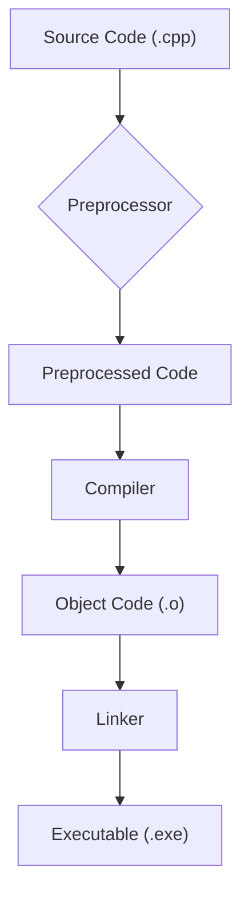
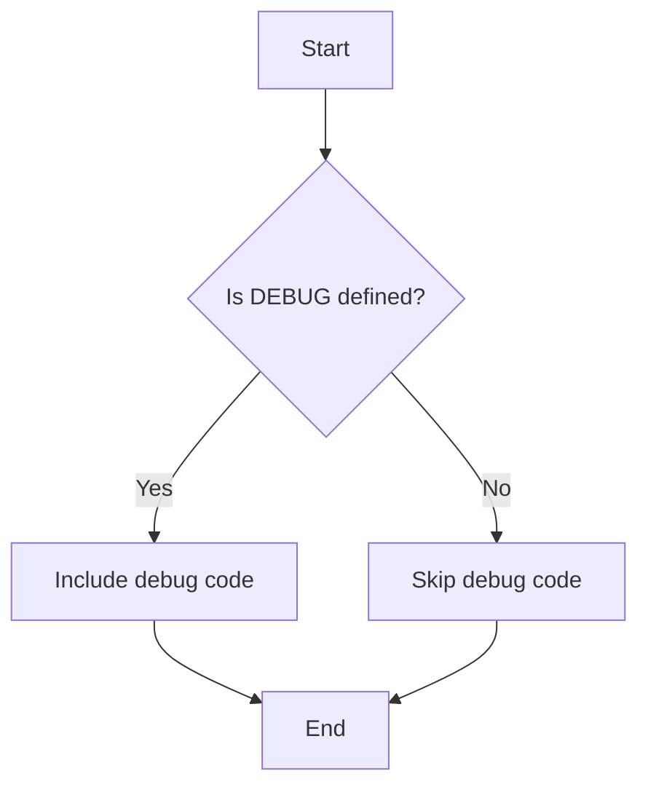
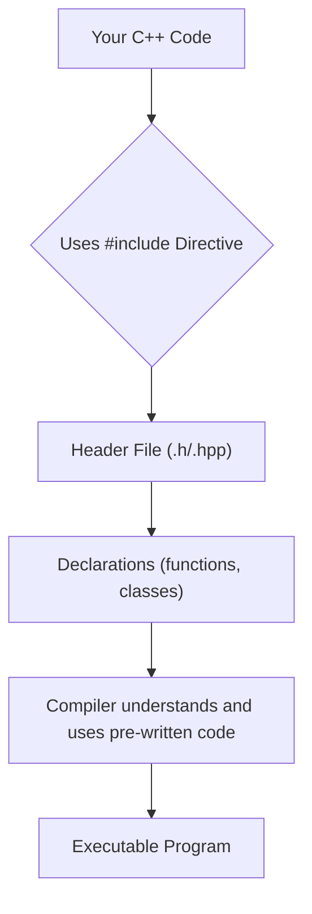

# <span style="color:#e67e22;">What we will learn in this post?</span>

<ul style='list-style-type: none; padding-left: 0;'>
<li><span style='color: #2980b9; font-size: 20px; font-weight: bold;'>👉</span> <span style='color: #2ecc71; font-size: 18px; font-weight: bold;'>C++ Preprocessor</span></li>
<li><span style='color: #2980b9; font-size: 20px; font-weight: bold;'>👉</span> <span style='color: #2ecc71; font-size: 18px; font-weight: bold;'>C++ Preprocessor Directives</span></li>
<li><span style='color: #2980b9; font-size: 20px; font-weight: bold;'>👉</span> <span style='color: #2ecc71; font-size: 18px; font-weight: bold;'>#include Directive</span></li>
<li><span style='color: #2980b9; font-size: 20px; font-weight: bold;'>👉</span> <span style='color: #2ecc71; font-size: 18px; font-weight: bold;'>#define Directive</span></li>
<li><span style='color: #2980b9; font-size: 20px; font-weight: bold;'>👉</span> <span style='color: #2ecc71; font-size: 18px; font-weight: bold;'>Conditional Preprocessors</span></li>
<li><span style='color: #2980b9; font-size: 20px; font-weight: bold;'>👉</span> <span style='color: #2ecc71; font-size: 18px; font-weight: bold;'>Difference between C++ Preprocessor Directives and Function Templates</span></li>
<li><span style='color: #2980b9; font-size: 20px; font-weight: bold;'>👉</span> <span style='color: #2ecc71; font-size: 18px; font-weight: bold;'>Conclusion!</span></li>
</ul>

# <span style="color:#e67e22">Meet the C++ Preprocessor: Your Code's Prep Chef 🧑‍🍳</span>

Before your C++ code even gets compiled into machine-readable instructions, it goes through a crucial step: preprocessing. Think of the preprocessor as a helpful chef preparing ingredients before the main course (compilation). It handles tasks that make your coding life easier and more efficient.

## <span style="color:#2980b9">What Does it Do?</span>

The preprocessor modifies your source code _before_ the compiler sees it. It's like a smart text editor with superpowers! Its main tasks include:

### <span style="color:#8e44ad">Macro Definitions</span>

- **Macros:** These are essentially shortcuts. You define a name (like `#define PI 3.14159`) and the preprocessor replaces every instance of that name with its definition. This improves code readability and maintainability.

### <span style="color:#8e44ad">File Inclusion</span>

- **Headers (`#include`)**: This is how you bring in pre-written code from header files (`.h` or `.hpp`). The preprocessor literally inserts the content of these files into your code. For example, `#include <iostream>` adds input/output functionalities.

### <span style="color:#8e44ad">Conditional Compilation</span>

- **Conditional directives (`#ifdef`, `#ifndef`, `#endif`)**: These allow you to include or exclude parts of your code based on specific conditions (e.g., compiler type, debugging mode). This is useful for creating code that adapts to different environments.

## <span style="color:#2980b9">The Compilation Process Flowchart</span>



## <span style="color:#2980b9">Key Takeaways</span>

- The preprocessor is a _separate_ step _before_ compilation.
- It simplifies code, improves organization, and enables conditional compilation.
- It uses directives starting with `#` (e.g., `#include`, `#define`).

**Learn More:**

- [cppreference.com](https://en.cppreference.com/w/cpp/preprocessor) (A comprehensive resource for C++ information)

By understanding the C++ preprocessor, you'll write cleaner, more maintainable, and more powerful code! 🎉

# <span style="color:#e67e22">C++ Preprocessor Directives: A Friendly Guide</span> 🧡

The C++ preprocessor is like a helpful assistant that prepares your code _before_ it's actually compiled. It works with special instructions called _directives_, which start with `#`. Let's explore some common ones!

## <span style="color:#2980b9">Common Directives</span> ⚙️

### <span style="color:#8e44ad">`#include`</span>

This directive brings in external code files. Think of it as importing ready-made tools!

```c++
#include <iostream> // Includes the iostream library for input/output
#include "myheader.h" // Includes a custom header file
```

### <span style="color:#8e44ad">`#define`</span>

Defines _macros_— essentially, shortcuts. They replace text during preprocessing.

```c++
#define PI 3.14159 // Defines PI as a constant
#define SQUARE(x) ((x)*(x)) // Defines a macro to square a number
```

### <span style="color:#8e44ad">`#ifdef`, `#ifndef`, `#endif`</span>

These are _conditional compilation_ directives. They let you include or exclude code based on whether a macro is defined.

```c++
#ifdef DEBUG
    std::cout << "Debug mode is ON" << std::endl;
#endif
```

### <span style="color:#8e44ad">`#if`, `#elif`, `#else`</span>

These allow more complex conditional compilation based on the value of macros or expressions.

```c++
#if VERSION == 1
    // Code for version 1
#elif VERSION == 2
    // Code for version 2
#else
    // Default code
#endif
```

## <span style="color:#2980b9">Example: Conditional Compilation</span> 🤔

Imagine you're building software for different platforms. `#ifdef` can help you selectively include platform-specific code.



Remember, preprocessor directives are powerful but can make code harder to read if overused. Use them judiciously!

For more in-depth information, check out these resources:

- [cppreference.com](https://en.cppreference.com/w/cpp/preprocessor) - Comprehensive C++ reference.
- [LearnCpp.com](https://www.learncpp.com/) - A great tutorial site for learning C++.

# <span style="color:#e67e22">Understanding the `#include` Directive in C++</span> 💡

The `#include` directive is like a magical ingredient in your C++ cooking! It lets you bring in pre-written code (libraries) into your own program. Think of it as importing ready-made tools to make your programming life easier. Without it, you'd have to write _everything_ from scratch!

## <span style="color:#2980b9">Purpose of `#include`</span> 📚

Its main purpose is to include header files. Header files (.h or .hpp) contain declarations of functions, classes, and variables. They tell the compiler _what_ things exist, but not _how_ they're implemented (that's in the corresponding .cpp files). By including them, you give your compiler the information it needs to understand and use those pre-written components.

### <span style="color:#8e44ad">Types of Includes</span>

- **Angle brackets `< >`**: Used for standard library headers (like `<iostream>`, `<string>`, `<vector>`). These are usually located in the compiler's standard include directory.
- **Quotation marks `" "`**: Used for your own custom header files or those from third-party libraries. The compiler searches for these files in the same directory as your source code, then in other specified locations.

## <span style="color:#2980b9">Examples</span> 💻

Here's how to use it:

```c++
#include <iostream> // For input/output operations (like printing to the console)
#include <string>   // For using strings

int main() {
    std::string message = "Hello, world!"; // Using the string class from <string>
    std::cout << message << std::endl;     // Using cout from <iostream>
    return 0;
}
```

This code includes the `iostream` (input/output stream) and `string` headers. Without them, `std::cout` and `std::string` wouldn't be recognized.

## <span style="color:#2980b9">Flowchart</span> ➡️



For more detailed information, check out these resources:

- [cppreference.com](https://en.cppreference.com/w/cpp) (Comprehensive C++ reference)
- [LearnCpp.com](https://www.learncpp.com/) (Great tutorial site)

Remember, `#include` is your friend—use it wisely! 😊

# <span style="color:#e67e22">Understanding the `#define` Directive in C++</span> 🛠️

The `#define` directive in C++ is a preprocessor directive. Think of it as a _find and replace_ tool that operates _before_ your code is actually compiled. It's used to create _macros_, which are essentially symbolic names for pieces of code or constants.

## <span style="color:#2980b9">How it Works</span> ✨

The preprocessor scans your code and replaces every instance of the defined macro name with its corresponding replacement text. This happens _before_ the compiler sees your code.

### <span style="color:#8e44ad">Simple Example</span> 💡

```c++
#define PI 3.14159
int main() {
  double radius = 5;
  double area = PI * radius * radius;
  //The preprocessor replaces PI with 3.14159 before compilation
  return 0;
}
```

In this example, `PI` is defined as `3.14159`. The compiler never actually sees `PI`; it sees `3.14159` instead.

## <span style="color:#2980b9">Macro with Arguments</span> ⚙️

`#define` can also create macros that accept arguments:

```c++
#define SQUARE(x) ((x)*(x))
int main() {
  int num = 5;
  int square = SQUARE(num); //Expands to ((num)*(num))
  return 0;
}
```

**Important Note:** Always use parentheses carefully around macro arguments to avoid unexpected behavior due to operator precedence.

## <span style="color:#2980b9">Advantages and Disadvantages</span> ⚖️

- **Advantages:** Improves code readability and makes it easier to maintain constants.
- **Disadvantages:** Can make debugging harder and may lead to unexpected behavior if not used carefully. Consider using `const` variables for simple constants whenever possible.

## <span style="color:#2980b9">Further Reading</span> 📚

For more detailed information and advanced usage of `#define`, refer to a comprehensive C++ textbook or online resources like:

- [cppreference.com](https://en.cppreference.com/w/cpp/preprocessor/define) (A great resource for C++ reference)

Remember to use `#define` judiciously! While powerful, it can also introduce subtle errors if not handled with care. Prioritize clarity and maintainability in your code.

Error: An error occurred while processing your request. Please try again later.

# <span style="color:#e67e22">Preprocessor Directives vs. Function Templates 🤖</span>

Let's explore the differences between C++ preprocessor directives and function templates! Both are powerful tools, but they serve distinct purposes.

## <span style="color:#2980b9">Preprocessor Directives ⚙️</span>

Preprocessor directives are instructions processed _before_ the actual compilation of your C++ code. They manipulate the source code itself.

### <span style="color:#8e44ad">Example: Macros</span>

```c++
#define PI 3.14159
```

This defines a _macro_ `PI`. The preprocessor replaces all instances of `PI` with `3.14159`.

- **Role:** Textual substitution; code manipulation.
- **Limitations:** No type checking; can lead to hard-to-debug errors.

## <span style="color:#2980b9">Function Templates ✨</span>

Function templates, on the other hand, create _generic_ functions that can work with different data types. The compiler generates specific versions of the function based on the types used when calling it.

### <span style="color:#8e44ad">Example</span>

```c++
template <typename T>
T max(T a, T b) {
  return (a > b) ? a : b;
}
```

This creates a `max` function that works with any type `T` that supports the `>` operator.

- **Role:** Code generation at compile time; type safety.
- **Advantages:** Reusability, type safety, compile-time efficiency.

## <span style="color:#2980b9">Key Differences Summarized</span>

| Feature         | Preprocessor Directives | Function Templates |
| --------------- | ----------------------- | ------------------ |
| **Timing**      | Before compilation      | During compilation |
| **Mechanism**   | Textual substitution    | Code generation    |
| **Type Safety** | No                      | Yes                |
| **Debugging**   | More difficult          | Easier             |

**In short:** Use preprocessor directives for simple text manipulation, but prefer function templates for generic, type-safe code that leverages the compiler's power.

[Learn more about C++ preprocessor](https://www.geeksforgeeks.org/cpp-preprocessor/)

[Learn more about C++ templates](https://www.geeksforgeeks.org/templates-cpp/)

<h1><span style='color:#e67e22'>Conclusion</span></h1>

And there you have it! We've covered a lot of ground today, and hopefully, you found this insightful and helpful 😊. But the conversation doesn't end here! We'd love to hear your thoughts, comments, and any suggestions you might have. What did you think of this post? What other topics would you like us to explore? Let us know in the comments section below 👇. We're excited to hear from you! 🎉
