# <span style="color:#e67e22;">What we will learn in this post?</span>

<ul style='list-style-type: none; padding-left: 0;'>
<li><span style='color: #2980b9; font-size: 20px; font-weight: bold;'>👉</span> <span style='color: #2ecc71; font-size: 18px; font-weight: bold;'>Concepts of Continuous Delivery and Deployment</span></li>
<li><span style='color: #2980b9; font-size: 20px; font-weight: bold;'>👉</span> <span style='color: #2ecc71; font-size: 18px; font-weight: bold;'>Difference Between Continuous Delivery and Deployment</span></li>
<li><span style='color: #2980b9; font-size: 20px; font-weight: bold;'>👉</span> <span style='color: #2ecc71; font-size: 18px; font-weight: bold;'>Deployment Strategies: Blue-Green, Canary, and Rolling Updates</span></li>
<li><span style='color: #2980b9; font-size: 20px; font-weight: bold;'>👉</span> <span style='color: #2ecc71; font-size: 18px; font-weight: bold;'>Introduction to CD Tools (ArgoCD, Spinnaker, GitLab CI/CD)</span></li>
<li><span style='color: #2980b9; font-size: 20px; font-weight: bold;'>👉</span> <span style='color: #2ecc71; font-size: 18px; font-weight: bold;'>Hands-On with Deployment Pipelines</span></li>
<li><span style='color: #2980b9; font-size: 20px; font-weight: bold;'>👉</span> <span style='color: #2ecc71; font-size: 18px; font-weight: bold;'>Conclusion!</span></li>
</ul>

# <span style="color:#e67e22">Continuous Delivery (CD) vs. Continuous Deployment 🚀</span>

Let's understand two crucial concepts in modern software development: Continuous Delivery (CD) and Continuous Deployment. Both aim to get your software into users' hands faster and more reliably, but they differ in _how_ they achieve this.

## <span style="color:#2980b9">Continuous Delivery (CD) ⚙️</span>

Continuous Delivery focuses on automating the _release process_. Think of it as getting your software ready for launch, but pausing just before the final push. It ensures that new code is always _ready_ to be deployed to production, but _doesn't automatically deploy it_.

### <span style="color:#8e44ad">Key Features of CD</span>

- Automated testing: Thorough automated tests (unit, integration, end-to-end) are run to ensure quality.
- Automated build: The software is automatically compiled and packaged.
- Automated deployment to staging: A near-identical copy of production (staging environment) is used for final testing and verification before release.
- Manual approval before production deployment: A human gives the final go-ahead.

**Example:** Imagine a team building an e-commerce website. With CD, they can automate the entire process from code commit to a fully tested version ready in staging. They review it, and only then manually deploy it to production to avoid disrupting customers during peak hours, for example.

## <span style="color:#2980b9">Continuous Deployment ⚡️</span>

Continuous Deployment takes CD a step further. It _automatically_ deploys every code change that passes the automated tests to production. No manual intervention is required after the code passes the automated tests.

### <span style="color:#8e44ad">Key Differences from CD</span>

- Automatic deployment to production: No manual approval needed after successful automated tests.
- Requires robust automated testing: Crucial to avoid deploying faulty code directly to production.
- Higher risk (but potentially higher reward): A bug can reach users faster, but the speed of delivery is unmatched.

**Example:** A company releasing a new feature for a mobile game might use continuous deployment. Once the code passes all tests, it's instantly available to users, ensuring immediate feedback and faster iterations.

```mermaid
graph TD
    A["💻 Code Commit"] --> B{"✅ Automated Tests"};
    B -- Pass --> C["📦 Staging Deployment"];
    C --> D{"📝 Manual Approval"};
    D -- Approve --> E["🚀 Production Deployment"];
    D -- Reject --> A;

    A2["💻 Code Commit"] --> B2{"✅ Automated Tests"};
    B2 -- Pass --> E2["🚀 Production Deployment"];
    B2 -- Fail --> A2;

    subgraph CD
        C;D;E;
    end
    subgraph Continuous Deployment
        A2;B2;E2;
    end

    class A codeCommitStyle;
    class B automatedTestsStyle;
    class C stagingDeploymentStyle;
    class D manualApprovalStyle;
    class E productionDeploymentStyle;
    class A2 codeCommitStyle;
    class B2 automatedTestsStyle;
    class E2 productionDeploymentStyle;

    classDef codeCommitStyle fill:#90CAF9,stroke:#1E88E5,color:#000000,font-size:14px,stroke-width:2px,rx:10,shadow:3px;
    classDef automatedTestsStyle fill:#A5D6A7,stroke:#388E3C,color:#000000,font-size:14px,stroke-width:2px,rx:10,shadow:3px;
    classDef stagingDeploymentStyle fill:#FFD54F,stroke:#FFA000,color:#000000,font-size:14px,stroke-width:2px,rx:10,shadow:3px;
    classDef manualApprovalStyle fill:#FFCDD2,stroke:#E53935,color:#000000,font-size:14px,stroke-width:2px,rx:10,shadow:3px;
    classDef productionDeploymentStyle fill:#81C784,stroke:#388E3C,color:#FFFFFF,font-size:14px,stroke-width:2px,rx:10,shadow:3px;

```

## <span style="color:#2980b9">Visual Comparison 📊</span>



**CD (left) requires manual approval before going live. Continuous Deployment (right) automatically deploys after successful tests.**

**Resources:**

- [Learn more about Continuous Delivery](https://www.atlassian.com/continuous-delivery)
- [Understand Continuous Deployment](https://www.thoughtworks.com/continuous-delivery)

Remember, choosing between CD and Continuous Deployment depends on your specific needs, risk tolerance, and the nature of your application. Both are powerful techniques for faster, more reliable software delivery.

# <span style="color:#e67e22">Continuous Delivery vs. Continuous Deployment: What's the Difference?</span> 🚢🚀

Both Continuous Delivery (CD) and Continuous Deployment are advanced software release practices aiming for faster and more reliable deployments, but they differ in one crucial aspect: _human intervention_.

## <span style="color:#2980b9">Continuous Delivery: Always Ready, But Waiting for Your Go-Ahead 👍</span>

Continuous Delivery automates the entire software release process _up to_ the production environment. Think of it as getting your rocket ready for launch – fueled, checked, and on the pad. But you, the mission control, still press the launch button.

### <span style="color:#8e44ad">Key Features:</span>

- Automated build, testing, and deployment pipeline.
- Code is always in a releasable state.
- _Manual approval_ is required before deploying to production.

## <span style="color:#2980b9">Continuous Deployment: Automatic Launch! 🤖</span>

Continuous Deployment takes Continuous Delivery a step further. Once the code passes all automated tests, it's _automatically_ deployed to production without human intervention. It's like setting the rocket to auto-launch – once the checks pass, it takes off!

### <span style="color:#8e44ad">Key Features:</span>

- Automated build, testing, and _deployment_ to production.
- Faster release cycles.
- Requires a robust and reliable automated testing suite.

## <span style="color:#2980b9">When to Choose Which?</span> ⚖️

- **Continuous Delivery:** Ideal for projects requiring higher control over releases, especially those with regulatory compliance or significant business risk. It allows for careful review before deploying updates to a live system.
- **Continuous Deployment:** Best suited for projects with high-frequency, low-risk releases, like smaller feature additions or bug fixes on a website or app with robust automated testing.

## <span style="color:#2980b9">Impact on Release Cycle</span> ⏱️

Continuous Delivery reduces the time it takes to _prepare_ for a release, while Continuous Deployment significantly reduces the overall _release_ time.

```mermaid
graph LR
    A["🔧 Code Changes"] --> B{"✅ Automated Tests"};
    B -- Pass --> C["✅ Ready for Release"];
    C -- Continuous Delivery --> D["📝 Manual Approval"];
    D -- Approved --> E["🚀 Deployment"];
    C -- Continuous Deployment --> E;
    E --> F["🏭 Production"];

    class A codeChangesStyle;
    class B automatedTestsStyle;
    class C readyForReleaseStyle;
    class D manualApprovalStyle;
    class E deploymentStyle;
    class F productionStyle;

    classDef codeChangesStyle fill:#90CAF9,stroke:#1E88E5,color:#000000,font-size:14px,stroke-width:2px,rx:10,shadow:3px;
    classDef automatedTestsStyle fill:#A5D6A7,stroke:#388E3C,color:#000000,font-size:14px,stroke-width:2px,rx:10,shadow:3px;
    classDef readyForReleaseStyle fill:#FFD54F,stroke:#FFA000,color:#000000,font-size:14px,stroke-width:2px,rx:10,shadow:3px;
    classDef manualApprovalStyle fill:#FFCDD2,stroke:#E53935,color:#000000,font-size:14px,stroke-width:2px,rx:10,shadow:3px;
    classDef deploymentStyle fill:#81C784,stroke:#388E3C,color:#FFFFFF,font-size:14px,stroke-width:2px,rx:10,shadow:3px;
    classDef productionStyle fill:#FF8A65,s

```



Choosing between Continuous Delivery and Continuous Deployment depends on your project's specific needs and risk tolerance. Both methods significantly improve the speed and reliability of software releases compared to traditional methods.

**Further Reading:**

- [Continuous Delivery](https://www.atlassian.com/continuous-delivery)
- [Continuous Deployment](https://www.atlassian.com/continuous-deployment)

# <span style="color:#e67e22">Deployment Strategies: Minimizing Downtime & Risk</span> 🚦

Deploying new software updates can be tricky! Here are some common strategies to make it smoother:

## <span style="color:#2980b9">Blue-Green Deployments</span> 🟦🟩

This is like having two identical environments: a "blue" (live) and a "green" (staging). You deploy the new version to the green environment. Once testing is complete, you _switch_ all traffic from blue to green. If something goes wrong, you quickly switch back!

### <span style="color:#8e44ad">Example:</span>

Imagine updating your website. You deploy to the "green" environment. After thorough checks, you redirect all user traffic to "green." Problem-free!

```mermaid
graph LR
    A["💙 Blue (Live)"] --> B["🔄 Switch Traffic"];
    C["💚 Green (Staging)"] --> B;
    B --> D["💚 Green (Live)"];

    class A blueLiveStyle;
    class B switchTrafficStyle;
    class C greenStagingStyle;
    class D greenLiveStyle;

    classDef blueLiveStyle fill:#90CAF9,stroke:#1E88E5,color:#000000,font-size:14px,stroke-width:2px,rx:10,shadow:3px;
    classDef switchTrafficStyle fill:#FFEB3B,stroke:#F9A825,color:#000000,font-size:14px,stroke-width:2px,rx:10,shadow:3px;
    classDef greenStagingStyle fill:#A5D6A7,stroke:#388E3C,color:#000000,font-size:14px,stroke-width:2px,rx:10,shadow:3px;
    classDef greenLiveStyle fill:#81C784,stroke:#388E3C,color:#FFFFFF,font-size:14px,stroke-width:2px,rx:10,shadow:3px;

```



## <span style="color:#2980b9">Canary Deployments</span> 🐦

This is a gradual rollout. You release the new version to a _small percentage_ of users (your "canaries"). You monitor their experience closely. If all is well, you gradually expand the rollout to more users.

### <span style="color:#8e44ad">Example:</span>

A new app feature is released to 1% of users. You track performance and user feedback. If all goes well, you increase to 10%, then 50%, and eventually 100%.

```mermaid
graph LR
    A["🔧 Existing System"] --> B{"📈 Release to 1%"};
    B -- "✅ Success" --> C{"📊 Release to 10%"};
    C -- "✅ Success" --> D{"🚀 Release to 50%"};
    D -- "✅ Success" --> E["🌍 Full Rollout"];
    B -- "❌ Failure" --> A;
    C -- "❌ Failure" --> A;
    D -- "❌ Failure" --> A;

    class A existingSystemStyle;
    class B release1Style;
    class C release10Style;
    class D release50Style;
    class E fullRolloutStyle;

    classDef existingSystemStyle fill:#FFEB3B,stroke:#F9A825,color:#000000,font-size:14px,stroke-width:2px,rx:10,shadow:3px;
    classDef release1Style fill:#A5D6A7,stroke:#388E3C,color:#000000,font-size:14px,stroke-width:2px,rx:10,shadow:3px;
    classDef release10Style fill:#81C784,stroke:#388E3C,color:#000000,font-size:14px,stroke-width:2px,rx:10,shadow:3px;
    classDef release50Style fill:#66BB6A,stroke:#388E3C,color:#000000,font-size:14px,stroke-width:2px,rx:10,shadow:3px;
    classDef fullRolloutStyle fill:#388E3C,stroke:#1B5E20,color:#FFFFFF,font-size:14px,stroke-width:2px,rx:10,shadow:3px;


```



## <span style="color:#2980b9">Rolling Updates</span> 🔄

Here, the new version is deployed to a small group of servers. After verification, you gradually replace the older version on other servers, one by one. This minimizes downtime and risk.

### <span style="color:#8e44ad">Example:</span>

You have 10 servers. You update one, test it. Then another, and so on, until all 10 are running the new version.

- **Benefits:** Reduces downtime, allows for quick rollback, and simplifies updates.

**Resources:**

- [Learn more about Blue-Green deployments](https://www.nginx.com/blog/blue-green-deployments/)
- [Understanding Canary Deployments](https://martinfowler.com/bliki/CanaryRelease.html)
- [Rolling updates explained](https://kubernetes.io/docs/concepts/workloads/controllers/rolling-update/)

Remember to choose the strategy that best suits your application and risk tolerance! Happy deploying! 🎉

# <span style="color:#e67e22">Popular Continuous Delivery (CD) Tools</span> 🚀

Continuous Delivery (CD) automates the process of releasing software, making it faster and more reliable. Let's explore some popular tools:

## <span style="color:#2980b9">Argo CD: Your GitOps Friend 🤝</span>

Argo CD is a declarative, GitOps-based CD tool. This means it uses Git as the single source of truth for your application's desired state. Changes in your Git repository automatically trigger deployments to your Kubernetes cluster.

### <span style="color:#8e44ad">Strengths:</span>

- **GitOps:** Simple, auditable, and reliable deployments.
- **Kubernetes focused:** Seamless integration with Kubernetes.
- **Observability:** Easy to track deployments and rollbacks.

## <span style="color:#2980b9">Spinnaker: Master of Multi-Cloud 🌎</span>

Spinnaker is a powerful, multi-cloud CD platform. It supports deployments to various cloud providers (AWS, Azure, GCP, etc.) and Kubernetes. It offers advanced features like canary deployments and blue/green deployments for safer releases.

### <span style="color:#8e44ad">Strengths:</span>

- **Multi-cloud support:** Deploy to multiple clouds from a single platform.
- **Advanced deployment strategies:** Reduce risks with canary and blue/green deployments.
- **Extensive integrations:** Works well with various CI/CD tools and monitoring systems.

## <span style="color:#2980b9">GitLab CI/CD: All-in-One Solution 🧰</span>

GitLab CI/CD is a built-in feature within the GitLab platform. This makes it incredibly convenient for teams already using GitLab for version control. It's easy to set up and use, especially for smaller projects.

### <span style="color:#8e44ad">Strengths:</span>

- **Simplicity:** Easy setup and use, especially for GitLab users.
- **Integration:** Seamless integration with other GitLab features.
- **Cost-effective:** Often included in GitLab's pricing plans.

## <span style="color:#2980b9">Use Cases in Large-Scale Deployments</span>

These tools are crucial for managing large-scale deployments:

- **Argo CD:** Ideal for managing complex, microservice-based applications deployed on Kubernetes, ensuring consistency and traceability across deployments.
- **Spinnaker:** Perfect for organizations with deployments across multiple cloud providers, offering a centralized platform for managing releases.
- **GitLab CI/CD:** Suitable for large organizations that already utilize GitLab, providing streamlined CI/CD capabilities within their existing workflow.

**Example Flowchart (Argo CD):**

```mermaid
graph LR
    A["📁 Git Repo"] --> B{"🚀 Argo CD"};
    B --> C["🖥️ Kubernetes Cluster"];
    C --> D["📦 Application Deployed"];

    class A gitRepoStyle;
    class B argoCDStyle;
    class C kubernetesStyle;
    class D appDeployedStyle;

    classDef gitRepoStyle fill:#90CAF9,stroke:#1E88E5,color:#000000,font-size:14px,stroke-width:2px,rx:10,shadow:3px;
    classDef argoCDStyle fill:#A5D6A7,stroke:#388E3C,color:#000000,font-size:14px,stroke-width:2px,rx:10,shadow:3px;
    classDef kubernetesStyle fill:#FFEB3B,stroke:#F9A825,color:#000000,font-size:14px,stroke-width:2px,rx:10,shadow:3px;
    classDef appDeployedStyle fill:#FF7043,stroke:#F4511E,color:#FFFFFF,font-size:14px,stroke-width:2px,rx:10,shadow:3px;

```



For more information:

- Argo CD: [https://argoproj.io/projects/argo-cd/](https://argoproj.io/projects/argo-cd/)
- Spinnaker: [https://www.spinnaker.io/](https://www.spinnaker.io/)
- GitLab CI/CD: [https://docs.gitlab.com/ee/ci/](https://docs.gitlab.com/ee/ci/)

Remember to choose the tool that best fits your specific needs and infrastructure!

# <span style="color:#e67e22">Building Your First Deployment Pipeline 🚀</span>

Let's build a simple deployment pipeline using GitLab CI/CD. It's easy! We'll cover building, testing, and deploying your app.

## <span style="color:#2980b9">Defining Stages with `.gitlab-ci.yml` ⚙️</span>

GitLab CI/CD uses a YAML file (`.gitlab-ci.yml`) to define your pipeline. This file lives in your project's root directory. Here's a basic example:

```yaml
stages:
  - build
  - test
  - deploy

build:
  stage: build
  script:
    - echo "Building..."
    - make build # Or your build command

test:
  stage: test
  script:
    - echo "Testing..."
    - make test # Or your test command
  needs: ["build"]

deploy:
  stage: deploy
  script:
    - echo "Deploying..."
    - kubectl apply -f ./k8s/deployment.yaml # Or your deploy command
  needs: ["test"]
  environment: production #Specify environment
```

### <span style="color:#8e44ad">Understanding the YAML</span>

- **`stages`**: Defines the pipeline stages.
- **`build`**, **`test`**, **`deploy`**: Jobs within stages.
- **`script`**: Commands executed in each job.
- **`needs`**: Specifies dependencies between jobs.
- **`environment`**: Defines the target environment (e.g., production, staging).

## <span style="color:#2980b9">Versioning, Rollbacks, and Monitoring 🔄️ ⚠️ 📊</span>

- **Versioning:** Use semantic versioning (e.g., `v1.0.0`, `v1.0.1`) for your releases. Git tags are your friend!
- **Rollbacks:** Git tags and environment-specific deployment strategies (like blue/green deployments) enable easy rollbacks. GitLab CI/CD allows you to easily revert to previous commits.
- **Monitoring:** Integrate with monitoring tools (like Prometheus, Grafana) to track your app's health and performance post-deployment.

```mermaid
graph LR
    A["🔼 Push Code"] --> B{"🔨 Build"};
    B --> C{"🧪 Test"};
    C -- Success --> D["🚀 Deploy"];
    C -- Fail --> E["⚠️ Notify"];
    D --> F["📊 Monitor"];

    class A pushCodeStyle;
    class B buildStyle;
    class C testStyle;
    class D deployStyle;
    class E notifyStyle;
    class F monitorStyle;

    classDef pushCodeStyle fill:#90CAF9,stroke:#1E88E5,color:#000000,font-size:14px,stroke-width:2px,rx:10,shadow:3px;
    classDef buildStyle fill:#FFEB3B,stroke:#F9A825,color:#000000,font-size:14px,stroke-width:2px,rx:10,shadow:3px;
    classDef testStyle fill:#A5D6A7,stroke:#388E3C,color:#000000,font-size:14px,stroke-width:2px,rx:10,shadow:3px;
    classDef deployStyle fill:#FF7043,stroke:#F4511E,color:#FFFFFF,font-size:14px,stroke-width:2px,rx:10,shadow:3px;
    classDef notifyStyle fill:#FFCDD2,stroke:#E53935,color:#000000,font-size:14px,stroke-width:2px,rx:10,shadow:3px;
    classDef monitorStyle fill:#FFEB3B,stroke:#F9A825,color:#000000,font-size:14px,stroke-width:2px,rx:10,shadow:3px;

```

## <span style="color:#2980b9">Simplified Pipeline Flowchart</span>



[More on GitLab CI/CD](https://docs.gitlab.com/ee/ci/quick_start/)

Remember to replace placeholder commands (`make build`, `make test`, `kubectl apply -f ...`) with your actual build, test, and deployment commands. Happy deploying! 🎉

<h1><span style='color:#e67e22'>Conclusion</span></h1>

So there you have it! We've covered a lot of ground today, and hopefully, you found it helpful and interesting. 😊 We're always striving to improve, so we'd love to hear your thoughts! What did you think of this post? Any questions, feedback, or brilliant suggestions? Let us know in the comments below! 👇 We can't wait to read what you have to say! 🎉
