# What we will learn in this post?

<ul style='list-style-type: none; padding-left: 0;'>
<li>👉 What is Cloud Computing?</li>
<li>👉 Public vs Private vs Hybrid Clouds</li>
<li>👉 Key Cloud Providers Overview (AWS, Azure, Google Cloud)</li>
<li>👉 Core AWS Services: EC2, S3, IAM, VPC</li>
<li>👉 Serverless Computing with Lambda</li>
<li>👉 Conclusion!</li>
</ul>

# ☁️ Cloud Computing & DevOps: A Perfect Match

Cloud computing is like renting computer resources (servers, storage, software) over the internet instead of owning them. Think of it as borrowing tools from a giant toolbox whenever you need them! This makes it incredibly useful for DevOps.

## Why Cloud Matters for DevOps 🤔

DevOps aims for faster, more reliable software delivery. Cloud computing is the perfect platform to achieve this. It enables:

- **Speed and Agility:** Rapid infrastructure provisioning using tools like _Terraform_ or _CloudFormation_. Deploying changes becomes incredibly quick.
- **Collaboration:** Cloud-based tools enable seamless collaboration among developers, testers, and operations teams.
- **Cost Savings:** The _pay-as-you-go_ model means you only pay for what you use, eliminating upfront investments in hardware.

## Key Cloud Principles 🚀

### On-Demand Self-Service

Users can access computing capabilities (servers, storage) as needed without requiring human interaction with each service provider.

### Broad Network Access

Resources are available over a network and accessed through standard mechanisms.

### Resource Pooling

The provider's computing resources are pooled to serve multiple consumers using a multi-tenant model, with different physical and virtual resources dynamically assigned and reassigned according to consumer demand.

### Rapid Elasticity

Capabilities can be elastically provisioned and released, in some cases automatically, to scale rapidly outward and inward commensurate with demand. To the consumer, the capabilities available for provisioning often appear to be unlimited and can be appropriated in any quantity at any time.

### Measured Service

Cloud systems automatically control and optimize resource use by leveraging a metering capability at some level of abstraction appropriate to the type of service (e.g., storage, processing, bandwidth, and active user accounts). Resource usage can be monitored, controlled, and reported, providing transparency for both the provider and consumer of the utilized service.

## Cloud's DevOps Impact 💪

- **Faster Deployments:** Spin up testing environments in minutes, not days.
- **Automated Scaling:** Handle traffic spikes automatically without manual intervention.
- **Continuous Integration/Continuous Delivery (CI/CD):** Cloud platforms integrate seamlessly with CI/CD pipelines, enabling automated testing and deployment.

**Example:** Imagine deploying a new web application. With cloud computing, you can automatically provision the necessary servers, databases, and networking components, then scale them up or down based on user demand. This is vastly simpler and faster than managing your own physical infrastructure.

[Learn More about Cloud Computing](https://aws.amazon.com/what-is-cloud-computing/)
[Learn More about DevOps](https://www.redhat.com/en/topics/devops)

```mermaid
graph LR
    A["👨‍💻 DevOps Team"] --> B["☁️ Cloud Platform"];
    B --> C{"⚡ Faster Deployments"};
    B --> D{"📈 Automated Scaling"};
    B --> E{"💰 Cost Savings"};

    class A teamStyle;
    class B cloudStyle;
    class C speedStyle;
    class D scaleStyle;
    class E costStyle;

    classDef teamStyle fill:#ff6f61,stroke:#c43e3e,color:#ffffff,font-size:14px,stroke-width:2px,rx:10,shadow:4px;
    classDef cloudStyle fill:#6b5b95,stroke:#4a3f6b,color:#ffffff,font-size:14px,stroke-width:2px,rx:10,shadow:4px;
    classDef speedStyle fill:#feb236,stroke:#d99120,color:#ffffff,font-size:14px,stroke-width:2px,rx:10,shadow:4px;
    classDef scaleStyle fill:#007acc,stroke:#005f99,color:#ffffff,font-size:14px,stroke-width:2px,rx:10,shadow:4px;
    classDef costStyle fill:#44bfc8,stroke:#2d8f99,color:#ffffff,font-size:14px,stroke-width:2px,rx:10,shadow:4px;

```

# Cloud Environments: Public, Private & Hybrid ☁️

Let's explore the three main cloud environments:

## Public Cloud 🌎

### What it is: A public cloud is like a shared apartment building. Many different organizations share the same resources (servers, storage, etc.), provided by a third-party provider (e.g., AWS, Azure, Google Cloud)

- **Ownership:** Provider owns and manages everything.
- **Accessibility:** Accessible via the internet, from anywhere.
- **Security:** Shared responsibility; provider handles infrastructure, you handle your data and applications.

### DevOps Suitability & Benefits/Challenges:

- **Suitable for:** Quick deployments, scalability, cost-effectiveness for smaller projects, testing and development environments.
- **Benefits:** Easy setup, pay-as-you-go pricing, high scalability.
- **Challenges:** Security concerns (shared environment), vendor lock-in, potential latency issues.

## Private Cloud 🔒

### What it is: Think of a private house. Your organization owns and manages all the resources, often located on your premises or in a colocation facility

- **Ownership:** You own and manage everything.
- **Accessibility:** Accessible internally, usually through a VPN.
- **Security:** High level of control and security, but requires significant investment in infrastructure.

### DevOps Suitability & Benefits/Challenges:

- **Suitable for:** Highly sensitive data, strict regulatory compliance, complete control over your environment.
- **Benefits:** Enhanced security, full control, customization options.
- **Challenges:** High upfront costs, management overhead, limited scalability compared to public cloud.

## Hybrid Cloud 🤝

### What it is: A combination of both public and private clouds. Imagine having a house (private cloud) with an attached storage unit in a shared building (public cloud)

- **Ownership:** Shared responsibility; you own and manage your private cloud, while a provider manages the public portion.
- **Accessibility:** A mix of internal and external access.
- **Security:** Balances security and cost-effectiveness; sensitive data in private, less sensitive in public.

### DevOps Suitability & Benefits/Challenges:

- **Suitable for:** Organizations needing flexibility, scalability, and security, often used for applications with sensitive and non-sensitive components.
- **Benefits:** Flexibility, scalability, cost optimization, improved security posture compared to pure public cloud.
- **Challenges:** Complexity in management and integration, potential security risks if not managed properly.

---

**For more information:**

- [AWS](https://aws.amazon.com/)
- [Azure](https://azure.microsoft.com/)
- [Google Cloud](https://cloud.google.com/)

This table summarizes the key differences:

| Feature       | Public Cloud    | Private Cloud     | Hybrid Cloud |
| ------------- | --------------- | ----------------- | ------------ |
| Ownership     | Provider        | You               | Shared       |
| Accessibility | Public Internet | Internal          | Both         |
| Security      | Shared          | High              | Balanced     |
| Cost          | Pay-as-you-go   | High upfront cost | Varies       |
| Scalability   | High            | Lower             | High         |

Remember to choose the cloud environment that best suits your organization's specific needs and security requirements! 😊

# Top Cloud Players: AWS, Azure, & Google Cloud ☁️

These three giants dominate the cloud computing landscape, each offering a unique blend of services. Let's explore their strengths:

## Amazon Web Services (AWS) 💪

AWS boasts the **widest range of services**, often considered the most mature platform. Its massive ecosystem ensures broad compatibility and a huge community for support.

### DevOps Support in AWS

- **Automation:** AWS offers tools like _AWS CodePipeline_, _CodeBuild_, and _CodeDeploy_ for seamless CI/CD.
- **Scalability:** Auto Scaling effortlessly adjusts resources based on demand.
- **Monitoring:** _Amazon CloudWatch_ provides comprehensive monitoring and alerting.

[Learn more about AWS DevOps](https://aws.amazon.com/devops/)

## Microsoft Azure 💻

Azure shines with its **seamless integration with Microsoft's ecosystem**. If your business heavily relies on Windows, Office 365, or other Microsoft products, Azure offers a smooth transition.

### DevOps Support in Azure

- **Automation:** Azure DevOps provides a complete CI/CD platform.
- **Scalability:** Azure's resource scaling is robust and easy to manage.
- **Monitoring:** Azure Monitor offers comprehensive insights into application performance.

[Explore Azure DevOps](https://azure.microsoft.com/en-us/services/devops/)

## Google Cloud Platform (GCP) 🤖

GCP is a powerhouse for **machine learning (ML) and big data**. Its advanced analytics tools and Kubernetes engine (GKE) are industry leaders.

### DevOps Support in GCP

- **Automation:** GCP offers _Cloud Build_, _Cloud Deploy_, and Spinnaker for streamlined CI/CD.
- **Scalability:** GCP's scalability is excellent, particularly for data-intensive workloads.
- **Monitoring:** _Cloud Monitoring_ and _Cloud Logging_ provide in-depth insights.

[Discover GCP's DevOps tools](https://cloud.google.com/solutions/devops)

**Choosing the right cloud provider depends on your specific needs and existing infrastructure.** Consider your budget, technical expertise, and the types of applications you'll be running. Many companies even leverage a _multi-cloud_ strategy, using services from multiple providers.

# AWS Services for DevOps: A Friendly Guide ☁️

DevOps relies heavily on several core AWS services to automate and streamline software development and deployment. Let's explore some key players!

## EC2: Your Virtual Servers 🏠

EC2 (Elastic Compute Cloud) provides _scalable compute resources_. Think of it as renting virtual servers in the cloud. You can spin up as many servers as you need, when you need them, and scale down just as easily. This is crucial for handling fluctuating workloads, like a website experiencing a surge in traffic.

- **Example in DevOps:** During a deployment, you might automatically launch dozens of EC2 instances to handle increased traffic, then shut them down afterward to save costs. [Learn More about EC2](https://aws.amazon.com/ec2/)

## S3: Your Cloud Storage 🗄️

S3 (Simple Storage Service) is _object storage_ for your files – code, images, logs, you name it! It's incredibly durable, scalable, and cost-effective. Think of it as a giant, secure file cabinet in the sky.

- **Example in DevOps:** Your CI/CD pipeline might store build artifacts (like compiled code) in S3, making them readily available for deployment to EC2 instances. [Learn More about S3](https://aws.amazon.com/s3/)

## IAM: Managing Access 🔑

IAM (Identity and Access Management) controls who can access what in your AWS account. It's all about _security_. You assign specific permissions to users and services, ensuring only authorized entities can perform certain actions.

- **Example in DevOps:** You'd create an IAM role for your CI/CD pipeline, granting it the necessary permissions to access S3 for artifacts and EC2 to deploy applications, _without_ giving it excessive privileges. [Learn More about IAM](https://aws.amazon.com/iam/)

## VPC: Your Private Network 🌐

VPC (Virtual Private Cloud) lets you create _isolated network environments_ within AWS. This is like having your own private data center in the cloud, enhancing security and control.

- **Example in DevOps:** You might create a VPC to house your EC2 instances and databases, separating them from other resources and ensuring network security. [Learn More about VPC](https://aws.amazon.com/vpc/)

```mermaid
graph LR
    A["📝 Code Commit"] --> B["🚀 Build on EC2"];
    B --> C{"📦 Artifact to S3"};
    C --> D["📡 Deploy to EC2 (IAM Role)"];
    D --> E(("🔍 Monitoring"));

    class A commitStyle;
    class B buildStyle;
    class C artifactStyle;
    class D deployStyle;
    class E monitorStyle;

    classDef commitStyle fill:#ff6f61,stroke:#c43e3e,color:#ffffff,font-size:14px,stroke-width:2px,rx:10,shadow:4px;
    classDef buildStyle fill:#6b5b95,stroke:#4a3f6b,color:#ffffff,font-size:14px,stroke-width:2px,rx:10,shadow:4px;
    classDef artifactStyle fill:#feb236,stroke:#d99120,color:#ffffff,font-size:14px,stroke-width:2px,rx:10,shadow:4px;
    classDef deployStyle fill:#007acc,stroke:#005f99,color:#ffffff,font-size:14px,stroke-width:2px,rx:10,shadow:4px;
    classDef monitorStyle fill:#44bfc8,stroke:#2d8f99,color:#ffffff,font-size:14px,stroke-width:2px,rx:10,shadow:4px;

```

### A Simple DevOps Workflow Example

This illustrates a basic workflow using the services described above. Note the crucial role of IAM in securing access during deployment. This is just a starting point; real-world DevOps workflows are often more complex but incorporate these fundamental building blocks.

# Serverless Computing Explained ☁️

Imagine building a house without worrying about the foundation, plumbing, or electricity. That's essentially what serverless computing offers! You focus solely on your application's code, letting a cloud provider like AWS handle the underlying infrastructure. It's all about _event-driven_ architecture; your code runs only when needed, triggered by events.

## AWS Lambda: Your Serverless Engine 🚀

AWS Lambda is a core part of this serverless revolution. It's a compute service that lets you run code without managing servers. You just upload your code (in various languages like Python, Node.js, Java, etc.), and Lambda takes care of everything else – scaling, security, and maintenance. Think of it as a highly efficient and flexible function-as-a-service (FaaS).

### No Servers? How Does It Work?

Lambda automatically scales based on incoming requests. If you have a surge in traffic, Lambda spins up more resources; if it's quiet, it scales down, saving you money. You only pay for the compute time your code actually uses – a very cost-effective approach!

## Lambda in DevOps: Automating the Chaos 🛠️

Lambda is a game-changer for DevOps automation. Here are some examples:

- **Automating tasks:** Trigger Lambda functions from various events such as scheduled cron jobs or new file uploads to S3. Imagine automatically resizing images or generating reports.
- **Processing events:** Respond to real-time events from various AWS services. For instance, process new data entries in DynamoDB or react to changes in an S3 bucket.
- **Integrating with other AWS services:** Lambda seamlessly integrates with other AWS services, creating powerful workflows. You can connect Lambda to S3 to process image uploads, to DynamoDB to handle database updates, or to API Gateway to build serverless APIs.

```mermaid
graph LR
    A["📂 Event (e.g., S3 file upload)"] --> B["⚡ AWS Lambda Function"];
    B --> C{"🖥️ Code Execution"};
    C --> D["📊 Output (e.g., updated DynamoDB record)"];
    D --> E["☁️ Other AWS Services"];

    class A eventStyle;
    class B lambdaStyle;
    class C executionStyle;
    class D outputStyle;
    class E servicesStyle;

    classDef eventStyle fill:#ff6f61,stroke:#c43e3e,color:#ffffff,font-size:14px,stroke-width:2px,rx:10,shadow:4px;
    classDef lambdaStyle fill:#6b5b95,stroke:#4a3f6b,color:#ffffff,font-size:14px,stroke-width:2px,rx:10,shadow:4px;
    classDef executionStyle fill:#feb236,stroke:#d99120,color:#ffffff,font-size:14px,stroke-width:2px,rx:10,shadow:4px;
    classDef outputStyle fill:#007acc,stroke:#005f99,color:#ffffff,font-size:14px,stroke-width:2px,rx:10,shadow:4px;
    classDef servicesStyle fill:#44bfc8,stroke:#2d8f99,color:#ffffff,font-size:14px,stroke-width:2px,rx:10,shadow:4px;

```

For further reading, check out:

- [AWS Lambda Documentation](https://aws.amazon.com/lambda/)
- [Serverless Computing Explained](https://aws.amazon.com/serverless/)

Remember, serverless computing is about focusing on _what_ your code does, not _where_ it runs! Lambda helps you achieve this with ease and efficiency.

<h1>Conclusion</h1>

And there you have it! We've covered a lot of ground today, and hopefully, you found it helpful and insightful. 😊 But the conversation doesn't end here! We'd love to hear your thoughts, feedback, and any brilliant suggestions you might have. What did you think of [mention a specific point from the blog post]? What other topics would you like us to explore? Let us know in the comments below! 👇 We're excited to hear from you! 💬
