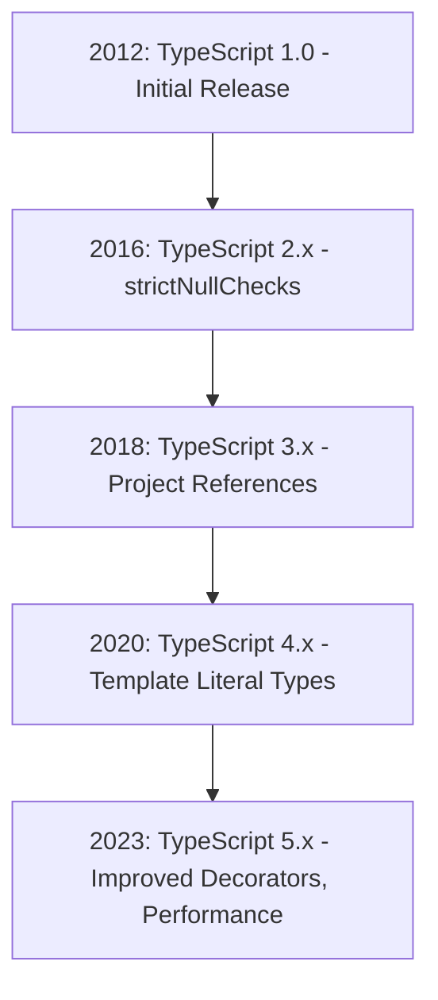
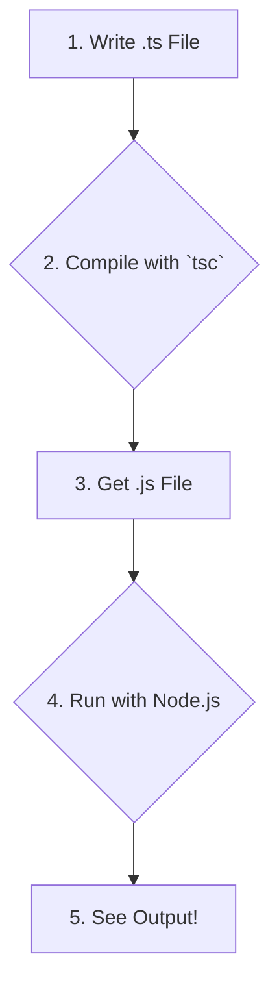

# <span style="color:#e67e22;">What we will learn in this post?</span>
<ul style='list-style-type: none; padding-left: 0;'>
<li><span style='color: #2980b9; font-size: 20px; font-weight: bold;'>👉</span> <span style='color: #2ecc71; font-size: 18px; font-weight: bold;'>Introduction to TypeScript</span></li>
<li><span style='color: #2980b9; font-size: 20px; font-weight: bold;'>👉</span> <span style='color: #2ecc71; font-size: 18px; font-weight: bold;'>Key Features of TypeScript</span></li>
<li><span style='color: #2980b9; font-size: 20px; font-weight: bold;'>👉</span> <span style='color: #2ecc71; font-size: 18px; font-weight: bold;'>TypeScript vs JavaScript</span></li>
<li><span style='color: #2980b9; font-size: 20px; font-weight: bold;'>👉</span> <span style='color: #2ecc71; font-size: 18px; font-weight: bold;'>History and Evolution of TypeScript</span></li>
<li><span style='color: #2980b9; font-size: 20px; font-weight: bold;'>👉</span> <span style='color: #2ecc71; font-size: 18px; font-weight: bold;'>Setting Up TypeScript Development Environment</span></li>
<li><span style='color: #2980b9; font-size: 20px; font-weight: bold;'>👉</span> <span style='color: #2ecc71; font-size: 18px; font-weight: bold;'>TypeScript IDEs and Tools</span></li>
<li><span style='color: #2980b9; font-size: 20px; font-weight: bold;'>👉</span> <span style='color: #2ecc71; font-size: 18px; font-weight: bold;'>Writing Your First TypeScript Program</span></li>
</ul>

# <span style="color:#e67e22">🚀 Discover TypeScript: JavaScript with Superpowers!</span>

Are you ready to write more robust and error-free web applications? Meet **TypeScript**! It's a fantastic language developed by *Microsoft* that acts as a **statically typed superset of JavaScript**. Think of it as JavaScript with extra features, primarily focused on making your code safer and easier to manage.

## <span style="color:#2980b9">🤔 What is TypeScript's Purpose?</span>

TypeScript's main goal is to bring **type safety** to your JavaScript projects. This means you can define the *types* of data your variables, function parameters, and return values should have. This simple addition is incredibly powerful because it allows TypeScript to:

*   **Catch errors at compile-time**: Instead of finding out about a bug when your code runs in a browser (runtime), TypeScript spots type-related mistakes *before* your code even gets executed. It's like having an early warning system!
*   **Improve Developer Productivity**: For **large-scale applications**, TypeScript offers features like smart autocompletion, clearer code documentation, and easier refactoring, making developers' lives much smoother.

## <span style="color:#2980b9">✨ Key Advantages at a Glance</span>

Here’s why developers love TypeScript:

*   **Early Bug Detection**: Find errors *before* they become problems.
*   **Better Code Quality**: Makes code more predictable and easier to understand.
*   **Enhanced Developer Experience**: Tools like `VS Code` offer incredible support, including intelligent suggestions.

### <span style="color:#8e44ad">🆕 Staying Current: TypeScript 5.x</span>

The TypeScript team is always innovating! **TypeScript 5.x** is the latest version, continually introducing exciting new features and performance improvements to make your development even more efficient.

### <span style="color:#8e44ad">🛠️ How TypeScript Works</span>

This simple diagram illustrates how TypeScript helps you catch errors early:

```mermaid
graph LR
    A[Write TypeScript (.ts) Code] --> B{TypeScript Compiler (tsc)};
    B -- "Errors Found (Type Mismatches)" --> C[Fix Code & Recompile];
    B -- "No Errors" --> D[Generate Plain JavaScript (.js) Code];
    D --> E[Run in Browser/Node.js];
```

---

Want to dive deeper? Check out the [Official TypeScript Website](https://www.typescriptlang.org/) for comprehensive documentation and guides!

# <span style="color:#e67e22">TypeScript's Superpowers Explained! 🚀</span>

TypeScript adds amazing features to JavaScript, making your code more robust and easier to manage. Let's dive into its core capabilities:

## <span style="color:#2980b9">Main Features Unpacked:</span>

*   ### <span style="color:#8e44ad">Static Typing 📝</span>
    TypeScript lets you add *optional types* to your variables, functions, and objects. This catches errors *before* your code even runs, like finding a typo in a recipe before baking!
    *Example:* `let quantity: number = 10;`

*   ### <span style="color:#8e44ad">Type Inference 🤔</span>
    Don't want to type everything? No worries! TypeScript is smart and can *guess* the type of a variable based on its initial value. It's like it already knows you're talking about a `string` if you assign `"hello"`.
    *Example:* `let greeting = "Hello, TypeScript!";` (TypeScript infers `greeting` is a `string`)

*   ### <span style="color:#8e44ad">Interfaces 🤝</span>
    Interfaces define the "shape" of an object. They're like blueprints that ensure all objects following that interface have the same properties, making your code *consistent* and predictable.
    *Example:*
    ```typescript
    interface Product {
      name: string;
      price: number;
    }
    ```

*   ### <span style="color:#8e44ad">Generics 🔄</span>
    Generics allow you to write reusable code that works with a *variety of types* instead of just one. Think of it as a function that can sort *any* list, whether it's numbers or names.
    *Example:*
    ```typescript
    function getArray<T>(items: T[]): T[] {
      return new Array().concat(items);
    }
    ```

*   ### <span style="color:#8e44ad">Decorators ✨</span>
    Decorators are a special kind of declaration that can *modify* classes, methods, or properties. They add extra functionality without directly changing the original code, similar to adding an accessory to an item.
    *Example:*
    ```typescript
    // @logMethod
    class Service { /* ... */ }
    ```

*   ### <span style="color:#8e44ad">Advanced IDE Support (IntelliSense) 💡</span>
    TypeScript supercharges your coding experience with tools like Visual Studio Code. You get *smart autocompletion*, instant error feedback, and easy navigation, making development much faster and smoother.

*   ### <span style="color:#8e44ad">Seamless JavaScript Interoperability ↔️</span>
    The best part? TypeScript is a superset of JavaScript. This means you can easily *mix* TypeScript and existing JavaScript files in the same project, gradually adopting it without rewriting everything.

---
**Why use it?** TypeScript helps you build *scalable* and *maintainable* applications by catching errors early and providing excellent tooling!

# <span style="color:#e67e22">TypeScript vs. JavaScript: A Friendly Showdown! 🥊</span>

Hey there! Let's compare JavaScript (JS) and TypeScript (TS). Think of them as cousins, but one is a bit more organized!

## <span style="color:#2980b9">Meet JavaScript (JS) 🚀</span>
It's the *original* web language, making sites interactive. JS is **dynamic** and **flexible**, letting you code fast. It's untyped, meaning variables can change type easily (`let x = 10; x = "hello";`).

## <span style="color:#2980b9">Meet TypeScript (TS) ✨</span>
TypeScript is a *superset* of JavaScript, adding **optional static types**. It helps find errors *before* you run your code! Since browsers can't run TS directly, it's *compiled* into plain JavaScript.

### <span style="color:#8e44ad">When to Choose TypeScript? 🤔</span>
Opt for TS in **larger projects** or **team environments** for these benefits:

*   **Type Safety**: Catches common errors *before* running code, preventing runtime surprises.
*   **Better Tooling**: Excellent autocompletion, navigation, and refactoring support in IDEs (like VS Code).
*   **Scalability**: Makes large codebases easier to manage and maintain over time.
*   **Readability**: Types serve as clear documentation within your code.

## <span style="color:#2980b9">Quick Pros & Cons 🚦</span>

*   **JS Pros**: Fast to start, widely supported, no compilation step.
*   **JS Cons**: Runtime errors, less scalable for big apps, harder to debug.
*   **TS Pros**: Early error detection, robust tooling, improved code quality, great for teams.
*   **TS Cons**: Learning curve, requires a compilation step, slightly more verbose.

### <span style="color:#8e44ad">Practical Example 💡</span>
```typescript
// TypeScript
function greet(name: string) {
  console.log(`Hello, ${name}!`);
}
greet("Alice"); // OK
// greet(123);   // Error: Argument of type 'number' is not assignable to 'string'.
```
```javascript
// JavaScript
function greet(name) {
  console.log(`Hello, ${name}!`);
}
greet("Bob");
greet(456); // No error, but potentially unexpected output later.
```

## <span style="color:#2980b9">How TS Becomes JS 🔄</span>
```mermaid
graph LR
    A[TypeScript Code (.ts)] --> B[TypeScript Compiler (tsc)];
    B --> C[Plain JavaScript Code (.js)];
    C --> D[Browser/Node.js Runtime];
```

For more info:
*   [TypeScript Official Site](https://www.typescriptlang.org/)
*   [MDN JavaScript Guide](https://developer.mozilla.org/en-US/docs/Web/JavaScript/Guide)

# <span style="color:#e67e22">The Journey of TypeScript: A Type-Safe Evolution ✨</span>

---

## <span style="color:#2980b9">Born at Microsoft: 2012's Game Changer 🚀</span>

In *2012*, Microsoft unveiled **TypeScript**, spearheaded by the visionary Anders Hejlsberg. It emerged to tackle the challenges of building large-scale JavaScript applications, offering static typing that promised greater reliability and maintainability. Its initial release, `TypeScript 1.0`, brought essential features like classes, modules, and interfaces to the JavaScript ecosystem.

---

## <span style="color:#2980b9">Embraced by Giants: The Frameworks' Choice 💖</span>

TypeScript's promise of *fewer runtime errors* and a significantly *enhanced developer experience* quickly captivated the web development community. **Angular** became a major early adopter, choosing TypeScript as its primary language. Soon after, **React** and **Vue.js** projects also embraced its benefits, solidifying TypeScript's role as a cornerstone of modern web development. Its strong tooling support makes large codebases easier to manage and refactor.

---

## <span style="color:#2980b9">Growing Up: From 1.x to 5.x 🌳</span>

TypeScript has continuously evolved, with each major version introducing powerful features:

*   **2.x:** Introduced `strictNullChecks`, a crucial feature for catching common null/undefined-related bugs.
*   **3.x:** Brought project references, significantly improving monorepo support.
*   **4.x:** Added sophisticated *template literal types* and variadic tuple types, expanding its type-level programming capabilities.
*   **5.x:** Refined decorators, offered `const` type parameters, and delivered significant performance improvements.

This constant innovation, fueled by a thriving *open-source community*, ensures TypeScript remains a leading choice for building robust, scalable applications.



---

### <span style="color:#8e44ad">Further Reading 📚</span>

*   [TypeScript Official Documentation](https://www.typescriptlang.org/docs/)
*   [TypeScript on Wikipedia](https://en.wikipedia.org/wiki/TypeScript)

# <span style="color:#e67e22">Let's Get Started with Node.js & TypeScript! ✨</span>

Let's quickly get Node.js, npm, and TypeScript (tsc) set up!

## <span style="color:#2980b9">Node.js & npm: Your Core Foundation 🏗️</span>

Node.js *comes with* npm (Node Package Manager).
*   **Installation**:
    *   *Windows/macOS*: Download recommended installer from [nodejs.org](https://nodejs.org/).
    *   *Linux*: Use your distribution's package manager (e.g., `sudo apt install nodejs npm`) or `nvm` (Node Version Manager) for flexibility.
*   **Verify**: Open your terminal/command prompt and type:
    ```bash
    node -v
    npm -v
    ```
    You'll see version numbers.

## <span style="color:#2980b9">TypeScript Compiler (tsc) Installation 🚀</span>

Install the TypeScript compiler globally.
*   **Install Globally**: This makes `tsc` available everywhere.
    ```bash
    npm install -g typescript
    ```
*   **Verify**: Check its version:
    ```bash
    tsc --version
    ```
    You'll see `Version 5.x.x`.

## <span style="color:#2980b9">Your First TypeScript Project! 📁</span>

Let's create a basic TypeScript project!

### <span style="color:#8e44ad">Project Setup & `tsconfig.json` 📝</span>

1.  **New Folder**:
    ```bash
    mkdir my-ts-app
    cd my-ts-app
    ```
2.  **Initialize npm** (optional): `npm init -y`
3.  **Generate `tsconfig.json`**: This file configures TypeScript compilation.
    ```bash
    tsc --init
    ```
    *Open `tsconfig.json`*. Uncomment `"outDir": "./dist"` to organize compiled JS into a `dist` folder.
4.  **Create Code**: Create `src/index.ts`:
    ```typescript
    // src/index.ts
    function greet(name: string): void {
        console.log(`Hello, ${name}!`);
    }
    greet("TypeScript");
    ```
5.  **Compile**: Run `tsc` to compile TS to JS:
    ```bash
    tsc
    ```
    Creates `dist/index.js`.
6.  **Run**: Run compiled JavaScript:
    ```bash
    node dist/index.js
    ```
    You'll see `Hello, TypeScript!`.

Workflow:
```mermaid
graph TD
    A[Node.js & npm Install] --> B[TypeScript (tsc) Global Install];
    B --> C[Create Project Folder & `npm init`];
    C --> D[Generate `tsconfig.json` (`tsc --init`)];
    D --> E[Write TypeScript Code (.ts)];
    E --> F[Compile Code (`tsc`)];
    F --> G[Run JavaScript (`node`)];
```

**Resources:**
*   [Node.js Official Website](https://nodejs.org/)
*   [TypeScript Documentation](https://www.typescriptlang.org/docs/)

# <span style="color:#e67e22">🚀 Your TypeScript Coding HQ!</span>

Choosing the *right* development environment supercharges your TypeScript journey. Let's explore popular options, comparing their features, extensions, and debugging capabilities.

## <span style="color:#2980b9">✨ Popular TypeScript Environments</span>

*   **Visual Studio Code (VS Code)**: This *free*, lightweight editor is a favorite. It boasts *excellent built-in TypeScript support*, robust debugging, and a vast marketplace for `extensions` (e.g., *ESLint*).
    *   [Learn More about TS in VS Code](https://code.visualstudio.com/docs/languages/typescript)

*   **WebStorm**: A *powerful IDE* from JetBrains, WebStorm offers *top-tier TypeScript integration*, advanced refactoring, and comprehensive debugging. Ideal for larger projects; it's a premium, paid tool.

*   **Sublime Text**: Known for *speed* and minimalism, Sublime is a popular text editor. With community *plugins*, it offers syntax highlighting and basic TypeScript features. Debugging often uses external tools.

*   **TypeScript Playground**: An *online sandbox* perfect for quick tests, sharing code, and exploring TypeScript features without setup. Great for learning and prototyping.
    *   [Visit TypeScript Playground](https://www.typescriptlang.org/play)

## <span style="color:#2980b9">💡 Making Your Choice</span>

Your ideal tool depends on project needs. VS Code offers a great *balance*; WebStorm is a *premium experience*; Sublime Text for *minimalists*; and the Playground for *instant experimentation*.

# <span style="color:#e67e22">👋 Your TypeScript Journey Starts Here!</span>

Let's create your first 'Hello, World!' program in TypeScript! TypeScript extends JavaScript, adding powerful *types* for clearer, safer code. Files end with a `.ts` extension.

## <span style="color:#2980b9">✍️ Step 1: Write Your TypeScript (.ts) File</span>

Create a file named `hello.ts`. Notice the `.ts`!

```typescript
// hello.ts
let greetingMessage: string = "Hello, TypeScript World!";
console.log(greetingMessage);
```
Here, `: string` is a **type annotation**. It tells TypeScript `greetingMessage` *must* be a string, catching errors early.

## <span style="color:#2980b9">🛠️ Step 2: Compile with `tsc`</span>

Browsers and Node.js don't understand `.ts` directly. We use the TypeScript Compiler (`tsc`) to transform it into regular JavaScript (`.js`).

Open your terminal and run:
```bash
tsc hello.ts
```
Voila! This command creates a new file, `hello.js`, in the same folder.

## <span style="color:#2980b9">▶️ Step 3: Run Your JavaScript Output</span>

Now, execute the compiled `hello.js` using Node.js:
```bash
node hello.js
```
You'll see: *Hello, TypeScript World!* Super simple, right?

## <span style="color:#2980b9">✨ Types in Action: Beyond Basics</span>

TypeScript shines with type safety!
```typescript
function greetUser(name: string): string { // Typed parameter & return
  return `Hi there, ${name}!`;
}
let userName: string = "TypeScript Learner"; // Typed variable
console.log(greetUser(userName)); // Output: Hi there, TypeScript Learner!
```
Here, `name: string` ensures `greetUser` only accepts strings, and `: string` after the function ensures it *returns* a string.

## <span style="color:#2980b9">🔄 The TypeScript Workflow at a Glance</span>



### <span style="color:#8e44ad">🔗 Want to Learn More?</span>

Explore TypeScript's amazing features!
*   [TypeScript Official Docs](https://www.typescriptlang.org/docs/ "Learn TypeScript in depth")
*   [Node.js Official Website](https://nodejs.org/ "Download Node.js to run JavaScript")

