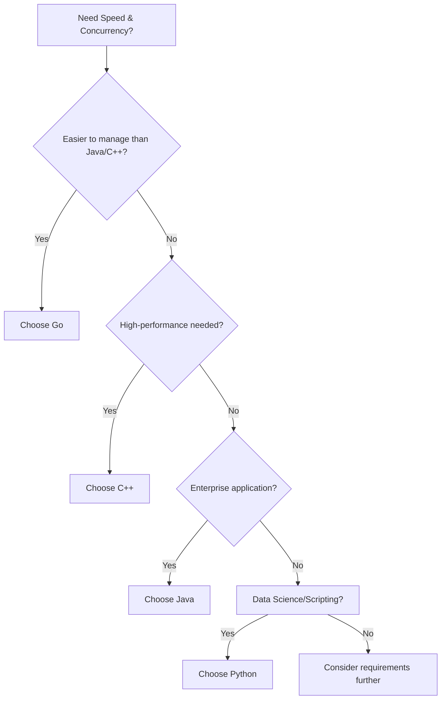
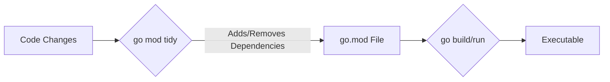

# <span style="color:#e67e22;">What we will learn in this post?</span>
<ul style='list-style-type: none; padding-left: 0;'>
<li><span style='color: #2980b9; font-size: 20px; font-weight: bold;'>👉</span> <span style='color: #2ecc71; font-size: 18px; font-weight: bold;'>What is Go (Golang)?</span></li>
<li><span style='color: #2980b9; font-size: 20px; font-weight: bold;'>👉</span> <span style='color: #2ecc71; font-size: 18px; font-weight: bold;'>Key Features of Go</span></li>
<li><span style='color: #2980b9; font-size: 20px; font-weight: bold;'>👉</span> <span style='color: #2ecc71; font-size: 18px; font-weight: bold;'>Go vs Other Languages</span></li>
<li><span style='color: #2980b9; font-size: 20px; font-weight: bold;'>👉</span> <span style='color: #2ecc71; font-size: 18px; font-weight: bold;'>Installing Go</span></li>
<li><span style='color: #2980b9; font-size: 20px; font-weight: bold;'>👉</span> <span style='color: #2ecc71; font-size: 18px; font-weight: bold;'>Your First Go Program</span></li>
<li><span style='color: #2980b9; font-size: 20px; font-weight: bold;'>👉</span> <span style='color: #2ecc71; font-size: 18px; font-weight: bold;'>Go Workspace Structure</span></li>
<li><span style='color: #2980b9; font-size: 20px; font-weight: bold;'>👉</span> <span style='color: #2ecc71; font-size: 18px; font-weight: bold;'>Go Command Line Tools</span></li>
<li><span style='color: #2980b9; font-size: 20px; font-weight: bold;'>👉</span> <span style='color: #2ecc71; font-size: 18px; font-weight: bold;'>Conclusion!</span></li>
</ul>

# <span style="color:#e67e22">Go: The Simple, Speedy Language 🚀</span>

Go, also known as Golang, is a programming language created by Google in 2009. It's designed to be *simple*, *efficient*, and *reliable* – perfect for modern software development.

## <span style="color:#2980b9">Purpose-Built for Today's Challenges 🛠️</span>

Go shines where performance matters. Think of it as the go-to language for:

*   **Cloud Services:** Building robust and scalable cloud applications.
*   **Microservices:** Creating small, independent services that work together.
*   **CLI Tools:** Developing command-line tools that are fast and easy to use.
*   **DevOps:** Automating infrastructure and streamlining workflows.

## <span style="color:#2980b9">Simplicity & Speed 💨</span>

Go focuses on `readability` and *minimalism*. Its straightforward syntax and powerful features make it easy to learn and use. Plus, it's incredibly fast, thanks to its efficient compiler and garbage collection.

Here's a simple example:

```go
package main

import "fmt"

func main() {
    fmt.Println("Hello, World!")
}
```

Go is a powerful tool for building high-performance software! Want to know more? Check out the official [Go website](https://go.dev/).


Okay, here's a friendly and visually appealing overview of Go's key features!

# <span style="color:#e67e22">Go: A Simple and Powerful Language 🚀</span>

Go, also known as Golang, is a language designed for *simplicity* and *efficiency*. Let's look at its main features:

## <span style="color:#2980b9">Simplicity and Readability 📖</span>

Go has a clean syntax, making it easy to learn and understand. It avoids unnecessary complexity, focusing on clear and explicit code.
```go
package main

import "fmt"

func main() {
    fmt.Println("Hello, World!")
}
```
*   **Explanation:** This basic program shows Go's straightforward structure. Notice the lack of semicolons!

## <span style="color:#2980b9">Fast Compilation ⚡</span>

Go compiles *very* quickly. This means faster development cycles.

*   **Benefit:** Spend less time waiting for your code to build.

## <span style="color:#2980b9">Built-in Concurrency (Goroutines) 🧵</span>

Go has built-in support for concurrency using *goroutines* and *channels*. Goroutines are lightweight, concurrent functions, and channels are pipes for communication.

```go
package main

import (
	"fmt"
	"time"
)

func say(s string) {
	for i := 0; i < 5; i++ {
		time.Sleep(100 * time.Millisecond)
		fmt.Println(s)
	}
}

func main() {
	go say("world")
	say("hello")
}
```

*   **Explanation:** This example starts a new goroutine running the `say` function.
*   **Resources**: Check out the [official Go documentation](https://go.dev/tour/concurrency/1) for a deeper dive into concurrency.

## <span style="color:#2980b9">Static Typing 👓</span>

Go is statically typed, meaning the type of a variable is known at compile time. This helps catch errors early.

```go
var message string = "Hello" // Explicit type declaration
```

*   **Benefit:** Fewer runtime errors!

## <span style="color:#2980b9">Garbage Collection 🗑️</span>

Go has automatic garbage collection, meaning you don't have to manually manage memory.

*   **Benefit:** Less worry about memory leaks.

## <span style="color:#2980b9">Strong Standard Library 📚</span>

Go comes with a rich standard library, providing tools for common tasks like networking, I/O, and more.

*   **Example:** The `net/http` package makes it easy to create web servers.

In summary, Go is a great language for building reliable and efficient software!


# <span style="color:#e67e22">Go vs. Python, Java, and C++: A Quick Comparison 🚀</span>

Go is a cool programming language with strengths in certain areas. Let's see how it stacks up against Python, Java, and C++.

## <span style="color:#2980b9">Key Differences 🔑</span>

*   **Performance:** Go is generally *faster* than Python (which is interpreted). It often approaches the speed of Java and can be *close* to C++ for many tasks.
*   **Concurrency Model:** Go shines with its *goroutines* and *channels*, making concurrent programming easier than with threads in Java or C++. Python has concurrency, but not as built-in and efficient.
*   **Compilation Speed:** Go compiles *much faster* than Java or C++, making development quicker. Python doesn't need compilation, but can be slower.
*   **Use Cases:**

    *   **Go:** Great for cloud infrastructure, network services, and command-line tools. (e.g., Docker, Kubernetes)
    *   **Python:** Perfect for data science, machine learning, scripting, and web development. (e.g., TensorFlow, Django)
    *   **Java:** Used extensively in enterprise applications, Android development, and large systems. (e.g., Spring, Hadoop)
    *   **C++:** Ideal for high-performance applications like game development, operating systems, and embedded systems.

## <span style="color:#2980b9">When to Choose Go? 🤔</span>

Choose Go when you need *speed* and *concurrency* in a language that's easier to manage than Java or C++. If you are building a large scale micro-services architecture, Go is probably the best fit. If you want to create a simple web application, and require something like _low-code/no-code_ then Python is a good choice. If you are building a system that requires a lot of computations, such as a finance/stock market analysis application, C++ would be a suitable choice.

Here's a simple flowchart:


## <span style="color:#2980b9">Additional Resources 🔗</span>

*   [Go Official Documentation](https://go.dev/doc/)
*   [Python Official Documentation](https://docs.python.org/3/)
*   [Java Official Documentation](https://docs.oracle.com/en/java/)
*   [C++ Official Documentation](https://en.cppreference.com/w/)


Alright, let's get Go installed! 🚀

# <span style="color:#e67e22">Installing Go 1.21+</span>

This guide will help you install Go on Windows, macOS, and Linux.

## <span style="color:#2980b9">Platform-Specific Instructions</span>

*   **Windows:** 💻
    1.  Download the `.msi` installer from the official Go website: [https://go.dev/dl/](https://go.dev/dl/)
    2.  Run the installer. Follow the prompts. The installer usually handles `GOPATH` and environment variables automatically.
    3.  Restart your command prompt/PowerShell for changes to take effect.

*   **macOS:** 🍎
    1.  Download the `.pkg` installer from: [https://go.dev/dl/](https://go.dev/dl/) or use `brew install go` (if you have Homebrew).
    2.  Run the installer, following the prompts.
    3.  Go will typically be installed in `/usr/local/go`.
    4.  You might need to close and reopen your terminal.

*   **Linux:** 🐧
    1.  Download the `.tar.gz` archive from [https://go.dev/dl/](https://go.dev/dl/).
    2.  Extract the archive to `/usr/local`: `sudo tar -C /usr/local -xzf go1.21.x.linux-amd64.tar.gz` (replace `go1.21.x` with the actual version).
    3.  Add `/usr/local/go/bin` to your `PATH` environment variable.  Edit `~/.profile` or `~/.bashrc` and add: `export PATH=$PATH:/usr/local/go/bin`.
    4.  Source the file: `source ~/.profile` or `source ~/.bashrc`.

## <span style="color:#2980b9">Verification and Configuration</span>

1.  **Verify Installation:** Open a terminal/command prompt and run `go version`. You should see the Go version printed.

2.  **`GOPATH`:** This is where your Go projects live. By default, Go 1.11+ defaults to `~/go` (or `$HOME/go`).  You can change it by setting the `GOPATH` environment variable: `export GOPATH=/path/to/your/go/projects`.  It's generally advisable *not* to set it.

3.  **`GOROOT`:** This is where Go is installed. The installers usually handle this. Don't usually need to set it.

4.  **Environment Variables:** Ensure `GOPATH/bin` and `/usr/local/go/bin` (or the respective bin directories) are in your `PATH`.

Enjoy coding in Go! ✨


# <span style="color:#e67e22">Your First Go Program: Hello, World! 🌍</span>

Let's create a simple 'Hello, World!' program in Go! It's a great way to start learning the language.

## <span style="color:#2980b9">Writing the Code</span>

1.  **Create a file** named `hello.go`.
2.  **Add this code:**

    ```go
    package main

    import "fmt"

    func main() {
        fmt.Println("Hello, World!")
    }
    ```

    *   `package main`: This tells Go it's an executable program.
    *   `import "fmt"`: Imports the `fmt` package for printing.
    *   `func main()`: The entry point of your program.
    *   `fmt.Println(...)`: Prints text to the console.
    
    For more on packages, checkout: [Go Packages](https://go.dev/tour/basics/1)

## <span style="color:#2980b9">Running Your Program</span>

### <span style="color:#8e44ad">Using `go run`</span>

   This compiles and runs your code in one step.

    ```bash
    go run hello.go
    ```

    **Output:**

    ```
    Hello, World!
    ```

### <span style="color:#8e44ad">Using `go build`</span>

   This compiles your code into an executable file.

    ```bash
    go build hello.go
    ./hello
    ```

    **Output:**

    ```
    Hello, World!
    ```

*   `go run` is faster for testing.
*   `go build` creates a standalone executable.

For more on running and building Go programs, see: [How to Write Go Code](https://go.dev/doc/code)


# <span style="color:#e67e22">Go Workspaces: Modern vs. Legacy</span> 🚀

Modern Go uses **modules** for managing dependencies. No more `GOPATH` headaches! Let's dive in.

## <span style="color:#2980b9">Module Structure</span> 📂

*   A Go project is now a module with a `go.mod` file at the root. This file declares the module's name (import path) and its dependencies.
*   The `go.sum` file contains cryptographic hashes of dependencies, ensuring reproducible builds.
*   Dependencies are downloaded and cached locally (typically in `$GOPATH/pkg/mod`), no longer cluttering your project.

## <span style="color:#2980b9">Directory Layout</span> 🌲

A simple project might look like this:

```
myproject/
├── go.mod
├── go.sum
├── main.go
└── internal/
    └── helper/
        └── helper.go
```

*   `main.go` is the entry point.
*   `internal/` is a special directory: code inside isn't meant to be imported by external modules.
*   `helper/` is for organizing reusable code.

## <span style="color:#2980b9">`GOPATH` vs. Modules</span> 🤔

Previously, all Go code lived inside `GOPATH`. Modules offer:

*   Version control: Specify dependency versions.
*   Reproducibility: `go.sum` ensures consistent builds.
*   Flexibility: Projects can live *anywhere* on your filesystem.

Example `go.mod`:

```go
module example.com/myproject

go 1.20

require (
	github.com/gin-gonic/gin v1.9.0
)

```

**Additional Resources:**
* [Go Modules Reference](https://go.dev/ref/mod)
* [GOPATH vs Modules](https://go.dev/blog/using-go-modules)


# <span style="color:#e67e22">Go CLI Tools: Your Friendly Guide</span> 🚀

Let's explore essential Go command-line tools! These tools are your best friends when developing Go applications.

## <span style="color:#2980b9">Core Tools for Go Development</span>

*   `go run`: Executes your Go program *directly*. Great for quick tests!
    *   Example: `go run main.go` will run your `main.go` file.
*   `go build`: Compiles your Go code into an executable file.
    *   Example: `go build main.go` creates an executable named `main` (or `main.exe` on Windows).
*   `go install`: Compiles and installs your package. Places the executable in your `$GOPATH/bin` directory (or `$GOBIN` if set).
    *   Example: `go install mypackage` makes `mypackage` executable available globally.
*   `go get`: Fetches and installs packages from remote repositories. (Older method, superseded by `go mod`).
    *   Example: `go get github.com/gorilla/mux` (avoid in modern Go projects using modules).

## <span style="color:#2980b9">Module Management (Go Modules)</span>

*   `go mod init`: Creates a `go.mod` file, starting a new Go module.
    *   Example: `go mod init mymodule` initializes a module named `mymodule`.
*   `go mod tidy`: Adds missing module dependencies and removes unused ones in your `go.mod` file. *Essential* for dependency management!
    *   Example: `go mod tidy` cleans up your dependencies.
*   `go mod vendor`: Creates a local copy of your dependencies in the `vendor` directory. Useful for reproducible builds.
    *   Example: `go mod vendor` copies dependencies.



## <span style="color:#2980b9">Code Quality & Testing</span>

*   `go fmt`: Automatically formats your Go code according to the official style guidelines. Ensures consistency!
    *   Example: `go fmt main.go` formats `main.go`.
*   `go vet`: Analyzes your code for common errors and suspicious constructs. Helps catch bugs early!
    *   Example: `go vet main.go` checks your code.
*   `go test`: Runs your unit tests. Crucial for ensuring your code works correctly.
    *   Example: `go test ./...` runs all tests in the current directory and its subdirectories.

```go
// Example Test Function
package mypackage

import "testing"

func TestAdd(t *testing.T) {
	if Add(2, 3) != 5 {
		t.Error("Expected 2 + 3 to equal 5")
	}
}
```

Remember to explore the Go documentation for deeper understanding! [Go Documentation](https://go.dev/doc/). Happy coding! 👩‍💻👨‍💻


Okay, here are a few options for a conclusion statement encouraging comments, feedback, or suggestions, formatted as requested:

**Option 1:**

<h1><span style='color:#e67e22'>Conclusion</span></h1>

Hope you enjoyed reading! ✨ We're always looking for ways to improve, so what did you think? Drop your thoughts, questions, or even just a "hello" in the comments below! 👇 We'd love to hear from you. 😊 What topics would you like us to cover next? Let us know! 🗣️

**Option 2:**

<h1><span style='color:#e67e22'>Conclusion</span></h1>

That's a wrap! 🎬 Did anything resonate with you? Or maybe you have a different take on things? 🤔 Share your valuable insights in the comment section! We're all ears! 👂 Your feedback helps us create content you'll love! ❤️ Let's start a conversation! 💬

**Option 3:**

<h1><span style='color:#e67e22'>Conclusion</span></h1>

Alright, we've reached the end! 🎉 Was this helpful? Got any brilliant ideas to add? 💡 Don't be shy, the comment section is all yours! 👇 We really appreciate your input and want to make this a great community. 🤗 What are your experiences with this topic? Tell us all about it! ✍️


