# <span style="color:#e67e22;">What we will learn in this post?</span>
<ul style='list-style-type: none; padding-left: 0;'>
<li><span style='color: #2980b9; font-size: 20px; font-weight: bold;'>👉</span> <span style='color: #2ecc71; font-size: 18px; font-weight: bold;'>Go Program Structure</span></li>
<li><span style='color: #2980b9; font-size: 20px; font-weight: bold;'>👉</span> <span style='color: #2ecc71; font-size: 18px; font-weight: bold;'>Variables and Constants</span></li>
<li><span style='color: #2980b9; font-size: 20px; font-weight: bold;'>👉</span> <span style='color: #2ecc71; font-size: 18px; font-weight: bold;'>Data Types in Go</span></li>
<li><span style='color: #2980b9; font-size: 20px; font-weight: bold;'>👉</span> <span style='color: #2ecc71; font-size: 18px; font-weight: bold;'>Type Conversion and Zero Values</span></li>
<li><span style='color: #2980b9; font-size: 20px; font-weight: bold;'>👉</span> <span style='color: #2ecc71; font-size: 18px; font-weight: bold;'>Operators in Go</span></li>
<li><span style='color: #2980b9; font-size: 20px; font-weight: bold;'>👉</span> <span style='color: #2ecc71; font-size: 18px; font-weight: bold;'>Comments and Code Formatting</span></li>
<li><span style='color: #2980b9; font-size: 20px; font-weight: bold;'>👉</span> <span style='color: #2ecc71; font-size: 18px; font-weight: bold;'>Conclusion!</span></li>
</ul>

# <span style="color:#e67e22">Go Program Structure 🚀</span>

Here's a simple breakdown of how a Go program is organized:

## <span style="color:#2980b9">Packages: Code Organizers 📦</span>

Go uses *packages* to keep code neat and tidy. Think of them as folders for your Go files.

*   **Package Declaration:** Every Go file starts with `package <packagename>`, like `package main`.
*   **Import Statements:** If you need code from other packages, you `import` them. For example, `import "fmt"` to use printing functions.

## <span style="color:#2980b9">The `main` Function: Where the Magic Happens ✨</span>

The `main` package is special. It's where your program *starts*.

*   Inside the `main` package, the `main` function (`func main() {}`) is the entry point. Your program's code begins executing here.

```go
package main // Declares the package as 'main'

import "fmt" // Imports the 'fmt' package for printing

func main() { // The main function
    fmt.Println("Hello, Go!") // Prints "Hello, Go!" to the console
}
```

**Example:** In this code, `package main` says this is the main program. `import "fmt"` brings in the `fmt` package (for formatted input/output), and `fmt.Println` prints a message.

**Package main** is very important. If a program is to be executable, it must have one `main` function declared inside the `main` package.


# <span style="color:#e67e22">Variable and Constant Declarations in Go</span> 🚀

Let's explore how to declare variables and constants in Go.

## <span style="color:#2980b9">Variables</span> 🧰

### <span style="color:#8e44ad">`var` Keyword</span>
You can declare variables using the `var` keyword. You specify the variable's name and its type.

```go
var age int // Declares an integer variable named age
var name string // Declares a string variable named name
age = 30
name = "Alice"
```
You can also declare and initialize a variable in one line:

```go
var isHappy bool = true
```

### <span style="color:#8e44ad">Shorthand `:=` Operator</span>
The `:=` operator is a shorthand for declaring *and* initializing variables. **Important:** It can *only* be used inside functions. Go infers the type automatically.

```go
count := 10 // Go infers that count is an int
message := "Hello!" // Go infers that message is a string
```

## <span style="color:#2980b9">Constants</span> 📌

Constants are declared using the `const` keyword. Their values *cannot* be changed during runtime.

```go
const pi = 3.14159 // Go infers that pi is a float64
const greeting string = "Welcome"
```

## <span style="color:#2980b9">Type Inference</span> 🤔

Go often infers the type of a variable or constant based on the assigned value. This simplifies the code.

## <span style="color:#2980b9">When to Use Which?</span> ⏱️

*   Use `var` when you want to declare a variable *without* initializing it immediately, or when you want to explicitly specify the type.

*   Use `:=` inside functions for concise declaration and initialization.

*   Use `const` for values that *should not* change during the program's execution.


You can find more about go declaration at this [link](https://go.dev/tour/basics/8).


# <span style="color:#e67e22">Go's Data Types: A Quick Guide</span> 🚀

Let's explore Go's fundamental data types!

## <span style="color:#2980b9">Numbers, Truth, and Text</span> 🔢

*   **Integers:** Whole numbers like 10 or -5. Go offers sizes: `int` (architecture-dependent, usually 32 or 64 bits), `int8` (8 bits), `int16`, `int32`, `int64`, and unsigned versions (`uint`, `uint8`, etc.).
    *   Example: `var age int = 30`
*   **Floating-point numbers:** Numbers with decimals, like 3.14. We have `float32` and `float64` (more precise).
    *   Example: `var pi float64 = 3.14159`
*   **Booleans:** `true` or `false`.
    *   Example: `var isReady bool = true`
*   **Strings:** Sequences of characters (text). Strings are *immutable* in Go.
    *   Example: `var name string = "Alice"`
*   **Runes:** Represents a Unicode code point. Essentially an alias for `int32`. Think of them as individual characters, especially useful for handling different languages.
    *   Example: `var letter rune = 'A'`
*   **Complex numbers:** Numbers with real and imaginary parts: `complex64`, `complex128`.
    *   Example: `var c complex128 = complex(5, -5)`

```mermaid
graph LR
    A[Data Types] --> B(Integers: int, int8, ... uint);
    A --> C(Floats: float32, float64);
    A --> D(Boolean: bool);
    A --> E(String);
    A --> F(Rune);
	A --> G(Complex);
```



Remember that sizes determine the range of values a type can hold! 📝 Check the official [Go documentation](https://go.dev/ref/spec#Types) for exhaustive details.


# <span style="color:#e67e22">Explicit Type Conversion in Go 🚀</span>

Go is picky about types! Sometimes you need to *explicitly* tell Go to change a value from one type to another. This is called **type conversion**.

## <span style="color:#2980b9">Why Use Explicit Type Conversion? 🤔</span>

Go doesn't automatically convert between different types (like `int` and `float64`). You *must* do it yourself.

```go
var x int = 10
var y float64 = float64(x) // Convert int to float64

println(y) // Output: 10.0
```

## <span style="color:#2980b9">Zero Values 😴</span>

When you declare a variable without giving it a value, Go automatically assigns it a **zero value**.

*   `int`, `int8`, `int16`, `int32`, `int64`, `uint`, `uint8`, `uint16`, `uint32`, `uint64`: `0`
*   `float32`, `float64`: `0.0`
*   `bool`: `false`
*   `string`: `""` (empty string)
*   `pointer`, `slice`, `map`, `channel`, `function`, `interface`: `nil`

### <span style="color:#8e44ad">Examples</span>

```go
var a int     // Zero value: 0
var b float64 // Zero value: 0.0
var c bool    // Zero value: false
var d string  // Zero value: ""
var e *int   // Zero value: nil

println(a,b,c,d,e == nil) // Output: 0 0.0 false  true
```

*Additional Resources:*

*   [Go tour on type conversions](https://go.dev/tour/concurrency/1)
*   [Effective Go - Conversions](https://go.dev/doc/effective_go#conversions)


# <span style="color:#e67e22">Let's Explore Operators!</span> 🧮

Operators are the workhorses of programming, allowing us to perform calculations, make comparisons, and manipulate data. Here's a simple breakdown:

## <span style="color:#2980b9">Arithmetic Operators</span> ➕➖✖️➗

These operators perform basic mathematical operations.

*   `+` (Addition): `5 + 3` equals `8`
*   `-` (Subtraction): `10 - 4` equals `6`
*   `*` (Multiplication): `6 * 7` equals `42`
*   `/` (Division): `20 / 5` equals `4`
*   `%` (Modulus): `15 % 2` equals `1` (remainder after division)

## <span style="color:#2980b9">Comparison Operators</span> 🧐

These operators compare values and return `true` or `false`.

*   `==` (Equal to): `5 == 5` is `true`
*   `!=` (Not equal to): `5 != 6` is `true`
*   `<` (Less than): `2 < 8` is `true`
*   `>` (Greater than): `9 > 4` is `true`
*   `<=` (Less than or equal to): `7 <= 7` is `true`
*   `>=` (Greater than or equal to): `10 >= 3` is `true`

## <span style="color:#2980b9">Logical Operators</span> 🧠

These operators combine or modify boolean expressions.

*   `&&` (AND): `(5 > 3) && (2 < 4)` is `true` (both conditions must be true)
*   `||` (OR): `(5 < 3) || (2 < 4)` is `true` (at least one condition must be true)
*   `!` (NOT): `!(5 == 6)` is `true` (reverses the boolean value)

## <span style="color:#2980b9">Bitwise Operators</span> 👾

These operators work on the binary representation of numbers.

*   `&` (AND): `5 & 3` (binary `0101 & 0011`) equals `1` (binary `0001`)
*   `|` (OR): `5 | 3` (binary `0101 | 0011`) equals `7` (binary `0111`)
*   `^` (XOR): `5 ^ 3` (binary `0101 ^ 0011`) equals `6` (binary `0110`)
*   `<<` (Left shift): `5 << 1` (binary `0101 << 1`) equals `10` (binary `1010`)
*   `>>` (Right shift): `5 >> 1` (binary `0101 >> 1`) equals `2` (binary `0010`)

Here are some useful resources for diving deeper:

*   [W3Schools Operators](https://www.w3schools.com/js/js_operators.asp)
*   [MDN Operators](https://developer.mozilla.org/en-US/docs/Web/JavaScript/Reference/Operators)


# <span style="color:#e67e22">Comments and Formatting in Go 📝</span>

Comments explain your code! 🤩 Use `//` for **single-line** comments:

```go
// This is a single-line comment.
```

And `/* ... */` for **multi-line** comments.

```go
/*
This is a
multi-line comment.
*/
```

## <span style="color:#2980b9">Documentation with godoc 📚</span>

For API documentation, use **documentation comments** before functions/types:

```go
// Add adds two numbers.
func Add(x, y int) int {
    return x + y
}
```

## <span style="color:#2980b9">Formatting Matters! ✨</span>

*`gofmt`* and *`goimports`* automatically format your code. **Use them!** Run them before committing to ensure consistency. This improves readability and collaboration.

### <span style="color:#8e44ad">Best Practices 🏆</span>

*   Write clear and concise comments.
*   Document public APIs with godoc comments.
*   Always run `gofmt` and `goimports`.

These tools prevent many formatting debates. 🎉


Okay, here are a few options for conclusion statements encouraging comments, formatted as requested:

**Option 1:**

<h1><span style='color:#e67e22'>Conclusion</span></h1>

So, what do you think? Did anything resonate with you? 🤔 I'd love to hear your thoughts, feedback, or even your own experiences in the comments below! Let's chat and learn from each other! 👇💬

**Option 2:**

<h1><span style='color:#e67e22'>Conclusion</span></h1>

And that's a wrap! 🎉 I'm super curious to know what you took away from this. Any tips or suggestions of your own? Share them in the comments! Let's keep the conversation going! 😊👇

**Option 3:**

<h1><span style='color:#e67e22'>Conclusion</span></h1>

Hope you enjoyed reading! 😊 Now it's your turn! What are your thoughts? Any questions or ideas sparked by this post? Drop them in the comments below – I'm all ears!👂 Let's connect! 👇

**Option 4:**

<h1><span style='color:#e67e22'>Conclusion</span></h1>

Alright, folks, that's all for today! 👋 What are your biggest takeaways? Or maybe you have a different perspective? I'm eager to hear it! Share your comments down below! Let's discuss! ⬇️🗣️


