# <span style="color:#e67e22;">What we will learn in this post?</span>

<ul style='list-style-type: none; padding-left: 0;'>
<li><span style='color: #2980b9; font-size: 20px; font-weight: bold;'>👉</span> <span style='color: #2ecc71; font-size: 18px; font-weight: bold;'>Go Program Structure</span></li>
<li><span style='color: #2980b9; font-size: 20px; font-weight: bold;'>👉</span> <span style='color: #2ecc71; font-size: 18px; font-weight: bold;'>Variables and Constants</span></li>
<li><span style='color: #2980b9; font-size: 20px; font-weight: bold;'>👉</span> <span style='color: #2ecc71; font-size: 18px; font-weight: bold;'>Data Types in Go</span></li>
<li><span style='color: #2980b9; font-size: 20px; font-weight: bold;'>👉</span> <span style='color: #2ecc71; font-size: 18px; font-weight: bold;'>Type Conversion and Zero Values</span></li>
<li><span style='color: #2980b9; font-size: 20px; font-weight: bold;'>👉</span> <span style='color: #2ecc71; font-size: 18px; font-weight: bold;'>Operators in Go</span></li>
<li><span style='color: #2980b9; font-size: 20px; font-weight: bold;'>👉</span> <span style='color: #2ecc71; font-size: 18px; font-weight: bold;'>Comments and Code Formatting</span></li>
<li><span style='color: #2980b9; font-size: 20px; font-weight: bold;'>👉</span> <span style='color: #2ecc71; font-size: 18px; font-weight: bold;'>Conclusion!</span></li>
</ul>

# <span style="color:#e67e22">Go Program Structure 🚀</span>

Let's break down the basic structure of a Go program. Think of it like building with Lego bricks!

## <span style="color:#2980b9">Core Components 🧱</span>

Every Go program has three main ingredients:

- **Package Declaration:** The first line _always_ declares the `package`. This tells Go which "group" the code belongs to.
  - Example: `package main`

- **Import Statements:** These are like bringing in tools or libraries from other packages. `import` statements bring in other packages.
  - Example: `import "fmt"`

- **The `main` Function:** This is where the magic happens! Go starts running your code from the `main` function. It _must_ be in a `package main`.
  - Example: `func main() { ... }`

## <span style="color:#2980b9">Packages: Organizing Your Code 🗂️</span>

Packages are how Go organizes code. They're like folders on your computer.

- `package main` is special. It creates an executable program. Think of it as the "start button" for your program.
- Other packages are libraries of reusable code.

## <span style="color:#2980b9">Example Code Snippet 📝</span>

```go
 package main  // Declares the package as 'main' - the entry point

 import "fmt"   // Imports the 'fmt' package for printing

 func main() {  // The main function - where execution begins
  fmt.Println("Hello, Go!") // Prints "Hello, Go!" to the console
 }
```

1. `package main` indicates that this code is the main program.
2. `import "fmt"` imports the `fmt` package, which provides functions for formatted I/O (input/output), such as printing to the console.
3. `func main() { ... }` defines the main function, which is the entry point of the program. When you run the program, the code inside this function is executed.

# <span style="color:#e67e22;">Why Go? 🚀</span>

Go (Golang) is a modern programming language created by Google, designed for simplicity, speed, and reliability. It's perfect for building cloud services, microservices, CLI tools, and scalable applications. Go stands out for its:

- **Simplicity & Readability:** Minimal, clean syntax makes code easy to write and maintain.
- **Performance:** Compiled and fast, often close to Java and C++ speeds.
- **Concurrency:** Goroutines and channels make concurrent programming easy and efficient.
- **Strong Standard Library:** Rich built-in packages for networking, I/O, and more.

- **Fast Compilation:** Rapid build cycles for quick development.
- **Garbage Collection:** Automatic memory management.

Go powers projects like Docker, Kubernetes, and many cloud-native tools.
Go programs can be structured in several ways, here is an example of basic program flow:

```mermaid
flowchart LR
    A["🟡 Start"] --> B{"🚀 package main"};
    B --> C{"📦 import packages"};
    C --> D{"🧩 func main()"};
    D --> E["✅ Execute code"];
    E --> F["🏁 End"];

    %% Custom Styles
    classDef startStyle fill:#FFD700,stroke:#B8860B,color:#000000;
    classDef mainStyle fill:#00ADD8,stroke:#00758F,color:#FFFFFF;
    classDef importStyle fill:#F89820,stroke:#C07616,color:#000000;
    classDef funcStyle fill:#3776AB,stroke:#285A7D,color:#FFFFFF;
    classDef execStyle fill:#2ecc71,stroke:#229954,color:#000000;
    classDef endStyle fill:#8e44ad,stroke:#5e3370,color:#FFFFFF;

    %% Apply Classes
    class A startStyle;
    class B mainStyle;
    class C importStyle;
    class D funcStyle;
    class E execStyle;
    class F endStyle;
```



## <span style="color:#2980b9">Your First Go Program: Hello, World! 🌍</span>

Let's create and run your first Go program step-by-step:

1. **Create a file** named `hello.go`.
2. **Add this code:**

   ```go
   package main

   import "fmt"

   func main() {
       fmt.Println("Hello, Go!")
   }
   ```

3. **Run your program:**

   ```bash
   go run hello.go
   ```

   Output:

   ```
   Hello, Go!
   ```

4. **Build your program:**

   ```bash
   go build hello.go
   ./hello
   ```

   Output:

   ```
   Hello, Go!
   ```

For more on packages, see [Go Packages](https://go.dev/tour/basics/1).

Here are some useful resources for you to learn more about the Go language and how to use it to develop and build applications:

- [The Go Programming Language](https://go.dev/)
- [A Tour of Go](https://go.dev/tour/welcome/1)
- [Effective Go](https://go.dev/doc/effective_go)

# <span style="color:#e67e22">Go Modules & Workspace Structure 📦</span>

Modern Go uses **modules** for dependency management. A Go project is a module with a `go.mod` file at its root, declaring the module name and dependencies. Example layout:

```
myproject/
├── go.mod
├── go.sum
├── main.go
└── internal/
    └── helper.go
```

- `go.mod` – module name and dependencies
- `go.sum` – cryptographic hashes for reproducible builds
- `internal/` – code not meant for external import

Modules allow projects to live anywhere, not just in `GOPATH`. See [Go Modules Reference](https://go.dev/ref/mod).

# <span style="color:#e67e22">Essential Go CLI Tools 🛠️</span>

Here are the most useful Go command-line tools:

| Command       | Purpose                          |
| ------------- | -------------------------------- |
| `go run`      | Run a Go program directly        |
| `go build`    | Compile code to an executable    |
| `go install`  | Build & install to `$GOPATH/bin` |
| `go mod tidy` | Clean up dependencies            |
| `go fmt`      | Format code automatically        |
| `go vet`      | Analyze code for common errors   |
| `go test`     | Run unit tests                   |

For more, see [Go Documentation](https://go.dev/doc/).

# <span style="color:#e67e22">Go vs Other Languages: Quick Comparison 🔄</span>

| Feature     | Go         | Python    | Java       | C++       |
| ----------- | ---------- | --------- | ---------- | --------- |
| Speed       | Fast       | Slow      | Fast       | Very Fast |
| Concurrency | Easy       | Moderate  | Complex    | Complex   |
| Compilation | Fast       | None      | Slow       | Slow      |
| Use Cases   | Cloud, CLI | Data Sci. | Enterprise | Systems   |
| Memory Mgmt | GC         | GC        | GC         | Manual    |

Go is best for cloud, microservices, and scalable apps. Python excels in data science, Java in enterprise, and C++ in high-performance systems.

Go offers a couple of ways to declare variables and define constants, let's explore them!

## <span style="color:#2980b9">Variable Declarations 🤔</span>

We have two main styles:

- **`var` keyword:** You explicitly declare the variable's _name_ and _type_.

  ```go
  var age int  // Declare an integer variable named 'age'
  age = 30       // Assign a value to 'age'
  var name string = "Alice" // Declare and initialize in one line
  ```

- **Shorthand `:=` operator:** Go infers the variable's type based on the assigned value. You can use this _only_ inside a function.

  ```go
  quantity := 10    // Go infers that 'quantity' is an integer
  message := "Hello" // Go infers that 'message' is a string
  ```

  ```mermaid
  graph LR
      A[<span style='color:#FFD700;'>🟡 Value Assigned</span>] --> B{<span style='color:#00ADD8;'>✨ Type Inference?</span>};
      B -- <span style='color:#2ecc71;'>Yes</span> --> C[<span style='color:#2ecc71;'>🟢 Variable declared with inferred type</span>];
      B -- <span style='color:#e74c3c;'>No</span> --> D[<span style='color:#e74c3c;'>🔴 Explicit Type Declaration needed</span>];

      %% Custom Styles
      classDef questionStyle fill:#FFD700,stroke:#B8860B,color:#000000,font-size:14px,stroke-width:3px,rx:15px,shadow:5px;
      classDef goStyle fill:#00ADD8,stroke:#00758F,color:#FFFFFF,font-size:14px,stroke-width:3px,rx:15px,shadow:5px;
      classDef cppStyle fill:#00599C,stroke:#003D66,color:#FFFFFF,font-size:14px,stroke-width:3px,rx:15px,shadow:5px;
      classDef javaStyle fill:#F89820,stroke:#C07616,color:#000000,font-size:14px,stroke-width:3px,rx:15px,shadow:5px;
      classDef pythonStyle fill:#3776AB,stroke:#285A7D,color:#FFFFFF,font-size:14px,stroke-width:3px,rx:15px,shadow:5px;
      classDef defaultStyle fill:#95A5A6,stroke:#7F8C8D,color:#000000,font-size:14px,stroke-width:3px,rx:15px,shadow:5px;

      %% Apply Classes
      class A questionStyle;
      class B goStyle;
      class C defaultStyle;
      class D cppStyle;
  ```

## <span style="color:#2980b9">Constants 🌟</span>

Constants use the `const` keyword. Their value must be known at compile time and cannot be changed later. Go also supports type inference for constants.

```go
const pi = 3.14159 // Go infers the type (float64)
const maxRetries int = 3 // Explicit type declaration

// multiple constants with the same type can be declared in one statement
const (
 E   = 2.71828
 PI  = 3.1416
)
```

### <span style="color:#8e44ad">When to Use Each Style 🎯</span>

- Use `var` when you want to declare a variable without immediately assigning a value, or when you want to be explicit about the type.
- Use `:=` for concise declaration and initialization inside functions, letting Go infer the type.
- Use `const` for values that are known at compile time and will not change, like mathematical constants or configuration values.

  ```go
  // Example with different data types
  var isLoggedIn bool = true
  temperature := 25.5 // float64
  const greeting = "Welcome!"
  ```

  [Go Documentation on Variables and Constants](https://go.dev/tour/basics/8)

# <span style="color:#e67e22">Go's Data Types: A Quick Guide</span> 🚀

Go has several built-in data types for storing different kinds of information. Let's explore them!

## <span style="color:#2980b9">Numbers: Integers & Floats</span> 🔢

- **Integers:** Whole numbers! Go offers `int`, `int8`, `int16`, `int32`, `int64`, and their `uint` (unsigned) versions. `int`'s size depends on your system (32 or 64 bits). `int8` stores numbers from -128 to 127 (8 bits), `int16` does -32768 to 32767 (16 bits), etc.

  ```go
  var age int = 30 // Example
  var smallNumber int8 = 10
  ```

- **Floats:** Numbers with decimal points. We have `float32` (32-bit) and `float64` (64-bit, more precise).

  ```go
  var price float64 = 99.99 // Example
  ```

## <span style="color:#2980b9">Other Basics</span> 🧱

- **Boolean:** `bool` represents `true` or `false`.

  ```go
  var isReady bool = true // Example
  ```

- **String:** Sequence of characters. Immutable.

  ```go
  var name string = "GoLang" // Example
  ```

- **Rune:** Represents a Unicode code point (character). Usually an alias for `int32`.

  ```go
  var letter rune = 'A' // Example
  ```

- **Complex Numbers:** `complex64` and `complex128` represent complex numbers with real and imaginary parts.

  ```go
  var complexNumber complex128 = complex(1, 2) // Example
  ```

[More Info on Data Types 📚](https://go.dev/tour/basics/11)

# <span style="color:#e67e22">Type Conversion & Zero Values in Go 🚀</span>

Go is strict about types. Sometimes, you need to change a variable's type explicitly. This is called **explicit type conversion**.

## <span style="color:#2980b9">Explicit Conversion</span>

You do this using the `Type(variable)` syntax.

```go
var myInt int = 42
var myFloat float64 = float64(myInt) // Convert int to float64
println(myFloat)
```

**Important:** You _can't_ convert between unrelated types (like `int` to `string`) directly.

## <span style="color:#2980b9">Zero Values 😴</span>

When you declare a variable without initializing it, Go gives it a **zero value** based on its type:

- Numbers (`int`, `float64`): `0`
- `bool`: `false`
- `string`: `""` (empty string)
- Pointers: `nil`

```go
var myInt int
var myBool bool
var myString string
var myPointer *int

println(myInt)   // Output: 0
println(myBool)  // Output: false
println(myString) // Output: ""
println(myPointer == nil) // Output: true
```

Understanding these concepts makes your Go code more predictable! ✨

For more info: [Go Data Types](https://go.dev/tour/basics/11), [Type Conversions](https://go.dev/ref/spec#Conversions)

# <span style="color:#e67e22">Operators in Programming 🚀</span>

Here's a friendly guide to some common operators you'll find in programming:

## <span style="color:#2980b9">Arithmetic Operators ➕➖✖️➗</span>

These are your everyday math tools!

- `+` (Addition): Adds two numbers. Example: `5 + 3` equals `8`.
- `-` (Subtraction): Subtracts one number from another. Example: `10 - 4` equals `6`.
- `*` (Multiplication): Multiplies two numbers. Example: `2 * 6` equals `12`.
- `/` (Division): Divides one number by another. Example: `15 / 3` equals `5`.
- `%` (Modulo): Returns the remainder of a division. Example: `16 % 5` equals `1`.

## <span style="color:#2980b9">Comparison Operators ⚖️</span>

These operators help you compare values, returning `true` or `false`.

- `==` (Equal to): Checks if two values are equal. Example: `5 == 5` is `true`.
- `!=` (Not equal to): Checks if two values are _not_ equal. Example: `5 != 6` is `true`.
- `<` (Less than): Checks if one value is less than another. Example: `3 < 7` is `true`.
- `>` (Greater than): Checks if one value is greater than another. Example: `8 > 2` is `true`.
- `<=` (Less than or equal to): Checks if one value is less than or equal to another. Example: `4 <= 4` is `true`.
- `>=` (Greater than or equal to): Checks if one value is greater than or equal to another. Example: `9 >= 5` is `true`.

## <span style="color:#2980b9">Logical Operators 🧠</span>

These combine or modify boolean expressions (`true` or `false`).

- `&&` (AND): Returns `true` if _both_ conditions are `true`. Example: `(5 > 3) && (2 < 4)` is `true`.
- `||` (OR): Returns `true` if _at least one_ condition is `true`. Example: `(5 > 3) || (2 > 4)` is `true`.
- `!` (NOT): Reverses the boolean value. Example: `!(5 > 3)` is `false`.

## <span style="color:#2980b9">Bitwise Operators 🎛️</span>

These work directly on the binary representation of numbers.

- `&` (AND): Performs a bitwise AND. Example: `5 & 3` (0101 & 0011) equals `1` (0001).
- `|` (OR): Performs a bitwise OR. Example: `5 | 3` (0101 | 0011) equals `7` (0111).
- `^` (XOR): Performs a bitwise XOR (exclusive OR). Example: `5 ^ 3` (0101 ^ 0011) equals `6` (0110).
- `<<` (Left shift): Shifts bits to the left. Example: `5 << 1` (0101 << 1) equals `10` (1010).
- `>>` (Right shift): Shifts bits to the right. Example: `5 >> 1` (0101 >> 1) equals `2` (0010).

For a deeper dive into operators, check out these resources:

- [Operators in Java](https://www.w3schools.com/java/java_operators.asp)
- [Operators in C++](https://www.tutorialspoint.com/cplusplus/cpp_operators.htm)

# <span style="color:#e67e22">Commenting in Go & Code Formatting</span> 📝

Go uses comments to explain your code. Let's break down the types:

- `//` : _Single-line comments_. Use these for quick explanations.
- `/* */` : _Multi-line comments_. Great for longer explanations spanning multiple lines.

## <span style="color:#2980b9">Documentation with Godoc</span> 📚

Use special comments for documentation:

```go
// MyFunction does something useful.
func MyFunction() {
  //...your code here
}
```

Godoc generates documentation from these.

## <span style="color:#2980b9">Automatic Formatting</span> ⚙️

`gofmt` and `goimports` are _crucial_. They automatically format your code, ensuring consistency across projects and readability.

**Why it matters:** Clean, consistent code is easier to read, understand, and maintain. Run `gofmt` and `goimports` regularly (most IDEs support this).

**Best Practices:**

- Write clear, concise comments.
- Use Godoc for public functions/types.
- **Always** use `gofmt` and `goimports`.
- Aim for readability above all else.

```mermaid
graph LR
    A[<span style='color:#FFD700;'>🟡 Go Code</span>] --> B(<span style='color:#00ADD8;'>🛠️ gofmt</span>);
    B --> C{<span style='color:#2ecc71;'>🟢 Formatted Code</span>};
    A --> D(<span style='color:#F89820;'>🧩 goimports</span>);
    D --> C;

    %% Custom Styles
    classDef questionStyle fill:#FFD700,stroke:#B8860B,color:#000000,font-size:14px,stroke-width:3px,rx:15px,shadow:5px;
    classDef goStyle fill:#00ADD8,stroke:#00758F,color:#FFFFFF,font-size:14px,stroke-width:3px,rx:15px,shadow:5px;
    classDef cppStyle fill:#00599C,stroke:#003D66,color:#FFFFFF,font-size:14px,stroke-width:3px,rx:15px,shadow:5px;
    classDef javaStyle fill:#F89820,stroke:#C07616,color:#000000,font-size:14px,stroke-width:3px,rx:15px,shadow:5px;
    classDef pythonStyle fill:#3776AB,stroke:#285A7D,color:#FFFFFF,font-size:14px,stroke-width:3px,rx:15px,shadow:5px;
    classDef defaultStyle fill:#95A5A6,stroke:#7F8C8D,color:#000000,font-size:14px,stroke-width:3px,rx:15px,shadow:5px;

    %% Apply Classes
    class A questionStyle;
    class B goStyle;
    class C defaultStyle;
```



<h1><span style='color:#e67e22'>Conclusion</span></h1>

So, that's a wrap! 🎉 We hope you enjoyed reading and maybe even learned something new! Now it's your turn – we'd love to hear your thoughts, experiences, or even suggestions on what we should cover next! Leave a comment below and let's chat! 👇
