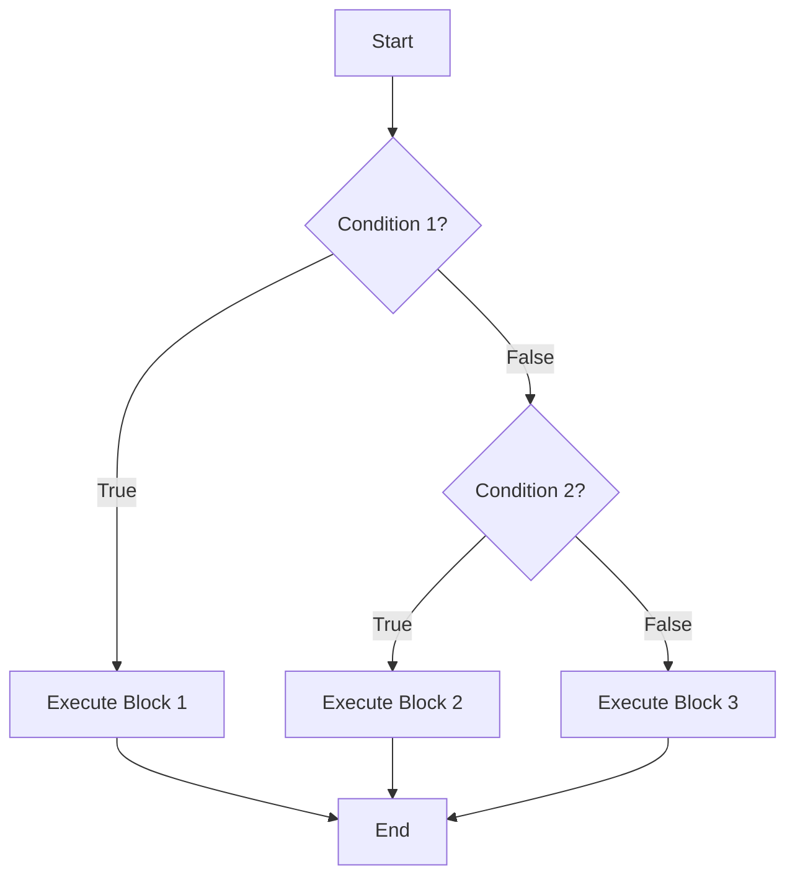
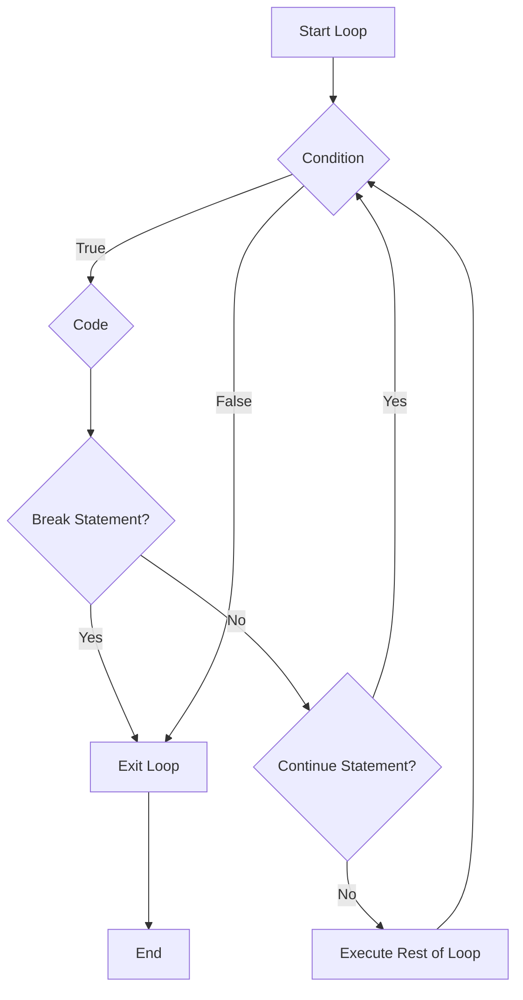

# <span style="color:#e67e22;">What we will learn in this post?</span>
<ul style='list-style-type: none; padding-left: 0;'>
<li><span style='color: #2980b9; font-size: 20px; font-weight: bold;'>👉</span> <span style='color: #2ecc71; font-size: 18px; font-weight: bold;'>If-Else Statements</span></li>
<li><span style='color: #2980b9; font-size: 20px; font-weight: bold;'>👉</span> <span style='color: #2ecc71; font-size: 18px; font-weight: bold;'>Switch Statements</span></li>
<li><span style='color: #2980b9; font-size: 20px; font-weight: bold;'>👉</span> <span style='color: #2ecc71; font-size: 18px; font-weight: bold;'>For Loops</span></li>
<li><span style='color: #2980b9; font-size: 20px; font-weight: bold;'>👉</span> <span style='color: #2ecc71; font-size: 18px; font-weight: bold;'>Range Keyword</span></li>
<li><span style='color: #2980b9; font-size: 20px; font-weight: bold;'>👉</span> <span style='color: #2ecc71; font-size: 18px; font-weight: bold;'>Break and Continue</span></li>
<li><span style='color: #2980b9; font-size: 20px; font-weight: bold;'>👉</span> <span style='color: #2ecc71; font-size: 18px; font-weight: bold;'>Goto and Labels</span></li>
<li><span style='color: #2980b9; font-size: 20px; font-weight: bold;'>👉</span> <span style='color: #2ecc71; font-size: 18px; font-weight: bold;'>Conclusion!</span></li>
</ul>

# <span style="color:#e67e22">Conditional Statements in Go 🚀</span>

Let's dive into how Go handles conditional logic! Go uses `if`, `if-else`, and `if-else-if` statements to control the flow of your program based on conditions. The best part? No parentheses needed around your conditions, but braces `{}` are *mandatory*.

## <span style="color:#2980b9">`if` Statement 🤔</span>

The `if` statement executes a block of code *only* if a condition is `true`.

```go
package main

import "fmt"

func main() {
    age := 25

    if age >= 18 {
        fmt.Println("You are eligible to vote!")
    }
}
```

## <span style="color:#2980b9">`if-else` Statement ⚖️</span>

The `if-else` statement executes one block of code if the condition is `true` and another block if it's `false`.

```go
package main

import "fmt"

func main() {
    number := 7

    if number%2 == 0 {
        fmt.Println("Even number")
    } else {
        fmt.Println("Odd number")
    }
}
```

## <span style="color:#2980b9">`if-else-if` Statement 🪜</span>

The `if-else-if` statement lets you check multiple conditions in sequence.

```go
package main

import "fmt"

func main() {
    score := 75

    if score >= 90 {
        fmt.Println("Excellent!")
    } else if score >= 70 {
        fmt.Println("Good!")
    } else {
        fmt.Println("Needs improvement")
    }
}
```

## <span style="color:#2980b9">Short Statement Syntax 💫</span>

Go provides a neat feature within `if` statements: the _short statement_. This allows you to declare and initialize a variable *within* the `if` condition itself.

```go
package main

import "fmt"

func main() {
    if x := getValue(); x > 0 {
        fmt.Println("Value is positive:", x)
    } else {
		fmt.Println("Value is not positive:", x)
	}
}

func getValue() int {
	return -5 // You can change this to test different values.
}
```

In this example, `x := getValue()` is executed *before* the condition `x > 0` is evaluated. The variable `x` is only scoped to the `if` and `else` blocks.

*   **Key Takeaways:**
    *   Go *requires* braces `{}`.
    *   Go *doesn't need* parentheses around conditions `()`.
    *   The short statement syntax (`if x := ...; condition`) is handy!

<!-- Flowchart for if-else-if -->


More Information Resources:

1.  [Go `if` Statements on Go by Example](https://gobyexample.com/if-else)
2.  [Effective Go - Control Structures](https://go.dev/doc/effective_go#control-structures)


# <span style="color:#e67e22">Switch Statements in Go: A Simple Guide 🚦</span>

Go's `switch` statement is a clean way to handle multiple conditions. Think of it as a more powerful `if-else if-else` chain. The cool part? Go handles `break` for you!

## <span style="color:#2980b9">Types of Switches ✨</span>

Go provides different flavors of `switch` statements:

*   **Expression Switch:** Evaluates an expression and matches its value against `case` values.

```go
grade := "B"
switch grade {
case "A":
    println("Excellent!")
case "B":
    println("Good job!")
default:
    println("Keep trying!")
}
```

*   **Type Switch:** Used to determine the *type* of a variable. Super handy when dealing with `interface{}`.

```go
var i interface{} = 10
switch v := i.(type) {
case int:
    println("It's an integer:", v)
case string:
    println("It's a string:", v)
default:
    println("I don't know what it is!")
}
```

## <span style="color:#8e44ad">`fallthrough` Keyword 🍂</span>

Normally, Go executes only the matching `case` and then *automatically* exits the `switch`. The `fallthrough` keyword makes execution *continue* to the next `case`, regardless of whether it matches.

```go
num := 2
switch num {
case 1:
    println("One")
case 2:
    println("Two")
    fallthrough
case 3:
    println("Three")
default:
    println("Something else")
}
// Output:
// Two
// Three
```

## <span style="color:#2980b9">Implicit `break` Behavior 👍</span>

Go *implicitly* adds a `break` statement after each `case`. You *don't* need to write `break` yourself. This helps prevent accidental fall-through bugs common in other languages.

## <span style="color:#2980b9">Switch with no Expression 🔍</span>

You can also write `switch` statements without an expression. This is similar to using a chain of `if/else if` statements.

```go
age := 25
switch {
case age < 18:
    println("Minor")
case age >= 18 && age < 65:
    println("Adult")
default:
    println("Senior")
}
```

Check out the official Go documentation [here](https://go.dev/tour/flowcontrol/9) for even more details! 📖


# <span style="color:#e67e22">Go's Looping Powerhouse: The `for` Loop 🔄</span>

Go keeps things simple! Instead of multiple loop types like `while` or `do-while` in other languages, Go rocks just *one*: the `for` loop. But don't let that fool you; it's super flexible and can handle all your looping needs.

## <span style="color:#2980b9">Three Flavors of `for` 🍦</span>

### <span style="color:#8e44ad">Traditional Three-Component `for` ⚙️</span>

Like in C or Java, you've got initialization, condition, and post-statement, all in one line.

```go
for i := 0; i < 5; i++ {
    println(i) // Prints 0 to 4
}
```

*   **Use Case:** Looping a specific number of times, like processing elements in a slice or array.
```mermaid
graph LR
    A[Start] --> B{i := 0};
    B --> C{i < 5};
    C -- True --> D{println(i)};
    D --> E{i++};
    E --> C;
    C -- False --> F[End];
```
### <span style="color:#8e44ad">While-Style `for` ⏳</span>

Just a condition, like a `while` loop.

```go
i := 0
for i < 5 {
    println(i)
    i++
}
```

*   **Use Case:** Looping until a condition is met, perhaps reading from a stream or waiting for an event.

### <span style="color:#8e44ad">Infinite Loop ♾️</span>

No condition at all!  Keep going until you `break` out.

```go
for {
    // Do something
    if someCondition {
        break // Exit the loop
    }
}
```

*   **Use Case:** Servers listening for incoming connections, or background processes running continuously.

You can find more information about Go `for` loops in the [official Go documentation](https://go.dev/tour/flowcontrol/1).


# <span style="color:#e67e22">The Magic of `range` in Go 🪄</span>

The `range` keyword in Go is your friendly iterator! It makes looping through data structures *easy peasy*. Think of it as a helper that automatically gives you both the index and the value of each item.

## <span style="color:#2980b9">`range` across Different Data Structures 🧰</span>

Let's explore how `range` works with various data types:

*   **Arrays and Slices:**
    ```go
    numbers := []int{10, 20, 30}
    for index, value := range numbers {
        fmt.Printf("Index: %d, Value: %d\n", index, value)
    }
    ```
    Here, `index` represents the position (0, 1, 2) and `value` is the element at that position.
*   **Maps:**

    ```go
    ages := map[string]int{"Alice": 30, "Bob": 25}
    for name, age := range ages {
        fmt.Printf("Name: %s, Age: %d\n", name, age)
    }
    ```
    `name` becomes the key, and `age` is the value associated with that key.
*   **Strings:**

    ```go
    word := "Hello"
    for index, runeValue := range word {
        fmt.Printf("Index: %d, Rune: %c\n", index, runeValue)
    }
    ```

    *Important Note:* `range` on strings iterates over *runes*, which are Unicode code points (like characters).

*   **Channels:**

    ```go
    ch := make(chan int, 3)
    ch <- 1
    ch <- 2
    close(ch) // important for channels

    for value := range ch {
        fmt.Println("Received:", value)
    }
    ```
    `range` receives values from the channel until it's closed.

## <span style="color:#2980b9">Ignoring Values with `_` 🤫</span>

Sometimes, you only need the index (or the key) and not the value. Use the `_` (underscore) to ignore the value:

```go
for index, _ := range numbers { // ignores the value
    fmt.Println("Index:", index)
}
```

## <span style="color:#2980b9">More info</span>
*   [Go `range` statement](https://go.dev/tour/moretypes/16)

`range` simplifies looping, providing a clean and efficient way to iterate through Go's core data structures!


# <span style="color:#e67e22">Loop Control: Break & Continue</span> 🚀

Let's explore how to fine-tune your loops with `break` and `continue`!

## <span style="color:#2980b9">Breaking Free & Skipping Ahead</span>

*   **`break`:** Think of `break` as an emergency exit. It immediately *terminates* the loop's execution, even if the loop condition is still true.

    ```python
    for i in range(5):
        if i == 3:
            break  # Exit the loop when i is 3
        print(i) # output: 0, 1, 2
    ```

*   **`continue`:** `continue` is like a "fast forward" button. It *skips* the current iteration and jumps to the next one.

    ```python
    for i in range(5):
        if i == 2:
            continue  # Skip iteration when i is 2
        print(i) # output: 0, 1, 3, 4
    ```

## <span style="color:#2980b9">Labeled Break & Continue</span>

*   For nested loops, you can use labels with `break` and `continue` to specify which loop you want to affect.

    ```python
    outer_loop: for i in range(3):
        for j in range(3):
            if i == 1 and j == 1:
                break outer_loop  # Exit the outer loop
            print(f"i={i}, j={j}")
    ```

Here is a flow chart explaining `break` and `continue` statement.


**Practical Example:** Searching in a 2D grid. If we find the target, we want to stop the entire search.

*   Resource: [Python `break` and `continue`](https://www.geeksforgeeks.org/python-break-continue/)


# <span style="color:#e67e22">`goto` Statements and Labels in Go</span> 🚀

`goto` in Go jumps execution to a labeled point within a function. Labels are markers in your code, like `errHandler:` before a block.

## <span style="color:#2980b9">When `goto` Can Be Helpful</span>

*   **Error Handling:** Quickly jump to a central error handling block.

    ```go
    func myFunc() error {
        // ... some code
        if err != nil {
            goto errHandler // Jump to error handling
        }
        // ... more code
    errHandler:
        return fmt.Errorf("error occurred: %w", err)
    }
    ```

*   **Breaking Nested Loops:** Exit multiple nested loops efficiently.

    ```go
    loop:
        for i := 0; i < 3; i++ {
            for j := 0; j < 3; j++ {
                if i*j > 5 {
                    goto loop // Exit both loops
                }
            }
        }
    ```

## <span style="color:#2980b9">Why Use Sparingly?</span>

`goto` can make code harder to read and understand. Too many `goto` statements can create what is commonly referred to as "spaghetti code". This makes debugging and maintaining the code much more difficult.

*   It complicates control flow.
*   It reduces code readability.

**Best Practice:** Prefer structured control flow (if/else, loops, functions). Use `goto` only when necessary and with extreme caution.

For more info you can check the official documentation on [Go's control flow](https://go.dev/tour/flowcontrol/1).


Okay, here are a few options for your conclusion statement, formatted as requested:

**Option 1:**

<h1><span style='color:#e67e22'>Conclusion</span></h1>

Well, that's a wrap! 🎉 I hope you enjoyed reading this post and found it helpful. Now it's your turn! What are your thoughts? Any tips or tricks you'd like to share? Let me know in the comments below! 👇 I'm really looking forward to hearing from you. 😊

**Option 2:**

<h1><span style='color:#e67e22'>Conclusion</span></h1>

And there you have it! ✨ I'm curious to know if you have any experiences related to this topic. Or maybe some suggestions for improvement? 🧐 Don't be shy - share your insights in the comment section! I'm always open to new ideas and learning from you all. Thanks for reading! 👍

**Option 3:**

<h1><span style='color:#e67e22'>Conclusion</span></h1>

Alright, folks, we've reached the end! 🥳 But the conversation doesn't have to stop here! What are your takes on this? Did I miss anything important? 🤔 Drop a comment below and let's chat! I value your feedback and suggestions. Happy commenting! ✍️


