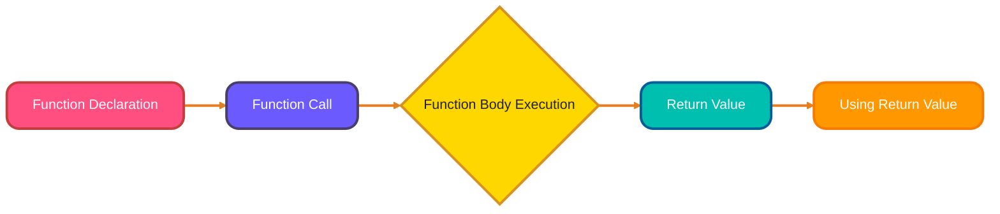
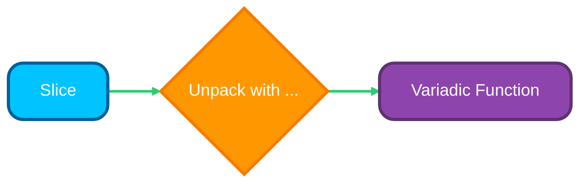

# <span style="color:#e67e22;">What we will learn in this post?</span>

<ul style='list-style-type: none; padding-left: 0;'>
<li><span style='color: #2980b9; font-size: 20px; font-weight: bold;'>👉</span> <span style='color: #2ecc71; font-size: 18px; font-weight: bold;'>Function Basics</span></li>
<li><span style='color: #2980b9; font-size: 20px; font-weight: bold;'>👉</span> <span style='color: #2ecc71; font-size: 18px; font-weight: bold;'>Multiple Return Values</span></li>
<li><span style='color: #2980b9; font-size: 20px; font-weight: bold;'>👉</span> <span style='color: #2ecc71; font-size: 18px; font-weight: bold;'>Named Return Values</span></li>
<li><span style='color: #2980b9; font-size: 20px; font-weight: bold;'>👉</span> <span style='color: #2ecc71; font-size: 18px; font-weight: bold;'>Variadic Functions</span></li>
<li><span style='color: #2980b9; font-size: 20px; font-weight: bold;'>👉</span> <span style='color: #2ecc71; font-size: 18px; font-weight: bold;'>Anonymous Functions and Closures</span></li>
<li><span style='color: #2980b9; font-size: 20px; font-weight: bold;'>👉</span> <span style='color: #2ecc71; font-size: 18px; font-weight: bold;'>Higher-Order Functions</span></li>
<li><span style='color: #2980b9; font-size: 20px; font-weight: bold;'>👉</span> <span style='color: #2ecc71; font-size: 18px; font-weight: bold;'>Defer Statement</span></li>
<li><span style='color: #2980b9; font-size: 20px; font-weight: bold;'>👉</span> <span style='color: #2ecc71; font-size: 18px; font-weight: bold;'>Conclusion!</span></li>
</ul>

# <span style="color:#e67e22">Go Functions: Declaring & Calling 📞</span>

Go uses functions to organize code. Here's how you declare and call them:

## <span style="color:#2980b9">Declaring a Function</span>

A function's `signature` defines its name, parameters, and return values.

```go
func functionName(parameterName type) returnType {
  // Function body (code)
  return returnValue
}
```

- **`func`**: Keyword to declare a function.
- **`functionName`**: The function's name.
- **`(parameterName type)`**: Parameters with their types.
- **`returnType`**: Type of the value returned. If no value is returned, no return type is needed.

### <span style="color:#8e44ad">Examples</span>

- **Single Parameter:**

```go
func greet(name string) string {
  return "Hello, " + name + "!"
}
```

- **Multiple Parameters:**

```go
func add(x int, y int) int {
  return x + y
}
```

- **Multiple Return Values:**

```go
func divide(numerator, denominator int) (int, error) {
 if denominator == 0 {
  return 0, fmt.Errorf("cannot divide by zero") //error handling
 }
 return numerator / denominator, nil
}
```

**Resources**:

- [Go by Example: Functions](https://gobyexample.com/functions)

## <span style="color:#2980b9">Calling a Function</span>

Simply use the function's name followed by parentheses `()`, providing the required arguments.

```go
package main

import "fmt"

func main() {
  message := greet("Alice")
  sum := add(5, 3)
  fmt.Println(message) // Output: Hello, Alice!
  fmt.Println(sum)      // Output: 8
}
```

- Make sure the number and type of arguments matches function definition.
- The return value of a function can be assigned to a variable or used directly.



# <span style="color:#e67e22">Go's Multiple Returns and Error Handling 🎁</span>

Go offers a neat feature: functions can return _more than one_ value. This is super handy, especially for error handling.

## <span style="color:#2980b9">The `(value, error)` Pattern 🤔</span>

A common Go practice is to return both the expected result and an error. If everything goes smoothly, the error is `nil`. If something goes wrong, the error holds details about the problem.

```go
func divide(a, b int) (int, error) {
    if b == 0 {
        return 0, fmt.Errorf("cannot divide by zero")
    }
    return a / b, nil
}
```

## <span style="color:#8e44ad">Using and Ignoring Returns 🚀</span>

To use multiple returns:

```go
result, err := divide(10, 2)
if err != nil {
    fmt.Println("Error:", err)
    return
}
fmt.Println("Result:", result)
```

Sometimes, you might only care about the error. Use the `_` (underscore) to _ignore_ a value:

```go
_, err := divide(5, 0) //Ignoring result
if err != nil{
    fmt.Println("Error Occurred")
}
```

The `_` tells Go you're deliberately not using that returned value.

For more info on error handling checkout - [Effective Go on Error Handling](https://go.dev/tour/methods/20)

# <span style="color:#e67e22">Named Return Values in Go 🎁</span>

Named return values in Go allow you to give meaningful names to the values your function returns, making your code easier to read and maintain. This feature is especially useful for functions that return multiple values, as it clarifies their purpose and usage.

Go offers a feature called _named return values_ that can boost code clarity... sometimes.

### <span style="color:#8e44ad">Practical Example: Named Return Values</span>

Suppose you want to parse a configuration string and return both the parsed result and an error. Named return values make it clear what each returned value means:

```go
func parseConfig(input string) (config map[string]string, err error) {
  config = make(map[string]string)
  if input == "" {
    err = fmt.Errorf("input is empty")
    return // naked return
  }
  // Example: parse key=value pairs separated by commas
  pairs := strings.Split(input, ",")
  for _, pair := range pairs {
    kv := strings.Split(pair, "=")
    if len(kv) == 2 {
      config[kv[0]] = kv[1]
    }
  }
  return // naked return
}

// Usage
cfg, err := parseConfig("host=localhost,port=8080")
if err != nil {
  fmt.Println("Error:", err)
} else {
  fmt.Println("Config:", cfg)
}
```

## <span style="color:#2980b9">Pre-Declared Variables & Naked Returns 🤯</span>

Essentially, when you name return values in a function signature (e.g., `func myFunc() (result int, err error)`), Go automatically declares those variables for you within the function's scope. You can then assign to them as you would any other variable. A _naked return_ is a `return` statement _without specifying_ what to return. It implicitly returns the current values of the named return values.

```go
func add(a, b int) (sum int) {
    sum = a + b
    return // Naked return!  'sum' is returned.
}
```

## <span style="color:#2980b9">Readability: Good vs. Bad 🤔</span>

Named returns can improve readability in **short, simple functions** where the return logic is obvious.

- ✅ Helps understand the function's purpose directly from the signature.
- ✅ Reduces boilerplate in straightforward cases.

However, they can decrease readability in **longer, more complex functions**.

- ❌ Obscures where the return values are actually set.
- ❌ Can lead to confusion if return values are modified in multiple places.

Consider this example:

```go
func divide(a, b int) (quotient int, remainder int, err error) {
    if b == 0 {
        err = fmt.Errorf("division by zero")
        return //naked return
    }
    quotient = a / b
    remainder = a % b
    return //naked return
}

```

In this case, using named returns and naked return is fine.

💡 **Rule of Thumb:** If your function is more than a handful of lines long, explicitly returning the values might be clearer.

- [A tour of go: Naked Return Statements](https://go.dev/tour/functions/7)
- [Effective Go: Named Result Parameters](https://go.dev/doc/effective_go#named-results)

# <span style="color:#e67e22">Variadic Functions in Go ➕</span>

Variadic functions are a powerful tool in Go that let you write flexible code capable of handling any number of arguments. This is particularly useful for functions like `fmt.Println` or mathematical operations where the number of inputs can vary.

### <span style="color:#8e44ad">Practical Example: Variadic Function</span>

Here's a custom `Sum` function that adds any number of integers:

```go
func Sum(nums ...int) int {
  total := 0
  for _, n := range nums {
    total += n
  }
  return total
}

// Usage
fmt.Println(Sum(1, 2, 3))        // Output: 6
fmt.Println(Sum(10, 20, 30, 40)) // Output: 100
```

Variadic functions in Go are functions that can accept a _variable number_ of arguments. They are declared using the `...` syntax before the type of the last parameter.

## <span style="color:#2980b9">Understanding the `...`</span>

The `...` essentially transforms the last parameter into a slice of that type. Inside the function, you treat it like a normal slice. Consider `fmt.Println`, a built-in variadic function! 🚀

```go
package main

import "fmt"

func main() {
  fmt.Println("Hello", "World", "!") // Multiple arguments
}
```

## <span style="color:#2980b9">Passing Slices with `...`</span>

If you _already_ have a slice and want to pass it as arguments to a variadic function, use the `...` operator _after_ the slice name. This _unpacks_ the slice elements and passes them as individual arguments.

```go
package main

import "fmt"

func main() {
  mySlice := []string{"Go", "is", "fun!"}
  fmt.Println(mySlice...) // Unpacking the slice
}
```

- **Key Takeaway:** Without the `...`, `mySlice` would be passed as a _single_ argument (the slice itself), which isn't what `fmt.Println` expects! ⚠️ The `...` tells the function to treat each slice element as a separate argument.

- **Note:** It's a common mistake to forget the `...` when trying to pass a slice to a variadic function.

- **Resource:** [Go by Example: Variadic Functions](https://gobyexample.com/variadic-functions) provides further examples. 📚



# <span style="color:#e67e22">Anonymous Functions & Closures: A Simple Guide</span> 🚀

Anonymous functions and closures are essential concepts in Go for writing concise, modular, and expressive code. They allow you to define functions on the fly and capture variables from their surrounding scope, which is especially useful for callbacks and concurrent programming.

### <span style="color:#8e44ad">Practical Example: Closure for Filtering</span>

Here's how you can use a closure to filter even numbers from a slice:

```go
func Filter(nums []int, test func(int) bool) []int {
  var result []int
  for _, n := range nums {
    if test(n) {
      result = append(result, n)
    }
  }
  return result
}

// Usage with an anonymous function (closure)
evens := Filter([]int{1, 2, 3, 4, 5, 6}, func(n int) bool {
  return n%2 == 0
})
fmt.Println(evens) // Output: [2 4 6]
```

Let's explore anonymous functions and closures in a straightforward way!

## <span style="color:#2980b9">What are Anonymous Functions?</span>

Anonymous functions, also called _function literals_, are functions without a name. Imagine them as little code blocks you can use directly. They're handy for short tasks.

```javascript
// Example
const greet = function (name) {
  return "Hello, " + name + "!";
};

console.log(greet("Alice")); // Output: Hello, Alice!
```

We've assigned an anonymous function to the variable `greet`.

## <span style="color:#2980b9">Closures: Remembering the Outside World 🏡</span>

Closures are like functions that _remember_ variables from their surrounding environment (the "outer scope"), even after that outer environment is gone.

### <span style="color:#8e44ad">Closure Example</span>

```javascript
function outerFunction(outerVar) {
  return function innerFunction(innerVar) {
    return outerVar + innerVar;
  };
}

const add5 = outerFunction(5); // `outerVar` is now 'captured' as 5

console.log(add5(10)); // Output: 15 (5 + 10)
```

`innerFunction` _closes over_ `outerVar` (which is 5), remembering it even after `outerFunction` has finished running. This "memory" is the closure.

- **Key Points:** Closures let functions "carry" information.
- **Use Cases:** Event handlers, creating private variables (modules).

**Practical use cases:**

- **Event Handlers:** Use a closure to capture a specific item's ID when setting up a click event.
- **Counters:** Implement a counter where the variable can not be easily accessed directly.

**Resource Links:**

- [MDN Web Docs on Closures](https://developer.mozilla.org/en-US/docs/Web/JavaScript/Closures)
- [W3Schools Javascript Closures](https://www.w3schools.com/js/js_function_closures.asp)

# <span style="color:#e67e22">Higher-Order Functions 🚀</span>

Higher-order functions are a key feature in Go and many modern languages, enabling you to treat functions as values. This lets you pass functions as arguments, return them from other functions, and build more abstract, reusable code patterns.

### <span style="color:#8e44ad">Practical Example: Higher-Order Function</span>

Here's a custom `Map` function that applies a given function to each element of a slice:

```go
func Map(nums []int, fn func(int) int) []int {
  var result []int
  for _, n := range nums {
    result = append(result, fn(n))
  }
  return result
}

// Usage: square each number
squared := Map([]int{1, 2, 3, 4}, func(n int) int {
  return n * n
})
fmt.Println(squared) // Output: [1 4 9 16]
```

Higher-order functions are like super-powered functions! They can do two cool things:

- Take other functions as _input_ (parameters).
- _Return_ a function as their output.

## <span style="color:#2980b9">Function Types</span>

Think of functions as having types too! A function's type describes what it takes as input (parameters) and what it gives back as output (return value). For example, a function that takes a number and returns text would have a type like `(number) -> text`.

## <span style="color:#2980b9">Examples with Code 💻</span>

Here are some common patterns:

- **`map`**: Applies a function to each item in a list. 🗺️

  ```python
  numbers = [1, 2, 3]
  squared = list(map(lambda x: x**2, numbers)) # Output: [1, 4, 9]
  print(squared)
  ```

- **`filter`**: Keeps only the items that pass a test (defined by a function). 🔍

  ```python
  numbers = [1, 2, 3, 4, 5]
  even = list(filter(lambda x: x % 2 == 0, numbers)) # Output: [2, 4]
  print(even)
  ```

- **`reduce`**: Combines items in a list into a single result. ⚙️ (Needs `functools` in Python)

      ```python
      from functools import reduce

      numbers = [1, 2, 3, 4]
      sum_all = reduce(lambda x, y: x + y, numbers) # Output: 10
      print(sum_all)
      ```

  _Resource: [Python Higher-Order Functions](https://realpython.com/python-functional-programming/)_

These functions help you write cleaner and more reusable code!

# <span style="color:#e67e22">`defer` Explained ⏰</span>

The `defer` keyword in Go is a powerful feature for resource management and error handling. It ensures that cleanup actions—like closing files or unlocking mutexes—are performed automatically when a function exits, making your code safer and more reliable.

`defer` is a cool Go keyword that lets you schedule a function call to run _after_ the surrounding function finishes. Think of it as saying, "Hey, do this later, _no matter what_ happens."

## <span style="color:#2980b9">How `defer` Works</span>

- **LIFO (Last-In, First-Out):** If you have multiple `defer` statements, they'll run in reverse order of how you declared them.

  ```go
  defer fmt.Println("Third")
  defer fmt.Println("Second")
  defer fmt.Println("First")
  //Output:
  //First
  //Second
  //Third
  ```

- **Guaranteed Execution:** Even if your function panics (Go's version of an error), `defer` will still run.

## <span style="color:#2980b9">Common Uses ✨</span>

- **Closing Files:**

  ```go
  file, err := os.Open("myfile.txt")
  if err != nil {
      log.Fatal(err)
  }
  defer file.Close() //File will always close even with error
  // ... use the file
  ```

- **Unlocking Mutexes (for concurrency):**

  ```go
  mutex.Lock()
  defer mutex.Unlock() //Always unlocks the thread
  // ... access shared data
  ```

## <span style="color:#2980b9">`defer` with Closures 📦</span>

You can use `defer` with anonymous functions (closures) which can be really handy.

```go
func someFunc() {
    x := 10
    defer func() {
        fmt.Println("Value of x:", x) //Captures and prints value of x.
    }()
    x = 20
    fmt.Println("Inside func x:", x)
}
//Output
//Inside func x: 20
//Value of x: 20
```

`defer` ensures resources are cleaned up, making your code more robust! It's a key part of writing good Go. Check out the official [Go documentation](https://go.dev/tour/flowcontrol/12) for more details.

<h1><span style='color:#e67e22'>Conclusion</span></h1>

So, what do you think? 🤔 Did anything resonate with you? I'd absolutely love to hear your thoughts, comments, or suggestions down below! Let's chat! 💬👇
