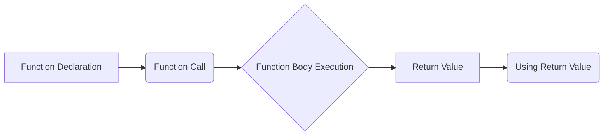
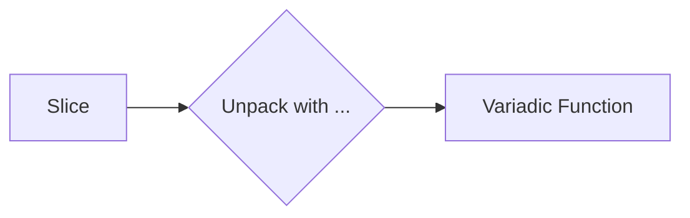

# <span style="color:#e67e22;">What we will learn in this post?</span>
<ul style='list-style-type: none; padding-left: 0;'>
<li><span style='color: #2980b9; font-size: 20px; font-weight: bold;'>👉</span> <span style='color: #2ecc71; font-size: 18px; font-weight: bold;'>Function Basics</span></li>
<li><span style='color: #2980b9; font-size: 20px; font-weight: bold;'>👉</span> <span style='color: #2ecc71; font-size: 18px; font-weight: bold;'>Multiple Return Values</span></li>
<li><span style='color: #2980b9; font-size: 20px; font-weight: bold;'>👉</span> <span style='color: #2ecc71; font-size: 18px; font-weight: bold;'>Named Return Values</span></li>
<li><span style='color: #2980b9; font-size: 20px; font-weight: bold;'>👉</span> <span style='color: #2ecc71; font-size: 18px; font-weight: bold;'>Variadic Functions</span></li>
<li><span style='color: #2980b9; font-size: 20px; font-weight: bold;'>👉</span> <span style='color: #2ecc71; font-size: 18px; font-weight: bold;'>Anonymous Functions and Closures</span></li>
<li><span style='color: #2980b9; font-size: 20px; font-weight: bold;'>👉</span> <span style='color: #2ecc71; font-size: 18px; font-weight: bold;'>Higher-Order Functions</span></li>
<li><span style='color: #2980b9; font-size: 20px; font-weight: bold;'>👉</span> <span style='color: #2ecc71; font-size: 18px; font-weight: bold;'>Defer Statement</span></li>
<li><span style='color: #2980b9; font-size: 20px; font-weight: bold;'>👉</span> <span style='color: #2ecc71; font-size: 18px; font-weight: bold;'>Conclusion!</span></li>
</ul>

# <span style="color:#e67e22">Go Functions: Declaring & Calling 📞</span>

Go uses functions to organize code. Here's how you declare and call them:

## <span style="color:#2980b9">Declaring a Function</span>

A function's `signature` defines its name, parameters, and return values.

```go
func functionName(parameterName type) returnType {
  // Function body (code)
  return returnValue
}
```
*   **`func`**: Keyword to declare a function.
*   **`functionName`**: The function's name.
*   **`(parameterName type)`**: Parameters with their types.
*   **`returnType`**: Type of the value returned. If no value is returned, no return type is needed.

### <span style="color:#8e44ad">Examples</span>

*   **Single Parameter:**

```go
func greet(name string) string {
  return "Hello, " + name + "!"
}
```

*   **Multiple Parameters:**

```go
func add(x int, y int) int {
  return x + y
}
```

*   **Multiple Return Values:**

```go
func divide(numerator, denominator int) (int, error) {
 if denominator == 0 {
  return 0, fmt.Errorf("cannot divide by zero") //error handling
 }
 return numerator / denominator, nil
}
```
**Resources**:
*   [Go by Example: Functions](https://gobyexample.com/functions)

## <span style="color:#2980b9">Calling a Function</span>

Simply use the function's name followed by parentheses `()`, providing the required arguments.

```go
package main

import "fmt"

func main() {
  message := greet("Alice")
  sum := add(5, 3)
  fmt.Println(message) // Output: Hello, Alice!
  fmt.Println(sum)      // Output: 8
}
```

*   Make sure the number and type of arguments matches function definition.
*   The return value of a function can be assigned to a variable or used directly.




# <span style="color:#e67e22">Go's Multiple Returns and Error Handling 🎁</span>

Go offers a neat feature: functions can return *more than one* value. This is super handy, especially for error handling.

## <span style="color:#2980b9">The `(value, error)` Pattern 🤔</span>

A common Go practice is to return both the expected result and an error. If everything goes smoothly, the error is `nil`. If something goes wrong, the error holds details about the problem.

```go
func divide(a, b int) (int, error) {
    if b == 0 {
        return 0, fmt.Errorf("cannot divide by zero")
    }
    return a / b, nil
}
```

## <span style="color:#8e44ad">Using and Ignoring Returns 🚀</span>

To use multiple returns:

```go
result, err := divide(10, 2)
if err != nil {
    fmt.Println("Error:", err)
    return
}
fmt.Println("Result:", result)
```

Sometimes, you might only care about the error. Use the `_` (underscore) to *ignore* a value:

```go
_, err := divide(5, 0) //Ignoring result
if err != nil{
    fmt.Println("Error Occurred")
}
```

The `_` tells Go you're deliberately not using that returned value.

For more info on error handling checkout - [Effective Go on Error Handling](https://go.dev/tour/methods/20)


# <span style="color:#e67e22">Named Return Values in Go 🎁</span>

Go offers a feature called *named return values* that can boost code clarity... sometimes.

## <span style="color:#2980b9">Pre-Declared Variables & Naked Returns 🤯</span>

Essentially, when you name return values in a function signature (e.g., `func myFunc() (result int, err error)`), Go automatically declares those variables for you within the function's scope.  You can then assign to them as you would any other variable. A _naked return_ is a `return` statement *without specifying* what to return.  It implicitly returns the current values of the named return values.

```go
func add(a, b int) (sum int) {
    sum = a + b
    return // Naked return!  'sum' is returned.
}
```

## <span style="color:#2980b9">Readability: Good vs. Bad 🤔</span>

Named returns can improve readability in **short, simple functions** where the return logic is obvious.

*   ✅ Helps understand the function's purpose directly from the signature.
*   ✅ Reduces boilerplate in straightforward cases.

However, they can decrease readability in **longer, more complex functions**.

*   ❌ Obscures where the return values are actually set.
*   ❌ Can lead to confusion if return values are modified in multiple places.

Consider this example:

```go
func divide(a, b int) (quotient int, remainder int, err error) {
    if b == 0 {
        err = fmt.Errorf("division by zero")
        return //naked return
    }
    quotient = a / b
    remainder = a % b
    return //naked return
}

```

In this case, using named returns and naked return is fine.

💡 **Rule of Thumb:** If your function is more than a handful of lines long, explicitly returning the values might be clearer.

*   [A tour of go: Naked Return Statements](https://go.dev/tour/functions/7)
*   [Effective Go: Named Result Parameters](https://go.dev/doc/effective_go#named-results)


# <span style="color:#e67e22">Variadic Functions in Go ➕</span>

Variadic functions in Go are functions that can accept a *variable number* of arguments. They are declared using the `...` syntax before the type of the last parameter.

## <span style="color:#2980b9">Understanding the `...`</span>

The `...` essentially transforms the last parameter into a slice of that type. Inside the function, you treat it like a normal slice. Consider `fmt.Println`, a built-in variadic function! 🚀

```go
package main

import "fmt"

func main() {
  fmt.Println("Hello", "World", "!") // Multiple arguments
}
```

## <span style="color:#2980b9">Passing Slices with `...`</span>

If you *already* have a slice and want to pass it as arguments to a variadic function, use the `...` operator *after* the slice name. This *unpacks* the slice elements and passes them as individual arguments.

```go
package main

import "fmt"

func main() {
  mySlice := []string{"Go", "is", "fun!"}
  fmt.Println(mySlice...) // Unpacking the slice
}
```

*   **Key Takeaway:** Without the `...`, `mySlice` would be passed as a *single* argument (the slice itself), which isn't what `fmt.Println` expects! ⚠️ The `...` tells the function to treat each slice element as a separate argument.

*   **Note:** It's a common mistake to forget the `...` when trying to pass a slice to a variadic function.

*  **Resource:** [Go by Example: Variadic Functions](https://gobyexample.com/variadic-functions) provides further examples. 📚




# <span style="color:#e67e22">Anonymous Functions & Closures: A Simple Guide</span> 🚀

Let's explore anonymous functions and closures in a straightforward way!

## <span style="color:#2980b9">What are Anonymous Functions?</span>

Anonymous functions, also called *function literals*, are functions without a name. Imagine them as little code blocks you can use directly. They're handy for short tasks.

```javascript
// Example
const greet = function(name) {
  return "Hello, " + name + "!";
};

console.log(greet("Alice")); // Output: Hello, Alice!
```

We've assigned an anonymous function to the variable `greet`.

## <span style="color:#2980b9">Closures: Remembering the Outside World 🏡</span>

Closures are like functions that *remember* variables from their surrounding environment (the "outer scope"), even after that outer environment is gone.

### <span style="color:#8e44ad">Closure Example</span>

```javascript
function outerFunction(outerVar) {
  return function innerFunction(innerVar) {
    return outerVar + innerVar;
  };
}

const add5 = outerFunction(5); // `outerVar` is now 'captured' as 5

console.log(add5(10)); // Output: 15 (5 + 10)
```

`innerFunction` *closes over* `outerVar` (which is 5), remembering it even after `outerFunction` has finished running. This "memory" is the closure.

*   **Key Points:** Closures let functions "carry" information.
*   **Use Cases:** Event handlers, creating private variables (modules).

**Practical use cases:**

*   **Event Handlers:** Use a closure to capture a specific item's ID when setting up a click event.
*   **Counters:** Implement a counter where the variable can not be easily accessed directly.

**Resource Links:**

*   [MDN Web Docs on Closures](https://developer.mozilla.org/en-US/docs/Web/JavaScript/Closures)
*   [W3Schools Javascript Closures](https://www.w3schools.com/js/js_function_closures.asp)


# <span style="color:#e67e22">Higher-Order Functions 🚀</span>

Higher-order functions are like super-powered functions! They can do two cool things:

*   Take other functions as *input* (parameters).
*   *Return* a function as their output.

## <span style="color:#2980b9">Function Types</span>

Think of functions as having types too!  A function's type describes what it takes as input (parameters) and what it gives back as output (return value).  For example, a function that takes a number and returns text would have a type like `(number) -> text`.

## <span style="color:#2980b9">Examples with Code 💻</span>

Here are some common patterns:

*   **`map`**:  Applies a function to each item in a list. 🗺️

    ```python
    numbers = [1, 2, 3]
    squared = list(map(lambda x: x**2, numbers)) # Output: [1, 4, 9]
    print(squared)
    ```

*   **`filter`**:  Keeps only the items that pass a test (defined by a function). 🔍

    ```python
    numbers = [1, 2, 3, 4, 5]
    even = list(filter(lambda x: x % 2 == 0, numbers)) # Output: [2, 4]
    print(even)
    ```

*   **`reduce`**:  Combines items in a list into a single result. ⚙️ (Needs `functools` in Python)

    ```python
    from functools import reduce

    numbers = [1, 2, 3, 4]
    sum_all = reduce(lambda x, y: x + y, numbers) # Output: 10
    print(sum_all)
    ```
*Resource: [Python Higher-Order Functions](https://realpython.com/python-functional-programming/)*

These functions help you write cleaner and more reusable code!


# <span style="color:#e67e22">`defer` Explained ⏰</span>

`defer` is a cool Go keyword that lets you schedule a function call to run *after* the surrounding function finishes. Think of it as saying, "Hey, do this later, *no matter what* happens."

## <span style="color:#2980b9">How `defer` Works</span>

*   **LIFO (Last-In, First-Out):** If you have multiple `defer` statements, they'll run in reverse order of how you declared them.
    ```go
    defer fmt.Println("Third")
    defer fmt.Println("Second")
    defer fmt.Println("First")
    //Output:
    //First
    //Second
    //Third
    ```

*   **Guaranteed Execution:** Even if your function panics (Go's version of an error), `defer` will still run.

## <span style="color:#2980b9">Common Uses ✨</span>

*   **Closing Files:**

    ```go
    file, err := os.Open("myfile.txt")
    if err != nil {
        log.Fatal(err)
    }
    defer file.Close() //File will always close even with error
    // ... use the file
    ```

*   **Unlocking Mutexes (for concurrency):**

    ```go
    mutex.Lock()
    defer mutex.Unlock() //Always unlocks the thread
    // ... access shared data
    ```

## <span style="color:#2980b9">`defer` with Closures 📦</span>

You can use `defer` with anonymous functions (closures) which can be really handy.

```go
func someFunc() {
    x := 10
    defer func() {
        fmt.Println("Value of x:", x) //Captures and prints value of x.
    }()
    x = 20
    fmt.Println("Inside func x:", x)
}
//Output
//Inside func x: 20
//Value of x: 20
```

`defer` ensures resources are cleaned up, making your code more robust! It's a key part of writing good Go. Check out the official [Go documentation](https://go.dev/tour/flowcontrol/12) for more details.


Here are a few options:

**Option 1:**

```html
<h1><span style='color:#e67e22'>Conclusion</span></h1>

So, what do you think? 🤔 Did anything resonate with you? I'd absolutely love to hear your thoughts, comments, or suggestions down below! Let's chat! 💬👇
```

**Option 2:**

```html
<h1><span style='color:#e67e22'>Conclusion</span></h1>

Alright, that's a wrap! 🎬 I'm super curious to know what *you* think! Leave your comments, feedback, or suggestions below. Let's get the conversation going! 🗣️👇
```

**Option 3:**

```html
<h1><span style='color:#e67e22'>Conclusion</span></h1>

And there you have it! 🎉 I'm eager to know if you enjoyed this article and what your takeaway is! Please share your thoughts, any feedback, or suggestions in the comments! 👇 Let's connect! 🤝
```

**Option 4:**

```html
<h1><span style='color:#e67e22'>Conclusion</span></h1>

Well, that's my take on it! 🙋‍♀️ What are your experiences or perspectives? Share them in the comments below! I'm always looking to learn and hear from you all. Let's talk! 👇😊
```

**Option 5:**

```html
<h1><span style='color:#e67e22'>Conclusion</span></h1>

Hope you found this helpful! 🙏 Now it's your turn! What are your thoughts? Any feedback or suggestions are greatly appreciated. Drop them in the comments! 👇 Let's build a community! 🏡
```


