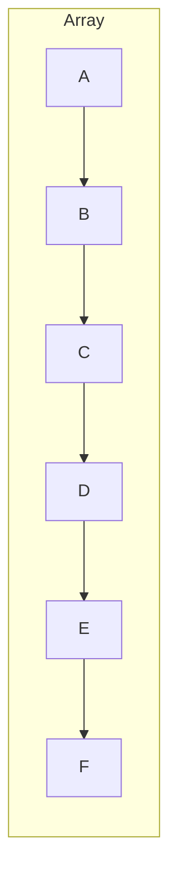
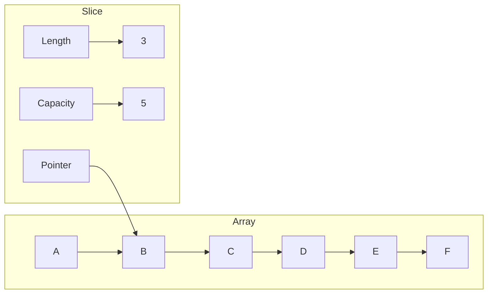

# <span style="color:#e67e22;">What we will learn in this post?</span>
<ul style='list-style-type: none; padding-left: 0;'>
<li><span style='color: #2980b9; font-size: 20px; font-weight: bold;'>👉</span> <span style='color: #2ecc71; font-size: 18px; font-weight: bold;'>Arrays in Go</span></li>
<li><span style='color: #2980b9; font-size: 20px; font-weight: bold;'>👉</span> <span style='color: #2ecc71; font-size: 18px; font-weight: bold;'>Slices Fundamentals</span></li>
<li><span style='color: #2980b9; font-size: 20px; font-weight: bold;'>👉</span> <span style='color: #2ecc71; font-size: 18px; font-weight: bold;'>Creating Slices</span></li>
<li><span style='color: #2980b9; font-size: 20px; font-weight: bold;'>👉</span> <span style='color: #2ecc71; font-size: 18px; font-weight: bold;'>Slice Operations</span></li>
<li><span style='color: #2980b9; font-size: 20px; font-weight: bold;'>👉</span> <span style='color: #2ecc71; font-size: 18px; font-weight: bold;'>Slice Internals</span></li>
<li><span style='color: #2980b9; font-size: 20px; font-weight: bold;'>👉</span> <span style='color: #2ecc71; font-size: 18px; font-weight: bold;'>Multi-dimensional Slices</span></li>
<li><span style='color: #2980b9; font-size: 20px; font-weight: bold;'>👉</span> <span style='color: #2ecc71; font-size: 18px; font-weight: bold;'>Conclusion!</span></li>
</ul>

# <span style="color:#e67e22">Go Arrays 🚀</span>

Arrays in Go are like fixed-size containers for storing elements of the *same type*. Think of them as a row of boxes, where each box holds a value.

## <span style="color:#2980b9">Declaring and Initializing</span>

You declare an array by specifying its size and the data type it will hold. For example:

```go
var numbers [5]int // An array of 5 integers
```

You can initialize it when declaring:

```go
numbers := [5]int{10, 20, 30, 40, 50}
```

Or, you can let Go infer the size:

```go
numbers := [...]int{10, 20, 30, 40, 50} // Size is determined by the number of elements
```

## <span style="color:#2980b9">Zero Values and Accessing Elements</span>

If you don't initialize the array, elements are assigned their *zero value* (0 for integers, "" for strings, etc.).

```go
var names [3]string // Defaults to ["", "", ""]
```

Access elements using their index (starting from 0):

```go
fmt.Println(numbers[0]) // Output: 10
numbers[1] = 25       // Changing the value at index 1
```

## <span style="color:#2980b9">Key Points to Remember 🤔</span>

*   **Fixed Size:** Once declared, the size of an array *cannot be changed*.
*   **Value Type:** When you assign one array to another, a *copy* is created.  Changes to the new array won't affect the original.

```go
arr1 := [2]int{1, 2}
arr2 := arr1 // arr2 is a copy of arr1
arr2[0] = 5 // Modifying arr2
fmt.Println(arr1, arr2) // Output: [1 2] [5 2]
```

> To learn more:
>
> *   [Go Arrays Tutorial](https://www.tutorialspoint.com/go/go_arrays.htm)
> *   [Arrays in Go - GeeksforGeeks](https://www.geeksforgeeks.org/arrays-in-go/)


# <span style="color:#e67e22">Slices: Your Dynamic Array Windows in Go 🪟</span>

Slices in Go are like **flexible windows** into an underlying array. They let you work with portions of an array without copying the data. Think of them as a *dynamic view* 😮.

## <span style="color:#2980b9">Slices vs. Arrays: What's the Difference? 🧐</span>

Here's the lowdown:

*   **Arrays:**
    *   Fixed size. You define the size when you declare them, and it *can't change*.
    *   Value type. When you assign one array to another, you get a completely new copy.

*   **Slices:**
    *   *Dynamic size*. Slices can grow or shrink, making them more adaptable.
    *   Reference type. Slices don't store the data directly; they hold a pointer to a section of an underlying array. Assigning a slice copies the pointer, not the data itself.

## <span style="color:#2980b9">Why Slices Rule 👑</span>

Slices are generally preferred in Go because of their *flexibility*. You rarely use arrays directly. Check out this resource for more details: [Go Slices: usage and internals](https://go.dev/blog/slices).

```go
// Array (fixed size)
var myArray [3]int = [3]int{1, 2, 3}

// Slice (dynamic size)
mySlice := []int{1, 2, 3} // Creates a slice backed by an anonymous array

mySlice = append(mySlice, 4) // Adding an element to the slice
println(len(mySlice))
```

Slices make it easier to work with collections of data that change over time ⏱️.


Let's explore how to create slices in Go! 🚀

# <span style="color:#e67e22">Creating Slices in Go</span>

Slices are dynamic arrays in Go, offering flexibility. Here are the common ways to create them:

## <span style="color:#2980b9">Slice Literals</span>

You can directly define a slice with initial values.

```go
numbers := []int{1, 2, 3, 4, 5} // Creates a slice with the specified values.
names := []string{"Alice", "Bob", "Charlie"} // Creates a string slice
```

## <span style="color:#2980b9">Using the `make` Function</span>

The `make` function is used to create a slice with a specified length and capacity. `make([]T, len, cap)`

```go
mySlice := make([]int, 5, 10) // Creates a slice of ints, length 5, capacity 10.
// Resources: [https://go.dev/ref/spec#Making_slices_maps_and_channels](https://go.dev/ref/spec#Making_slices_maps_and_channels)
```

## <span style="color:#2980b9">Slicing Arrays/Slices</span>

You can create a new slice from an existing array or slice. Use the `[low:high]` syntax.

```go
original := [5]int{10, 20, 30, 40, 50}
newSlice := original[1:4] // Creates a slice containing elements from index 1 up to (but not including) 4.
//Resources: [https://go.dev/tour/moretypes/2](https://go.dev/tour/moretypes/2)

originalSlice := []int{1,2,3,4,5,6,7,8,9}
secondSlice := originalSlice[2:5] // new slice containing only values from indexes 2 to 4
```
*   **Slicing** creates a new slice that *references* the same underlying array.
*   Changing elements in the new slice may affect the original array or slice.

Choosing the right method depends on your needs: literals for known values, `make` for controlled size and capacity, and slicing for creating views of existing data.


# <span style="color:#e67e22">Working with Slices in Go 🚀</span>

Let's explore some common and super useful slice operations in Go! Slices are like flexible arrays.

## <span style="color:#2980b9">Essential Slice Actions 🛠️</span>

*   **Adding Elements:** `append()` grows your slice.

    ```go
    nums := []int{1, 2, 3}
    nums = append(nums, 4, 5) // nums is now [1 2 3 4 5]
    ```

*   **Duplicating:** `copy()` creates a new slice with the same content.

    ```go
    original := []int{10, 20}
    duplicate := make([]int, len(original))
    copy(duplicate, original) // duplicate is now [10 20]
    ```

*   **Checking Size:** `len()` gives you the number of elements. `cap()` shows the slice's capacity (total space allocated).

    ```go
    mySlice := []string{"a", "b"}
    fmt.Println(len(mySlice)) // Output: 2
    fmt.Println(cap(mySlice)) // Output: usually 2 (or more, depends on creation)
    ```

*   **Slicing:** `[start:end]` creates a sub-slice.

    ```go
    letters := []string{"A", "B", "C", "D", "E"}
    sub := letters[1:4] // sub is now ["B" "C" "D"]
    ```

## <span style="color:#2980b9">Slice Growth and Memory 🧠</span>

Slices grow dynamically! When you `append()` beyond capacity, Go **reallocates** a new, bigger underlying array, copies the old data, and *then* adds the new element. This can be performance-intensive. To minimize reallocations, you can use `make()` to create a slice with an initial capacity if you know how large it will grow.
**Tip**: Avoid appending in loops if you can pre-allocate!

* **Resourses**: for more in depth guide check the [Go official Documentation](https://go.dev/tour/moretypes/7).


Here's an explanation of Go slices with diagrams, tailored for easy understanding:

# <span style="color:#e67e22">Understanding Go Slices: A Visual Guide 🚀</span>

Go slices are powerful! Think of them like flexible views into an array. Internally, they hold three things:

*   A **pointer** ➡️ to the starting element of the underlying array.
*   A **length** 📏 representing the number of elements the slice currently holds.
*   A **capacity** 📦 indicating the total space available in the underlying array from the slice's starting point.

## <span style="color:#2980b9">How Slices Work 🛠️</span>

Imagine an array: `[A, B, C, D, E, F]`.



A slice `mySlice := myArray[1:4]` (taking elements from index 1 up to, but not including, 4) would:

*   Point to element `B`.
*   Have a length of 3 (B, C, D).
*   Have a capacity of 5 (B, C, D, E, F).



## <span style="color:#2980b9">Modifications and Array Allocations ⚙️</span>

Modifying `mySlice` *can* affect the underlying array and other slices that share it. For example:

```go
myArray := [6]string{"A", "B", "C", "D", "E", "F"}
mySlice := myArray[1:4] // mySlice is [B, C, D]
mySlice[0] = "X"        // Changes myArray[1] to "X"
```

If you `append` to `mySlice` *and* its length is less than its capacity, the underlying array is used. If the length would exceed the capacity, a *new*, larger array is allocated, the data is copied, and the slice pointer is updated. The original array remains unchanged!

```go
mySlice = append(mySlice, "G") // If capacity is enough, no new array
```

For more in-depth information, refer to the official Go blog on slices: [Go Slices: usage and internals](https://go.dev/blog/slices).


Okay, let's explore multi-dimensional slices in Go! 🚀

# <span style="color:#e67e22">Slices of Slices in Go: Multi-Dimensional Arrays</span>

Go doesn't have built-in multi-dimensional arrays like some languages. Instead, you use *slices of slices*. Think of it as a slice where each element is *another slice*.

## <span style="color:#2980b9">Creating 2D Slices (Matrices)</span>

You can initialize them in a few ways:

*   **Directly:**

    ```go
    matrix := [][]int{{1, 2, 3}, {4, 5, 6}, {7, 8, 9}}
    ```

*   **Using `make`:**

    ```go
    rows := 3
    cols := 4
    matrix := make([][]int, rows) // Create 'rows' number of rows
    for i := range matrix {
        matrix[i] = make([]int, cols) // Initialize each row with 'cols' elements
    }
    ```

## <span style="color:#2980b9">Accessing Elements</span>

Accessing elements is straightforward: `matrix[row][column]`. For example, `matrix[0][1]` would access the element at row 0, column 1 (which is `2` in our first example).

*Here's the breakdown:*

*   `matrix[0]` gives you the first `[]int` (the first row).
*   `[1]` then picks the second element from *that* slice.

### <span style="color:#8e44ad">Example</span>
```go
package main

import "fmt"

func main() {
	matrix := [][]int{{1, 2, 3}, {4, 5, 6}, {7, 8, 9}}

	fmt.Println(matrix[1][2]) // Output: 6
}
```

*For more in depth explanation:*

*   [Go Slices: usage and internals](https://go.dev/blog/slices)


Okay, here are a few options for conclusion statements, each with a slightly different tone and focus:

**Option 1:**

<h1><span style='color:#e67e22'>Conclusion</span></h1>

And that's a wrap! 🎉 Hope you found this helpful. Now it's your turn! What are your thoughts? Any tips or experiences you'd like to share? Drop a comment below – I'd love to hear from you! Let's chat! 💬
**Option 2:**

<h1><span style='color:#e67e22'>Conclusion</span></h1>

So, there you have it! 💡 I'm super curious to know what *you* think about this. Did it resonate with you? Got any suggestions for improvement? Leave a comment – all feedback is welcome! 😊 Let's get the conversation going! 👇
**Option 3:**

<h1><span style='color:#e67e22'>Conclusion</span></h1>

Alright, folks, we've reached the end! 🙌 I'm really interested in hearing your perspectives. What did you find most useful? Anything you'd add? Share your thoughts in the comments! 👇 Your input is valuable! ✨
**Option 4:**

<h1><span style='color:#e67e22'>Conclusion</span></h1>

Fantastic! We made it! 🥳 Now it’s your chance to chime in. What are your biggest takeaways? Any questions? Leave a comment below and let’s discuss! I’m excited to hear what you have to say! 👇😊


