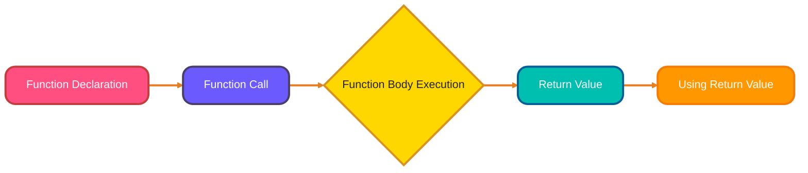
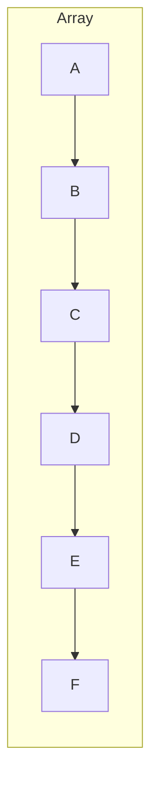
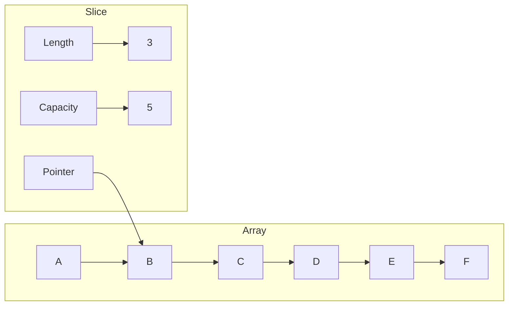

# <span style="color:#e67e22;">What we will learn in this post?</span>

<ul style='list-style-type: none; padding-left: 0;'>
<li><span style='color: #2980b9; font-size: 20px; font-weight: bold;'>👉</span> <span style='color: #2ecc71; font-size: 18px; font-weight: bold;'>Arrays in Go</span></li>
<li><span style='color: #2980b9; font-size: 20px; font-weight: bold;'>👉</span> <span style='color: #2ecc71; font-size: 18px; font-weight: bold;'>Slices Fundamentals</span></li>
<li><span style='color: #2980b9; font-size: 20px; font-weight: bold;'>👉</span> <span style='color: #2ecc71; font-size: 18px; font-weight: bold;'>Creating Slices</span></li>
<li><span style='color: #2980b9; font-size: 20px; font-weight: bold;'>👉</span> <span style='color: #2ecc71; font-size: 18px; font-weight: bold;'>Slice Operations</span></li>
<li><span style='color: #2980b9; font-size: 20px; font-weight: bold;'>👉</span> <span style='color: #2ecc71; font-size: 18px; font-weight: bold;'>Slice Internals</span></li>
<li><span style='color: #2980b9; font-size: 20px; font-weight: bold;'>👉</span> <span style='color: #2ecc71; font-size: 18px; font-weight: bold;'>Multi-dimensional Slices</span></li>
<li><span style='color: #2980b9; font-size: 20px; font-weight: bold;'>👉</span> <span style='color: #2ecc71; font-size: 18px; font-weight: bold;'>Conclusion!</span></li>
</ul>

# <span style="color:#e67e22">Go Arrays 🚀</span>

Arrays in Go are like fixed-size containers for storing elements of the _same type_. Think of them as a row of boxes, where each box holds a value.

## <span style="color:#2980b9">Declaring and Initializing</span>

You declare an array by specifying its size and the data type it will hold. For example:

```go
var numbers [5]int // An array of 5 integers
```

You can initialize it when declaring:

```go
numbers := [5]int{10, 20, 30, 40, 50}
```

Or, you can let Go infer the size:

```go
numbers := [...]int{10, 20, 30, 40, 50} // Size is determined by the number of elements
```

## <span style="color:#2980b9">Zero Values and Accessing Elements</span>

If you don't initialize the array, elements are assigned their _zero value_ (0 for integers, "" for strings, etc.).

```go
var names [3]string // Defaults to ["", "", ""]
```

Access elements using their index (starting from 0):

```go
fmt.Println(numbers[0]) // Output: 10
numbers[1] = 25       // Changing the value at index 1
```

## <span style="color:#2980b9">Key Points to Remember 🤔</span>

- **Fixed Size:** Once declared, the size of an array _cannot be changed_.
- **Value Type:** When you assign one array to another, a _copy_ is created. Changes to the new array won't affect the original.

```go
arr1 := [2]int{1, 2}
arr2 := arr1 // arr2 is a copy of arr1
arr2[0] = 5 // Modifying arr2
fmt.Println(arr1, arr2) // Output: [1 2] [5 2]
```

> To learn more:
>
> - [Go Arrays Tutorial](https://www.tutorialspoint.com/go/go_arrays.htm)
> - [Arrays in Go - GeeksforGeeks](https://www.geeksforgeeks.org/arrays-in-go/)

# <span style="color:#e67e22">Slices: Your Dynamic Array Windows in Go 🪟</span>

// Practical Example: Using arrays for sensor data

```go
package main
import "fmt"
func main() {
    var temperatures [7]float64 // Weekly temperature readings
    temperatures[0] = 22.5
    temperatures[1] = 23.0
    // ...
    fmt.Println("Monday's temperature:", temperatures[0])
}
```

Slices in Go are like **flexible windows** into an underlying array. They let you work with portions of an array without copying the data. Think of them as a _dynamic view_ 😮.

// Practical Example: Array for error codes

```go
var errorCodes = [3]int{404, 500, 403}
fmt.Println("First error code:", errorCodes[0])
```

## <span style="color:#2980b9">Slices vs. Arrays: What's the Difference? 🧐</span>

Here's the lowdown:
// Practical Example: Array copy for backup

```go
original := [2]string{"active", "pending"}
backup := original
backup[1] = "archived"
fmt.Println("Original:", original, "Backup:", backup)
```

- **Arrays:**
  - Fixed size. You define the size when you declare them, and it _can't change_.
  - Value type. When you assign one array to another, you get a completely new copy.

- **Slices:**
  // Practical Example: Slices for user input

```go
users := []string{"Alice", "Bob"}
users = append(users, "Charlie")
fmt.Println("All users:", users)
```

_Dynamic size_. Slices can grow or shrink, making them more adaptable. \* Reference type. Slices don't store the data directly; they hold a pointer to a section of an underlying array. Assigning a slice copies the pointer, not the data itself.

// Practical Example: Slices for log entries

```go
logs := []string{}
logs = append(logs, "Started server", "Received request")
fmt.Println("Logs:", logs)
```

## <span style="color:#2980b9">Why Slices Rule 👑</span>

Slices are generally preferred in Go because of their _flexibility_. You rarely use arrays directly. Check out this resource for more details: [Go Slices: usage and internals](https://go.dev/blog/slices).

```go
// Array (fixed size)
var myArray [3]int = [3]int{1, 2, 3}

// Slice (dynamic size)
mySlice := []int{1, 2, 3} // Creates a slice backed by an anonymous array
mySlice = append(mySlice, 4) // Adding an element to the slice
println(len(mySlice))
```

// Practical Example: Slice for product prices

```go
prices := []float64{9.99, 14.99, 7.50}
fmt.Println("Prices:", prices)
```

// Practical Example: Pre-allocating slice for batch processing

```go
batch := make([]int, 0, 100)
for i := 0; i < 50; i++ {
    batch = append(batch, i)
}
fmt.Println("Batch size:", len(batch))
```

// Practical Example: Slicing for pagination

```go
allItems := []string{"A", "B", "C", "D", "E", "F"}
page := allItems[2:5]
fmt.Println("Page items:", page)
```

Slices make it easier to work with collections of data that change over time ⏱️.

// Practical Example: Variadic function using slices

```go
func sum(nums ...int) int {
    total := 0
    for _, n := range nums {
        total += n
    }
    return total
}
fmt.Println("Sum:", sum(1, 2, 3, 4))
```

Let's explore how to create slices in Go! 🚀

# <span style="color:#e67e22">Creating Slices in Go</span>

// Practical Example: Monitoring slice capacity

```go
data := make([]int, 0, 2)
for i := 0; i < 5; i++ {
    data = append(data, i)
    fmt.Printf("Len: %d, Cap: %d\n", len(data), cap(data))
}
```

Slices are dynamic arrays in Go, offering flexibility. Here are the common ways to create them:

## <span style="color:#2980b9">Slice Literals</span>

Imagine an array: `[A, B, C, D, E, F]`.

Below is a visual diagram showing the flow of slice creation and usage in Go. This helps clarify how slices reference underlying arrays and how operations are performed:



```go
mySlice := make([]int, 5, 10) // Creates a slice of ints, length 5, capacity 10.
// Resources: https://go.dev/ref/spec#Making_slices_maps_and_channels
```

// Practical Example: Slicing for pagination


```go
matrix := [][]int{{1, 2, 3}, {4, 5, 6}, {7, 8, 9}}

```

Choosing the right method depends on your needs: literals for known values, `make` for controlled size and capacity, and slicing for creating views of existing data.

// Practical Example: Named return value for slice modification

```go
    func updateFirst(slice []int, value int) (updated []int) {
        slice[0] = value
        updated = slice
        return
    }
    nums := []int{1, 2, 3}
    fmt.Println("Updated slice:", updateFirst(nums, 99))
```

# <span style="color:#e67e22">Working with Slices in Go 🚀</span>

Let's explore some common and super useful slice operations in Go! Slices are like flexible arrays.
// Practical Example: Defer with slices

<pre><code class="language-go">
func process(items []string) {
    defer fmt.Println("Processing complete!")
    for _, item := range items {
        fmt.Println("Item:", item)
    }
}
process([]string{"A", "B", "C"})
</code></pre>

## <span style="color:#2980b9">Essential Slice Actions 🛠️</span>

- **Adding Elements:** `append()` grows your slice.

  ```go
  nums := []int{1, 2, 3}
  nums = append(nums, 4, 5) // nums is now [1 2 3 4 5]
  ```

// Practical Example: Closure for matrix row sum

```go
matrix := [][]int{{1, 2, 3}, {4, 5, 6}, {7, 8, 9}}
rowSum := func(row []int) int {
    sum := 0
    for _, v := range row {
        sum += v
    }
    return sum
}
fmt.Println("Sum of first row:", rowSum(matrix[0]))
```

// Practical Example: Higher-order function for matrix processing

```go
func applyToMatrix(matrix [][]int, fn func(int) int) [][]int {
    for i := range matrix {
        for j := range matrix[i] {
            matrix[i][j] = fn(matrix[i][j])
        }
    }
    return matrix
}
double := func(x int) int { return x * 2 }
result := applyToMatrix(matrix, double)
fmt.Println("Doubled matrix:", result)
```

- **Duplicating:** `copy()` creates a new slice with the same content.

  ```go
  original := []int{10, 20}
  duplicate := make([]int, len(original))
  copy(duplicate, original) // duplicate is now [10 20]
  ```

- **Checking Size:** `len()` gives you the number of elements. `cap()` shows the slice's capacity (total space allocated).

  ```go
  mySlice := []string{"a", "b"}
  fmt.Println(len(mySlice)) // Output: 2
  fmt.Println(cap(mySlice)) // Output: usually 2 (or more, depends on creation)
  ```

- **Slicing:** `[start:end]` creates a sub-slice.

  ```go
  letters := []string{"A", "B", "C", "D", "E"}
  sub := letters[1:4] // sub is now ["B" "C" "D"]
  ```

## <span style="color:#2980b9">Slice Growth and Memory 🧠</span>

Slices grow dynamically! When you `append()` beyond capacity, Go **reallocates** a new, bigger underlying array, copies the old data, and _then_ adds the new element. This can be performance-intensive. To minimize reallocations, you can use `make()` to create a slice with an initial capacity if you know how large it will grow.
**Tip**: Avoid appending in loops if you can pre-allocate!

- **Resourses**: for more in depth guide check the [Go official Documentation](https://go.dev/tour/moretypes/7).

Here's an explanation of Go slices with diagrams, tailored for easy understanding:

# <span style="color:#e67e22">Understanding Go Slices: A Visual Guide 🚀</span>

Go slices are powerful! Think of them like flexible views into an array. Internally, they hold three things:

- A **pointer** ➡️ to the starting element of the underlying array.
- A **length** 📏 representing the number of elements the slice currently holds.
- A **capacity** 📦 indicating the total space available in the underlying array from the slice's starting point.

## <span style="color:#2980b9">How Slices Work 🛠️</span>

Imagine an array: `[A, B, C, D, E, F]`.



A slice `mySlice := myArray[1:4]` (taking elements from index 1 up to, but not including, 4) would:

- Point to element `B`.
- Have a length of 3 (B, C, D).
- Have a capacity of 5 (B, C, D, E, F).



## <span style="color:#2980b9">Modifications and Array Allocations ⚙️</span>

Modifying `mySlice` _can_ affect the underlying array and other slices that share it. For example:

```go
myArray := [6]string{"A", "B", "C", "D", "E", "F"}
mySlice := myArray[1:4] // mySlice is [B, C, D]
mySlice[0] = "X"        // Changes myArray[1] to "X"
```

If you `append` to `mySlice` _and_ its length is less than its capacity, the underlying array is used. If the length would exceed the capacity, a _new_, larger array is allocated, the data is copied, and the slice pointer is updated. The original array remains unchanged!

```go
mySlice = append(mySlice, "G") // If capacity is enough, no new array
```

For more in-depth information, refer to the official Go blog on slices: [Go Slices: usage and internals](https://go.dev/blog/slices).

Okay, let's explore multi-dimensional slices in Go! 🚀

# <span style="color:#e67e22">Slices of Slices in Go: Multi-Dimensional Arrays</span>

Go doesn't have built-in multi-dimensional arrays like some languages. Instead, you use _slices of slices_. Think of it as a slice where each element is _another slice_.

## <span style="color:#2980b9">Creating 2D Slices (Matrices)</span>

You can initialize them in a few ways:

- **Directly:**

  

  ```go
  matrix := [][]int{{1, 2, 3}, {4, 5, 6}, {7, 8, 9}}
  ```

  

- **Using `make`:**

  ```go
  rows := 3
  cols := 4
  matrix := make([][]int, rows) // Create 'rows' number of rows
  for i := range matrix {
      matrix[i] = make([]int, cols) // Initialize each row with 'cols' elements
  }
  ```

## <span style="color:#2980b9">Accessing Elements</span>

Accessing elements is straightforward: `matrix[row][column]`. For example, `matrix[0][1]` would access the element at row 0, column 1 (which is `2` in our first example).

_Here's the breakdown:_

- `matrix[0]` gives you the first `[]int` (the first row).
- `[1]` then picks the second element from _that_ slice.

### <span style="color:#8e44ad">Example</span>

````go

```go
package main

import "fmt"

func main() {
 matrix := [][]int{{1, 2, 3}, {4, 5, 6}, {7, 8, 9}}

 fmt.Println(matrix[1][2]) // Output: 6
}
````



```

_For more in depth explanation:_

- [Go Slices: usage and internals](https://go.dev/blog/slices)

<h1><span style='color:#e67e22'>Conclusion</span></h1>

Fantastic! We made it! 🥳 Now it’s your chance to chime in. What are your biggest takeaways? Any questions? Leave a comment below and let’s discuss! I’m excited to hear what you have to say! 👇😊
```
