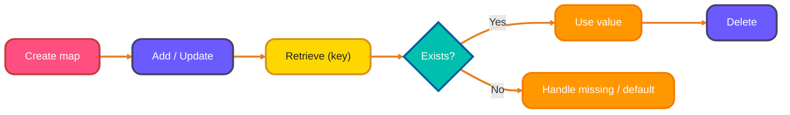
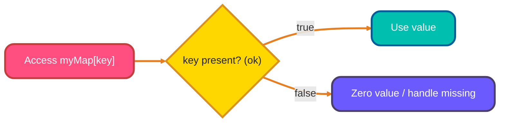
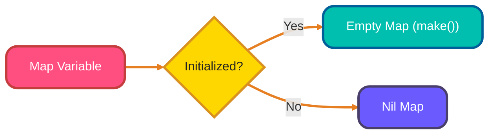

<!-- meta-description: "Practical guide to maps in Go — declaration, operations, key existence checks, iteration, nil maps, and reference behavior, with clear, real-world Go examples." -->
<!-- keywords: "Go maps, maps in Go, Go programming, data structures, key-value, map operations" -->

# <span style="color:#e67e22;">What we will learn in this post?</span>

<ul style='list-style-type: none; padding-left: 0;'>
<li><span style='color: #2980b9; font-size: 20px; font-weight: bold;'>👉</span> <span style='color: #2ecc71; font-size: 18px; font-weight: bold;'>Map Basics</span></li>
<li><span style='color: #2980b9; font-size: 20px; font-weight: bold;'>👉</span> <span style='color: #2ecc71; font-size: 18px; font-weight: bold;'>Map Operations</span></li>
<li><span style='color: #2980b9; font-size: 20px; font-weight: bold;'>👉</span> <span style='color: #2ecc71; font-size: 18px; font-weight: bold;'>Checking Key Existence</span></li>
<li><span style='color: #2980b9; font-size: 20px; font-weight: bold;'>👉</span> <span style='color: #2ecc71; font-size: 18px; font-weight: bold;'>Iterating Over Maps</span></li>
<li><span style='color: #2980b9; font-size: 20px; font-weight: bold;'>👉</span> <span style='color: #2ecc71; font-size: 18px; font-weight: bold;'>Map Zero Value and Nil Maps</span></li>
<li><span style='color: #2980b9; font-size: 20px; font-weight: bold;'>👉</span> <span style='color: #2ecc71; font-size: 18px; font-weight: bold;'>Maps as Reference Types</span></li>
<li><span style='color: #2980b9; font-size: 20px; font-weight: bold;'>👉</span> <span style='color: #2ecc71; font-size: 18px; font-weight: bold;'>Conclusion!</span></li>
</ul>

# <span style="color:#e67e22">Maps in Go 🗺️</span>

Go maps are like dictionaries or hash tables in other languages. They store data in **key-value** pairs. Each key is unique, and it maps to a specific value. Think of it as a phone book, where names (keys) map to phone numbers (values).

## <span style="color:#2980b9">Declaring and Initializing Maps 🛠️</span>

You can create a map using `make(map[K]V)` or with a _map literal_:

```go
// Using make
myMap := make(map[string]int) // Key: string, Value: int

// Using a map literal
anotherMap := map[string]string{"name": "Alice", "city": "Wonderland"}
```

**Key and Value Types**:

- Keys (K) must be comparable types (e.g., `string`, `int`, `bool`).
- Values (V) can be any type.

## <span style="color:#2980b9">Using Maps 🚀</span>

Here’s how to use a map:

```go
package main

import "fmt"

func main() {
    // Create a map
    studentGrades := make(map[string]int)

    // Add key-value pairs
    studentGrades["Alice"] = 90
    studentGrades["Bob"] = 80
    studentGrades["Charlie"] = 70

    // Access a value
    fmt.Println("Alice's grade:", studentGrades["Alice"]) // Output: Alice's grade: 90

    // Check if a key exists
    grade, ok := studentGrades["David"] // ok is true if "David" exists
    if ok {
        fmt.Println("David's grade:", grade)
    } else {
        fmt.Println("David's grade not found") // Output: David's grade not found
    }
     // Delete a key-value pair
    delete(studentGrades, "Bob")
}
```

_Want to learn more? Check out the official Go documentation on [maps](https://go.dev/tour/moretypes/19)!_

Below is a compact flow diagram that summarizes common map operations (create, add/update, retrieve, delete, and existence check) — useful as a quick reference when designing small caches or lookup tables in your code.



# <span style="color:#e67e22">Working with Key-Value Pairs 🔑</span>

Let's learn how to manage data using _key-value pairs_, kind of like a digital dictionary!

## <span style="color:#2980b9">Adding New Entries ➕</span>

To add a new entry, imagine giving it a unique `key` and then assigning a `value` to it. For example:

```go
package main

import "fmt"

func main() {
  myDict := make(map[string]interface{})
  myDict["name"] = "Alice"
  myDict["age"] = 30
  myDict["is_student"] = false

  fmt.Println(myDict) // map[name:Alice age:30 is_student:false]
}
```

Below is the equivalent practical example in Go, demonstrating creation, add/update, retrieve and delete operations on a map — useful in command-line tools or simple data caches.

```go
package main

import "fmt"

func main() {
  cache := make(map[string]string)

  // Add / update
  cache["user:1001"] = "alice@example.com"
  cache["user:1002"] = "bob@example.com"

  // Retrieve
  if v, ok := cache["user:1001"]; ok {
    fmt.Println("Found:", v)
  } else {
    fmt.Println("Not found")
  }

  // Delete
  delete(cache, "user:1002")

  // Iterate and print
  for k, v := range cache {
    fmt.Printf("%s -> %s\n", k, v)
  }
}
```

## <span style="color:#2980b9">Retrieving Values 🔎</span>

To get a value, just ask for it by its `key`:

```go
package main

import "fmt"

func main() {
  m := map[string]string{"name": "Alice"}
  name := m["name"]
  fmt.Println(name) // Output: Alice
}
```

_Remember:_ Keys must be unique.

## <span style="color:#2980b9">Updating Values 🔄</span>

Want to change a value? Simply assign a new value to the existing key:

```go
package main

import "fmt"

func main() {
  m := map[string]int{"age": 30}
  m["age"] = 31
  fmt.Println(m["age"]) // Output: 31
}
```

## <span style="color:#2980b9">Deleting Entries 🗑️</span>

Use `del` to remove a key-value pair:

```go
package main

import "fmt"

func main() {
  m := map[string]interface{}{"name": "Alice", "age": 31, "is_student": true}
  delete(m, "is_student")
  fmt.Println(m) // Output: map[name:Alice age:31]
}
```

- **Key Points:**
  - Keys are unique identifiers.
  - Values can be any data type (string, number, boolean, etc.)
  - `del` removes the entire key-value pair.

# <span style="color:#e67e22">The Comma-Ok Idiom in Go: Checking Map Keys</span> 🔑

Go's `map` data structure doesn't throw an error when you try to access a key that doesn't exist. Instead, it returns the zero value for the map's value type. This can be confusing, so Go provides a neat trick called the "comma-ok idiom" to check if a key is actually present.

## <span style="color:#2980b9">How it Works</span> 🤔

The syntax looks like this: `value, ok := myMap[key]`.

- `value`: This will hold the value associated with the key, or the zero value if the key is missing.
- `ok`: This is a boolean variable. It will be `true` if the key exists in the map, and `false` if it doesn't.

## <span style="color:#2980b9">Missing Key vs. Zero Value</span> 🧐

It's important to understand the difference:

- **Missing Key:** The key literally _isn't_ in the map. `ok` will be `false`.
- **Zero Value:** The key _is_ in the map, but its associated value is the zero value for that type (e.g., `0` for `int`, `""` for `string`, `false` for `bool`). `ok` will be `true`.

```go
myMap := map[string]int{"age": 30, "count": 0}

age, ok := myMap["age"] // age = 30, ok = true
city, ok := myMap["city"] // city = 0, ok = false (key doesn't exist)
count, ok := myMap["count"] // count = 0, ok = true (key exists, value is 0)

fmt.Println(age, ok)
fmt.Println(city, ok)
fmt.Println(count,ok)
```

This example shows that `city` returns the _zero value_ for an int, but `ok` is false when it doesn't exists, also `count` which is initialized to `0` has the `ok` set to true.

Here is a helpful resource to learn more about checking for a Key Existence:
[Checking Key Existence in Maps | Go by Example](https://gobyexample.com/maps)

This small diagram shows the comma-ok decision flow when you access a key: check existence with the comma-ok idiom, then branch to using the value or handling a missing key. It's a handy visual for teaching or quick reference.



# <span style="color:#e67e22">Iterating Through Maps in Go with `range` 🗺️</span>

Go's `range` keyword makes looping through maps super easy! The important thing to remember is that the **iteration order is not guaranteed**. It can be random each time you run your program. Let's explore how it works.

## <span style="color:#2980b9">Key-Only Iteration 🔑</span>

You can get only the keys of the map using `for key := range myMap`.

```go
package main

import "fmt"

func main() {
    myMap := map[string]int{"a": 1, "b": 2, "c": 3}

    fmt.Println("Iterating over keys:")
    for key := range myMap {
        fmt.Println("Key:", key)
    }
}
```

## <span style="color:#2980b9">Key-Value Iteration 🔑➡️Value</span>

To access both keys and values, use `for key, value := range myMap`.

```go
package main

import "fmt"

func main() {
    myMap := map[string]int{"a": 1, "b": 2, "c": 3}

    fmt.Println("Iterating over keys and values:")
    for key, value := range myMap {
        fmt.Printf("Key: %s, Value: %d\n", key, value)
    }
}
```

- **`range` provides a simple way to iterate.**
- _Remember, the order isn't predictable!_
- Use `key := range map` for keys only.
- Use `key, value := range map` for both keys and values.

For more detailed information on the usage of maps, please see this [resource](https://go.dev/tour/moretypes/19).

When iterating over maps, the order is undefined; if you need deterministic output (for tests or stable UI), convert keys to a slice, sort them, and iterate. The diagram below shows that pattern in a simple flow.

```mermaid
graph LR
  START["Start: map variable"]:::javaStyle --> RANGE["for range over map"]:::driverStyle
  RANGE --> UNORDERED["Iteration order: undefined"]:::dbStyle
  UNORDERED --> TO_SLICE["Collect keys to slice"]:::jdbcStyle
  TO_SLICE --> SORT["Sort slice"]:::useStyle
  SORT --> ITER["Iterate deterministically"]:::driverStyle

  classDef javaStyle fill:#ff4f81,stroke:#c43e3e,color:#fff,font-size:16px,stroke-width:3px,rx:14,shadow:6px;
  classDef jdbcStyle fill:#6b5bff,stroke:#4a3f6b,color:#fff,font-size:16px,stroke-width:3px,rx:14,shadow:6px;
  classDef driverStyle fill:#ffd700,stroke:#d99120,color:#222,font-size:16px,stroke-width:3px,rx:14,shadow:6px;
  classDef dbStyle fill:#00bfae,stroke:#005f99,color:#fff,font-size:16px,stroke-width:3px,rx:14,shadow:6px;
  classDef useStyle fill:#ff9800,stroke:#f57c00,color:#fff,font-size:16px,stroke-width:3px,rx:14,shadow:6px;
  linkStyle default stroke:#e67e22,stroke-width:3px;
```



# <span style="color:#e67e22">Understanding Go Maps and Nil Values 🗺️</span>

Let's explore maps in Go and how they handle _nil_ values! Maps are like dictionaries, storing key-value pairs.

## <span style="color:#2980b9">Nil Maps vs. Empty Maps 🧐</span>

A _nil_ map is a map that hasn't been initialized. Think of it as a map variable that's declared, but no memory has been allocated. An empty map, on the other hand, is a map that _has_ been initialized using `make()`, but it currently contains no key-value pairs.

```go
var nilMap map[string]int  // nil map
emptyMap := make(map[string]int) // empty map
```

Here's a basic **flowchart** to help visualise the difference.



## <span style="color:#8e44ad">Working with Nil Maps - What's Allowed (and Not!) ⛔️</span>

You _can_ read from a `nil` map without causing a panic. If you try to access a key in a `nil` map, you'll simply get the _zero value_ of the map's value type. However, you _cannot_ write (add or update elements) to a `nil` map! Doing so will cause a _panic_.

- **Reading from a `nil` map:** OK 👍. Returns the zero value of the value type.
- **Writing to a `nil` map:** PANIC 💥! You must initialize the map with `make()` first.

Example:

```go
var myMap map[string]string

name := myMap["name"] //This works fine, name will be an empty string
//myMap["city"] = "London" //This will cause a panic.

myMap = make(map[string]string)
myMap["city"] = "London" //This is perfectly fine!
```

**Resource Link:** For more detailed information, check out the [official Go documentation on maps](https://go.dev/tour/moretypes/19).

# <span style="color:#e67e22">Maps in Go: Reference Types 🗺️</span>

Go maps are **reference types**. This means a map variable doesn't directly store the data. Instead, it holds a _pointer_ to the underlying data structure where key-value pairs are stored. This has important implications when you pass maps to functions.

## <span style="color:#2980b9">Passing Maps to Functions ➡️</span>

Because maps are reference types, when you pass a map to a function, you're passing a _copy_ of the pointer, not the map's data itself. Therefore, if the function modifies the map (adds, deletes, or updates elements), those changes will be visible to the caller!

```go
package main

import "fmt"

func modifyMap(m map[string]int) {
  m["age"] = 30 // Modifying the map
}

func main() {
  myMap := map[string]int{"name": 25}
  fmt.Println("Before:", myMap) // Output: Before: map[name:25]

  modifyMap(myMap)
  fmt.Println("After:", myMap)  // Output: After: map[age:30 name:25]
}
```

## <span style="color:#2980b9">Reference Types vs. Value Types 🆚</span>

This is different from **value types** (like `int`, `string`, `struct`). When you pass a value type to a function, you're passing a _copy_ of the value. Modifications to the copy _don't_ affect the original.

```go
package main

import "fmt"

func modifyInt(x int) {
  x = 10 // Modifying the copy of the integer
}

func main() {
  myInt := 5
  fmt.Println("Before:", myInt) // Output: Before: 5

  modifyInt(myInt)
  fmt.Println("After:", myInt)  // Output: After: 5
}
```

Value types create complete copies, and changes to the copy do not impact the original. Reference types share the same underlying data structure.

**Key Takeaway:** Changes to a map passed to a function _will_ affect the original map in the calling function because maps are passed by reference.

<h1><span style='color:#e67e22'>Conclusion</span></h1>

And that's a wrap! 🎉 We'd love to hear what you think. Did you find this helpful? Any tips of your own to share? Drop a comment below – we're all ears!👂 Let's chat! 👇
