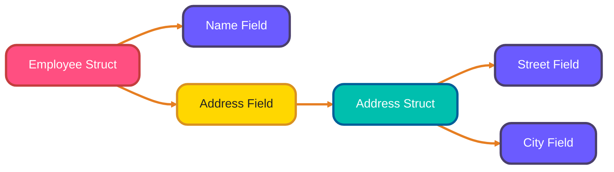
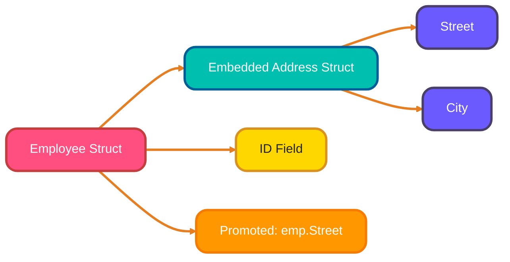

# <span style="color:#e67e22;">What we will learn in this post?</span>

<ul style='list-style-type: none; padding-left: 0;'>
<li><span style='color: #2980b9; font-size: 20px; font-weight: bold;'>👉</span> <span style='color: #2ecc71; font-size: 18px; font-weight: bold;'>Defining Structs</span></li>
<li><span style='color: #2980b9; font-size: 20px; font-weight: bold;'>👉</span> <span style='color: #2ecc71; font-size: 18px; font-weight: bold;'>Anonymous Structs and Embedded Fields</span></li>
<li><span style='color: #2980b9; font-size: 20px; font-weight: bold;'>👉</span> <span style='color: #2ecc71; font-size: 18px; font-weight: bold;'>Methods in Go</span></li>
<li><span style='color: #2980b9; font-size: 20px; font-weight: bold;'>👉</span> <span style='color: #2ecc71; font-size: 18px; font-weight: bold;'>Pointer vs Value Receivers</span></li>
<li><span style='color: #2980b9; font-size: 20px; font-weight: bold;'>👉</span> <span style='color: #2ecc71; font-size: 18px; font-weight: bold;'>Method Sets</span></li>
<li><span style='color: #2980b9; font-size: 20px; font-weight: bold;'>👉</span> <span style='color: #2ecc71; font-size: 18px; font-weight: bold;'>Struct Tags</span></li>
<li><span style='color: #2980b9; font-size: 20px; font-weight: bold;'>👉</span> <span style='color: #2ecc71; font-size: 18px; font-weight: bold;'>Conclusion!</span></li>
<!--
# Meta Description: Master Go's structs and methods! Learn how to define structs, leverage embedded fields, understand method sets, and use struct tags effectively. This post empowers you to build robust and organized Go applications.
# Keywords: Go Programming, Struct Definition, Methods, Pointer Receivers, Struct Tags, Go Structs, Go Methods, Go Tutorial
# -->

</ul>

# <span style="color:#e67e22">Structs in Go 🚀</span>

Go structs are like blueprints for creating custom data types. They bundle together different fields, each with its own type.

## <span style="color:#2980b9">Defining Structs 📝</span>

To define a struct, we use the `type` keyword followed by the struct's name and the `struct` keyword, and then list the fields and their types within curly braces:

```go
type Person struct {
    Name string
    Age  int
}
```

Here, `Person` is a struct with two fields: `Name` (a string) and `Age` (an integer).

```mermaid
graph LR
    S_DECL["Struct Declaration"]:::javaStyle --> S_FIELD["Fields: Name, Age"]:::jdbcStyle
    S_FIELD --> S_INST["Instance Creation"]:::driverStyle
    S_INST --> S_USE["Use Struct"]:::useStyle

    classDef javaStyle fill:#ff4f81,stroke:#c43e3e,color:#fff,font-size:16px,stroke-width:3px,rx:14,shadow:6px;
    classDef jdbcStyle fill:#6b5bff,stroke:#4a3f6b,color:#fff,font-size:16px,stroke-width:3px,rx:14,shadow:6px;
    classDef driverStyle fill:#ffd700,stroke:#d99120,color:#222,font-size:16px,stroke-width:3px,rx:14,shadow:6px;
    classDef useStyle fill:#ff9800,stroke:#f57c00,color:#fff,font-size:16px,stroke-width:3px,rx:14,shadow:6px;

    class S_DECL javaStyle;
    class S_FIELD jdbcStyle;
    class S_INST driverStyle;
    class S_USE useStyle;

    linkStyle default stroke:#e67e22,stroke-width:3px;
```



## <span style="color:#2980b9">Initializing Structs ✨</span>

We can initialize structs in a few ways:

- **Struct Literals:**

```go
person1 := Person{"Alice", 30} // Order matters!
```

- **Field: Value Syntax:**

```go
person2 := Person{Name: "Bob", Age: 25} // Order doesn't matter!
```

- **`new()` Function:**

```go
person3 := new(Person) // Returns a pointer to a zero-valued Person
person3.Name = "Charlie"
person3.Age = 40
```

## <span style="color:#2980b9">Nested Structs 🏠</span>

Structs can contain other structs as fields, creating nested structures:

```go
type Address struct {
    Street string
    City   string
}

type Employee struct {
    Name    string
    Address Address // Nested struct
}

employee1 := Employee{Name: "David", Address: Address{Street: "123 Main St", City: "Anytown"}}
```



- More details and advanced struct concepts can be found in the [official Go documentation](https://go.dev/tour/moretypes/2).
- Tutorialspoint also provides a good resource for structs [Tutorialspoint](https://www.tutorialspoint.com/go/go_structures.htm)

# <span style="color:#e67e22">Structs in Go: One-Time Use & Composition 🧩</span>

#

| Feature          | Struct Embedding (Composition)      | Inheritance (Classical OOP)           |
| ---------------- | ----------------------------------- | ------------------------------------- |
| Relationship     | "Has-a" (contains another type)     | "Is-a" (inherits from another type)   |
| Supported in Go? | Yes                                 | No                                    |
| Field Promotion  | Yes (fields promoted to outer type) | No (fields accessed via parent class) |
| Code Reuse       | By embedding                        | By inheritance                        |
| Flexibility      | High (can embed multiple types)     | Lower (single inheritance chain)      |
| Coupling         | Loose                               | Tight                                 |

Let's explore structs in Go, focusing on _anonymous structs_ for one-off situations and _struct embedding_ for building complex types.

## <span style="color:#2980b9">Anonymous Structs 👻</span>

| Feature          | Anonymous Structs               | Named Structs                        |
| ---------------- | ------------------------------- | ------------------------------------ |
| Definition       | Defined inline, no type name    | Defined with a type name             |
| Usage Scope      | One-off, temporary              | Reusable, used in multiple places    |
| Syntax           | `var x = struct { ... }{ ... }` | `type X struct { ... }`              |
| Typical Use Case | Quick grouping, function params | Data models, application logic       |
| Readability      | Lower for complex structs       | Higher, especially for large structs |

Anonymous structs are defined without a name and are useful when you need a struct type _only once_.

```go
package main

import "fmt"

func main() {
    person := struct {
        Name string
        Age  int
    }{
        Name: "Alice",
        Age:  30,
    }

    fmt.Println(person) // Output: {Alice 30}
}
```

## <span style="color:#2980b9">Struct Embedding: Composition over Inheritance 🏗️</span>

Go doesn't have inheritance in the traditional sense. Instead, it uses _struct embedding_ which provides a powerful _composition_ mechanism.

```go
package main

import "fmt"

type Address struct {
    Street string
    City   string
}

type Employee struct {
    ID   int
    Address // Embedded field
}

func main() {
    emp := Employee{
        ID: 123,
        Address: Address{
            Street: "1 Main St",
            City:   "Anytown",
        },
    }

    fmt.Println(emp.Street) // **Promoted field!** Output: 1 Main St
    fmt.Println(emp.Address.City) //Output: Anytown
}
```

- **Embedded Fields:** `Address` is embedded in `Employee`.
- **Promotion:** Fields from the embedded struct are _promoted_ to the outer struct. So `emp.Street` directly accesses the `Street` field of the embedded `Address` struct.

### <span style="color:#8e44ad">Composition vs. Inheritance ⚖️</span>



- **Composition:** Creates a "has-a" relationship. `Employee` _has an_ `Address`. It's flexible and avoids the tight coupling of inheritance.
- **Inheritance:** Creates an "is-a" relationship. Not directly supported in Go. Composition provides the benefits of code reuse without the complexities of inheritance hierarchies.

Instead of thinking of `Employee` _inheriting_ from `Address`, think of `Employee` _containing_ an `Address` and conveniently providing direct access to its fields. Check out this [awesome blog](https://www.ardanlabs.com/blog/2017/06/oop-is-dead-long-live-composition.html) to know more.

# <span style="color:#e67e22">Methods on Structs in Go ⚙️</span>

Go lets you add _behaviors_ to your `struct` types using methods. Think of it like giving your data abilities!

## <span style="color:#2980b9">Defining Methods with Receiver Functions 🤝</span>

The magic happens with a **receiver function**. Here's how it looks:

```go
func (r MyStruct) MyMethod() {
  // Your code here, accessing fields of 'r'
}
```

- `func`: Keyword for defining a function.
- `(r MyStruct)`: The _receiver_. `r` is a variable (like `this` or `self` in other languages) that refers to an instance of `MyStruct`.
- `MyMethod()`: The name of your method.

## <span style="color:#2980b9">Calling Methods and Chaining 📞🔗</span>

You call methods using the `.` operator:

```go
myVar := MyStruct{ /* ... */ }
myVar.MyMethod()
```

If a method returns a value that allows you to call another method on it directly, you can use **method chaining**:

```go
result := myVar.Method1().Method2().Method3()
```

**Example:**

```go
type Rectangle struct {
    Width  int
    Height int
}

func (r Rectangle) Area() int {
    return r.Width * r.Height
}

func main() {
    myRect := Rectangle{Width: 10, Height: 5}
    area := myRect.Area() // calling the Area method.
    println(area) // output is 50
}
```

[More Info](https://go.dev/tour/methods/1)

# <span style="color:#e67e22">Pointer vs. Value Receivers in Go 🛠️</span>

In Go, methods can have either **pointer receivers** (`*T`) or **value receivers** (`T`). This choice impacts how the method interacts with the underlying data. Let's break it down!

## <span style="color:#2980b9">Understanding the Difference 🧐</span>

- **Value Receiver (T):** The method operates on a _copy_ of the original struct. Changes made inside the method _do not_ affect the original struct. Think of it like making a photocopy and editing it. 📝

- **Pointer Receiver (\*T):** The method operates directly on the _original_ struct. Changes made inside the method _do_ affect the original struct. Think of it like directly editing a document. 💻

| Feature                | Value Receiver (`T`)            | Pointer Receiver (`*T`)             |
| ---------------------- | ------------------------------- | ----------------------------------- |
| Operates On            | Copy of struct                  | Original struct (reference)         |
| Can Modify Original?   | No                              | Yes                                 |
| Use Case               | Read-only methods               | Methods that modify struct fields   |
| Performance            | May be costly for large structs | Efficient for large structs         |
| Interface Satisfaction | Satisfies interface with value  | Satisfies interface with pointer    |
| Method Call            | `obj.Method()`                  | `(&obj).Method()` or `obj.Method()` |

## <span style="color:#2980b9">When to Use Which? 🤔</span>

- **Mutation (Changing Data):** Use a pointer receiver (`*T`) if the method needs to _modify_ the struct's fields. If we want to save the changes. ✅
- **Read-Only (No Changes):** Use a value receiver (`T`) if the method only needs to _read_ the struct's fields and _doesn't_ modify them. 📖
- **Large Structs (Performance):** Use a pointer receiver (`*T`) for large structs to avoid copying the entire struct every time the method is called. This can significantly improve performance. 🚀

## <span style="color:#2980b9">Go's Magic: Automatic Conversions ✨</span>

Go automatically handles conversions. You can call a method with a pointer receiver on a value, and Go will automatically take the address. Similarly, you can call a method with a value receiver on a pointer, and Go will automatically dereference it.

## <span style="color:#2980b9">Comparative Examples 💡</span>

```go
type Circle struct {
    Radius int
}

// Value receiver - Doesn't modify the original.
func (c Circle) AreaValue() int {
    c.Radius = 100 // This DOES NOT affect the original circle
    return c.Radius * c.Radius
}

// Pointer receiver - Modifies the original.
func (c *Circle) DoubleRadius() {
    c.Radius = c.Radius * 2 // This affects the original circle.
}

func main() {
    myCircle := Circle{Radius: 5}

    area := myCircle.AreaValue() //Calls area value on value reciever
 println("Area:",area)       //prints 10000 since value reciever works on a copy.

    myCircle.DoubleRadius()
    println("Radius:", myCircle.Radius) //prints Radius 10
}
```

## <span style="color:#8e44ad">Summary</span>

- `Value Reciever` Use if you only have to read the data.
- `Pointer Reciever` Use if you have to read and modify the data.

---

[Resources on GO programming](https://go.dev/)

Here's an explanation of method sets in Go, designed to be friendly and easy to understand!

# <span style="color:#e67e22">Method Sets in Go: 🧐 What Are They?</span>

Method sets determine which methods a type has. This is super important for interfaces!

## <span style="color:#2980b9">Value vs. Pointer Receivers</span>

- A _value receiver_ gets a copy of the value. Both a `T` and `*T` (pointer to `T`) can call these methods.
- A _pointer receiver_ gets the actual value's address. Only `*T` can directly call these methods. A `T` can call it if Go can automatically get its address.

## <span style="color:#2980b9">Interface Satisfaction and Method Sets</span>

A type satisfies an interface if its method set includes all the interface's methods.

- If an interface has pointer receiver methods, only a `*T` can satisfy it.
- If an interface has value receiver methods, both `T` and `*T` can satisfy it.

```go
type MyInterface interface {
  MethodWithPointerReceiver()
}

type MyType struct {}

func (t *MyType) MethodWithPointerReceiver() {} // *MyType implements MyInterface

func main() {
  var i MyInterface
  mt := MyType{}
  i = &mt // Correct!
  //i = mt  // Error: MyType does not implement MyInterface (MethodWithPointerReceiver has pointer receiver)
}
```

## <span style="color:#2980b9">Example: Seeing it in Action 🚀</span>

```go
type Number int

// Value receiver
func (n Number) String() string {
  return fmt.Sprintf("Value: %d", n)
}

// Pointer receiver
func (n *Number) Increment() {
  *n++
}

func main() {
  num := Number(5)
  fmt.Println(num.String())   // Works: Value receiver can be called on value
  (&num).Increment()      // Works: Pointer receiver called on pointer
  fmt.Println(num.String())
}
```

In the example:

- `String()` is in the method set of both `Number` and `*Number`.
- `Increment()` is only in the method set of `*Number`.
- <ins>More Info</ins>: Check out this article about method sets. [Go Method Sets](https://go.dev/tour/methods/4)

Here's a friendly explanation of struct tags in Go:

# <span style="color:#e67e22">Struct Tags Explained 🏷️</span>

Struct tags are little pieces of metadata you can add to the fields of a struct in Go. They're written inside backticks `` ` `` after the field's type. Think of them as instructions for tools like JSON encoders, validators, or database mappers.

## <span style="color:#2980b9">What are they for? 🤔</span>

- **JSON Marshaling (`json:"name"`)**: Tells the `json` package how to name a field when encoding to JSON. For example: `FieldName string`json:"field_name"` `` will make the JSON key `field_name`.

- **Validation**: Libraries can use tags to define validation rules. `Name string`validate:"required,min=3"` `` might specify that `Name` must not be empty and have at least 3 characters.

- **Database ORM Mapping**: Help ORMs (Object-Relational Mappers) map struct fields to database columns. `ID int`db:"user_id,primarykey"` `` could indicate that the `ID`field corresponds to the`user_id` column and is a primary key.

## <span style="color:#8e44ad">How to Use Them? 🚀</span>

```go
type User struct {
    ID   int    `json:"id" db:"user_id,primarykey"`
    Name string `json:"name" validate:"required"`
}
```

- **Syntax**: `FieldName Type`tag1:"value1" tag2:"value2"` `

- **Accessing Tags**: You need to use _reflection_ to read tag values at runtime:

```go
package main

import (
 "fmt"
 "reflect"
)

type Person struct {
 Name string `json:"name,omitempty" validate:"required"`
 Age  int    `json:"age"`
}

func main() {
 personType := reflect.TypeOf(Person{})

 for i := 0; i < personType.NumField(); i++ {
  field := personType.Field(i)
  jsonTag := field.Tag.Get("json")
  validateTag := field.Tag.Get("validate")

  fmt.Printf("Field: %s, JSON Tag: %s, Validate Tag: %s\n", field.Name, jsonTag, validateTag)
 }
}
```

This code snippet shows how to inspect the tags of a struct's fields. The `reflect` package is used to get the type information of the struct and then iterate over its fields. For each field, the `Tag.Get` method is used to retrieve the value of the `json` and `validate` tags.
[Reflection in Go](https://go.dev/reflect)

## <span style="color:#8e44ad">Practical example 💡</span>

```go
package main

import (
 "encoding/json"
 "fmt"
)

type User struct {
 ID     int    `json:"id"`
 Name   string `json:"user_name"`
 Email  string `json:"email,omitempty"` // omitempty: will hide if email is ""
 passwd string `json:"-"`             //-: will hide password
}

func main() {
 user := User{ID: 1, Name: "John Doe", Email: "john.doe@example.com", passwd: "securePassword"}

 jsonData, err := json.Marshal(user)
 if err != nil {
  fmt.Println("Error marshaling JSON:", err)
  return
 }

 fmt.Println(string(jsonData))
}
```

output:

```json
{ "id": 1, "user_name": "John Doe", "email": "john.doe@example.com" }
```

Here, the Name Field in Json will be `user_name`, Email will hide when empty and passwd will hide.
<br>

Tags offer a powerful way to customize how Go structs interact with external systems and libraries, making your code more flexible and expressive.

**Option 3:**

<h1><span style='color:#e67e22'>Conclusion</span></h1>

Alright, we've reached the end! 😊 I'm really keen to know what _you_ think. Any comments, questions, or suggestions? Please share them below! Your input helps make this even better. 👇 Looking forward to reading them! 🚀
