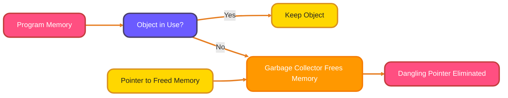
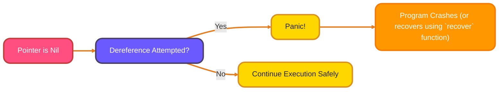

<!--
# Meta Description: Unlock the power of pointers in Go! Learn pointer basics, struct pointers, function arguments, and memory safety for efficient Go programming.
# Keywords: Go Pointers, Memory Address, Pointer Arithmetic, Structs, Pass by Reference, Pointer Safety, Go Programming, Go Tutorial
# -->

# <span style="color:#e67e22;">What we will learn in this post?</span>

<ul style='list-style-type: none; padding-left: 0;'>
<li><span style='color: #2980b9; font-size: 20px; font-weight: bold;'>👉</span> <span style='color: #2ecc71; font-size: 18px; font-weight: bold;'>Understanding Pointers</span></li>
<li><span style='color: #2980b9; font-size: 20px; font-weight: bold;'>👉</span> <span style='color: #2ecc71; font-size: 18px; font-weight: bold;'>Pointers vs Values</span></li>
<li><span style='color: #2980b9; font-size: 20px; font-weight: bold;'>👉</span> <span style='color: #2ecc71; font-size: 18px; font-weight: bold;'>Pointer to Structs</span></li>
<li><span style='color: #2980b9; font-size: 20px; font-weight: bold;'>👉</span> <span style='color: #2ecc71; font-size: 18px; font-weight: bold;'>Pointers as Function Arguments</span></li>
<li><span style='color: #2980b9; font-size: 20px; font-weight: bold;'>👉</span> <span style='color: #2ecc71; font-size: 18px; font-weight: bold;'>Pointer Safety in Go</span></li>
<li><span style='color: #2980b9; font-size: 20px; font-weight: bold;'>👉</span> <span style='color: #2ecc71; font-size: 18px; font-weight: bold;'>Conclusion!</span></li>
</ul>

# <span style="color:#e67e22">Understanding Pointers in Go 📍</span>

Go pointers are like **signposts** ➡️ that hold the _memory address_ of a variable, not the actual value. Think of it this way: your house has an address; the pointer is the address, while your house is the variable's value.

## <span style="color:#2980b9">Address-Of and Dereference 🔍</span>

- The `&` (address-of) operator gives you the memory address of a variable.

  ```go
  num := 42
  ptr := &num // ptr now holds the memory address of num
  ```

- The `*` (dereference) operator lets you access the value stored _at_ the address a pointer holds.

  ```go
  fmt.Println(*ptr) // Prints 42 - the value at the address ptr points to
  ```

## <span style="color:#2980b9">Declaring and Using Pointers 📝</span>

Pointers are declared using `*` followed by the variable's type. Here's a simple example:

```go
package main

import "fmt"

func main() {
    num := 10
    var ptr *int // Declare a pointer to an integer
    ptr = &num   // Assign the address of num to ptr

    fmt.Println("Value of num:", num)       // Output: Value of num: 10
    fmt.Println("Address of num:", &num)    // Output: Address of num: 0x...
    fmt.Println("Value of ptr:", ptr)        // Output: Value of ptr: 0x... (same as address of num)
    fmt.Println("Value at ptr:", *ptr)      // Output: Value at ptr: 10 (dereferencing)

    *ptr = 20 // Change the value at the address ptr points to

    fmt.Println("New value of num:", num)   // Output: New value of num: 20 (num is changed!)
}
```

By changing the value through the pointer `*ptr = 20`, you're directly modifying the original variable `num`.

For further exploration on pointers, you can refer to the [Go documentation on pointers](https://go.dev/tour/moretypes/1) and [Effective Go](https://go.dev/doc/effective_go#pointers).

# <span style="color:#e67e22">Pointers vs. Values in Go: A Friendly Guide 📍</span>

When deciding between pointers and values in Go, think about these factors:

## <span style="color:#2980b9">Performance: Avoiding Copying Big Stuff 🏋️‍♀️</span>

- Using a value _copies_ the data. For **large structs**, this copy can be slow. Pointers are just addresses; they're much faster to pass around.

## <span style="color:#2980b9">Mutability: Changing Things 🛠️</span>

- Values create immutable snapshots. Changing a value inside a function _won't_ affect the original.
- Pointers allow you to directly modify the original data.

## <span style="color:#2980b9">Nil Pointers: Watch Out! ⚠️</span>

- A pointer can be `nil`, meaning it doesn't point to anything. Trying to use a `nil` pointer will cause a panic!

```go
package main

import "fmt"

type Person struct {
    Name string
    Age  int
}

func modifyValue(p Person) {
    p.Age = 30 // This won't affect the original person
}

func modifyPointer(p *Person) {
    p.Age = 30 // This *will* affect the original person
}

func main() {
    person1 := Person{Name: "Alice", Age: 25}
    modifyValue(person1)
    fmt.Println(person1) // Output: {Alice 25}

    person2 := Person{Name: "Bob", Age: 20}
    modifyPointer(&person2)
    fmt.Println(person2) // Output: {Bob 30}

    var person3 *Person
    //fmt.Println(person3.Name) // This would panic! (Nil pointer dereference)
  if person3 != nil{
   fmt.Println(person3.Name)
  }
}
```

_Example:_
`person1`'s age _didn't_ change with `modifyValue`. `person2`'s age _did_ change with `modifyPointer`.

- Use pointers when you want to modify the original data, or when dealing with large structs for performance. Otherwise, values are often simpler and safer.

### <span style="color:#8e44ad">Resource Links:</span>

- [Go Pointers Tutorial](https://www.tutorialspoint.com/go/go_pointers.htm)
- [Effective Go - Pointers vs Values](https://go.dev/tour/moretypes/1)

# <span style="color:#e67e22">Pointers to Structs in Go 🚀</span>

Let's explore how to use pointers with structs in Go!

## <span style="color:#2980b9">Understanding Struct Pointers</span>

A pointer to a struct holds the _memory address_ of a struct variable. This is useful for efficiently modifying the original struct and avoiding unnecessary copying.

- To get a pointer to a struct, use the `&` operator: `p := &myStruct`.
- To dereference a pointer, use the `*` operator. However, Go provides **automatic dereferencing** for struct fields, making it easier.

## <span style="color:#2980b9">Automatic Dereferencing ✨</span>

Go simplifies working with struct pointers. Instead of `(*p).field`, you can directly use `p.field` to access a field of the struct pointed to by `p`. Go automatically dereferences the pointer.

```go
type Person struct {
    Name string
    Age  int
}

func main() {
    person := Person{Name: "Alice", Age: 30}
    ptr := &person

    // Both access the Name field
    println(ptr.Name)   // Easier
    println((*ptr).Name) // Equivalent, but less readable
}
```

## <span style="color:#2980b9">`new()` for Memory Allocation 🧠</span>

The `new()` function allocates _zeroed_ memory for a new value of a given type and returns a _pointer_ to that value. It's useful for creating empty structs.

```go
personPtr := new(Person) // Returns *Person with all fields zeroed
personPtr.Name = "Bob"
personPtr.Age = 25

println(personPtr.Name)
```

## <span style="color:#2980b9">Common Struct Pointer Patterns 🎨</span>

- **Modifying Structs:** Passing a struct pointer to a function allows the function to modify the original struct.

```go
func updateAge(p *Person, newAge int) {
    p.Age = newAge // Modifies the original Person struct
}
```

- **Large Structs:** Using pointers can be more efficient when dealing with large structs, as you avoid copying the entire struct.

- **Methods on Structs:** Methods that need to modify the struct's state should use pointer receivers.
  [More Info about method receivers](https://go.dev/tour/methods/4)

```go
func (p *Person) CelebrateBirthday() {
    p.Age++ // Increment the original struct's Age
}
```



# <span style="color:#e67e22"> Passing Pointers to Functions ➡️ 🛠️</span>

```mermaid
graph LR
    S_DECL["Create Struct Instance"]:::javaStyle --> S_PTR["Get Pointer using &"]:::jdbcStyle
    S_PTR --> S_ACCESS["Use Pointer to Access Fields"]:::driverStyle
    S_ACCESS --> S_DEREF["Automatic Dereferencing (p.field)"]:::useStyle
    S_PTR --> S_NEW["Use new() to Allocate Zeroed Memory"]:::driverStyle
    S_NEW --> S_ACCESS

    classDef javaStyle fill:#ff4f81,stroke:#c43e3e,color:#fff,font-size:16px,stroke-width:3px,rx:14,shadow:6px;
    classDef jdbcStyle fill:#6b5bff,stroke:#4a3f6b,color:#fff,font-size:16px,stroke-width:3px,rx:14,shadow:6px;
    classDef driverStyle fill:#ffd700,stroke:#d99120,color:#222,font-size:16px,stroke-width:3px,rx:14,shadow:6px;
    classDef useStyle fill:#ff9800,stroke:#f57c00,color:#fff,font-size:16px,stroke-width:3px,rx:14,shadow:6px;

    class S_DECL javaStyle;
    class S_PTR jdbcStyle;
    class S_ACCESS driverStyle;
    class S_DEREF useStyle;
    class S_NEW driverStyle;

    linkStyle default stroke:#e67e22,stroke-width:3px;
```

Passing pointers is a smart way for functions to _change_ data outside their own scope and to avoid making copies of large data structures (like structs). Let's break it down:

## <span style="color:#2980b9">Value vs. Pointer Parameters 🤔</span>

- **Value Parameters:** The function receives a _copy_ of the data. Any changes inside the function _won't_ affect the original data in the calling code.
- **Pointer Parameters:** The function receives the _memory address_ (pointer) of the data. Using pointers, the function can directly _modify_ the original data.

## <span style="color:#2980b9">Modifying Caller's Data with Pointers 📝</span>

Here's an example in (pseudo-code):

```c++
struct Person {
  string name;
  int age;
};

void incrementAge(Person* p) { // Takes a pointer to a Person
  p->age = p->age + 1;       // Directly modifies the age of the original Person!
}

int main() {
  Person myPerson = {"Alice", 30};
  incrementAge(&myPerson);  // Pass the *address* of myPerson
  // myPerson.age is now 31!
}
```

Using `*` (dereference operator) we can get the value in the memory address that `p` is pointing to.

_Advantages:_

- Saves memory (no copying).
- Enables functions to directly alter data owned by the caller.

# <span style="color:#e67e22">Go's Safety Net for Pointers 🛡️</span>

Go helps prevent nasty pointer problems in a few clever ways.

## <span style="color:#2980b9">No Pointer Arithmetic ➕➖</span>

Unlike C/C++, Go _doesn't allow_ you to add or subtract from pointer addresses. This stops you from accidentally wandering around memory and messing things up. Go encourages using slices instead.

## <span style="color:#2980b9">Dangling Pointer Prevention 🔗✂️</span>

Go's _garbage collector_ (GC) automatically manages memory. When a piece of memory is no longer being used by your program, the GC swoops in and cleans it up. This avoids _dangling pointers_, which are pointers that point to memory that has already been freed.



## <span style="color:#2980b9">Nil Pointer Checks 🤔</span>

Go requires you to check if a pointer is `nil` before you use it. `nil` means the pointer isn't pointing to anything.

### <span style="color:#8e44ad">Dereferencing Nil Pointer 💥</span>

If you _try_ to access the value of a `nil` pointer (dereferencing), your program will `panic`. A `panic` is Go's way of saying "Uh oh, something went terribly wrong!". This prevents you from unknowingly working with invalid data.

```go
var ptr *int
*ptr = 10 // This will cause a panic!
```

Here's a visual to showcase the panic flow:



These features make Go a much safer language to use when dealing with pointers, reducing the risk of common memory-related bugs. Resources to find out more:

- [Go Pointers](https://go.dev/tour/moretypes/1)
- [Garbage Collection in Go](https://go.dev/doc/gc-guide)

<h1><span style='color:#e67e22'>Conclusion</span></h1>

So, what do you think? 🤔 Did anything in this post spark an idea or question for you? I'd love to hear your thoughts! Leave a comment below and let's chat! 👇 Your feedback helps me make this blog even better! 😊
