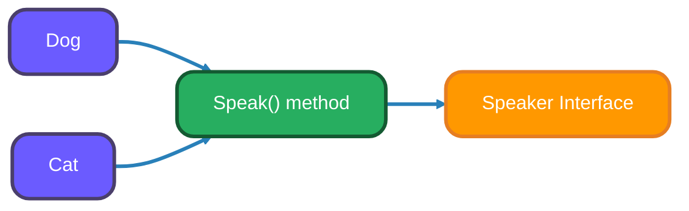
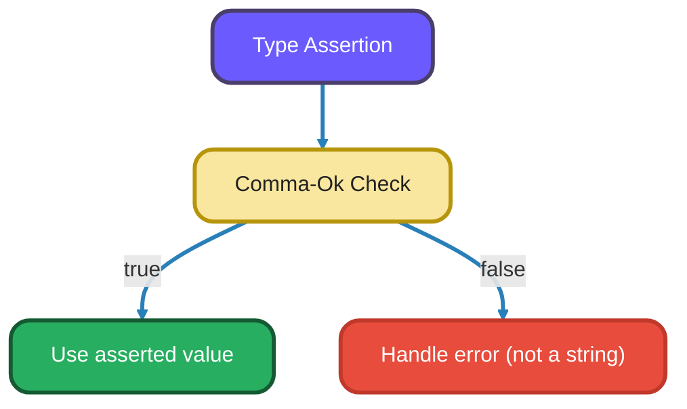
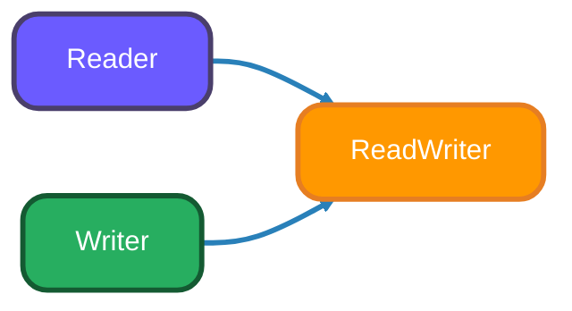

# <span style="color:#e67e22;">What we will learn in this post?</span>

<ul style='list-style-type: none; padding-left: 0;'>
<li><span style='color: #2980b9; font-size: 20px; font-weight: bold;'>👉</span> <span style='color: #2ecc71; font-size: 18px; font-weight: bold;'>Interface Basics</span></li>
<li><span style='color: #2980b9; font-size: 20px; font-weight: bold;'>👉</span> <span style='color: #2ecc71; font-size: 18px; font-weight: bold;'>Empty Interface</span></li>
<li><span style='color: #2980b9; font-size: 20px; font-weight: bold;'>👉</span> <span style='color: #2ecc71; font-size: 18px; font-weight: bold;'>Type Assertions</span></li>
<li><span style='color: #2980b9; font-size: 20px; font-weight: bold;'>👉</span> <span style='color: #2ecc71; font-size: 18px; font-weight: bold;'>Type Switches</span></li>
<li><span style='color: #2980b9; font-size: 20px; font-weight: bold;'>👉</span> <span style='color: #2ecc71; font-size: 18px; font-weight: bold;'>Common Standard Interfaces</span></li>
<li><span style='color: #2980b9; font-size: 20px; font-weight: bold;'>👉</span> <span style='color: #2ecc71; font-size: 18px; font-weight: bold;'>Interface Composition</span></li>
<li><span style='color: #2980b9; font-size: 20px; font-weight: bold;'>👉</span> <span style='color: #2ecc71; font-size: 18px; font-weight: bold;'>Polymorphism in Go</span></li>
<li><span style='color: #2980b9; font-size: 20px; font-weight: bold;'>👉</span> <span style='color: #2ecc71; font-size: 18px; font-weight: bold;'>Conclusion!</span></li>
</ul>

<!--
    Meta Description: Unlock the power of Go interfaces! Learn polymorphism, type assertions, switches, composition, and best practices for flexible Go code.
    Keywords: Go Interfaces, Polymorphism, Type Assertion, Type Switch, Interface Composition, Go Programming, Advanced Go, Interface Implementation
    -->

# <span style="color:#e67e22">Understanding Interfaces in Go 💡</span>

Interfaces in Go define a set of _methods_. Think of them as blueprints for behavior. If a type "behaves" like the interface, it _automatically_ fulfills the interface. There's no `implements` keyword needed! Go uses _implicit implementation_.

## <span style="color:#2980b9">Defining and Using Interfaces ✍️</span>

// Example: Defining Speaker interface and two types (Dog, Cat) that implement it

```go
package main

import "fmt"

type Speaker interface {
    Speak() string
}

type Dog struct {
    Name string
}

func (d Dog) Speak() string {
    return "Woof!"
}

type Cat struct {
    Name string
}

func (c Cat) Speak() string {
    return "Meow!"
}
```

## <span style="color:#2980b9">Implicit Implementation Explained 🐕‍🦺</span>

Because both `Dog` and `Cat` have a `Speak()` method that returns a string, they both implicitly implement the `Speaker` interface.

// Example: Using Speaker interface with Dog and Cat in main()

```go
package main

import "fmt"

type Speaker interface {
    Speak() string
}

type Dog struct {
    Name string
}

func (d Dog) Speak() string {
    return "Woof!"
}

type Cat struct {
    Name string
}

func (c Cat) Speak() string {
    return "Meow!"
}

func main() {
    var s Speaker

    d := Dog{Name: "Buddy"}
    c := Cat{Name: "Whiskers"}

    s = d // Dog implements Speaker
    fmt.Println(s.Speak()) // Output: Woof!

    s = c // Cat also implements Speaker
    fmt.Println(s.Speak()) // Output: Meow!
}
```

_Key takeaway_: If a type satisfies all methods defined in an interface, Go automatically considers that type an implementation of that interface.

_For more info, visit the official Go documentation on interfaces: [https://go.dev/tour/methods/9](https://go.dev/tour/methods/9)_



# <span style="color:#e67e22">The Empty Interface in Go: A Universal Container 📦</span>

In Go, the `interface{}` (or just `any` since Go 1.18) is special. Think of it like a box 🎁 that can hold _anything_! It accepts values of any type: `int`, `string`, a custom struct, you name it.

## <span style="color:#2980b9">Generic Behavior and `any`</span>

- `any` is a type alias for `interface{}` and helps us with _generic_ code. Imagine functions that need to work with different data types.
  // Example: Generic function using 'any' (interface{}) to print any value

  ```go
      package main

      import "fmt"

      func printAnything(value any) {
          fmt.Println(value)
      }
  ```

  This avoids writing separate functions for `int`, `string`, etc.

## <span style="color:#2980b9">Type Switches and `any`</span>

- We can use _type switches_ to find out the underlying type held in `any`.
  // Example: Type switch to describe the underlying type of 'any' value

  ```go
  package main

  import "fmt"

  func describe(i any) {
      switch v := i.(type) {
      case int:
          fmt.Printf("Integer: %d\n", v)
      case string:
          fmt.Printf("String: %s\n", v)
      default:
          fmt.Printf("Unknown type\n")
      }
  }
  ```

## <span style="color:#2980b9">`fmt.Println` Magic ✨</span>

- `fmt.Println` uses `any` under the hood! That's why you can pass it any variable, and it will print it out.

  ```go
  fmt.Println(42)     // Prints 42
  fmt.Println("Hello") // Prints Hello
  ```

Essentially, `any` gives Go flexibility, allowing functions to handle various data types, while type switches enable you to safely determine the type and work with it accordingly.

# <span style="color:#e67e22">Unveiling Concrete Types from Interfaces with Type Assertions 🔍</span>

Interfaces in Go are like blueprints; they define _what_ a type can do, but not _what_ it is. Sometimes, you need to know the specific type stored inside an interface to use its methods. That's where type assertions come in!

## <span style="color:#2980b9">How Type Assertions Work 🛠️</span>

A type assertion looks like this: `value.(Type)`. It checks if the interface `value` holds a concrete type `Type`.

- If it does, you get back the concrete value of that type. 🎉
- If it doesn't, and you're not careful, your program will _panic_ (crash!). 💥

## <span style="color:#2980b9">Safe Assertions: The Comma-Ok Idiom ✅</span>

To avoid panics, use the "comma-ok" idiom:

// Example: Safe type assertion using comma-ok idiom

```go
package main

import "fmt"

func main() {
    var myInterface any = "hello"
    value, ok := myInterface.(string)
    if ok {
        // value is a string! Do string things.
        fmt.Println("String value:", value)
    } else {
        // myInterface wasn't a string.
        fmt.Println("Not a string")
    }
}
```

This gives you a boolean (`ok`) indicating success. Check `ok` before using the asserted value. This code snippet is super useful to add to your knowledge base.



## <span style="color:#2980b9">Multiple Types: Switching it Up 🔄</span>

You can check for multiple types using a `switch` statement:

// Example: Type switch to check for multiple types

```go
package main

import "fmt"

func main() {
    var i interface{} = 10

    switch v := i.(type) {
    case int:
        fmt.Printf("Integer: %d\n", v)
    case string:
        fmt.Printf("String: %s\n", v)
    default:
        fmt.Printf("Unknown type\n")
    }
}
```

_This is very handy when dealing with variable types_

Here's where you can learn more:

- [Go by Example: Type Assertions](https://gobyexample.com/type-assertions)
- [Effective Go: Interfaces](https://go.dev/doc/effective_go#interfaces)

# <span style="color:#e67e22">Interface Handling with Type Switches 🚦</span>

Got an interface that can hold different data types? No sweat! Go's _type switch_ helps you handle each type specifically.

## <span style="color:#2980b9">What's a Type Switch? 🤔</span>

It's like a regular `switch` statement, but instead of comparing values, it checks the _type_ of the interface value. Think of it as asking: "Hey, what _kind_ of data are you holding?"

// Example: Type switch in a function to handle different types

```go
switch v := x.(type) { //x is an interface
case int:
    // Handle int
    fmt.Println("It's an integer!")
case string:
    // Handle string
    fmt.Println("It's a string!")
default:
    // Handle any other type
    fmt.Println("I don't know what it is!")
}
```

### <span style="color:#8e44ad">Example Time! 🎬</span>

// Example: Interface-based polymorphism with Speaker, Dog, Cat, and animalSound()

```go
package main

import "fmt"

func describe(i interface{}) {
    switch v := i.(type) {
    case int:
        fmt.Printf("Twice %v is %v\n", v, v*2)
    case string:
        fmt.Printf("%q is %v bytes long\n", v, len(v))
    default:
        fmt.Printf("I don't know about type %T!\n", v)
    }
}

func main() {
    describe(2)
    describe("Hello")
    describe(true)
}
```

- The `x.(type)` syntax is key. It gets the _concrete type_ stored in the interface `x`.
- Each `case` checks for a specific type (like `int`, `string`).
- The `default` case handles types you haven't explicitly covered.
- _Pro-Tip:_ The `v` variable holds the _value_ of the interface, type-asserted to the specific `case`'s type.

This is super useful when you need to treat different types differently, all while working with interfaces! ✨ Checkout the resources section for further learning and happy coding!

---

Resource Link:
[Go by Example: Interfaces](https://gobyexample.com/interfaces)

# <span style="color:#e67e22">Go Standard Library Interfaces: Your Friendly Guide</span> 📚

Go's standard library offers powerful interfaces for easy integration. Let's demystify a few:

## <span style="color:#2980b9">I/O Operations: Reader & Writer</span> 🖨️

- `io.Reader`: Any type with a `Read(p []byte) (n int, err error)` method. This allows you to _read_ data from the source.
  - Imagine a `Reader` as a tap: it can give you a flow of bytes.

- `io.Writer`: Any type with a `Write(p []byte) (n int, err error)` method. This allows you to _write_ data to a destination.
  - Think of a `Writer` as a container: you can pour bytes into it.

Implementing these makes your types compatible with functions expecting `io.Reader` or `io.Writer`, like file operations or network communication.

## <span style="color:#2980b9">String Conversion: Stringer</span> 💬

- `fmt.Stringer`: Any type with a `String() string` method. This lets you define a custom string representation for your type.
  - The `fmt` package then uses this method when you print your object using `%s` or `%v`.

## <span style="color:#2980b9">Error Handling: Error</span> ⚠️

- `error`: Any type with an `Error() string` method. This is the standard way to represent errors in Go.
  - Functions returning an `error` can signal success (returning `nil`) or failure (returning an error value).

By implementing these interfaces, your custom types seamlessly integrate with Go's standard library, promoting code reusability and maintainability. They are like building blocks, allowing your code to fit perfectly into the Go ecosystem.

_Useful Resources:_

1. [Effective Go](https://go.dev/doc/effective_go)
2. [A tour of go](https://go.dev/tour/welcome/1)

# <span style="color:#e67e22">Interface Composition in Go 🧩</span>

Go lets you build bigger interfaces from smaller, simpler ones. This is like using Lego bricks to create a more complex structure. You _embed_ the smaller interfaces into the larger one.



## <span style="color:#2980b9">`io.ReadWriter` Example ✍️</span>

The `io.ReadWriter` interface in Go combines the `io.Reader` and `io.Writer` interfaces.

```go
type ReadWriter interface {
    Reader
    Writer
}
```

`io.Reader` allows you to _read_ data, and `io.Writer` allows you to _write_ data. `io.ReadWriter` simply guarantees that an object implementing it can do _both_.

```go
type Reader interface {
    Read(p []byte) (n int, err error)
}

type Writer interface {
    Write(p []byte) (n int, err error)
}
```

## <span style="color:#2980b9">Building Complex Interfaces 🏗️</span>

Imagine you need an interface for something that can read, write, and close a connection:

```go
type ReadWriteCloser interface {
    Reader
    Writer
    Closer // from io package
}

type Closer interface {
    Close() error
}
```

Now any type implementing `ReadWriteCloser` _must_ implement `Read`, `Write`, and `Close` methods. This is interface composition in action! This makes code more _modular_ and _reusable_.

# <span style="color:#e67e22">Interfaces and Polymorphism in Go 💡</span>

Go doesn't have traditional inheritance, but it achieves _polymorphism_ through **interfaces**. Think of an interface as a _contract_ - it defines a set of methods. Any type that implements all those methods automatically _satisfies_ the interface.

## <span style="color:#2980b9">How it Works 🤔</span>

This lets us write functions that accept the interface type, and then we can pass in _any_ concrete type that satisfies that interface. This is polymorphism in action!

```go
package main

import "fmt"

type Speaker interface {
    Speak() string
}

type Dog struct{}
func (d Dog) Speak() string { return "Woof!" }

type Cat struct{}
func (c Cat) Speak() string { return "Meow!" }

func animalSound(s Speaker) {
    fmt.Println(s.Speak())
}

func main() {
    dog := Dog{}
    cat := Cat{}

    animalSound(dog) // Output: Woof!
    animalSound(cat) // Output: Meow!
}
```

- The `Speaker` interface defines the `Speak()` method.
- Both `Dog` and `Cat` implement `Speak()`.
- `animalSound()` accepts a `Speaker`. We can pass it _either_ a `Dog` _or_ a `Cat` because they both "are" `Speaker`s.

This makes our code flexible and reusable! We can easily add more "speaker" types without modifying `animalSound()`.

## <span style="color:#e67e22">Go Interfaces vs Java & Python: Quick Comparison Table</span>

| Feature              | Go Interface                         | Java Interface                  | Python Class/ABC                         |
| -------------------- | ------------------------------------ | ------------------------------- | ---------------------------------------- |
| Syntax               | `type MyInterface interface { ... }` | `interface MyInterface { ... }` | `class MyClass:` or `class MyABC(ABC):`  |
| Implementation       | Implicit (no keyword needed)         | Explicit (`implements` keyword) | Explicit (inheritance or ABC)            |
| Multiple Inheritance | Yes (via interface embedding)        | Yes (multiple interfaces)       | Yes (multiple base classes)              |
| Method Requirements  | All methods must be present          | All methods must be implemented | All abstract methods must be implemented |
| Type Checking        | Structural (duck typing)             | Nominal (by declaration)        | Nominal (by inheritance)                 |
| Default Methods      | No                                   | Yes (default methods allowed)   | Yes (via base class methods)             |
| Use Case Example     | Polymorphism, composition            | Polymorphism, contracts         | Polymorphism, contracts                  |
| Runtime Checks       | Type assertion/switch                | `instanceof` checks             | `isinstance()` checks                    |

_Go interfaces are lightweight and use implicit implementation, while Java and Python require explicit declarations. Go favors composition over inheritance, making code more modular and flexible._

<h1><span style='color:#e67e22'>Conclusion</span></h1>
We've reached the finish line! 🏁 I'd love to know what YOU think about everything we just discussed.  Leave your comments, questions, or suggestions below! ⬇️ Your insights are always welcome! 🤗
