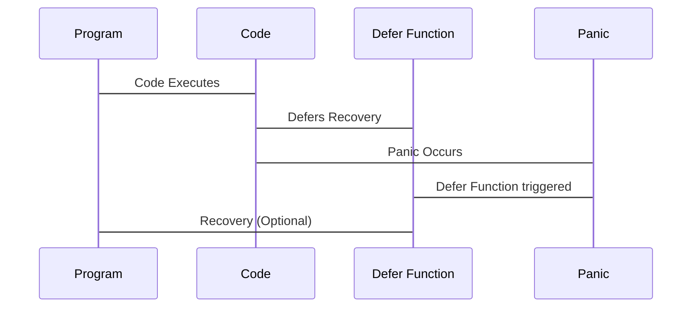

# <span style="color:#e67e22;">What we will learn in this post?</span>
<ul style='list-style-type: none; padding-left: 0;'>
<li><span style='color: #2980b9; font-size: 20px; font-weight: bold;'>👉</span> <span style='color: #2ecc71; font-size: 18px; font-weight: bold;'>The Error Interface</span></li>
<li><span style='color: #2980b9; font-size: 20px; font-weight: bold;'>👉</span> <span style='color: #2ecc71; font-size: 18px; font-weight: bold;'>Creating Custom Errors</span></li>
<li><span style='color: #2980b9; font-size: 20px; font-weight: bold;'>👉</span> <span style='color: #2ecc71; font-size: 18px; font-weight: bold;'>Error Wrapping</span></li>
<li><span style='color: #2980b9; font-size: 20px; font-weight: bold;'>👉</span> <span style='color: #2ecc71; font-size: 18px; font-weight: bold;'>Error Checking Patterns</span></li>
<li><span style='color: #2980b9; font-size: 20px; font-weight: bold;'>👉</span> <span style='color: #2ecc71; font-size: 18px; font-weight: bold;'>errors.Is and errors.As</span></li>
<li><span style='color: #2980b9; font-size: 20px; font-weight: bold;'>👉</span> <span style='color: #2ecc71; font-size: 18px; font-weight: bold;'>Panic and Recover</span></li>
<li><span style='color: #2980b9; font-size: 20px; font-weight: bold;'>👉</span> <span style='color: #2ecc71; font-size: 18px; font-weight: bold;'>Best Practices</span></li>
<li><span style='color: #2980b9; font-size: 20px; font-weight: bold;'>👉</span> <span style='color: #2ecc71; font-size: 18px; font-weight: bold;'>Conclusion!</span></li>
</ul>

Error: An error occurred while processing your request. Please try again later.

Error: An error occurred while processing your request. Please try again later.

# <span style="color:#e67e22">Understanding Error Wrapping in Go</span> 🐛

Wrapping errors in Go is like putting a package inside another package. We use it to add *context* to an error without losing the *original* error.

## <span style="color:#2980b9">Wrapping with `%w`</span> 🎁

`fmt.Errorf("%w", err)` wraps the original error `err`. The `%w` verb is crucial; it tells `fmt.Errorf` to save the original error for later inspection. This preserves the **error chain**.

```go
err := io.EOF
wrappedErr := fmt.Errorf("failed to read data: %w", err)
```

## <span style="color:#2980b9">Unwrapping with `errors.Unwrap()`</span> 📦

`errors.Unwrap(wrappedErr)` returns the original error that was wrapped. It's like opening the outer package to get to the inner one.

```go
originalErr := errors.Unwrap(wrappedErr) // originalErr is io.EOF
```

## <span style="color:#2980b9">Error Wrapping with Context</span> 📝

We use error wrapping to add useful info about *where* the error happened.

```go
func readData() error {
  // Simulate an error
  err := io.EOF
  if err != nil {
    return fmt.Errorf("readData: %w", err) // Adding context
  }
  return nil
}

func processData() error {
    err := readData()
    if err != nil{
        return fmt.Errorf("processData failed: %w", err)
    }
    return nil
}
```

Now the returned error of `processData` gives context of both the `readData` and `processData` functions in the chain.

*   **Benefits:** Makes debugging much easier!
*   **Keep in mind:** Always wrap using `%w` to preserve the original error.

```mermaid
graph LR
A[Original Error] --> B(fmt.Errorf("%w", A));
B --> C(Wrapped Error);
```

For more information, check out:

*   [Go Blog on Error Handling](https://go.dev/blog/error-handling-and-go2)
*   [Dave Cheney's Blog on Errors](https://dave.cheney.net/tag/errors)


# <span style="color:#e67e22">Error Handling in Go: A Friendly Guide ⚠️</span>

Go uses explicit error handling, meaning you, the programmer, are in charge! Let's break down the common ways to deal with errors.

## <span style="color:#2980b9">Immediate Error Checks: The `if err != nil` Pattern ✅</span>

After calling a function that *might* fail, *immediately* check if an error occurred. It's like looking both ways before crossing the street!

```go
file, err := os.Open("myfile.txt")
if err != nil {
  log.Fatal(err) // Handle the error (e.g., log it and exit)
}
defer file.Close()
```

## <span style="color:#2980b9">Handling vs. Propagating ➡️</span>

*   **Handling:** Fixing the error yourself (e.g., trying again, using a default value) or gracefully exiting.
*   **Propagating:** Passing the error "upwards" to the calling function. This is done by returning the error.

## <span style="color:#2980b9">Multiple Error Returns 🔁</span>

Go functions often return multiple values, including an error as the *last* return value. This is the standard practice.

```go
func divide(a, b int) (int, error) {
  if b == 0 {
    return 0, errors.New("cannot divide by zero")
  }
  return a / b, nil // nil means no error
}

result, err := divide(10, 2)
if err != nil {
    // Handle the error
}
```
## <span style="color:#2980b9">Example of Proper Error Flow 🌊</span>

```go
func processFile(filename string) error {
    file, err := os.Open(filename)
    if err != nil {
        return fmt.Errorf("failed to open file: %w", err) // Propagate with context
    }
    defer file.Close()

    // Perform operations on the file
    // ...
    return nil // No error occurred
}

func main() {
    err := processFile("data.txt")
    if err != nil {
        log.Println("Error:", err) // Handle the error in main
    }
}
```

**Key Takeaways:** Always check errors, decide whether to handle or propagate, and use the `if err != nil` pattern consistently.

Resource link for more info: [Effective Go - Errors](https://go.dev/doc/effective_go#errors)


# <span style="color:#e67e22">Understanding Error Handling in Go with `errors.Is()` and `errors.As()`</span> ⚠️

Go's error handling sometimes feels tricky, *especially* when dealing with wrapped errors. Let's break down `errors.Is()` and `errors.As()` using simple examples.

## <span style="color:#2980b9">`errors.Is()`: Checking for Specific Errors</span> ✅

`errors.Is()` checks if an error *anywhere* in the chain matches a target error. It's like asking, "Is this specific error *somewhere* inside this wrapped error?". Simple equality (`==`) only works if the errors are *exactly* the same.

```go
import (
	"errors"
	"fmt"
)

var ErrNotFound = errors.New("not found")

func doSomething() error {
	return fmt.Errorf("failed: %w", ErrNotFound) // Wrapping ErrNotFound
}

func main() {
	err := doSomething()
	if errors.Is(err, ErrNotFound) {
		fmt.Println("Found ErrNotFound!") // This will print!
	}
	if err == ErrNotFound {
		fmt.Println("It will never print this") // This won't print!
	}
}
```
**Resources**:
- [Go's `errors.Is()` documentation](https://pkg.go.dev/errors#Is)

## <span style="color:#2980b9">`errors.As()`: Type Assertions on Error Chains</span> 🎭

`errors.As()` checks if an error in the chain is of a specific type and assigns it to a variable. This is like saying, "Is there a specific type of error inside this wrapped error, and can I get its value?".

```go
import (
	"errors"
	"fmt"
	"os"
)

func doSomething() error {
	_, err := os.Open("nonexistent.txt")
	if err != nil {
		return fmt.Errorf("failed to open file: %w", err) // Wrapping the os.PathError
	}
	return nil
}

func main() {
	err := doSomething()
	var pathError *os.PathError
	if errors.As(err, &pathError) {
		fmt.Println("Path:", pathError.Path) // Accessing specific PathError fields
	}
}
```
**Resources**:
- [Go's `errors.As()` documentation](https://pkg.go.dev/errors#As)

Essentially, `errors.Is` checks for a specific *error value*, while `errors.As` checks for a specific *error type* within the error chain. They are invaluable when dealing with wrapped errors!


Okay, let's demystify `panic` and `recover` in Go! 🚀

# <span style="color:#e67e22">Panic and Recover in Go: Handle with Care!</span>

`panic` is Go's nuclear option. 💥 It signals a *critical*, **unrecoverable** error that halts your program instantly. Think of it as yelling "ABORT!" and quitting. Never use it for routine errors like a missing file.

## <span style="color:#2980b9">Understanding Panic and Recover</span>

`recover` is like a safety net. You use it in a `defer` statement to *potentially* catch a `panic`. It can only be used inside a `defer`red function and will recover the program from panic.
Here's the flow:



*   **Panic:** Signals a severe error.
*   **Defer:** Schedules function execution when the surrounding function exits.
*   **Recover:** Attempts to regain control after a panic within a deferred function.

## <span style="color:#2980b9">Example: Panic and Recover in Action</span>

```go
package main

import "fmt"

func mightPanic() {
    panic("Something went terribly wrong!")
}

func main() {
    defer func() {
        if r := recover(); r != nil {
            fmt.Println("Recovered from panic:", r)
        }
    }()

    fmt.Println("About to call mightPanic")
    mightPanic() //This is where Panic occurs
    fmt.Println("After mightPanic") // This line will not be executed
}
```

In this case, the code will print `Recovered from panic: Something went terribly wrong!`

### <span style="color:#8e44ad">When to Use Panic/Recover</span>

*   **NEVER** for typical error handling. Use errors and return values.
*   Use for **unrecoverable situations**:
    *   Initialization failures.
    *   Genuine programming errors.
    *   Cases where continuing would corrupt data.

🔗Resources:
*    [Official Go Blog on Panic and Recover](https://go.dev/blog/defer-panic-and-recover)
*    [Effective Go on Errors](https://go.dev/doc/effective_go#errors)

Use `panic` and `recover` sparingly, treating them as tools for exceptional circumstances. Remember that good error handling is much more reliable. 👍


# <span style="color:#e67e22">Handling Errors Like a Pro 🧑‍💻</span>

Error handling is crucial for robust software. Let's explore best practices to make your code more reliable and easier to debug!

## <span style="color:#2980b9">Different Ways to Deal with Errors</span>

Here are some common and effective ways to manage errors in your code:

*   **Sentinel Errors:**  Use predefined errors like `var ErrNotFound = errors.New("not found")`. Compare returned errors directly against these sentinels.
    *   Example:

        ```go
        if err == ErrNotFound {
            // Handle the "not found" error
        }
        ```

*   **Custom Error Types:** Create your own error types with extra information.  This allows you to provide more specific details about what went wrong. 📝
    *   For example, including the resource ID that was not found.

*   **Adding Context:** Wrap errors with context using `fmt.Errorf("failed to process data: %w", err)`. This adds layers of debugging information to your errors.

*   **Logging vs. Returning:**  Log errors for monitoring and debugging. Return errors to let calling functions handle them appropriately. 🪵 vs. 📤

## <span style="color:#2980b9">When to Shout (Panic!) and When to Whisper (Error)</span>

*   **Avoid `panic` except for truly exceptional cases**.  Panics should be reserved for situations where recovery is impossible, indicating a programming error or a catastrophic system failure.
    *   Example: If a required configuration file is missing.

```mermaid
graph LR
    A[Function Call] --> B{Error?};
    B -- Yes --> C[Return Error];
    B -- No --> D[Continue Execution];
    C --> E[Handle Error (Log, Retry, etc.)];
```

## <span style="color:#2980b9">Best Practices Summary</span>

*   *Prioritize returning errors* over panicking for better control.
*   ***Use logging*** to record error events for debugging.
*   *Enrich errors* with context for easier troubleshooting.

**Resource:**

*   [Error Handling in Go](https://go.dev/blog/error-handling-and-go2)


Okay, here are a few options for conclusion statements, each with a friendly tone, emojis, and a call to action for the comments section. Each option is formatted with the specified title and is under 150 words:

**Option 1:**

<h1><span style='color:#e67e22'>Conclusion</span></h1>

So, what do *you* think? 🤔 Did anything in this post spark an idea or a question? We'd love to hear your thoughts! Drop a comment below with your feedback, suggestions, or even just a simple "hello"! 👋 Your insights are super valuable. Let's chat! 💬

**Option 2:**

<h1><span style='color:#e67e22'>Conclusion</span></h1>

Alright, that's a wrap! 🎬 Hope you found this helpful. 😊 Now it's your turn: What are *your* experiences with this topic? Any tips you'd like to share? Leave a comment down below! 👇 We're all ears and eager to learn from you. Thanks for reading! ❤️

**Option 3:**

<h1><span style='color:#e67e22'>Conclusion</span></h1>

Thanks for hanging out with us! 🎉 We're always looking for ways to improve, so tell us: What did you like most about this post? What could we do better? Let us know in the comments! 🗣️ Your feedback is gold! ✨ Happy commenting! ✍️


