<!--
meta-description: "Comprehensive guide to error handling in Go covering error interface, custom errors, error wrapping with fmt.Errorf, errors.Is/errors.As for error inspection, panic/recover mechanisms, and production-ready best practices for building robust applications."
keywords: "Go error handling, error interface, custom errors, error wrapping, fmt.Errorf, errors.Is, errors.As, panic and recover, Go best practices, sentinel errors, error chains, error propagation, defer statement"
-->

# <span style="color:#e67e22;">What we will learn in this post?</span>
<ul style='list-style-type: none; padding-left: 0;'>
<li><span style='color: #2980b9; font-size: 20px; font-weight: bold;'>👉</span> <span style='color: #2ecc71; font-size: 18px; font-weight: bold;'>The Error Interface</span></li>
<li><span style='color: #2980b9; font-size: 20px; font-weight: bold;'>👉</span> <span style='color: #2ecc71; font-size: 18px; font-weight: bold;'>Creating Custom Errors</span></li>
<li><span style='color: #2980b9; font-size: 20px; font-weight: bold;'>👉</span> <span style='color: #2ecc71; font-size: 18px; font-weight: bold;'>Error Wrapping</span></li>
<li><span style='color: #2980b9; font-size: 20px; font-weight: bold;'>👉</span> <span style='color: #2ecc71; font-size: 18px; font-weight: bold;'>Error Checking Patterns</span></li>
<li><span style='color: #2980b9; font-size: 20px; font-weight: bold;'>👉</span> <span style='color: #2ecc71; font-size: 18px; font-weight: bold;'>errors.Is and errors.As</span></li>
<li><span style='color: #2980b9; font-size: 20px; font-weight: bold;'>👉</span> <span style='color: #2ecc71; font-size: 18px; font-weight: bold;'>Panic and Recover</span></li>
<li><span style='color: #2980b9; font-size: 20px; font-weight: bold;'>👉</span> <span style='color: #2ecc71; font-size: 18px; font-weight: bold;'>Best Practices</span></li>
<li><span style='color: #2980b9; font-size: 20px; font-weight: bold;'>👉</span> <span style='color: #2ecc71; font-size: 18px; font-weight: bold;'>Conclusion!</span></li>
</ul>

Error: An error occurred while processing your request. Please try again later.

Error: An error occurred while processing your request. Please try again later.

# <span style="color:#e67e22">Understanding Error Wrapping in Go</span> 🐛

Error wrapping in Go is a powerful technique for preserving context while maintaining the original error information. It's essential for building production-grade applications where understanding the complete error chain is critical for debugging and monitoring. By wrapping errors, you create a traceable path from where the error originated to where it was finally handled, making troubleshooting in distributed systems much more efficient.

## <span style="color:#2980b9">Wrapping with `%w`</span> 🎁

`fmt.Errorf("%w", err)` wraps the original error `err`. The `%w` verb is crucial; it tells `fmt.Errorf` to save the original error for later inspection. This preserves the **error chain**, allowing you to trace errors through multiple layers of your application stack—from database calls through business logic to HTTP handlers.

```go
err := io.EOF
wrappedErr := fmt.Errorf("failed to read data: %w", err)
```

## <span style="color:#2980b9">Unwrapping with `errors.Unwrap()`</span> 📦

`errors.Unwrap(wrappedErr)` returns the original error that was wrapped. It's like opening the outer package to get to the inner one.

```go
originalErr := errors.Unwrap(wrappedErr) // originalErr is io.EOF
```

## <span style="color:#2980b9">Error Wrapping with Context</span> 📝

We use error wrapping to add useful info about *where* the error happened. This is especially valuable in microservices architectures where errors can propagate through multiple services and need clear context at each layer.

```go
func readData() error {
  // Simulate an error
  err := io.EOF
  if err != nil {
    return fmt.Errorf("readData: %w", err) // Adding context
  }
  return nil
}

func processData() error {
    err := readData()
    if err != nil{
        return fmt.Errorf("processData failed: %w", err)
    }
    return nil
}
```

Now the returned error of `processData` gives context of both the `readData` and `processData` functions in the chain.

*   **Benefits:** Makes debugging much easier!
*   **Keep in mind:** Always wrap using `%w` to preserve the original error.


For more information, check out:

*   [Go Blog on Error Handling](https://go.dev/blog/error-handling-and-go2)

# <span style="color:#e67e22">Error Handling in Go: A Friendly Guide ⚠️</span>

Go uses explicit error handling, putting you in full control of how errors are managed throughout your application. Unlike languages with try-catch blocks, Go's approach makes error paths visible and forces developers to consciously decide how to handle each error. This explicit nature is fundamental to writing reliable, production-ready Go code where error conditions are treated as first-class citizens in your program flow.

## <span style="color:#2980b9">Immediate Error Checks: The `if err != nil` Pattern ✅</span>

After calling a function that *might* fail, *immediately* check if an error occurred. It's like looking both ways before crossing the street! This pattern is so ubiquitous in Go that it's become the language's signature style—you'll see it in every professional Go codebase, from web servers to database drivers.

```go
file, err := os.Open("myfile.txt")
if err != nil {
  log.Fatal(err) // Handle the error (e.g., log it and exit)
}
defer file.Close()
```

## <span style="color:#2980b9">Handling vs. Propagating ➡️</span>

Understanding when to handle an error versus when to propagate it up the call stack is a critical skill in Go development. In production systems, this decision affects everything from logging strategies to retry logic and graceful degradation.

*   **Handling:** Fixing the error yourself (e.g., trying again, using a default value) or gracefully exiting. Common in API endpoints where you need to return specific HTTP status codes.
*   **Propagating:** Passing the error "upwards" to the calling function. This is done by returning the error. Typical in utility functions and service layers that don't have enough context to handle errors appropriately.

## <span style="color:#2980b9">Multiple Error Returns 🔁</span>

Go functions often return multiple values, including an error as the *last* return value. This is the standard practice and enables clear separation between successful results and error conditions.

```go
func divide(a, b int) (int, error) {
  if b == 0 {
    return 0, errors.New("cannot divide by zero")
  }
  return a / b, nil // nil means no error
}

result, err := divide(10, 2)
if err != nil {
    // Handle the error
}
```

## <span style="color:#2980b9">Example of Proper Error Flow 🌊</span>

```go
func processFile(filename string) error {
    file, err := os.Open(filename)
    if err != nil {
        return fmt.Errorf("failed to open file: %w", err) // Propagate with context
    }
    defer file.Close()

    // Perform operations on the file
    // ...
    return nil // No error occurred
}

func main() {
    err := processFile("data.txt")
    if err != nil {
        log.Println("Error:", err) // Handle the error in main
    }
}
```



```mermaid
%%{init: {'theme':'base', 'themeVariables': { 'primaryColor':'#ff4f81','primaryTextColor':'#fff','primaryBorderColor':'#c43e3e','lineColor':'#e67e22','secondaryColor':'#6b5bff','tertiaryColor':'#ffd700'}}}%%
sequenceDiagram
    participant M as 🎯 Main
    participant P as ⚙️ processFile
    participant OS as 📁 os.Open
    
    Note over M,P: File Processing Flow
    M->>+P: processFile("data.txt")
    P->>+OS: Open file
    
    alt File exists
        OS-->>-P: File handle ✅
        P->>P: Process file operations
        P-->>-M: nil (success)
        Note left of M: Continue execution
    else File not found
        OS-->>P: Error ❌
        P-->>M: Wrapped error with context
        Note left of M: Log and handle error
    end
```

**Key Takeaways:** Always check errors, decide whether to handle or propagate, and use the `if err != nil` pattern consistently.

Resource link for more info: [Effective Go - Errors](https://go.dev/doc/effective_go#errors)


# <span style="color:#e67e22">Understanding Error Handling in Go with `errors.Is()` and `errors.As()`</span> ⚠️

Go's error handling becomes more sophisticated when dealing with wrapped errors in complex applications. The `errors.Is()` and `errors.As()` functions are essential tools for inspecting error chains in production systems, particularly when building microservices where errors traverse multiple layers. These functions enable type-safe error inspection without breaking the error chain, making them indispensable for robust error handling strategies.

## <span style="color:#2980b9">`errors.Is()`: Checking for Specific Errors</span> ✅

`errors.Is()` checks if an error *anywhere* in the chain matches a target error. It's like asking, "Is this specific error *somewhere* inside this wrapped error?". This is crucial in distributed systems where you need to identify specific error types (like network timeouts or database connection failures) regardless of how many layers have added context to the error.

Simple equality (`==`) only works if the errors are *exactly* the same object reference, which breaks when errors are wrapped.

```go
import (
	"errors"
	"fmt"
)

var ErrNotFound = errors.New("not found")

func doSomething() error {
	return fmt.Errorf("failed: %w", ErrNotFound) // Wrapping ErrNotFound
}

func main() {
	err := doSomething()
	if errors.Is(err, ErrNotFound) {
		fmt.Println("Found ErrNotFound!") // This will print!
	}
	if err == ErrNotFound {
		fmt.Println("It will never print this") // This won't print!
	}
}
```

### <span style="color:#8e44ad">Real-World Example: HTTP Error Handling</span>

```go
// Production-ready API error handling
var (
    ErrUnauthorized = errors.New("unauthorized access")
    ErrRateLimited  = errors.New("rate limit exceeded")
)

func handleAPIRequest(req Request) error {
    err := processRequest(req)
    
    // Check for specific errors in the chain
    if errors.Is(err, ErrUnauthorized) {
        return HTTPError{StatusCode: 401, Message: "Please login"}
    }
    if errors.Is(err, ErrRateLimited) {
        return HTTPError{StatusCode: 429, Message: "Too many requests"}
    }
    
    return err
}
```

**Resources**:
- [Go's `errors.Is()` documentation](https://pkg.go.dev/errors#Is)

## <span style="color:#2980b9">`errors.As()`: Type Assertions on Error Chains</span> 🎭

`errors.As()` checks if an error in the chain is of a specific type and assigns it to a variable. This enables accessing type-specific fields and methods, essential when you need detailed error information like file paths, network addresses, or database query details. It's the type-safe way to extract structured error data from wrapped errors.

```go
import (
	"errors"
	"fmt"
	"os"
)

func doSomething() error {
	_, err := os.Open("nonexistent.txt")
	if err != nil {
		return fmt.Errorf("failed to open file: %w", err) // Wrapping the os.PathError
	}
	return nil
}

func main() {
	err := doSomething()
	var pathError *os.PathError
	if errors.As(err, &pathError) {
		fmt.Println("Path:", pathError.Path) // Accessing specific PathError fields
		fmt.Println("Operation:", pathError.Op)
	}
}
```

### <span style="color:#8e44ad">Real-World Example: Database Error Recovery</span>

```go
// Handling specific database errors in production
func handleDatabaseError(err error) {
    var netErr *net.OpError
    if errors.As(err, &netErr) {
        if netErr.Timeout() {
            // Retry logic for timeout errors
            log.Println("Database timeout, retrying...")
            return
        }
    }
    
    var sqlErr *mysql.MySQLError
    if errors.As(err, &sqlErr) {
        if sqlErr.Number == 1062 { // Duplicate entry
            log.Println("Duplicate key, handling gracefully...")
            return
        }
    }
}
```


**Resources**:
- [Go's `errors.As()` documentation](https://pkg.go.dev/errors#As)

Essentially, `errors.Is` checks for a specific *error value*, while `errors.As` checks for a specific *error type* within the error chain. They are invaluable when dealing with wrapped errors in production systems!


# <span style="color:#e67e22">Panic and Recover in Go: Handle with Care!</span>

`panic` is Go's nuclear option. 💥 It signals a *critical*, **unrecoverable** error that halts your program instantly, unwinding the stack and executing deferred functions along the way. Think of it as the programming equivalent of hitting the emergency stop button—it should only be used when continuing execution would lead to data corruption or undefined behavior. In production systems, panics are typically reserved for initialization failures or programmer errors, never for expected error conditions like network timeouts or user input validation.

## <span style="color:#2980b9">Understanding Panic and Recover</span>

`recover` is like a safety net strategically placed to catch falls. You use it in a `defer` statement to *potentially* catch a `panic` and regain control of your program. This mechanism is crucial in production servers where a panic in one goroutine shouldn't crash the entire application. It can only be used inside a `defer`red function and will recover the program from panic, allowing graceful shutdown or error logging.

Here's the flow:

```mermaid
%%{init: {'theme':'base', 'themeVariables': { 'primaryColor':'#ff4f81','primaryTextColor':'#fff','primaryBorderColor':'#c43e3e','lineColor':'#e67e22','secondaryColor':'#6b5bff','tertiaryColor':'#ffd700'}}}%%
sequenceDiagram
    participant P as 🚀 Program
    participant C as ⚙️ Code Execution
    participant D as 🛡️ Defer Function
    participant Panic as 💥 Panic
    
    Note over P,C: Normal Execution
    P->>C: Execute code
    C->>D: Register defer with recover()
    
    Note over C,Panic: Critical Error!
    C->>Panic: panic("error message")
    Panic->>Panic: Stack unwinding begins
    
    Note over Panic,D: Deferred functions execute
    Panic->>D: Trigger deferred function
    D->>D: Call recover()
    
    alt Recovery successful
        D-->>P: Return control ✅
        Note left of P: Program continues
    else No recovery
        Panic-->>P: Program terminates ❌
        Note left of P: Exit with stack trace
    end
```



*   **Panic:** Signals a severe error—program cannot continue safely.
*   **Defer:** Schedules function execution when the surrounding function exits (LIFO order).
*   **Recover:** Attempts to regain control after a panic within a deferred function only.

## <span style="color:#2980b9">Example: Panic and Recover in Action</span>

```go
package main

import "fmt"

func mightPanic() {
    panic("Something went terribly wrong!")
}

func main() {
    defer func() {
        if r := recover(); r != nil {
            fmt.Println("Recovered from panic:", r)
        }
    }()

    fmt.Println("About to call mightPanic")
    mightPanic() //This is where Panic occurs
    fmt.Println("After mightPanic") // This line will not be executed
}
```

In this case, the code will print `Recovered from panic: Something went terribly wrong!`

### <span style="color:#8e44ad">Real-World Example: HTTP Server Protection</span>

```go
// Production-ready middleware for HTTP handlers
func recoverMiddleware(next http.Handler) http.Handler {
    return http.HandlerFunc(func(w http.ResponseWriter, r *http.Request) {
        defer func() {
            if err := recover(); err != nil {
                // Log the panic with stack trace
                log.Printf("Panic recovered: %v\n%s", err, debug.Stack())
                
                // Return 500 error to client
                http.Error(w, "Internal Server Error", http.StatusInternalServerError)
                
                // Send alert to monitoring system
                alerting.SendPanicAlert(err)
            }
        }()
        
        next.ServeHTTP(w, r)
    })
}
```

### <span style="color:#8e44ad">When to Use Panic/Recover</span>

*   **NEVER** for typical error handling. Use errors and return values for expected conditions.
*   Use for **unrecoverable situations**:
    *   Initialization failures (config file missing, database connection impossible).
    *   Genuine programming errors (array index out of bounds, nil pointer dereference).
    *   Cases where continuing would corrupt data or violate invariants.
*   **Production use cases:**
    *   Protecting HTTP handlers from crashing the entire server
    *   Worker pool implementations where one worker shouldn't kill all workers
    *   Plugin systems where third-party code might panic


🔗Resources:
*    [Official Go Blog on Panic and Recover](https://go.dev/blog/defer-panic-and-recover)

Use `panic` and `recover` sparingly, treating them as tools for exceptional circumstances. Remember that good error handling is much more reliable. 👍


# <span style="color:#e67e22">Handling Errors Like a Pro 🧑‍💻</span>

Error handling is crucial for building robust, production-grade software that can withstand real-world conditions. These best practices come from years of Go development in high-scale systems—from Google's infrastructure to cloud-native applications—and following them will make your code more reliable, maintainable, and easier to debug when things go wrong. Proper error handling is what separates hobby projects from enterprise-ready applications.

## <span style="color:#2980b9">Different Ways to Deal with Errors</span>

Here are common and effective patterns used in production Go applications across the industry:

*   **Sentinel Errors:**  Use predefined errors like `var ErrNotFound = errors.New("not found")`. Compare returned errors directly against these sentinels. This pattern is widely used in standard library packages like `io.EOF` and database drivers.
    *   Example:

        ```go
        if err == ErrNotFound {
            // Handle the "not found" error
        }
        ```

*   **Custom Error Types:** Create your own error types with extra information using structs that implement the `error` interface. This allows you to provide more specific details about what went wrong, essential for debugging production issues. 📝
    *   Real-world example:

        ```go
        type ValidationError struct {
            Field   string
            Message string
        }
        
        func (e *ValidationError) Error() string {
            return fmt.Sprintf("validation failed on %s: %s", e.Field, e.Message)
        }
        
        // Usage in API validation
        if len(user.Email) == 0 {
            return &ValidationError{Field: "email", Message: "required field"}
        }
        ```

*   **Adding Context:** Wrap errors with context using `fmt.Errorf("failed to process data: %w", err)`. This adds layers of debugging information to your errors, creating a breadcrumb trail from the original error to where it was handled. Critical in microservices where errors cross service boundaries.

*   **Logging vs. Returning:**  Log errors for monitoring and debugging (with appropriate log levels). Return errors to let calling functions handle them appropriately. 🪵 vs. 📤
    *   **Log when:** You handle the error and want observability
    *   **Return when:** The caller has more context to decide how to handle it

### <span style="color:#8e44ad">Production-Ready Error Handling Example</span>

```go
// E-commerce order processing with comprehensive error handling
type OrderError struct {
    OrderID string
    Step    string
    Err     error
}

func (e *OrderError) Error() string {
    return fmt.Sprintf("order %s failed at %s: %v", e.OrderID, e.Step, e.Err)
}

func processOrder(orderID string) error {
    // Payment processing
    if err := chargePayment(orderID); err != nil {
        return &OrderError{
            OrderID: orderID,
            Step:    "payment",
            Err:     err,
        }
    }
    
    // Inventory check
    if err := reserveInventory(orderID); err != nil {
        // Log for monitoring
        log.WithFields(log.Fields{
            "order_id": orderID,
            "step":     "inventory",
        }).Error("inventory reservation failed")
        
        // Return wrapped error for caller
        return fmt.Errorf("order processing failed: %w", err)
    }
    
    return nil
}
```

## <span style="color:#2980b9">When to Shout (Panic!) and When to Whisper (Error)</span>

*   **Avoid `panic` except for truly exceptional cases**.  Panics should be reserved for situations where recovery is impossible, indicating a programming error or a catastrophic system failure that makes continuing unsafe.
    *   ✅ **Panic when:** Configuration file is malformed at startup, required environment variable missing
    *   ❌ **Never panic for:** Network timeouts, database errors, user input validation, file not found


## <span style="color:#2980b9">Best Practices Summary</span>

*   *Prioritize returning errors* over panicking for better control and testability.
*   ***Use logging*** with structured fields to record error events for debugging and monitoring.
*   *Enrich errors* with context using `fmt.Errorf` and `%w` for easier troubleshooting.
*   **Define sentinel errors** at package level for common error conditions.
*   **Create custom error types** when you need to attach structured data.
*   **Use `errors.Is` and `errors.As`** instead of direct comparison for wrapped errors.
*   **Never ignore errors**—at minimum, log them for observability.


<h1><span style='color:#e67e22'>Conclusion</span></h1>

Error handling in Go is explicit and deliberate—a design choice that makes your code more reliable and maintainable. By mastering the `error` interface, custom error types, `fmt.Errorf` wrapping with `%w`, and the `errors.Is/As` helpers, you can build production-ready applications that fail gracefully and provide actionable debugging information. Remember: good error handling isn't just about catching errors—it's about providing context, enabling recovery, and making your future self's debugging sessions easier. Apply these patterns consistently, and your Go applications will be more robust and easier to maintain in production.

Thanks for hanging out with us! 🎉 We're always looking for ways to improve, so tell us: What did you like most about this post? What could we do better? Let us know in the comments! 🗣️ Your feedback is gold! ✨ Happy commenting! ✍️


