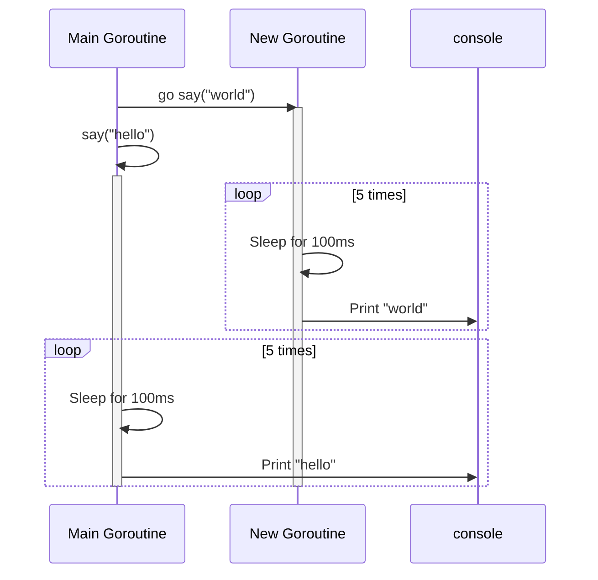
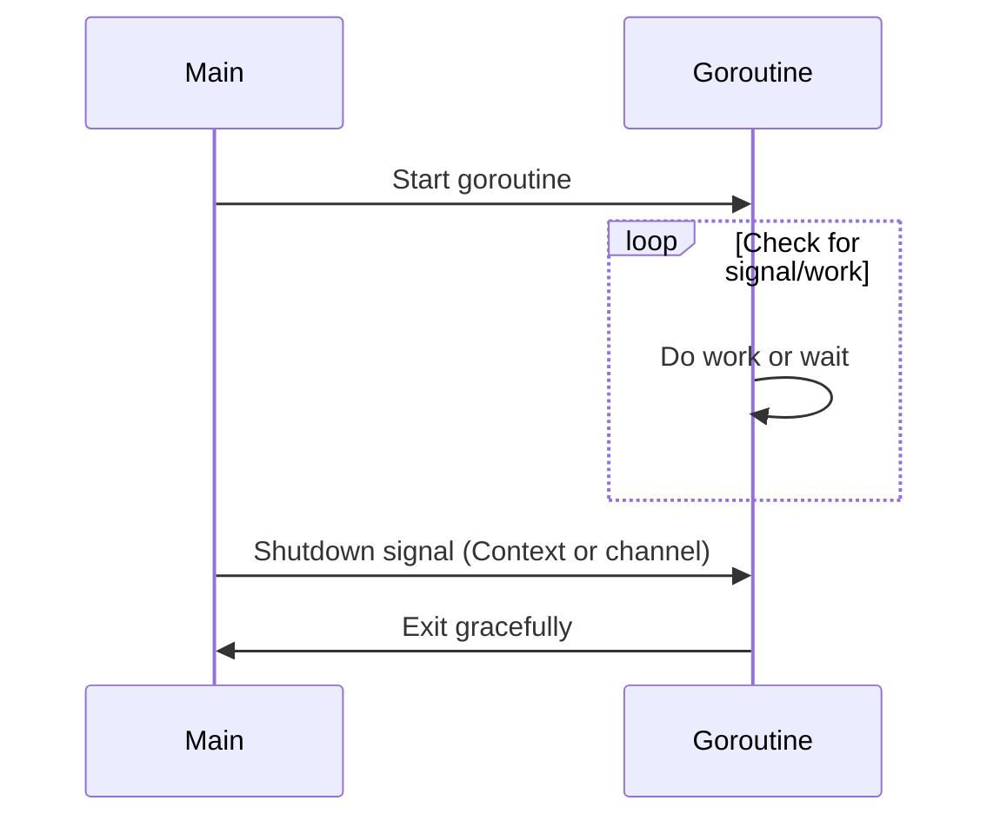

# <span style="color:#e67e22;">What we will learn in this post?</span>
<ul style='list-style-type: none; padding-left: 0;'>
<li><span style='color: #2980b9; font-size: 20px; font-weight: bold;'>👉</span> <span style='color: #2ecc71; font-size: 18px; font-weight: bold;'>Introduction to Goroutines</span></li>
<li><span style='color: #2980b9; font-size: 20px; font-weight: bold;'>👉</span> <span style='color: #2ecc71; font-size: 18px; font-weight: bold;'>Creating Goroutines</span></li>
<li><span style='color: #2980b9; font-size: 20px; font-weight: bold;'>👉</span> <span style='color: #2ecc71; font-size: 18px; font-weight: bold;'>Goroutine Scheduling</span></li>
<li><span style='color: #2980b9; font-size: 20px; font-weight: bold;'>👉</span> <span style='color: #2ecc71; font-size: 18px; font-weight: bold;'>WaitGroups</span></li>
<li><span style='color: #2980b9; font-size: 20px; font-weight: bold;'>👉</span> <span style='color: #2ecc71; font-size: 18px; font-weight: bold;'>Race Conditions</span></li>
<li><span style='color: #2980b9; font-size: 20px; font-weight: bold;'>👉</span> <span style='color: #2ecc71; font-size: 18px; font-weight: bold;'>Goroutine Best Practices</span></li>
<li><span style='color: #2980b9; font-size: 20px; font-weight: bold;'>👉</span> <span style='color: #2ecc71; font-size: 18px; font-weight: bold;'>Conclusion!</span></li>
</ul>

# <span style="color:#e67e22">Go Routines: Concurrent Magic 🪄</span>

Go routines are like **super lightweight threads** managed by the Go runtime. Think of them as mini-tasks your program can run "at the same time." Unlike regular OS threads, Go doesn't create a separate OS thread for every routine. Instead, it cleverly *multiplexes* many goroutines onto a smaller number of OS threads. This makes them much more efficient! 🚀

## <span style="color:#2980b9">The 'go' Keyword 🏁</span>

Launching a goroutine is easy! Just prefix a function call with the `go` keyword:

```go
package main

import (
	"fmt"
	"time"
)

func say(s string) {
	for i := 0; i < 5; i++ {
		time.Sleep(100 * time.Millisecond)
		fmt.Println(s)
	}
}

func main() {
	go say("world") // Launch a new goroutine
	say("hello")      // Main goroutine
}
```

This code creates two concurrent execution paths. The `say("world")` function runs in a new goroutine, while `say("hello")` runs in the main one. Because the `say("world")` function call is prefixed with the `go` keyword, it doesn't halt the main goroutine. The program starts the goroutine and immediately continues to the next line of code.

### <span style="color:#8e44ad">Concurrent execution</span>
Because these functions are executing in different goroutines concurrently, both say functions are operating at the same time!



*   Goroutines are cheap to create and destroy.
*   Go manages them efficiently, distributing them across available OS threads.

**More Info:** For deeper exploration, check out [Go Concurrency Patterns](https://go.dev/tour/concurrency/1) and [Effective Go on Concurrency](https://go.dev/doc/effective_go#concurrency).


Here's a friendly guide to Goroutines:

# <span style="color:#e67e22">Go Concurrency with Goroutines 🚀</span>

Goroutines are lightweight, concurrent functions in Go. Think of them as tiny, independent workers! You can launch them with both anonymous and named functions.

## <span style="color:#2980b9">Creating Goroutines</span>

*   **Anonymous Functions:** Start a goroutine by using the `go` keyword followed by an anonymous function.

    ```go
    go func() {
        // Your code here
        fmt.Println("Hello from a goroutine!")
    }() //Don't forget the trailing parentheses to invoke the anonymous function
    ```

*   **Named Functions:** Similarly, `go` can launch a regular, named function.

    ```go
    func myFunc() {
        fmt.Println("Hello from a named function goroutine!")
    }

    go myFunc()
    ```

## <span style="color:#2980b9">Goroutine Lifecycle ⏳</span>

Goroutines are like threads, but more efficient. They run concurrently with the main program. They start when launched, execute their code, and finish. The main program *doesn't* wait for them unless told to.

## <span style="color:#2980b9">Multiple Goroutines & Closure Capture 👯</span>

Here's how to launch a bunch:

```go
import "fmt"
import "time"

func main() {
    for i := 0; i < 5; i++ {
        go func(j int) { // Pass 'i' as 'j' to capture the value.
            fmt.Println("Goroutine", j)
        }(i)
    }
    time.Sleep(time.Second) // Give goroutines time to complete.
}
```

*Important:* Be careful when capturing variables in closures. The goroutine might run *after* the loop finishes, and `i` might have changed! Pass the loop variable as an argument to the function to avoid this issue. Always pass loop variables *as parameters* to the goroutine function.

**Resources:**

*   [Go Concurrency Patterns](https://go.dev/tour/concurrency/1)
*   [Effective Go - Concurrency](https://go.dev/doc/effective_go#concurrency)


# <span style="color:#e67e22">Go Scheduler: A Quick Dive 🤿</span>

Go's scheduler is a clever system that manages `goroutines`, which are like lightweight threads. It uses an **M:N scheduling model**. This means many (M) goroutines can run on a smaller number of (N) operating system threads.

## <span style="color:#2980b9">GOMAXPROCS and Parallelism ⚙️</span>

`GOMAXPROCS` sets the maximum number of OS threads that can *simultaneously* execute Go code. Increasing it can boost *parallelism* on multi-core machines.

## <span style="color:#2980b9">Goroutine Multiplexing: Sharing the Stage 🎭</span>

Goroutines are *multiplexed* onto OS threads. This means they take turns running. The Go scheduler efficiently switches between them.

### <span style="color:#8e44ad">Scheduling Types: Cooperative vs. Preemptive 🤔</span>

*   **Cooperative Scheduling:** Goroutines *voluntarily* give up control. Older Go versions relied on this.
*   **Preemptive Scheduling:** Go *forces* goroutines to yield, preventing long-running tasks from hogging the CPU. Modern Go uses this, improving fairness.

```mermaid
graph LR
    A[Goroutines (M)] --> B(Go Scheduler);
    B --> C[OS Threads (N)];
    style A fill:#f9f,stroke:#333,stroke-width:2px
    style C fill:#ccf,stroke:#333,stroke-width:2px
```

**Resource Links:**

*   [Go Concurrency Patterns](https://go.dev/tour/concurrency/1)
*   [Go Scheduler](https://www.ardanlabs.com/blog/2018/08/scheduling-in-go-part2-scheduler/)


# <span style="color:#e67e22">Coordinating Goroutines with `sync.WaitGroup` 🤝</span>

The `sync.WaitGroup` in Go is a simple yet powerful tool for waiting for a collection of goroutines to finish. Think of it like a counter.

## <span style="color:#2980b9">How It Works: Three Key Methods</span>

*   `Add(delta int)`:  Increments the counter.  You usually call this _before_ launching a goroutine to signal that more work is starting.

*   `Done()`:  Decrements the counter.  A goroutine calls this when it's finished its job. *Crucially, this reduces the `WaitGroup` counter*.

*   `Wait()`:  Blocks until the counter is zero.  This is called by the main goroutine (or any goroutine that needs to wait for others) to ensure all tasks are complete before proceeding.

## <span style="color:#2980b9">Practical Example: Waiting for Task Completion ✅</span>

```go
package main

import (
	"fmt"
	"sync"
	"time"
)

func main() {
	var wg sync.WaitGroup // Creates a waitgroup

	tasks := []string{"Task 1", "Task 2", "Task 3"}

	wg.Add(len(tasks)) // Initialize with number of tasks

	for _, task := range tasks {
		go func(t string) {
			defer wg.Done() // Decrement counter when done
			fmt.Println("Starting", t)
			time.Sleep(time.Second) // Simulate some work
			fmt.Println("Finished", t)
		}(task)
	}

	wg.Wait() // Wait for all tasks to finish
	fmt.Println("All tasks completed!")
}
```

**Explanation:**

1.  We create a `WaitGroup`.
2.  We add the number of tasks to the counter *before* starting the goroutines.
3.  Each goroutine calls `Done()` when it finishes. Using `defer` ensures this happens even if the goroutine panics.
4.  `Wait()` blocks until all goroutines have called `Done()` enough times to bring the counter back to zero.

*Resource link for more info on the topic [Official Go Documentation](https://pkg.go.dev/sync#WaitGroup)*


# <span style="color:#e67e22">Race Conditions in Go: Unveiling Concurrency Hazards 🚦</span>

Imagine multiple cooks 👩‍🍳👨‍🍳 trying to update the same recipe book 📖 at the same time, without coordinating. That's similar to a **race condition** in Go, where multiple *goroutines* access shared data concurrently without *synchronization*. This can lead to unpredictable and incorrect results.

## <span style="color:#2980b9">The Peril of Unsynchronized Access 😨</span>

When goroutines read and write to the same memory location simultaneously, the order of operations becomes non-deterministic.

*   **Example:** Let's say we have a counter incremented by multiple goroutines.

    ```go
    package main

    import (
    	"fmt"
    	"sync"
    )

    var counter int = 0
    var wg sync.WaitGroup

    func increment() {
    	defer wg.Done()
    	for i := 0; i < 1000; i++ {
    		counter++ // Data race!
    	}
    }

    func main() {
    	wg.Add(2)
    	go increment()
    	go increment()
    	wg.Wait()
    	fmt.Println("Counter:", counter) // Usually not 2000
    }
    ```

*   Without synchronization, `counter++` (read-modify-write) can be interrupted, leading to lost updates.

## <span style="color:#2980b9">Detecting Races with 'go run -race' 🕵️‍♀️</span>

Go provides a powerful tool for detecting race conditions: the `-race` flag.

*   Run your code with `go run -race main.go`. If a race is detected, the tool will print a detailed report, pointing you to the problematic code.

## <span style="color:#2980b9">Why Race Detection Matters Urgently 🚨</span>

*   Race conditions can cause subtle and difficult-to-debug errors.
*   They might not appear consistently, making them hard to reproduce.
*   The `-race` flag helps you catch these issues early, preventing potential bugs in production.
*   Using `-race` in CI/CD is highly recommended.

For more details on synchronization techniques to avoid race conditions, see resources like:
*   [Effective Go](https://go.dev/doc/effective_go#concurrency)
*   [Go Concurrency Patterns: Context](https://go.dev/tour/concurrency/1)


# <span style="color:#e67e22">Goroutine Management: A Friendly Guide 🚀</span>

It's super important to manage your goroutines well in Go to avoid problems! Let's talk about some best practices in a simple way.

## <span style="color:#2980b9">Keeping Things Clean & Tidy 🧹</span>

*   **Avoid Goroutine Leaks:** Make sure *every* goroutine can exit. If a goroutine waits forever (e.g., on a channel), it's a leak. Use `select` with a `default` case or a timeout.

    ```go
    select {
    case msg := <-ch:
        fmt.Println("Received:", msg)
    case <-time.After(time.Second):
        fmt.Println("Timeout! Exiting.")
        return // Important to exit the goroutine
    }
    ```

*   **Proper Shutdown:** Use a `context.Context` for canceling goroutines. When the context is canceled, your goroutines should exit gracefully. See [Context documentation](https://pkg.go.dev/context) for details.

    ```go
    ctx, cancel := context.WithCancel(context.Background())
    go myWorker(ctx)

    // Later, to signal shutdown:
    cancel()
    ```

*   **Limit Goroutines:** Don't create *unlimited* goroutines. Use a worker pool. You can use `sync.WaitGroup` to manage a pool of workers. See [Worker Pool Pattern](https://gobyexample.com/worker-pools)

    ```go
    var wg sync.WaitGroup
    numWorkers := 10

    for i := 0; i < numWorkers; i++ {
        wg.Add(1)
        go func() {
            defer wg.Done()
            // Your worker code here
        }()
    }

    wg.Wait() // Wait for all workers to finish
    ```

*   **Shutdown Signals:** Use channels to communicate shutdown signals to goroutines.

    ```go
    quit := make(chan struct{})
    go func() {
        for {
            select {
            case <-quit:
                fmt.Println("Exiting goroutine")
                return
            default:
                // Do some work
            }
        }
    }()

    // Later, to signal shutdown:
    close(quit)
    ```

## <span style="color:#2980b9">Example Flowchart 🗺️</span>


By following these practices, you can write Go programs that are reliable, efficient, and easy to manage! 😊


Okay, here are a few options for your conclusion statement, each formatted as requested and under 150 words:

**Option 1:**

<h1><span style='color:#e67e22'>Conclusion</span></h1>

And that's a wrap! 🎉 We hope you enjoyed diving into this topic with us. We're super curious to hear your thoughts, experiences, or maybe even some alternative viewpoints! Don't be shy; drop a comment below. We're all ears (and eyes 👀) and love hearing from you! What did you think? 🤔

**Option 2:**

<h1><span style='color:#e67e22'>Conclusion</span></h1>

So there you have it! We've covered a lot today. What are your biggest takeaways? ✍️ Did anything particularly resonate with you? We'd love for you to share your comments, feedback, or suggestions in the section below! Let's keep the conversation going! 👇 Your insights are valuable! 😊

**Option 3:**

<h1><span style='color:#e67e22'>Conclusion</span></h1>

Alright, folks, that brings us to the end! We put a lot of heart into this, and we truly hope you found it helpful! Now it's your turn! 🤩 What are your thoughts? Got any questions? Suggestions? Leave a comment below! We can't wait to read them! 💖 Let's chat! 💬


