```mermaid
%%{init: {'theme':'base', 'themeVariables': { 'primaryColor':'#ff4f81','primaryTextColor':'#fff','primaryBorderColor':'#c43e3e','lineColor':'#e67e22','secondaryColor':'#6b5bff','tertiaryColor':'#ffd700'}}}%%
graph TD
    Code["Your Go Code"]:::pink --> Build{"go build -race"}:::gold
    
    Build -->|"With -race flag"| Race["Race Detector Active"]:::purple
    Build -->|"Normal build"| NoRace["No Race Detection"]:::gray
    
    Race --> Run["Run Application"]:::teal
    
    Run --> Check{"Race Detected?"}:::gold
    
    Check -->|"Yes"| Report["Detailed Report:<br/>• File & line numbers<br/>• Goroutine stack traces<br/>• Memory address"]:::orange
    Check -->|"No"| Pass["Tests Pass ✅"]:::green
    
    Report --> Fix["Add Mutex/Channel<br/>Synchronization"]:::purple
    Fix --> Build
    
    NoRace --> Danger["❌ Silent Bugs<br/>May occur in production"]:::red
    
    classDef pink fill:#ff4f81,stroke:#c43e3e,color:#ffffff,font-size:13px,stroke-width:3px,rx:12;
    classDef purple fill:#6b5bff,stroke:#4a3f6b,color:#ffffff,font-size:13px,stroke-width:3px,rx:12;
    classDef gold fill:#ffd700,stroke:#d99120,color:#000000,font-size:13px,stroke-width:3px,rx:12;
    classDef teal fill:#00bfae,stroke:#005f99,color:#ffffff,font-size:13px,stroke-width:3px,rx:12;
    classDef orange fill:#ff9800,stroke:#f57c00,color:#ffffff,font-size:13px,stroke-width:3px,rx:12;
    classDef green fill:#43e97b,stroke:#38f9d7,color:#000000,font-size:13px,stroke-width:3px,rx:12;
    classDef gray fill:#757575,stroke:#424242,color:#ffffff,font-size:13px,stroke-width:3px,rx:12;
    classDef red fill:#e74c3c,stroke:#c0392b,color:#ffffff,font-size:13px,stroke-width:3px,rx:12;
    
    linkStyle default stroke:#e67e22,stroke-width:3px;
```

<!--
meta-description: "Master Go concurrency with goroutines, WaitGroups, and race condition detection. Learn how Go's lightweight concurrency model enables high-performance parallel processing, proper synchronization techniques, and production-ready concurrent patterns for scalable applications."
keywords: "Go goroutines, Go concurrency, goroutine scheduling, sync.WaitGroup, race conditions, Go parallelism, GOMAXPROCS, concurrent programming, Go scheduler, goroutine best practices, preemptive scheduling, cooperative scheduling, goroutine leaks, context cancellation, worker pools"
-->

# <span style="color:#e67e22;">What we will learn in this post?</span>
<ul style='list-style-type: none; padding-left: 0;'>
<li><span style='color: #2980b9; font-size: 20px; font-weight: bold;'>👉</span> <span style='color: #2ecc71; font-size: 18px; font-weight: bold;'>Introduction to Goroutines</span></li>
<li><span style='color: #2980b9; font-size: 20px; font-weight: bold;'>👉</span> <span style='color: #2ecc71; font-size: 18px; font-weight: bold;'>Creating Goroutines</span></li>
<li><span style='color: #2980b9; font-size: 20px; font-weight: bold;'>👉</span> <span style='color: #2ecc71; font-size: 18px; font-weight: bold;'>Goroutine Scheduling</span></li>
<li><span style='color: #2980b9; font-size: 20px; font-weight: bold;'>👉</span> <span style='color: #2ecc71; font-size: 18px; font-weight: bold;'>WaitGroups</span></li>
<li><span style='color: #2980b9; font-size: 20px; font-weight: bold;'>👉</span> <span style='color: #2ecc71; font-size: 18px; font-weight: bold;'>Race Conditions</span></li>
<li><span style='color: #2980b9; font-size: 20px; font-weight: bold;'>👉</span> <span style='color: #2ecc71; font-size: 18px; font-weight: bold;'>Goroutine Best Practices</span></li>
<li><span style='color: #2980b9; font-size: 20px; font-weight: bold;'>👉</span> <span style='color: #2ecc71; font-size: 18px; font-weight: bold;'>Conclusion!</span></li>
</ul>

# <span style="color:#e67e22">Go Routines: Concurrent Magic 🪄</span>

Goroutines are Go's lightweight concurrency primitives starting with just 2-4 KB of memory versus 1-2 MB for OS threads. They enable scalable applications handling millions of concurrent operations, powering production systems at Google, Uber, and Netflix.

## <span style="color:#2980b9">The 'go' Keyword 🏁</span>

Launching a goroutine is easy! Just prefix a function call with the `go` keyword:

```go
package main

import (
	"fmt"
	"time"
)

func say(s string) {
	for i := 0; i < 5; i++ {
		time.Sleep(100 * time.Millisecond)
		fmt.Println(s)
	}
}

func main() {
	go say("world") // Launch a new goroutine
	say("hello")      // Main goroutine
}
```

This code creates two concurrent execution paths. The `say("world")` function runs in a new goroutine, while `say("hello")` runs in the main one. Because the `say("world")` function call is prefixed with the `go` keyword, it doesn't halt the main goroutine. The program starts the goroutine and immediately continues to the next line of code.

### <span style="color:#8e44ad">Concurrent execution</span>
Because these functions are executing in different goroutines concurrently, both say functions are operating at the same time!

```mermaid
%%{init: {'theme':'base', 'themeVariables': { 'primaryColor':'#2c3e50','primaryTextColor':'#ecf0f1','primaryBorderColor':'#e74c3c','lineColor':'#16a085','secondaryColor':'#8e44ad','tertiaryColor':'#f39c12','signalColor':'#16a085','signalTextColor':'#16a085','labelTextColor':'#16a085','loopTextColor':'#16a085','noteBkgColor':'#34495e','noteTextColor':'#ecf0f1','activationBkgColor':'#3498db','activationBorderColor':'#2980b9','sequenceNumberColor':'#ecf0f1'}}}%%
sequenceDiagram
    participant Main as 🎯 Main Goroutine
    participant New as ⚡ New Goroutine
    
    Note over Main,New: Concurrent Execution Begins
    Main->>+New: go say("world")
    Main->>Main: say("hello") starts
    
    loop 5 iterations
        New->>New: Sleep 100ms
        New->>New: Print "world"
    end
    
    loop 5 iterations  
        Main->>Main: Sleep 100ms
        Main->>Main: Print "hello"
    end
    
    Note over Main,New: Both complete independently ✅
    deactivate New
```



*   Goroutines are cheap to create and destroy.
*   Go manages them efficiently, distributing them across available OS threads.

**More Info:** For deeper exploration, check out [Go Concurrency Patterns](https://go.dev/tour/concurrency/1) and [Effective Go on Concurrency](https://go.dev/doc/effective_go#concurrency).

# <span style="color:#e67e22">Go Concurrency with Goroutines 🚀</span>

Goroutines enable scalable applications handling thousands of concurrent operations efficiently, powering web servers, real-time streaming platforms, and distributed systems.

## <span style="color:#2980b9">Creating Goroutines</span>

*   **Anonymous Functions:** Start a goroutine by using the `go` keyword followed by an anonymous function.

    ```go
    go func() {
        // Your code here
        fmt.Println("Hello from a goroutine!")
    }() //Don't forget the trailing parentheses to invoke the anonymous function
    ```

*   **Named Functions:** Similarly, `go` can launch a regular, named function.

    ```go
    func myFunc() {
        fmt.Println("Hello from a named function goroutine!")
    }

    go myFunc()
    ```

## <span style="color:#2980b9">Goroutine Lifecycle ⏳</span>

Goroutines run independently and don't block main program execution. The main program won't automatically wait for goroutines—proper synchronization prevents premature termination.

## <span style="color:#2980b9">Multiple Goroutines & Closure Capture 👯</span>

Here's how to launch a bunch:

```go
import "fmt"
import "time"

func main() {
    for i := 0; i < 5; i++ {
        go func(j int) { // Pass 'i' as 'j' to capture the value.
            fmt.Println("Goroutine", j)
        }(i)
    }
    time.Sleep(time.Second) // Give goroutines time to complete.
}
```

*Important:* Be careful when capturing variables in closures. The goroutine might run *after* the loop finishes, and `i` might have changed! Pass the loop variable as an argument to the function to avoid this issue. Always pass loop variables *as parameters* to the goroutine function.

# <span style="color:#e67e22">Go Scheduler: A Quick Dive 🤿</span>

Go's M:N scheduler multiplexes many goroutines (M) onto fewer OS threads (N), enabling efficient management of millions of goroutines with minimal memory overhead and excellent CPU utilization across multi-core systems.

## <span style="color:#2980b9">GOMAXPROCS and Parallelism ⚙️</span>

`GOMAXPROCS` sets the maximum number of OS threads that can *simultaneously* execute Go code. Increasing it can boost *parallelism* on multi-core machines.

## <span style="color:#2980b9">Goroutine Multiplexing: Sharing the Stage 🎭</span>

Goroutines are *multiplexed* onto OS threads. This means they take turns running. The Go scheduler efficiently switches between them.

### <span style="color:#8e44ad">Scheduling Types: Cooperative vs. Preemptive 🤔</span>

*   **Cooperative Scheduling:** Goroutines *voluntarily* give up control. Older Go versions relied on this.
*   **Preemptive Scheduling:** Go *forces* goroutines to yield, preventing long-running tasks from hogging the CPU. Modern Go uses this, improving fairness.


# <span style="color:#e67e22">Coordinating Goroutines with `sync.WaitGroup` 🤝</span>

`sync.WaitGroup` coordinates multiple goroutines, ensuring all complete before continuing execution. Essential for managing worker pools, batch jobs, and preventing premature resource cleanup in production systems.

## <span style="color:#2980b9">How It Works: Three Key Methods</span>

*   `Add(delta int)`:  Increments the counter.  You usually call this _before_ launching a goroutine to signal that more work is starting.

*   `Done()`:  Decrements the counter.  A goroutine calls this when it's finished its job. *Crucially, this reduces the `WaitGroup` counter*.

*   `Wait()`:  Blocks until the counter is zero.  This is called by the main goroutine (or any goroutine that needs to wait for others) to ensure all tasks are complete before proceeding.

## <span style="color:#2980b9">Practical Example: Waiting for Task Completion ✅</span>

```go
package main

import (
	"fmt"
	"sync"
	"time"
)

func main() {
	var wg sync.WaitGroup // Creates a waitgroup

	tasks := []string{"Task 1", "Task 2", "Task 3"}

	wg.Add(len(tasks)) // Initialize with number of tasks

	for _, task := range tasks {
		go func(t string) {
			defer wg.Done() // Decrement counter when done
			fmt.Println("Starting", t)
			time.Sleep(time.Second) // Simulate some work
			fmt.Println("Finished", t)
		}(task)
	}

	wg.Wait() // Wait for all tasks to finish
	fmt.Println("All tasks completed!")
}
```

**Explanation:**

1.  We create a `WaitGroup`.
2.  We add the number of tasks to the counter *before* starting the goroutines.
3.  Each goroutine calls `Done()` when it finishes. Using `defer` ensures this happens even if the goroutine panics.
4.  `Wait()` blocks until all goroutines have called `Done()` enough times to bring the counter back to zero.

*Resource link for more info on the topic [Official Go Documentation](https://pkg.go.dev/sync#WaitGroup)*

## <span style="color:#2980b9">Real-World Example: Concurrent Image Processing 🖼️</span>

Here's a practical example of using WaitGroups in a production scenario—processing multiple images concurrently:

```go
package main

import (
	"fmt"
	"sync"
	"time"
)

// Simulates image processing (resize, compress, apply filters)
func processImage(imageID int, wg *sync.WaitGroup) {
	defer wg.Done()
	
	fmt.Printf("🔄 Processing image %d...\n", imageID)
	
	// Simulate CPU-intensive work
	time.Sleep(time.Duration(100+imageID*50) * time.Millisecond)
	
	fmt.Printf("✅ Image %d processed successfully\n", imageID)
}

func main() {
	images := []int{1, 2, 3, 4, 5, 6, 7, 8}
	var wg sync.WaitGroup
	
	fmt.Println("� Starting concurrent image processing pipeline...")
	
	wg.Add(len(images))
	
	for _, imgID := range images {
		go processImage(imgID, &wg)
	}
	
	wg.Wait()
	fmt.Println("\n🎉 All images processed! Ready for deployment.")
}
```

This pattern is used in production systems for:
- Thumbnail generation for media platforms
- Batch data transformation in ETL pipelines
- Concurrent API calls to microservices
- Parallel database queries


# <span style="color:#e67e22">Race Conditions in Go: Unveiling Concurrency Hazards 🚦</span>

Race conditions occur when goroutines access shared memory without synchronization, causing non-deterministic bugs that appear under specific timing or load conditions. They lead to data corruption, security issues, and crashes in production systems.

## <span style="color:#2980b9">The Peril of Unsynchronized Access 😨</span>

When goroutines read and write to the same memory location simultaneously, the order of operations becomes non-deterministic.

*   **Example:** Let's say we have a counter incremented by multiple goroutines.

    ```go
    package main

    import (
    	"fmt"
    	"sync"
    )

    var counter int = 0
    var wg sync.WaitGroup

    func increment() {
    	defer wg.Done()
    	for i := 0; i < 1000; i++ {
    		counter++ // Data race!
    	}
    }

    func main() {
    	wg.Add(2)
    	go increment()
    	go increment()
    	wg.Wait()
    	fmt.Println("Counter:", counter) // Usually not 2000
    }
    ```

*   Without synchronization, `counter++` (read-modify-write) can be interrupted, leading to lost updates.

## <span style="color:#2980b9">Detecting Races with 'go run -race' 🕵️‍♀️</span>

Go provides a powerful tool for detecting race conditions: the `-race` flag.

*   Run your code with `go run -race main.go`. If a race is detected, the tool will print a detailed report, pointing you to the problematic code.

## <span style="color:#2980b9">Why Race Detection Matters Urgently 🚨</span>

*   Race conditions can cause subtle and difficult-to-debug errors.
*   They might not appear consistently, making them hard to reproduce.
*   The `-race` flag helps you catch these issues early, preventing potential bugs in production.
*   Using `-race` in CI/CD is highly recommended.

For more details on synchronization techniques to avoid race conditions, see resources like:
*   [Effective Go](https://go.dev/doc/effective_go#concurrency)
*   [Go Concurrency Patterns: Context](https://go.dev/tour/concurrency/1)

## <span style="color:#2980b9">Real-World Example: Bank Account Race Condition 💰</span>

Here's a practical example showing how race conditions can cause financial data corruption:

```go
package main

import (
	"fmt"
	"sync"
)

type BankAccount struct {
	balance int
	mu      sync.Mutex // Protects balance
}

// Unsafe withdrawal - demonstrates race condition
func (acc *BankAccount) WithdrawUnsafe(amount int) {
	if acc.balance >= amount {
		// Race condition: another goroutine might withdraw here
		acc.balance -= amount
	}
}

// Safe withdrawal - uses mutex for synchronization
func (acc *BankAccount) WithdrawSafe(amount int) {
	acc.mu.Lock()
	defer acc.mu.Unlock()
	
	if acc.balance >= amount {
		acc.balance -= amount
		fmt.Printf("✅ Withdrew $%d, new balance: $%d\n", amount, acc.balance)
	} else {
		fmt.Printf("❌ Insufficient funds for $%d withdrawal\n", amount)
	}
}

func main() {
	account := &BankAccount{balance: 1000}
	var wg sync.WaitGroup
	
	// Simulate 10 concurrent withdrawals
	for i := 0; i < 10; i++ {
		wg.Add(1)
		go func(id int) {
			defer wg.Done()
			account.WithdrawSafe(150) // Use safe version
		}(i)
	}
	
	wg.Wait()
	fmt.Printf("\n💰 Final balance: $%d\n", account.balance)
}
```

Without proper synchronization, this could lead to negative balances or lost transactions—critical bugs in financial systems!


# <span style="color:#e67e22">Goroutine Management: A Friendly Guide 🚀</span>

Proper goroutine management prevents memory leaks and resource exhaustion. Unmanaged goroutines accumulate over time, causing crashes. Production systems require lifecycle management with graceful shutdown, timeouts, and cleanup.

## <span style="color:#2980b9">Keeping Things Clean & Tidy 🧹</span>

*   **Avoid Goroutine Leaks:** Make sure *every* goroutine can exit. If a goroutine waits forever (e.g., on a channel), it's a leak. Use `select` with a `default` case or a timeout.

    ```go
    select {
    case msg := <-ch:
        fmt.Println("Received:", msg)
    case <-time.After(time.Second):
        fmt.Println("Timeout! Exiting.")
        return // Important to exit the goroutine
    }
    ```

*   **Proper Shutdown:** Use a `context.Context` for canceling goroutines. When the context is canceled, your goroutines should exit gracefully. See [Context documentation](https://pkg.go.dev/context) for details.

    ```go
    ctx, cancel := context.WithCancel(context.Background())
    go myWorker(ctx)

    // Later, to signal shutdown:
    cancel()
    ```

*   **Limit Goroutines:** Don't create *unlimited* goroutines. Use a worker pool. You can use `sync.WaitGroup` to manage a pool of workers. See [Worker Pool Pattern](https://gobyexample.com/worker-pools)

    ```go
    var wg sync.WaitGroup
    numWorkers := 10

    for i := 0; i < numWorkers; i++ {
        wg.Add(1)
        go func() {
            defer wg.Done()
            // Your worker code here
        }()
    }

    wg.Wait() // Wait for all workers to finish
    ```

*   **Shutdown Signals:** Use channels to communicate shutdown signals to goroutines.

    ```go
    quit := make(chan struct{})
    go func() {
        for {
            select {
            case <-quit:
                fmt.Println("Exiting goroutine")
                return
            default:
                // Do some work
            }
        }
    }()

    // Later, to signal shutdown:
    close(quit)
    ```

## <span style="color:#2980b9">Sequence Diagram 🗺️</span>



```mermaid
%%{init: {'theme':'base', 'themeVariables': { 'primaryColor':'#2c3e50','primaryTextColor':'#ecf0f1','primaryBorderColor':'#e74c3c','lineColor':'#16a085','secondaryColor':'#8e44ad','tertiaryColor':'#f39c12','signalColor':'#16a085','signalTextColor':'#16a085','labelTextColor':'#16a085','loopTextColor':'#16a085','noteBkgColor':'#34495e','noteTextColor':'#ecf0f1','activationBkgColor':'#3498db','activationBorderColor':'#2980b9','sequenceNumberColor':'#ecf0f1'}}}%%
sequenceDiagram
    participant Main as 🎯 Main Process
    participant Worker as ⚙️ Goroutine Worker
    participant Signal as 🚦 Shutdown Signal
    
    Note over Main,Worker: Goroutine Lifecycle Management
    
    Main->>+Worker: Start goroutine
    
    loop Process work items
        Worker->>Worker: Check for shutdown signal
        alt No signal
            Worker->>Worker: Do work
        else Shutdown signal received
            Worker->>Signal: Acknowledge shutdown
            Worker->>Main: Exit gracefully ✅
        end
    end
    
    Main->>Signal: Send shutdown (context.Cancel or close channel)
    Signal-->>Worker: Propagate signal
    Worker-->>-Main: Goroutine terminated
    
    Note over Main,Worker: Clean shutdown completed 🎉
```

By following these practices, you can write Go programs that are reliable, efficient, and easy to manage! 😊

## <span style="color:#2980b9">Real-World Example: HTTP Server with Graceful Shutdown 🌐</span>

Here's how production web servers implement proper goroutine management with graceful shutdown:

```go
package main

import (
	"context"
	"fmt"
	"net/http"
	"os"
	"os/signal"
	"sync"
	"syscall"
	"time"
)

// Worker pool for handling background tasks
func startWorkerPool(ctx context.Context, wg *sync.WaitGroup, numWorkers int) {
	for i := 0; i < numWorkers; i++ {
		wg.Add(1)
		go func(workerID int) {
			defer wg.Done()
			fmt.Printf("🟢 Worker %d started\n", workerID)
			
			for {
				select {
				case <-ctx.Done():
					fmt.Printf("🔴 Worker %d shutting down gracefully\n", workerID)
					return
				case <-time.After(2 * time.Second):
					fmt.Printf("⚙️  Worker %d processing task...\n", workerID)
				}
			}
		}(i)
	}
}

func main() {
	// Create cancellable context for graceful shutdown
	ctx, cancel := context.WithCancel(context.Background())
	var wg sync.WaitGroup
	
	// Start HTTP server
	server := &http.Server{Addr: ":8080"}
	http.HandleFunc("/", func(w http.ResponseWriter, r *http.Request) {
		fmt.Fprintf(w, "Server is running! 🚀")
	})
	
	go func() {
		fmt.Println("🌐 HTTP Server listening on :8080")
		if err := server.ListenAndServe(); err != http.ErrServerClosed {
			fmt.Printf("❌ Server error: %v\n", err)
		}
	}()
	
	// Start worker pool
	startWorkerPool(ctx, &wg, 3)
	
	// Wait for interrupt signal (Ctrl+C)
	sigChan := make(chan os.Signal, 1)
	signal.Notify(sigChan, syscall.SIGINT, syscall.SIGTERM)
	<-sigChan
	
	fmt.Println("\n🛑 Shutdown signal received. Initiating graceful shutdown...")
	
	// Cancel context to signal all goroutines
	cancel()
	
	// Shutdown HTTP server with timeout
	shutdownCtx, shutdownCancel := context.WithTimeout(context.Background(), 10*time.Second)
	defer shutdownCancel()
	
	if err := server.Shutdown(shutdownCtx); err != nil {
		fmt.Printf("❌ Server shutdown error: %v\n", err)
	}
	
	// Wait for all workers to finish
	wg.Wait()
	fmt.Println("✅ All goroutines stopped. Clean shutdown completed!")
}
```

This pattern is used in production for:
- Microservices with graceful shutdown on deployment
- API gateways handling thousands of concurrent connections
- Background job processors with clean termination
- Stream processing systems with checkpoint management

---

# <span style="color:#e67e22">Goroutines vs Threads: Performance Comparison 📊</span>

Understanding the performance differences helps you leverage Go's concurrency advantages:

| Feature | **Goroutines** | **OS Threads** | **Advantage** |
|---------|----------------|----------------|---------------|
| 💾 **Memory** | ~2-4 KB initial stack | ~1-2 MB fixed stack | **500x** more efficient |
| ⚡ **Creation** | ~1-2 µs | ~100-1000 µs | **100x** faster |
| 🔄 **Context Switch** | ~0.2 µs | ~1-2 µs | **10x** faster |
| 📈 **Scalability** | Millions per program | Thousands per program | **1000x** more scalable |
| 🧠 **Scheduling** | User-space (Go runtime) | Kernel-space (OS) | Lower overhead |
| 🎯 **CPU Usage** | Multiplexed on M threads | 1:1 with OS threads | Better utilization |

**Real-World Impact:**
```go
// Goroutines: Can handle 1 million concurrent operations
for i := 0; i < 1_000_000; i++ {
    go processTask(i)  // ✅ Feasible
}

// OS Threads: System crashes around 10,000
for i := 0; i < 10_000; i++ {
    thread.Start(processTask(i))  // ❌ System limits
}
```

---

# <span style="color:#e67e22">Synchronization Patterns: Visual Guide 🎨</span>

## **Pattern 1: WaitGroup Coordination**

```mermaid
%%{init: {'theme':'base', 'themeVariables': { 'primaryColor':'#ff4f81','primaryTextColor':'#fff','primaryBorderColor':'#c43e3e','lineColor':'#e67e22','secondaryColor':'#6b5bff','tertiaryColor':'#ffd700'}}}%%
graph LR
    Start["Main Goroutine<br/>wg.Add(3)"]:::pink --> G1["Worker 1<br/>defer wg.Done()"]:::purple
    Start --> G2["Worker 2<br/>defer wg.Done()"]:::purple
    Start --> G3["Worker 3<br/>defer wg.Done()"]:::purple
    
    G1 --> Wait["wg.Wait()<br/>Blocks until counter = 0"]:::gold
    G2 --> Wait
    G3 --> Wait
    
    Wait --> Complete["All tasks complete ✅"]:::green
    
    classDef pink fill:#ff4f81,stroke:#c43e3e,color:#ffffff,font-size:14px,stroke-width:3px,rx:12;
    classDef purple fill:#6b5bff,stroke:#4a3f6b,color:#ffffff,font-size:14px,stroke-width:3px,rx:12;
    classDef gold fill:#ffd700,stroke:#d99120,color:#000000,font-size:14px,stroke-width:3px,rx:12;
    classDef green fill:#43e97b,stroke:#38f9d7,color:#000000,font-size:14px,stroke-width:3px,rx:12;
    
    linkStyle default stroke:#e67e22,stroke-width:3px;
```



## **Pattern 2: Context Cancellation**


---

# <span style="color:#e67e22">Common Pitfalls & Solutions 🚫</span>

| ❌ **Anti-Pattern** | ✅ **Best Practice** | 🎯 **Why It Matters** |
|-------------------|-------------------|-------------------|
| Loop variable capture | Pass variable as parameter | Prevents race conditions |
| No goroutine limits | Use worker pools | Prevents resource exhaustion |
| Ignoring cleanup | Use `defer` and contexts | Prevents goroutine leaks |
| Shared state without locks | Use `sync.Mutex` or channels | Prevents data races |
| No timeout handling | Use `context.WithTimeout()` | Prevents hanging operations |
| Missing error propagation | Return errors via channels | Enables proper error handling |

**Quick Fix Example:**
```go
// ❌ BAD: Loop variable capture
for i := 0; i < 5; i++ {
    go func() { fmt.Println(i) }()  // May print same value
}

// ✅ GOOD: Pass as parameter
for i := 0; i < 5; i++ {
    go func(id int) { fmt.Println(id) }(i)  // Each gets correct value
}
```

---

# <span style="color:#e67e22">Race Condition Detection Flow 🔍</span>



---

<h1><span style='color:#e67e22'>Conclusion</span></h1>

And that's a wrap! 🎉 You've now mastered the fundamentals of Go's powerful concurrency model—from launching lightweight goroutines to coordinating them with WaitGroups, detecting race conditions, and implementing graceful shutdown patterns used in production systems. These skills will enable you to build highly scalable, concurrent applications that efficiently leverage modern multi-core processors. We'd love to hear about your experiences with Go concurrency! Have you encountered interesting race conditions? Built worker pools? Share your thoughts, questions, or alternative approaches in the comments below! 💬 What will you build with goroutines? �


