```mermaid
graph TD
    A["Start Operation"]:::pink --> B["select statement"]:::gold
    B --> C["case: data received"]:::green
    B --> D["case: time.After(3s)"]:::orange
    C --> E["Process data ✅"]:::green
    D --> F["Handle timeout ⏰"]:::orange
    
    classDef pink fill:#ff4f81,stroke:#c43e3e,color:#fff,font-size:14px,stroke-width:3px,rx:12;
    classDef gold fill:#ffd700,stroke:#d99120,color:#222,font-size:14px,stroke-width:3px,rx:12;
    classDef green fill:#43e97b,stroke:#38f9d7,color:#222,font-size:14px,stroke-width:3px,rx:12;
    classDef orange fill:#ff9800,stroke:#f57c00,color:#fff,font-size:14px,stroke-width:3px,rx:12;
    
    linkStyle default stroke:#e67e22,stroke-width:3px;
```

<!--
meta-description: "Master Go channels for safe concurrent communication. Learn unbuffered vs buffered channels, channel direction, select statement multiplexing, and production-ready patterns like pipelines, fan-out/fan-in, worker pools, and timeouts for building scalable Go applications."
keywords: "Go channels, channel communication, unbuffered channels, buffered channels, channel direction, select statement, channel patterns, Go concurrency, goroutine synchronization, worker pools, pipeline pattern, fan-out fan-in, channel timeout, close channel, Go channel best practices"
-->

# <span style="color:#e67e22;">What we will learn in this post?</span>
<ul style='list-style-type: none; padding-left: 0;'>
<li><span style='color: #2980b9; font-size: 20px; font-weight: bold;'>👉</span> <span style='color: #2ecc71; font-size: 18px; font-weight: bold;'>Channel Basics</span></li>
<li><span style='color: #2980b9; font-size: 20px; font-weight: bold;'>👉</span> <span style='color: #2ecc71; font-size: 18px; font-weight: bold;'>Buffered vs Unbuffered Channels</span></li>
<li><span style='color: #2980b9; font-size: 20px; font-weight: bold;'>👉</span> <span style='color: #2ecc71; font-size: 18px; font-weight: bold;'>Channel Direction</span></li>
<li><span style='color: #2980b9; font-size: 20px; font-weight: bold;'>👉</span> <span style='color: #2ecc71; font-size: 18px; font-weight: bold;'>Closing Channels</span></li>
<li><span style='color: #2980b9; font-size: 20px; font-weight: bold;'>👉</span> <span style='color: #2ecc71; font-size: 18px; font-weight: bold;'>Select Statement</span></li>
<li><span style='color: #2980b9; font-size: 20px; font-weight: bold;'>👉</span> <span style='color: #2ecc71; font-size: 18px; font-weight: bold;'>Channel Patterns</span></li>
<li><span style='color: #2980b9; font-size: 20px; font-weight: bold;'>👉</span> <span style='color: #2ecc71; font-size: 18px; font-weight: bold;'>Conclusion!</span></li>
</ul>

# <span style="color:#e67e22">Go Channels: Your Goroutines' Superhighway! 🛣️</span>

Channels are Go's typed conduits enabling safe goroutine communication without manual locking, powering concurrent systems handling millions of messages in production environments.

## <span style="color:#2980b9">What's a Channel Anyway? 💬</span>
Channels are typed pipes allowing goroutines to send and receive data safely, preventing race conditions through built-in synchronization.

## <span style="color:#2980b9">Making a Channel ✨</span>
You create a channel using the built-in `make` function, specifying the data type it will transport:

```go
myChannel := make(chan string) // A channel that carries string values
countChannel := make(chan int)   // A channel that carries integer values
```

## <span style="color:#2980b9">Chatting with Channels ➡️⬅️</span>
Channels use `ch <- value` to send and `<-ch` to receive, blocking until both sender and receiver are ready for synchronization.

```go
myChannel <- "Hello Go!" // Sending
message := <-myChannel   // Receiving
```

### <span style="color:#8e44ad">A Simple Chat! 🚀</span>
Here’s a basic example:

```go
package main

import "fmt"

func main() {
    ch := make(chan string) // Create a string channel

    go func() {
        ch <- "Greetings from a goroutine!" // Send data
    }()

    fmt.Println(<-ch) // Receive data and print
}
```

This *visually* represents the data flow:


### <span style="color:#8e44ad">Want to Dive Deeper? 📚</span>
For more information, explore the official [Go Tour on Channels](https://go.dev/tour/concurrency/2) and the [Go blog post on "Share Memory by Communicating"](https://go.dev/blog/share-memory-by-communicating).

# <span style="color:#e67e22">Go Channels: Direct Handshakes vs. Temporary Mailboxes 👋📬</span>

Understanding unbuffered vs buffered channels is critical for designing responsive systems, from real-time messaging platforms to high-throughput data pipelines.

## <span style="color:#2980b9">Unbuffered Channels: The Direct Handshake 🤝</span>

Unbuffered channels (`make(chan T)`) require both sender and receiver ready simultaneously, blocking until synchronization occurs—ideal for strict coordination.

```go
ch := make(chan string) // Unbuffered channel
go func() {
    ch <- "Hello!" // This will block until main goroutine receives
}()
fmt.Println(<-ch) // Receives "Hello!", unblocks sender
```



## <span style="color:#2980b9">Buffered Channels: The Temporary Mailbox 📦</span>

```mermaid
%%{init: {'theme':'base', 'themeVariables': { 'primaryColor':'#2c3e50','primaryTextColor':'#ecf0f1','primaryBorderColor':'#e74c3c','lineColor':'#16a085','secondaryColor':'#8e44ad','tertiaryColor':'#f39c12','signalColor':'#16a085','signalTextColor':'#16a085','labelTextColor':'#16a085','loopTextColor':'#16a085','noteBkgColor':'#34495e','noteTextColor':'#ecf0f1','activationBkgColor':'#3498db','activationBorderColor':'#2980b9','sequenceNumberColor':'#ecf0f1'}}}%%
sequenceDiagram
    participant S as 📤 Sender Goroutine
    participant C as 🔄 Unbuffered Channel
    participant R as 📥 Receiver Goroutine
    
    S->>+C: Send "Data"
    Note over S: Blocked, waiting for Receiver
    R->>C: Ready to Receive
    C-->>-R: Pass "Data"
    Note over R: Data received ✅
```

Buffered channels (`make(chan T, capacity)`) allow non-blocking sends until capacity is reached, enabling efficient burst handling and reducing goroutine contention.

```go
ch := make(chan int, 2) // Buffered channel with capacity 2
ch <- 1 // Doesn't block, buffer has space
ch <- 2 // Doesn't block, buffer has space
// ch <- 3 // This would block because buffer is full
fmt.Println(<-ch) // Receives 1
fmt.Println(<-ch) // Receives 2
```



### <span style="color:#8e44ad">Channel Comparison: Choosing the Right Type �</span>

```mermaid
%%{init: {'theme':'base', 'themeVariables': { 'primaryColor':'#2c3e50','primaryTextColor':'#ecf0f1','primaryBorderColor':'#e74c3c','lineColor':'#16a085','secondaryColor':'#8e44ad','tertiaryColor':'#f39c12','signalColor':'#16a085','signalTextColor':'#16a085','labelTextColor':'#16a085','loopTextColor':'#16a085','noteBkgColor':'#34495e','noteTextColor':'#ecf0f1','activationBkgColor':'#3498db','activationBorderColor':'#2980b9','sequenceNumberColor':'#ecf0f1'}}}%%
sequenceDiagram
    participant S as 📤 Sender Goroutine
    participant C as 📦 Buffered Channel
    participant R as 📥 Receiver Goroutine
    
    S->>C: Send "Item A"
    Note over C: Buffer: [A]
    S->>C: Send "Item B"
    Note over C: Buffer: [A, B] - Full!
    R->>C: Receive
    C-->>R: Pass "Item A"
    Note over C: Buffer: [B]
    S->>C: Send "Item C"
    Note over C: Buffer: [B, C]
```

| Feature | **Unbuffered** | **Buffered** | **When to Use** |
|---------|----------------|--------------|-----------------|
| 🔄 **Synchronization** | Immediate, blocking | Asynchronous up to capacity | Unbuffered: strict handshakes; Buffered: throughput |
| 💾 **Storage** | None (0 capacity) | Fixed capacity buffer | Unbuffered: coordination; Buffered: burst handling |
| ⏸️ **Send Blocks** | Always until received | Only when buffer full | Unbuffered: tight coupling; Buffered: decoupling |
| 📥 **Receive Blocks** | Always until sent | Only when buffer empty | Unbuffered: step-by-step; Buffered: batch processing |
| 🎯 **Use Case** | Request-response, barriers | Producer-consumer, rate limiting | Unbuffered: RPC; Buffered: message queues |
| ⚡ **Performance** | Higher contention | Reduced contention | Buffered wins for high-throughput scenarios |

**Production Tip:** Start with unbuffered for clarity, add buffering when profiling reveals contention bottlenecks.

For more details on Go channels and concurrency, check out the [Go language documentation](https://go.dev/tour/concurrency/2).

<span style="color:#e67e22"># Channel Direction: Guiding Your Data Flow! ↔️</span>

Channel direction specifications (`chan<-` and `<-chan`) enforce compile-time safety, preventing misuse in producer-consumer patterns used across microservices architectures.

<span style="color:#2980b9">## Send-Only Channels (`chan<- T`) 📤</span>

A `chan<- T` type means this channel can *only send* values of type `T`. It's like a one-way street where data only flows *out*. You cannot receive data from it.

*   **Purpose**: Use this when a function should *produce* data for a channel but never read from it.
*   **Example in function parameters**:
    ```go
    func publishMessage(out chan<- string) {
        _ = "Hello Go!" // Example data
        // We can send to 'out':
        out <- "Hello Go!"
        // _Cannot_ receive: msg := <-out // This would be a compile error!
    }
    ```

<span style="color:#2980b9">## Receive-Only Channels (`<-chan T`) 📥</span>

Conversely, a `<-chan T` type means this channel can *only receive* values of type `T`. It's like a mailbox where you only *take* letters out. You cannot send data into it.

*   **Purpose**: Use this when a function should *consume* data from a channel but never write to it.
*   **Example in function parameters**:
    ```go
    func processMessage(in <-chan string) {
        // We can receive from 'in':
        message := <-in
        fmt.Println("Received:", message)
        // _Cannot_ send: in <- "New Msg" // This would be a compile error!
    }
    ```

<span style="color:#2980b9">## Why Use Directed Channels? 🤔</span>

Using these directed types in function signatures offers _significant advantages_:

*   _**Clarity**_: Instantly tells readers the function's role with that channel (producer or consumer).
*   _**Safety**_: The Go compiler actively prevents unintended operations (like receiving from a send-only channel), catching errors *early*.
*   _**Robustness**_: Promotes better API design, making your concurrent code more predictable and easier to maintain.

<span style="color:#2980b9">## Data Flow Visualized 🚦</span>


For more details, explore the official [Go Tour on channels](https://go.dev/tour/concurrency/2).

Here’s how to manage Go channels gracefully!

# <span style="color:#e67e22">Closing Go Channels: A Friendly Guide! 💌</span>

Proper channel closure prevents goroutine leaks and deadlocks in production systems—only senders should call `close(ch)` to signal completion.

## <span style="color:#2980b9">Checking Channel Status with `comma-ok` ✨</span>

When receiving, you can check if a channel is closed and empty using the `comma-ok` idiom:

*   `val, ok := <-ch`
*   If `ok` is `false`, the channel `ch` is **closed**, and all previously sent buffered values have been received. `val` will be the zero value for the channel's type.

### <span style="color:#8e44ad">Graceful Receiving with `range` 🔄</span>

The `for val := range ch` loop is a very convenient way to receive values. It automatically:

*   Receives values until the channel `ch` is closed.
*   Exits gracefully once `ch` is closed and all buffered data is consumed.

### <span style="color:#8e44ad">A Word of Caution: Sender's Responsibility! ⚠️</span>

Remember, only the *sender* should call `close(ch)`.

*   **Panic Alert:** Trying to **send** data to a `closed` channel will cause a **runtime panic**!
*   **Tip:** Never `close` a channel from the receiver side. Closing an already closed channel also causes a panic.

---

### <span style="color:#8e44ad">Channel Lifecycle Flow 🚦</span>


---

**Further Reading:**
*   [Go Concurrency Patterns: Pipelines and Cancellation](https://go.dev/blog/pipelines)
*   [Effective Go: Channels](https://go.dev/doc/effective_go#channels)

# <span style="color:#e67e22">`select` Statement: Your Channel Traffic Controller!</span> 🚥

The `select` statement multiplexes channel operations, enabling non-blocking I/O patterns essential for high-performance servers handling thousands of concurrent connections.

## <span style="color:#2980b9">How `select` Works its Magic</span> ✨

### <span style="color:#8e44ad">Channel `case`s</span> 📥
Each `case` statement within `select` monitors a specific channel for readiness, either for sending data (`case myChannel <- "data":`) or receiving data (`case msg := <-myChannel:`). When a channel is ready, its corresponding `case` executes.

### <span style="color:#8e44ad">The `default` for Non-Blocking</span> ⚡
If *no other `case` is ready* for communication, the `default` case executes immediately. This makes the `select` **non-blocking**; otherwise, `select` would *block* until a channel becomes ready.

### <span style="color:#8e44ad">Random Choice!</span> 🎲
If **multiple `case`s are ready** at the exact same time, `select` doesn't pick based on order; it *randomly* chooses one of the ready `case`s to proceed, ensuring fairness across operations.

```mermaid
graph TD
    A["Enter select statement"]:::pink --> B{"Is any case ready?"}:::gold
    B -- "Yes" --> C{"Are multiple cases ready?"}:::gold
    C -- "Yes" --> D["Choose one case randomly 🎲"]:::purple
    C -- "No" --> E["Execute the ready case"]:::teal
    B -- "No" --> F{"Is default present?"}:::gold
    F -- "Yes" --> G["Execute default"]:::green
    F -- "No" --> H["Block until a case is ready"]:::orange
    D --> I["Exit select ✅"]:::green
    E --> I
    G --> I
    H --> I
    
    classDef pink fill:#ff4f81,stroke:#c43e3e,color:#fff,font-size:13px,stroke-width:3px,rx:12;
    classDef purple fill:#6b5bff,stroke:#4a3f6b,color:#fff,font-size:13px,stroke-width:3px,rx:12;
    classDef gold fill:#ffd700,stroke:#d99120,color:#222,font-size:13px,stroke-width:3px,rx:12;
    classDef teal fill:#00bfae,stroke:#005f99,color:#fff,font-size:13px,stroke-width:3px,rx:12;
    classDef orange fill:#ff9800,stroke:#f57c00,color:#fff,font-size:13px,stroke-width:3px,rx:12;
    classDef green fill:#43e97b,stroke:#38f9d7,color:#222,font-size:13px,stroke-width:3px,rx:12;
    
    linkStyle default stroke:#e67e22,stroke-width:3px;
```



## <span style="color:#2980b9">A Quick Peek at `select`</span> 🔭
Here's a concise example of `select` in action:

```go
select {
case msg1 := <-channelA:
    // Process message from channelA
case channelB <- "ping":
    // Sent "ping" to channelB
default:
    // No channel was ready, moving on!
}
```
This enables flexible, concurrent logic in your applications.

For more details on Go's concurrency and `select`, check out the [official Go Tour on Concurrency](https://go.dev/tour/concurrency/5) and [Effective Go](https://go.dev/doc/effective_go#concurrency).

# <span style="color:#e67e22">Exploring Go Channel Patterns 🚦</span>

These proven patterns power production systems at Google, Uber, and Netflix, enabling scalable architectures processing millions of concurrent operations.

## <span style="color:#2980b9">Pipeline Pattern 🚚</span>

The pipeline pattern chains processing stages via channels—each stage transforms data and passes it forward, powering ETL systems and stream processing.

**Example:** Read numbers → Filter positives → Calculate sum. Each step runs concurrently as a goroutine.


**More Info:** [Go Concurrency Patterns: Pipelines](https://go.dev/blog/pipelines)

## <span style="color:#2980b9">Fan-out/Fan-in Pattern ✨</span>

Fan-out distributes work across multiple workers; fan-in collects results—essential for parallel processing in video encoding, data aggregation, and distributed systems.

**Example:** Image transformations—distribute 1000 images to 10 workers, collect all processed results.


## <span style="color:#2980b9">Worker Pool Pattern 👷‍♂️</span>

Worker pools limit concurrency with a fixed number of goroutines processing jobs from a shared queue—critical for preventing resource exhaustion in web servers and API gateways.

**Example:** 1000 tasks, 5 workers—prevents overwhelming CPU/memory while maintaining throughput.


**Resource:** [Go by Example: Worker Pools](https://gobyexample.com/worker-pools)

## <span style="color:#2980b9">Timeout Pattern ⏰</span>

Timeout pattern prevents indefinite blocking using `select` with `time.After`—essential for resilient microservices, database queries, and external API calls.

**Example:** HTTP request with 3-second timeout—prevents hanging connections and improves user experience.

```go
select {
case data := <-responseChannel:
    // Process the data received
case <-time.After(3 * time.Second):
    // Gracefully handle timeout
    fmt.Println("Operation timed out!")
}
```



---

# <span style="color:#e67e22">Common Channel Pitfalls & Solutions 🚫</span>

| ❌ **Anti-Pattern** | ✅ **Best Practice** | 🎯 **Why It Matters** |
|-------------------|-------------------|-------------------|
| Closing from receiver | Only sender closes channel | Prevents "close of closed channel" panic |
| Not checking closed status | Use `v, ok := <-ch` or `range` | Avoids processing zero values as data |
| Unlimited buffered channels | Use reasonable buffer sizes | Prevents memory exhaustion |
| Missing timeout on operations | Use `select` with `time.After` | Prevents goroutine hangs and deadlocks |
| Ignoring channel direction | Specify `chan<-` and `<-chan` | Compile-time safety and clearer APIs |
| Not closing channels | Close when done sending | Allows receivers to exit gracefully |

**Quick Fix Example:**
```go
// ❌ BAD: Closing from receiver
go func() {
    data := <-ch
    close(ch)  // WRONG! Sender might still be writing
}()

// ✅ GOOD: Only sender closes
go func() {
    ch <- data
    close(ch)  // Safe - sender knows it's done
}()

// ✅ GOOD: Check if closed
v, ok := <-ch
if !ok {
    // Channel closed, handle gracefully
    return
}
```

---

# <span style="color:#e67e22">Real-World Production Examples 💼</span>

## <span style="color:#2980b9">Message Queue Pattern 📨</span>

Durable message processing with worker pools—used in task queues, event processing, and background job systems.

```go
package main

import (
	"fmt"
	"sync"
	"time"
)

type Message struct {
	ID      int
	Payload string
}

func producer(messages chan<- Message, count int) {
	for i := 1; i <= count; i++ {
		msg := Message{ID: i, Payload: fmt.Sprintf("Task %d", i)}
		messages <- msg
		fmt.Printf("📤 Produced: %s\n", msg.Payload)
		time.Sleep(50 * time.Millisecond)
	}
	close(messages) // Signal completion
}

func worker(id int, messages <-chan Message, results chan<- string, wg *sync.WaitGroup) {
	defer wg.Done()
	for msg := range messages { // Automatically exits when channel closes
		// Simulate processing
		time.Sleep(100 * time.Millisecond)
		result := fmt.Sprintf("Worker %d processed: %s", id, msg.Payload)
		results <- result
	}
}

func main() {
	messages := make(chan Message, 10) // Buffered for bursts
	results := make(chan string, 10)
	var wg sync.WaitGroup

	// Start 3 workers
	numWorkers := 3
	for i := 1; i <= numWorkers; i++ {
		wg.Add(1)
		go worker(i, messages, results, &wg)
	}

	// Produce messages
	go producer(messages, 10)

	// Collect results in separate goroutine
	go func() {
		wg.Wait()
		close(results)
	}()

	// Print results
	for result := range results {
		fmt.Println("✅", result)
	}
}
```

## <span style="color:#2980b9">Request-Response Pattern 🔄</span>

Synchronous communication between goroutines—used in RPC systems, API gateways, and service meshes.

```go
package main

import (
	"fmt"
	"time"
)

type Request struct {
	ID       int
	Data     string
	Response chan string // Response channel embedded in request
}

func server(requests <-chan Request) {
	for req := range requests {
		// Process request
		time.Sleep(50 * time.Millisecond)
		result := fmt.Sprintf("Processed: %s", req.Data)
		
		// Send response back to client
		req.Response <- result
	}
}

func client(id int, requests chan<- Request) {
	// Create response channel for this request
	responseCh := make(chan string)
	
	req := Request{
		ID:       id,
		Data:     fmt.Sprintf("Request %d", id),
		Response: responseCh,
	}
	
	// Send request
	requests <- req
	
	// Wait for response (blocking)
	response := <-responseCh
	fmt.Printf("Client %d received: %s\n", id, response)
}

func main() {
	requests := make(chan Request)
	
	// Start server
	go server(requests)
	
	// Send 5 requests concurrently
	for i := 1; i <= 5; i++ {
		go client(i, requests)
	}
	
	time.Sleep(2 * time.Second)
}
```

## <span style="color:#2980b9">Graceful Cancellation with Context 🛑</span>

Production-ready cancellation pattern—used in HTTP servers, gRPC services, and distributed systems.

```go
package main

import (
	"context"
	"fmt"
	"time"
)

func worker(ctx context.Context, id int, results chan<- string) {
	for {
		select {
		case <-ctx.Done():
			// Context canceled - clean shutdown
			results <- fmt.Sprintf("Worker %d: shutting down gracefully", id)
			return
		case <-time.After(500 * time.Millisecond):
			// Do work
			results <- fmt.Sprintf("Worker %d: processing...", id)
		}
	}
}

func main() {
	ctx, cancel := context.WithTimeout(context.Background(), 3*time.Second)
	defer cancel()
	
	results := make(chan string, 10)
	
	// Start 3 workers
	for i := 1; i <= 3; i++ {
		go worker(ctx, i, results)
	}
	
	// Collect results until context timeout
	go func() {
		<-ctx.Done()
		close(results) // Close after all workers exit
	}()
	
	for msg := range results {
		fmt.Println(msg)
	}
	
	fmt.Println("🎉 All workers stopped gracefully!")
}
```

These patterns demonstrate production-grade concurrent programming used by companies like:
- **Google**: Distributed systems with graceful shutdown
- **Uber**: High-throughput ride-matching with worker pools
- **Netflix**: Stream processing with pipelines and fan-out/fan-in

---

<h1><span style='color:#e67e22'>Conclusion</span></h1>

You've mastered Go channels—from unbuffered synchronization to buffered throughput, channel direction safety, the `select` multiplexer, and production patterns powering scalable systems. These primitives enable building concurrent applications handling millions of operations efficiently. Share your channel experiences, worker pool implementations, or creative patterns in the comments below! What will you build with channels? �

