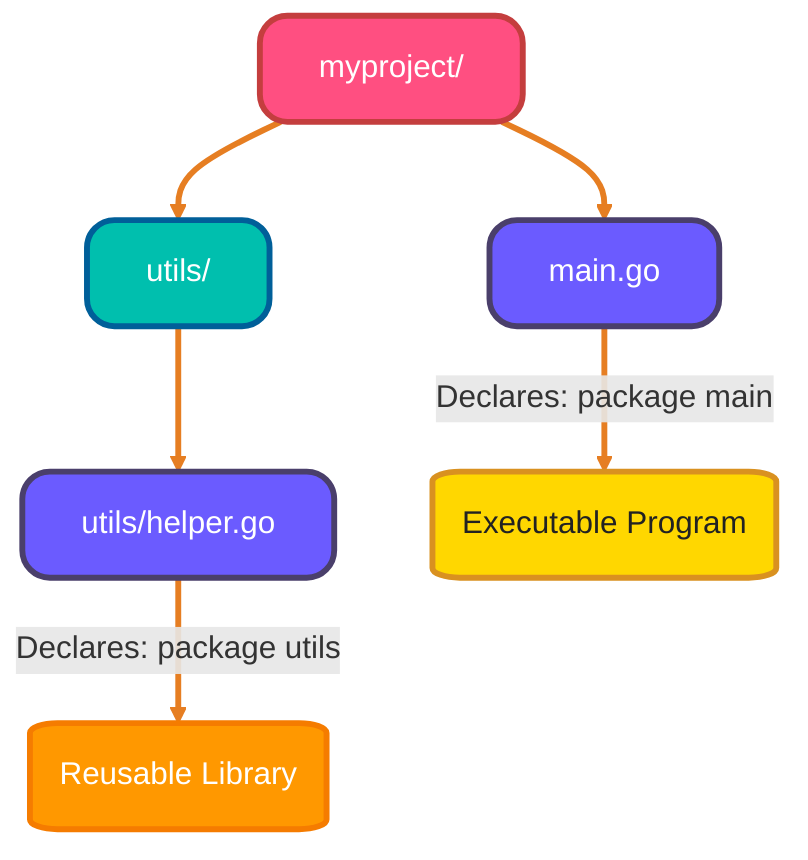
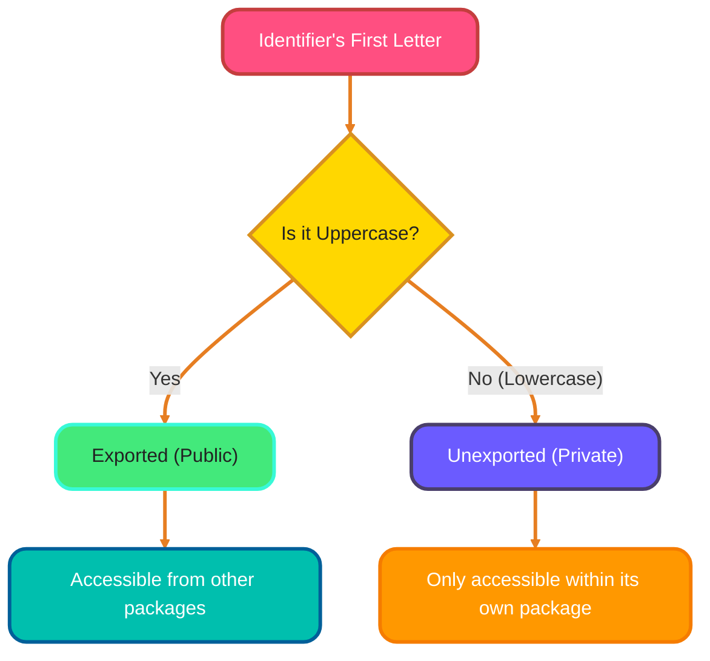
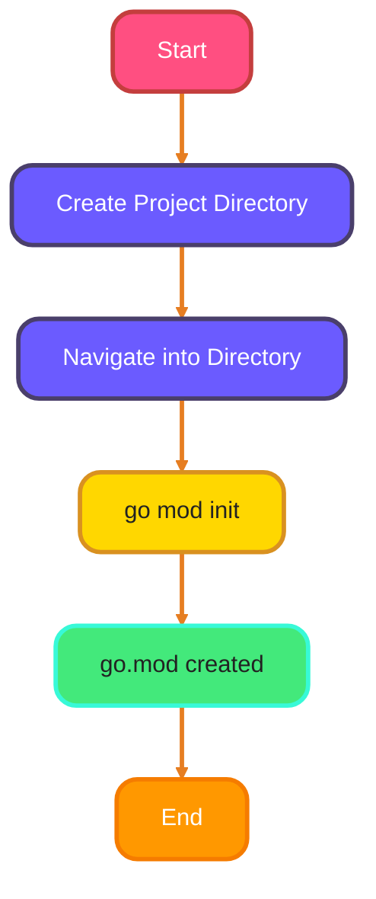
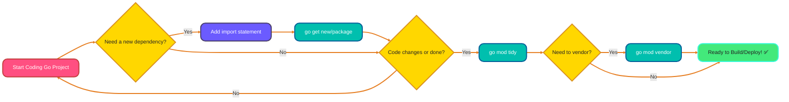
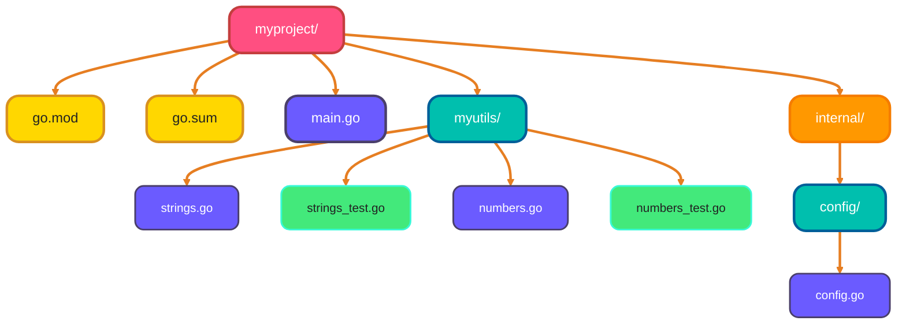

<!--
meta-description: "Comprehensive guide to Go packages and modules covering package basics, import patterns, exported vs unexported identifiers, go.mod files, dependency management commands, and best practices for creating reusable packages."
keywords: "Go packages, Go modules, go.mod, package imports, exported identifiers, unexported identifiers, dependency management, go get, go mod tidy, semantic versioning, package organization"
-->

# <span style="color:#e67e22;">What we will learn in this post?</span>
<ul style='list-style-type: none; padding-left: 0;'>
<li><span style='color: #2980b9; font-size: 20px; font-weight: bold;'>👉</span> <span style='color: #2ecc71; font-size: 18px; font-weight: bold;'>Package Basics</span></li>
<li><span style='color: #2980b9; font-size: 20px; font-weight: bold;'>👉</span> <span style='color: #2ecc71; font-size: 18px; font-weight: bold;'>Importing Packages</span></li>
<li><span style='color: #2980b9; font-size: 20px; font-weight: bold;'>👉</span> <span style='color: #2ecc71; font-size: 18px; font-weight: bold;'>Exported vs Unexported</span></li>
<li><span style='color: #2980b9; font-size: 20px; font-weight: bold;'>👉</span> <span style='color: #2ecc71; font-size: 18px; font-weight: bold;'>Go Modules</span></li>
<li><span style='color: #2980b9; font-size: 20px; font-weight: bold;'>👉</span> <span style='color: #2ecc71; font-size: 18px; font-weight: bold;'>Managing Dependencies</span></li>
<li><span style='color: #2980b9; font-size: 20px; font-weight: bold;'>👉</span> <span style='color: #2ecc71; font-size: 18px; font-weight: bold;'>Creating Your Own Packages</span></li>
<li><span style='color: #2980b9; font-size: 20px; font-weight: bold;'>👉</span> <span style='color: #2ecc71; font-size: 18px; font-weight: bold;'>Conclusion!</span></li>
</ul>

# <span style="color:#e67e22">📦 Go Packages: Organizing Your Code!</span>

Go packages are the foundation of code organization in production applications, enabling modular design and reusable libraries. Think of them as digital *folders* that group related functions, variables, and types together. This makes your code easier to read, reuse, and maintain!

## <span style="color:#2980b9">📝 Package Naming Rules</span>

When naming your packages, remember these simple rules:
*   **Always `lowercase`**: Use only lowercase letters.
*   **No `underscores`**: Avoid using `_` in package names.
*   **Descriptive**: Choose a name that clearly describes what the package does (e.g., `myutils`, `database`, `httpclient`).
*   The special `main` package is reserved for programs that can be directly executed.

## <span style="color:#2980b9">⬆️ Declaring Your Package</span>

Every single Go file *must* declare its package. You do this using the `package` keyword at the *very top* of the file.

```go
// For an executable program
package main

// For a reusable library package
// package mypackage
```

## <span style="color:#2980b9">🤝 One Directory, One Package</span>

This is a **golden rule**! All `.go` files located within the *same directory* must declare the *same package* name. Go uses this structure to understand how your project is organized.

For example, if you have `myproject/utils/helper.go` and `myproject/utils/formatter.go`, both files *must* start with `package utils`.

## <span style="color:#2980b9">💡 Simple Example Structure</span>

Here's how a typical project might look:



In this example, `main.go` is part of `package main`, making it an executable program. The `helper.go` file within the `utils` directory declares `package utils`, making its functions available for other parts of your project (like `main.go`) to import and use.

---
### <span style="color:#8e44ad">🔗 Further Reading</span>
*   [Go Documentation on Packages](https://go.dev/doc/effective_go#packages)

# <span style="color:#e67e22">Go Package Imports: Your Essential Guide! 🚀</span>

Importing packages enables code reuse across large-scale applications and microservices architectures. It's crucial for structuring your applications and leveraging Go's vast standard library and community packages.

## <span style="color:#2980b9">Standard Imports 📚</span>
This is the most common way. You simply declare the package path, and then use its exported functions or variables by prefixing them with the package name.

*   **Syntax:** `import "package_path"`
*   **Example:**
    ```go
    import "fmt" // Imports the standard format package
    
    func main() {
        fmt.Println("Hello, Go!") // Using fmt.Println
    }
    ```

## <span style="color:#2980b9">Aliasing Imports 🏷️</span>
You can give a package an *alias* (a different name). This is useful to avoid name collisions if two packages have the same name, or to shorten a long package name for convenience.

*   **Syntax:** `import alias "package_path"`
*   **Example:**
    ```go
    import f "fmt" // Alias "fmt" as "f"
    
    func main() {
        f.Println("Using an alias!") // Using f.Println
    }
    ```

## <span style="color:#2980b9">Blank Imports (`_`) 👻</span>
A *blank import* is used when you need a package for its side effects only, typically because of its `init()` function. The imported package's exported members won't be directly used in your code. Common for database drivers.

*   **Syntax:** `import _ "package_path"`
*   **Example:**
    ```go
    import _ "github.com/go-sql-driver/mysql" // Driver registers itself in init()
    
    func main() {
        // ... code to use database/sql with mysql driver ...
    }
    ```

## <span style="color:#2980b9">Dot Imports (`.`) 🛑 (Discouraged!)</span>
A *dot import* brings all exported identifiers of a package directly into your current file's scope, meaning you don't need to prefix them with the package name. **This is highly discouraged** as it can lead to name clashes and make code harder to read and maintain.

*   **Syntax:** `import . "package_path"`
*   **Example:**
    ```go
    import . "fmt" // Imports fmt, but now Println can be used directly
    
    func main() {
        Println("No prefix here!") // Println used without "fmt."
    }
    ```

## <span style="color:#2980b9">Real-World Import Example: HTTP API Server 🌐</span>

Here's how imports work in a production API server:

```go
package main

import (
    "encoding/json"     // Standard library for JSON handling
    "log"              // Logging for debugging
    "net/http"         // HTTP server functionality
    "time"             // Time operations
    
    "github.com/gorilla/mux"  // Popular HTTP router
    db "myapp.com/database"    // Alias for custom database package
    "myapp.com/auth"           // Custom authentication package
)

type UserResponse struct {
    ID        int       `json:"id"`
    Username  string    `json:"username"`
    CreatedAt time.Time `json:"created_at"`
}

func getUserHandler(w http.ResponseWriter, r *http.Request) {
    // Verify authentication
    if !auth.IsAuthenticated(r) {
        http.Error(w, "Unauthorized", http.StatusUnauthorized)
        return
    }
    
    // Get user from database using aliased package
    user, err := db.GetUser(123)
    if err != nil {
        log.Printf("Database error: %v", err)
        http.Error(w, "Internal error", http.StatusInternalServerError)
        return
    }
    
    // Create response
    response := UserResponse{
        ID:        user.ID,
        Username:  user.Name,
        CreatedAt: time.Now(),
    }
    
    // Encode and send JSON response
    w.Header().Set("Content-Type", "application/json")
    json.NewEncoder(w).Encode(response)
}

func main() {
    router := mux.NewRouter()
    router.HandleFunc("/api/users/{id}", getUserHandler).Methods("GET")
    
    log.Println("Server starting on :8080")
    http.ListenAndServe(":8080", router)
}
```

## <span style="color:#2980b9">Import Types Quick Reference 📋</span>

Here's a quick comparison to help you choose the right import style:

| Import Type | Syntax | Use Case | Example | Best For |
|------------|--------|----------|---------|----------|
| **Standard** | `import "pkg"` | Most common, explicit usage | `fmt.Println()` | ✅ General use, clear code |
| **Aliased** | `import alias "pkg"` | Avoid name conflicts, shorten long names | `db.Connect()` | ✅ Multiple similar packages, long package paths |
| **Blank** | `import _ "pkg"` | Side effects only (init functions) | `_ "github.com/lib/pq"` | ✅ Database drivers, plugins |
| **Dot** | `import . "pkg"` | Direct access (discouraged) | `Println()` | ❌ Avoid - causes confusion |

**Pro Tip:** Stick to standard imports for 95% of cases. Use aliases when you have multiple packages with similar names (e.g., `v1 "myapp/api/v1"` and `v2 "myapp/api/v2"`).

---
### <span style="color:#8e44ad">Further Reading 📖</span>
*   [Effective Go - Imports](https://go.dev/doc/effective_go#imports)
*   [Go Tour - Packages](https://go.dev/tour/basics/1)

# <span style="color:#e67e22">Go's Visibility Rules: Exported vs. Unexported! 🚀</span>

In Go, a simple yet powerful convention governs identifier visibility: the capitalization of its very first letter. This determines whether your code components are accessible to other packages or remain private, ensuring clear boundaries and good package design.

## <span style="color:#2980b9">Understanding the Basics 📖</span>

*   **Exported (Public) Identifiers:**
    *   Always start with an **uppercase** letter (e.g., `User`, `GetUser`, `Name`).
    *   They are *public* and can be accessed and used from *any other package* that imports yours. Think of these as your package's official API.
*   **Unexported (Private) Identifiers:**
    *   Always start with a **lowercase** letter (e.g., `user`, `getUser`, `name`).
    *   They are *private* and are *only accessible* within the *same package* where they are defined. These are internal helpers, keeping your package's logic encapsulated.



## <span style="color:#8e44ad">Examples in Action ✨</span>

Let's see how this applies to different Go elements:

*   **Structs:**
    *   `type Product struct {}` (exported, visible to other packages)
    *   `type productConfig struct {}` (unexported, private to its package)
*   **Struct Fields:** (inside a struct like `Product`)
    *   `Name string` (exported field, can be accessed by others)
    *   `cost float64` (unexported field, private to its package)
*   **Functions:**
    *   `func GetProductData() {}` (exported, callable by other packages)
    *   `func calculateDiscount() {}` (unexported, only callable within its package)

## <span style="color:#2980b9">Real-World Example: User Authentication Package 🔐</span>

Here's how exported and unexported identifiers work together in a production authentication package:

```go
// Package auth provides user authentication functionality
package auth

import (
    "crypto/sha256"
    "encoding/hex"
    "errors"
    "time"
)

// User represents an authenticated user (Exported)
type User struct {
    ID       int       // Exported: accessible to other packages
    Username string    // Exported: accessible to other packages
    Email    string    // Exported: accessible to other packages
    password string    // Unexported: only accessible within auth package
    salt     string    // Unexported: security measure, private
}

// sessionStore holds active sessions (unexported, internal use only)
type sessionStore struct {
    sessions map[string]*User
    expiry   map[string]time.Time
}

// global session storage (unexported)
var store = &sessionStore{
    sessions: make(map[string]*User),
    expiry:   make(map[string]time.Time),
}

// CreateUser creates a new user with hashed password (Exported - Public API)
func CreateUser(username, email, password string) (*User, error) {
    if len(password) < 8 {
        return nil, errors.New("password too short")
    }
    
    salt := generateSalt() // Call unexported helper
    hashedPwd := hashPassword(password, salt) // Call unexported helper
    
    user := &User{
        Username: username,
        Email:    email,
        password: hashedPwd,
        salt:     salt,
    }
    
    return user, nil
}

// Authenticate verifies user credentials (Exported - Public API)
func Authenticate(username, password string) (*User, error) {
    user, err := findUser(username) // Call unexported helper
    if err != nil {
        return nil, errors.New("invalid credentials")
    }
    
    hashed := hashPassword(password, user.salt)
    if hashed != user.password {
        return nil, errors.New("invalid credentials")
    }
    
    return user, nil
}

// generateSalt creates a random salt (unexported - internal helper)
func generateSalt() string {
    // Implementation details hidden from package users
    return hex.EncodeToString([]byte(time.Now().String()))[:16]
}

// hashPassword hashes password with salt (unexported - internal helper)
func hashPassword(password, salt string) string {
    hasher := sha256.New()
    hasher.Write([]byte(password + salt))
    return hex.EncodeToString(hasher.Sum(nil))
}

// findUser searches for user by username (unexported - internal helper)
func findUser(username string) (*User, error) {
    // In real implementation, this would query a database
    return nil, errors.New("user not found")
}
```

**Key Takeaways:**
- `User`, `CreateUser()`, `Authenticate()` are **exported** - they form the public API
- `password`, `salt`, `sessionStore`, helper functions are **unexported** - implementation details remain hidden
- This encapsulation protects sensitive security logic and allows internal changes without breaking client code

This fundamental rule helps you build well-structured and manageable Go packages!

## <span style="color:#2980b9">Visibility Rules Comparison 🔒</span>

| Aspect | Exported (Public) | Unexported (Private) |
|--------|-------------------|---------------------|
| **Naming** | Starts with **Uppercase** | Starts with **lowercase** |
| **Access** | Any package can use | Same package only |
| **Purpose** | Public API, intended for external use | Internal helpers, implementation details |
| **Examples** | `User`, `GetData()`, `MaxSize` | `user`, `getData()`, `maxSize` |
| **Best Use** | Functions/types clients need | Helper functions, internal state |
| **Documentation** | Should have doc comments | Optional documentation |

**Design Principle:** Start with unexported by default. Only export what's necessary for your public API. This gives you flexibility to change internal implementation without breaking client code.

### <span style="color:#8e44ad">Further Reading 📚</span>
*   For more insights, check out the official [Effective Go: Names](https://go.dev/doc/effective_go#names) documentation.

# <span style="color:#e67e22">Go Modules: Managing Your Code 📦</span>

## <span style="color:#2980b9">What are Go Modules? 🤔</span>
Go modules, introduced in *Go 1.11*, revolutionized dependency management in Go. They provide a robust and reproducible way to handle project dependencies, ensuring that your builds are consistent every time. It's the standard for modern Go development!

## <span style="color:#2980b9">The Core Files: `go.mod` & `go.sum` 📄</span>
- **`go.mod`**: This essential file, located at your module's root, defines your *module path* (a unique identifier) and lists all direct and indirect dependencies, specifying their *semantic versions*.
- **`go.sum`**: This security-focused file contains cryptographic *checksums* for all your module's dependencies. It verifies integrity, protecting against malicious or accidental changes to downloaded modules.

## <span style="color:#2980b9">Semantic Versioning & `go mod init` 🚀</span>
Go modules leverage *Semantic Versioning* (e.g., `v1.2.3`), making it clear what kind of changes a new version introduces (major, minor, patch). To start a new module, simply navigate to your project folder and run `go mod init <module-path>`. This command initializes your module by creating the `go.mod` file.

## <span style="color:#2980b9">Let's Create a Module! ✨</span>
Here's a quick example to get started:
```bash
mkdir my-awesome-app
cd my-awesome-app
go mod init example.com/my-awesome-app
```
This sequence will generate your initial `go.mod` file in the `my-awesome-app` directory.

**Module Initialization Flow:**


# <span style="color:#e67e22">Go Modules: Managing Your Project's Dependencies 🤝</span>

Go Modules manage external dependencies in production environments, ensuring reproducible builds across development, staging, and production. They ensure your project builds consistently and reproducibly, making collaboration and deployment a breeze.

## <span style="color:#2980b9">Adding New Friends with `go get` ➕</span>

When your project needs a new external package, `go get` is your go-to command. It downloads the required package and adds it (and its version) to your project's `go.mod` file.

*   **Command:** `go get example.com/some/package`
*   **Workflow:** You often just add an `import` statement to your code, and then `go build` or `go run` will implicitly call `go get` to fetch it. Or, explicitly run `go get` to fetch a specific version.

## <span style="color:#2980b9">Keeping Your Friend List Tidy with `go mod tidy` ✨</span>

`go mod tidy` acts like a meticulous organizer! It ensures your `go.mod` file accurately reflects the dependencies actually used by your project. It adds any missing dependencies and *removes* unused ones.

*   **Command:** `go mod tidy`
*   **Workflow:** Run this regularly, especially after adding or removing `import` statements, to keep your dependency list clean and correct.

## <span style="color:#2980b9">Bringing Friends Closer with `go mod vendor` 📦</span>

`go mod vendor` copies all your project's dependencies from your Go Module cache into a local `vendor` directory within your project.

*   **Command:** `go mod vendor`
*   **Why use it?** This makes your project *self-contained*. It's great for reproducible builds, especially in environments with limited internet access or strict build policies, as the project no longer needs to fetch dependencies during build time.

### <span style="color:#8e44ad">Common Workflow Overview 🚀</span>



## <span style="color:#2980b9">Real-World Example: Adding Dependencies to a Web API 🔧</span>

Here's a practical example of managing dependencies for a REST API project:

```bash
# Initialize a new module
mkdir product-api
cd product-api
go mod init github.com/mycompany/product-api

# Create main.go with needed imports
cat > main.go << 'EOF'
package main

import (
    "encoding/json"
    "log"
    "net/http"
    "github.com/gorilla/mux"
    "github.com/go-redis/redis/v8"
    "gorm.io/gorm"
    "gorm.io/driver/postgres"
)

func main() {
    log.Println("Starting API server...")
}
EOF

# Add dependencies (downloads and updates go.mod)
go get github.com/gorilla/mux@v1.8.0
go get github.com/go-redis/redis/v8
go get gorm.io/gorm
go get gorm.io/driver/postgres

# Clean up unused dependencies and add missing ones
go mod tidy

# View your go.mod file
cat go.mod
```

**Resulting go.mod file:**
```go
module github.com/mycompany/product-api

go 1.21

require (
    github.com/go-redis/redis/v8 v8.11.5
    github.com/gorilla/mux v1.8.0
    gorm.io/driver/postgres v1.5.4
    gorm.io/gorm v1.25.5
)

require (
    // Indirect dependencies automatically added
    github.com/cespare/xxhash/v2 v2.1.2 // indirect
    github.com/dgryski/go-rendezvous v0.0.0-20200823014737-9f7001d12a5f // indirect
    github.com/jackc/pgx/v5 v5.4.3 // indirect
    // ... other indirect dependencies
)
```

**For Docker deployments (vendor dependencies):**
```bash
# Create vendor directory with all dependencies
go mod vendor

# Now your Dockerfile can build offline
cat > Dockerfile << 'EOF'
FROM golang:1.21-alpine
WORKDIR /app
COPY . .
# Build using vendored dependencies (no network needed)
RUN go build -mod=vendor -o api .
CMD ["./api"]
EOF
```

**Key Benefits:**
- ✅ **Reproducible builds**: Same dependency versions across all environments
- ✅ **Version pinning**: Lock specific versions for stability
- ✅ **Offline builds**: Vendor mode enables builds without internet
- ✅ **Security**: `go.sum` verifies dependency integrity

## <span style="color:#2980b9">Go Module Commands Reference 🎯</span>

Here's your essential toolkit for managing Go modules:

| Command | Purpose | When to Use | Output |
|---------|---------|-------------|--------|
| `go mod init <path>` | Initialize new module | Starting a new project | Creates `go.mod` |
| `go get <package>` | Add/update dependency | Need a new package | Updates `go.mod` and `go.sum` |
| `go mod tidy` | Clean up dependencies | After adding/removing imports | Syncs `go.mod` with actual code |
| `go mod vendor` | Copy deps to vendor/ | Offline builds, air-gapped environments | Creates `vendor/` directory |
| `go mod download` | Download dependencies | Pre-populate cache | Downloads to module cache |
| `go mod verify` | Verify checksums | Security audit | Checks `go.sum` integrity |
| `go list -m all` | List all dependencies | Audit dependency tree | Shows version info |
| `go mod graph` | Show dependency graph | Understand relationships | Prints module graph |
| `go mod why <package>` | Explain dependency | "Why is this here?" | Shows import path chain |

**Common Workflow:**
```bash
# Start new project
go mod init github.com/yourname/project

# Add dependencies as you import them
go build  # or go run

# Clean up
go mod tidy

# For production deployment
go mod vendor  # Optional: vendor dependencies
```

---

### <span style="color:#8e44ad">Further Reading 📖</span>
*   For a comprehensive guide, check out the official [Go Modules Reference](https://go.dev/ref/mod).

# <span style="color:#e67e22">Building Awesome Reusable Packages! 📦</span>

Creating reusable Go packages enables code sharing across microservices and projects. It makes sharing, maintaining, and using your code much easier across teams.

## <span style="color:#2980b9">1. Organizing Your Code Internally 🧩</span>
Within a package, split your code into multiple `.go` files based on their specific job. For example, a package `myutils/` might have `strings.go` for string utilities, `numbers.go` for mathematical functions, and `validation.go` for input validation. All files in the same directory must declare the same package name. This keeps files tidy and focused!

## <span style="color:#2980b9">2. Structuring Your Package Directories 🌳</span>
A typical Go project structure includes your module root, internal packages, and test files alongside implementation files.



## <span style="color:#2980b9">3. Best Practices & Design Tips ✨</span>
*   **Clear Purpose:** Each package should do *one thing really well* (Single Responsibility Principle).
*   **Intuitive APIs:** Design your exported functions to be *easy to understand and use*. Use lowercase for unexported helpers.
*   **Documentation:** Write clear *doc comments* starting with the function/type name. These appear in `go doc` and godoc.org.
*   **Testing:** Place test files alongside implementation (`*_test.go`). Use table-driven tests for comprehensive coverage.
*   **Package Naming:** Use short, lowercase, singular names (e.g., `http`, `json`, `time`). Avoid underscores or mixedCaps.
*   **Internal Packages:** Use `internal/` directory for packages that should only be imported by your module.

## <span style="color:#2980b9">Real-World Example: String Utilities Package 🔨</span>

Here's a production-ready reusable package:

**File: myutils/strings.go**
```go
// Package myutils provides common utility functions for string manipulation.
package myutils

import (
    "strings"
    "unicode"
)

// Capitalize converts the first character of a string to uppercase.
// It returns the original string if empty or already capitalized.
func Capitalize(s string) string {
    if s == "" {
        return s
    }
    
    runes := []rune(s)
    runes[0] = unicode.ToUpper(runes[0])
    return string(runes)
}

// TruncateWithEllipsis truncates a string to maxLen characters,
// adding "..." if truncated. Used for preview text in UIs.
func TruncateWithEllipsis(s string, maxLen int) string {
    if len(s) <= maxLen {
        return s
    }
    
    if maxLen < 3 {
        return "..."
    }
    
    return s[:maxLen-3] + "..."
}

// Slugify converts a string to a URL-friendly slug.
// Example: "Hello World!" -> "hello-world"
func Slugify(s string) string {
    s = strings.ToLower(s)
    s = strings.TrimSpace(s)
    
    // Replace spaces with hyphens
    s = strings.ReplaceAll(s, " ", "-")
    
    // Remove special characters
    result := make([]rune, 0, len(s))
    for _, r := range s {
        if unicode.IsLetter(r) || unicode.IsDigit(r) || r == '-' {
            result = append(result, r)
        }
    }
    
    return string(result)
}

// isValidEmail checks if string is a valid email (unexported helper)
func isValidEmail(email string) bool {
    return strings.Contains(email, "@") && strings.Contains(email, ".")
}
```

**File: myutils/strings_test.go**
```go
package myutils

import "testing"

func TestCapitalize(t *testing.T) {
    tests := []struct {
        name     string
        input    string
        expected string
    }{
        {"empty string", "", ""},
        {"lowercase", "hello", "Hello"},
        {"already capitalized", "World", "World"},
        {"single char", "a", "A"},
    }
    
    for _, tt := range tests {
        t.Run(tt.name, func(t *testing.T) {
            result := Capitalize(tt.input)
            if result != tt.expected {
                t.Errorf("Capitalize(%q) = %q; want %q", 
                    tt.input, result, tt.expected)
            }
        })
    }
}

func TestSlugify(t *testing.T) {
    tests := []struct {
        input    string
        expected string
    }{
        {"Hello World", "hello-world"},
        {"Go Programming!", "go-programming"},
        {"  Spaces  ", "spaces"},
    }
    
    for _, tt := range tests {
        result := Slugify(tt.input)
        if result != tt.expected {
            t.Errorf("Slugify(%q) = %q; want %q", 
                tt.input, result, tt.expected)
        }
    }
}
```

**Usage in another project:**
```go
package main

import (
    "fmt"
    "github.com/yourname/myproject/myutils"
)

func main() {
    title := "hello world"
    fmt.Println(myutils.Capitalize(title))  // "Hello world"
    
    article := "This is a very long article content..."
    preview := myutils.TruncateWithEllipsis(article, 20)
    fmt.Println(preview)  // "This is a very lo..."
    
    slug := myutils.Slugify("My Blog Post!")
    fmt.Println(slug)  // "my-blog-post"
}
```

*Remember: A well-designed package is a joy to use!*

## <span style="color:#2980b9">Package Organization Patterns 📐</span>

Choose the right organization pattern based on your project needs:

| Pattern | Structure | Use Case | Pros | Cons |
|---------|-----------|----------|------|------|
| **Flat** | All packages at root | Small projects, utilities | ✅ Simple<br>✅ Easy to navigate | ❌ Gets messy as project grows |
| **Layered** | `/api`, `/service`, `/repo` | Web applications | ✅ Clear separation of concerns<br>✅ Testable | ❌ Can be over-engineered for small apps |
| **Domain-Driven** | `/user`, `/order`, `/payment` | Business applications | ✅ Aligns with business logic<br>✅ Scalable | ❌ Requires careful planning |
| **Standard Layout** | `/cmd`, `/pkg`, `/internal` | Large projects, CLIs | ✅ Industry standard<br>✅ Clear public vs private | ❌ More boilerplate |

**Standard Go Project Layout:**
```
myproject/
├── cmd/                    # Main applications
│   └── myapp/
│       └── main.go
├── internal/              # Private application code
│   ├── auth/
│   └── database/
├── pkg/                   # Public library code
│   └── utils/
├── api/                   # API definitions (OpenAPI, protobuf)
├── web/                   # Web assets (if applicable)
├── scripts/              # Build and deploy scripts
├── docs/                 # Documentation
├── go.mod
└── go.sum
```

**Key Guidelines:**
- Use `internal/` for code that should NOT be imported by other projects
- Use `pkg/` for reusable library code that others can import
- Use `cmd/` for executable applications
- Keep `main.go` minimal - it should just wire things together

<h1><span style='color:#e67e22'>Conclusion</span></h1>

You've now mastered Go packages and modules! From understanding package basics and import patterns to managing dependencies with `go.mod` and building reusable libraries, you have the tools to organize production-grade Go applications.

**Next steps to level up your Go skills:**
- 🔨 Create a utility package for your common functions and publish it on GitHub
- 📦 Practice dependency management by building a REST API with external packages
- 🏗️ Structure a multi-package project following Go's standard layout conventions
- 🧪 Write comprehensive tests for your packages using table-driven test patterns

Start applying these patterns in your projects today and watch your codebase become more maintainable and scalable!

What are your thoughts on this topic? Have you built reusable Go packages before? Share your experiences in the comments below! 👇💬✨

