<!--
meta-description: "Complete guide to file I/O in Go: reading, writing, managing files and directories, working with paths, and setting permissions for robust data handling."
keywords: "Go file I/O, reading files, writing files, os.ReadFile, bufio.Scanner, file operations, filepath package, directory traversal, file permissions, os.Chmod, data persistence"
-->

# <span style="color:#e67e22;">What we will learn in this post?</span>
<ul style='list-style-type: none; padding-left: 0;'>
<li><span style='color: #2980b9; font-size: 20px; font-weight: bold;'>👉</span> <span style='color: #2ecc71; font-size: 18px; font-weight: bold;'>Reading Files</span></li>
<li><span style='color: #2980b9; font-size: 20px; font-weight: bold;'>👉</span> <span style='color: #2ecc71; font-size: 18px; font-weight: bold;'>Writing Files</span></li>
<li><span style='color: #2980b9; font-size: 20px; font-weight: bold;'>👉</span> <span style='color: #2ecc71; font-size: 18px; font-weight: bold;'>File Operations</span></li>
<li><span style='color: #2980b9; font-size: 20px; font-weight: bold;'>👉</span> <span style='color: #2ecc71; font-size: 18px; font-weight: bold;'>Working with Paths</span></li>
<li><span style='color: #2980b9; font-size: 20px; font-weight: bold;'>👉</span> <span style='color: #2ecc71; font-size: 18px; font-weight: bold;'>Reading Directories</span></li>
<li><span style='color: #2980b9; font-size: 20px; font-weight: bold;'>👉</span> <span style='color: #2ecc71; font-size: 18px; font-weight: bold;'>File Permissions</span></li>
<li><span style='color: #2980b9; font-size: 20px; font-weight: bold;'>👉</span> <span style='color: #2ecc71; font-size: 18px; font-weight: bold;'>Conclusion!</span></li>
</ul>

# <span style="color:#e67e22">Reading Files in Go: Your Go-To Guides!</span> 📖

Go offers flexible ways to read files, depending on size and processing needs. Whether you're loading configuration files, processing logs, or handling user uploads, mastering file reading is essential for building production-ready applications that efficiently manage data without memory issues. Let's explore common approaches for handling your data.

## <span style="color:#2980b9">1. `os.ReadFile()`: Quick & Easy 🚀</span>
Perfect for *small files* (e.g., config). It reads the *entire content* into memory as a `[]byte`. Simple and straightforward!

```go
package main

import (
	"fmt"
	"os"
)

func main() {
	data, err := os.ReadFile("data.txt") // data.txt assumed to exist
	if err != nil {
		fmt.Printf("Error reading file: %v\n", err)
		return
	}
	fmt.Println("Content from os.ReadFile():")
	fmt.Println(string(data))
}
```
_**Pro Tip:** Avoid this for very large files to prevent memory issues._

## <span style="color:#2980b9">2. `os.Open()` with `bufio.Scanner`: Line by Line Magic ✨</span>
Ideal for *large text files, line by line*. `os.Open()` provides a file handle; `bufio.Scanner` then iterates efficiently over lines, reducing memory.

```go
package main

import (
	"bufio"
	"fmt"
	"os"
)

func main() {
	file, err := os.Open("data.txt")
	if err != nil {
		fmt.Printf("Error opening file: %v\n", err)
		return
	}
	defer file.Close() // Important: Closes file when function exits!

	scanner := bufio.NewScanner(file)
	fmt.Println("\nContent from bufio.Scanner (line by line):")
	for scanner.Scan() {
		fmt.Println(scanner.Text())
	}
	if err := scanner.Err(); err != nil {
		fmt.Printf("Error during scan: %v\n", err)
	}
}
```
_**Benefit:** Excellent for processing stream-like data without loading it all at once._

## <span style="color:#2980b9">3. `bufio.Reader`: Advanced Buffered Control 📚</span>
For *fine-grained control* (e.g., reading specific bytes, custom delimiters). It buffers input, offering methods like `ReadString` or `ReadBytes`.

```go
package main

import (
	"bufio"
	"fmt"
	"os"
)

func main() {
	file, err := os.Open("data.txt")
	if err != nil {
		fmt.Printf("Error opening file: %v\n", err)
		return
	}
	defer file.Close()

	reader := bufio.NewReader(file)
	fmt.Println("\nContent from bufio.Reader (first line):")
	line, err := reader.ReadString('\n') // Reads until the first newline
	if err != nil {
		fmt.Printf("Error reading line: %v\n", err)
		return
	}
	fmt.Println(line)
}
```
_**Use Case:** Provides more power for complex parsing scenarios._

### <span style="color:#8e44ad">File Reading Flow with `bufio.Scanner`</span>


# <span style="color:#e67e22">Writing to Files in Go 📝</span>

Let's explore simple yet powerful ways to write data to files in Go, ensuring proper handling and efficiency. Whether you're logging application events, saving user data, generating reports, or persisting configuration changes, understanding Go's file writing capabilities is crucial for building reliable applications that handle data safely and efficiently.

## <span style="color:#2980b9">Simple Start: `os.Create()` 🚀</span>

Use `os.Create()` to create a *new* file. If it already exists, it gets truncated (emptied). Remember to **always `defer file.Close()`** for proper resource management.

```go
file, err := os.Create("hello.txt") // Creates or truncates
if err != nil { /* handle error */ }
defer file.Close()
file.WriteString("Hello, Go!")
```

## <span style="color:#2980b9">More Control: `os.OpenFile()` 🛠️</span>

`os.OpenFile()` offers fine-grained control using *flags* like `os.O_APPEND` (add to end), `os.O_WRONLY` (write-only), and `os.O_CREATE` (create if not exists). Set permissions (e.g., `0644` for read/write for owner, read-only for others).

```go
file, err := os.OpenFile("log.txt", os.O_APPEND|os.O_WRONLY|os.O_CREATE, 0644)
if err != nil { /* handle error */ }
defer file.Close()
file.WriteString("New log entry.\n")
```

## <span style="color:#2980b9">Quick & Easy: `os.WriteFile()` ✨</span>

For *simple, single-shot* writes, `os.WriteFile()` is perfect. It handles opening, writing, and closing for you, taking a filename, byte slice, and permissions.

```go
data := []byte("My simple data.")
err := os.WriteFile("data.txt", data, 0644)
if err != nil { /* handle error */ }
```

## <span style="color:#2980b9">Boost Performance: `bufio.Writer` ⚡</span>

For frequent, small writes, `bufio.Writer` improves *performance* by buffering data before writing to the underlying `io.Writer` (like `os.File`). Always call `Flush()` to ensure all buffered data is written.

```go
// Assuming 'file' from os.Create or os.OpenFile
writer := bufio.NewWriter(file)
writer.WriteString("Buffered content.")
writer.Flush() // Don't forget this!
```

### <span style="color:#8e44ad">Don't Forget `defer`! 🔒</span>

*   _Always_ use `defer file.Close()` to ensure files are closed, preventing resource leaks even if errors occur.

---

### <span style="color:#8e44ad">File Writing Flow ⚙️</span>
Here's a quick look at the typical sequence for writing to a file.

```mermaid
%%{init: {'theme':'base', 'themeVariables': { 'primaryColor':'#ff4f81','primaryTextColor':'#fff','primaryBorderColor':'#c43e3e','lineColor':'#e67e22','secondaryColor':'#6b5bff','tertiaryColor':'#ffd700'}}}%%
sequenceDiagram
    participant P as 📝 Go Program
    participant F as 💾 File System

    Note over P,F: File Writing Process
    P->>+F: Request to Open/Create File
    F-->>-P: File Handle (or Error)
    P->>F: Write Data (repeatedly for bufio)
    P->>F: Flush (for bufio only)
    P->>F: Close File (via defer)
    F-->>P: Confirmation
    Note right of F: Data persisted ✅
```


---


<h1 style="color:#e67e22">📂 Mastering File Operations in Go!</h1>

Navigating your computer's files and folders using Go is essential for building real-world applications. Whether you're managing log rotations, organizing uploaded files, implementing backup systems, or cleaning up temporary data, these file operations form the foundation of robust file management in production environments. Let's explore common operations with Go's `os` module, always remembering to handle potential errors.

---

## <span style="color:#2980b9">🔍 Check Existence & Info with `os.Stat()`</span>

Want to check if a file exists *and* get its detailed info? `os.Stat()` is your friend! If the file is missing, it will return an error.

```go
package main

import (
	"fmt"
	"os"
)

func main() {
	info, err := os.Stat("my_document.txt")
	if err != nil {
		if os.IsNotExist(err) {
			fmt.Println("❌ File not found.")
		} else {
			fmt.Printf("Error: %v\n", err)
		}
		return
	}
	fmt.Printf("✨ File exists! Size: %d bytes\n", info.Size())
}
```

---

## <span style="color:#2980b9">🌳 Create Directories with `os.MkdirAll()`</span>

To make new folders (even nested ones!), use `os.MkdirAll()`. It creates all parent directories as needed and won't error if the directory already exists.

```go
package main

import (
	"fmt"
	"os"
)

func main() {
	err := os.MkdirAll("my_reports/2023", 0755)
	if err != nil {
		fmt.Printf("Oops, error creating directory: %v\n", err)
		return
	}
	fmt.Println("✅ Directory created!")
}
```

---

## <span style="color:#2980b9">✏️ Rename Files with `os.Rename()`</span>

Changing a file's name or moving it? `os.Rename()` does the trick! Always check for errors to handle cases where the file doesn't exist or the destination already exists.

```go
package main

import (
	"fmt"
	"os"
)

func main() {
	err := os.Rename("draft.txt", "final.txt")
	if err != nil {
		if os.IsNotExist(err) {
			fmt.Println("Old file to rename not found.")
		} else {
			fmt.Printf("Error renaming file: %v\n", err)
		}
		return
	}
	fmt.Println("➡️ File renamed successfully!")
}
```

---

## <span style="color:#2980b9">🗑️ Delete Files with `os.Remove()`</span>

To delete a file forever, use `os.Remove()`. Always check for errors to handle cases where the file doesn't exist.

```go
package main

import (
	"fmt"
	"os"
)

func main() {
	err := os.Remove("temp_data.csv")
	if err != nil {
		if os.IsNotExist(err) {
			fmt.Println("File already gone!")
		} else {
			fmt.Printf("Error deleting file: %v\n", err)
		}
		return
	}
	fmt.Println("🗑️ File deleted!")
}
```

---

### <span style="color:#8e44ad">💡 Quick Tip: Error Handling Flow</span>


---

# <span style="color:#e67e22">Navigating File Paths Like a Pro with `filepath`! 📂✨</span>

When building applications, you often deal with file and folder paths. Different operating systems (like Windows, macOS, and Linux) use different ways to write these paths (e.g., `\` vs. `/`). Go's standard library offers the fantastic `filepath` package to handle these differences *automatically*, making your code truly cross-platform! This is essential for building portable applications that work seamlessly across deployment environments, from development machines to production servers running different operating systems.

## <span style="color:#2980b9">Building & Combining Paths Seamlessly 🔗</span>

The `filepath.Join()` function is your best friend for combining path elements. It intelligently inserts the correct path separator for the system your code is running on.

*   **Example:**
    ```go
    import "path/filepath"

    path := filepath.Join("docs", "reports", "annual.pdf")
    // On Windows: "docs\\reports\\annual.pdf"
    // On Linux/macOS: "docs/reports/annual.pdf"
    ```

## <span style="color:#2980b9">Dissecting Paths into Components 🔍</span>

The `filepath` package also helps you extract specific parts of a path:

*   **`filepath.Base()`**: Returns the *last element* of the path (the file or folder name).
*   **`filepath.Dir()`**: Returns all but the *last element* of the path (the parent directory).
*   **`filepath.Ext()`**: Extracts the file extension, including the leading dot.

Let's see an example with `document/report.txt`:


*   **Code Example:**
    ```go
    filePath := "pictures/travel/paris.jpg"
    baseName := filepath.Base(filePath)  // "paris.jpg"
    dirName := filepath.Dir(filePath)   // "pictures/travel"
    extension := filepath.Ext(filePath) // ".jpg"
    ```

### <span style="color:#8e44ad">The Cross-Platform Advantage 🌍</span>

The true power of `filepath` is its *platform independence*. You write your path manipulation logic once, and it adapts to the operating system's conventions, ensuring your application behaves correctly everywhere without extra effort!

---
**Learn More:**
*   **Official Go `filepath` package documentation:** [pkg.go.dev/path/filepath](https://pkg.go.dev/path/filepath)

# <span style="color:#e67e22">Exploring Directories with Go! 📂</span>

Go makes file system navigation simple and efficient. Whether you're building a file search tool, implementing directory synchronization, processing batch uploads, or organizing project assets, understanding directory traversal is crucial for applications that work with complex file structures. Let's dive in!

## <span style="color:#2980b9">Reading a Single Directory: `os.ReadDir()` ✨</span>

To list items in just one directory, `os.ReadDir()` is excellent. It returns a slice of `DirEntry` objects, which offer efficient access to file/directory names and properties like `IsDir()` without extra system calls.

```go
package main

import (
	"fmt"
	"os"
	"strings"
)

func main() {
	// Create dummy content for demonstration
	os.MkdirAll("my_files/docs", 0755)
	os.WriteFile("my_files/doc.txt", []byte("report"), 0644)

	fmt.Println("--- 'my_files' Contents ---")
	entries, err := os.ReadDir("my_files")
	if err != nil {
		fmt.Printf("Error reading directory: %v\n", err)
		return
	}

	for _, entry := range entries {
		fileType := "(File)"
		if entry.IsDir() {
			fileType = "(Dir)"
		}
		fmt.Printf("- %s %s\n", entry.Name(), fileType)
	}

	// Filtering example:
	fmt.Println("\n--- Only .txt files ---")
	for _, entry := range entries {
		if !entry.IsDir() && strings.HasSuffix(entry.Name(), ".txt") {
			fmt.Printf("Found: %s\n", entry.Name())
		}
	}

	// Cleanup
	os.Remove("my_files/doc.txt")
	os.Remove("my_files/docs")
	os.Remove("my_files")
}
```

## <span style="color:#2980b9">Walking Directory Trees: `filepath.Walk()` 🌳</span>

Go provides `filepath.Walk()` and `filepath.WalkDir()` for efficiently traversing entire directory trees. `WalkDir` is newer and more efficient as it avoids extra system calls.

### <span style="color:#8e44ad">Using `filepath.WalkDir()` for Tree Traversal 🚀</span>

`filepath.WalkDir()` calls a function for each file and directory in the tree, providing a `DirEntry` for efficient access to file information.

```go
package main

import (
	"fmt"
	"io/fs"
	"os"
	"path/filepath"
	"strings"
)

func main() {
	// Create a sample tree for demonstration
	os.MkdirAll("project/src", 0755)
	os.MkdirAll("project/docs", 0755)
	os.WriteFile("project/main.go", []byte("..."), 0644)
	os.WriteFile("project/src/helper.go", []byte("..."), 0644)

	fmt.Println("\n--- Walking 'project' directory ---")
	err := filepath.WalkDir("project", func(path string, d fs.DirEntry, err error) error {
		if err != nil {
			return err
		}
		level := strings.Count(path, string(filepath.Separator)) - 1
		indent := strings.Repeat("    ", level)
		if d.IsDir() {
			fmt.Printf("%s%s/\n", indent, d.Name())
		} else {
			fmt.Printf("%s%s\n", indent, d.Name())
		}
		return nil
	})

	if err != nil {
		fmt.Printf("Error walking directory: %v\n", err)
	}

	// Cleanup
	os.Remove("project/main.go")
	os.Remove("project/src/helper.go")
	os.Remove("project/src")
	os.Remove("project/docs")
	os.Remove("project")
}
```

---

**Simplified Directory Walk Flow:**


# <span style="color:#e67e22">Understanding Go File Permissions ✨</span>

Keeping your files safe is super important! Go helps us manage this with its `os.FileMode` type for handling file permissions. Whether you're securing sensitive configuration files, managing executable scripts, setting up proper access controls for web application uploads, or ensuring correct permissions in containerized deployments, understanding file permissions is crucial for application security and proper system administration.

## <span style="color:#2980b9">Permissions Explained 🔐</span>

Unix-like systems use special **octal numbers** (like `0644` or `0755`) to define *who* can *do what* with a file. These numbers cover three groups:
*   **Owner**: The person who owns the file.
*   **Group**: Other users in the file's designated group.
*   **Others**: Everyone else on the system.

Each group's access is determined by adding these permission bits:
*   `r` (Read access): `4`
*   `w` (Write access): `2`
*   `x` (Execute access): `1`

For instance, `0644` means:
*   **Owner**: `6` (`4+2` = Read & Write)
*   **Group**: `4` (`4` = Read-only)
*   **Others**: `4` (`4` = Read-only)

## <span style="color:#2980b9">Setting Permissions with `os.Chmod()` ⚙️</span>

In Go, changing file permissions is straightforward using `os.Chmod()`. Just provide the file path and the desired `os.FileMode` (which can be your octal number!).

```go
package main

import (
	"fmt"
	"os"
)

func main() {
	filename := "my_document.txt"
	// Create a dummy file for demonstration
	os.WriteFile(filename, []byte("Hello Go!"), 0600) 

	// Set permissions to 0755 (owner rwx, group rx, others rx)
	err := os.Chmod(filename, 0755)
	if err != nil {
		fmt.Printf("Error changing permissions: %v\n", err)
	} else {
		fmt.Printf("Permissions for '%s' set to 0755 successfully!\n", filename)
	}
	// Clean up (optional)
	// os.Remove(filename)
}
```

## <span style="color:#2980b9">Cross-Operating System Behavior 🌍</span>

*   **Unix-like systems** (Linux, macOS): They fully understand and use these permissions.
*   **Windows**: Windows uses a different security model (ACLs). While `os.Chmod` tries its best to map Go's permissions to Windows' system, it's not always a perfect match. For super reliable control across different computers, you might need platform-specific tools.

---

### <span style="color:#8e44ad">Further Learning 📚</span>
*   [Go `os.FileMode` Documentation](https://pkg.go.dev/os#FileMode)
*   [Go `os.Chmod` Documentation](https://pkg.go.dev/os#Chmod)

---

<details>
<summary><strong style="font-size: 1.5em; color:#00bfae;">🎯 Hands-On Assignment</strong></summary>
<br>

Time to practice your file I/O skills! Complete this assignment and share your solution in the comments below!

### 📋 Problem Statement

Build a **File Manager Utility** that organizes files in a directory by their extensions. Your program should scan a directory, categorize files by type, and generate a summary report.

### ✅ Requirements

Create a program that:
1. Accepts a directory path as command-line argument
2. Scans all files in the directory (non-recursive)
3. Groups files by extension (`.txt`, `.jpg`, `.pdf`, etc.)
4. Creates a subdirectory for each extension type
5. Moves files into their respective extension folders
6. Generates a `summary.txt` report with:
   - Total files processed
   - Count per extension type
   - Total size per extension category
   - Timestamp of operation

### 💡 Implementation Hints

1. Use `os.ReadDir()` to list directory contents
2. Use `filepath.Ext()` to extract file extensions
3. Use `os.MkdirAll()` to create extension subdirectories
4. Use `os.Rename()` to move files
5. Use `os.Stat()` to get file sizes
6. Handle errors gracefully (permissions, invalid paths, etc.)
7. Create a backup mechanism before moving files

### 📝 Example Input/Output

**Before:**
```
myfiles/
├── document.pdf
├── photo.jpg
├── notes.txt
├── report.pdf
└── image.png
```

**After:**
```
myfiles/
├── pdf/
│   ├── document.pdf
│   └── report.pdf
├── jpg/
│   └── photo.jpg
├── txt/
│   └── notes.txt
├── png/
│   └── image.png
└── summary.txt
```

**summary.txt:**
```
File Organization Summary
Generated: 2025-12-02 14:30:45

Total Files Processed: 5

Files by Extension:
- .pdf: 2 files (1.2 MB)
- .jpg: 1 file (856 KB)
- .txt: 1 file (4 KB)
- .png: 1 file (342 KB)

Total Size: 2.4 MB
Operation completed successfully!
```

### 🌟 Bonus Challenges

1. Add a `--dry-run` flag to preview changes without moving files
2. Support recursive directory scanning with `filepath.WalkDir()`
3. Add file filtering by size (e.g., only process files > 1MB)
4. Create a rollback function to undo the organization
5. Add progress bar for large directories
6. Handle files without extensions (group as "noext")

### 📤 Submission Guidelines

- Test with a safe directory containing sample files
- Include error handling for edge cases
- Share your complete code in the comments
- Explain your design decisions
- Show sample output from running your program

**Looking forward to your creative solutions!** Share your implementation below and see how others approached it. 💬

</details>

---

<h1><span style='color:#e67e22'>Conclusion</span></h1>
And that's a wrap for today! ✨ We've explored some interesting points, but the real fun begins when we hear from *you*. What are your thoughts, experiences, or even clever tips related to what we discussed? Your voice matters! Please drop a comment below and let's keep this conversation going. I can't wait to read your feedback and connect with you all. 👇😊

