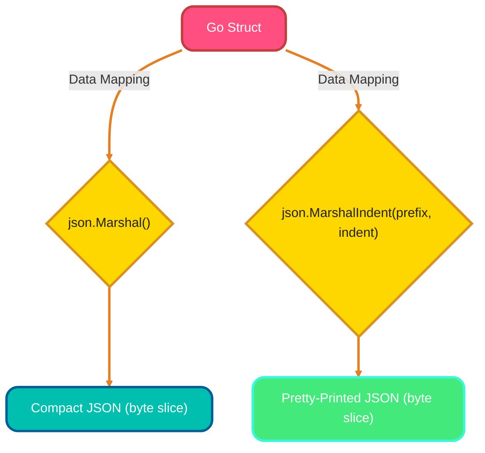
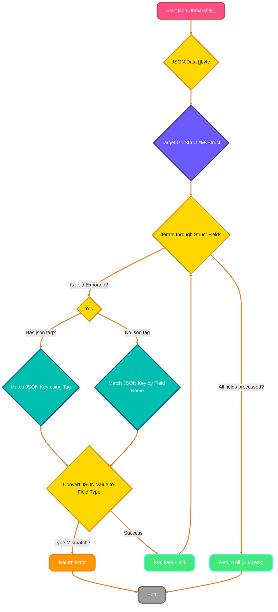
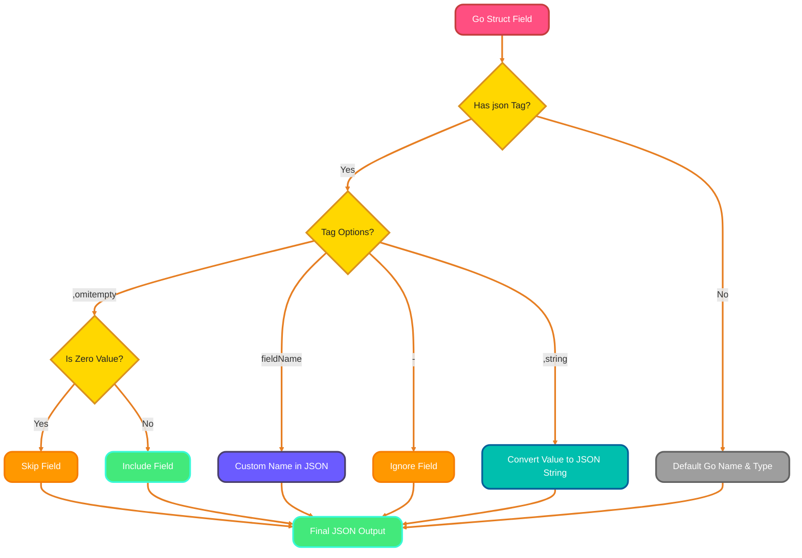
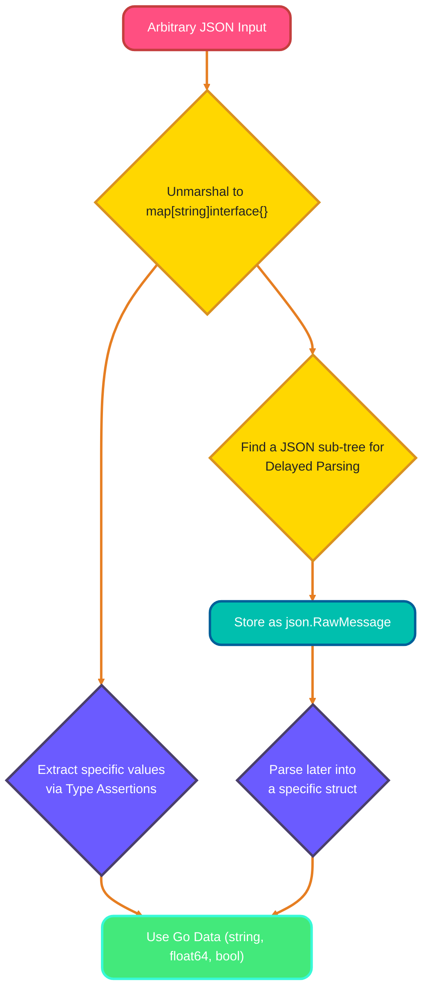
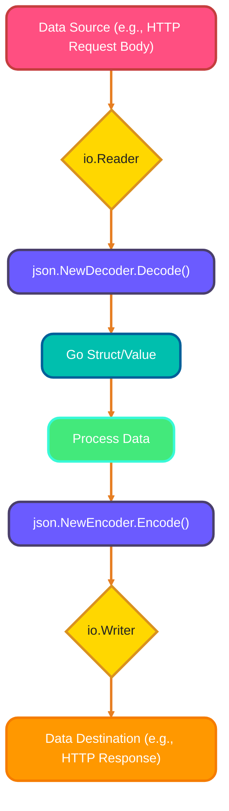
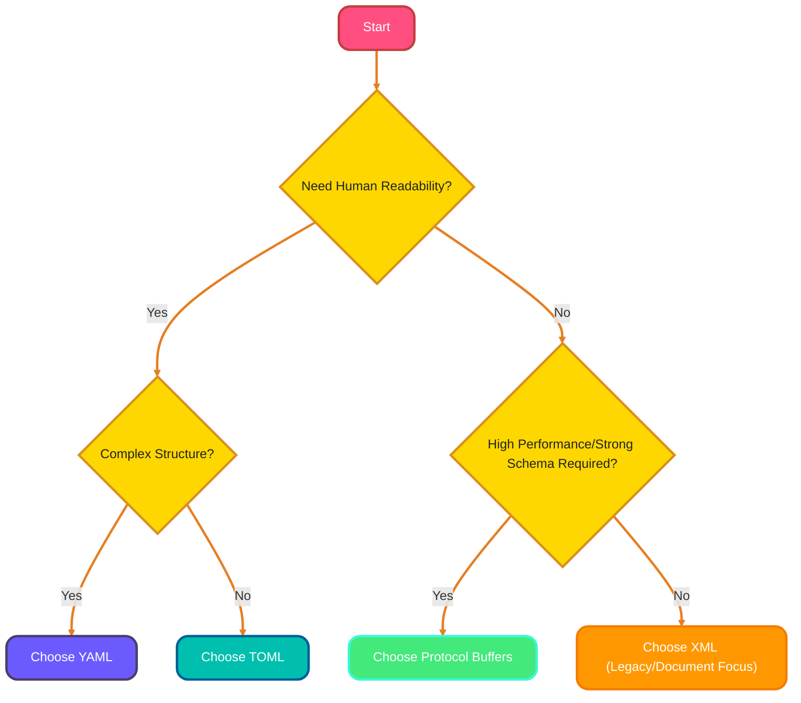

<!--
meta-description: "Complete guide to JSON serialization in Go: encoding, decoding, struct tags, dynamic JSON handling, streaming, and working with multiple data formats."
keywords: "Go JSON, json.Marshal, json.Unmarshal, struct tags, JSON encoding, JSON decoding, json.Encoder, json.Decoder, Protocol Buffers, YAML, TOML, data serialization"
-->

# <span style="color:#e67e22;">What we will learn in this post?</span>
<ul style='list-style-type: none; padding-left: 0;'>
<li><span style='color: #2980b9; font-size: 20px; font-weight: bold;'>👉</span> <span style='color: #2ecc71; font-size: 18px; font-weight: bold;'>JSON Encoding</span></li>
<li><span style='color: #2980b9; font-size: 20px; font-weight: bold;'>👉</span> <span style='color: #2ecc71; font-size: 18px; font-weight: bold;'>JSON Decoding</span></li>
<li><span style='color: #2980b9; font-size: 20px; font-weight: bold;'>👉</span> <span style='color: #2ecc71; font-size: 18px; font-weight: bold;'>Struct Tags for JSON</span></li>
<li><span style='color: #2980b9; font-size: 20px; font-weight: bold;'>👉</span> <span style='color: #2ecc71; font-size: 18px; font-weight: bold;'>Working with Unknown JSON</span></li>
<li><span style='color: #2980b9; font-size: 20px; font-weight: bold;'>👉</span> <span style='color: #2ecc71; font-size: 18px; font-weight: bold;'>JSON Streaming</span></li>
<li><span style='color: #2980b9; font-size: 20px; font-weight: bold;'>👉</span> <span style='color: #2ecc71; font-size: 18px; font-weight: bold;'>Other Formats</span></li>
<li><span style='color: #2980b9; font-size: 20px; font-weight: bold;'>👉</span> <span style='color: #2ecc71; font-size: 18px; font-weight: bold;'>Conclusion!</span></li>
</ul>

# <span style="color:#e67e22">Encoding Go Structs to JSON 🚀</span>

Go's `encoding/json` package makes converting structs to JSON simple! Whether you're building REST APIs, storing configuration data, or exchanging information between microservices, JSON encoding is essential for modern application development.

## <span style="color:#2980b9">How Struct Fields Become JSON 🔄</span>

When a Go struct is marshaled:
*   **Exported Fields**: Fields starting with an *uppercase* letter are included.
*   **`json` Tags**: Use `json:"fieldName"` to customize the JSON key name. `json:"-"` skips a field, and `json:"fieldName,omitempty"` omits a field if it has its zero value (e.g., `0`, `""`, `false`, `nil`).
*   **Unexported Fields**: Fields starting with a *lowercase* letter are *ignored*.
*   **Data Types**: Go types generally map directly: `string` to JSON string, `int`/`float` to JSON number, `bool` to JSON boolean, `slice`/`array` to JSON array, and `struct`/`map` to JSON object.

## <span style="color:#2980b9">Encoding with `json.Marshal()` 📝</span>

`json.Marshal()` converts your struct into a compact, single-line JSON byte slice. It's great for minimal data transfer.

## <span style="color:#2980b9">Pretty-Printing with `json.MarshalIndent()` ✨</span>

For better readability, `json.MarshalIndent()` formats the JSON output with indentation. You specify a `prefix` (string before each line) and an `indent` string (e.g., `" "` for two spaces).

### <span style="color:#8e44ad">Encoding Flow 🌊</span>



### <span style="color:#8e44ad">Example with Data Types 💡</span>

Let's see it in action with various types:

```go
package main

import (
	"encoding/json"
	"fmt"
)

type Product struct {
	ID        int      `json:"product_id"`
	Name      string   `json:"name"`
	Price     float64  `json:"price"`
	InStock   bool     `json:"in_stock"`
	Tags      []string `json:"tags,omitempty"`
	secretKey string   // ignored
}

func main() {
	item := Product{
		ID:        101,
		Name:      "Laptop",
		Price:     1200.50,
		InStock:   true,
		Tags:      []string{"electronics", "gadget"},
		secretKey: "hidden",
	}

	// 1. Compact JSON with json.Marshal()
	jsonData, _ := json.Marshal(item)
	fmt.Println("Compact JSON:", string(jsonData))
	// Output: {"product_id":101,"name":"Laptop","price":1200.5,"in_stock":true,"tags":["electronics","gadget"]}

	// 2. Pretty-printed JSON with json.MarshalIndent()
	prettyJSON, _ := json.MarshalIndent(item, "", "  ") // No prefix, 2-space indent
	fmt.Println("\nPretty JSON:\n", string(prettyJSON))
	/* Output:
	{
	  "product_id": 101,
	  "name": "Laptop",
	  "price": 1200.5,
	  "in_stock": true,
	  "tags": [
	    "electronics",
	    "gadget"
	  ]
	}
	*/
}
```

Notice how `secretKey` is ignored, `Tags` are an array, and `price` is a float.

For more details, check the official `encoding/json` documentation: [pkg.go.dev/encoding/json](https://pkg.go.dev/encoding/json).

# <span style="color:#e67e22">Decoding JSON into Go Structs with `json.Unmarshal()` 📦</span>

Go's standard library `encoding/json` package provides `json.Unmarshal()` – your primary tool for converting JSON data into structured Go structs. Whether you're consuming REST APIs, processing webhook payloads, or reading configuration files, mastering JSON decoding is crucial for handling external data reliably.

## <span style="color:#2980b9">How it Works: The `json.Unmarshal()` Magic ✨</span>
To use it, you call `json.Unmarshal(jsonBytes, &myStruct)`. This function takes two main arguments:
1.  A `[]byte` slice containing your JSON data.
2.  A *pointer* to your Go struct, which `json.Unmarshal()` will fill with the decoded values.

It returns an `error` if any issue occurs during the decoding process.

## <span style="color:#2980b9">Matching Keys & Fields 🤝</span>
`json.Unmarshal()` primarily matches JSON keys to *exported* Go struct fields (those starting with an uppercase letter) based on their names. For precise control, especially when JSON keys differ from Go field names (e.g., `snake_case` vs. `CamelCase`), use **struct tags**:

```go
type User struct {
    ID      int    `json:"user_id"`      // JSON "user_id" maps to Go 'ID'
    Name    string `json:"full_name"`    // JSON "full_name" maps to Go 'Name'
    IsAdmin bool   `json:"is_admin,omitempty"` // "omitempty" omits field if empty
}
```
This tells `json.Unmarshal()` exactly how to map JSON keys to struct fields.

## <span style="color:#2980b9">Handling Type Mismatches & Errors 🚨</span>
If `json.Unmarshal()` encounters a JSON value whose type doesn't match the corresponding Go struct field's type (e.g., a JSON `string` for an `int` field), it will return an `error`. *Always* check for this error:

```go
var user User
jsonData := []byte(`{"user_id": 123, "full_name": "Alice", "is_admin": false}`)

err := json.Unmarshal(jsonData, &user)
if err != nil {
    // Crucial: Handle potential decoding errors gracefully
    fmt.Printf("Error decoding JSON: %v\n", err)
    return
}
// If no error, 'user' struct is successfully populated!
fmt.Printf("Decoded User Name: %s\n", user.Name)
```

This error checking ensures your program is robust against unexpected or malformed JSON data.


## <span style="color:#e67e22">Unlocking Go JSON Struct Tags! 🔑</span>

Go's `encoding/json` package leverages *struct tags* to precisely control how your Go structs interact with JSON. Essential for API contracts, database mappings, and third-party integrations, these tags ensure your JSON output matches exact specifications while keeping your Go code clean and idiomatic.

---

### <span style="color:#2980b9">Custom Field Names `json:"fieldName"` 🏷️</span>

Use `json:"your_name"` to give your JSON key a different name than your Go struct's field. This is super handy for aligning with external API conventions.

*   **Example:**
    ```go
    type User struct {
        Name string `json:"full_name"`
    }
    // JSON Output: {"full_name": "Alice"}
    ```

### <span style="color:#2980b9">Omitting Empty Values `omitempty` 🚫</span>

Add `,omitempty` to a tag to automatically hide a field from the JSON output if its value is the *zero value* (e.g., `0` for integers, `""` for strings, `nil` for pointers/slices/maps). Keeps your JSON clean!

*   **Example:**
    ```go
    type Product struct {
        Price float64 `json:"price,omitempty"`
    }
    // Price = 0.0 -> JSON: {}
    // Price = 9.99 -> JSON: {"price": 9.99}
    ```

### <span style="color:#2980b9">Ignoring Fields `json:"-"` 🙈</span>

The `json:"-"` tag completely excludes a field during both marshaling (Go to JSON) and unmarshaling (JSON to Go). Ideal for sensitive or internal-only data you never want exposed.

*   **Example:**
    ```go
    type Account struct {
        Password string `json:"-"`
    }
    // JSON Output: {} (Password field is ignored)
    ```

### <span style="color:#2980b9">String Conversion `json:",string"` 📝</span>

Append `,string` to a tag to convert numeric or boolean fields into their JSON string representation. This is crucial for large integers that might exceed JavaScript's safe integer range, or when an API explicitly expects a number as a string.

*   **Example:**
    ```go
    type Item struct {
        ID int `json:"id,string"`
    }
    // ID = 12345 -> JSON: {"id": "12345"}
    ```

---

### <span style="color:#8e44ad">How Tags Influence JSON Conversion 🚀</span>



For more in-depth information, explore the official Go `encoding/json` package documentation: [Go JSON Docs](https://pkg.go.dev/encoding/json).

# <span style="color:#e67e22">Mastering Dynamic JSON in Go 🚀</span>

Working with unpredictable JSON structures in Go? Whether you're consuming third-party APIs with varying schemas, processing webhook events, or handling plugin configurations, Go provides powerful tools for dynamic JSON handling.

## <span style="color:#2980b9">Your JSON Canvas: `map[string]interface{}` 🎨</span>

For JSON whose structure you don't know beforehand, unmarshal it into a `map[string]interface{}`. This treats JSON objects as a map where keys are `string`s and values can be *anything* (`interface{}`), including nested maps, slices, strings, numbers, or booleans.

*   **How to use:**
    ```go
    var dynamicData map[string]interface{}
    err := json.Unmarshal(jsonData, &dynamicData)
    ```

## <span style="color:#2980b9">Unlocking Values with Type Assertions 🔑</span>

Since values are `interface{}`, you need *type assertions* to get their concrete types. Remember that JSON numbers become `float64` in Go. Always check `ok`!

*   **Examples:**
    *   *String:* `name, ok := dynamicData["user"].(string)`
    *   *Number:* `age, ok := dynamicData["age"].(float64)`
    *   *Nested Object:* `details, ok := dynamicData["profile"].(map[string]interface{})`

## <span style="color:#2980b9">Delayed Parsing with `json.RawMessage` ⏳</span>

Use `json.RawMessage` when you want to store a JSON sub-tree *as-is* without parsing it immediately. This is super useful for efficiency or if a part of the JSON has a complex structure that you only need to process under certain conditions.

*   **How to use:** Define a `struct` field as `json.RawMessage`. You can then `json.Unmarshal` *that specific field* into another struct later.

### <span style="color:#8e44ad">Visualizing the Flow 🗺️</span>



---

# <span style="color:#e67e22">🌊 Streamlining JSON with Go's `json.Encoder`/`Decoder`</span>

When working with JSON, especially large data or continuous streams like HTTP responses or files, Go's `json.Encoder` and `json.Decoder` offer a **streaming approach**. Critical for handling large datasets, log processing, and real-time data pipelines, streaming avoids memory overload by processing JSON incrementally.

## <span style="color:#2980b9">📤 Encoding JSON Streams with `json.Encoder.Encode()`</span>

`json.Encoder.Encode()` writes your Go data (`struct`, `map`, etc.) *directly to an `io.Writer`* as it converts it to JSON.

*   It's perfect for **sending HTTP responses** or **writing to files** where you generate JSON on the fly.
*   **Benefit:** Low memory footprint, as it doesn't build the complete JSON string in memory first.

```go
// Example: Writing to an HTTP response
encoder := json.NewEncoder(w) // w is http.ResponseWriter
encoder.Encode(myGoData)
```

## <span style="color:#2980b9">📥 Decoding JSON Streams with `json.Decoder.Decode()`</span>

Conversely, `json.Decoder.Decode()` *reads JSON from an `io.Reader`* (like an HTTP request body or a file) and parses it into a Go variable.

*   You can *process incoming data incrementally* without needing to read the entire request body or file contents upfront.
*   **Benefit:** Essential for handling large incoming JSON payloads, preventing out-of-memory errors.

```go
// Example: Reading from an HTTP request body
decoder := json.NewDecoder(r.Body) // r.Body is io.Reader
decoder.Decode(&targetGoData)
```

## <span style="color:#2980b9">⚖️ Streaming vs. `Marshal`/`Unmarshal`: When to Choose?</span>

*   **⚡️ Choose Streaming (`Encoder`/`Decoder`) when:**
    *   Dealing with **very large JSON data** (MBs or GBs).
    *   Memory efficiency is paramount.
    *   Working with **continuous data streams** (e.g., HTTP long polling, file processing).
*   **📦 Choose `json.Marshal`/`json.Unmarshal` when:**
    *   JSON data is relatively **small and finite**.
    *   You can comfortably hold the entire JSON object in memory.

### <span style="color:#8e44ad">Flow of Streaming JSON</span>



---

# <span style="color:#e67e22">Working with Data Formats in Go! 🚀</span>

Go makes handling different data formats easy with its powerful libraries. From configuration files to high-performance RPC systems, choosing the right format impacts readability, performance, and system interoperability.

## <span style="color:#2980b9">XML: The Structured Documenter 📜</span>

*   **Go Package:** Built-in `encoding/xml`.
*   **What it is:** A hierarchical, tag-based format, often used for complex document exchange and older web services like SOAP. Go's `xml.Marshal` and `xml.Unmarshal` functions, along with struct tags, make converting Go structs to XML and vice versa straightforward.
*   **When to Use:** When integrating with legacy systems, processing document-centric data, or if a service specifically requires XML.

## <span style="color:#2980b9">YAML: The Human-Friendly Config 📄</span>

*   **Go Package:** `gopkg.in/yaml.v3`.
*   **What it is:** Popular for its *human readability*, YAML uses indentation to define structure. It's a go-to for settings and configurations.
*   **When to Use:** Ideal for configuration files (e.g., Kubernetes), CI/CD pipelines, or any data that needs to be easily read and edited by people.

## <span style="color:#2980b9">TOML: Simple Config, Clearly 💪</span>

*   **Go Package:** `github.com/BurntSushi/toml`.
*   **What it is:** "Tom's Obvious, Minimal Language" prioritizes simplicity and clarity. It's often easier to parse mentally than YAML for basic key-value pairs, though less expressive for very complex structures.
*   **When to Use:** Best for straightforward application configuration files where clarity and ease of writing are more important than deep hierarchical complexity.

## <span style="color:#2980b9">Protocol Buffers: The Efficient Communicator ⚡</span>

*   **Go Package:** `google.golang.org/protobuf/proto` (requires `protoc` compiler for schema generation).
*   **What it is:** Google's language-agnostic, binary serialization format. Defined by `.proto` schema files, it's incredibly *efficient*, fast, and strongly typed, making it great for high-performance data transfer.
*   **When to Use:** Microservices communication, RPC (Remote Procedure Calls), storing structured data efficiently, and cross-language interoperability where speed and data integrity are critical.

## <span style="color:#2980b9">Quick Comparison Table 📊</span>

| Format | Best For | Human Readable? | Performance | Go Package | Schema Required? |
|--------|----------|-----------------|-------------|------------|------------------|
| **JSON** | REST APIs, web apps, general data exchange | ✅ Yes | Medium | `encoding/json` | ❌ No |
| **XML** | Legacy systems, SOAP, document-centric data | ✅ Yes | Medium | `encoding/xml` | ❌ No (optional) |
| **YAML** | Config files, Kubernetes, CI/CD | ✅ Yes (very) | Slow | `gopkg.in/yaml.v3` | ❌ No |
| **TOML** | Simple configs, app settings | ✅ Yes | Medium | `github.com/BurntSushi/toml` | ❌ No |
| **Protocol Buffers** | Microservices, RPC, high-performance APIs | ❌ No (binary) | Very Fast | `google.golang.org/protobuf/proto` | ✅ Yes (`.proto`) |

## <span style="color:#2980b9">Picking Your Format 🤔</span>

The best choice depends on your project's needs: readability, performance, or existing system requirements.



## <span style="color:#2980b9">Dive Deeper 📚</span>

*   Go XML Documentation: [https://pkg.go.dev/encoding/xml](https://pkg.go.dev/encoding/xml)
*   Go YAML Library: [https://github.com/go-yaml/yaml](https://github.com/go-yaml/yaml)
*   Go TOML Library: [https://github.com/BurntSushi/toml](https://github.com/BurntSushi/toml)
*   Go Protocol Buffers Tutorial: [https://developers.google.com/protocol-buffers/docs/gotutorial](https://developers.google.com/protocol-buffers/docs/gotutorial)

---

<details>
<summary><h1 style="display:inline;"><span style='color:#43e97b'>🎯 Hands-On Assignment</span></h1></summary>

Ready to master JSON and data serialization? Complete this assignment and share your solution in the comments below!

### 📋 Problem Statement

Build a **Configuration Manager** that handles multiple data formats (JSON, YAML, TOML) and provides a unified interface for reading and writing configuration files. Your program should support format conversion and validation.

### ✅ Requirements

Create a program with the following features:

1. **Config struct** with these fields:
   - `AppName` (string)
   - `Version` (string)
   - `Server` (nested struct with `Host`, `Port`, `TLS` bool)
   - `Database` (nested struct with `Driver`, `Host`, `Port`, `Name`)
   - `Features` (map[string]bool for feature flags)
   - `MaxConnections` (int)

2. **Core functions:**
   - `LoadConfig(filepath string) (*Config, error)` - auto-detect format
   - `SaveConfig(config *Config, filepath string, format string) error`
   - `ConvertFormat(inputPath, outputPath, format string) error`
   - `ValidateConfig(config *Config) error` - check required fields

3. **Format support:** JSON, YAML, TOML

### 💡 Implementation Hints

1. Use struct tags for all three formats: `` `json:"..." yaml:"..." toml:"..."` ``
2. Detect format by file extension (`.json`, `.yaml`, `.toml`)
3. Use `encoding/json`, `gopkg.in/yaml.v3`, `github.com/BurntSushi/toml`
4. Implement custom validation rules (e.g., port range 1-65535)
5. Handle nested structs properly in all formats
6. Add helpful error messages for parsing failures

### 📝 Example Input/Output

**config.json:**
```json
{
  "app_name": "MyApp",
  "version": "1.0.0",
  "server": {
    "host": "localhost",
    "port": 8080,
    "tls": true
  },
  "database": {
    "driver": "postgres",
    "host": "db.example.com",
    "port": 5432,
    "name": "myapp_db"
  },
  "features": {
    "auth": true,
    "analytics": false,
    "api_v2": true
  },
  "max_connections": 100
}
```

**Converted to YAML (config.yaml):**
```yaml
app_name: MyApp
version: 1.0.0
server:
  host: localhost
  port: 8080
  tls: true
database:
  driver: postgres
  host: db.example.com
  port: 5432
  name: myapp_db
features:
  analytics: false
  api_v2: true
  auth: true
max_connections: 100
```

**Program Output:**
```
✓ Loaded config from config.json
✓ Validation passed
✓ Converted to YAML format
✓ Saved to config.yaml

Configuration Summary:
- App: MyApp v1.0.0
- Server: localhost:8080 (TLS enabled)
- Database: postgres://db.example.com:5432/myapp_db
- Active Features: auth, api_v2
- Max Connections: 100
```

### 🌟 Bonus Challenges

1. Add environment variable override support (e.g., `APP_SERVER_PORT=9000`)
2. Implement config file watching with automatic reload
3. Add encryption/decryption for sensitive fields (passwords, API keys)
4. Create a diff function to compare two config files
5. Support partial config updates (merge instead of replace)
6. Add a CLI interface with commands: `load`, `save`, `convert`, `validate`

### 📤 Submission Guidelines

- Create sample config files in all three formats
- Test format conversion in both directions
- Include validation test cases (valid and invalid configs)
- Share your complete code in the comments
- Explain how you handled format differences
- Show output from running your program

**Can't wait to see your implementations!** Share your solution below and learn from other approaches. 💬

</details>

---

<h1><span style='color:#e67e22'>Conclusion</span></h1>

Well, that's all for today! ✨ We truly hope you found this post interesting and helpful. Now, we're super curious to hear from you! What are your thoughts or experiences on this topic? Do you have any tips or suggestions to add? Don't be shy – drop your comments, feedback, or even a simple "hello" below. Let's get a conversation going! 👇 We can't wait to read what you have to say. Happy commenting! 😊

