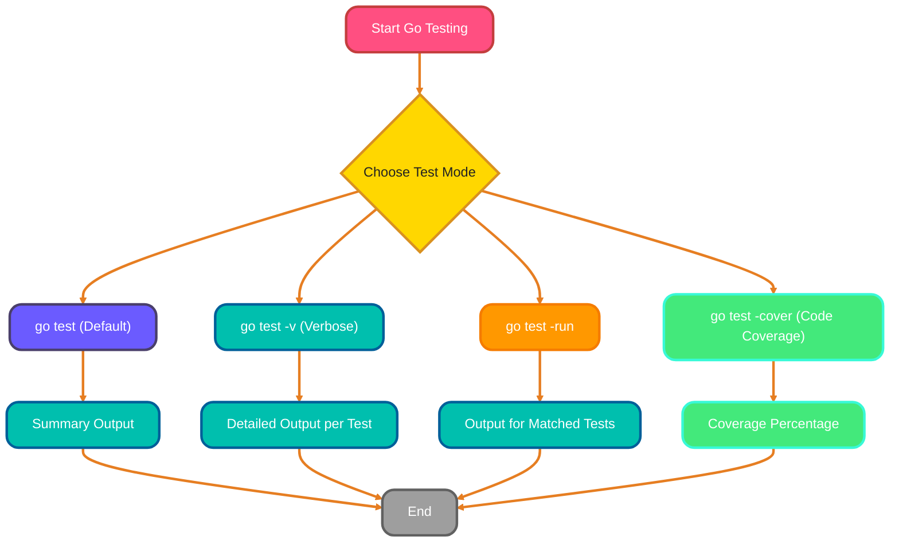
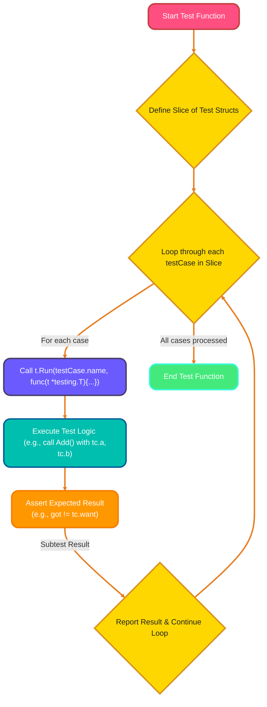
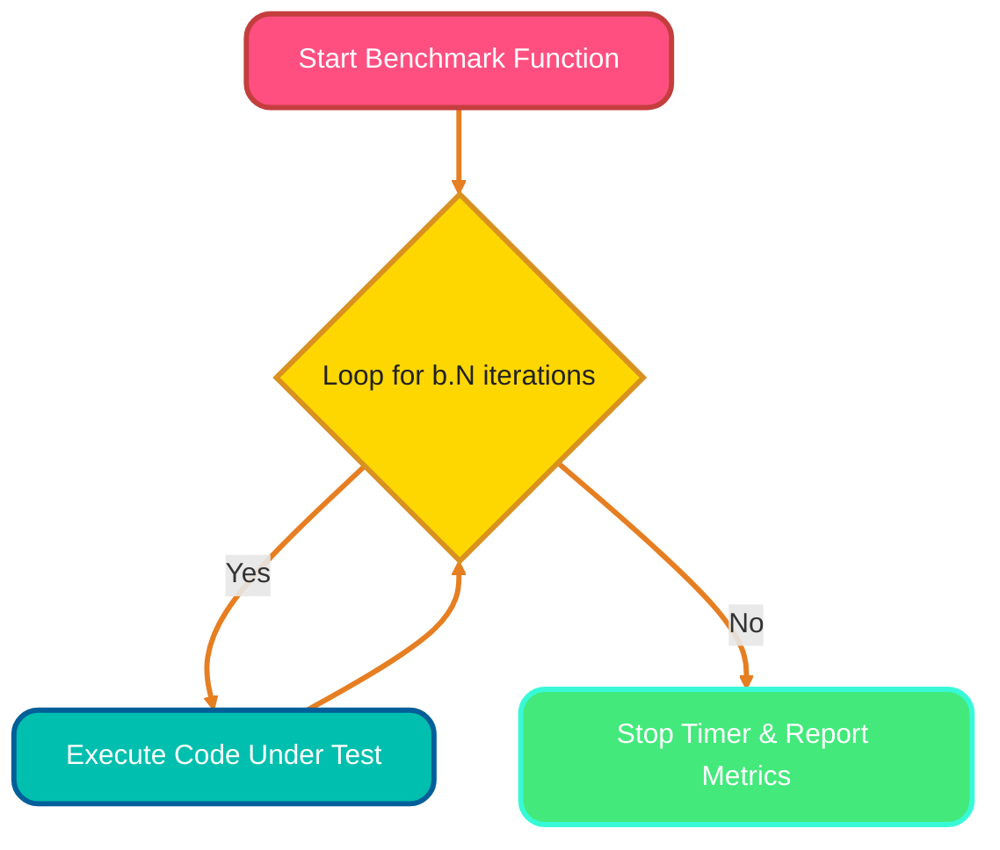
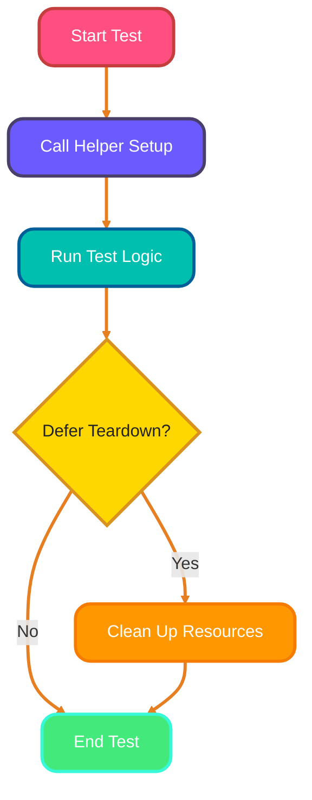
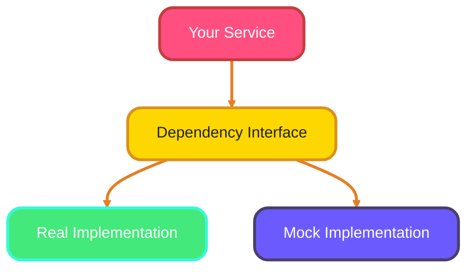

<!--
meta-description: "Complete guide to testing in Go: writing unit tests, table-driven tests, benchmarking, test helpers, mocking, and best practices for reliable Go applications."
keywords: "Go testing, go test, unit testing, table-driven tests, benchmarking, test coverage, mocking, gomock, testify, test helpers, Go benchmarks, testing.T"
-->

# <span style="color:#e67e22;">What we will learn in this post?</span>
<ul style='list-style-type: none; padding-left: 0;'>
<li><span style='color: #2980b9; font-size: 20px; font-weight: bold;'>👉</span> <span style='color: #2ecc71; font-size: 18px; font-weight: bold;'>Writing Tests</span></li>
<li><span style='color: #2980b9; font-size: 20px; font-weight: bold;'>👉</span> <span style='color: #2ecc71; font-size: 18px; font-weight: bold;'>Running Tests</span></li>
<li><span style='color: #2980b9; font-size: 20px; font-weight: bold;'>👉</span> <span style='color: #2ecc71; font-size: 18px; font-weight: bold;'>Table-Driven Tests</span></li>
<li><span style='color: #2980b9; font-size: 20px; font-weight: bold;'>👉</span> <span style='color: #2ecc71; font-size: 18px; font-weight: bold;'>Benchmarking</span></li>
<li><span style='color: #2980b9; font-size: 20px; font-weight: bold;'>👉</span> <span style='color: #2ecc71; font-size: 18px; font-weight: bold;'>Test Helpers</span></li>
<li><span style='color: #2980b9; font-size: 20px; font-weight: bold;'>👉</span> <span style='color: #2ecc71; font-size: 18px; font-weight: bold;'>Mocking and Test Doubles</span></li>
<li><span style='color: #2980b9; font-size: 20px; font-weight: bold;'>👉</span> <span style='color: #2ecc71; font-size: 18px; font-weight: bold;'>Conclusion!</span></li>
</ul>

# <span style="color:#e67e22">Go Testing Made Easy! 🧪</span>

Go's built-in `testing` package is your friendly guide for writing automated tests. Essential for maintaining code quality in production systems, testing catches bugs early and provides confidence during refactoring and feature development.

## <span style="color:#2980b9">Naming Rules You Need to Know! ✍️</span>

*   **Test Files**: Always end with `_test.go`, like `calculator_test.go`. These files sit alongside the code they test.
*   **Test Functions**: Must start with `Test` followed by an *uppercase letter*, e.g., `TestAdd`, `TestCalculateTotal`. They always accept a single parameter: `t *testing.T`.

## <span style="color:#2980b9">Testing Your Own Code 🤝</span>

To test functions from your package, you simply `import` it into your `_test.go` file. For instance, if your package is `example.com/myapp/calculator`, you'd `import "example.com/myapp/calculator"`.

## <span style="color:#2980b9">Handling Failures: `t.Error` vs. `t.Fatal` 🛑</span>

The `t *testing.T` parameter gives you tools to report issues:
*   `t.Error()` (or `t.Errorf()`): Marks the test as failed but *continues* running the rest of the test function.
*   `t.Fatal()` (or `t.Fatalf()`): Marks the test as failed and *stops* the test function immediately. Choose based on whether subsequent steps make sense after an error.

## <span style="color:#2980b9">A Simple Test Example 🧑‍💻</span>

Let's test an `Add` function from a `calculator` package:

```go
package calculator_test // Test files live in a *_test package

import (
	"testing"
	"example.com/myapp/calculator" // Importing the package we want to test
)

// TestAdd tests the Add function
func TestAdd(t *testing.T) {
	result := calculator.Add(2, 3) // Call the function under test
	expected := 5

	if result != expected {
		// If results don't match, report an error and continue
		t.Errorf("Add(2, 3) got %d, wanted %d", result, expected) 
	}
}
```

# <span style="color:#e67e22">Testing Your Go Code with `go test` 🚀</span>

`go test` is your *friendly command* for running tests in Go! Essential for local development and CI/CD pipelines, it finds files ending in `_test.go` and executes functions starting with `Test`.


<small><i>Diagram: `go test` command flow.</i></small>

## <span style="color:#2980b9">Basic Test Run ✨</span>

Simply type `go test` in your package directory. It runs all tests and provides a summary.

*Example Output:*
```
ok      yourmodule/pkg  0.005s
```

## <span style="color:#2980b9">Verbose Mode for Details 🗣️</span>

Use the `-v` flag: `go test -v` to see *each test* run and its result.

*Example Output:*
```
=== RUN   TestSum
--- PASS: TestSum (0.00s)
=== RUN   TestSubtract
--- PASS: TestSubtract (0.00s)
ok      yourmodule/pkg  0.005s
```

## <span style="color:#2980b9">Running Specific Tests 🎯</span>

The `-run` flag lets you select tests using a regular expression pattern: `go test -run "TestSum"` or `go test -run "TestCalc.*"`.

*Example Output:*
```
=== RUN   TestSum
--- PASS: TestSum (0.00s)
ok      yourmodule/pkg  0.003s
```

## <span style="color:#2980b9">Measuring Code Coverage 📈</span>

The `-cover` flag helps you understand how much of your code is *actually tested*: `go test -cover`. It shows a percentage of statements covered.

*Example Output:*
```
ok      yourmodule/pkg  0.006s  coverage: 85.7% of statements
```

### <span style="color:#8e44ad">Further Learning 📚</span>
*   [Go Command Documentation](https://pkg.go.dev/cmd/go)
*   [Go Blog: Test Coverage](https://go.dev/blog/cover)

# <span style="color:#e67e22">What is Table-Driven Testing? 📋</span>

Table-driven testing is a smart and efficient Go pattern for organizing your tests. Widely used in production Go codebases, this approach makes adding new test cases trivial and keeps your test suite maintainable as complexity grows.

## <span style="color:#2980b9">How It Works: The Recipe 🧑‍🍳</span>

### <span style="color:#8e44ad">Ingredients: Test Cases! 🧪</span>
You define your test cases as a `slice of structs` (e.g., `[]struct{}`), where each struct contains the *inputs*, the `expected` result, and a `name` for that specific scenario. This clearly outlines each test's purpose.

### <span style="color:#8e44ad">The Loop: `t.Run()` Magic ✨</span>
You then *iterate* through this slice. For each test case, you call `t.Run(testCase.name, func(t *testing.T) { ... })`. This creates a *subtest*, allowing Go to run and report on each scenario *independently*, even if one fails.

## <span style="color:#2980b9">Why It's Awesome: The Perks! 💪</span>

*   **Efficiency:** Test numerous scenarios with *minimal code duplication*.
*   **Readability:** It's super *easy to understand* inputs, expected results, and test names at a glance.
*   **Maintainability:** *Adding new tests* is a breeze—just append a new struct to your slice!

## <span style="color:#2980b9">Example in Action 🚀</span>

Let's test a simple `Add` function:

```go
func TestAdd(t *testing.T) {
    cases := []struct {
        name string
        a, b int
        want int
    }{
        {"positive numbers", 1, 2, 3},
        {"negative numbers", -1, -2, -3},
        {"zero inputs", 0, 0, 0},
        {"mixed numbers", 5, -3, 2},
    }

    for _, tc := range cases { // Iterate through our test table
        t.Run(tc.name, func(t *testing.T) { // Create a subtest for each case
            if got := Add(tc.a, tc.b); got != tc.want {
                t.Errorf("Add(%d, %d) = %d; want %d", tc.a, tc.b, got, tc.want)
            }
        })
    }
}

// Imagine 'Add' is a simple function like:
// func Add(a, b int) int { return a + b }
```

## <span style="color:#2980b9">The Flow 🌊</span>

Here's how the process generally looks:



## <span style="color:#2980b9">Want More Info? 📖</span>

Dive deeper into Go's testing features with the official [Go testing package documentation](https://go.dev/pkg/testing/).

# <span style="color:#e67e22">Benchmarking Go Code: A Performance Deep Dive 🚀</span>

Go benchmarks help you understand how fast your code runs and how much memory it uses. Critical for optimizing hot paths and making data-driven performance decisions, benchmarks provide objective measurements before and after optimization attempts.

---

## <span style="color:#2980b9">Crafting Your Benchmark ✨</span>

To write a benchmark:
*   **Naming**: Create a function starting with `Benchmark` (e.g., `func BenchmarkCalculateSum(b *testing.B)`).
*   **Location**: Place it in a `_test.go` file, just like regular tests.
*   **The `b.N` Loop**: Wrap the code you want to measure inside a `for i := 0; i < b.N; i++` loop.
    *   `b.N` is dynamically adjusted by Go to ensure accurate timing across many iterations.
*   **Setup**: If you have setup code, run it *before* the `b.N` loop or use `b.ResetTimer()`.

```go
package main

import "testing"

// Function to be benchmarked
func SumUpTo(n int) int {
    sum := 0
    for i := 1; i <= n; i++ {
        sum += i
    }
    return sum
}

// Benchmark function
func BenchmarkSumUpTo100(b *testing.B) {
    for i := 0; i < b.N; i++ {
        SumUpTo(100) // Code under test
    }
}
```

### <span style="color:#8e44ad">How `b.N` Works ⚙️</span>



---

## <span style="color:#2980b9">Running & Interpreting Results 📊</span>

Run your benchmarks from your terminal:

```bash
go test -bench=. -benchmem
```
*   `go test -bench=.`: Runs all benchmark functions.
*   `-benchmem`: Shows memory allocation statistics.

**Interpreting Output:**

```
BenchmarkSumUpTo100-8   1000000000           0.278 ns/op           0 B/op           0 allocs/op
```

*   `1000000000`: How many times the function was run (`b.N`).
*   `0.278 ns/op`: *Nanoseconds per operation*. This is the average time each operation took. **Lower is better!**
*   `0 B/op`: *Bytes allocated per operation*. Total memory allocated. **Lower is better!**
*   `0 allocs/op`: *Allocations per operation*. Number of memory allocations. **Lower is better!**

Aim for *lower* numbers across all metrics to indicate more efficient code.

---
# <span style="color:#e67e22">Supercharge Your Go Tests! 🚀</span>

## <span style="color:#2980b9">Helper Functions & `t.Helper()` Magic ✨</span>

*Helper functions* let you reuse common test logic, like creating data or asserting conditions, making tests cleaner and preventing repetition. Essential for large test suites, helpers reduce duplication and ensure consistent test patterns across your codebase.

```go
func assertEqual(t *testing.T, got, want string) {
    t.Helper() // Crucial for clearer error messages!
    if got != want { t.Errorf("got %q want %q", got, want) }
}

func TestSum(t *testing.T) {
    assertEqual(t, "hello", "world") // If it failed, error points here!
}
```

## <span style="color:#2980b9">Organizing Test Data with `testdata/` 📁</span>

The special `testdata/` directory is ideal for static files needed by tests (e.g., JSON configuration, sample CSVs, mock images). Go *ignores* its contents during compilation, keeping your main build clean and tidy.

## <span style="color:#2980b9">Setup & Teardown Patterns 🛠️</span>

For managing resources (like temporary files or database connections) *before* and *after* tests, helper functions are excellent. You can use `defer` to ensure *teardown* (cleanup) always runs after your test finishes. For package-level setup/teardown, the `TestMain` function is your go-to for more complex scenarios.



**More Info:** [Go Testing Documentation](https://pkg.go.dev/testing)

# <span style="color:#e67e22">Let's Talk Go Mocking! 🧪</span>

Mocking in Go helps you *test your code in isolation* by replacing external dependencies with controlled, fake versions. Critical for testing services that depend on databases, APIs, or external systems, mocks enable fast, deterministic unit tests.

## <span style="color:#2980b9">Why Mock in Go? 🤔</span>
Mocks are crucial for:
*   **Unit Testing**: Focus on a single piece of logic.
*   **Speed**: Avoid slow database calls or API requests.
*   **Reliability**: Test edge cases without external system issues.

## <span style="color:#2980b9">Key Strategies 🛠️</span>

### <span style="color:#8e44ad">1. Interfaces are Your Friends 🤝</span>
Go's *interfaces* are the foundation. Your code should depend on *interfaces* (e.g., `interface{ Save(data string) error }`) rather than concrete types. This is *dependency injection*, allowing you to swap implementations.
*(Learn more about Go Interfaces: [go.dev/tour/methods/9](https://go.dev/tour/methods/9))*



### <span style="color:#8e44ad">2. Crafting Mock Implementations ✍️</span>
You create a custom `struct` that *implements* your chosen `interface`. This "mock" struct contains test-specific logic, letting you simulate behavior or record calls without real external interactions.

### <span style="color:#8e44ad">3. Popular Mocking Libraries 📚</span>
For less manual work:
*   `testify/mock`: A widely used library allowing a *fluent API* to define expected calls and return values. Great for flexible, runtime mocks.
    *(Explore `testify/mock`: [pkg.go.dev/github.com/stretchr/testify/mock](https://pkg.go.dev/github.com/stretchr/testify/mock))*
*   `gomock`: From Google, this tool *generates mock code* from your interfaces, ensuring strong type safety and reducing boilerplate for larger projects.
    *(Check out `gomock`: [github.com/golang/mock](https://github.com/golang/mock))*

## <span style="color:#2980b9">Mocks vs. Real: When to Choose? ✅❌</span>
*   **Use Mocks**: For *unit tests* where you isolate code, simulate errors, or interact with slow/costly external systems.
*   **Use Real**: For *integration tests* to ensure components work together, or when dependencies are simple and stable.

# <span style="color:#e67e22">Testing Tools Comparison 🛠️</span>

Choosing the right testing tool depends on your project needs and team preferences. Here's a quick comparison:

| Tool/Library | Purpose | Learning Curve | Installation | Best For |
|--------------|---------|----------------|--------------|----------|
| **`testing` (built-in)** | Basic unit tests, benchmarks | ⭐ Easy | ❌ No (built-in) | All Go projects, learning basics |
| **`testify/assert`** | Cleaner assertions | ⭐ Easy | ✅ `go get` | Readable test assertions |
| **`testify/mock`** | Manual mock creation | ⭐⭐ Medium | ✅ `go get` | Flexible mocking with fluent API |
| **`gomock`** | Generated mocks from interfaces | ⭐⭐⭐ Medium-Hard | ✅ `go install` + codegen | Type-safe mocks, large projects |
| **`httptest`** | HTTP handler testing | ⭐ Easy | ❌ No (built-in) | Testing HTTP servers/clients |
| **`go-sqlmock`** | Database mocking | ⭐⭐ Medium | ✅ `go get` | Testing database interactions |

## <span style="color:#2980b9">Quick Tips for Choosing 💡</span>

*   **Starting out?** Stick with built-in `testing` package first.
*   **Need cleaner assertions?** Add `testify/assert` for better readability.
*   **Complex dependencies?** Use `gomock` for generated, type-safe mocks.
*   **Testing APIs?** Leverage `httptest` for simulating HTTP requests/responses.

# <span style="color:#e67e22">Common Testing Pitfalls ⚠️</span>

Avoid these common mistakes to keep your tests reliable and maintainable:

## <span style="color:#2980b9">1. Forgetting `t.Parallel()` 🏃</span>
**Problem:** Tests run sequentially, wasting time on slow test suites.
```go
func TestSlowOperation(t *testing.T) {
    t.Parallel() // ✅ Add this to run tests concurrently!
    // ... test logic
}
```
**Solution:** Add `t.Parallel()` to independent tests for faster execution.

## <span style="color:#2980b9">2. Not Cleaning Up Resources 🧹</span>
**Problem:** Tests leave behind temp files, open connections, or goroutines.
```go
func TestFileOperation(t *testing.T) {
    f, _ := os.CreateTemp("", "test")
    t.Cleanup(func() { os.Remove(f.Name()) }) // ✅ Guaranteed cleanup!
    // ... test logic
}
```
**Solution:** Use `t.Cleanup()` or `defer` to ensure resources are released.

## <span style="color:#2980b9">3. Ignoring Race Conditions 🏁</span>
**Problem:** Tests pass locally but fail in CI due to race conditions.
```bash
go test -race ./...  # ✅ Always run with race detector!
```
**Solution:** Run tests with `-race` flag regularly, especially for concurrent code.

## <span style="color:#2980b9">4. Testing Implementation, Not Behavior 🎭</span>
**Problem:** Tests break on refactoring even when behavior is unchanged.
```go
// ❌ Bad: Testing internal state
if len(service.cache) != 5 { ... }

// ✅ Good: Testing observable behavior
if result := service.Get(key); result != expected { ... }
```
**Solution:** Test *what* your code does, not *how* it does it.

## <span style="color:#2980b9">5. Overly Complex Test Setup 🏗️</span>
**Problem:** Tests become hard to understand and maintain.
```go
// ✅ Keep it simple and clear
func TestUserCreation(t *testing.T) {
    user := User{Name: "Alice", Email: "alice@example.com"} // Simple, readable
    // ... test logic
}
```
**Solution:** Use minimal, clear test data. Extract complex setup to helper functions with descriptive names.

# <span style="color:#e67e22">Quick Reference Cheat Sheet 📋</span>

## <span style="color:#2980b9">Essential Commands</span>

```bash
# Run all tests
go test ./...

# Run with verbose output
go test -v

# Run specific test
go test -run TestMyFunction

# Run tests with coverage
go test -cover

# Generate coverage report
go test -coverprofile=coverage.out
go tool cover -html=coverage.out

# Run benchmarks
go test -bench=. -benchmem

# Run with race detector
go test -race ./...

# Run tests in parallel
go test -parallel 4
```

## <span style="color:#2980b9">Test Function Signatures</span>

```go
// Unit test
func TestXxx(t *testing.T) { ... }

// Benchmark
func BenchmarkXxx(b *testing.B) { ... }

// Example (appears in documentation)
func ExampleXxx() { ... }

// Test with setup/teardown
func TestMain(m *testing.M) {
    // Setup
    code := m.Run()
    // Teardown
    os.Exit(code)
}
```

## <span style="color:#2980b9">Assertion Patterns</span>

```go
// Basic assertions
if got != want {
    t.Errorf("got %v, want %v", got, want)
}

// Fatal errors (stop test immediately)
if err != nil {
    t.Fatalf("unexpected error: %v", err)
}

// Helper function
func assertEqual(t *testing.T, got, want int) {
    t.Helper()
    if got != want {
        t.Errorf("got %d, want %d", got, want)
    }
}
```

---

## <span style="color:#ff9800">🎯 Hands-On Assignment</span>

<details>
<summary><strong>💡 Project: Calculator with Tests</strong> (Click to expand)</summary>
<br>
<p><strong>🚀 Your Challenge:</strong></p>
<p>Create a simple <strong>calculator package</strong> with comprehensive test coverage. Your calculator should support basic operations and handle edge cases properly. 🧮✅</p>

<p><strong>📋 Requirements:</strong></p>
<p>Implement a <code>Calculator</code> struct with the following methods:</p>
<ul>
<li><code>Add(a, b float64) float64</code></li>
<li><code>Subtract(a, b float64) float64</code></li>
<li><code>Multiply(a, b float64) float64</code></li>
<li><code>Divide(a, b float64) (float64, error)</code> - returns error for division by zero</li>
<li><code>Average(numbers ...float64) (float64, error)</code> - returns error for empty input</li>
</ul>

<p><strong>💡 Implementation Hints:</strong></p>
<ul>
<li>Create <code>calculator.go</code> with the Calculator implementation 📄</li>
<li>Create <code>calculator_test.go</code> with:
  <ul>
    <li>Table-driven tests for each operation</li>
    <li>Error handling tests for edge cases</li>
    <li>Benchmark tests for performance-critical operations</li>
    <li>Example tests showing usage patterns</li>
  </ul>
</li>
<li>Aim for &gt;90% code coverage</li>
<li>Use <code>testing.T</code> helper methods for better error messages</li>
</ul>

<p><strong>Example Input/Output:</strong></p>
<pre>
calc := Calculator{}

// Normal operations
result := calc.Add(5, 3)           // Output: 8
result = calc.Multiply(4, 2.5)     // Output: 10

// Error handling
result, err := calc.Divide(10, 2)  // Output: 5, nil
result, err = calc.Divide(10, 0)   // Output: 0, error: "division by zero"

// Variadic function
avg, err := calc.Average(10, 20, 30, 40, 50)  // Output: 30, nil
avg, err = calc.Average()                      // Output: 0, error: "no numbers provided"
</pre>

<p><strong>🌟 Bonus Challenges:</strong></p>
<ul>
<li>Add subtests for positive, negative, and zero values ➕➖</li>
<li>Implement parallel test execution where applicable</li>
<li>Create a benchmark comparing different averaging algorithms</li>
<li>Add a custom <code>Equal</code> helper function with floating-point tolerance</li>
</ul>

<p><strong>Submission Guidelines:</strong></p>
<ul>
<li>Run <code>go test -v -cover</code> and include the output</li>
<li>Share your complete test file in the comments</li>
<li>Explain any interesting test cases you added</li>
<li>Discuss challenges you faced and how you solved them</li>
</ul>

<p><strong>Share Your Solution! 💬</strong></p>
<p>We'd love to see your solutions! <strong>Post your implementation below</strong> and learn from others' approaches. 🎨</p>

</details>

---

<h1><span style='color:#e67e22'>Conclusion</span></h1>

Well, that wraps up today's discussion! ✨ I hope you found something here that resonated with you or sparked a new thought. Your take on things is super important to me, and I'd absolutely love to hear it! Do you have any fresh ideas, helpful tips, or even a different perspective to share? Don't hold back! 🤔 Please drop your comments, feedback, or suggestions right below. Let's get a fantastic conversation going! 👇 Can't wait to read what you think! 💬

