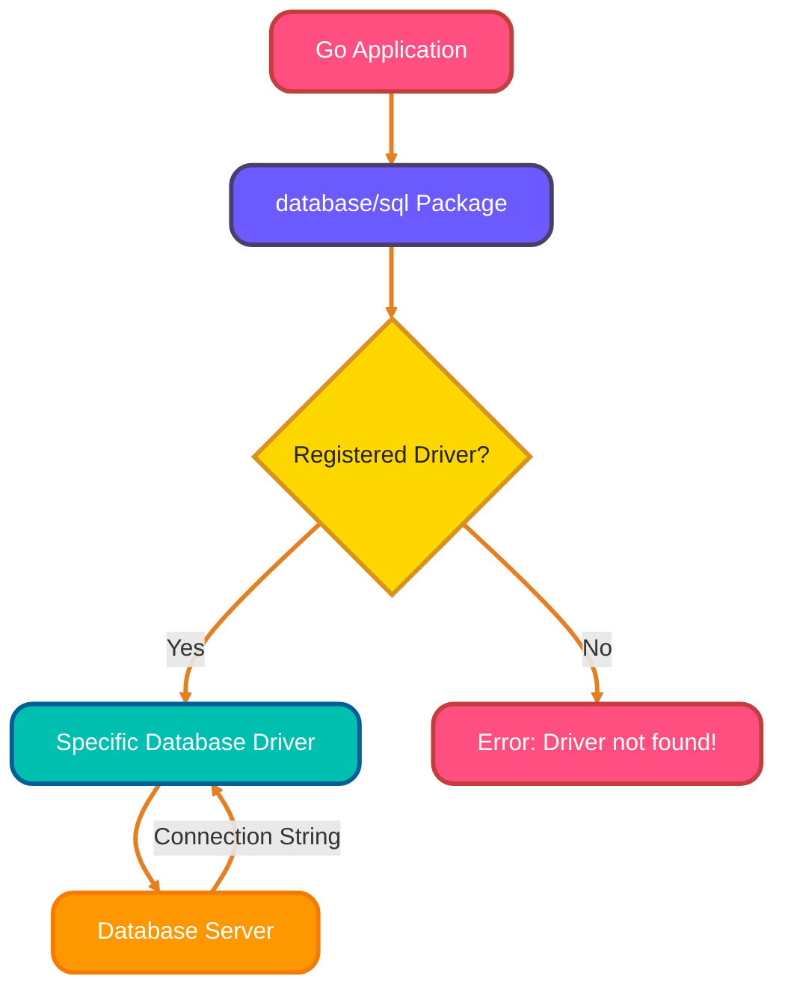
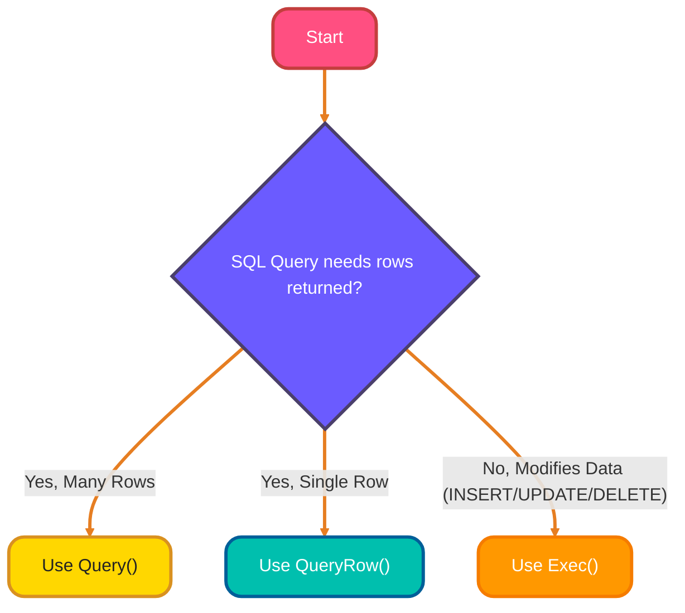
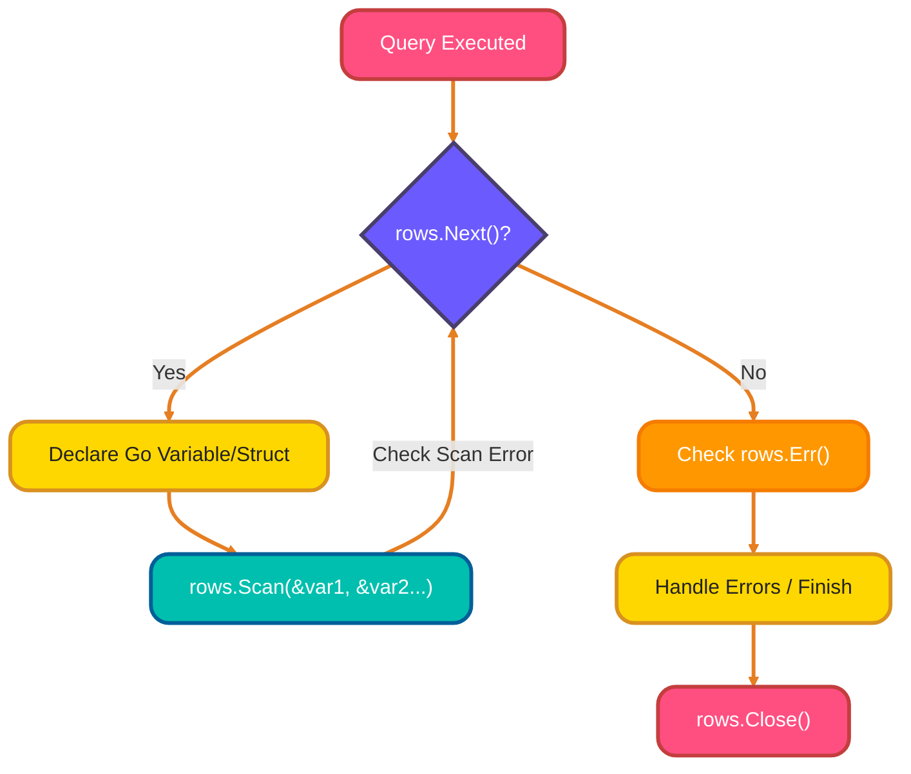
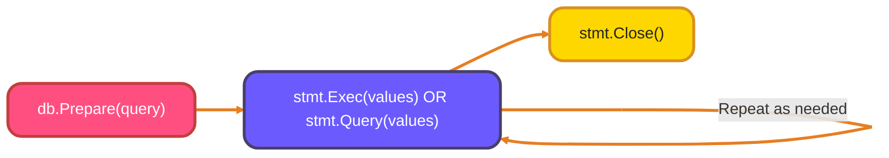
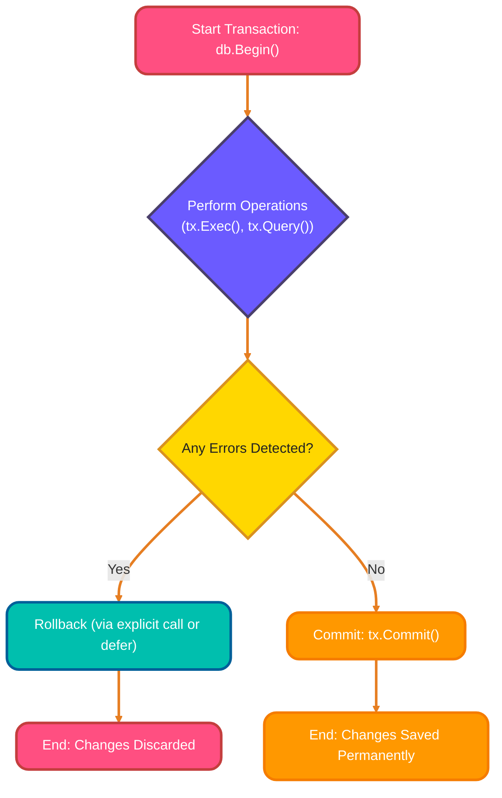
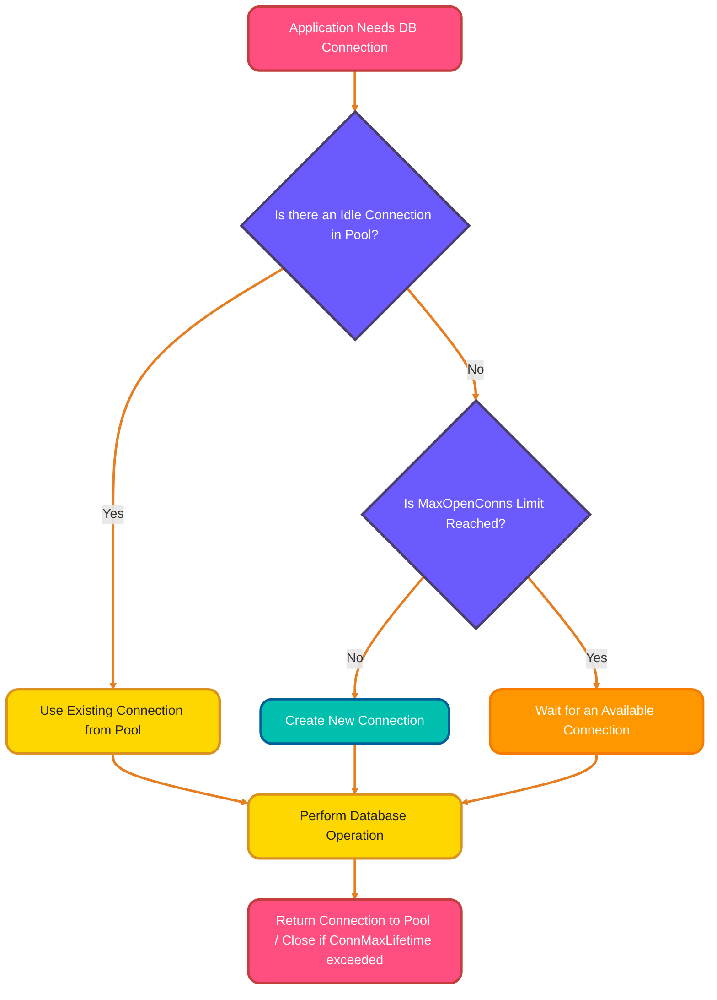
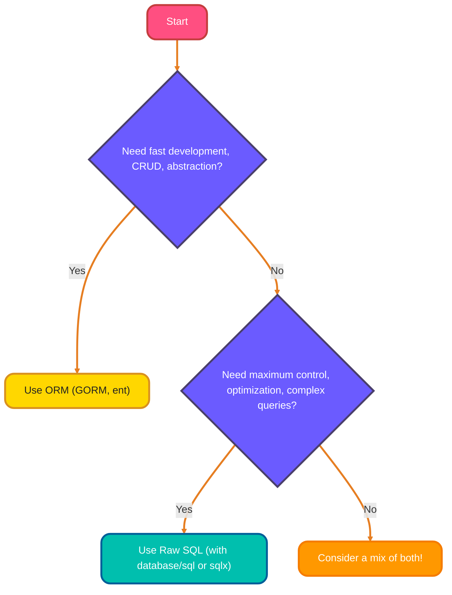

<!--
meta-description: "Master database integration in Go! Learn database/sql package, execute queries with Query/QueryRow/Exec, scan results into structs, use prepared statements for security, implement transactions, configure connection pooling, and choose between ORMs like GORM and raw SQL."
keywords: "Go database integration, database/sql package, SQL queries in Go, prepared statements, SQL injection prevention, database transactions, connection pooling, GORM, sqlx, ent ORM, PostgreSQL Go, MySQL Go, SQLite Go, database drivers"
-->

# <span style="color:#e67e22;">What we will learn in this post?</span>
<ul style='list-style-type: none; padding-left: 0;'>
<li><span style='color: #2980b9; font-size: 20px; font-weight: bold;'>👉</span> <span style='color: #2ecc71; font-size: 18px; font-weight: bold;'>database/sql Package</span></li>
<li><span style='color: #2980b9; font-size: 20px; font-weight: bold;'>👉</span> <span style='color: #2ecc71; font-size: 18px; font-weight: bold;'>Executing Queries</span></li>
<li><span style='color: #2980b9; font-size: 20px; font-weight: bold;'>👉</span> <span style='color: #2ecc71; font-size: 18px; font-weight: bold;'>Scanning Results</span></li>
<li><span style='color: #2980b9; font-size: 20px; font-weight: bold;'>👉</span> <span style='color: #2ecc71; font-size: 18px; font-weight: bold;'>Prepared Statements</span></li>
<li><span style='color: #2980b9; font-size: 20px; font-weight: bold;'>👉</span> <span style='color: #2ecc71; font-size: 18px; font-weight: bold;'>Transactions</span></li>
<li><span style='color: #2980b9; font-size: 20px; font-weight: bold;'>👉</span> <span style='color: #2ecc71; font-size: 18px; font-weight: bold;'>Connection Pooling</span></li>
<li><span style='color: #2980b9; font-size: 20px; font-weight: bold;'>👉</span> <span style='color: #2ecc71; font-size: 18px; font-weight: bold;'>ORMs in Go</span></li>
<li><span style='color: #2980b9; font-size: 20px; font-weight: bold;'>👉</span> <span style='color: #2ecc71; font-size: 18px; font-weight: bold;'>Conclusion!</span></li>
</ul>

# <span style="color:#e67e22">Go's Database Magic: `database/sql` ✨</span>

Go's `database/sql` package provides a *standard interface* for interacting with various SQL databases. This powerful abstraction is fundamental to building production-ready data-driven applications in Go, whether you're working with PostgreSQL, MySQL, SQLite, or other SQL databases. The consistent API means you can switch databases with minimal code changes, making your applications more maintainable and portable. It acts as an **abstraction layer**, meaning your Go code talks to `database/sql`, which then communicates with the specific database through a *driver*. This keeps your application flexible and independent of the underlying database technology!

## <span style="color:#2980b9">Connecting the Dots: Database Drivers 🔌</span>

To use `database/sql`, you need a **database driver** for your specific database (e.g., PostgreSQL, MySQL, SQLite). These drivers implement the `database/sql` interface. You typically import them using the blank identifier `_`, which registers the driver's capabilities without directly using its exports in your code.

*   **PostgreSQL:** `_ "github.com/lib/pq"`
*   **MySQL:** `_ "github.com/go-sql-driver/mysql"`
*   **SQLite3:** `_ "github.com/mattn/go-sqlite3"`

## <span style="color:#2980b9">Say Hello to Your Database: `sql.Open()` 👋</span>

The `sql.Open()` function is your gateway to connecting. It takes two arguments: the `driverName` (a string like `"postgres"`, `"mysql"`, `"sqlite3"`) and the `dataSourceName` (your **connection string**).

### <span style="color:#8e44ad">Connection String Examples 🔗</span>

*   **PostgreSQL:**
    ```go
    db, err := sql.Open("postgres", "user=go_user password=gopass dbname=my_db sslmode=disable")
    ```
*   **MySQL:**
    ```go
    db, err := sql.Open("mysql", "go_user:gopass@tcp(127.0.0.1:3306)/my_db?parseTime=true")
    ```
*   **SQLite3:**
    ```go
    db, err := sql.Open("sqlite3", "file:./data.db?cache=shared&mode=rwc")
    ```
Remember to check for errors and *always* `defer db.Close()` to prevent resource leaks!

<details>
<summary>💡 Pro Tip: Verify your connection!</summary>
After `sql.Open()`, use `err = db.Ping()` to confirm a successful connection to the database.
</details>



---
**Further Reading:**
*   [Go `database/sql` documentation](https://pkg.go.dev/database/sql)
*   [GoByExample: Database](https://gobyexample.com/database)

# <span style="color:#e67e22">Executing SQL Queries in Go: Your Go-to Methods! 🚀</span>

When interacting with databases in Go, you'll primarily use three distinct methods to execute your SQL queries. Understanding which method to use is crucial for writing efficient, idiomatic Go database code. These methods are optimized for different scenarios and using the correct one improves both performance and code clarity in production applications. Choosing the right one depends on whether you expect multiple rows, a single row, or just need to modify data.

## <span style="color:#2980b9">1. `Query()`: For Many Rows 📚</span>

Use `db.Query()` when your `SELECT` statement is expected to return ***multiple rows*** of data. It returns a `*sql.Rows` object, which you then iterate through to process each result.

*   _Example:_
    ```go
    rows, err := db.Query("SELECT name, email FROM users WHERE active = ?", true)
    // defer rows.Close()
    // Process rows...
    ```

## <span style="color:#2980b9">2. `QueryRow()`: For One Row 🎯</span>

Opt for `db.QueryRow()` if your `SELECT` query is designed to return ***at most one row***. This method directly returns a `*sql.Row` object, making it straightforward to scan a single result into your variables.

*   _Example:_
    ```go
    var productName string
    err := db.QueryRow("SELECT name FROM products WHERE id = ?", productID).Scan(&productName)
    // Handle err
    ```

## <span style="color:#2980b9">3. `Exec()`: For Changes! ✍️</span>

`db.Exec()` is your method for SQL operations that ***modify data*** but don't return rows. This includes `INSERT`, `UPDATE`, and `DELETE` statements. It returns an `sql.Result` with information like affected rows or the last insert ID.

*   _Example:_
    ```go
    result, err := db.Exec("UPDATE inventory SET stock = ? WHERE item = ?", newStock, item)
    // Check result.RowsAffected()
    ```

---

### <span style="color:#8e44ad">Decision Flowchart 🧭</span>

Here's a quick way to decide which method to use:



---

### <span style="color:#8e44ad">Further Learning 🔗</span>

For more in-depth information and advanced patterns, check out the official [Go database/sql documentation](https://pkg.go.dev/database/sql).

# <span style="color:#e67e22">Scanning SQL Results into Go! 🚀</span>

When working with databases in Go, the `database/sql` package helps fetch query results and map them to Go variables or structs. Properly scanning results is essential for building type-safe, maintainable database applications. By mapping database rows directly to Go structs, you create clean, idiomatic code that's easier to work with and less prone to errors than working with raw data types. This process involves iterating through rows and populating your data structures.

## <span style="color:#2980b9">The Core Loop: `rows.Next()` & `Scan()` ✨</span>

After executing a query, you receive a `*sql.Rows` object. Here's how to use it:

*   **`defer rows.Close()`**: Crucial! Always call this immediately after `db.Query` to release database connections once you're done.
*   **`_rows.Next()_`**: This function moves to the next result row. It returns `true` if there's a new row to process, `false` when there are no more rows. Your processing typically happens within a `for rows.Next() { ... }` loop.
*   **`_rows.Scan()_`**: Inside the loop, this method reads data from the *current* row's columns into corresponding Go variable *pointers*. The order matters! E.g., `rows.Scan(&productID, &productName)`.
*   **`_rows.Err()_`**: After the `for rows.Next()` loop finishes, *always* check `rows.Err()` to catch any errors that might have occurred during iteration.



## <span style="color:#2980b9">Scanning into Go Structs 🏗️</span>

Mapping database rows directly to Go `structs` is a powerful and common pattern.

1.  **Define a Struct:** Create a `struct` whose fields align with your table columns.

    ```go
    type Product struct {
        ID    int
        Name  string
        Price float64
    }
    ```
2.  **Iterate and Scan:** Inside the `rows.Next()` loop, declare an instance of your struct, then pass pointers to its fields to `rows.Scan()`. Collect these instances into a slice.

### <span style="color:#8e44ad">Practical Example 💡</span>

```go
// Assume 'db' is *sql.DB and 'err' is handled for query execution
rows, err := db.Query("SELECT id, name, price FROM products")
if err != nil { /* handle query error */ }
defer rows.Close() // Important!

var products []Product // Slice to hold all results

for rows.Next() {
    var p Product // Create a new Product for each row
    if err := rows.Scan(&p.ID, &p.Name, &p.Price); err != nil {
        // Handle potential scanning errors (e.g., type mismatch)
        fmt.Println("Scan error:", err)
        continue // Skip this row or return err
    }
    products = append(products, p) // Add to our slice
}

if err := rows.Err(); err != nil {
    // Handle any errors that occurred during the iteration itself
    fmt.Println("Iteration error:", err)
}

// 'products' now contains all scanned data!
```

# <span style="color:#e67e22">SQL Prepared Statements: Your Database's Safe & Speedy Helper! 🛡️🚀</span>

Prepared statements are a smart way to interact with your database. They are absolutely critical for production applications, providing both security through SQL injection prevention and performance through query optimization. Every professional Go application should leverage prepared statements for repeated queries and any query that includes user input. Imagine them as a template: you tell the database the *structure* of your SQL query once, then simply fill in the *values* whenever you need to execute it.

## <span style="color:#2980b9">How They Work (db.Prepare) 🤔</span>

You write SQL queries with *placeholders* instead of direct values, like `SELECT name FROM users WHERE id = ?` (or `$1` for PostgreSQL). Using `db.Prepare(query)` sends this template to the database for pre-compilation. Later, you execute it with `stmt.Exec(values...)` or `stmt.Query(values...)`, passing your actual data for the placeholders.

## <span style="color:#2980b9">SQL Injection Prevention: Your App's Security Guard! 🔒</span>

This is *critical* for security! The database *never* mixes your user-provided *values* with the query's *code*. It treats all placeholder inputs purely as data, not commands. This crucial separation *prevents SQL injection attacks*, where malicious users try to inject harmful SQL code, making your application much safer.
*Example:* `db.Prepare("SELECT * FROM products WHERE category = ?")` with `stmt.Query("electronics' OR '1'='1")` will safely search for a literal category name, not execute extra SQL.

## <span style="color:#2980b9">Performance Boost! ⚡</span>

The query's structure is parsed, optimized, and compiled only *once*. For subsequent executions using `stmt.Exec()` or `stmt.Query()` with different values, the database reuses this pre-optimized plan. This significantly speeds up repeated operations, making your application more efficient.

## <span style="color:#2980b9">Lifecycle: Prepare, Execute, Close 👋</span>

1.  **`db.Prepare(query)`**: Sends the query structure to the database, returning a `*sql.Stmt` object.
2.  **`stmt.Exec(args...)` / `stmt.Query(args...)`**: You repeatedly pass values for the placeholders.
3.  **`stmt.Close()`**: Always close the statement when you're done to release valuable database resources. `defer stmt.Close()` is a common and good practice.


# <span style="color:#e67e22">Transactions Made Easy! 🤝</span>

Imagine you're performing a multi-step task like transferring money: you wouldn't want the money to leave one account without arriving in the other. Transactions are fundamental to maintaining data integrity in production systems, ensuring ACID properties (Atomicity, Consistency, Isolation, Durability) are maintained. Whether you're processing financial operations, updating related records, or performing complex business logic, transactions are essential for reliable applications. Database transactions ensure a *group of operations* either **all succeed** or **all fail together**, keeping your data consistent and reliable.

## <span style="color:#2980b9">1. Starting the Journey: `db.Begin()` 🚀</span>

You kick things off by calling `db.Begin()`. This creates a special `tx` (transaction) object. All your upcoming database changes (like inserting or updating) will now be tied to this `tx` object, *not* the main database connection directly.

```go
tx, err := db.Begin()
if err != nil {
    // Always handle potential errors
}
```

## <span style="color:#2980b9">2. Safety Net: `defer tx.Rollback()` 🛡️</span>

Immediately after `db.Begin()`, it's a **best practice** to add `defer tx.Rollback()`. This *guarantees* that if your function exits early due to an error, or even if you forget to commit, the transaction will be automatically undone (`Rollback`). It's completely safe to call `Rollback()` even if the transaction has already been committed.

```go
tx, err := db.Begin()
if err != nil { /* handle error */ }
defer tx.Rollback() // This runs when the function exits, ensuring cleanup
```

## <span style="color:#2980b9">3. Success or Reset: `tx.Commit()` & `tx.Rollback()` ✅❌</span>

After performing all your operations using the `tx` object (e.g., `tx.Exec()` to update data), you make a decision:
*   **`tx.Commit()`**: If everything went smoothly, call `tx.Commit()` to **save all changes** permanently to the database.
*   **`tx.Rollback()`**: If an error occurred during any step, you'd explicitly call `tx.Rollback()` (though `defer` often catches this) to **undo all changes** made within that transaction.

```go
// ... perform database operations using 'tx' ...
if someErrorOccurred {
    // The defer tx.Rollback() will handle undoing changes
    return err
}
err = tx.Commit() // Save all changes!
if err != nil {
    // Handle potential commit errors
}
```

## <span style="color:#2980b9">Transaction Flow Explained 🔄</span>



## <span style="color:#2980b9">Quick Recap! 💡</span>

*   `db.Begin()`: Initiates a new transaction.
*   `defer tx.Rollback()`: Your reliable safety net for errors and forgotten commits.
*   `tx.Commit()`: Makes all temporary changes permanent.
*   `tx.Rollback()`: Discards all temporary changes.

For more information, explore: [Go's database/sql package](https://pkg.go.dev/database/sql) or [SQL Transaction Basics](https://www.w3schools.com/sql/sql_transactions.asp).

# <span style="color:#e67e22">Database Connection Pooling: Your Efficient Helper! ✨</span>

Database connection pooling is like having a *pre-stocked toolkit* for your application. Proper connection pool configuration is critical for production applications, directly impacting performance, scalability, and resource utilization. Understanding and tuning these settings based on your application's load patterns can dramatically improve throughput and prevent database connection exhaustion under heavy traffic. Instead of repeatedly opening and closing new connections to your database, a pool keeps a *set of connections open and ready* for reuse. This makes your application faster, more responsive, and efficient by avoiding the overhead of constantly establishing new connections.

## <span style="color:#2980b9">Why Pool Connections? 🤔</span>

Pooling offers fantastic benefits that keep your application snappy and stable:

*   **⚡️ Performance Boost:** Reusing existing connections is *much faster* than creating new ones for every database interaction.
*   **📉 Reduced Database Load:** Less work for your database server means better overall performance.
*   **🔒 Resource Management:** Prevents your app from overwhelming the database with too many connections.

## <span style="color:#2980b9">How to Configure Your Pool ⚙️</span>

You can precisely control your connection pool's behavior using these key settings:

*   **`db.SetMaxOpenConns(n int)`:** This sets the *absolute maximum number* of connections (active + idle) that can be open concurrently. It's vital for preventing database overload.
*   **`db.SetMaxIdleConns(n int)`:** Defines the *maximum number* of connections that remain *idle* in the pool, ready for immediate reuse. Excess idle connections are closed.
*   **`db.SetConnMaxLifetime(d time.Duration)`:** Sets the *maximum duration* a single connection can be reused. After this time, it's closed upon return to the pool, helping prevent stale connections or database timeouts.

## <span style="color:#2980b9">Pooling Flow at a Glance 🌊</span>



## <span style="color:#2980b9">Learn More! 📚</span>

Dive deeper into database connection pooling:

*   **Go `database/sql` Documentation:** For detailed API usage and best practices.
    [https://pkg.go.dev/database/sql](https://pkg.go.dev/database/sql)
*   **Understanding Connection Pooling:** A helpful overview of the concept.
    [https://www.cockroachlabs.com/blog/what-is-connection-pooling/](https://www.cockroachlabs.com/blog/what-is-connection-pooling/)

# <span style="color:#e67e22">Understanding Go ORMs & SQL 🚀</span>

When building Go applications that interact with databases, you have a fantastic array of tools. Choosing between ORMs and raw SQL is one of the most important architectural decisions in your application, affecting development speed, maintainability, and performance. Understanding the trade-offs helps you make informed decisions that align with your project's specific needs and constraints. Let's explore some popular choices and discuss when to use them!

## <span style="color:#2980b9">Meet the Go Database Tools 🛠️</span>

*   **`GORM`**: A *feature-rich* ORM that simplifies database interactions with advanced features like migrations, associations, and hooks. It's great for complex data models.
    *   [Learn GORM](https://gorm.io/)
*   **`sqlx`**: This package extends Go's standard `database/sql`, offering *type-safe queries* and easier scanning of results directly into structs. It's perfect when you need more control but want added convenience.
    *   [Learn sqlx](https://jmoiron.github.io/sqlx/)
*   **`ent`**: An *entity framework* that takes a schema-first approach, generating robust, type-safe code for complex graph queries. Ideal for large projects requiring strong type-safety and maintainability.
    *   [Learn ent](https://entgo.io/docs/getting-started)

## <span style="color:#2980b9">ORMs vs. Raw SQL: When to Choose? 🤔</span>

### <span style="color:#8e44ad">Why ORMs? ✨</span>
ORMs offer *faster development*, reduce boilerplate code, and abstract away database complexities. Use them for **CRUD-heavy applications**, rapid prototyping, and when database portability is a concern.

### <span style="color:#8e44ad">Why Raw SQL? ⚙️</span>
Raw SQL gives you *full control* to write highly optimized, database-specific queries. Choose it for **performance-critical sections**, complex reporting, or when leveraging unique database features that ORMs might obscure.




---

<details>
<summary><strong style="font-size: 1.5em; color:#6b5bff;">🎯 Hands-On Assignment</strong></summary>
<br>

Ready to master database integration? Complete this assignment and share your implementation in the comments below!

### 📋 Problem Statement

Build a **User Management System** with full database integration including CRUD operations, transactions, prepared statements, and connection pooling. Your system should handle user registration, authentication, and profile management.

### ✅ Requirements

Create a database-driven application with:

1. **User struct:**
   - `ID` (int, primary key, auto-increment)
   - `Username` (string, unique, required)
   - `Email` (string, unique, required)
   - `PasswordHash` (string, required)
   - `FullName` (string)
      - `IsActive` (bool, default true)
   - `CreatedAt` (timestamp)
   - `LastLogin` (timestamp, nullable)

2. **Database operations:**
   - Create users table with proper indexes
   - Insert new user with password hashing
   - Retrieve user by ID, username, or email
   - Update user profile information
   - Soft delete (set IsActive to false)
   - List all active users with pagination

3. **Advanced features:**
   - Use prepared statements for repeated queries
   - Implement transaction for user registration (insert user + audit log)
   - Configure connection pool with optimal settings
   - Handle duplicate username/email errors gracefully
   - Implement proper error handling and logging

### 💡 Implementation Hints

1. Use PostgreSQL, MySQL, or SQLite with appropriate driver
2. Create schema with `CREATE TABLE` DDL statements
3. Use `bcrypt` for password hashing: `golang.org/x/crypto/bcrypt`
4. Implement repository pattern for clean separation
5. Use prepared statements for INSERT/UPDATE/SELECT operations
6. Wrap registration in transaction: user insert + audit log
7. Configure pool: `SetMaxOpenConns(25)`, `SetMaxIdleConns(5)`, `SetConnMaxLifetime(5 * time.Minute)`
8. Add indexes on username and email columns

### 📝 Example Input/Output

**Database Schema:**
```sql
CREATE TABLE users (
    id SERIAL PRIMARY KEY,
    username VARCHAR(50) UNIQUE NOT NULL,
    email VARCHAR(100) UNIQUE NOT NULL,
    password_hash VARCHAR(255) NOT NULL,
    full_name VARCHAR(100),
    is_active BOOLEAN DEFAULT true,
    created_at TIMESTAMP DEFAULT CURRENT_TIMESTAMP,
    last_login TIMESTAMP
);

CREATE INDEX idx_users_username ON users(username);
CREATE INDEX idx_users_email ON users(email);

CREATE TABLE audit_logs (
    id SERIAL PRIMARY KEY,
    user_id INTEGER REFERENCES users(id),
    action VARCHAR(50),
    timestamp TIMESTAMP DEFAULT CURRENT_TIMESTAMP
);
```

**User Registration (with Transaction):**
```go
// RegisterUser creates user and logs audit entry atomically
func (r *UserRepository) RegisterUser(username, email, password, fullName string) (*User, error) {
    tx, err := r.db.Begin()
    if err != nil {
        return nil, err
    }
    defer tx.Rollback()

    // Hash password
    hash, err := bcrypt.GenerateFromPassword([]byte(password), bcrypt.DefaultCost)
    if err != nil {
        return nil, err
    }

    // Insert user
    var userID int
    err = tx.QueryRow(
        "INSERT INTO users (username, email, password_hash, full_name) VALUES ($1, $2, $3, $4) RETURNING id",
        username, email, string(hash), fullName,
    ).Scan(&userID)
    if err != nil {
        return nil, err
    }

    // Log audit entry
    _, err = tx.Exec(
        "INSERT INTO audit_logs (user_id, action) VALUES ($1, $2)",
        userID, "user_registered",
    )
    if err != nil {
        return nil, err
    }

    if err = tx.Commit(); err != nil {
        return nil, err
    }

    return &User{ID: userID, Username: username, Email: email, FullName: fullName}, nil
}
```

**Using Prepared Statements:**
```go
// Initialize prepared statements once
type UserRepository struct {
    db                *sql.DB
    getUserByIDStmt   *sql.Stmt
    getUserByEmailStmt *sql.Stmt
}

func NewUserRepository(db *sql.DB) (*UserRepository, error) {
    getUserByID, err := db.Prepare("SELECT id, username, email, full_name, is_active FROM users WHERE id = $1")
    if err != nil {
        return nil, err
    }

    getUserByEmail, err := db.Prepare("SELECT id, username, email, full_name, is_active FROM users WHERE email = $1")
    if err != nil {
        return nil, err
    }

    return &UserRepository{
        db:                db,
        getUserByIDStmt:   getUserByID,
        getUserByEmailStmt: getUserByEmail,
    }, nil
}

// Use prepared statement efficiently
func (r *UserRepository) GetUserByID(id int) (*User, error) {
    var user User
    err := r.getUserByIDStmt.QueryRow(id).Scan(
        &user.ID, &user.Username, &user.Email, &user.FullName, &user.IsActive,
    )
    if err == sql.ErrNoRows {
        return nil, nil // User not found
    }
    return &user, err
}
```

**Program Output:**
```
Connecting to database...
✓ Database connected successfully
✓ Connection pool configured (Max: 25, Idle: 5, Lifetime: 5m)
✓ Tables created

--- User Registration ---
Registering user: john_doe
✓ User registered successfully (ID: 1)
✓ Audit log created

--- Retrieve User ---
Fetching user by email: john@example.com
✓ User found: john_doe (John Doe)

--- List Active Users (Page 1) ---
1. john_doe - John Doe (john@example.com)
2. jane_smith - Jane Smith (jane@example.com)
3. bob_wilson - Bob Wilson (bob@example.com)
Total: 3 users

--- Update User ---
Updating full name for user ID 1
✓ User updated successfully

--- Duplicate Check ---
Attempting to register duplicate username...
✗ Error: username already exists

✓ All operations completed successfully
```

### 🌟 Bonus Challenges

1. Implement full-text search on username and full name
2. Add user roles table with many-to-many relationship
3. Create database migration system with versioning
4. Implement query result caching with TTL
5. Add database health check endpoint
6. Implement soft delete with automatic recovery option
7. Create bulk insert operation with batch processing
8. Add database connection retry logic with exponential backoff
9. Implement read replicas support for scaling reads
10. Create comprehensive test suite with test database

### 📤 Submission Guidelines

- Test with actual database (PostgreSQL/MySQL/SQLite)
- Include complete schema creation scripts
- Demonstrate transaction rollback on error
- Show connection pool metrics and behavior
- Share your complete code in the comments
- Explain your prepared statement strategy
- Include sample output showing all operations
- Discuss error handling approaches

**Looking forward to your database-driven solutions!** Share your implementation below and learn from others' approaches. 💬

</details>

---


<h1><span style='color:#e67e22'>Conclusion</span></h1>
So, there you have it! We hope you enjoyed diving into this topic with us. 😊 But the real fun starts now – we want to hear from *you*! What are your thoughts, experiences, or even your own handy tips? Did we miss anything important?

Don't be shy! We'd absolutely love for you to share your comments, feedback, or suggestions right below. Your insights are super valuable and help make our community even better. Let's keep the conversation flowing! 👇✨