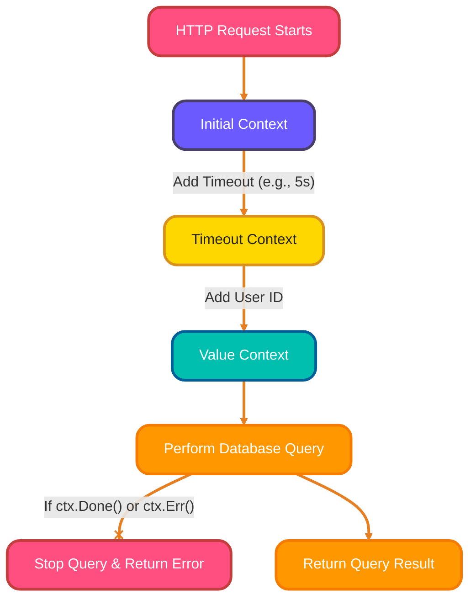
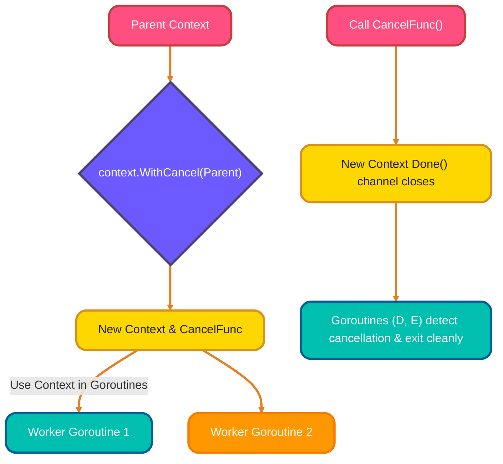
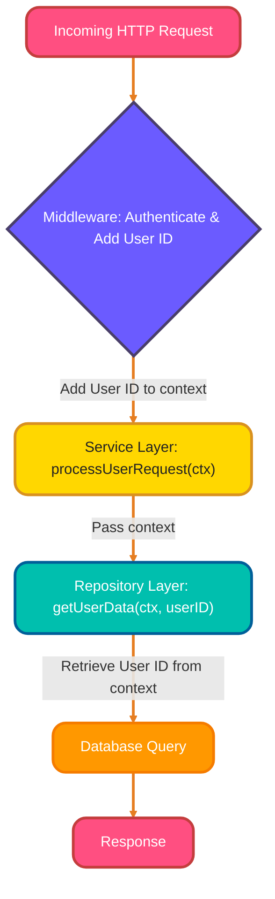
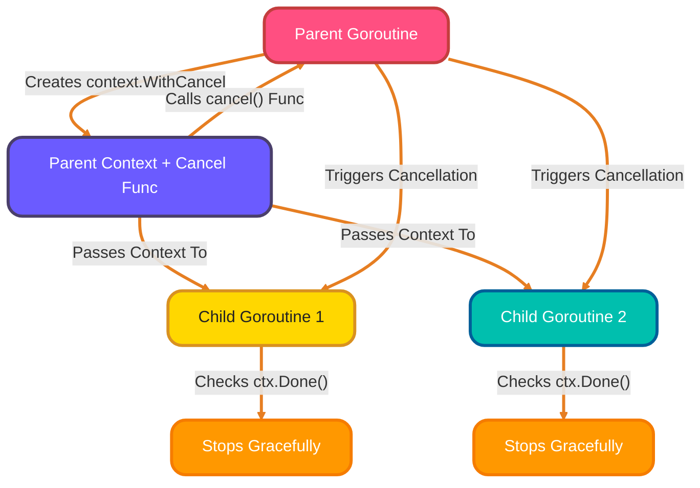
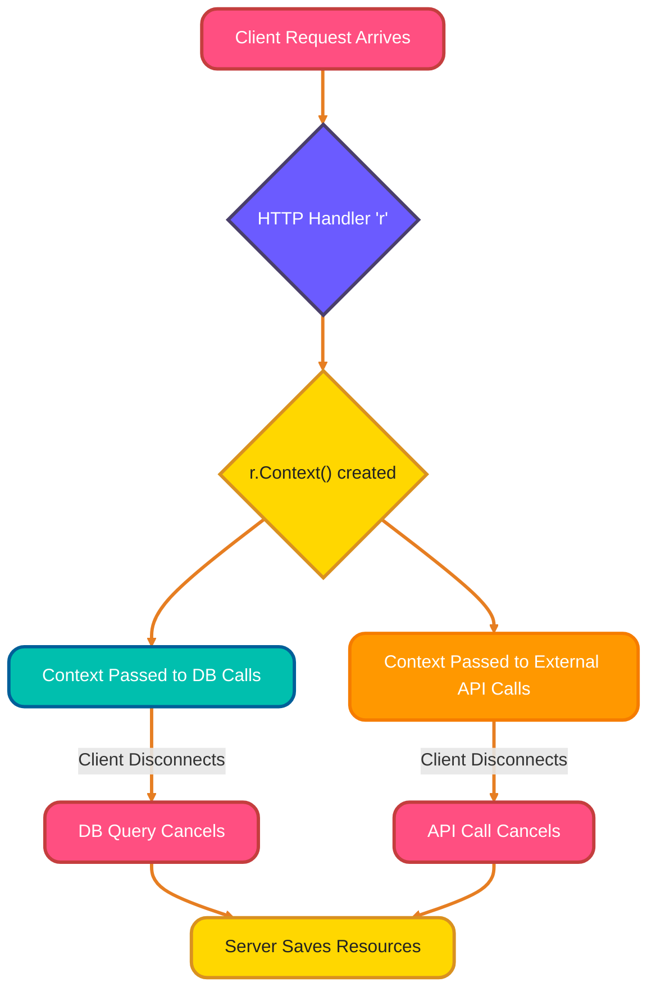
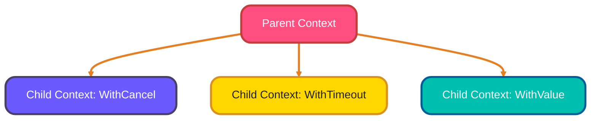

<!--
meta-description: "Master Go's context package! Learn context basics, creation with Background/WithCancel/WithTimeout, passing values, cancellation patterns, HTTP request contexts, and best practices for building robust concurrent applications."
keywords: "Go context package, context.Context, context.WithCancel, context.WithTimeout, context.WithValue, cancellation patterns, goroutine management, HTTP context, request lifecycle, concurrent programming Go, context best practices"
-->

# <span style="color:#e67e22;">What we will learn in this post?</span>
<ul style='list-style-type: none; padding-left: 0;'>
<li><span style='color: #2980b9; font-size: 20px; font-weight: bold;'>👉</span> <span style='color: #2ecc71; font-size: 18px; font-weight: bold;'>Context Basics</span></li>
<li><span style='color: #2980b9; font-size: 20px; font-weight: bold;'>👉</span> <span style='color: #2ecc71; font-size: 18px; font-weight: bold;'>Creating Contexts</span></li>
<li><span style='color: #2980b9; font-size: 20px; font-weight: bold;'>👉</span> <span style='color: #2ecc71; font-size: 18px; font-weight: bold;'>Context Values</span></li>
<li><span style='color: #2980b9; font-size: 20px; font-weight: bold;'>👉</span> <span style='color: #2ecc71; font-size: 18px; font-weight: bold;'>Cancellation Patterns</span></li>
<li><span style='color: #2980b9; font-size: 20px; font-weight: bold;'>👉</span> <span style='color: #2ecc71; font-size: 18px; font-weight: bold;'>Context in HTTP</span></li>
<li><span style='color: #2980b9; font-size: 20px; font-weight: bold;'>👉</span> <span style='color: #2ecc71; font-size: 18px; font-weight: bold;'>Context Best Practices</span></li>
<li><span style='color: #2980b9; font-size: 20px; font-weight: bold;'>👉</span> <span style='color: #2ecc71; font-size: 18px; font-weight: bold;'>Conclusion!</span></li>
</ul>

# <span style="color:#e67e22">📦 Understanding Go's `context` Package</span>

The `context` package in Go carries crucial signals like deadlines, cancellation requests, and request-specific values across function boundaries. This messenger travels with your operations, ensuring goroutines can respond to timeouts and cancellations gracefully.

## <span style="color:#2980b9">🚀 Why `context` is Crucial for Concurrent & HTTP Apps</span>

`context` is vital for managing concurrent tasks and HTTP requests gracefully.

*   **Concurrent Programs:** If you launch many goroutines, and the main task is canceled or times out, the `context` allows you to *efficiently signal* all related goroutines to stop, preventing resource leaks and wasted effort.
*   **HTTP Servers:** When a client makes a request, an HTTP server starts a `context`. If the client disconnects or the request exceeds a timeout, the `context` can *automatically cancel* ongoing database queries or downstream API calls, cleaning up resources.

### <span style="color:#8e44ad">💡 Basic Examples & How it Works</span>

You typically start with a `context.Background()` or `context.TODO()` and then derive new contexts:

*   `context.WithTimeout(parent, duration)`: Sets a deadline.
*   `context.WithCancel(parent)`: Creates a cancellable context.
*   `context.WithValue(parent, key, value)`: Adds request-scoped data.

Functions check `ctx.Done()` or `ctx.Err()` to react to cancellation or timeouts.



# <span style="color:#e67e22">Understanding Go's Context Creation Functions</span>

Go's `context` package provides essential functions for managing deadlines, cancellations, and request-scoped values across goroutines. These creation functions form the foundation of robust concurrent applications.

---

## <span style="color:#2980b9">`context.Background()` 🌳</span>

This is the *root* context for your program. It's never canceled, has no deadline, and no values. Use it as the starting point for your `main` function, initial requests, or tests where no parent context exists.

```go
import "context"

ctx := context.Background()
// Use ctx for your top-level operations
```

---

## <span style="color:#2980b9">`context.TODO()` 🤔</span>

A placeholder context when you're unsure which context to use or if code needs refactoring. Similar to `Background()`, it signals to developers that context usage needs improvement. ***Avoid* using it in production code!**

```go
import "context"

ctx := context.TODO() // Placeholder, needs proper context later!
// ... code that will eventually be refactored
```

---

## <span style="color:#2980b9">`context.WithCancel()` 🛑</span>



This function creates a child context that can be *explicitly canceled*. You receive a new `Context` and a `CancelFunc`. Calling `CancelFunc` will stop all goroutines listening to this context or its children, which is useful for graceful shutdowns.

```go
import (
	"context"
	"time"
)

ctx, cancel := context.WithCancel(context.Background())
defer cancel() // Always call cancel to release resources!

go func() {
	select {
	case <-time.After(5 * time.Second):
		fmt.Println("Operation completed without cancellation.")
	case <-ctx.Done():
		fmt.Println("Operation canceled!")
	}
}()
// In another part of your code, you might call cancel()
// cancel() // Uncomment to test immediate cancellation
time.Sleep(2 * time.Second) // Give goroutine time to start
```

---

## <span style="color:#2980b9">`context.WithTimeout()` / `WithDeadline()` ⏳</span>

These functions create a child context that *automatically cancels* after a specific time.

*   **`context.WithTimeout(parent, duration)`**: Cancels after a `time.Duration`.
*   **`context.WithDeadline(parent, time.Time)`**: Cancels at an exact `time.Time`.

They are great for enforcing maximum execution times for network requests or computations.

```go
import (
	"context"
	"time"
	"fmt"
)

// Example with WithTimeout
ctxTimeout, cancelTimeout := context.WithTimeout(context.Background(), 2*time.Second)
defer cancelTimeout() // Don't forget to call cancel!

select {
case <-time.After(3 * time.Second):
	fmt.Println("Operation finished before timeout (should not happen here).")
case <-ctxTimeout.Done():
	fmt.Println("Operation timed out:", ctxTimeout.Err()) // Prints "context deadline exceeded"
}
```

---


# <span style="color:#e67e22">Passing Request Data with `context` in Go 📦</span>

Go's `context.Context` provides `WithValue()` and `Value()` for safely passing request-scoped data like user IDs or trace IDs throughout a request's lifecycle. This pattern enables clean data flow without polluting function signatures.

---

## <span style="color:#2980b9">Adding Data with `context.WithValue()` 👋</span>

`context.WithValue()` creates a *new context* derived from an existing one, embedding a *key-value pair*. This data then flows down the call chain. The `key` should ideally be an **unexported struct type** to prevent collisions across different packages.

```go
package main

import (
	"context"
	"fmt"
)

// Define a private key type to avoid collisions
type userIDKey struct{} 

func main() {
	parentCtx := context.Background()
	
	// Add a user ID to the context
	ctx := context.WithValue(parentCtx, userIDKey{}, "user-12345") 
	
	// 'ctx' now carries the user ID
	fmt.Println("User ID added to context!")
}
```

---

## <span style="color:#2980b9">Retrieving Data with `context.Value()` 🕵️‍♀️</span>

To get the data back, you use `ctx.Value()` with the *same key* that was used to store it. Remember to perform a **type assertion** and check if the value exists (`ok` variable) to handle cases where the data might not be present or is of a different type.

```go
// Inside a function deeper in the call chain...
func processRequest(ctx context.Context) {
    userID, ok := ctx.Value(userIDKey{}).(string) // Type assertion
    if !ok {
        fmt.Println("User ID not found in context.")
        return
    }
    fmt.Printf("Processing request for User ID: %s\n", userID)
}
// Call in main: processRequest(ctx)
```

---

## <span style="color:#2980b9">Best Practices & Anti-Patterns ✅❌</span>

*   **✅ Use for:** *Request-scoped data* that all downstream functions might need (e.g., authenticated user ID, trace ID, deadline, session data). It’s data that defines the *current operational context*.
*   **❌ Avoid for:** *Optional function parameters*. If a function needs specific data, pass it explicitly as an argument. Using `context.Value()` for optional parameters makes function signatures unclear and difficult to test.
*   **Key Type:** Always use an **unexported, distinct type** (like our `userIDKey` struct) for your context keys. This prevents accidental conflicts if multiple packages try to use the same string or basic type as a key.



# <span style="color:#e67e22">Graceful Cancellation in Go: The Polite Stop! ✅</span>

When your Go program needs to stop a running task, `context` enables graceful cancellation by sending signals to goroutines. This allows operations to clean up resources and exit smoothly instead of abruptly terminating.

## <span style="color:#2980b9">Listening for the Signal &#x1F4E1;</span>

Inside `goroutines`, you periodically check `_ctx.Done()_`. This is a channel that closes when cancellation is requested. Use a `select` statement to listen for it alongside your operation's result. When `<-ctx.Done()` receives a value, it means "cancel now!"

```go
select {
case <-ctx.Done(): // Cancellation signal received!
    return ctx.Err() // Return the cancellation reason
case result := <-someOperationChan:
    // Handle normal operation result
    return nil
}
```

## <span style="color:#2980b9">Handling Long Operations &#x23F1;&#xFE0F;</span>

For *long-running operations* (like network requests or complex calculations), ensure they accept a `context`. If the operation is internal, break it into smaller, interruptible steps. After each step, check `ctx.Done()`. If cancelled, stop processing, perform necessary *cleanup*, and return.

## <span style="color:#2980b9">Passing the Word Down &#x1F33F;</span>

A parent `goroutine` can create a child context using `context.WithCancel(parentCtx)`. When the parent calls its `cancel()` function, this signal *automatically propagates* down to all child `goroutines` using that context, and even their children. This creates a cancellation *tree*.




# <span style="color:#e67e22">`r.Context()` & Request Lifecycles 🌐</span>

Every incoming HTTP request in Go comes with a `Context` accessible via `r.Context()`, carrying timeouts, cancellation signals, and request-scoped values. This context automatically propagates through your application's layers and cancels when clients disconnect.

## <span style="color:#2980b9">Why Use `r.Context()`? 🤔</span>

Using `**r.Context()**` is crucial for managing your server's health and responsiveness:

*   **Timeouts**: Ensures operations don't run forever.
*   **Cancellation Signals**: Tells long-running tasks to stop if they're no longer needed.
*   **Resource Management**: Prevents wasted work and server load.

### <span style="color:#8e44ad">Passing Context Downstream ⬇️</span>

When your server-side Go handler needs to interact with other services, like a *database* or an *external API*, you should **always** pass the request's context along. This propagates the request's original boundaries and signals.

*   **Example (Database Query):**
    ```go
    rows, err := db.QueryContext(r.Context(), "SELECT * FROM users WHERE id = $1", userID)
    ```
*   **Example (External API Call):**
    ```go
    req, _ := http.NewRequestWithContext(r.Context(), "GET", "https://api.example.com/data", nil)
    resp, err := http.DefaultClient.Do(req)
    ```
This tells your downstream operations to respect the original client's request.

### <span style="color:#8e44ad">Automatic Cancellation Magic ✨</span>

The coolest part? If the client who made the request suddenly *disconnects* (e.g., closes their browser or app), the Go server **automatically cancels** the associated `_Context_`. Any pending database queries or API calls that received this context will then be notified to stop gracefully. This saves server resources and prevents unnecessary work.



---

# <span style="color:#e67e22">Understanding Go's `context` 🚀</span>

Go's `context` package is essential for managing cancellation signals, deadlines, and request-scoped values across API boundaries. Following best practices ensures robust, responsive applications that handle resource cleanup properly.

## <span style="color:#2980b9">Context Best Practices ✨</span>

### <span style="color:#8e44ad">Pass as First Parameter ➡️</span>
*Always pass* `context.Context` *as the first argument* to functions that might need it. This makes it explicit that the function respects cancellation and can carry request-scoped data. E.g., `func MyFunc(ctx context.Context, itemID string)`.

### <span style="color:#8e44ad">No Storing in Structs 🚫</span>
*Do not store* `Context` *within struct fields*. Instead, pass it directly to the methods that require it. Storing it can lead to confusion, unexpected cancellations, or using an outdated context.

### <span style="color:#8e44ad">Derive Child Contexts 🌳</span>
When you initiate new goroutines or distinct operations, *derive new contexts* from the *parent context*. Use `context.WithCancel`, `context.WithTimeout`, or `context.WithValue` to build a clear cancellation hierarchy and propagate necessary values.



### <span style="color:#8e44ad">Handle `ctx.Done()` 🛑</span>
For *long-running operations* (e.g., loops, blocking calls), *always check `ctx.Done()`*. Use a `select` statement to listen for the cancellation signal. This allows your operation to clean up and exit gracefully, preventing resource leaks and ensuring responsiveness.

## <span style="color:#2980b9">Common Pitfalls to Avoid ⚠️</span>
*   **Ignoring `ctx.Done()`:** Failing to check for cancellation can leave goroutines running indefinitely, leading to resource leaks and unresponsive services.
*   **Storing `Context` in Structs:** This is a common anti-pattern that violates the explicit passing principle and can introduce subtle bugs.
*   **Blindly Using `context.TODO()`:** Use `context.Background()` at your application's top level. `context.TODO()` is merely a placeholder until you determine the correct context.

---

<details>
<summary><strong style="font-size: 1.5em; color:#ff4f81;">🎯 Hands-On Assignment</strong></summary>
<br>

Ready to master context management? Complete this assignment and share your implementation in the comments below!

### 📋 Problem Statement

Build a **Concurrent Task Processor** that demonstrates context usage for timeouts, cancellation, and request-scoped values. Your system should process multiple tasks concurrently while respecting deadlines and handling graceful shutdowns.

### ✅ Requirements

Create a concurrent task processing system with:

1. **Task struct:**
   - `ID` (string)
   - `Name` (string)
   - `Duration` (time.Duration - simulated processing time)
   - `Priority` (int)

2. **Core functionality:**
   - Process multiple tasks concurrently using goroutines
   - Each task must accept and respect `context.Context`
   - Implement timeout for individual tasks (5 seconds max)
   - Support graceful shutdown on SIGINT/SIGTERM
   - Pass request ID through context for tracing
   - Cancel all running tasks when main context is canceled

3. **Context patterns to demonstrate:**
   - `context.WithTimeout()` for task deadlines
   - `context.WithCancel()` for manual cancellation
   - `context.WithValue()` for request ID propagation
   - Proper `ctx.Done()` checking in long-running operations

### 💡 Implementation Hints

1. Use `context.Background()` as root context in main
2. Create task-specific contexts with `context.WithTimeout()`
3. Use `select` statement to listen for `ctx.Done()` and task completion
4. Implement signal handling with `signal.Notify()` for graceful shutdown
5. Use `sync.WaitGroup` to wait for all goroutines to complete
6. Create custom context key type for request ID (avoid string keys)
7. Check `ctx.Err()` to determine cancellation reason (timeout vs manual)
8. Always call cancel functions with `defer cancel()`

### 📝 Example Input/Output

**Task Definitions:**
```go
tasks := []Task{
    {ID: "task-1", Name: "Process Images", Duration: 2 * time.Second, Priority: 1},
    {ID: "task-2", Name: "Generate Report", Duration: 3 * time.Second, Priority: 2},
    {ID: "task-3", Name: "Send Emails", Duration: 7 * time.Second, Priority: 3}, // Will timeout
    {ID: "task-4", Name: "Update Database", Duration: 1 * time.Second, Priority: 1},
}
```

**Task Processing Function:**
```go
type requestIDKey struct{}

func processTask(ctx context.Context, task Task) error {
    // Extract request ID from context
    requestID, _ := ctx.Value(requestIDKey{}).(string)
    
    fmt.Printf("[%s] Starting task: %s (Priority: %d)\n", requestID, task.Name, task.Priority)
    
    // Simulate work with cancellation support
    timer := time.NewTimer(task.Duration)
    defer timer.Stop()
    
    select {
    case <-timer.C:
        fmt.Printf("[%s] ✅ Completed: %s\n", requestID, task.Name)
        return nil
    case <-ctx.Done():
        fmt.Printf("[%s] ❌ Canceled: %s - Reason: %v\n", requestID, task.Name, ctx.Err())
        return ctx.Err()
    }
}
```

**Main Function with Context Management:**
```go
func main() {
    // Create root context with cancellation
    ctx, cancel := context.WithCancel(context.Background())
    defer cancel()
    
    // Handle graceful shutdown
    sigChan := make(chan os.Signal, 1)
    signal.Notify(sigChan, os.Interrupt, syscall.SIGTERM)
    
    go func() {
        <-sigChan
        fmt.Println("\n🚨 Shutdown signal received, canceling all tasks...")
        cancel()
    }()
    
    // Add request ID to context
    requestID := "req-" + time.Now().Format("20060102-150405")
    ctx = context.WithValue(ctx, requestIDKey{}, requestID)
    
    // Process tasks concurrently
    var wg sync.WaitGroup
    for _, task := range tasks {
        wg.Add(1)
        go func(t Task) {
            defer wg.Done()
            
            // Create task-specific timeout context (5 seconds max)
            taskCtx, taskCancel := context.WithTimeout(ctx, 5*time.Second)
            defer taskCancel()
            
            processTask(taskCtx, t)
        }(task)
    }
    
    wg.Wait()
    fmt.Println("\n✅ All tasks completed or canceled")
}
```

**Program Output:**
```
[req-20251202-143022] Starting task: Process Images (Priority: 1)
[req-20251202-143022] Starting task: Update Database (Priority: 1)
[req-20251202-143022] Starting task: Generate Report (Priority: 2)
[req-20251202-143022] Starting task: Send Emails (Priority: 3)
[req-20251202-143022] ✅ Completed: Update Database
[req-20251202-143022] ✅ Completed: Process Images
[req-20251202-143022] ✅ Completed: Generate Report
[req-20251202-143022] ❌ Canceled: Send Emails - Reason: context deadline exceeded

✅ All tasks completed or canceled
```

**Output with Manual Cancellation (Ctrl+C after 2s):**
```
[req-20251202-143100] Starting task: Process Images (Priority: 1)
[req-20251202-143100] Starting task: Generate Report (Priority: 2)
[req-20251202-143100] Starting task: Send Emails (Priority: 3)
[req-20251202-143100] Starting task: Update Database (Priority: 1)
[req-20251202-143100] ✅ Completed: Update Database

🚨 Shutdown signal received, canceling all tasks...
[req-20251202-143100] ❌ Canceled: Process Images - Reason: context canceled
[req-20251202-143100] ❌ Canceled: Generate Report - Reason: context canceled
[req-20251202-143100] ❌ Canceled: Send Emails - Reason: context canceled

✅ All tasks completed or canceled
```

### 🌟 Bonus Challenges

1. Add a worker pool pattern with limited concurrent tasks (max 3 workers)
2. Implement task retry logic with exponential backoff (respecting context)
3. Create a task queue with priority sorting
4. Add progress reporting (% complete) that respects cancellation
5. Implement parent-child task relationships with cascading cancellation
6. Add HTTP endpoint to trigger task processing with request context
7. Create a task dashboard showing real-time status (running/completed/canceled)
8. Implement context deadline extension for critical tasks
9. Add distributed tracing with context propagation across services
10. Create performance metrics (task duration, timeout rate, cancellation rate)

### 📤 Submission Guidelines

- Test with different task durations and timeouts
- Demonstrate graceful shutdown with Ctrl+C
- Show context deadline exceeded for slow tasks
- Include request ID in all log messages
- Share your complete code in the comments
- Explain your context hierarchy design
- Show sample output for normal and canceled scenarios
- Discuss challenges with goroutine coordination

**Looking forward to your context-aware solutions!** Share your implementation below and learn from others' approaches. 💬

</details>

---

<h1><span style='color:#e67e22'>Conclusion</span></h1>

And there you have it! We hope this post sparked some thoughts and ideas for you. What are your own experiences or tips on this topic? We're always eager to learn from your perspective! Drop your comments, questions, or suggestions below. Your feedback helps us grow and create even better content for you. Can't wait to read what you think! 👇😊

