```mermaid
graph TD
    A["⏰ Initial time.Time Object"]:::pink
    B["📍 Target time.Location Object"]:::gold
    A -- "🔄 Call .In B" --> C["✨ New time.Time Object<br/>in Target Location"]:::green
    subgraph ObtainLocation ["🌍 Obtaining Target Location"]
        D["🌐 time.UTC"]:::teal
        E["🏡 time.Local"]:::purple
        F["🗺️ time.LoadLocation<br/>Zone/Name"]:::orange
    end
    D --> B
    E --> B
    F --> B

    classDef pink fill:#ff4f81,stroke:#c43e3e,color:#fff,font-size:14px,stroke-width:3px,rx:12,shadow:4px;
    classDef gold fill:#ffd700,stroke:#d99120,color:#222,font-size:14px,stroke-width:3px,rx:12,shadow:4px;
    classDef green fill:#43e97b,stroke:#38f9d7,color:#fff,font-size:14px,stroke-width:3px,rx:12,shadow:4px;
    classDef teal fill:#00bfae,stroke:#005f99,color:#fff,font-size:14px,stroke-width:3px,rx:12,shadow:4px;
    classDef purple fill:#6b5bff,stroke:#4a3f6b,color:#fff,font-size:14px,stroke-width:3px,rx:12,shadow:4px;
    classDef orange fill:#ff9800,stroke:#f57c00,color:#fff,font-size:14px,stroke-width:3px,rx:12,shadow:4px;

    linkStyle default stroke:#e67e22,stroke-width:3px;
```

<!--
meta-description: "Master Go's time package! Learn time.Time basics, formatting and parsing with reference time, duration arithmetic, timers and tickers, and time zone handling with practical examples for robust time management in Go applications."
keywords: "Go time package, time.Time, time.Now, time.Format, time.Parse, time.Duration, time.Timer, time.Ticker, time zones, time.LoadLocation, time arithmetic, Go datetime, time.After, timers in Go, concurrent timers"
-->

# <span style="color:#e67e22;">What we will learn in this post?</span>
<ul style='list-style-type: none; padding-left: 0;'>
<li><span style='color: #2980b9; font-size: 20px; font-weight: bold;'>👉</span> <span style='color: #2ecc71; font-size: 18px; font-weight: bold;'>Time Package Basics</span></li>
<li><span style='color: #2980b9; font-size: 20px; font-weight: bold;'>👉</span> <span style='color: #2ecc71; font-size: 18px; font-weight: bold;'>Formatting and Parsing Time</span></li>
<li><span style='color: #2980b9; font-size: 20px; font-weight: bold;'>👉</span> <span style='color: #2ecc71; font-size: 18px; font-weight: bold;'>Time Arithmetic</span></li>
<li><span style='color: #2980b9; font-size: 20px; font-weight: bold;'>👉</span> <span style='color: #2ecc71; font-size: 18px; font-weight: bold;'>Timers and Tickers</span></li>
<li><span style='color: #2980b9; font-size: 20px; font-weight: bold;'>👉</span> <span style='color: #2ecc71; font-size: 18px; font-weight: bold;'>Time Zones</span></li>
<li><span style='color: #2980b9; font-size: 20px; font-weight: bold;'>👉</span> <span style='color: #2ecc71; font-size: 18px; font-weight: bold;'>Conclusion!</span></li>
</ul>

# <span style="color:#e67e22">⏰ Understanding Go's `time` Package</span>

Go's built-in `time` package is your friendly helper for all things related to dates and times! It's super handy for tasks like logging events, scheduling, or simply showing *when* something happened.

## <span style="color:#2980b9">🗓️ The `time.Time` Type</span>

At the heart of this package is the ***`time.Time`*** type. This type represents a precise *instant* in time – a specific point on the global timeline, down to the nanosecond. Imagine it as a digital timestamp.

## <span style="color:#2980b9">🚀 Current Time with `time.Now()`</span>

Want to know the current moment? Just use `time.Now()`. This function gives you a `time.Time` object reflecting the exact time your code runs.

```go
currentTime := time.Now()
// fmt.Println("Current time:", currentTime)
```

## <span style="color:#2980b9">🛠️ Making Specific Times with `time.Date()`</span>

To create a `time.Time` object for a particular date and time you have in mind, `time.Date()` is your go-to. You specify the year, month, day, hour, minute, second, nanosecond, and timezone.

```go
specificTime := time.Date(2024, time.January, 1, 9, 0, 0, 0, time.UTC)
// fmt.Println("New Year 2024:", specificTime)
```

## <span style="color:#2980b9">✨ Common Time Operations</span>

Once you have a `time.Time` object, you can easily perform many operations:

*   **Format**: Display time beautifully, e.g., `t.Format("2006-01-02")`.
*   **Add/Subtract**: Shift time by a `duration`, e.g., `t.Add(time.Hour * 2)`.
*   **Compare**: Check if one time is `t1.Before(t2)` or `t1.After(t2)` another.

```mermaid
graph TD
    A["🎬 Start"]:::pink --> B{"⏰ Need a time?"}:::gold
    B -- "📍 Current moment?" --> C["📞 Call time.Now()"]:::purple
    B -- "📅 Specific date/time?" --> D["🛠️ Call time.Date(year, month, ...)"]:::teal
    C --> E["📦 Get time.Time Object"]:::green
    D --> E
    E --> F["⚙️ Perform operations<br/>(format, add, compare)"]:::orange

    classDef pink fill:#ff4f81,stroke:#c43e3e,color:#fff,font-size:14px,stroke-width:3px,rx:12,shadow:4px;
    classDef gold fill:#ffd700,stroke:#d99120,color:#222,font-size:14px,stroke-width:3px,rx:12,shadow:4px;
    classDef purple fill:#6b5bff,stroke:#4a3f6b,color:#fff,font-size:14px,stroke-width:3px,rx:12,shadow:4px;
    classDef teal fill:#00bfae,stroke:#005f99,color:#fff,font-size:14px,stroke-width:3px,rx:12,shadow:4px;
    classDef green fill:#43e97b,stroke:#38f9d7,color:#fff,font-size:14px,stroke-width:3px,rx:12,shadow:4px;
    classDef orange fill:#ff9800,stroke:#f57c00,color:#fff,font-size:14px,stroke-width:3px,rx:12,shadow:4px;

    linkStyle default stroke:#e67e22,stroke-width:3px;
```

## <span style="color:#2980b9">🌊 Time Creation Flow</span>


---
# <span style="color:#e67e22">Go's Time Magic: Formatting & Parsing! ⏰</span>

Go's built-in `time` package makes handling dates and times super easy! It uses a unique approach with a *reference time* for both formatting and parsing.

## <span style="color:#2980b9">🎨 Formatting Time with `Format()`</span>

The `time.Format()` method is your go-to for turning a `time.Time` object into a beautiful, custom string. You provide a *layout string* where each part directly corresponds to an element in Go's **fixed reference time:** `Mon Jan 2 15:04:05 MST 2006`. Whatever component of the reference time you include in your layout, Go uses that specific element's value to represent the *actual* time's component.

*   **Example:** To get `MM/DD/YYYY HH:MM PM`, you'd use `"01/02/2006 03:04 PM"`.
    ```go
    package main
    import ( "fmt"; "time" )
    func main() {
    	t := time.Date(2023, time.December, 25, 15, 4, 5, 0, time.UTC)
    	fmt.Println("Formatted Time:", t.Format("01/02/2006 03:04 PM"))
    	// Output: Formatted Time: 12/25/2023 03:04 PM
    }
    ```

## <span style="color:#2980b9">📜 Parsing Time with `Parse()`</span>

Need to convert a date/time string *back* into a `time.Time` object? That's what `time.Parse()` is for! The trick is that the layout string you provide *must exactly match* the format of your input time string.

*   **Example:** To parse `"12/25/2023"`, the layout is `"01/02/2006"`.
    ```go
    package main
    import ( "fmt"; "time" )
    func main() {
    	dateString := "12/25/2023"
    	parsedTime, _ := time.Parse("01/02/2006", dateString)
    	fmt.Println("Parsed Time:", parsedTime.Format("January 2, 2006"))
    	// Output: Parsed Time: December 25, 2023
    }
    ```

## <span style="color:#2980b9">🤔 Why the "Reference Time"?</span>

Go uses `Mon Jan 2 15:04:05 MST 2006` because it's a *memorable* and *intuitive* date/time with unique values for each component. Instead of obscure symbols (`%Y`, `DD`), you just use the actual numbers/names from the reference time. Want the year? Use `2006`. Want the month number? Use `01`. This approach is language-agnostic and very clear!

```mermaid
graph TD
    A["⏰ time.Time Object"]:::pink --> B{"🎨 Call .Format layout"}:::gold
    B -- "📋 Layout String uses" --> C["📅 Reference Time<br/>Mon Jan 2 15:04:05 2006"]:::purple
    C --> D["🔄 Go maps layout<br/>components"]:::teal
    D --> E["✨ Output Custom<br/>Formatted String"]:::green

    classDef pink fill:#ff4f81,stroke:#c43e3e,color:#fff,font-size:14px,stroke-width:3px,rx:12,shadow:4px;
    classDef gold fill:#ffd700,stroke:#d99120,color:#222,font-size:14px,stroke-width:3px,rx:12,shadow:4px;
    classDef purple fill:#6b5bff,stroke:#4a3f6b,color:#fff,font-size:14px,stroke-width:3px,rx:12,shadow:4px;
    classDef teal fill:#00bfae,stroke:#005f99,color:#fff,font-size:14px,stroke-width:3px,rx:12,shadow:4px;
    classDef green fill:#43e97b,stroke:#38f9d7,color:#fff,font-size:14px,stroke-width:3px,rx:12,shadow:4px;

    linkStyle default stroke:#e67e22,stroke-width:3px;
```

### <span style="color:#8e44ad">A Quick Flow for Formatting 🌊</span>


For a deeper dive, explore the official [Go `time` package documentation](https://pkg.go.dev/time).

# <span style="color:#e67e22">⏰ Understanding Go's time.Duration</span>

Go's `time.Duration` is a fundamental type representing a *length of time* or an interval, like "5 minutes" or "3 hours." Internally, it's stored as an `int64` count of **nanoseconds**. This makes working with time differences and intervals incredibly precise and straightforward!

## <span style="color:#2980b9">➕➖ Adding & Subtracting Durations</span>

You can easily manipulate `time.Time` and `time.Duration` values:

*   The `Add()` method allows you to *add* a `time.Duration` to a `time.Time` to get a new, future `time.Time`. It can also add two `time.Duration` values.
*   The `Sub()` method *subtracts* a `time.Duration` from another `time.Duration`, or a `time.Time` from another `time.Time` (returning a `time.Duration`).

```go
import "time"

func main() {
    now := time.Now()
    future := now.Add(10 * time.Minute) // Add 10 minutes
    
    duration1 := 30 * time.Second
    duration2 := 5 * time.Second
    sumDuration := duration1.Add(duration2) // sumDuration is 35s
    remaining := duration1.Sub(duration2)   // remaining is 25s
}
```

### <span style="color:#8e44ad">🕰️ Calculating Time Differences</span>

To find the *difference* between two `time.Time` objects, use the `Sub()` method on the earlier time, passing the later time. The result is a `time.Duration`.

```go
import "time"

func main() {
    start := time.Now()
    time.Sleep(2 * time.Second) // Simulate some work
    end := time.Now()

    elapsed := end.Sub(start) // elapsed will be approximately 2 seconds
    // fmt.Println(elapsed) // Prints something like "2.0000002s"
}
```

## <span style="color:#2980b9">🌟 Common Duration Constants</span>

Go provides helpful constants for common durations, improving code readability:

*   `time.Second`
*   `time.Minute`
*   `time.Hour`
*   `time.Millisecond`, `time.Microsecond`, `time.Nanosecond`

```mermaid
graph TD
    A["⏰ time.Time"]:::pink -- "➕ Add(Duration)" --> B["🆕 New time.Time"]:::green
    C["⏰ time.Time"]:::pink -- "➖ Sub(time.Time)" --> D["⏱️ time.Duration"]:::teal
    E["⏱️ time.Duration"]:::teal -- "➕ Add(Duration)" --> F["🔗 Combined Duration"]:::purple
    G["⏱️ time.Duration"]:::teal -- "➖ Sub(Duration)" --> H["📉 Remaining Duration"]:::orange

    classDef pink fill:#ff4f81,stroke:#c43e3e,color:#fff,font-size:14px,stroke-width:3px,rx:12,shadow:4px;
    classDef green fill:#43e97b,stroke:#38f9d7,color:#fff,font-size:14px,stroke-width:3px,rx:12,shadow:4px;
    classDef teal fill:#00bfae,stroke:#005f99,color:#fff,font-size:14px,stroke-width:3px,rx:12,shadow:4px;
    classDef purple fill:#6b5bff,stroke:#4a3f6b,color:#fff,font-size:14px,stroke-width:3px,rx:12,shadow:4px;
    classDef orange fill:#ff9800,stroke:#f57c00,color:#fff,font-size:14px,stroke-width:3px,rx:12,shadow:4px;

    linkStyle default stroke:#e67e22,stroke-width:3px;
```



# <span style="color:#e67e22">Mastering Go's Time Utilities: Timers & Tickers ⏰</span>

Go's `time` package offers powerful tools for scheduling code execution: `Timer` for one-time delays, `After()` for quick convenience, and `Ticker` for repeated actions. Understanding how to use and *properly stop* them is key to preventing resource leaks.

---

## <span style="color:#2980b9">`time.Timer` for One-Time Delays ⏱️</span>
A `time.Timer` allows you to execute code *exactly once* after a specified duration.
*   **Usage:** Create with `time.NewTimer(duration)`. It returns a channel `C` that sends a value when the timer expires.
    ```go
    timer := time.NewTimer(2 * time.Second)
    <-timer.C // Waits for 2 seconds
    fmt.Println("Timer fired!")
    ```
*   **Stopping:** If you no longer need the timer before it fires, call `timer.Stop()`. *This is crucial to release its resources and prevent leaks.*

---

## <span style="color:#2980b9">`time.After()` for Quick Delays 🚀</span>
`time.After()` is a handy shortcut for a simple, one-off delay. It returns a `<-chan Time` that receives the current time after the given duration.
*   **Usage:**
    ```go
    <-time.After(1 * time.Second) // Waits 1 second
    fmt.Println("After channel received!")
    ```
*   **Stopping:** *No explicit stopping is needed*; once the value is sent, its internal goroutine is usually garbage collected. It's great for timeouts!

---

## <span style="color:#2980b9">`time.Ticker` for Repeated Actions 🔄</span>
For actions that need to happen *repeatedly* at regular intervals, `time.Ticker` is your go-to.
*   **Usage:** Initialize with `time.NewTicker(interval)`. Its `C` channel sends a value at each interval.
    ```go
    ticker := time.NewTicker(500 * time.Millisecond)
    defer ticker.Stop() // ESSENTIAL for cleanup!

    for range ticker.C {
        fmt.Println("Tick! Doing something every 500ms.")
        // Perform your periodic task here
    }
    ```
*   **Stopping:** ***Always*** call `ticker.Stop()` when you're done. *Failing to do so will lead to goroutine and memory leaks!*

---

## <span style="color:#2980b9">Preventing Leaks: The `Stop()` Method 🛑</span>
Both `time.Timer` and `time.Ticker` involve internal goroutines. Calling their `Stop()` method ensures these goroutines are cleaned up, releasing associated memory and preventing resource leaks. For `time.Timer`, `Stop()` also prevents a value from being sent on the channel if it hasn't fired yet.

```mermaid
%%{init: {'theme':'base', 'themeVariables': { 
  'primaryColor':'#ff4f81',
  'primaryTextColor':'#fff',
  'primaryBorderColor':'#c43e3e',
  'lineColor':'#e67e22',
  'secondaryColor':'#6b5bff',
  'tertiaryColor':'#ffd700',
  'noteBkgColor':'#ff4f81',
  'noteTextColor':'#fff',
  'noteBorderColor':'#c43e3e',
  'actorBkg':'#00bfae',
  'actorBorder':'#005f99',
  'actorTextColor':'#fff',
  'actorLineColor':'#e67e22',
  'signalColor':'#fff',
  'signalTextColor':'#c3a7c7ff',
  'labelBoxBkgColor':'#43e97b',
  'labelBoxBorderColor':'#38f9d7',
  'labelTextColor':'#fff',
  'loopTextColor':'#fff',
  'activationBorderColor':'#ff9800',
  'activationBkgColor':'#ffd700',
  'sequenceNumberColor':'#fff',
  'fontSize':'18px',
  'fontFamily':'Trebuchet MS, Verdana, Arial, sans-serif'
}}}%%
sequenceDiagram
    autonumber
    participant YourCode as 💻 Your Go Code
    participant GoRuntime as ⚙️ Go Runtime (Time Pkg)
    
    Note over YourCode,GoRuntime: 🎯 Timer/Ticker Lifecycle
    
    rect rgb(107, 91, 255, .1)
    Note right of YourCode: Initialization Phase
    YourCode->>+GoRuntime: 🚀 NewTicker(interval)
    GoRuntime-->>-YourCode: 📡 ticker.C channel
    end
    
    rect rgb(0, 191, 174, .1)
    Note right of GoRuntime: Execution Phase
    loop ♻️ Routine Operations
        GoRuntime->>YourCode: ⏰ Send event on ticker.C
        YourCode->>YourCode: 🔧 Process periodic task
    end
    end
    
    rect rgb(255, 79, 129, .1)
    Note right of YourCode: Cleanup Phase
    YourCode->>+GoRuntime: 🛑 ticker.Stop()
    GoRuntime-->>GoRuntime: 🧹 Cleanup goroutine & resources
    GoRuntime-->>-YourCode: ✅ Confirmation (implicit)
    end
```



### <span style="color:#8e44ad">Further Reading 📚</span>
*   [Go `time` package documentation](https://pkg.go.dev/time)
*   [Blog: Understanding Go's Timers and Tickers](https://medium.com/@shubham_l/understanding-go-timers-and-tickers-2d586144e76a)
---
# <span style="color:#e67e22">🕰️ Mastering Go's Time Zones</span>

Managing time across different regions is crucial. Go's `time` package provides powerful tools, especially `time.Location`, to handle this gracefully.

## <span style="color:#2980b9">📍 What is `time.Location`?</span>

A `time.Location` represents a specific *time zone*, like New York or Tokyo. It's key to correctly interpreting and displaying `time.Time` values.

## <span style="color:#2980b9">🌐 Getting Your Time Zone Locations</span>

Go offers several ways to obtain a `time.Location` object:

*   ### <span style="color:#8e44ad">🌍 Universal Time: `time.UTC`</span>
    *   Represents Coordinated Universal Time, the global standard, free from daylight saving changes.

*   ### <span style="color:#8e44ad">🏡 Local System Time: `time.Local`</span>
    *   Corresponds to the time zone set on your computer or server.

*   ### <span style="color:#8e44ad">🗺️ Named Zones: `time.LoadLocation()`</span>
    *   Loads a `time.Location` by its *IANA Time Zone name* (e.g., `"America/New_York"`, `"Asia/Tokyo"`).
    *   Returns an `error` if the name is invalid or the zone data isn't found.

## <span style="color:#2980b9">🔄 Converting Times with `.In()`</span>

The `t.In(location)` method allows you to *re-interpret* an existing `time.Time` value in a new `time.Location`. Important: it doesn't change the *moment* in time, only how that moment is expressed (e.g., 10 AM UTC is 6 AM in New York).

## <span style="color:#2980b9">💡 Practical Example</span>

Let's see it in action:

```go
package main

import (
	"fmt"
	"time"
)

func main() {
	// A specific moment in UTC
	utcTime := time.Date(2023, time.October, 27, 10, 0, 0, 0, time.UTC)
	fmt.Println("UTC time:", utcTime) 
	// Output: UTC time: 2023-10-27 10:00:00 +0000 UTC

	// Load New York's time zone
	nyLoc, _ := time.LoadLocation("America/New_York") // Error handling omitted for brevity
	
	// Convert UTC time to New York time
	nyTime := utcTime.In(nyLoc)
	fmt.Println("New York time:", nyTime) 
	// Output: New York time: 2023-10-27 06:00:00 -0400 EDT

	// Load Tokyo's time zone
	tokyoLoc, _ := time.LoadLocation("Asia/Tokyo") // Error handling omitted for brevity

	// Convert UTC time to Tokyo time
	tokyoTime := utcTime.In(tokyoLoc)
	fmt.Println("Tokyo time:", tokyoTime) 
	// Output: Tokyo time: 2023-10-27 19:00:00 +0900 JST
}
```

## <span style="color:#2980b9">✨ How Time Zone Conversion Works</span>



## <span style="color:#2980b9">📚 Resources</span>


---

## <span style="color:#2980b9">🎮 Try It Live: Time Package Playground</span>

<div class="playground-wrapper">
{% include code-playground.html 
    language="go"
    code='package main

import (
    "fmt"
    "time"
)

func main() {
    fmt.Println("=== Go Time Package Demo ===\n")

    // 1. Current Time
    fmt.Println("📅 1. CURRENT TIME:")
    now := time.Now()
    fmt.Printf("   Current time: %v\n", now)
    fmt.Printf("   Unix timestamp: %d\n", now.Unix())
    
    // 2. Creating Specific Times
    fmt.Println("\n🛠️ 2. CREATING SPECIFIC TIMES:")
    birthday := time.Date(2024, time.January, 15, 10, 30, 0, 0, time.UTC)
    fmt.Printf("   Birthday: %v\n", birthday)
    
    // 3. Formatting Time
    fmt.Println("\n🎨 3. TIME FORMATTING:")
    fmt.Printf("   Default: %v\n", now)
    fmt.Printf("   YYYY-MM-DD: %s\n", now.Format("2006-01-02"))
    fmt.Printf("   MM/DD/YYYY: %s\n", now.Format("01/02/2006"))
    fmt.Printf("   12-hour: %s\n", now.Format("03:04 PM"))
    fmt.Printf("   Full: %s\n", now.Format("Monday, January 2, 2006 at 3:04 PM"))
    
    // 4. Parsing Time Strings
    fmt.Println("\n📜 4. PARSING TIME STRINGS:")
    dateStr := "2024-12-25"
    parsed, err := time.Parse("2006-01-02", dateStr)
    if err == nil {
        fmt.Printf("   Parsed: %s -> %v\n", dateStr, parsed)
    }
    
    // 5. Time Arithmetic
    fmt.Println("\n➕ 5. TIME ARITHMETIC:")
    future := now.Add(24 * time.Hour)
    fmt.Printf("   24 hours from now: %s\n", future.Format("2006-01-02 15:04:05"))
    
    past := now.Add(-7 * 24 * time.Hour)
    fmt.Printf("   7 days ago: %s\n", past.Format("2006-01-02 15:04:05"))
    
    // 6. Duration Calculations
    fmt.Println("\n⏱️ 6. DURATION CALCULATIONS:")
    start := time.Date(2024, time.January, 1, 0, 0, 0, 0, time.UTC)
    end := time.Date(2024, time.December, 31, 23, 59, 59, 0, time.UTC)
    duration := end.Sub(start)
    fmt.Printf("   Days in 2024: %.0f\n", duration.Hours()/24)
    fmt.Printf("   Hours: %.0f\n", duration.Hours())
    fmt.Printf("   Minutes: %.0f\n", duration.Minutes())
    
    // 7. Time Comparisons
    fmt.Println("\n⚖️ 7. TIME COMPARISONS:")
    time1 := time.Date(2024, time.June, 15, 0, 0, 0, 0, time.UTC)
    time2 := time.Date(2024, time.December, 25, 0, 0, 0, 0, time.UTC)
    fmt.Printf("   June 15 before Dec 25? %t\n", time1.Before(time2))
    fmt.Printf("   June 15 after Dec 25? %t\n", time1.After(time2))
    fmt.Printf("   Equal? %t\n", time1.Equal(time2))
    
    // 8. Time Zones
    fmt.Println("\n🌍 8. TIME ZONES:")
    utcTime := time.Date(2024, time.June, 15, 12, 0, 0, 0, time.UTC)
    fmt.Printf("   UTC: %s\n", utcTime.Format("2006-01-02 15:04:05 MST"))
    
    nyLoc, _ := time.LoadLocation("America/New_York")
    nyTime := utcTime.In(nyLoc)
    fmt.Printf("   New York: %s\n", nyTime.Format("2006-01-02 15:04:05 MST"))
    
    tokyoLoc, _ := time.LoadLocation("Asia/Tokyo")
    tokyoTime := utcTime.In(tokyoLoc)
    fmt.Printf("   Tokyo: %s\n", tokyoTime.Format("2006-01-02 15:04:05 MST"))
    
    // 9. Timer Example
    fmt.Println("\n⏲️ 9. TIMER DEMO:")
    fmt.Println("   Starting 2-second timer...")
    timer := time.NewTimer(2 * time.Second)
    <-timer.C
    fmt.Println("   Timer fired! ✅")
    
    // 10. Sleep Demo
    fmt.Println("\n😴 10. SLEEP DEMO:")
    fmt.Println("   Sleeping for 1 second...")
    time.Sleep(1 * time.Second)
    fmt.Println("   Awake! ⏰")
    
    fmt.Println("\n✨ Time package demo complete!")
}
'
    height="850"
    gradient="blue"
%}
</div>

---

## <span style="color:#ff4f81">🎯 Hands-On Assignment</span>

<details>
<summary><strong>💡 Project: Event Scheduler & Countdown System</strong> (Click to expand)</summary>
<br>
<p><strong>🚀 Your Challenge:</strong></p>
<p>Build a comprehensive <strong>Event Scheduler and Countdown System</strong> in Go that manages multiple events, displays countdowns, handles time zones, and sends reminders. Your system should demonstrate mastery of Go's time package capabilities. ⏰✨</p>

<p><strong>📋 Requirements:</strong></p>

<p><strong>Part 1: Event Management System</strong></p>
<ul>
<li>Create an <code>Event</code> struct with fields:
  <ul>
    <li>Name (string)</li>
    <li>Description (string)</li>
    <li>StartTime (time.Time)</li>
    <li>EndTime (time.Time)</li>
    <li>Location (time zone name)</li>
    <li>ReminderMinutes (int) - minutes before event to send reminder</li>
  </ul>
</li>
<li>Implement <code>AddEvent()</code> function to create and store events</li>
<li>Format event details with proper timezone display</li>
<li>Calculate event duration using <code>time.Duration</code></li>
</ul>

<p><strong>Part 2: Countdown Timer</strong></p>
<ul>
<li>Implement <code>TimeUntilEvent()</code> that calculates time remaining until event starts</li>
<li>Display countdown in days, hours, minutes, and seconds</li>
<li>Handle past events (show "Event has passed")</li>
<li>Create <code>LiveCountdown()</code> using <code>time.Ticker</code> that updates every second</li>
<li>Format countdown display: "2 days, 5 hours, 30 minutes, 15 seconds"</li>
</ul>

<p><strong>Part 3: Multi-Timezone Support</strong></p>
<ul>
<li>Convert event times between different time zones</li>
<li>Implement <code>ShowEventInTimezone(event Event, targetZone string)</code></li>
<li>Display events in: UTC, America/New_York, Europe/London, Asia/Tokyo</li>
<li>Handle daylight saving time automatically</li>
<li>Show offset from UTC for each timezone</li>
</ul>

<p><strong>Part 4: Event Reminders</strong></p>
<ul>
<li>Use <code>time.Timer</code> to schedule reminders</li>
<li>Create <code>SetReminder()</code> function that triggers at specified time before event</li>
<li>Handle multiple reminders (e.g., 24 hours, 1 hour, 15 minutes before)</li>
<li>Print reminder messages with event details</li>
<li>Allow reminder cancellation using timer.Stop()</li>
</ul>

<p><strong>Part 5: Event Parsing & Formatting</strong></p>
<ul>
<li>Parse event times from various string formats:
  <ul>
    <li>"2024-12-25 10:00:00"</li>
    <li>"12/25/2024 10:00 AM"</li>
    <li>"December 25, 2024 at 10:00 AM"</li>
  </ul>
</li>
<li>Implement robust error handling for invalid dates</li>
<li>Format events for display in multiple styles</li>
<li>Export events to ISO 8601 format</li>
</ul>

<p><strong>Part 6: Schedule Analysis</strong></p>
<ul>
<li>Find overlapping events (events happening at same time)</li>
<li>Calculate total event time for a given day/week/month</li>
<li>Sort events chronologically</li>
<li>Find next upcoming event</li>
<li>Generate weekly schedule report</li>
</ul>

<p><strong>💡 Implementation Hints:</strong></p>
<ul>
<li><strong>Step 1:</strong> Start with Event struct and basic Add/Display functions</li>
<li><strong>Step 2:</strong> Use <code>time.Until(eventTime)</code> for countdown calculations</li>
<li><strong>Step 3:</strong> Use <code>time.LoadLocation()</code> for timezone handling with proper error checking</li>
<li><strong>Step 4:</strong> Create goroutines for each reminder timer to run concurrently</li>
<li><strong>Step 5:</strong> Use <code>time.Parse()</code> with multiple layout formats in a loop</li>
<li><strong>Step 6:</strong> Sort events using <code>sort.Slice()</code> with <code>Before()</code> comparison</li>
<li><strong>Bonus:</strong> Add recurring events (daily, weekly, monthly)</li>
<li><strong>Advanced:</strong> Implement iCalendar (.ics) file import/export</li>
</ul>

<p><strong>🎨 Example Usage:</strong></p>
<pre>
// Create events
event1 := Event{
    Name: "Team Meeting",
    Description: "Q4 Planning Discussion",
    StartTime: time.Date(2024, time.December, 25, 10, 0, 0, 0, time.UTC),
    EndTime: time.Date(2024, time.December, 25, 11, 30, 0, 0, time.UTC),
    Location: "America/New_York",
    ReminderMinutes: 30,
}

// Display countdown
countdown := TimeUntilEvent(event1)
fmt.Printf("Time until %s: %s\n", event1.Name, FormatDuration(countdown))

// Convert to different timezone
ShowEventInTimezone(event1, "Asia/Tokyo")

// Set reminder
SetReminder(event1, func() {
    fmt.Printf("⏰ Reminder: %s starts in 30 minutes!\n", event1.Name)
})
</pre>

<p><strong>Expected Output Example:</strong></p>
<pre>
EVENT SCHEDULER SYSTEM
======================

📅 Event: Team Meeting
📝 Description: Q4 Planning Discussion
🕒 Start: 2024-12-25 10:00:00 EST
🕕 End: 2024-12-25 11:30:00 EST
⏱️ Duration: 1 hour 30 minutes
⏳ Countdown: 5 days, 12 hours, 45 minutes, 30 seconds

🌍 TIMEZONE CONVERSIONS:
   UTC: 2024-12-25 15:00:00 +0000 UTC
   New York: 2024-12-25 10:00:00 -0500 EST
   London: 2024-12-25 15:00:00 +0000 GMT
   Tokyo: 2024-12-26 00:00:00 +0900 JST

⏰ Reminders Set:
   ✓ 24 hours before
   ✓ 1 hour before
   ✓ 30 minutes before
</pre>

<p><strong>🎯 Bonus Challenges:</strong></p>
<ul>
<li>Add recurring events (daily standup, weekly meeting)</li>
<li>Implement event conflict detection</li>
<li>Create a calendar view (monthly grid)</li>
<li>Add business hours calculation (skip weekends)</li>
<li>Export schedule to JSON/CSV</li>
<li>Implement event search and filtering</li>
</ul>

<p><strong>Share Your Solution! 💬</strong></p>
<p>Built your event scheduler? Awesome! Share your implementation in the comments below. Did you add any creative features? How did you handle timezone edge cases? What's the most complex event scheduling problem you solved? Let's learn from each other! 🚀</p>

</details>

---

<h1><span style='color:#e67e22'>Conclusion</span></h1>

And there we have it! Thanks for sticking around till the end. Your thoughts and ideas are super important to us. We'd absolutely love to hear what you think about today's topic. Do you have any feedback, questions, or perhaps some extra tips to share? Don't be shy! Please drop your comments and suggestions in the section below. Let's keep this conversation going and learn from each other! Looking forward to reading your messages. ✨💬👇

