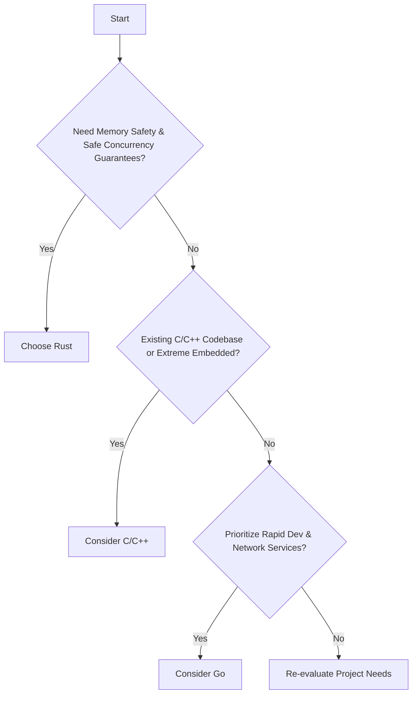
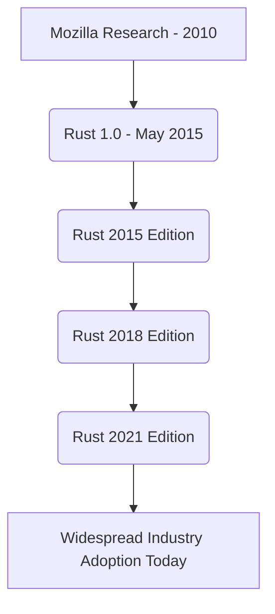

For a deeper dive into Rust's core concepts, check out [The Rust Programming Language Book](https://doc.rust-lang.org/book/).

# <span style="color:#e67e22">Choosing Your Systems Programming Language 🛠️</span>

Picking the right tool for systems programming is key! While *C* and *C++* are established giants, and *Go* excels in specific areas, **Rust** offers a compelling modern alternative. It truly *shines* in preventing tricky *memory bugs* and ensuring *safe concurrency*—issues that often challenge C/C++ developers. Rust's powerful compiler catches many errors *before* your code even runs! Its excellent *modern tooling*, like the `Cargo` package manager, also streamlines development.

## <span style="color:#2980b9">Rust's Strengths & Comparisons 🛡️</span>
*   **Rust vs. C/C++**: Rust provides similar low-level control but with guaranteed memory safety *without* a garbage collector. This means fewer crashes and security vulnerabilities!
*   **Rust vs. Go**: Go offers quick compilation and easy concurrency for network services. However, Rust delivers more direct system resource control and often superior runtime performance due to its "zero-cost abstractions."

### <span style="color:#8e44ad">When Other Languages Might Be Preferred 💡</span>
While Rust's long-term benefits are immense, other languages still have their place:
*   **C/C++**: Ideal for existing massive codebases, extreme embedded systems with tiny resource constraints, or when direct hardware manipulation without any abstractions is non-negotiable.
*   **Go**: Great for rapid development of network services, microservices, and large-scale concurrent applications where developer productivity and fast compilation are top priorities.

## <span style="color:#2980b9">Deciding Your Path 🗺️</span>
Here's a simplified look at the decision process:


_Learn more about Rust: [Official Rust Book](https://doc.rust-lang.org/book/)_
_Explore Go's strengths: [Go Documentation](https://go.dev/doc/)_

While Rust has a *learning curve*, embracing it for new projects demanding high reliability and security pays off immensely over time. Happy coding!

# <span style="color:#e67e22">Rust's Amazing Journey! 🦀</span>

Imagine a programming language born from a need for speed and safety, without the usual headaches! That's the fascinating story of Rust, a journey from a Mozilla Research project to a pillar of modern software development.

## <span style="color:#2980b9">From Mozilla Labs to 1.0 🚀</span>
Rust started as a personal project by Graydon Hoare at Mozilla Research in _2010_. The big goal was to create a language for building `safe` and `concurrent` systems—think web browsers and operating systems. After years of dedicated development and community input, the monumental `Rust 1.0` was officially released in **May 2015**! This was a huge milestone, signifying stability and a promise of reliability.

## <span style="color:#2980b9">Evolving with Editions 📚</span>
Rust gracefully evolves using its *Edition system*. Think of them as opt-in updates that allow the language to improve _without breaking your old code_. We've seen:
*   `Rust 2015`: The stable foundation, marking its initial release.
*   `Rust 2018`: A significant update, improving `async/await` ergonomics and the module system.
*   `Rust 2021`: Brought further syntax cleanups and quality-of-life enhancements.
    *   _Learn more:_ [Rust Editions](https://doc.rust-lang.org/edition-guide/editions.html)

## <span style="color:#2980b9">Industry's Embrace & Growing Ecosystem 🌱</span>
Today, Rust isn't just a research project; it's a powerhouse. Giants like **Microsoft**, **Amazon (AWS)**, and **Google** are adopting Rust for critical infrastructure, from operating systems to cloud services. Its unique blend of `performance`, `memory safety`, and fearless concurrency makes it incredibly appealing. The vibrant ecosystem, powered by `Cargo` (Rust's excellent package manager) and a supportive community, continues to grow rapidly.



# <span style="color:#e67e22">Hello, Rustaceans! Installing Rust with rustup! 🦀</span>

Welcome to the **exciting** world of Rust! Installing it is super *friendly* thanks to `rustup`, the official installer. Let's get you set up to build amazing things efficiently!

## <span style="color:#2980b9">1. Get Rusting! 🚀</span>

Here's a quick installation guide based on your operating system:

```mermaid
graph TD
    A[Start Installation] --> B{Your OS?};
    B -- Windows --> C[Download & Run rustup-init.exe];
    B -- macOS/Linux --> D[Open Terminal];
    D --> E[Run Installer Script];
    C --> F[Follow Prompts (Choose 1 for default)];
    E --> F;
    F --> G[Installation Complete];
    G --> H[Next: Verify!];
```

*   ### <span style="color:#8e44ad">Windows Users 🖥️</span>
    Visit the [official Rust website](https://www.rust-lang.org/tools/install) and download `rustup-init.exe`. Run the executable and simply follow the on-screen prompts, choosing `1` for the default installation. Super easy!

*   ### <span style="color:#8e44ad">macOS & Linux Users 🐧🍎</span>
    Open your terminal and paste this command. It safely downloads and runs the `rustup` installer script:
    ```bash
    curl --proto '=https' --tlsv1.2 -sSf https://sh.rustup.rs | sh
    ```
    *Important:* After installation, run `source $HOME/.cargo/env` to update your `PATH` variable for the current terminal session.

## <span style="color:#2980b9">2. Verify Your Installation ✅</span>

Let's check if Rust and its powerful build tool, `Cargo`, are installed correctly!
```bash
rustc --version # Shows the Rust compiler's version
cargo --version # Shows Cargo's version (your project manager!)
```
You should see version numbers, confirming your successful installation! ✨

## <span style="color:#2980b9">3. Stay Updated! 🔄</span>

Keeping your Rust installation fresh with the latest features and fixes is simple! Just run this command anytime:
```bash
rustup update
```

## <span style="color:#2980b9">4. Your First Rust Project! 👋</span>

Let's create and run your very first "Hello, world!" program with `Cargo`!

*   ### <span style="color:#8e44ad">Create Project 📁</span>
    ```bash
    cargo new hello_rust # Makes a new project folder named 'hello_rust'
    cd hello_rust        # Navigate into your new project directory
    ```
*   ### <span style="color:#8e44ad">Run It! ▶️</span>
    ```bash
    cargo run            # Compiles and runs your code!
    ```
    You'll see *"Hello, world!"* printed in your terminal. *Amazing job!* 🎉

## <span style="color:#2980b9">Further Learning 📚</span>
Dive deeper into Rust with the official, comprehensive *The Rust Programming Language Book*: [doc.rust-lang.org/book/](https://doc.rust-lang.org/book/)

Error: An error occurred while processing your request. Please try again later.

# <span style="color:#e67e22">Welcome to Rust! Your First Program! 🦀</span>

Hello, future Rustacean! Let's embark on your exciting journey into Rust programming. We'll start with the classic "Hello, World!" and then make it interactive! Rust is known for its speed and safety, and `cargo` is your friendly project manager.

## <span style="color:#2980b9">Setting Up Your Project 🚀</span>

First, open your terminal and type:

```bash
cargo new hello_rust
cd hello_rust
```

`cargo new` creates a new directory named *hello_rust* with all the basic files you need. The `cd` command navigates into your new project.

### <span style="color:#8e44ad">Understanding Your Project Files 📂</span>

Inside *hello_rust*, you'll find:

*   `src/main.rs`: This is where your actual Rust code lives.
*   `Cargo.toml`: Your project's manifest file. It contains metadata and lists dependencies.

Let's peek at `src/main.rs`:

```rust
fn main() { // 'main' is the entry point of your program
    println!("Hello, world!"); // 'println!' is a macro that prints text to the console
}
```

## <span style="color:#2980b9">Running Your "Hello, World!" ✨</span>

To see your program in action, simply run this command from inside your `hello_rust` directory:

```bash
cargo run
```

`cargo run` first *compiles* your code, then *executes* it. You'll see `Hello, world!` printed!

## <span style="color:#2980b9">Let's Get Interactive! User Input! 💬</span>

Now, let's make your program ask for your name! Modify your `src/main.rs` file to look like this:

```rust
use std::io; // Import the standard I/O library to handle input

fn main() {
    println!("What's your name?"); // Prompt the user

    let mut name = String::new(); // Create an empty, mutable String to store input

    io::stdin() // Get a handle to the standard input (keyboard)
        .read_line(&mut name) // Read a line from input into our 'name' variable
        .expect("Failed to read line"); // Handle potential errors during reading

    println!("Hello, {}!", name.trim()); // Print a greeting! '.trim()' removes extra whitespace/newline.
}
```

This code uses `std::io` to read what you type into the console.

### <span style="color:#8e44ad">How It Works (Flowchart) 🔄</span>

```mermaid
graph TD
    A[Start Program] --> B{Prompt: "What's your name?"};
    B --> C[Create Empty String];
    C --> D[Wait for User Input];
    D --> E[Read Input into String];
    E --> F{Input Read Successfully?};
    F -- Yes --> G[Trim Input];
    F -- No --> H[Show Error];
    G --> I[Print Greeting];
    I --> J[End Program];
    H --> J;
```

### <span style="color:#8e44ad">Try It Out! 🧪</span>

Save your `main.rs` file and run `cargo run` again. This time, it will wait for you to type your name!

---

**Further Resources:**
*   **The Rust Book:** [https://doc.rust-lang.org/book/](https://doc.rust-lang.org/book/) (Your official guide to Rust!)
*   **`std::io` documentation:** [https://doc.rust-lang.org/std/io/index.html](https://doc.rust-lang.org/std/io/index.html)

