# <span style="color:#e67e22;">What we will learn in this post?</span>
<ul style='list-style-type: none; padding-left: 0;'>
<li><span style='color: #2980b9; font-size: 20px; font-weight: bold;'>👉</span> <span style='color: #2ecc71; font-size: 18px; font-weight: bold;'>Regexp Package</span></li>
<li><span style='color: #2980b9; font-size: 20px; font-weight: bold;'>👉</span> <span style='color: #2ecc71; font-size: 18px; font-weight: bold;'>Matching Patterns</span></li>
<li><span style='color: #2980b9; font-size: 20px; font-weight: bold;'>👉</span> <span style='color: #2ecc71; font-size: 18px; font-weight: bold;'>Capturing Groups</span></li>
<li><span style='color: #2980b9; font-size: 20px; font-weight: bold;'>👉</span> <span style='color: #2ecc71; font-size: 18px; font-weight: bold;'>Replacing with Regex</span></li>
<li><span style='color: #2980b9; font-size: 20px; font-weight: bold;'>👉</span> <span style='color: #2ecc71; font-size: 18px; font-weight: bold;'>Performance Considerations</span></li>
</ul>

# <span style="color:#e67e22">👋 Go's `regexp` Package: Your Pattern-Matching Friend!</span>

Go's `regexp` package is a fantastic tool for finding and manipulating text using *regular expressions* (regex). Think of regex as a super-powered search pattern language that helps you describe complex text sequences!

## <span style="color:#2980b9"> ✨ Getting Your Patterns Ready: Compile vs. MustCompile</span>

Before you can use a regular expression, Go needs to "compile" it into an efficient internal representation.

*   **`regexp.Compile(pattern string)`**: Use this when your pattern might come from an external source (like user input or a config file). It returns a `*regexp.Regexp` object and an `error`. **Always check the error!**
    ```go
    r, err := regexp.Compile("[0-9]+") // Matches one or more digits
    if err != nil {
        // Handle the error gracefully
    }
    ```
*   **`regexp.MustCompile(pattern string)`**: This is perfect for patterns you know are *fixed and correct* at compile-time. If the pattern is invalid, it will `panic`. It's often used for global variables.
    ```go
    var validID = regexp.MustCompile(`^[a-z]+[0-9]*$`) // ID starts with letters, ends with optional digits
    ```

## <span style="color:#2980b9"> 🎯 Basic Regex Magic: Simple Syntax</span>

Here's a glimpse into some common regex characters:

*   **`abc`**: Matches the literal string "abc".
*   **`.`**: Matches *any single character* (except newline).
*   **`*`**: Matches *zero or more* of the preceding item. E.g., `a*` matches "", "a", "aa".
*   **`+`**: Matches *one or more* of the preceding item. E.g., `a+` matches "a", "aa".
*   **`?`**: Matches *zero or one* of the preceding item (makes it optional).
*   **`[abc]`**: Matches *any one* character listed inside the brackets. `[0-9]` matches any digit.
*   **`^`**: Matches the start of a string.
*   **`$`**: Matches the end of a string.

## <span style="color:#2980b9"> 🚀 How Compilation Works (Simplified)</span>


# <span style="color:#e67e22"> Regex Magic: Finding Patterns! ✨</span>

Pattern matching helps us *find* and *extract* specific pieces of text using **Regular Expressions** (regex). Go's `regexp` package offers powerful functions for this!

## <span style="color:#2980b9"> 🎯 Checking & Finding Matches</span>

### <span style="color:#8e44ad" Is It There? `MatchString()` 🧐</span>
This method simply checks if *any* part of your text contains the pattern. It returns `true` or `false`.
*Example:* `regexp.MustCompile("world").MatchString("hello world")` returns `true`.

### <span style="color:#8e44ad"> Finding the First Match `FindString()` 🔍</span>
Want the actual *first* piece of text that matches? `FindString()` returns just that. Its cousin, `FindStringIndex()`, gives you where it starts and ends.
*Example:* `regexp.MustCompile("o.l").FindString("hello world")` returns `"o wo"`.

### <span style="color:#8e44ad"> Catching All Matches `FindAllString()` 🎣</span>
To collect *every* non-overlapping match, `FindAllString()` is your go-to. Specify `-1` to find *all* possible matches.
*Example:* `regexp.MustCompile("a").FindAllString("banana", -1)` returns `["a" "a" "a"]`.

```mermaid
graph TD
    A["❓ Check if pattern exists?"]:::style1 -->|"✅ Yes"| B["🔍 MatchString()"]:::style2
    A -->|"📝 Need actual match?"| C["🎯 What to find?"]:::style3
    C -->|"1️⃣ First one"| D["🔎 FindString()"]:::style4
    C -->|"🎣 All of them"| E["📚 FindAllString()"]:::style5
    
    classDef style1 fill:#00ADD8,stroke:#00758f,color:#fff,font-size:16px,stroke-width:3px,rx:14,shadow:6px;
    classDef style2 fill:#43e97b,stroke:#38f9d7,color:#fff,font-size:16px,stroke-width:3px,rx:14,shadow:6px;
    classDef style3 fill:#5dc9e2,stroke:#00ADD8,color:#fff,font-size:16px,stroke-width:3px,rx:14,shadow:6px;
    classDef style4 fill:#ffd700,stroke:#d99120,color:#222,font-size:16px,stroke-width:3px,rx:14,shadow:6px;
    classDef style5 fill:#6b5bff,stroke:#4a3f6b,color:#fff,font-size:16px,stroke-width:3px,rx:14,shadow:6px;
    
    linkStyle default stroke:#e67e22,stroke-width:3px;
```



## <span style="color:#2980b9"> 💻 Behind the Scenes: Bytes & Indices</span>
Similar methods like `Match()`, `Find()`, `FindIndex()` work with raw byte slices (`[]byte`). Index variants (e.g., `FindStringIndex()`) return the match's start and end positions. For finding matches with **capturing groups**, explore the `Submatch` variants like `FindStringSubmatch()`!

# <span style="color:#e67e22">Unleashing Data with Regex Capturing Groups!</span> 🤩

Ever needed to pick out specific bits of text from a larger string? That's where **capturing groups** in regular expressions come in handy! They let you "capture" specific parts of a matched pattern using `()`. Think of them as special nets for the exact data you want to retrieve.

## <span style="color:#2980b9">Extracting Data with `FindStringSubmatch()`!</span> ✨

Wrap any part of your regex in parentheses `(...)` to define a capturing group. Go's `regexp.FindStringSubmatch()` function is your go-to for extracting these captures. It returns a string slice: the first element (`[0]`) is always the *full match*, followed by your captured groups (`[1]`, `[2]`, etc.).

*   **Example (Basic Capture):**
    ```go
    package main
    import ("fmt"; "regexp")
    func main() {
        re := regexp.MustCompile(`Hello (\w+)!`) // (\w+) captures a word
        match := re.FindStringSubmatch("Hello World!")
        // Output:
        // match[0]: "Hello World!" (full match)
        // match[1]: "World"        (1st capture)
        fmt.Println("Full Match:", match[0], "\nCaptured:", match[1])
    }
    ```

## <span style="color:#2980b9">Naming Your Treasures with `(?P<name>...)`!</span> 🏷️

For clearer code, you can give your capturing groups a name using `(?P<name>...)`. This makes accessing them by name, rather than just an index, much easier to read! After `FindStringSubmatch()`, use `regexp.SubexpNames()` to find the slice index corresponding to your named group.

*   **Example (Named Capture):**
    ```go
    package main
    import ("fmt"; "regexp")
    func main() {
        re := regexp.MustCompile(`User: (?P<username>\w+)`) // (?P<username>\w+) names the capture
        match := re.FindStringSubmatch("User: Alice")
        usernameIndex := re.SubexpIndex("username") // Get index for "username"
        // Output:
        // Captured Username: Alice
        fmt.Println("Captured Username:", match[usernameIndex])
    }
    ```

### <span style="color:#8e44ad">Capture Flow Visualized!</span> 🚀



# <span style="color:#e67e22">✍️ Master Text Replacement in Go!</span>

```mermaid
graph TD
    A["📝 Input String"]:::style1 --> B["🎯 Regex Pattern<br/>with Captures ()"]:::style2
    B --> C["⚙️ FindStringSubmatch()"]:::style3
    C -- "📤 Returns" --> D["📦 String Slice<br/>Full Match + Captures"]:::style4
    D -- "🏷️ Named Group" --> E["🔍 SubexpNames()<br/>for Index Mapping"]:::style5
    E --> F["✅ Access by<br/>Name/Index"]:::style6
    
    classDef style1 fill:#00ADD8,stroke:#00758f,color:#fff,font-size:16px,stroke-width:3px,rx:14,shadow:6px;
    classDef style2 fill:#5dc9e2,stroke:#00ADD8,color:#fff,font-size:16px,stroke-width:3px,rx:14,shadow:6px;
    classDef style3 fill:#ffd700,stroke:#d99120,color:#222,font-size:16px,stroke-width:3px,rx:14,shadow:6px;
    classDef style4 fill:#6b5bff,stroke:#4a3f6b,color:#fff,font-size:16px,stroke-width:3px,rx:14,shadow:6px;
    classDef style5 fill:#ff9800,stroke:#f57c00,color:#fff,font-size:16px,stroke-width:3px,rx:14,shadow:6px;
    classDef style6 fill:#43e97b,stroke:#38f9d7,color:#fff,font-size:16px,stroke-width:3px,rx:14,shadow:6px;
    
    linkStyle default stroke:#e67e22,stroke-width:3px;
```

Text replacement is a powerful tool for manipulating strings. Go's `regexp` package offers fantastic ways to do this, both for simple and complex scenarios. Let's dive in!

---

## <span style="color:#2980b9">🔄 Simple Swaps with `ReplaceAllString()`</span>

This function is your go-to for *fixed* replacements. It finds all matches of a regular expression and substitutes them with a specified string. You can even use **backreferences** (like `$1`, `$2`) to re-use parts of your matched text!

```go
package main

import (
	"fmt"
	"regexp"
)

func main() {
	text := "Hello Mr. Smith and Ms. Jane!"
	// Regex: find (Mr|Ms|Dr). followed by word
	re := regexp.MustCompile(`(Mr|Ms)\. (\w+)`)
	// Replace with "Prefix. Name (Esq.)" using $1 (prefix) and $2 (name)
	newText := re.ReplaceAllString(text, "$1. $2 (Esq.)")
	fmt.Println("Simple Replacement:", newText) 
	// Output: Hello Mr. Smith (Esq.) and Ms. Jane (Esq.)!
}
```

Think of `ReplaceAllString()` as a straightforward "find and replace" operation.

```mermaid
graph TD
    A["📄 Original Text"]:::style1 --> B{"🔍 Regex Match?"}:::style2
    B -- "✅ Yes" --> C["🔄 Replace with<br/>Fixed String/$1 $2"]:::style3
    B -- "❌ No" --> A
    C --> D["📝 Resulting Text"]:::style4
    A -- "✅ All Processed" --> D
    
    classDef style1 fill:#00ADD8,stroke:#00758f,color:#fff,font-size:16px,stroke-width:3px,rx:14,shadow:6px;
    classDef style2 fill:#5dc9e2,stroke:#00ADD8,color:#fff,font-size:16px,stroke-width:3px,rx:14,shadow:6px;
    classDef style3 fill:#ffd700,stroke:#d99120,color:#222,font-size:16px,stroke-width:3px,rx:14,shadow:6px;
    classDef style4 fill:#43e97b,stroke:#38f9d7,color:#fff,font-size:16px,stroke-width:3px,rx:14,shadow:6px;
    
    linkStyle default stroke:#e67e22,stroke-width:3px;
```



---

## <span style="color:#2980b9">✨ Dynamic Changes with `ReplaceAllStringFunc()`</span>

Need more control? `ReplaceAllStringFunc()` lets you provide a *function* that determines the replacement string for each match. This is super handy for dynamic transformations! The function receives a `string` slice containing the *full match* and all **capture groups**.

```go
package main

import (
	"fmt"
	"regexp"
)

func main() {
	dates := "Meeting on 2023-10-26 and 2024-01-15."
	// Regex: YYYY-MM-DD pattern
	re := regexp.MustCompile(`(\d{4})-(\d{2})-(\d{2})`)

	// Custom function to reformat date
	reformattedDates := re.ReplaceAllStringFunc(dates, func(match []string) string {
		// match[0] = full match (e.g., "2023-10-26")
		// match[1] = first group (e.g., "2023")
		// match[2] = second group (e.g., "10")
		// match[3] = third group (e.g., "26")
		return fmt.Sprintf("%s/%s/%s", match[1], match[2], match[3]) // YYYY/MM/DD
	})
	fmt.Println("Dynamic Replacement:", reformattedDates)
	// Output: Meeting on 2023/10/26 and 2024/01/15.
}
```

Here, the function allows *custom logic* for each match.

```mermaid
graph TD
    A["📄 Original Text"]:::style1 --> B{"🔍 Regex Match?"}:::style2
    B -- "✅ Yes" --> C["⚙️ Call Custom Func<br/>with match & groups"]:::style3
    C --> D["🎨 Function Returns<br/>Replacement String"]:::style4
    D --> E["📝 Resulting Text"]:::style5
    B -- "❌ No" --> A
    A -- "✅ All Processed" --> E
    
    classDef style1 fill:#00ADD8,stroke:#00758f,color:#fff,font-size:16px,stroke-width:3px,rx:14,shadow:6px;
    classDef style2 fill:#5dc9e2,stroke:#00ADD8,color:#fff,font-size:16px,stroke-width:3px,rx:14,shadow:6px;
    classDef style3 fill:#ffd700,stroke:#d99120,color:#222,font-size:16px,stroke-width:3px,rx:14,shadow:6px;
    classDef style4 fill:#ff9800,stroke:#f57c00,color:#fff,font-size:16px,stroke-width:3px,rx:14,shadow:6px;
    classDef style5 fill:#43e97b,stroke:#38f9d7,color:#fff,font-size:16px,stroke-width:3px,rx:14,shadow:6px;
    
    linkStyle default stroke:#e67e22,stroke-width:3px;
```



---

### <span style="color:#8e44ad">✅ In a Nutshell</span>

*   ***`ReplaceAllString()`***: Use for straightforward, fixed text substitutions, often with backreferences.
*   ***`ReplaceAllStringFunc()`***: Opt for this when you need complex, conditional, or dynamic replacements by executing custom logic for each match.

---

<span style="color:#e67e22"># Regex Speed Secrets Unveiled! 🚀</span>

Hey there! Let's chat about making your regex run super fast without breaking a sweat. Understanding *how* regex performs can save you a lot of processing time!

## <span style="color:#2980b9">Compile Once, Run Many! 🏎️</span>
Think of regex like a special instruction manual. If you use the same manual often, it's much faster to *compile* it once (e.g., `re.compile()` in Python). This pre-processes the pattern so your computer understands it perfectly. Re-compiling repeatedly for the *same pattern* (like using `re.search()` directly in a loop) wastes time, as the computer "reads the manual" from scratch each time.

## <span style="color:#2980b9">Is Regex Always Best? 🤔</span>
Not always! For simple tasks like checking if text *starts with* specific characters (`.startswith()`) or *contains* something (`.find()`, `in`), standard string methods are often much faster and easier to read than a complex regex. Regex shines for intricate pattern matching, not basic string checks.

## <span style="color:#2980b9">Measure Your Speed! ⏱️</span>
Unsure which method is faster? *Benchmark it!* Use Python's `timeit` module to compare regex vs. string operation speeds. Get concrete data for informed decisions.
```python
import timeit, re
# Example of benchmarking
print(timeit.timeit("'hello' in 'hello world'"))
print(timeit.timeit("re.search('hello', 'hello world')"))
```

### <span style="color:#8e44ad">Quick Optimization Tips ✨</span>
*   **Pre-compile:** *Always* compile your regex if reusing it.
*   **Be Specific:** Make your patterns as precise as possible.
*   **Anchors:** Use `^` (start) and `$` (end) to limit the search scope.
*   **Non-Greedy:** Use `*?` or `+?` to prevent potential backtracking performance issues.

---

# <span style="color:#00ADD8">🎯 Real-World Examples: Regex in Production Go Systems</span>

## <span style="color:#2980b9">Example 1: Email Validation Service</span>

Production email validators use regex for RFC-compliant validation!

```go
package main

import (
	"fmt"
	"regexp"
	"strings"
)

type EmailValidator struct {
	emailRegex *regexp.Regexp
}

func NewEmailValidator() *EmailValidator {
	// Simplified RFC 5322 pattern
	pattern := `^[a-zA-Z0-9._%+\-]+@[a-zA-Z0-9.\-]+\.[a-zA-Z]{2,}$`
	return &EmailValidator{
		emailRegex: regexp.MustCompile(pattern),
	}
}

func (ev *EmailValidator) IsValid(email string) bool {
	return ev.emailRegex.MatchString(strings.TrimSpace(email))
}

func (ev *EmailValidator) ExtractDomain(email string) string {
	if !ev.IsValid(email) {
		return ""
	}
	re := regexp.MustCompile(`@([a-zA-Z0-9.\-]+)$`)
	matches := re.FindStringSubmatch(email)
	if len(matches) > 1 {
		return matches[1]
	}
	return ""
}

func (ev *EmailValidator) MaskEmail(email string) string {
	if !ev.IsValid(email) {
		return email
	}
	re := regexp.MustCompile(`^([a-zA-Z0-9])([a-zA-Z0-9._%-]*)@`)
	return re.ReplaceAllString(email, "$1***@")
}

func main() {
	validator := NewEmailValidator()
	
	emails := []string{
		"john.doe@example.com",
		"invalid-email",
		"alice.smith@company.co.uk",
		"test@domain",
	}
	
	fmt.Println("📧 Email Validation Service")
	fmt.Println("=" + strings.Repeat("=", 50))
	
	for _, email := range emails {
		isValid := validator.IsValid(email)
		status := "❌ Invalid"
		if isValid {
			status = "✅ Valid"
		}
		
		fmt.Printf("\n%s: %s\n", email, status)
		
		if isValid {
			domain := validator.ExtractDomain(email)
			masked := validator.MaskEmail(email)
			fmt.Printf"  Domain: %s\n", domain)
			fmt.Printf("  Masked: %s\n", masked)
		}
	}
}

// Used in production by:
// - Mailgun email validation API
// - SendGrid recipient validation
// - AWS SES bounce handling
```

## <span style="color:#2980b9">Example 2: Log Parser for Monitoring Systems</span>

Production log parsers extract structured data from unstructured logs!

```go
package main

import (
	"fmt"
	"regexp"
	"time"
)

type LogEntry struct {
	Timestamp time.Time
	Level     string
	Service   string
	Message   string
	RequestID string
}

type LogParser struct {
	logPattern *regexp.Regexp
}

func NewLogParser() *LogParser {
	// Pattern: [2024-01-15 10:30:45] [INFO] [auth-service] [req-123abc] User login successful
	pattern := `^\[(?P<timestamp>[^\]]+)\] \[(?P<level>\w+)\] \[(?P<service>[^\]]+)\] \[(?P<requestid>[^\]]+)\] (?P<message>.+)$`
	return &LogParser{
		logPattern: regexp.MustCompile(pattern),
	}
}

func (lp *LogParser) Parse(logLine string) (*LogEntry, error) {
	matches := lp.logPattern.FindStringSubmatch(logLine)
	if matches == nil {
		return nil, fmt.Errorf("invalid log format")
	}
	
	names := lp.logPattern.SubexpNames()
	result := make(map[string]string)
	for i, name := range names {
		if i > 0 && name != "" {
			result[name] = matches[i]
		}
	}
	
	timestamp, _ := time.Parse("2006-01-02 15:04:05", result["timestamp"])
	
	return &LogEntry{
		Timestamp: timestamp,
		Level:     result["level"],
		Service:   result["service"],
		Message:   result["message"],
		RequestID: result["requestid"],
	}, nil
}

func (lp *LogParser) FilterByLevel(logs []string, level string) []*LogEntry {
	var filtered []*LogEntry
	for _, log := range logs {
		entry, err := lp.Parse(log)
		if err == nil && entry.Level == level {
			filtered = append(filtered, entry)
		}
	}
	return filtered
}

func (lp *LogParser) ExtractRequestIDs(logs []string) []string {
	re := regexp.MustCompile(`\[req-([a-z0-9]+)\]`)
	var ids []string
	for _, log := range logs {
		matches := re.FindStringSubmatch(log)
		if len(matches) > 1 {
			ids = append(ids, matches[1])
		}
	}
	return ids
}

func main() {
	parser := NewLogParser()
	
	logs := []string{
		"[2024-01-15 10:30:45] [INFO] [auth-service] [req-123abc] User login successful",
		"[2024-01-15 10:31:22] [ERROR] [payment-service] [req-456def] Payment processing failed",
		"[2024-01-15 10:32:10] [INFO] [auth-service] [req-789ghi] Session refreshed",
		"[2024-01-15 10:33:05] [WARN] [api-gateway] [req-abc123] Rate limit approaching",
	}
	
	fmt.Println("📊 Log Parser Analysis")
	fmt.Println("=" + strings.Repeat("=", 60))
	
	for _, log := range logs {
		entry, err := parser.Parse(log)
		if err != nil {
			fmt.Printf("❌ Failed to parse: %s\n", log)
			continue
		}
		
		var emoji string
		switch entry.Level {
		case "INFO":
			emoji = "ℹ️"
		case "ERROR":
			emoji = "🔴"
		case "WARN":
			emoji = "⚠️"
		}
		
		fmt.Printf("\n%s [%s] %s\n", emoji, entry.Level, entry.Service)
		fmt.Printf("  Time: %s\n", entry.Timestamp.Format("15:04:05"))
		fmt.Printf("  Request: %s\n", entry.RequestID)
		fmt.Printf("  Message: %s\n", entry.Message)
	}
	
	// Filter errors only
	fmt.Println("\n🔍 Error Logs Only:")
	errorLogs := parser.FilterByLevel(logs, "ERROR")
	fmt.Printf("Found %d error(s)\n", len(errorLogs))
	
	// Extract all request IDs
	requestIDs := parser.ExtractRequestIDs(logs)
	fmt.Printf("\n📝 Request IDs: %v\n", requestIDs)
}

// Used in production by:
// - Datadog log aggregation
// - Splunk log indexing
// - ELK Stack (Elasticsearch, Logstash, Kibana)
// - Prometheus log parsing
```

## <span style="color:#2980b9">Example 3: URL Router with Dynamic Path Parameters</span>

HTTP routers use regex for path matching and parameter extraction!

```go
package main

import (
	"fmt"
	"regexp"
	"strings"
)

type Route struct {
	Pattern *regexp.Regexp
	Handler string
	Params  []string
}

type Router struct {
	routes []*Route
}

func NewRouter() *Router {
	return &Router{
		routes: make([]*Route, 0),
	}
}

func (r *Router) AddRoute(path string, handler string) {
	// Convert /users/:id/posts/:postId to regex with named groups
	paramRegex := regexp.MustCompile(`:(\w+)`)
	params := []string{}
	
	// Find all parameters
	for _, match := range paramRegex.FindAllStringSubmatch(path, -1) {
		params = append(params, match[1])
	}
	
	// Replace :param with named capture groups
	pattern := paramRegex.ReplaceAllString(path, `(?P<$1>[^/]+)`)
	pattern = "^" + pattern + "$"
	
	r.routes = append(r.routes, &Route{
		Pattern: regexp.MustCompile(pattern),
		Handler: handler,
		Params:  params,
	})
}

func (r *Router) Match(path string) (string, map[string]string, bool) {
	for _, route := range r.routes {
		matches := route.Pattern.FindStringSubmatch(path)
		if matches == nil {
			continue
		}
		
		// Extract parameters
		params := make(map[string]string)
		names := route.Pattern.SubexpNames()
		for i, name := range names {
			if i > 0 && name != "" {
				params[name] = matches[i]
			}
		}
		
		return route.Handler, params, true
	}
	return "", nil, false
}

func main() {
	router := NewRouter()
	
	// Register routes with dynamic parameters
	router.AddRoute("/users/:id", "GetUserHandler")
	router.AddRoute("/users/:id/posts/:postId", "GetPostHandler")
	router.AddRoute("/api/v:version/products/:sku", "GetProductHandler")
	router.AddRoute("/files/:path+", "GetFileHandler")
	
	testPaths := []string{
		"/users/123",
		"/users/456/posts/789",
		"/api/v2/products/ABC-123",
		"/files/images/logo.png",
		"/unknown/path",
	}
	
	fmt.Println("🚦 URL Router Test")
	fmt.Println("=" + strings.Repeat("=", 70))
	
	for _, path := range testPaths {
		handler, params, matched := router.Match(path)
		
		if matched {
			fmt.Printf("\n✅ Path: %s\n", path)
			fmt.Printf("   Handler: %s\n", handler)
			fmt.Printf("   Params: %v\n", params)
		} else {
			fmt.Printf("\n❌ Path: %s (No match)\n", path)
		}
	}
}

// Used in production by:
// - Gorilla Mux router
// - Chi router
// - Gin framework
// - Echo framework
```

---

<details style='border: 2px solid #00ADD8; border-radius: 8px; padding: 20px; background: linear-gradient(135deg, #e0f7ff 0%, #fff 100%); margin: 25px 0; box-shadow: 0 6px 12px rgba(0, 173, 216, 0.15);'>
<summary style='cursor: pointer; font-size: 1.3em; font-weight: bold; color: #00ADD8; padding: 10px 0;'>
🎯 Hands-On Assignment: Build a Text Processing CLI Tool 🚀
</summary>

<div style='margin-top: 20px; color: #2c3e50; line-height: 1.6;'>

<h3 style='color: #00ADD8; border-bottom: 2px solid #00ADD8; padding-bottom: 8px; margin-top: 20px;'>📝 Your Mission</h3>

Build a production-ready CLI tool that processes text files using regular expressions for pattern matching, data extraction, and text transformation!

<h3 style='color: #00ADD8; border-bottom: 2px solid #00ADD8; padding-bottom: 8px; margin-top: 20px;'>🎯 Requirements</h3>

<ol style='margin-left: 20px;'>
<li><strong>Phone Number Extractor</strong>:
  <ul style='margin-left: 20px; margin-top: 8px;'>
    <li>Find and extract phone numbers in formats: (123) 456-7890, 123-456-7890, +1-123-456-7890</li>
    <li>Validate format using regex</li>
    <li>Group by country code</li>
    <li>Format output consistently</li>
  </ul>
</li>
<li><strong>URL Parser</strong>:
  <ul style='margin-left: 20px; margin-top: 8px;'>
    <li>Extract URLs from text using regex</li>
    <li>Parse protocol, domain, path, query parameters</li>
    <li>Use named capturing groups</li>
    <li>Validate URL structure</li>
  </ul>
</li>
<li><strong>Credit Card Masker</strong>:
  <ul style='margin-left: 20px; margin-top: 8px;'>
    <li>Find credit card numbers (Visa, MasterCard, Amex formats)</li>
    <li>Mask all but last 4 digits: **** **** **** 1234</li>
    <li>Use <code>ReplaceAllStringFunc()</code> for dynamic masking</li>
    <li>Preserve original spacing</li>
  </ul>
</li>
<li><strong>Date Normalizer</strong>:
  <ul style='margin-left: 20px; margin-top: 8px;'>
    <li>Find dates in multiple formats (MM/DD/YYYY, DD-MM-YYYY, YYYY.MM.DD)</li>
    <li>Convert all to ISO 8601 format (YYYY-MM-DD)</li>
    <li>Use capturing groups to extract day, month, year</li>
    <li>Handle invalid dates gracefully</li>
  </ul>
</li>
<li><strong>Markdown Link Converter</strong>:
  <ul style='margin-left: 20px; margin-top: 8px;'>
    <li>Find markdown links: <code>[text](url)</code></li>
    <li>Convert to HTML: <code>&lt;a href="url"&gt;text&lt;/a&gt;</code></li>
    <li>Use backreferences in replacement</li>
    <li>Handle nested brackets</li>
  </ul>
</li>
<li><strong>Performance Metrics</strong>:
  <ul style='margin-left: 20px; margin-top: 8px;'>
    <li>Compile regex patterns once (pre-compilation)</li>
    <li>Benchmark processing time for large files</li>
    <li>Report matches found, replacements made</li>
    <li>Memory-efficient streaming for large files</li>
  </ul>
</li>
</ol>

<h3 style='color: #00ADD8; border-bottom: 2px solid #00ADD8; padding-bottom: 8px; margin-top: 25px;'>💡 Starter Code</h3>

<pre style='background: #2c3e50; color: #ecf0f1; padding: 20px; border-radius: 8px; overflow-x: auto; margin: 15px 0;'><code class='language-go'>package main

import (
	"bufio"
	"flag"
	"fmt"
	"os"
	"regexp"
	"time"
)

type TextProcessor struct {
	phoneRegex     *regexp.Regexp
	urlRegex       *regexp.Regexp
	creditCardRegex *regexp.Regexp
	dateRegex      *regexp.Regexp
	markdownRegex  *regexp.Regexp
}

func NewTextProcessor() *TextProcessor {
	return &TextProcessor{
		// TODO: Compile all regex patterns
		phoneRegex: regexp.MustCompile(`(\+?1[-.])?\(?([0-9]{3})\)?[-.]?([0-9]{3})[-.]?([0-9]{4})`),
		// Add more regex patterns...
	}
}

func (tp *TextProcessor) ExtractPhoneNumbers(text string) []string {
	// TODO: Find and format all phone numbers
	matches := tp.phoneRegex.FindAllStringSubmatch(text, -1)
	var phones []string
	for _, match := range matches {
		// Format: (XXX) XXX-XXXX
		formatted := fmt.Sprintf("(%s) %s-%s", match[2], match[3], match[4])
		phones = append(phones, formatted)
	}
	return phones
}

func (tp *TextProcessor) MaskCreditCards(text string) string {
	// TODO: Mask credit card numbers
	return tp.creditCardRegex.ReplaceAllStringFunc(text, func(match string) string {
		// Keep last 4 digits, mask rest
		if len(match) < 4 {
			return match
		}
		last4 := match[len(match)-4:]
		return "**** **** **** " + last4
	})
}

func (tp *TextProcessor) ProcessFile(filename string) error {
	file, err := os.Open(filename)
	if err != nil {
		return err
	}
	defer file.Close()
	
	scanner := bufio.NewScanner(file)
	start := time.Now()
	
	for scanner.Scan() {
		line := scanner.Text()
		// TODO: Process each line
		fmt.Println(line)
	}
	
	duration := time.Since(start)
	fmt.Printf("\n⏱️  Processing time: %v\n", duration)
	
	return scanner.Err()
}

func main() {
	filename := flag.String("file", "input.txt", "Input file to process")
	mode := flag.String("mode", "all", "Processing mode: phone|url|card|date|markdown|all")
	flag.Parse()
	
	processor := NewTextProcessor()
	
	fmt.Println("🔍 Text Processing CLI Tool")
	fmt.Println("Mode:", *mode)
	fmt.Println("File:", *filename)
	fmt.Println("=" + strings.Repeat("=", 50))
	
	if err := processor.ProcessFile(*filename); err != nil {
		fmt.Printf("❌ Error: %v\n", err)
		os.Exit(1)
	}
}
</code></pre>

<h3 style='color: #00ADD8; border-bottom: 2px solid #00ADD8; padding-bottom: 8px; margin-top: 25px;'>🚀 Bonus Challenges</h3>

<ul style='margin-left: 20px;'>
<li><strong>Level 2</strong>: Add email extraction and validation (RFC 5322 compliant)</li>
<li><strong>Level 3</strong>: Implement IP address finder (IPv4 and IPv6)</li>
<li><strong>Level 4</strong>: Add hashtag and @mention extractor for social media text</li>
<li><strong>Level 5</strong>: Create sensitive data redactor (SSN, passport numbers, API keys)</li>
<li><strong>Level 6</strong>: Build HTML tag stripper that preserves text content</li>
<li><strong>Level 7</strong>: Add SQL injection pattern detector for security scanning</li>
</ul>

<h3 style='color: #00ADD8; border-bottom: 2px solid #00ADD8; padding-bottom: 8px; margin-top: 25px;'>🎓 Learning Goals</h3>

<ul style='margin-left: 20px;'>
<li>Master regex pattern compilation and reuse 🎯</li>
<li>Use capturing groups and named groups effectively 📦</li>
<li>Apply <code>ReplaceAllStringFunc()</code> for dynamic transformations 🔄</li>
<li>Implement performance optimization techniques ⚡</li>
<li>Build production-ready text processing tools 🚀</li>
</ul>

<p style='background: #00ADD8; color: #fff; padding: 15px; border-radius: 8px; margin-top: 20px; border-left: 5px solid #00758f;'>
<strong>💡 Pro Tip:</strong> This pattern is used in real systems like GitHub code search, Slack message parsing, and AWS CloudWatch log analysis!
</p>

<p style='margin-top: 20px; font-size: 1.1em;'><strong>Share Your Solution! 💬</strong></p>
<p>Completed the project? <strong>Post your code in the comments below!</strong> Show us your regex mastery! ✨🚀</p>

</div>
</details>

---

# <span style="color:#e67e22">Conclusion: Master Regular Expressions in Go 🎓</span>

Go's `regexp` package provides a powerful, efficient toolkit for pattern matching, text extraction, and data transformation in production systems. By mastering compilation strategies, capturing groups, replacement functions, and performance optimization techniques, you can build robust text processing applications – from log parsers and URL routers to data validators and content filters powering modern Go services and CLI tools. ⚡🚀

