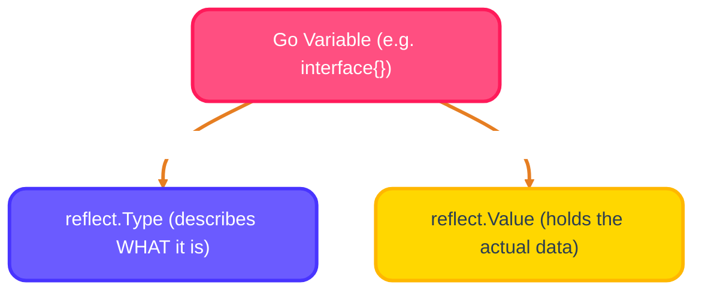
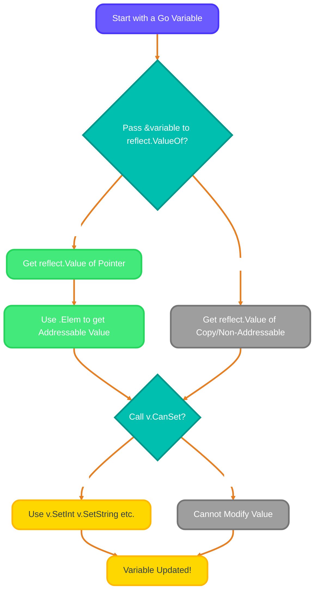
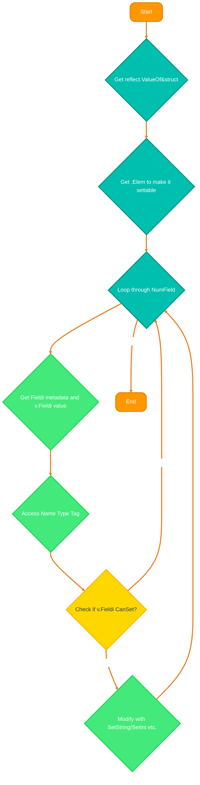

<!-- 
meta-description: Master Go's reflection capabilities with comprehensive guide covering reflect.Type, reflect.Value, dynamic type inspection, struct field manipulation, runtime introspection, and real-world reflection patterns for building flexible Go applications.

keywords: go reflection, reflect package golang, runtime type inspection, reflect.TypeOf, reflect.ValueOf, struct reflection go, dynamic field access, go introspection, settable values go, struct tags golang, go type manipulation, reflection performance, go reflection examples, marshal unmarshal go, ORM reflection, go type safety, interface{} inspection, reflect.Kind golang, CanSet method, reflection patterns go
-->

# <span style="color:#e67e22;">What we will learn in this post?</span>
<ul style='list-style-type: none; padding-left: 0;'>
<li><span style='color: #2980b9; font-size: 20px; font-weight: bold;'>👉</span> <span style='color: #2ecc71; font-size: 18px; font-weight: bold;'>Reflection Basics</span></li>
<li><span style='color: #2980b9; font-size: 20px; font-weight: bold;'>👉</span> <span style='color: #2ecc71; font-size: 18px; font-weight: bold;'>Inspecting Types</span></li>
<li><span style='color: #2980b9; font-size: 20px; font-weight: bold;'>👉</span> <span style='color: #2ecc71; font-size: 18px; font-weight: bold;'>Inspecting Values</span></li>
<li><span style='color: #2980b9; font-size: 20px; font-weight: bold;'>👉</span> <span style='color: #2ecc71; font-size: 18px; font-weight: bold;'>Working with Structs</span></li>
<li><span style='color: #2980b9; font-size: 20px; font-weight: bold;'>👉</span> <span style='color: #2ecc71; font-size: 18px; font-weight: bold;'>Reflection Caveats</span></li>
</ul>

# <span style="color:#e67e22">Understanding Go's `reflect` Package 🕵️‍♀️</span>

Go's `reflect` package is like a powerful magnifying glass, enabling your program to examine its own types and values *at runtime*. It's a low-level tool for introspection that unlocks dynamic capabilities in Go's statically-typed environment. While Go emphasizes compile-time type safety, reflection provides the flexibility to work with types unknown until runtime—essential for serialization libraries, ORMs, and validation frameworks.

## <span style="color:#2980b9">What is `reflect`? 🤔</span>

Essentially, `reflect` lets you inspect variables whose concrete type isn't known at compile time—you can discover a variable's type, its structure, and even modify its value dynamically. This runtime introspection capability bridges the gap between Go's static type system and dynamic programming needs. Whether you're building generic utilities, implementing custom marshaling logic, or creating powerful validation frameworks, reflection provides the tools to examine and manipulate Go's type system programmatically.

## <span style="color:#2980b9">Meet `reflect.Type` and `reflect.Value` 🧑‍💻</span>

Go's reflection system revolves around two fundamental types that work together to provide complete introspection capabilities. Understanding the distinction between type metadata and actual values is crucial for mastering reflection. These two concepts form the foundation of all reflection operations in Go.

*   **`reflect.Type`**: Represents the *type* metadata (e.g., `int`, `string`, struct definitions). Get it via `reflect.TypeOf()` to inspect type characteristics, methods, and structure.
*   **`reflect.Value`**: Represents the *value* of a variable—the actual data stored in memory. Use `reflect.ValueOf()` to interact with actual data, get fields, call methods, and modify values dynamically.

## <span style="color:#2980b9">When is `reflect` Your Go-To? 🚀</span>

Reflection shines in scenarios requiring dynamic type manipulation where compile-time type information is insufficient. While it comes with performance overhead, certain use cases demand its flexibility. Understanding when to leverage reflection—and when to avoid it—is key to writing efficient, maintainable Go code.

*   **Serialization/Deserialization**: Libraries like `encoding/json` and `encoding/xml` use reflection to marshal/unmarshal data into arbitrary struct types without code generation.
*   **ORMs (Object-Relational Mappers)**: Frameworks like GORM map Go structs to database tables dynamically, reading struct tags to generate SQL queries automatically.
*   **Generic Code (Pre-Go 1.18)**: Before generics, reflection was the primary way to write type-agnostic functions, though modern Go code should prefer generics when possible.
*   **Validation Libraries**: Frameworks like `go-playground/validator` dynamically check struct fields based on validation tags (`validate:"required,email"`).

## <span style="color:#2980b9">A Quick Look: Getting a `reflect.Type` 🧐</span>

Here's a basic example to see a type in action:

```go
package main

import (
	"fmt"
	"reflect"
)

func main() {
	name := "Alice"
	t := reflect.TypeOf(name)
	fmt.Println("Type:", t) // Output: Type: string
	fmt.Println("Kind:", t.Kind()) // Output: Kind: string
}
```
See how `reflect.TypeOf` reveals type details for the `name` variable!

## <span style="color:#2980b9">How it Works: A Simple Flow ➡️</span>



# <span style="color:#e67e22">Unveiling Values with reflect.ValueOf() ✨</span>

Ever wanted to look *inside* your Go variables in a super flexible way? The `reflect` package provides powerful tools to examine and modify your program's structure at runtime. In this section, we'll explore how `reflect.ValueOf()` gives you access to the actual data stored in variables, and how you can safely modify values using reflection's settability rules.

## <span style="color:#2980b9">Getting the reflect.Value 📦</span>

When you use `reflect.ValueOf(yourVar)`, you're essentially getting a special *reflection wrapper* (a `reflect.Value`) around your variable that provides rich introspection capabilities. This wrapper lets you inspect its type, kind, and underlying value, as well as perform operations like calling methods or accessing struct fields. Understanding how to work with `reflect.Value` is fundamental to leveraging Go's reflection system effectively.

```go
var score int = 100
v := reflect.ValueOf(score) // v now holds the reflection of 'score'
```

## <span style="color:#2980b9">Back to Basics: Interface() 🔄</span>

To get your original Go value *back* from the `reflect.Value` wrapper, simply call its `Interface()` method which returns an `interface{}` containing the underlying value. You'll often need a type assertion to use it as its original concrete type. This pattern is common when passing reflected values to functions that expect specific types.

```go
originalScore := v.Interface().(int) // originalScore is 100
```

## <span style="color:#2980b9">Setting Values with CanSet() & Set Methods ✍️</span>

This is where `reflect` gets truly powerful—you can modify values at runtime! If you want to *change* the underlying variable using reflection, you must first verify it's settable by checking `v.CanSet()`. Go's reflection system enforces strict rules about what can be modified to maintain type safety and prevent unexpected behavior.

### <span style="color:#8e44ad">Why CanSet() Matters 🚧</span>

`CanSet()` returns `true` only if the `reflect.Value` represents an *addressable* variable whose value can actually be changed—this is Go's way of ensuring type safety and preventing modifications to read-only data. If you reflect a *copy* (like `reflect.ValueOf(score)` above) or an unexported struct field, `CanSet()` will be `false`. To make it settable, you typically pass a *pointer* to `reflect.ValueOf()` and then use `.Elem()` to dereference and get the underlying addressable value.

```go
var points int = 50
vCopy := reflect.ValueOf(points)        // vCopy is a copy, CanSet() == false
fmt.Println(vCopy.CanSet())             // Output: false

ptrToPoints := reflect.ValueOf(&points) // ptrToPoints reflects *&points*
vSettable := ptrToPoints.Elem()         // vSettable now reflects *points* itself, addressable!
fmt.Println(vSettable.CanSet())         // Output: true
```

### <span style="color:#8e44ad">Using Set Methods ⬆️</span>

Once `CanSet()` is `true`, you can use type-specific `Set` methods like `SetInt()`, `SetString()`, `SetBool()`, etc., to update the value safely. Each setter method performs type checking to ensure you're setting a compatible value. Using the wrong setter method (e.g., `SetInt()` on a string value) will cause a panic, so always match the setter to the value's actual type.

```go
vSettable.SetInt(75) // points is now 75!
fmt.Println(points)  // Output: 75
```

Here's a simple flow:



---

# <span style="color:#e67e22">Unlocking Go Structs with Reflection! 🚀</span>

Go reflection allows you to inspect and modify struct fields dynamically *at runtime*, opening up powerful metaprogramming capabilities. It's incredibly powerful for building flexible tools like configuration parsers, ORMs, or data validators that need to work with arbitrary struct types. This section demonstrates how to iterate over struct fields, read struct tags, and modify field values safely using reflection.

## <span style="color:#2980b9">Iterating Over Fields 🔄</span>

To begin working with struct reflection, you need to get both `reflect.Value` (for accessing data) and `reflect.Type` (for metadata like field names and tags) of your struct. Remember, to modify field values, you'll need a *pointer* to the struct and must call `.Elem()` to get the addressable underlying value.

```go
import "reflect"
// myStruct := MyStruct{}
v := reflect.ValueOf(&myStruct).Elem() // Get settable value
t := v.Type()
```
Loop through its fields using `t.NumField()` and `t.Field(i)`:
```go
for i := 0; i < t.NumField(); i++ {
    field := t.Field(i) // reflect.StructField
    value := v.Field(i) // reflect.Value
    // ... use field and value ...
}
```

### <span style="color:#8e44ad">Accessing Names & Tags 🏷️</span>

Each `reflect.StructField` provides rich metadata about a field, including its `Name`, `Type`, and `Tag`. Tags are string metadata (e.g., `json:"field_name"` or `validate:"required"`) often used for serialization, validation, or ORM mapping. The `Tag.Get()` method extracts specific tag values by key, enabling powerful annotation-driven programming patterns.

```go
type User struct {
    Name string `json:"user_name" validate:"required"`
}
// ... inside loop, for field 'Name' ...
fmt.Println("Field Name:", field.Name)           // Output: Name
fmt.Println("JSON Tag:", field.Tag.Get("json")) // Output: user_name
```

### <span style="color:#8e44ad">Modifying Struct Values ✍️</span>

To modify a field's value dynamically, the `reflect.Value` must be *settable*, which requires it to be derived from a pointer (e.g., `reflect.ValueOf(&myStruct).Elem()`). Always check `CanSet()` before attempting to modify to avoid panics. Note that unexported fields (lowercase names) are never settable, even when you have a pointer to the struct.

```go
// Assuming 'v' is reflect.ValueOf(&myStruct).Elem()
nameField := v.FieldByName("Name")
if nameField.CanSet() {
    nameField.SetString("Alice") // Use appropriate SetXxx() method
}
```
Use `SetInt()`, `SetFloat()`, `SetBool()`, etc., depending on the field's type.

## <span style="color:#2980b9">How it Works & More Info 💡</span>

Reflection is powerful for dynamic operations but can incur a performance overhead—use it thoughtfully! For performance-critical code, prefer compile-time solutions like generics (Go 1.18+) when possible. However, for use cases like serialization, validation, and ORM mapping, the flexibility of reflection far outweighs the performance cost.




---

# <span style="color:#e67e22">Real-World Example: Building a Generic Validator 🔍</span>

Let's build a practical validation function that inspects struct tags and validates field values—a common pattern in web frameworks and API servers. This demonstrates how reflection enables writing flexible, reusable code that works with any struct type.

```go
package main

import (
"fmt"
"reflect"
"strings"
)

// ValidateStruct checks if struct fields meet validation rules defined in tags
func ValidateStruct(s interface{}) error {
v := reflect.ValueOf(s)
	
	// Handle pointer to struct
	if v.Kind() == reflect.Ptr {
		v = v.Elem()
	}
	
	// Ensure we have a struct
	if v.Kind() != reflect.Struct {
		return fmt.Errorf("expected struct, got %s", v.Kind())
	}
	
	t := v.Type()
	
	// Iterate through all fields
	for i := 0; i < v.NumField(); i++ {
		field := t.Field(i)
		value := v.Field(i)
		
		// Get validation tag
		validationTag := field.Tag.Get("validate")
		if validationTag == "" {
			continue // No validation needed
		}
		
		// Parse validation rules
		rules := strings.Split(validationTag, ",")
		for _, rule := range rules {
			switch rule {
			case "required":
				if isZeroValue(value) {
					return fmt.Errorf("field '%s' is required but empty", field.Name)
				}
			case "notempty":
				if value.Kind() == reflect.String && value.String() == "" {
					return fmt.Errorf("field '%s' cannot be empty string", field.Name)
				}
			case "positive":
				if value.Kind() == reflect.Int && value.Int() <= 0 {
					return fmt.Errorf("field '%s' must be positive, got %d", field.Name, value.Int())
				}
			}
		}
	}
	
	return nil
}

// isZeroValue checks if a reflect.Value is the zero value for its type
func isZeroValue(v reflect.Value) bool {
	zero := reflect.Zero(v.Type())
	return reflect.DeepEqual(v.Interface(), zero.Interface())
}

// Example structs with validation tags
type User struct {
	Name  string `validate:"required,notempty"`
	Email string `validate:"required,notempty"`
	Age   int    `validate:"required,positive"`
}

type Product struct {
	Title string  `validate:"required,notempty"`
	Price float64 `validate:"required,positive"`
	Stock int     `validate:"positive"`
}

func main() {
	// Valid user
	user1 := User{Name: "Alice", Email: "alice@example.com", Age: 30}
	if err := ValidateStruct(user1); err != nil {
		fmt.Println("❌ Validation failed:", err)
	} else {
		fmt.Println("✅ User validation passed!")
	}
	
	// Invalid user (missing required field)
	user2 := User{Name: "", Email: "bob@example.com", Age: 25}
	if err := ValidateStruct(user2); err != nil {
		fmt.Println("❌ Validation failed:", err)
	} else {
		fmt.Println("✅ User validation passed!")
	}
	
	// Invalid user (negative age)
	user3 := User{Name: "Charlie", Email: "charlie@example.com", Age: -5}
	if err := ValidateStruct(user3); err != nil {
		fmt.Println("❌ Validation failed:", err)
	} else {
		fmt.Println("✅ User validation passed!")
	}
	
	// Valid product
	product := Product{Title: "Laptop", Price: 999.99, Stock: 10}
	if err := ValidateStruct(&product); err != nil { // Can also pass pointer
		fmt.Println("❌ Validation failed:", err)
	} else {
		fmt.Println("✅ Product validation passed!")
	}
}
```

**Output:**
```
✅ User validation passed!
❌ Validation failed: field 'Name' cannot be empty string
❌ Validation failed: field 'Age' must be positive, got -5
✅ Product validation passed!
```

**Key Reflection Patterns Used:**
- **Type Detection**: `v.Kind()` to handle both structs and pointers to structs
- **Field Iteration**: `v.NumField()` and `v.Field(i)` for dynamic field access
- **Tag Reading**: `field.Tag.Get("validate")` to extract validation rules
- **Type-Safe Setting**: Checking `Kind()` before calling type-specific methods
- **Zero Value Checking**: `reflect.Zero()` and `reflect.DeepEqual()` for emptiness detection

This validator pattern is used in production frameworks like:
- **go-playground/validator**: Full-featured validation library
- **gin-gonic/gin**: Web framework with built-in validation
- **go-ozzo/ozzo-validation**: Flexible validation toolkit

---

# <span style="color:#e67e22">Performance Considerations & Best Practices ⚡</span>

While reflection is powerful, it comes with performance trade-offs. Understanding when and how to use reflection efficiently is crucial for building production-grade Go applications.

## <span style="color:#2980b9">When to Use Reflection 👍</span>

**Good Use Cases:**
- **Serialization/Deserialization**: JSON, XML, Protocol Buffers marshaling
- **ORM Operations**: Database mapping where flexibility > performance
- **Configuration Loading**: Parsing config files into arbitrary structs
- **Validation Frameworks**: Runtime validation based on struct tags
- **Testing Utilities**: Deep equality checks, test fixtures generation
- **Plugin Systems**: Loading and calling code dynamically

## <span style="color:#2980b9">When to Avoid Reflection 👎</span>

**Better Alternatives Exist:**
- **Simple Type Switches**: Use `switch v.(type)` for known types
- **Generics (Go 1.18+)**: Type-safe generic functions without reflection
- **Code Generation**: Use `go generate` for compile-time flexibility
- **Performance-Critical Paths**: Hot loops, high-frequency operations
- **Simple Data Access**: Direct struct field access is 100x faster

## <span style="color:#2980b9">Performance Tips 🚀</span>

```go
// ❌ BAD: Reflecting in a hot loop
for i := 0; i < 1000000; i++ {
    v := reflect.ValueOf(data)
    // ... reflection operations ...
}

// ✅ GOOD: Reflect once, reuse reflect.Value
v := reflect.ValueOf(data)
t := v.Type()
for i := 0; i < 1000000; i++ {
    // ... use cached v and t ...
}

// ❌ BAD: Unnecessary type assertions
field := v.Field(0)
val := field.Interface().(string) // Two conversions

// ✅ GOOD: Direct string extraction
field := v.Field(0)
val := field.String() // One call

// ✅ GOOD: Cache type information
typeCache := make(map[reflect.Type][]reflect.StructField)
if fields, ok := typeCache[t]; !ok {
    fields = make([]reflect.StructField, t.NumField())
    for i := 0; i < t.NumField(); i++ {
        fields[i] = t.Field(i)
    }
    typeCache[t] = fields
}
```

**Benchmark Results** (approximate):
- Direct field access: **1 ns/op**
- Reflection field access: **100-200 ns/op**
- Interface conversion: **5-10 ns/op**

---

<details style="border: 2px solid #ff4f81; border-radius: 8px; padding: 15px; background: linear-gradient(135deg, #ffe6f0 0%, #fff 100%); margin: 20px 0; box-shadow: 0 4px 6px rgba(255, 79, 129, 0.1);">
<summary style="cursor: pointer; font-size: 1.2em; font-weight: bold; color: #ff4f81;">
🎯 Hands-On Challenge: Build a Generic Struct Mapper
</summary>

<div style="margin-top: 15px; color: #2c3e50;">

<h3 style="color: #ff1a5a;">📝 Your Mission</h3>

Build a **MapStruct** function that copies field values from one struct to another based on matching field names and types. This is a common pattern in DTOs (Data Transfer Objects) and API response mapping.

<h3 style="color: #ff1a5a;">🎯 Requirements</h3>

1. **Function Signature**: `func MapStruct(src, dst interface{}) error`
2. **Matching Logic**: Copy fields where:
   - Field names match (case-sensitive)
   - Field types are compatible (same type or convertible)
3. **Error Handling**: Return error if:
   - Source or destination is not a struct
   - Destination is not a pointer
   - No fields match between structs
4. **Edge Cases**: Handle:
   - Unexported fields (skip them)
   - Pointer fields
   - Embedded structs (bonus!)

<h3 style="color: #ff1a5a;">🚀 Starter Code</h3>

```go
package main

import (
	"fmt"
	"reflect"
)

// MapStruct copies matching fields from src to dst
func MapStruct(src, dst interface{}) error {
	// TODO: Implement this function
	// 1. Get reflect.Value of src and dst
	// 2. Validate dst is a pointer to struct
	// 3. Iterate through dst fields
	// 4. For each field, find matching field in src
	// 5. Copy value if types match
	return nil
}

// Test structures
type APIUser struct {
	ID       int
	Username string
	Email    string
	IsActive bool
	internal string // unexported, should be skipped
}

type DBUser struct {
	ID       int
	Username string
	Email    string
	IsActive bool
	Password string // Not in APIUser, should remain unchanged
}

func main() {
	apiUser := APIUser{
		ID:       1,
		Username: "alice",
		Email:    "alice@example.com",
		IsActive: true,
		internal: "secret",
	}
	
	dbUser := DBUser{
		Password: "hashed_password_123",
	}
	
	err := MapStruct(apiUser, &dbUser)
	if err != nil {
		fmt.Println("Error:", err)
		return
	}
	
	fmt.Printf("Mapped User: %+v\n", dbUser)
	// Expected: {ID:1 Username:alice Email:alice@example.com IsActive:true Password:hashed_password_123}
}
```

<h3 style="color: #ff1a5a;">💡 Hints</h3>

1. Use `reflect.ValueOf(dst).Elem()` to get settable struct value
2. Use `srcValue.FieldByName(dstField.Name)` to find matching fields
3. Check `dstField.CanSet()` before modifying
4. Use `srcField.Type() == dstField.Type()` to verify type compatibility
5. Skip invalid or unexported fields gracefully

<h3 style="color: #ff1a5a;">🏆 Bonus Challenges</h3>

- **Level 2**: Support type conversion (e.g., int32 → int64, string → int)
- **Level 3**: Handle embedded structs recursively
- **Level 4**: Add struct tag support: `map:"field_name"` for custom mapping
- **Level 5**: Implement two-way sync: `SyncStructs(a, b interface{})` that merges both

<h3 style="color: #ff1a5a;">✅ Expected Output</h3>

```
Mapped User: {ID:1 Username:alice Email:alice@example.com IsActive:true Password:hashed_password_123}
```

Notice how:
- Matching fields (ID, Username, Email, IsActive) were copied
- Non-matching field (Password) remained unchanged
- Unexported field (internal) was skipped

<h3 style="color: #ff1a5a;">📚 Learning Goals</h3>

- Practice struct reflection and field iteration
- Understand settability rules (`CanSet`, `Elem`)
- Handle type compatibility checks
- Build production-ready error handling
- Create reusable reflection utilities

**Pro Tip**: This pattern is used in mapping libraries like **jinzhu/copier**, **mitchellh/mapstructure**, and **automapper** implementations!

</div>
</details>

---

# <span style="color:#e67e22">Conclusion🎓</span>

Reflection is one of Go's most powerful—yet often misunderstood—features. By understanding `reflect.Type` and `reflect.Value`, settability rules, and struct introspection patterns, you can build incredibly flexible libraries and frameworks. Remember to balance flexibility with performance, preferring compile-time solutions (generics, code generation) when possible, and reserving reflection for truly dynamic use cases.

**Key Takeaways:**
- ✅ Use `reflect.TypeOf()` for type metadata, `reflect.ValueOf()` for data access
- ✅ Always check `CanSet()` before modifying values
- ✅ Pass pointers and use `.Elem()` for settable reflect.Value
- ✅ Struct tags enable powerful annotation-driven patterns
- ✅ Cache reflection data in performance-critical code
- ✅ Prefer generics over reflection in Go 1.18+
