```mermaid
graph TD
    A["✍️ Write Generic Function"]:::style1 --> B["📋 Define Type Parameters [T]"]:::style2
    B --> C["⛓️ Apply Type Constraints"]:::style3
    C --> D["⚙️ Compile Flexible Code"]:::style4
    D --> E["📞 Call Function with Data"]:::style5
    E --> F["🔍 Compiler Infers Type"]:::style3
    F --> G["🚀 Execute Specific Version"]:::style4

    classDef style1 fill:#ff4f81,stroke:#c43e3e,color:#fff,font-size:16px,stroke-width:3px,rx:14,shadow:6px;
    classDef style2 fill:#6b5bff,stroke:#4a3f6b,color:#fff,font-size:16px,stroke-width:3px,rx:14,shadow:6px;
    classDef style3 fill:#ffd700,stroke:#d99120,color:#222,font-size:16px,stroke-width:3px,rx:14,shadow:6px;
    classDef style4 fill:#00bfae,stroke:#005f99,color:#fff,font-size:16px,stroke-width:3px,rx:14,shadow:6px;
    classDef style5 fill:#43e97b,stroke:#38f9d7,color:#fff,font-size:16px,stroke-width:3px,rx:14,shadow:6px;

    linkStyle default stroke:#e67e22,stroke-width:3px;
```

<!--
meta-description: "Master Go generics with type parameters, constraints, generic functions and types. Learn when to use generics for flexible, type-safe, reusable Go code introduced in Go 1.18."
keywords: "Go generics, type parameters go, generic functions go, type constraints, comparable constraint, generic types go, go 1.18 generics, any constraint, tilde operator go, custom constraints, generic interfaces go, when to use generics"
-->

# <span style="color:#e67e22;">What we will learn in this post?</span>
<ul style='list-style-type: none; padding-left: 0;'>
<li><span style='color: #2980b9; font-size: 20px; font-weight: bold;'>👉</span> <span style='color: #2ecc71; font-size: 18px; font-weight: bold;'>Introduction to Generics</span></li>
<li><span style='color: #2980b9; font-size: 20px; font-weight: bold;'>👉</span> <span style='color: #2ecc71; font-size: 18px; font-weight: bold;'>Generic Functions</span></li>
<li><span style='color: #2980b9; font-size: 20px; font-weight: bold;'>👉</span> <span style='color: #2ecc71; font-size: 18px; font-weight: bold;'>Generic Types</span></li>
<li><span style='color: #2980b9; font-size: 20px; font-weight: bold;'>👉</span> <span style='color: #2ecc71; font-size: 18px; font-weight: bold;'>Type Constraints</span></li>
<li><span style='color: #2980b9; font-size: 20px; font-weight: bold;'>👉</span> <span style='color: #2ecc71; font-size: 18px; font-weight: bold;'>Generic Interfaces</span></li>
<li><span style='color: #2980b9; font-size: 20px; font-weight: bold;'>👉</span> <span style='color: #2ecc71; font-size: 18px; font-weight: bold;'>When to Use Generics</span></li>
</ul>

# <span style="color:#e67e22">Go Generics: Type-Safe Reusability! 🎉</span>

Go 1.18 brought a *super exciting* feature: **Generics**! They let you write highly flexible, type-safe code that works across different data types without copying and pasting or needing complex reflection. This means more reusable components and less code duplication!

## <span style="color:#2980b9">What are Generics? 💡</span>
Imagine needing a function that finds the `Max` of two numbers. Before, you'd write `MaxInt(a, b int)` and `MaxFloat(a, b float64)`. Generics fix this by allowing you to define functions or types that *operate on* a type parameter, making them adaptable!

## <span style="color:#2980b9">Meet Type Parameters: `[T any]` 🧱</span>
This syntax `[T any]` is key! `T` is your *type parameter*, a placeholder for any type. `any` (the new `interface{}`) means `T` can be *any* type, though you can use constraints like `comparable` for more specific needs (e.g., `Max[T comparable](a, b T)`).

## <span style="color:#2980b9">Why Go Needed Them? 🤔</span>
Generics drastically reduce code duplication for common patterns like data structures (e.g., a generic `Stack` or `Queue`) or utility functions (like `Map`, `Filter` on slices). Before, these required specific implementations for each type, making code bulky and harder to maintain.

```mermaid
graph TD
    A["❌ Without Generics"]:::style1 --> B["📝 Need Max for int?"]:::style2
    B --> C["⚙️ Write MaxInt()"]:::style3
    A --> D["📝 Need Max for float64?"]:::style2
    D --> E["⚙️ Write MaxFloat()"]:::style3
    A --> F["😫 Lots of Duplication"]:::style5

    G["✅ With Generics"]:::style4 --> H["📝 Need Max for any type?"]:::style2
    H --> I["🚀 Write One Max[T comparable]"]:::style3
    G --> J["🎉 One Reusable Function!"]:::style4

    classDef style1 fill:#ff4f81,stroke:#c43e3e,color:#fff,font-size:16px,stroke-width:3px,rx:14,shadow:6px;
    classDef style2 fill:#ffd700,stroke:#d99120,color:#222,font-size:16px,stroke-width:3px,rx:14,shadow:6px;
    classDef style3 fill:#6b5bff,stroke:#4a3f6b,color:#fff,font-size:16px,stroke-width:3px,rx:14,shadow:6px;
    classDef style4 fill:#43e97b,stroke:#38f9d7,color:#fff,font-size:16px,stroke-width:3px,rx:14,shadow:6px;
    classDef style5 fill:#ff9800,stroke:#f57c00,color:#fff,font-size:16px,stroke-width:3px,rx:14,shadow:6px;

    linkStyle default stroke:#e67e22,stroke-width:3px;
```



# <span style="color:#e67e22">🌟 Unlock Flexible Code with Generic Functions!</span>

Ever wish your functions could work with *any* data type without rewriting them? Generic functions make this possible! They let you write flexible, reusable code that adapts to various types, saving you time and effort.

---

## <span style="color:#2980b9">💡 Type Parameters: Your Flexible Placeholders</span>

Imagine a placeholder like `T` (or `U`) in your function's definition. This `T` represents *any* type you'll use later. Think of it as a blank slot that gets filled when you call the function, making your code incredibly versatile.

```csharp
public T DoSomething<T>(T item)
{
    // 'item' can be an int, string, or any type!
    return item;
}
```

---

## <span style="color:#2980b9">⛓️ Type Constraints: Adding Rules to Flexibility</span>

Sometimes, you need `T` to have specific abilities (like being comparable to find a minimum). *Type constraints* add these rules using the `where` keyword. For `Min`/`Max` functions, `IComparable<T>` is perfect, ensuring the type can be ordered.

```csharp
public T Min<T>(T a, T b) where T : IComparable<T>
{
    // Now we can use 'CompareTo' method!
    return a.CompareTo(b) < 0 ? a : b;
}
```

---

## <span style="color:#2980b9">🔮 Type Inference: Smart & Simple Calling</span>

The best part? You rarely need to explicitly specify the type when calling! The compiler is smart; it *infers* `T` from the arguments you pass, making your calls clean and concise.

```csharp
int x = 5, y = 10;
int result = Min(x, y); // Compiler knows T is 'int'!

string s1 = "apple", s2 = "banana";
string smallest = Min(s1, s2); // Compiler knows T is 'string'!
```

---

### <span style="color:#8e44ad">✨ Generic Min Function Example</span>

Here’s our `Min` function in action, demonstrating all these concepts beautifully:

```csharp
// Definition with type parameter <T> and constraint where T : IComparable<T>
public static T Min<T>(T a, T b) where T : IComparable<T>
{
    return a.CompareTo(b) < 0 ? a : b;
}

// Usage with type inference:
fmt.Println(Min(10, 5))            // Output: 5
fmt.Println(Min("apple", "banana")) // Output: apple
fmt.Println(Min(3.14, 2.71))       // Output: 2.71
}
```

---

### <span style="color:#8e44ad">🗺️ How Generics Work (Simplified)</span>



---
# <span style="color:#e67e22">Go Generics: Write Flexible Code! 🚀</span>

Go generics let you write functions and data structures that work beautifully with *any* data type, not just one specific kind. Think of it as creating a super-reusable blueprint! This means **less code duplication** and **more elegant solutions**.

## <span style="color:#2980b9">What are Generic Types? 🤔</span>

Go's built-in `[]T` (slices) and `map[K]V` (maps) are already generic! Now, you can build your *own* custom generic types like `Stack`, `List`, or `Tree`. This avoids writing almost identical code for `StackOfInts` and `StackOfStrings`. You get **strongly typed** code with **compile-time safety**.

### <span style="color:#8e44ad">Building Custom Generic Structures ✨</span>

You define *type parameters* (like `T` or `K`) when declaring structs or interfaces. `T` acts as a placeholder for the actual type you'll use later. The `any` constraint means `T` can be *any* type!

```go
// A generic Stack that can hold elements of any type `T`
type Stack[T any] struct {
    elements []T // The slice now holds items of type T
}

// Push adds an item of type T to the stack
func (s *Stack[T]) Push(item T) {
    s.elements = append(s.elements, item)
}

// Pop removes and returns the top item (simplified for brevity)
func (s *Stack[T]) Pop() T {
    lastIdx := len(s.elements) - 1
    item := s.elements[lastIdx]
    s.elements = s.elements[:lastIdx]
    return item
}
```

*Imagine a `Stack` for numbers, or a `Stack` for strings – using the same `Stack` code!*

### <span style="color:#8e44ad">Real-World Example: Generic Queue for Task Processing 🔄</span>

```go
package main

import "fmt"

// Generic Queue that can hold any type of elements
type Queue[T any] struct {
    items []T
}

// Enqueue adds an item to the end of the queue
func (q *Queue[T]) Enqueue(item T) {
    q.items = append(q.items, item)
}

// Dequeue removes and returns the first item
func (q *Queue[T]) Dequeue() (T, bool) {
    if len(q.items) == 0 {
        var zero T
        return zero, false
    }
    item := q.items[0]
    q.items = q.items[1:]
    return item, true
}

// Size returns the number of items in the queue
func (q *Queue[T]) Size() int {
    return len(q.items)
}

type Task struct {
    ID   int
    Name string
}

func main() {
    // Queue for processing tasks
    taskQueue := &Queue[Task]{}
    taskQueue.Enqueue(Task{ID: 1, Name: "Send Email"})
    taskQueue.Enqueue(Task{ID: 2, Name: "Process Payment"})
    
    task, ok := taskQueue.Dequeue()
    if ok {
        fmt.Printf("Processing: %s\n", task.Name)
    }
    
    // Queue for integer processing
    intQueue := &Queue[int]{}
    intQueue.Enqueue(10)
    intQueue.Enqueue(20)
    fmt.Println("Queue size:", intQueue.Size()) // Output: Queue size: 2
}
```



# <span style="color:#e67e22">Understanding Go Type Constraints ✨</span>

```mermaid
graph TD
    A["📋 Generic Type Definition"]:::style1 --> B["🏷️ Type Parameters<br/>[T any]"]:::style2
    B --> C["🗄️ Internal Data Structure<br/>uses T (e.g., []T)"]:::style3
    C --> D["⚙️ Methods operate on T"]:::style4
    D --> E["✅ Type-Safe Operations"]:::style5

    classDef style1 fill:#ff4f81,stroke:#c43e3e,color:#fff,font-size:16px,stroke-width:3px,rx:14,shadow:6px;
    classDef style2 fill:#6b5bff,stroke:#4a3f6b,color:#fff,font-size:16px,stroke-width:3px,rx:14,shadow:6px;
    classDef style3 fill:#00bfae,stroke:#005f99,color:#fff,font-size:16px,stroke-width:3px,rx:14,shadow:6px;
    classDef style4 fill:#ffd700,stroke:#d99120,color:#222,font-size:16px,stroke-width:3px,rx:14,shadow:6px;
    classDef style5 fill:#43e97b,stroke:#38f9d7,color:#fff,font-size:16px,stroke-width:3px,rx:14,shadow:6px;

    linkStyle default stroke:#e67e22,stroke-width:3px;
```

Go's type constraints empower you to write *flexible yet safe* generic code. They define *what kinds of types* a generic function or type can work with, ensuring operations are always valid.

## <span style="color:#2980b9">Basic Constraints 📚</span>

*   **`any`**: This constraint is an alias for `interface{}`, meaning *any type at all*. Use it when your generic code doesn't need to perform specific operations on the type.
    *   *Example:* `func Log[T any](item T)`
*   **`comparable`**: This constraint allows only types that can be compared using `==` and `!=` (e.g., numbers, strings, booleans, pointers).
    *   *Example:* `func Contains[T comparable](slice []T, val T) bool`

## <span style="color:#2980b9">Custom Constraints with Interfaces 🛠️</span>

You can define *your own rules* using interfaces. An interface can list methods, requiring types to implement them, or combine specific concrete types using `|` (OR).

```go
type Numeric interface {
    ~int | ~float64 | ~string // This example is illustrative for combining types
}
```

## <span style="color:#2980b9">The Tilde (~): Underlying Types 🌊</span>

The `~` (tilde) operator is powerful! `~MyType` means "either `MyType` *itself*, or *any type alias* whose underlying type is `MyType`." This is crucial for making generics work with custom type aliases like `type MyInt int`.

## <span style="color:#2980b9">Example Time! 💡</span>

Let's combine concepts for a sum function for numeric types:

```go
type Number interface {
    ~int | ~int32 | ~float64 // Allows int, int32, float64, and their aliases
}

func Sum[T Number](items ...T) T {
    var total T
    for _, item := range items {
        total += item // Valid because T is a Number
    }
    return total
}
```

### <span style="color:#8e44ad">Real-World Example: Generic Filter Function 🔍</span>

```go
package main

import "fmt"

// Predicate is a generic function type that returns bool
type Predicate[T any] func(T) bool

// Filter returns a new slice containing only elements that satisfy the predicate
func Filter[T any](items []T, predicate Predicate[T]) []T {
    result := make([]T, 0)
    for _, item := range items {
        if predicate(item) {
            result = append(result, item)
        }
    }
    return result
}

type Product struct {
    Name  string
    Price float64
}

func main() {
    // Filter integers
    numbers := []int{1, 2, 3, 4, 5, 6}
    evens := Filter(numbers, func(n int) bool { return n%2 == 0 })
    fmt.Println("Even numbers:", evens) // Output: [2 4 6]
    
    // Filter products by price
    products := []Product{
        {Name: "Laptop", Price: 999.99},
        {Name: "Mouse", Price: 29.99},
        {Name: "Keyboard", Price: 79.99},
    }
    affordable := Filter(products, func(p Product) bool { return p.Price < 100 })
    fmt.Printf("Affordable products: %+v\n", affordable)
}
```

---
# <span style="color:#e67e22">Understanding Generic Interfaces: Your Flexible Blueprints! 🤔</span>

Ever wished you could design a blueprint (an interface) that works with *any* type of data, not just one specific type? That's exactly what **generic interfaces** do!

## <span style="color:#2980b9">What are Type Parameters? ✨</span>

Generic interfaces use **type parameters**, which are like placeholders for actual data types. You'll often see them as `T` (for Type), `E` (for Element), `K` (for Key), or `V` (for Value).

For example:
```go
// Generic container interface
type Container[T any] interface {
    Add(item T)
    Get(index int) T
    Size() int
}
```
Here, `T` isn't a real type yet. It's a promise that when you *use* `Container`, you'll tell it what `T` should be, like implementing it for `string` or `int` types.

## <span style="color:#2980b9">Powerful Abstractions & Reusability 💪</span>

This enables **powerful abstractions**! Instead of writing separate interfaces for `string` containers, `int` containers, etc., you create *one* generic interface. This means:

*   **Less Code Duplication:** Define common behavior once.
*   **Flexibility:** Works with any data type you specify.
*   **Type Safety:** The compiler ensures you're using the correct types.

Think of how Go's standard library could benefit from interfaces like `Comparable[T]` or `Iterator[T]` for building reusable, type-safe components!

```mermaid
graph LR
    A["📋 Generic Interface[T]"]:::style1 --> B{"🎯 T can be..."}:::style2
    B --> C["📝 string Type"]:::style3
    B --> D["🔢 int Type"]:::style4
    B --> E["🏗️ Custom Struct"]:::style5

    classDef style1 fill:#ff4f81,stroke:#c43e3e,color:#fff,font-size:16px,stroke-width:3px,rx:14,shadow:6px;
    classDef style2 fill:#ffd700,stroke:#d99120,color:#222,font-size:16px,stroke-width:3px,rx:14,shadow:6px;
    classDef style3 fill:#6b5bff,stroke:#4a3f6b,color:#fff,font-size:16px,stroke-width:3px,rx:14,shadow:6px;
    classDef style4 fill:#00bfae,stroke:#005f99,color:#fff,font-size:16px,stroke-width:3px,rx:14,shadow:6px;
    classDef style5 fill:#43e97b,stroke:#38f9d7,color:#fff,font-size:16px,stroke-width:3px,rx:14,shadow:6px;

    linkStyle default stroke:#e67e22,stroke-width:3px;
```



### <span style="color:#8e44ad">Real-World Example: Generic Repository Pattern 🗄️</span>

```go
package main

import "fmt"

// Repository is a generic interface for data access operations
type Repository[T any] interface {
    Save(item T) error
    FindByID(id string) (T, error)
    FindAll() ([]T, error)
    Delete(id string) error
}

// MemoryRepository implements Repository using in-memory storage
type MemoryRepository[T any] struct {
    data map[string]T
}

func NewMemoryRepository[T any]() *MemoryRepository[T] {
    return &MemoryRepository[T]{
        data: make(map[string]T),
    }
}

func (r *MemoryRepository[T]) Save(id string, item T) error {
    r.data[id] = item
    return nil
}

func (r *MemoryRepository[T]) FindByID(id string) (T, error) {
    item, exists := r.data[id]
    if !exists {
        var zero T
        return zero, fmt.Errorf("item not found")
    }
    return item, nil
}

func (r *MemoryRepository[T]) FindAll() ([]T, error) {
    items := make([]T, 0, len(r.data))
    for _, item := range r.data {
        items = append(items, item)
    }
    return items, nil
}

type User struct {
    ID    string
    Name  string
    Email string
}

func main() {
    // Generic repository for users
    userRepo := NewMemoryRepository[User]()
    userRepo.Save("1", User{ID: "1", Name: "Alice", Email: "alice@example.com"})
    
    user, _ := userRepo.FindByID("1")
    fmt.Printf("Found user: %+v\n", user)
}
```

# <span style="color:#e67e22">Generics: Flexible Code, Strong Types! ✨</span>

Generics let you write **reusable code** that works with *various data types* while maintaining **type safety**. They act as placeholders for types, catching potential errors early, at compile-time.

## <span style="color:#2980b9">💡 When to Use Generics</span>

*   **Data Structures:** Build flexible collections like `List<T>` or `Map<K, V>` that can hold *any* specified type (e.g., `List<String>`, `Map<Integer, User>`), avoiding duplicate code for each type.
*   **Algorithms:** Create generic methods, such as a `sort(List<T> items)` function, applicable to lists of diverse, comparable types.

## <span style="color:#2980b9">🔄 Generics vs. Interfaces</span>

*   **Generics (`List<T>`):** Focus on *what type* an object *holds*. They provide type safety for collections and methods.
*   **Interfaces (`Comparable<T>`):** Focus on *what an object can do* (behavior contracts, polymorphism). They define capabilities.
*   **Prefer Interfaces:** When defining object capabilities (e.g., making objects `Comparable`) or enforcing specific behavior.

### <span style="color:#8e44ad">🚫 Avoid Over-Generification</span>

Don't use generics if a specific type is always known (e.g., just use `List<String>` if it's always strings). Unnecessary generics can add complexity and make your code harder to understand. Keep it simple when possible.

### <span style="color:#8e44ad">⚖️ Balance Readability & Type Safety</span>

Generics significantly enhance **compile-time type safety**, preventing runtime errors. While powerful, overly complex generic signatures can hinder readability. Strive for clarity: use generics when they genuinely *simplify* and *strengthen* your code, not merely for the sake of being generic.

---

<details style='border: 2px solid #6b5bff; border-radius: 8px; padding: 20px; background: linear-gradient(135deg, #ede9ff 0%, #fff 100%); margin: 25px 0; box-shadow: 0 6px 12px rgba(107, 91, 255, 0.15);'>
<summary style='cursor: pointer; font-size: 1.3em; font-weight: bold; color: #6b5bff; padding: 10px 0;'>
🎯 Hands-On Assignment: Build a Generic Data Pipeline 🚀
</summary>

<div style='margin-top: 20px; color: #2c3e50; line-height: 1.6;'>

<h3 style='color: #6b5bff; border-bottom: 2px solid #6b5bff; padding-bottom: 8px; margin-top: 20px;'>📝 Your Mission</h3>

Create a flexible, type-safe data pipeline using Go generics that can transform and filter data streams. You'll implement generic transformers, filters, and collectors that work with any data type, demonstrating the power of generics for building reusable components.

<h3 style='color: #6b5bff; border-bottom: 2px solid #6b5bff; padding-bottom: 8px; margin-top: 20px;'>🎯 Requirements</h3>

<ol style='margin-left: 20px;'>
<li>Create a generic <code>Pipeline[T any]</code> struct that holds a slice of data
  <ul style='margin-left: 20px; margin-top: 8px;'>
    <li><code>Map[U any](fn func(T) U) *Pipeline[U]</code> - Transform each element</li>
    <li><code>Filter(fn func(T) bool) *Pipeline[T]</code> - Keep elements matching predicate</li>
    <li><code>Reduce[U any](initial U, fn func(U, T) U) U</code> - Aggregate to single value</li>
    <li><code>Collect() []T</code> - Return final slice</li>
  </ul>
</li>
<li>Implement generic constraint <code>Numeric</code> for types supporting arithmetic operations</li>
<li>Create helper functions: <code>Average[T Numeric](items []T) float64</code></li>
<li>Build a generic <code>Set[T comparable]</code> type with <code>Add</code>, <code>Contains</code>, <code>Union</code>, <code>Intersection</code> methods</li>
<li>Handle edge cases: empty pipelines, nil values, zero values</li>
<li>Use type inference wherever possible for clean API</li>
</ol>

<h3 style='color: #6b5bff; border-bottom: 2px solid #6b5bff; padding-bottom: 8px; margin-top: 25px;'>💡 Implementation Hints</h3>

<ol style='margin-left: 20px;'>
<li>Start with the <code>Pipeline</code> struct: <code>type Pipeline[T any] struct { data []T }</code></li>
<li>For <code>Map</code>, create a new pipeline with transformed type: <code>Pipeline[U]</code></li>
<li>Chain methods by returning <code>*Pipeline[T]</code> from <code>Filter</code></li>
<li>Use the tilde <code>~</code> operator for <code>Numeric</code>: <code>~int | ~int64 | ~float64</code></li>
<li>For <code>Set</code>, use <code>map[T]struct{}</code> for efficient membership testing</li>
<li>Remember <code>comparable</code> constraint for Set keys (needed for map keys)</li>
</ol>

<h3 style='color: #6b5bff; border-bottom: 2px solid #6b5bff; padding-bottom: 8px; margin-top: 25px;'>🚀 Example Input/Output</h3>

<pre style='background: #2c3e50; color: #ecf0f1; padding: 20px; border-radius: 8px; overflow-x: auto; margin: 15px 0;'><code class='language-go'>// Example usage of your generic pipeline
package main

import "fmt"

func main() {
    // Transform and filter integers
    numbers := []int{1, 2, 3, 4, 5, 6}
    result := NewPipeline(numbers).
        Filter(func(n int) bool { return n%2 == 0 }).
        Map(func(n int) int { return n * n }).
        Collect()
    fmt.Println(result) // Output: [4 16 36]
    
    // String transformation
    words := []string{"hello", "world", "go", "generics"}
    lengths := NewPipeline(words).
        Map(func(s string) int { return len(s) }).
        Collect()
    fmt.Println(lengths) // Output: [5 5 2 8]
    
    // Generic Set operations
    set1 := NewSet([]int{1, 2, 3, 4})
    set2 := NewSet([]int{3, 4, 5, 6})
    intersection := set1.Intersection(set2)
    fmt.Println(intersection.ToSlice()) // Output: [3 4]
    
    // Average calculation
    avg := Average([]float64{1.5, 2.5, 3.5, 4.5})
    fmt.Printf("Average: %.2f\n", avg) // Output: Average: 3.00
}
</code></pre>

<h3 style='color: #6b5bff; border-bottom: 2px solid #6b5bff; padding-bottom: 8px; margin-top: 25px;'>🏆 Bonus Challenges</h3>

<ul style='margin-left: 20px;'>
<li><strong>Level 2</strong>: Add <code>Take(n int)</code> and <code>Skip(n int)</code> methods to Pipeline</li>
<li><strong>Level 3</strong>: Implement generic <code>GroupBy[K comparable, V any](fn func(V) K)</code> returning <code>map[K][]V</code></li>
<li><strong>Level 4</strong>: Add <code>Parallel()</code> method that processes pipeline operations concurrently with goroutines</li>
<li><strong>Level 5</strong>: Create generic <code>Result[T any]</code> type for error handling (like Rust's Result)</li>
<li><strong>Level 6</strong>: Implement generic <code>Tree[T any]</code> with in-order, pre-order, post-order traversal methods</li>
</ul>

<h3 style='color: #6b5bff; border-bottom: 2px solid #6b5bff; padding-bottom: 8px; margin-top: 25px;'>📚 Learning Goals</h3>

<ul style='margin-left: 20px;'>
<li>Master type parameters and constraints in Go generics 🎯</li>
<li>Build reusable, type-safe data structures and algorithms ✨</li>
<li>Understand when to use <code>any</code> vs <code>comparable</code> vs custom constraints 🔄</li>
<li>Practice method chaining with generic return types 🔗</li>
<li>Learn the tilde operator <code>~</code> for underlying type matching 🛠️</li>
<li>Apply generics to real-world patterns like pipelines and repositories 📊</li>
</ul>

<p style='background: #3498db; color: #fff; padding: 15px; border-radius: 8px; margin-top: 20px; border-left: 5px solid #2980b9;'>
<strong>💡 Pro Tip:</strong> This pipeline pattern is used in production frameworks like Apache Beam (Go SDK), and generic data structures appear in libraries like golang.org/x/exp/slices and golang.org/x/exp/maps!
</p>

<p style='margin-top: 20px; font-size: 1.1em;'><strong>Share Your Solution! 💬</strong></p>
<p>Completed the project? <strong>Post your code in the comments below!</strong> Show us your Go generics mastery! 🚀✨</p>

</div>
</details>

---

# <span style="color:#e67e22">Conclusion: Embrace Type-Safe Flexibility with Go Generics 🎓</span>

Go generics introduced in 1.18 revolutionize code reusability by enabling type-safe, flexible functions and data structures without code duplication. By mastering type parameters, constraints, and knowing when to use generics versus interfaces, you'll write cleaner, more maintainable Go code that scales elegantly from simple utilities to complex production systems.

