# <span style="color:#e67e22;">What we will learn in this post?</span>
<ul style='list-style-type: none; padding-left: 0;'>
<li><span style='color: #2980b9; font-size: 20px; font-weight: bold;'>👉</span> <span style='color: #2ecc71; font-size: 18px; font-weight: bold;'>Command-Line Arguments</span></li>
<li><span style='color: #2980b9; font-size: 20px; font-weight: bold;'>👉</span> <span style='color: #2ecc71; font-size: 18px; font-weight: bold;'>Flag Package</span></li>
<li><span style='color: #2980b9; font-size: 20px; font-weight: bold;'>👉</span> <span style='color: #2ecc71; font-size: 18px; font-weight: bold;'>Custom Flag Types</span></li>
<li><span style='color: #2980b9; font-size: 20px; font-weight: bold;'>👉</span> <span style='color: #2ecc71; font-size: 18px; font-weight: bold;'>Subcommands</span></li>
<li><span style='color: #2980b9; font-size: 20px; font-weight: bold;'>👉</span> <span style='color: #2ecc71; font-size: 18px; font-weight: bold;'>Popular CLI Libraries</span></li>
</ul>

# <span style="color:#e67e22">`os.Args` – Your Program's Input! 🚀</span>

Ever wondered how your Go program can *react* to information you type when running it? That's where `os.Args` comes in! It's a special *slice* (think dynamic list) that holds all the pieces of text given to your program.

## <span style="color:#2980b9">What's Inside? 🤔</span>

When you run a Go program (e.g., `./myprogram hello world`), `os.Args` captures everything:

*   **`os.Args[0]`**: This is always the *name* of your program itself (e.g., `myprogram`).
*   **`os.Args[1:]`**: These are the *actual arguments* or inputs you provided (e.g., `hello`, `world`). Each word becomes a separate string in the slice.

## <span style="color:#2980b9">Getting Started! 🖐️</span>

Here’s a simple example to access and print arguments:

```go
package main

import (
	"fmt"
	"os" // Don't forget to import "os"
)

func main() {
	fmt.Println("Hello from:", os.Args[0]) // Prints the program's name

	if len(os.Args) > 1 {
		fmt.Println("First extra arg:", os.Args[1]) // Accesses the first user-provided argument
	} else {
		fmt.Println("No additional arguments provided.")
	}

	fmt.Println("All arguments:", os.Args) // Prints the entire slice
}
```
You can run this like: `go run your_program.go alpha beta`

## <span style="color:#2980b9">Manual Parsing Tips! 🧐</span>

To manually parse, you can check `len(os.Args)` to know how many arguments exist. Then, access specific arguments by their *index* (e.g., `os.Args[1]`). Remember, all arguments are *strings* initially, so you'll often need to convert them (e.g., to numbers) if required!

```mermaid
graph TD
    A["🏁 Start Go Program"]:::style1 --> B["📦 os.Args Slice Initialized"]:::style2
    B --> C["🏷️ Access os.Args[0]<br/>Program Name"]:::style3
    B --> D["📝 Access os.Args[1:]<br/>User Arguments"]:::style4
    D --> E["🔢 Check len(os.Args)<br/>for argument count"]:::style5
    E --> F["⚙️ Process Arguments<br/>print, convert"]:::style6
    F --> G["✅ End"]:::style7
    
    classDef style1 fill:#00ADD8,stroke:#00758f,color:#fff,font-size:16px,stroke-width:3px,rx:14,shadow:6px;
    classDef style2 fill:#5dc9e2,stroke:#00ADD8,color:#fff,font-size:16px,stroke-width:3px,rx:14,shadow:6px;
    classDef style3 fill:#ffd700,stroke:#d99120,color:#222,font-size:16px,stroke-width:3px,rx:14,shadow:6px;
    classDef style4 fill:#6b5bff,stroke:#4a3f6b,color:#fff,font-size:16px,stroke-width:3px,rx:14,shadow:6px;
    classDef style5 fill:#ff9800,stroke:#f57c00,color:#fff,font-size:16px,stroke-width:3px,rx:14,shadow:6px;
    classDef style6 fill:#43e97b,stroke:#38f9d7,color:#fff,font-size:16px,stroke-width:3px,rx:14,shadow:6px;
    classDef style7 fill:#00ADD8,stroke:#00758f,color:#fff,font-size:16px,stroke-width:3px,rx:14,shadow:6px;
    
    linkStyle default stroke:#e67e22,stroke-width:3px;
```


# <span style="color:#e67e22">Go's `flag` Package: Building CLI Tools Easily! 🚀</span>

The `flag` package in Go makes building command-line tools *super easy*! It helps you define, parse, and use arguments (flags) that users provide when running your program. Let's dive in!

## <span style="color:#2980b9">Defining Your Flags 📝</span>

You can define flags for different types of input. Each definition requires a name, a default value, and a short description. These functions return a *pointer* to the flag's value.

*   **String Flag:** Use `flag.String()` for text input.
    ```go
    name := flag.String("name", "World", "Your name to greet")
    ```
*   **Int Flag:** Use `flag.Int()` for whole numbers.
    ```go
    age := flag.Int("age", 30, "Your age")
    ```
*   **Bool Flag:** Use `flag.Bool()` for true/false options.
    ```go
    verbose := flag.Bool("v", false, "Enable verbose output")
    ```

## <span style="color:#2980b9">Parsing and Accessing Flags ✨</span>

Before you can use the flag values, you *must* call `flag.Parse()`. This command reads the command-line arguments and assigns them to your defined flags. To get the actual value, you'll _dereference the pointer_ using `*`.

```go
flag.Parse() // Always call this!
fmt.Println("Hello,", *name) // Access value
```

Here's the basic flow:

```mermaid
graph TD
    A["📝 Define Flags<br/>flag.String, flag.Int"]:::style1 --> B["⚙️ Call flag.Parse()"]:::style2
    B --> C["🔓 Access Values<br/>*flagVariable"]:::style3
    C --> D["🚀 Run Your Logic"]:::style4
    
    classDef style1 fill:#00ADD8,stroke:#00758f,color:#fff,font-size:16px,stroke-width:3px,rx:14,shadow:6px;
    classDef style2 fill:#5dc9e2,stroke:#00ADD8,color:#fff,font-size:16px,stroke-width:3px,rx:14,shadow:6px;
    classDef style3 fill:#ffd700,stroke:#d99120,color:#222,font-size:16px,stroke-width:3px,rx:14,shadow:6px;
    classDef style4 fill:#43e97b,stroke:#38f9d7,color:#fff,font-size:16px,stroke-width:3px,rx:14,shadow:6px;
    
    linkStyle default stroke:#e67e22,stroke-width:3px;
```


### <span style="color:#8e44ad">Example CLI Tool: A Simple Greeter 🤖</span>

Let's create a small program that greets a user by their provided name.

```go
package main

import (
	"flag"
	"fmt"
)

func main() {
	// 1. Define the 'name' flag
	name := flag.String("name", "Go Developer", "The name to greet")

	// 2. Parse all command-line flags
	flag.Parse()

	// 3. Access and use the flag's value
	fmt.Printf("Hello, %s!\n", *name)
}
```

Run this with `go run main.go -name "Alice"` to see it in action!

# <span style="color:#e67e22">Custom Flags with `flag.Value` 🚩</span>

Ever wished your Go command-line flags could handle more than just simple text or numbers? Say hello to *custom flags*! By implementing the `flag.Value` interface, you can make your flags understand complex types like durations, lists, or even custom enums, directly from user input.

## <span style="color:#2980b9">The Magic Behind `flag.Value` ✨</span>

The `flag.Value` interface is a powerful contract requiring just two methods to bring your custom flag to life. It’s like teaching your program a new language for command-line arguments!

### <span style="color:#8e44ad">`String()`: Showing Your Flag's Value 💬</span>

This method simply returns the flag's current value as a `string`. It's what the `flag` package uses to display the *default value* or current state (e.g., in help messages).

### <span style="color:#8e44ad">`Set()`: Parsing Your Flag's Input ⚙️</span>

This is where the real magic happens! `Set(s string)` takes the raw `string` input from the command line, parses it according to your custom logic, and updates your custom type's value. It returns an `error` if parsing fails (e.g., bad input format).

## <span style="color:#2980b9">Why Use Custom Flags? 💡</span>

They offer fantastic flexibility and cleaner code:
*   **Duration:** Parse *`-timeout 1m30s`* directly into a `time.Duration`.
*   **Lists:** Handle *`-items apple,banana,orange`* into a `[]string`.
*   **Enums:** Define accepted values like *`-color RED`* for a custom `Color` type.


This way, your application logic receives beautifully pre-parsed data, simplifying your main program.

# <span style="color:#e67e22">Building Go CLIs with Subcommands ✨</span>

Ever wanted your Go CLI to feel like `git` or `docker`, with commands like `mycli create`? Subcommands help organize complex tools, making them user-friendly and manageable.

_Benefits:_
*   💡 *Clearer* user experience.
*   🧩 *Modular* code structure.
*   🚫 Prevents flag conflicts.

## <span style="color:#2980b9">The `flag.FlagSet` Superpower 🚩</span>

Go's built-in `flag` package is your friend! Instead of one global `FlagSet`, create a *new* `flag.FlagSet` for *each subcommand*. This isolates flags and options, ensuring clarity (e.g., `mycli command --flag`), so flags for `create` don't interfere with `delete`.

## <span style="color:#2980b9">Routing Your Commands 🗺️</span>

Your program's *first argument* (`os.Args[1]`) dictates which subcommand to run. Use a `switch` statement (or a map for larger apps) to direct control. Each case will then parse its specific `FlagSet` using `os.Args[2:]` (to ignore the command name itself) and execute unique logic.

### <span style="color:#8e44ad">A Multi-Command Example 🚀</span>

This pattern makes handling multiple commands straightforward:

```go
// main.go snippet
func main() {
    if len(os.Args) < 2 { /* show global help */ }
    switch os.Args[1] {
    case "greet":
        // Setup 'greet' FlagSet, parse os.Args[2:], run greet logic.
    case "bye":
        // Setup 'bye' FlagSet, parse os.Args[2:], run bye logic.
    default: /* unknown command error */
    }
}
```

**How it Works (Flowchart):**

```mermaid
graph TD
    A["🏁 CLI Start"]:::style1 --> B{"🔍 First Argument<br/>os.Args[1]"}:::style2
    B -- "👋 greet" --> C["⚙️ Parse 'greet' flags<br/>🚀 Run greet logic"]:::style3
    B -- "👋 bye" --> D["⚙️ Parse 'bye' flags<br/>🚀 Run bye logic"]:::style4
    B -- "❌ Other" --> E["🚨 Show Error/Help"]:::style5
    
    classDef style1 fill:#00ADD8,stroke:#00758f,color:#fff,font-size:16px,stroke-width:3px,rx:14,shadow:6px;
    classDef style2 fill:#5dc9e2,stroke:#00ADD8,color:#fff,font-size:16px,stroke-width:3px,rx:14,shadow:6px;
    classDef style3 fill:#43e97b,stroke:#38f9d7,color:#fff,font-size:16px,stroke-width:3px,rx:14,shadow:6px;
    classDef style4 fill:#ffd700,stroke:#d99120,color:#222,font-size:16px,stroke-width:3px,rx:14,shadow:6px;
    classDef style5 fill:#ff4f81,stroke:#c43e3e,color:#fff,font-size:16px,stroke-width:3px,rx:14,shadow:6px;
    
    linkStyle default stroke:#e67e22,stroke-width:3px;
```


# <span style="color:#e67e22">Go CLI Frameworks: Your Command Line Friends! 🚀</span>

Building awesome command-line tools in Go? You've got great options! Let's explore how to pick the right one for your project, making your CLIs user-friendly and powerful.

## <span style="color:#2980b9">Cobra: The Powerhouse for Complex CLIs! 🐍</span>
Cobra is fantastic for *complex* CLIs needing many subcommands and nested structures, just like `git` or `kubectl`. It gracefully handles flags, arguments, and deep command hierarchies. Think `mytool serve --port 8080` and `mytool config set user guest`. It's the choice for giants like Kubernetes and Hugo!

### <span style="color:#8e44ad">When to use Cobra? 🎯</span>
*   When your CLI needs subcommands (e.g., `git add`, `git commit`).
*   For large, enterprise-grade tools requiring advanced features like persistent flags and shell autocompletion.

## <span style="color:#2980b9">urfave/cli: The Simpler Sidekick! 🧑‍💻</span>
`urfave/cli` is perfect for *simpler* CLIs, especially single-level commands. It's quicker to set up than Cobra, balancing ease of use with good features. Great for utility scripts or tools without deeply nested commands.

### <span style="color:#8e44ad">When to use urfave/cli? 💡</span>
*   When your CLI has a few commands, but not deep nesting.
*   For small to medium-sized projects or personal scripts.
*   If you want faster development for straightforward tools.

## <span style="color:#2980b9">Standard `flag` Package: The Basics! 🚩</span>
Go's built-in `flag` package is super basic and lightweight. It's ideal for the *simplest* scripts that only need a few command-line options directly on the main command. No subcommands here!

### <span style="color:#8e44ad">When to use `flag`? ✏️</span>
*   For very simple utilities or one-off scripts.
*   When you only need a few command-line flags (e.g., `myapp --verbose --file myfile.txt`).
*   If you don't need any subcommand structure.

```mermaid
graph TD
    A["🏁 Start CLI Project"]:::style1 --> B{"🤔 Need Subcommands<br/>& Complex Structure?"}:::style2
    B -- "✅ Yes" --> C["🐍 Use Cobra<br/>Kubernetes, Hugo"]:::style3
    B -- "❌ No" --> D{"🛠️ Few Commands<br/>Simpler Tool?"}:::style4
    D -- "✅ Yes" --> E["👨‍💻 Use urfave/cli<br/>Medium projects"]:::style5
    D -- "❌ No" --> F{"📝 Very Basic<br/>Few Flags?"}:::style6
    F -- "✅ Yes" --> G["🚩 Use flag package<br/>Simple scripts"]:::style7
    
    classDef style1 fill:#00ADD8,stroke:#00758f,color:#fff,font-size:16px,stroke-width:3px,rx:14,shadow:6px;
    classDef style2 fill:#5dc9e2,stroke:#00ADD8,color:#fff,font-size:16px,stroke-width:3px,rx:14,shadow:6px;
    classDef style3 fill:#43e97b,stroke:#38f9d7,color:#fff,font-size:16px,stroke-width:3px,rx:14,shadow:6px;
    classDef style4 fill:#ffd700,stroke:#d99120,color:#222,font-size:16px,stroke-width:3px,rx:14,shadow:6px;
    classDef style5 fill:#6b5bff,stroke:#4a3f6b,color:#fff,font-size:16px,stroke-width:3px,rx:14,shadow:6px;
    classDef style6 fill:#ff9800,stroke:#f57c00,color:#fff,font-size:16px,stroke-width:3px,rx:14,shadow:6px;
    classDef style7 fill:#ff4f81,stroke:#c43e3e,color:#fff,font-size:16px,stroke-width:3px,rx:14,shadow:6px;
    
    linkStyle default stroke:#e67e22,stroke-width:3px;
```

## <span style="color:#2980b9">Choosing Your Framework: A Quick Guide! 🧭</span>



---

# <span style="color:#00ADD8">🎯 Real-World Example: Production Database Migration CLI Tool</span>

Production systems use CLI tools for database migrations, deployments, and DevOps automation!

```go
package main

import (
	"flag"
	"fmt"
	"os"
	"strings"
	"time"
)

// Migration represents a database migration
type Migration struct {
	ID          string
	Description string
	SQL         string
	AppliedAt   *time.Time
}

// MigrationManager handles database migrations
type MigrationManager struct {
	migrations        []Migration
	appliedMigrations map[string]bool
	databaseURL       string
	verbose           bool
}

func NewMigrationManager(dbURL string, verbose bool) *MigrationManager {
	return &MigrationManager{
		migrations:        []Migration{},
		appliedMigrations: make(map[string]bool),
		databaseURL:       dbURL,
		verbose:           verbose,
	}
}

func (mm *MigrationManager) LoadMigrations() {
	// Simulate loading migrations from files
	mm.migrations = []Migration{
		{ID: "001", Description: "Create users table", SQL: "CREATE TABLE users ..."},
		{ID: "002", Description: "Add email index", SQL: "CREATE INDEX idx_email ..."},
		{ID: "003", Description: "Add timestamps", SQL: "ALTER TABLE users ADD ..."},
	}
	
	if mm.verbose {
		fmt.Printf("✅ Loaded %d migrations\n", len(mm.migrations))
	}
}

func (mm *MigrationManager) ApplyMigration(id string) error {
	if mm.appliedMigrations[id] {
		return fmt.Errorf("migration %s already applied", id)
	}
	
	for _, migration := range mm.migrations {
		if migration.ID == id {
			if mm.verbose {
				fmt.Printf("🔄 Applying migration %s: %s\n", migration.ID, migration.Description)
			}
			
			// Simulate migration execution
			time.Sleep(100 * time.Millisecond)
			
			now := time.Now()
			migration.AppliedAt = &now
			mm.appliedMigrations[id] = true
			
			fmt.Printf("✅ Migration %s applied successfully\n", id)
			return nil
		}
	}
	
	return fmt.Errorf("migration %s not found", id)
}

func (mm *MigrationManager) ApplyAll() {
	fmt.Println("🚀 Applying all pending migrations...")
	for _, migration := range mm.migrations {
		if !mm.appliedMigrations[migration.ID] {
			if err := mm.ApplyMigration(migration.ID); err != nil {
				fmt.Printf("❌ Error: %v\n", err)
			}
		}
	}
}

func (mm *MigrationManager) Rollback(id string) error {
	if !mm.appliedMigrations[id] {
		return fmt.Errorf("migration %s not applied, cannot rollback", id)
	}
	
	if mm.verbose {
		fmt.Printf("↩️ Rolling back migration %s\n", id)
	}
	
	// Simulate rollback
	time.Sleep(100 * time.Millisecond)
	delete(mm.appliedMigrations, id)
	
	fmt.Printf("✅ Migration %s rolled back successfully\n", id)
	return nil
}

func (mm *MigrationManager) Status() {
	fmt.Println("\n📊 Migration Status")
	fmt.Println("=" + strings.Repeat("=", 70))
	fmt.Printf("Database: %s\n\n", mm.databaseURL)
	
	for _, migration := range mm.migrations {
		status := "❌ Pending"
		appliedAt := "N/A"
		
		if mm.appliedMigrations[migration.ID] {
			status = "✅ Applied"
			if migration.AppliedAt != nil {
				appliedAt = migration.AppliedAt.Format("2006-01-02 15:04:05")
			}
		}
		
		fmt.Printf("[%s] %s - %s (Applied: %s)\n", 
			migration.ID, status, migration.Description, appliedAt)
	}
}

// Subcommand handling
func main() {
	if len(os.Args) < 2 {
		printUsage()
		os.Exit(1)
	}
	
	// Global flags
	globalFlags := flag.NewFlagSet("global", flag.ExitOnError)
	dbURL := globalFlags.String("db", "postgres://localhost/myapp", "Database URL")
	verbose := globalFlags.Bool("verbose", false, "Enable verbose output")
	
	// Subcommands
	upCmd := flag.NewFlagSet("up", flag.ExitOnError)
	upAll := upCmd.Bool("all", false, "Apply all pending migrations")
	upID := upCmd.String("id", "", "Apply specific migration by ID")
	
	downCmd := flag.NewFlagSet("down", flag.ExitOnError)
	downID := downCmd.String("id", "", "Rollback specific migration by ID")
	
	statusCmd := flag.NewFlagSet("status", flag.ExitOnError)
	
	// Parse global flags first
	globalFlags.Parse(os.Args[2:])
	
	command := os.Args[1]
	manager := NewMigrationManager(*dbURL, *verbose)
	manager.LoadMigrations()
	
	switch command {
	case "up":
		upCmd.Parse(os.Args[2:])
		
		if *upAll {
			manager.ApplyAll()
		} else if *upID != "" {
			if err := manager.ApplyMigration(*upID); err != nil {
				fmt.Printf("❌ Error: %v\n", err)
				os.Exit(1)
			}
		} else {
			fmt.Println("❌ Please specify --all or --id <migration_id>")
			upCmd.PrintDefaults()
			os.Exit(1)
		}
		
	case "down":
		downCmd.Parse(os.Args[2:])
		
		if *downID != "" {
			if err := manager.Rollback(*downID); err != nil {
				fmt.Printf("❌ Error: %v\n", err)
				os.Exit(1)
			}
		} else {
			fmt.Println("❌ Please specify --id <migration_id>")
			downCmd.PrintDefaults()
			os.Exit(1)
		}
		
	case "status":
		statusCmd.Parse(os.Args[2:])
		manager.Status()
		
	case "help":
		printUsage()
		
	default:
		fmt.Printf("❌ Unknown command: %s\n", command)
		printUsage()
		os.Exit(1)
	}
}

func printUsage() {
	fmt.Println("📦 Database Migration CLI Tool")
	fmt.Println("\nUsage: dbmigrate [command] [flags]")
	fmt.Println("\nCommands:")
	fmt.Println("  up       Apply migrations")
	fmt.Println("  down     Rollback migrations")
	fmt.Println("  status   Show migration status")
	fmt.Println("  help     Show this help message")
	fmt.Println("\nGlobal Flags:")
	fmt.Println("  --db <url>      Database connection URL")
	fmt.Println("  --verbose       Enable verbose output")
	fmt.Println("\nExamples:")
	fmt.Println("  dbmigrate up --all")
	fmt.Println("  dbmigrate up --id 001")
	fmt.Println("  dbmigrate down --id 003")
	fmt.Println("  dbmigrate status --db postgres://localhost/prod")
}

// This pattern is used in production by:
// - golang-migrate/migrate
// - Flyway migrations
// - Liquibase
// - Alembic (Python)
// - Rails ActiveRecord migrations
```

**Usage Examples:**

```bash
# Apply all pending migrations
go run main.go up --all --verbose

# Apply specific migration
go run main.go up --id 001

# Check migration status
go run main.go status --db postgres://localhost/myapp

# Rollback a migration
go run main.go down --id 003

# Show help
go run main.go help
```

---

<details style='border: 2px solid #00ADD8; border-radius: 8px; padding: 20px; background: linear-gradient(135deg, #e0f7ff 0%, #fff 100%); margin: 25px 0; box-shadow: 0 6px 12px rgba(0, 173, 216, 0.15);'>
<summary style='cursor: pointer; font-size: 1.3em; font-weight: bold; color: #00ADD8; padding: 10px 0;'>
🎯 Hands-On Assignment: Build a Multi-Purpose DevOps CLI Tool 🚀
</summary>

<div style='margin-top: 20px; color: #2c3e50; line-height: 1.6;'>

<h3 style='color: #00ADD8; border-bottom: 2px solid #00ADD8; padding-bottom: 8px; margin-top: 20px;'>📝 Your Mission</h3>

Build a production-ready DevOps CLI tool with multiple subcommands, custom flag types, and comprehensive help system!

<h3 style='color: #00ADD8; border-bottom: 2px solid #00ADD8; padding-bottom: 8px; margin-top: 20px;'>🎯 Requirements</h3>

<ol style='margin-left: 20px;'>
<li><strong>Deploy Subcommand</strong>:
  <ul style='margin-left: 20px; margin-top: 8px;'>
    <li>Flags: <code>--environment</code> (dev/staging/prod), <code>--service</code>, <code>--version</code></li>
    <li>Validate environment is one of allowed values</li>
    <li>Simulate deployment with progress indicators</li>
    <li>Support <code>--dry-run</code> flag for testing</li>
  </ul>
</li>
<li><strong>Backup Subcommand</strong>:
  <ul style='margin-left: 20px; margin-top: 8px;'>
    <li>Flags: <code>--database</code>, <code>--output-path</code>, <code>--compress</code></li>
    <li>Custom duration flag for <code>--retention</code> (e.g., "30d", "6h")</li>
    <li>Show backup size and estimated time</li>
    <li>List all backups with <code>backup list</code></li>
  </ul>
</li>
<li><strong>Config Subcommand</strong>:
  <ul style='margin-left: 20px; margin-top: 8px;'>
    <li><code>config get &lt;key&gt;</code> - Retrieve configuration value</li>
    <li><code>config set &lt;key&gt; &lt;value&gt;</code> - Update configuration</li>
    <li><code>config list</code> - Show all configurations</li>
    <li>Store config in JSON/YAML file</li>
  </ul>
</li>
<li><strong>Logs Subcommand</strong>:
  <ul style='margin-left: 20px; margin-top: 8px;'>
    <li>Flags: <code>--service</code>, <code>--level</code> (info/warn/error), <code>--since</code></li>
    <li>Custom flag for <code>--tail</code> (number of lines)</li>
    <li><code>--follow</code> for live streaming</li>
    <li>Color-coded output based on log level</li>
  </ul>
</li>
<li><strong>Health Subcommand</strong>:
  <ul style='margin-left: 20px; margin-top: 8px;'>
    <li>Check status of multiple services</li>
    <li>Flags: <code>--timeout</code> (custom duration type)</li>
    <li>Display health status with emojis (✅/❌)</li>
    <li>Exit with appropriate status code</li>
  </ul>
</li>
<li><strong>Global Flags</strong>:
  <ul style='margin-left: 20px; margin-top: 8px;'>
    <li><code>--config</code> - Custom config file path</li>
    <li><code>--verbose</code> - Enable detailed output</li>
    <li><code>--quiet</code> - Suppress non-essential output</li>
    <li><code>--output</code> - Format (text/json/yaml)</li>
  </ul>
</li>
<li><strong>Help System</strong>:
  <ul style='margin-left: 20px; margin-top: 8px;'>
    <li>Comprehensive help for each subcommand</li>
    <li>Usage examples for common scenarios</li>
    <li>Auto-generated flag documentation</li>
    <li>Color-coded help output</li>
  </ul>
</li>
</ol>

<h3 style='color: #00ADD8; border-bottom: 2px solid #00ADD8; padding-bottom: 8px; margin-top: 25px;'>💡 Starter Code</h3>

<pre style='background: #2c3e50; color: #ecf0f1; padding: 20px; border-radius: 8px; overflow-x: auto; margin: 15px 0;'><code class='language-go'>package main

import (
	"flag"
	"fmt"
	"os"
	"strings"
	"time"
)

// Custom duration flag type
type DurationFlag time.Duration

func (d *DurationFlag) String() string {
	return time.Duration(*d).String()
}

func (d *DurationFlag) Set(s string) error {
	duration, err := time.ParseDuration(s)
	if err != nil {
		return err
	}
	*d = DurationFlag(duration)
	return nil
}

// Custom environment flag type
type EnvironmentFlag string

func (e *EnvironmentFlag) String() string {
	return string(*e)
}

func (e *EnvironmentFlag) Set(s string) error {
	allowed := []string{"dev", "staging", "prod"}
	for _, env := range allowed {
		if s == env {
			*e = EnvironmentFlag(s)
			return nil
		}
	}
	return fmt.Errorf("invalid environment: %s (must be dev, staging, or prod)", s)
}

// Global configuration
type Config struct {
	ConfigPath string
	Verbose    bool
	Quiet      bool
	Output     string
}

func main() {
	if len(os.Args) < 2 {
		printGlobalHelp()
		os.Exit(1)
	}
	
	// Global flags
	globalFlags := flag.NewFlagSet("global", flag.ExitOnError)
	configPath := globalFlags.String("config", "~/.devops-cli.yaml", "Config file path")
	verbose := globalFlags.Bool("verbose", false, "Enable verbose output")
	quiet := globalFlags.Bool("quiet", false, "Suppress output")
	output := globalFlags.String("output", "text", "Output format (text|json|yaml)")
	
	config := &Config{}
	
	// Route to subcommand
	command := os.Args[1]
	
	switch command {
	case "deploy":
		handleDeploy(os.Args[2:], config)
	case "backup":
		handleBackup(os.Args[2:], config)
	case "config":
		handleConfig(os.Args[2:], config)
	case "logs":
		handleLogs(os.Args[2:], config)
	case "health":
		handleHealth(os.Args[2:], config)
	case "help":
		if len(os.Args) > 2 {
			printSubcommandHelp(os.Args[2])
		} else {
			printGlobalHelp()
		}
	default:
		fmt.Printf("❌ Unknown command: %s\n", command)
		printGlobalHelp()
		os.Exit(1)
	}
}

func handleDeploy(args []string, config *Config) {
	deployCmd := flag.NewFlagSet("deploy", flag.ExitOnError)
	var env EnvironmentFlag
	deployCmd.Var(&env, "environment", "Target environment (dev|staging|prod)")
	service := deployCmd.String("service", "", "Service name to deploy")
	version := deployCmd.String("version", "latest", "Version to deploy")
	dryRun := deployCmd.Bool("dry-run", false, "Simulate deployment")
	
	deployCmd.Parse(args)
	
	if *service == "" {
		fmt.Println("❌ Service name is required")
		deployCmd.PrintDefaults()
		return
	}
	
	fmt.Printf("🚀 Deploying %s:%s to %s\n", *service, *version, env.String())
	
	if *dryRun {
		fmt.Println("🧪 Dry run mode - no changes made")
		return
	}
	
	// Simulate deployment
	for i := 0; i <= 100; i += 20 {
		fmt.Printf("\r🔄 Progress: %d%%", i)
		time.Sleep(200 * time.Millisecond)
	}
	fmt.Println("\n✅ Deployment completed successfully!")
}

func handleBackup(args []string, config *Config) {
	// TODO: Implement backup subcommand
	fmt.Println("💾 Backup command - implement this!")
}

func handleConfig(args []string, config *Config) {
	// TODO: Implement config subcommand
	fmt.Println("⚙️ Config command - implement this!")
}

func handleLogs(args []string, config *Config) {
	// TODO: Implement logs subcommand
	fmt.Println("📜 Logs command - implement this!")
}

func handleHealth(args []string, config *Config) {
	// TODO: Implement health check subcommand
	fmt.Println("💚 Health command - implement this!")
}

func printGlobalHelp() {
	fmt.Println("🛠️ DevOps CLI Tool")
	fmt.Println("\nUsage: devops-cli [command] [flags]")
	fmt.Println("\nCommands:")
	fmt.Println("  deploy    Deploy services to environments")
	fmt.Println("  backup    Create and manage backups")
	fmt.Println("  config    Manage CLI configuration")
	fmt.Println("  logs      View and stream service logs")
	fmt.Println("  health    Check service health status")
	fmt.Println("  help      Show help for commands")
	fmt.Println("\nGlobal Flags:")
	fmt.Println("  --config <path>    Custom config file")
	fmt.Println("  --verbose          Verbose output")
	fmt.Println("  --quiet            Suppress output")
	fmt.Println("  --output <format>  Output format (text|json|yaml)")
}

func printSubcommandHelp(command string) {
	// TODO: Implement detailed help for each subcommand
	fmt.Printf("📚 Help for: %s\n", command)
}
</code></pre>

<h3 style='color: #00ADD8; border-bottom: 2px solid #00ADD8; padding-bottom: 8px; margin-top: 25px;'>🚀 Bonus Challenges</h3>

<ul style='margin-left: 20px;'>
<li><strong>Level 2</strong>: Add shell completion for bash/zsh</li>
<li><strong>Level 3</strong>: Implement <code>--version</code> flag with build info</li>
<li><strong>Level 4</strong>: Add interactive mode with prompts</li>
<li><strong>Level 5</strong>: Implement progress bars for long operations</li>
<li><strong>Level 6</strong>: Add JSON/YAML output formatting</li>
<li><strong>Level 7</strong>: Integrate with Cobra or urfave/cli framework</li>
</ul>

<h3 style='color: #00ADD8; border-bottom: 2px solid #00ADD8; padding-bottom: 8px; margin-top: 25px;'>🎓 Learning Goals</h3>

<ul style='margin-left: 20px;'>
<li>Master flag package and custom flag types 🚩</li>
<li>Implement subcommand routing patterns 🔀</li>
<li>Build production-ready CLI tools 🚀</li>
<li>Apply best practices for CLI UX ✨</li>
<li>Handle errors gracefully with proper exit codes ✅</li>
</ul>

<p style='background: #00ADD8; color: #fff; padding: 15px; border-radius: 8px; margin-top: 20px; border-left: 5px solid #00758f;'>
<strong>💡 Pro Tip:</strong> This pattern is used in production tools like kubectl, docker CLI, git, and terraform!
</p>

<p style='margin-top: 20px; font-size: 1.1em;'><strong>Share Your Solution! 💬</strong></p>
<p>Completed the project? <strong>Post your code in the comments below!</strong> Show us your CLI mastery! ✨🚀</p>

</div>
</details>

---

# <span style="color:#e67e22">Conclusion: Master CLI Development in Go 🎓</span>

Go's standard library provides powerful tools for building professional command-line interfaces, from basic flag parsing to complex multi-command applications with custom types and subcommands. By mastering `os.Args`, the `flag` package, custom flag types, and subcommand patterns, you can create production-ready DevOps tools, database utilities, and system administration CLIs that power modern infrastructure – just like kubectl, docker, and terraform. 🚀✨

